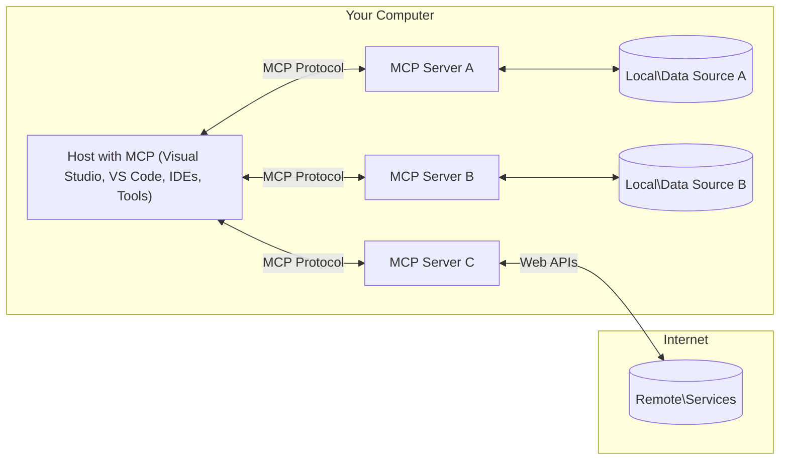

<!--
CO_OP_TRANSLATOR_METADATA:
{
  "original_hash": "904b59de1de9264801242d90a42cdd9d",
  "translation_date": "2025-09-05T10:16:33+00:00",
  "source_file": "01-CoreConcepts/README.md",
  "language_code": "de"
}
-->
# MCP Kernkonzepte: Beherrschung des Model Context Protocol für KI-Integration

[](https://youtu.be/earDzWGtE84)

_(Klicken Sie auf das Bild oben, um das Video zu dieser Lektion anzusehen)_

Das [Model Context Protocol (MCP)](https://github.com/modelcontextprotocol) ist ein leistungsstarkes, standardisiertes Framework, das die Kommunikation zwischen großen Sprachmodellen (LLMs) und externen Tools, Anwendungen und Datenquellen optimiert. 
Dieser Leitfaden führt Sie durch die Kernkonzepte von MCP. Sie erfahren mehr über die Client-Server-Architektur, die wesentlichen Komponenten, Kommunikationsmechanismen und bewährte Implementierungspraktiken.

- **Explizite Zustimmung des Nutzers**: Jeder Datenzugriff und jede Operation erfordert die ausdrückliche Zustimmung des Nutzers vor der Ausführung. Nutzer müssen genau verstehen, welche Daten abgerufen werden und welche Aktionen durchgeführt werden, mit detaillierter Kontrolle über Berechtigungen und Autorisierungen.

- **Schutz der Datenprivatsphäre**: Nutzerdaten dürfen nur mit ausdrücklicher Zustimmung offengelegt werden und müssen während des gesamten Interaktionszyklus durch robuste Zugriffskontrollen geschützt werden. Implementierungen müssen unbefugte Datenübertragungen verhindern und strenge Datenschutzgrenzen einhalten.

- **Sicherheit bei Tool-Ausführungen**: Jede Tool-Ausführung erfordert die ausdrückliche Zustimmung des Nutzers mit einem klaren Verständnis der Funktionalität, Parameter und möglichen Auswirkungen des Tools. Robuste Sicherheitsgrenzen müssen unbeabsichtigte, unsichere oder böswillige Tool-Ausführungen verhindern.

- **Transportsicherheit**: Alle Kommunikationskanäle sollten geeignete Verschlüsselungs- und Authentifizierungsmechanismen verwenden. Remote-Verbindungen sollten sichere Transportprotokolle und ein ordnungsgemäßes Credential-Management implementieren.

#### Implementierungsrichtlinien:

- **Berechtigungsmanagement**: Implementieren Sie fein abgestufte Berechtigungssysteme, die es Nutzern ermöglichen, zu kontrollieren, welche Server, Tools und Ressourcen zugänglich sind.
- **Authentifizierung & Autorisierung**: Verwenden Sie sichere Authentifizierungsmethoden (OAuth, API-Schlüssel) mit ordnungsgemäßem Token-Management und Ablaufzeiten.  
- **Eingabevalidierung**: Validieren Sie alle Parameter und Dateneingaben gemäß definierten Schemata, um Injektionsangriffe zu verhindern.
- **Audit-Logging**: Führen Sie umfassende Protokolle aller Operationen für Sicherheitsüberwachung und Compliance.

## Überblick

Diese Lektion untersucht die grundlegende Architektur und die Komponenten, die das Model Context Protocol (MCP)-Ökosystem ausmachen. Sie lernen die Client-Server-Architektur, die Schlüsselkomponenten und die Kommunikationsmechanismen kennen, die MCP-Interaktionen ermöglichen.

## Wichtige Lernziele

Am Ende dieser Lektion werden Sie:

- Die MCP-Client-Server-Architektur verstehen.
- Rollen und Verantwortlichkeiten von Hosts, Clients und Servern identifizieren.
- Die Kernmerkmale analysieren, die MCP zu einer flexiblen Integrationsschicht machen.
- Verstehen, wie Informationen innerhalb des MCP-Ökosystems fließen.
- Praktische Einblicke durch Codebeispiele in .NET, Java, Python und JavaScript gewinnen.

## MCP-Architektur: Ein tieferer Einblick

Das MCP-Ökosystem basiert auf einem Client-Server-Modell. Diese modulare Struktur ermöglicht es KI-Anwendungen, effizient mit Tools, Datenbanken, APIs und kontextuellen Ressourcen zu interagieren. Lassen Sie uns diese Architektur in ihre Kernkomponenten aufschlüsseln.

Im Kern folgt MCP einer Client-Server-Architektur, bei der eine Host-Anwendung mehrere Server verbinden kann:



- **MCP Hosts**: Programme wie VSCode, Claude Desktop, IDEs oder KI-Tools, die über MCP auf Daten zugreifen möchten.
- **MCP Clients**: Protokoll-Clients, die 1:1-Verbindungen zu Servern aufrechterhalten.
- **MCP Server**: Leichtgewichtige Programme, die spezifische Funktionen über das standardisierte Model Context Protocol bereitstellen.
- **Lokale Datenquellen**: Dateien, Datenbanken und Dienste Ihres Computers, auf die MCP-Server sicher zugreifen können.
- **Remote-Dienste**: Externe Systeme, die über das Internet verfügbar sind und mit denen MCP-Server über APIs verbunden werden können.

Das MCP-Protokoll ist ein sich entwickelnder Standard, der datumsbasierte Versionierung (YYYY-MM-DD-Format) verwendet. Die aktuelle Protokollversion ist **2025-06-18**. Die neuesten Updates zur [Protokollspezifikation](https://modelcontextprotocol.io/specification/2025-06-18/) können Sie hier einsehen.

### 1. Hosts

Im Model Context Protocol (MCP) sind **Hosts** KI-Anwendungen, die als primäre Schnittstelle dienen, über die Nutzer mit dem Protokoll interagieren. Hosts koordinieren und verwalten Verbindungen zu mehreren MCP-Servern, indem sie dedizierte MCP-Clients für jede Serververbindung erstellen. Beispiele für Hosts sind:

- **KI-Anwendungen**: Claude Desktop, Visual Studio Code, Claude Code
- **Entwicklungsumgebungen**: IDEs und Code-Editoren mit MCP-Integration  
- **Benutzerdefinierte Anwendungen**: Speziell entwickelte KI-Agenten und Tools

**Hosts** sind Anwendungen, die KI-Modell-Interaktionen koordinieren. Sie:

- **Orchestrieren KI-Modelle**: Führen LLMs aus oder interagieren mit ihnen, um Antworten zu generieren und KI-Workflows zu koordinieren.
- **Verwalten Client-Verbindungen**: Erstellen und pflegen einen MCP-Client pro MCP-Server-Verbindung.
- **Steuern die Benutzeroberfläche**: Handhaben Gesprächsfluss, Nutzerinteraktionen und Antwortpräsentation.  
- **Erzwingen Sicherheit**: Kontrollieren Berechtigungen, Sicherheitsbeschränkungen und Authentifizierung.
- **Verwalten Nutzerzustimmung**: Handhaben Nutzerfreigaben für Datenfreigabe und Tool-Ausführung.

### 2. Clients

**Clients** sind wesentliche Komponenten, die dedizierte Eins-zu-eins-Verbindungen zwischen Hosts und MCP-Servern aufrechterhalten. Jeder MCP-Client wird vom Host instanziiert, um eine Verbindung zu einem bestimmten MCP-Server herzustellen, wodurch organisierte und sichere Kommunikationskanäle gewährleistet werden. Mehrere Clients ermöglichen es Hosts, gleichzeitig mit mehreren Servern zu kommunizieren.

**Clients** sind Verbindungskomponenten innerhalb der Host-Anwendung. Sie:

- **Protokollkommunikation**: Senden JSON-RPC 2.0-Anfragen an Server mit Eingabeaufforderungen und Anweisungen.
- **Fähigkeitsverhandlung**: Verhandeln unterstützte Funktionen und Protokollversionen mit Servern während der Initialisierung.
- **Tool-Ausführung**: Verwalten Tool-Ausführungsanfragen von Modellen und verarbeiten Antworten.
- **Echtzeit-Updates**: Handhaben Benachrichtigungen und Echtzeit-Updates von Servern.
- **Antwortverarbeitung**: Verarbeiten und formatieren Serverantworten zur Anzeige für Nutzer.

### 3. Server

**Server** sind Programme, die Kontext, Tools und Funktionen für MCP-Clients bereitstellen. Sie können lokal (auf demselben Rechner wie der Host) oder remote (auf externen Plattformen) ausgeführt werden und sind dafür verantwortlich, Client-Anfragen zu bearbeiten und strukturierte Antworten bereitzustellen. Server stellen spezifische Funktionen über das standardisierte Model Context Protocol bereit.

**Server** sind Dienste, die Kontext und Funktionen bereitstellen. Sie:

- **Funktionsregistrierung**: Registrieren und stellen verfügbare Primitiven (Ressourcen, Eingabeaufforderungen, Tools) für Clients bereit.
- **Anfrageverarbeitung**: Empfangen und führen Tool-Aufrufe, Ressourcenanfragen und Eingabeaufforderungsanfragen von Clients aus.
- **Kontextbereitstellung**: Stellen kontextuelle Informationen und Daten bereit, um Modellantworten zu verbessern.
- **Zustandsmanagement**: Verwalten Sitzungszustände und handhaben zustandsbehaftete Interaktionen bei Bedarf.
- **Echtzeit-Benachrichtigungen**: Senden Benachrichtigungen über Funktionsänderungen und Updates an verbundene Clients.

Server können von jedem entwickelt werden, um Modellfunktionen mit spezialisierter Funktionalität zu erweitern, und sie unterstützen sowohl lokale als auch remote Bereitstellungsszenarien.

### 4. Server-Primitiven

Server im Model Context Protocol (MCP) bieten drei Kern-**Primitiven**, die die grundlegenden Bausteine für reichhaltige Interaktionen zwischen Clients, Hosts und Sprachmodellen definieren. Diese Primitiven spezifizieren die Arten von kontextuellen Informationen und Aktionen, die über das Protokoll verfügbar sind.

MCP-Server können jede Kombination der folgenden drei Kernprimitiven bereitstellen:

#### Ressourcen 

**Ressourcen** sind Datenquellen, die kontextuelle Informationen für KI-Anwendungen bereitstellen. Sie repräsentieren statische oder dynamische Inhalte, die das Modellverständnis und die Entscheidungsfindung verbessern können:

- **Kontextuelle Daten**: Strukturierte Informationen und Kontext für den Verbrauch durch KI-Modelle.
- **Wissensdatenbanken**: Dokumenten-Repositories, Artikel, Handbücher und Forschungspapiere.
- **Lokale Datenquellen**: Dateien, Datenbanken und lokale Systeminformationen.  
- **Externe Daten**: API-Antworten, Webdienste und Daten aus entfernten Systemen.
- **Dynamische Inhalte**: Echtzeitdaten, die sich basierend auf externen Bedingungen aktualisieren.

Ressourcen werden durch URIs identifiziert und unterstützen die Entdeckung über `resources/list` und den Abruf über `resources/read`-Methoden:

```text
file://documents/project-spec.md
database://production/users/schema
api://weather/current
```

#### Eingabeaufforderungen

**Eingabeaufforderungen** sind wiederverwendbare Vorlagen, die helfen, Interaktionen mit Sprachmodellen zu strukturieren. Sie bieten standardisierte Interaktionsmuster und vorgefertigte Workflows:

- **Vorlagenbasierte Interaktionen**: Vorgefertigte Nachrichten und Gesprächsanfänge.
- **Workflow-Vorlagen**: Standardisierte Sequenzen für häufige Aufgaben und Interaktionen.
- **Few-shot-Beispiele**: Beispielbasierte Vorlagen für Modellanweisungen.
- **Systemaufforderungen**: Grundlegende Eingabeaufforderungen, die Modellverhalten und Kontext definieren.
- **Dynamische Vorlagen**: Parametrisierte Eingabeaufforderungen, die sich an spezifische Kontexte anpassen.

Eingabeaufforderungen unterstützen Variablensubstitution und können über `prompts/list` entdeckt und mit `prompts/get` abgerufen werden:

```markdown
Generate a {{task_type}} for {{product}} targeting {{audience}} with the following requirements: {{requirements}}
```

#### Tools

**Tools** sind ausführbare Funktionen, die KI-Modelle aufrufen können, um spezifische Aktionen auszuführen. Sie repräsentieren die "Verben" des MCP-Ökosystems und ermöglichen es Modellen, mit externen Systemen zu interagieren:

- **Ausführbare Funktionen**: Diskrete Operationen, die Modelle mit spezifischen Parametern aufrufen können.
- **Integration externer Systeme**: API-Aufrufe, Datenbankabfragen, Dateioperationen, Berechnungen.
- **Eindeutige Identität**: Jedes Tool hat einen eindeutigen Namen, eine Beschreibung und ein Parameterschema.
- **Strukturierte I/O**: Tools akzeptieren validierte Parameter und geben strukturierte, typisierte Antworten zurück.
- **Aktionsfähigkeiten**: Ermöglichen es Modellen, reale Aktionen auszuführen und Live-Daten abzurufen.

Tools werden mit JSON-Schema für die Parametervalidierung definiert und können über `tools/list` entdeckt und über `tools/call` ausgeführt werden:

```typescript
server.tool(
  "search_products", 
  {
    query: z.string().describe("Search query for products"),
    category: z.string().optional().describe("Product category filter"),
    max_results: z.number().default(10).describe("Maximum results to return")
  }, 
  async (params) => {
    // Execute search and return structured results
    return await productService.search(params);
  }
);
```

## Client-Primitiven

Im Model Context Protocol (MCP) können **Clients** Primitiven bereitstellen, die es Servern ermöglichen, zusätzliche Funktionen von der Host-Anwendung anzufordern. Diese clientseitigen Primitiven ermöglichen reichhaltigere, interaktivere Serverimplementierungen, die auf KI-Modellfähigkeiten und Nutzerinteraktionen zugreifen können.

### Sampling

**Sampling** ermöglicht es Servern, Sprachmodell-Vervollständigungen von der KI-Anwendung des Clients anzufordern. Dieses Primitive erlaubt es Servern, auf LLM-Funktionen zuzugreifen, ohne eigene Modellabhängigkeiten einzubinden:

- **Modellunabhängiger Zugriff**: Server können Vervollständigungen anfordern, ohne LLM-SDKs einzubinden oder Modellzugriff zu verwalten.
- **Server-initiiertes KI**: Ermöglicht es Servern, autonom Inhalte mit dem KI-Modell des Clients zu generieren.
- **Rekursive LLM-Interaktionen**: Unterstützt komplexe Szenarien, bei denen Server KI-Unterstützung für die Verarbeitung benötigen.
- **Dynamische Inhaltserstellung**: Ermöglicht es Servern, kontextuelle Antworten mit dem Modell des Hosts zu erstellen.

Sampling wird über die Methode `sampling/complete` initiiert, bei der Server Vervollständigungsanfragen an Clients senden.

### Elicitation  

**Elicitation** ermöglicht es Servern, zusätzliche Informationen oder Bestätigungen von Nutzern über die Client-Schnittstelle anzufordern:

- **Nutzer-Eingabeanfragen**: Server können zusätzliche Informationen anfordern, die für die Tool-Ausführung benötigt werden.
- **Bestätigungsdialoge**: Anfordern der Nutzerfreigabe für sensible oder wirkungsvolle Operationen.
- **Interaktive Workflows**: Ermöglichen es Servern, schrittweise Nutzerinteraktionen zu erstellen.
- **Dynamische Parametererfassung**: Sammeln fehlender oder optionaler Parameter während der Tool-Ausführung.

Elicitation-Anfragen werden über die Methode `elicitation/request` gestellt, um Nutzereingaben über die Client-Schnittstelle zu sammeln.

### Logging

**Logging** ermöglicht es Servern, strukturierte Log-Nachrichten an Clients zu senden, um Debugging, Überwachung und operative Transparenz zu unterstützen:

- **Debugging-Unterstützung**: Ermöglicht es Servern, detaillierte Ausführungsprotokolle für die Fehlerbehebung bereitzustellen.
- **Operative Überwachung**: Senden von Statusaktualisierungen und Leistungsmetriken an Clients.
- **Fehlermeldung**: Bereitstellung detaillierter Fehlerkontexte und Diagnosedaten.
- **Audit-Trails**: Erstellung umfassender Protokolle von Serveroperationen und Entscheidungen.

Log-Nachrichten werden an Clients gesendet, um Transparenz in Serveroperationen zu schaffen und Debugging zu erleichtern.

## Informationsfluss in MCP

Das Model Context Protocol (MCP) definiert einen strukturierten Informationsfluss zwischen Hosts, Clients, Servern und Modellen. Das Verständnis dieses Flusses hilft, zu klären, wie Nutzeranfragen verarbeitet werden und wie externe Tools und Daten in Modellantworten integriert werden.

- **Host initiiert Verbindung**  
  Die Host-Anwendung (z. B. eine IDE oder Chat-Schnittstelle) stellt eine Verbindung zu einem MCP-Server her, typischerweise über STDIO, WebSocket oder ein anderes unterstütztes Transportprotokoll.

- **Fähigkeitsverhandlung**  
  Der Client (eingebettet im Host) und der Server tauschen Informationen über ihre unterstützten Funktionen, Tools, Ressourcen und Protokollversionen aus. Dies stellt sicher, dass beide Seiten verstehen, welche Fähigkeiten für die Sitzung verfügbar sind.

- **Nutzeranfrage**  
  Der Nutzer interagiert mit dem Host (z. B. gibt eine Eingabeaufforderung oder einen Befehl ein). Der Host sammelt diese Eingabe und leitet sie zur Verarbeitung an den Client weiter.

- **Ressourcen- oder Tool-Nutzung**  
  - Der Client kann zusätzliche Kontexte oder Ressourcen vom Server anfordern (z. B. Dateien, Datenbankeinträge oder Wissensdatenbankartikel), um das Verständnis des Modells zu bereichern.
  - Wenn das Modell feststellt, dass ein Tool benötigt wird (z. B. um Daten abzurufen, eine Berechnung durchzuführen oder eine API aufzurufen), sendet der Client eine Tool-Aufrufanfrage an den Server, wobei der Tool-Name und die Parameter angegeben werden.

- **Serverausführung**  
  Der Server empfängt die Ressourcen- oder Tool-Anfrage, führt die erforderlichen Operationen aus (z. B. eine Funktion ausführen, eine Datenbank abfragen oder eine Datei abrufen) und gibt die Ergebnisse in einem strukturierten Format an den Client zurück.

- **Antwortgenerierung**  
  Der Client integriert die Antworten des Servers (Ressourcendaten, Tool-Ausgaben usw.) in die laufende Modellinteraktion. Das Modell verwendet diese Informationen, um eine umfassende und kontextuell relevante Antwort zu generieren.

- **Ergebnispräsentation**  
  Der Host empfängt die endgültige Ausgabe vom Client und präsentiert sie dem Nutzer, oft einschließlich sowohl des vom Modell generierten Textes als auch der Ergebnisse von Tool-Ausführungen oder Ressourcenabfragen.

Dieser Fluss ermöglicht es MCP, fortschrittliche, interaktive und kontextbewusste KI-Anwendungen zu unterstützen, indem Modelle nahtlos mit externen Tools und Datenquellen verbunden werden.

## Protokollarchitektur & Schichten

MCP besteht aus zwei unterschiedlichen Architekturschichten, die zusammenarbeiten, um ein vollständiges Kommunikationsframework bereitzustellen:

### Datenschicht

Die **Datenschicht** implementiert das Kern-MCP-Protokoll unter Verwendung von **JSON-RPC 2.0** als Grundlage. Diese Schicht definiert die Nachrichtenstruktur, Semantik und Interaktionsmuster:

#### Kernkomponenten:
- **JSON-RPC 2.0-Protokoll**: Die gesamte Kommunikation verwendet das standardisierte JSON-RPC 2.0-Nachrichtenformat für Methodenaufrufe, Antworten und Benachrichtigungen.  
- **Lebenszyklusverwaltung**: Behandelt die Initialisierung der Verbindung, die Aushandlung von Fähigkeiten und die Beendigung der Sitzung zwischen Clients und Servern.  
- **Server-Primitiven**: Ermöglicht es Servern, Kernfunktionen über Werkzeuge, Ressourcen und Eingabeaufforderungen bereitzustellen.  
- **Client-Primitiven**: Ermöglicht es Servern, Abtastungen von LLMs anzufordern, Benutzereingaben zu erfragen und Protokollnachrichten zu senden.  
- **Echtzeit-Benachrichtigungen**: Unterstützt asynchrone Benachrichtigungen für dynamische Updates ohne Abfragen.  

#### Hauptmerkmale:

- **Protokollversionsaushandlung**: Verwendet datumsbasierte Versionierung (JJJJ-MM-TT), um Kompatibilität sicherzustellen.  
- **Fähigkeitserkennung**: Clients und Server tauschen während der Initialisierung Informationen über unterstützte Funktionen aus.  
- **Zustandsbehaftete Sitzungen**: Beibehaltung des Verbindungszustands über mehrere Interaktionen hinweg für Kontextkontinuität.  

### Transportschicht

Die **Transportschicht** verwaltet Kommunikationskanäle, Nachrichtenrahmen und Authentifizierung zwischen MCP-Teilnehmern:

#### Unterstützte Transportmechanismen:

1. **STDIO-Transport**:  
   - Verwendet Standard-Ein-/Ausgabeströme für direkte Prozesskommunikation.  
   - Optimal für lokale Prozesse auf derselben Maschine ohne Netzwerk-Overhead.  
   - Häufig verwendet für lokale MCP-Serverimplementierungen.  

2. **Streambarer HTTP-Transport**:  
   - Verwendet HTTP POST für Nachrichten vom Client zum Server.  
   - Optionale Server-Sent Events (SSE) für serverseitiges Streaming zum Client.  
   - Ermöglicht die Kommunikation mit entfernten Servern über Netzwerke hinweg.  
   - Unterstützt standardmäßige HTTP-Authentifizierung (Bearer-Tokens, API-Schlüssel, benutzerdefinierte Header).  
   - MCP empfiehlt OAuth für sichere, tokenbasierte Authentifizierung.  

#### Transportabstraktion:

Die Transportschicht abstrahiert Kommunikationsdetails von der Datenschicht und ermöglicht die Verwendung desselben JSON-RPC 2.0-Nachrichtenformats über alle Transportmechanismen hinweg. Diese Abstraktion erlaubt es Anwendungen, nahtlos zwischen lokalen und entfernten Servern zu wechseln.  

### Sicherheitsüberlegungen

MCP-Implementierungen müssen mehrere wichtige Sicherheitsprinzipien einhalten, um sichere, vertrauenswürdige und geschützte Interaktionen über alle Protokolloperationen hinweg zu gewährleisten:

- **Benutzerzustimmung und Kontrolle**: Benutzer müssen ausdrücklich zustimmen, bevor Daten abgerufen oder Operationen ausgeführt werden. Sie sollten klare Kontrolle darüber haben, welche Daten geteilt und welche Aktionen autorisiert werden, unterstützt durch intuitive Benutzeroberflächen zur Überprüfung und Genehmigung von Aktivitäten.  

- **Datenschutz**: Benutzerdaten dürfen nur mit ausdrücklicher Zustimmung offengelegt werden und müssen durch geeignete Zugriffskontrollen geschützt sein. MCP-Implementierungen müssen sicherstellen, dass keine unbefugte Datenübertragung erfolgt und die Privatsphäre während aller Interaktionen gewahrt bleibt.  

- **Werkzeugsicherheit**: Vor der Ausführung eines Werkzeugs ist eine ausdrückliche Zustimmung des Benutzers erforderlich. Benutzer sollten ein klares Verständnis der Funktionalität jedes Werkzeugs haben, und robuste Sicherheitsgrenzen müssen durchgesetzt werden, um unbeabsichtigte oder unsichere Werkzeugausführungen zu verhindern.  

Durch die Einhaltung dieser Sicherheitsprinzipien stellt MCP sicher, dass Vertrauen, Datenschutz und Sicherheit der Benutzer bei allen Protokollinteraktionen gewahrt bleiben, während leistungsstarke KI-Integrationen ermöglicht werden.  

## Codebeispiele: Wichtige Komponenten

Nachfolgend finden Sie Codebeispiele in mehreren beliebten Programmiersprachen, die zeigen, wie wichtige MCP-Serverkomponenten und Werkzeuge implementiert werden können.  

### .NET-Beispiel: Erstellen eines einfachen MCP-Servers mit Werkzeugen

Hier ist ein praktisches .NET-Codebeispiel, das zeigt, wie ein einfacher MCP-Server mit benutzerdefinierten Werkzeugen implementiert wird. Dieses Beispiel zeigt, wie Werkzeuge definiert und registriert, Anfragen bearbeitet und der Server verbunden wird.  

```csharp
using System;
using System.Threading.Tasks;
using ModelContextProtocol.Server;
using ModelContextProtocol.Server.Transport;
using ModelContextProtocol.Server.Tools;

public class WeatherServer
{
    public static async Task Main(string[] args)
    {
        // Create an MCP server
        var server = new McpServer(
            name: "Weather MCP Server",
            version: "1.0.0"
        );
        
        // Register our custom weather tool
        server.AddTool<string, WeatherData>("weatherTool", 
            description: "Gets current weather for a location",
            execute: async (location) => {
                // Call weather API (simplified)
                var weatherData = await GetWeatherDataAsync(location);
                return weatherData;
            });
        
        // Connect the server using stdio transport
        var transport = new StdioServerTransport();
        await server.ConnectAsync(transport);
        
        Console.WriteLine("Weather MCP Server started");
        
        // Keep the server running until process is terminated
        await Task.Delay(-1);
    }
    
    private static async Task<WeatherData> GetWeatherDataAsync(string location)
    {
        // This would normally call a weather API
        // Simplified for demonstration
        await Task.Delay(100); // Simulate API call
        return new WeatherData { 
            Temperature = 72.5,
            Conditions = "Sunny",
            Location = location
        };
    }
}

public class WeatherData
{
    public double Temperature { get; set; }
    public string Conditions { get; set; }
    public string Location { get; set; }
}
```  

### Java-Beispiel: MCP-Serverkomponenten

Dieses Beispiel zeigt dieselbe MCP-Server- und Werkzeugregistrierung wie das .NET-Beispiel oben, jedoch in Java implementiert.  

```java
import io.modelcontextprotocol.server.McpServer;
import io.modelcontextprotocol.server.McpToolDefinition;
import io.modelcontextprotocol.server.transport.StdioServerTransport;
import io.modelcontextprotocol.server.tool.ToolExecutionContext;
import io.modelcontextprotocol.server.tool.ToolResponse;

public class WeatherMcpServer {
    public static void main(String[] args) throws Exception {
        // Create an MCP server
        McpServer server = McpServer.builder()
            .name("Weather MCP Server")
            .version("1.0.0")
            .build();
            
        // Register a weather tool
        server.registerTool(McpToolDefinition.builder("weatherTool")
            .description("Gets current weather for a location")
            .parameter("location", String.class)
            .execute((ToolExecutionContext ctx) -> {
                String location = ctx.getParameter("location", String.class);
                
                // Get weather data (simplified)
                WeatherData data = getWeatherData(location);
                
                // Return formatted response
                return ToolResponse.content(
                    String.format("Temperature: %.1f°F, Conditions: %s, Location: %s", 
                    data.getTemperature(), 
                    data.getConditions(), 
                    data.getLocation())
                );
            })
            .build());
        
        // Connect the server using stdio transport
        try (StdioServerTransport transport = new StdioServerTransport()) {
            server.connect(transport);
            System.out.println("Weather MCP Server started");
            // Keep server running until process is terminated
            Thread.currentThread().join();
        }
    }
    
    private static WeatherData getWeatherData(String location) {
        // Implementation would call a weather API
        // Simplified for example purposes
        return new WeatherData(72.5, "Sunny", location);
    }
}

class WeatherData {
    private double temperature;
    private String conditions;
    private String location;
    
    public WeatherData(double temperature, String conditions, String location) {
        this.temperature = temperature;
        this.conditions = conditions;
        this.location = location;
    }
    
    public double getTemperature() {
        return temperature;
    }
    
    public String getConditions() {
        return conditions;
    }
    
    public String getLocation() {
        return location;
    }
}
```  

### Python-Beispiel: Aufbau eines MCP-Servers

Dieses Beispiel verwendet fastmcp. Bitte stellen Sie sicher, dass Sie es zuerst installieren:  

```python
pip install fastmcp
```  
Codebeispiel:  

```python
#!/usr/bin/env python3
import asyncio
from fastmcp import FastMCP
from fastmcp.transports.stdio import serve_stdio

# Create a FastMCP server
mcp = FastMCP(
    name="Weather MCP Server",
    version="1.0.0"
)

@mcp.tool()
def get_weather(location: str) -> dict:
    """Gets current weather for a location."""
    return {
        "temperature": 72.5,
        "conditions": "Sunny",
        "location": location
    }

# Alternative approach using a class
class WeatherTools:
    @mcp.tool()
    def forecast(self, location: str, days: int = 1) -> dict:
        """Gets weather forecast for a location for the specified number of days."""
        return {
            "location": location,
            "forecast": [
                {"day": i+1, "temperature": 70 + i, "conditions": "Partly Cloudy"}
                for i in range(days)
            ]
        }

# Register class tools
weather_tools = WeatherTools()

# Start the server
if __name__ == "__main__":
    asyncio.run(serve_stdio(mcp))
```  

### JavaScript-Beispiel: Erstellen eines MCP-Servers

Dieses Beispiel zeigt die Erstellung eines MCP-Servers in JavaScript und wie zwei wetterbezogene Werkzeuge registriert werden.  

```javascript
// Using the official Model Context Protocol SDK
import { McpServer } from "@modelcontextprotocol/sdk/server/mcp.js";
import { StdioServerTransport } from "@modelcontextprotocol/sdk/server/stdio.js";
import { z } from "zod"; // For parameter validation

// Create an MCP server
const server = new McpServer({
  name: "Weather MCP Server",
  version: "1.0.0"
});

// Define a weather tool
server.tool(
  "weatherTool",
  {
    location: z.string().describe("The location to get weather for")
  },
  async ({ location }) => {
    // This would normally call a weather API
    // Simplified for demonstration
    const weatherData = await getWeatherData(location);
    
    return {
      content: [
        { 
          type: "text", 
          text: `Temperature: ${weatherData.temperature}°F, Conditions: ${weatherData.conditions}, Location: ${weatherData.location}` 
        }
      ]
    };
  }
);

// Define a forecast tool
server.tool(
  "forecastTool",
  {
    location: z.string(),
    days: z.number().default(3).describe("Number of days for forecast")
  },
  async ({ location, days }) => {
    // This would normally call a weather API
    // Simplified for demonstration
    const forecast = await getForecastData(location, days);
    
    return {
      content: [
        { 
          type: "text", 
          text: `${days}-day forecast for ${location}: ${JSON.stringify(forecast)}` 
        }
      ]
    };
  }
);

// Helper functions
async function getWeatherData(location) {
  // Simulate API call
  return {
    temperature: 72.5,
    conditions: "Sunny",
    location: location
  };
}

async function getForecastData(location, days) {
  // Simulate API call
  return Array.from({ length: days }, (_, i) => ({
    day: i + 1,
    temperature: 70 + Math.floor(Math.random() * 10),
    conditions: i % 2 === 0 ? "Sunny" : "Partly Cloudy"
  }));
}

// Connect the server using stdio transport
const transport = new StdioServerTransport();
server.connect(transport).catch(console.error);

console.log("Weather MCP Server started");
```  

Dieses JavaScript-Beispiel zeigt, wie ein MCP-Client erstellt wird, der sich mit einem Server verbindet, eine Eingabeaufforderung sendet und die Antwort einschließlich aller aufgerufenen Werkzeuge verarbeitet.  

## Sicherheit und Autorisierung

MCP umfasst mehrere integrierte Konzepte und Mechanismen zur Verwaltung von Sicherheit und Autorisierung im gesamten Protokoll:

1. **Werkzeugberechtigungssteuerung**:  
   Clients können festlegen, welche Werkzeuge ein Modell während einer Sitzung verwenden darf. Dies stellt sicher, dass nur ausdrücklich autorisierte Werkzeuge zugänglich sind, wodurch das Risiko unbeabsichtigter oder unsicherer Operationen reduziert wird. Berechtigungen können dynamisch basierend auf Benutzerpräferenzen, organisatorischen Richtlinien oder dem Kontext der Interaktion konfiguriert werden.  

2. **Authentifizierung**:  
   Server können eine Authentifizierung verlangen, bevor Zugriff auf Werkzeuge, Ressourcen oder sensible Operationen gewährt wird. Dies kann API-Schlüssel, OAuth-Tokens oder andere Authentifizierungsschemata umfassen. Eine ordnungsgemäße Authentifizierung stellt sicher, dass nur vertrauenswürdige Clients und Benutzer serverseitige Funktionen aufrufen können.  

3. **Validierung**:  
   Die Parameterüberprüfung wird für alle Werkzeugaufrufe durchgesetzt. Jedes Werkzeug definiert die erwarteten Typen, Formate und Einschränkungen für seine Parameter, und der Server validiert eingehende Anfragen entsprechend. Dies verhindert, dass fehlerhafte oder bösartige Eingaben die Werkzeugimplementierungen erreichen, und trägt zur Integrität der Operationen bei.  

4. **Ratenbegrenzung**:  
   Um Missbrauch zu verhindern und eine faire Nutzung der Serverressourcen sicherzustellen, können MCP-Server Ratenbegrenzungen für Werkzeugaufrufe und Ressourcenzugriffe implementieren. Ratenbegrenzungen können pro Benutzer, pro Sitzung oder global angewendet werden und helfen, sich vor Denial-of-Service-Angriffen oder übermäßigem Ressourcenverbrauch zu schützen.  

Durch die Kombination dieser Mechanismen bietet MCP eine sichere Grundlage für die Integration von Sprachmodellen mit externen Werkzeugen und Datenquellen, während Benutzern und Entwicklern eine fein abgestimmte Kontrolle über Zugriff und Nutzung ermöglicht wird.  

## Protokollnachrichten & Kommunikationsfluss

Die MCP-Kommunikation verwendet strukturierte **JSON-RPC 2.0**-Nachrichten, um klare und zuverlässige Interaktionen zwischen Hosts, Clients und Servern zu ermöglichen. Das Protokoll definiert spezifische Nachrichtenmuster für verschiedene Arten von Operationen:  

### Kernnachrichtentypen:

#### **Initialisierungsnachrichten**  
- **`initialize`-Anfrage**: Stellt die Verbindung her und verhandelt Protokollversion und Fähigkeiten.  
- **`initialize`-Antwort**: Bestätigt unterstützte Funktionen und Serverinformationen.  
- **`notifications/initialized`**: Signalisiert, dass die Initialisierung abgeschlossen ist und die Sitzung bereit ist.  

#### **Erkennungsnachrichten**  
- **`tools/list`-Anfrage**: Erkennt verfügbare Werkzeuge vom Server.  
- **`resources/list`-Anfrage**: Listet verfügbare Ressourcen (Datenquellen) auf.  
- **`prompts/list`-Anfrage**: Ruft verfügbare Eingabeaufforderungsvorlagen ab.  

#### **Ausführungsnachrichten**  
- **`tools/call`-Anfrage**: Führt ein bestimmtes Werkzeug mit bereitgestellten Parametern aus.  
- **`resources/read`-Anfrage**: Ruft Inhalte aus einer bestimmten Ressource ab.  
- **`prompts/get`-Anfrage**: Ruft eine Eingabeaufforderungsvorlage mit optionalen Parametern ab.  

#### **Clientseitige Nachrichten**  
- **`sampling/complete`-Anfrage**: Server fordert LLM-Vervollständigung vom Client an.  
- **`elicitation/request`**: Server fordert Benutzereingaben über die Client-Oberfläche an.  
- **Protokollnachrichten**: Server sendet strukturierte Protokollnachrichten an den Client.  

#### **Benachrichtigungsnachrichten**  
- **`notifications/tools/list_changed`**: Server benachrichtigt den Client über Werkzeugänderungen.  
- **`notifications/resources/list_changed`**: Server benachrichtigt den Client über Ressourcenänderungen.  
- **`notifications/prompts/list_changed`**: Server benachrichtigt den Client über Änderungen an Eingabeaufforderungen.  

### Nachrichtenstruktur:

Alle MCP-Nachrichten folgen dem JSON-RPC 2.0-Format mit:  
- **Anfragenachrichten**: Enthalten `id`, `method` und optionale `params`.  
- **Antwortnachrichten**: Enthalten `id` und entweder `result` oder `error`.  
- **Benachrichtigungsnachrichten**: Enthalten `method` und optionale `params` (keine `id` oder Antwort erwartet).  

Diese strukturierte Kommunikation gewährleistet zuverlässige, nachvollziehbare und erweiterbare Interaktionen, die fortgeschrittene Szenarien wie Echtzeit-Updates, Werkzeugverkettung und robuste Fehlerbehandlung unterstützen.  

## Wichtige Erkenntnisse

- **Architektur**: MCP verwendet eine Client-Server-Architektur, bei der Hosts mehrere Client-Verbindungen zu Servern verwalten.  
- **Teilnehmer**: Das Ökosystem umfasst Hosts (KI-Anwendungen), Clients (Protokollkonnektoren) und Server (Fähigkeitsanbieter).  
- **Transportmechanismen**: Kommunikation unterstützt STDIO (lokal) und streambares HTTP mit optionalem SSE (entfernt).  
- **Kernprimitive**: Server stellen Werkzeuge (ausführbare Funktionen), Ressourcen (Datenquellen) und Eingabeaufforderungen (Vorlagen) bereit.  
- **Client-Primitiven**: Server können Abtastungen (LLM-Vervollständigungen), Erfragungen (Benutzereingaben) und Protokollierung von Clients anfordern.  
- **Protokollgrundlage**: Basierend auf JSON-RPC 2.0 mit datumsbasierter Versionierung (aktuell: 2025-06-18).  
- **Echtzeitfähigkeiten**: Unterstützt Benachrichtigungen für dynamische Updates und Echtzeitsynchronisierung.  
- **Sicherheit an erster Stelle**: Explizite Benutzerzustimmung, Datenschutz und sichere Übertragung sind Kernanforderungen.  

## Übung

Entwerfen Sie ein einfaches MCP-Werkzeug, das in Ihrem Bereich nützlich wäre. Definieren Sie:  
1. Wie das Werkzeug heißen würde.  
2. Welche Parameter es akzeptieren würde.  
3. Welche Ausgabe es zurückgeben würde.  
4. Wie ein Modell dieses Werkzeug verwenden könnte, um Benutzerprobleme zu lösen.  

---

## Was kommt als Nächstes

Weiter: [Kapitel 2: Sicherheit](../02-Security/README.md)  

---

**Haftungsausschluss**:  
Dieses Dokument wurde mithilfe des KI-Übersetzungsdienstes [Co-op Translator](https://github.com/Azure/co-op-translator) übersetzt. Obwohl wir uns um Genauigkeit bemühen, weisen wir darauf hin, dass automatisierte Übersetzungen Fehler oder Ungenauigkeiten enthalten können. Das Originaldokument in seiner ursprünglichen Sprache sollte als maßgebliche Quelle betrachtet werden. Für kritische Informationen wird eine professionelle menschliche Übersetzung empfohlen. Wir übernehmen keine Haftung für Missverständnisse oder Fehlinterpretationen, die sich aus der Nutzung dieser Übersetzung ergeben.