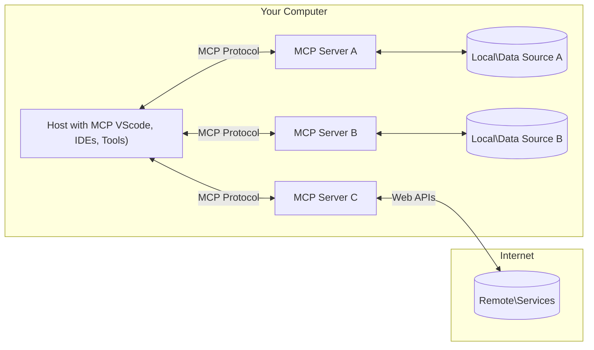

<!--
CO_OP_TRANSLATOR_METADATA:
{
  "original_hash": "355b12a5970c5c9e6db0bee970c751ba",
  "translation_date": "2025-07-13T15:43:52+00:00",
  "source_file": "01-CoreConcepts/README.md",
  "language_code": "de"
}
-->
# 📖 MCP Kernkonzepte: Das Model Context Protocol für die KI-Integration meistern

Das [Model Context Protocol (MCP)](https://github.com/modelcontextprotocol) ist ein leistungsstarkes, standardisiertes Framework, das die Kommunikation zwischen Large Language Models (LLMs) und externen Tools, Anwendungen sowie Datenquellen optimiert. Dieser SEO-optimierte Leitfaden führt dich durch die Kernkonzepte von MCP und stellt sicher, dass du die Client-Server-Architektur, wesentliche Komponenten, Kommunikationsmechanismen und bewährte Implementierungspraktiken verstehst.

## Überblick

Diese Lektion behandelt die grundlegende Architektur und die Komponenten, die das Model Context Protocol (MCP) Ökosystem ausmachen. Du lernst die Client-Server-Architektur, die wichtigsten Bausteine und die Kommunikationsmechanismen kennen, die MCP-Interaktionen ermöglichen.

## 👩‍🎓 Wichtige Lernziele

Am Ende dieser Lektion wirst du:

- Die MCP Client-Server-Architektur verstehen.
- Die Rollen und Verantwortlichkeiten von Hosts, Clients und Servern identifizieren.
- Die Kernfunktionen analysieren, die MCP zu einer flexiblen Integrationsschicht machen.
- Verstehen, wie Informationen im MCP-Ökosystem fließen.
- Praktische Einblicke durch Codebeispiele in .NET, Java, Python und JavaScript gewinnen.

## 🔎 MCP Architektur: Ein genauerer Blick

Das MCP-Ökosystem basiert auf einem Client-Server-Modell. Diese modulare Struktur ermöglicht es KI-Anwendungen, effizient mit Tools, Datenbanken, APIs und kontextuellen Ressourcen zu interagieren. Schauen wir uns diese Architektur anhand ihrer Kernkomponenten genauer an.

Im Kern folgt MCP einer Client-Server-Architektur, bei der eine Host-Anwendung Verbindungen zu mehreren Servern herstellen kann:



- **MCP Hosts**: Programme wie VSCode, Claude Desktop, IDEs oder KI-Tools, die über MCP auf Daten zugreifen möchten
- **MCP Clients**: Protokoll-Clients, die 1:1-Verbindungen zu Servern aufrechterhalten
- **MCP Server**: Leichtgewichtige Programme, die jeweils spezifische Funktionen über das standardisierte Model Context Protocol bereitstellen
- **Lokale Datenquellen**: Dateien, Datenbanken und Dienste auf deinem Computer, auf die MCP-Server sicher zugreifen können
- **Remote Services**: Externe Systeme, die über das Internet verfügbar sind und mit denen MCP-Server über APIs verbunden werden können.

Das MCP-Protokoll ist ein sich entwickelnder Standard. Die neuesten Updates findest du in der [Protokollspezifikation](https://modelcontextprotocol.io/specification/2025-06-18/).

### 1. Hosts

Im Model Context Protocol (MCP) spielen Hosts eine zentrale Rolle als primäre Schnittstelle, über die Nutzer mit dem Protokoll interagieren. Hosts sind Anwendungen oder Umgebungen, die Verbindungen zu MCP-Servern initiieren, um auf Daten, Tools und Prompts zuzugreifen. Beispiele für Hosts sind integrierte Entwicklungsumgebungen (IDEs) wie Visual Studio Code, KI-Tools wie Claude Desktop oder speziell entwickelte Agenten für bestimmte Aufgaben.

**Hosts** sind LLM-Anwendungen, die Verbindungen initiieren. Sie:

- Führen KI-Modelle aus oder interagieren mit ihnen, um Antworten zu generieren.
- Stellen Verbindungen zu MCP-Servern her.
- Steuern den Gesprächsverlauf und die Benutzeroberfläche.
- Kontrollieren Berechtigungen und Sicherheitsvorgaben.
- Verwalten die Zustimmung der Nutzer zur Datenfreigabe und Tool-Ausführung.

### 2. Clients

Clients sind wesentliche Komponenten, die die Interaktion zwischen Hosts und MCP-Servern ermöglichen. Sie fungieren als Vermittler, damit Hosts die Funktionen der MCP-Server nutzen können. Clients spielen eine wichtige Rolle, um eine reibungslose Kommunikation und einen effizienten Datenaustausch innerhalb der MCP-Architektur sicherzustellen.

**Clients** sind Verbindungsstücke innerhalb der Host-Anwendung. Sie:

- Senden Anfragen mit Prompts/Anweisungen an Server.
- Verhandeln Fähigkeiten mit Servern.
- Verwalten Tool-Ausführungsanfragen von Modellen.
- Verarbeiten und zeigen Antworten für Nutzer an.

### 3. Server

Server sind verantwortlich für die Bearbeitung von Anfragen der MCP-Clients und die Bereitstellung entsprechender Antworten. Sie verwalten verschiedene Operationen wie Datenabruf, Tool-Ausführung und Prompt-Generierung. Server sorgen dafür, dass die Kommunikation zwischen Clients und Hosts effizient und zuverlässig ist und die Integrität des Interaktionsprozesses gewahrt bleibt.

**Server** sind Dienste, die Kontext und Funktionen bereitstellen. Sie:

- Registrieren verfügbare Features (Ressourcen, Prompts, Tools)
- Empfangen und führen Tool-Aufrufe vom Client aus
- Stellen kontextuelle Informationen bereit, um Modellantworten zu verbessern
- Liefern Ausgaben zurück an den Client
- Pflegen bei Bedarf den Zustand über Interaktionen hinweg

Server können von jedem entwickelt werden, um Modellfähigkeiten mit spezialisierten Funktionen zu erweitern.

### 4. Server-Funktionen

Server im Model Context Protocol (MCP) bieten grundlegende Bausteine, die reichhaltige Interaktionen zwischen Clients, Hosts und Sprachmodellen ermöglichen. Diese Funktionen sind darauf ausgelegt, die Fähigkeiten von MCP durch strukturierte Kontexte, Tools und Prompts zu erweitern.

MCP-Server können eine oder mehrere der folgenden Funktionen anbieten:

#### 📑 Ressourcen

Ressourcen im Model Context Protocol (MCP) umfassen verschiedene Arten von Kontext und Daten, die von Nutzern oder KI-Modellen genutzt werden können. Dazu gehören:

- **Kontextuelle Daten**: Informationen und Kontext, die Nutzer oder KI-Modelle für Entscheidungen und Aufgaben nutzen können.
- **Wissensdatenbanken und Dokumentenarchive**: Sammlungen strukturierter und unstrukturierter Daten wie Artikel, Handbücher und Forschungsarbeiten, die wertvolle Einblicke und Informationen bieten.
- **Lokale Dateien und Datenbanken**: Daten, die lokal auf Geräten oder in Datenbanken gespeichert sind und für Verarbeitung und Analyse zugänglich sind.
- **APIs und Webservices**: Externe Schnittstellen und Dienste, die zusätzliche Daten und Funktionen bereitstellen und die Integration mit verschiedenen Online-Ressourcen und Tools ermöglichen.

Ein Beispiel für eine Ressource kann ein Datenbankschema oder eine Datei sein, auf die so zugegriffen wird:

```text
file://log.txt
database://schema
```

### 🤖 Prompts

Prompts im Model Context Protocol (MCP) umfassen verschiedene vordefinierte Vorlagen und Interaktionsmuster, die darauf ausgelegt sind, Arbeitsabläufe zu vereinfachen und die Kommunikation zu verbessern. Dazu gehören:

- **Vorstrukturierte Nachrichten und Workflows**: Vorgefertigte Nachrichten und Abläufe, die Nutzer durch bestimmte Aufgaben und Interaktionen führen.
- **Vordefinierte Interaktionsmuster**: Standardisierte Abfolgen von Aktionen und Antworten, die eine konsistente und effiziente Kommunikation ermöglichen.
- **Spezialisierte Gesprächsvorlagen**: Anpassbare Vorlagen, die für bestimmte Gesprächsarten zugeschnitten sind und relevante sowie kontextuell passende Interaktionen sicherstellen.

Eine Prompt-Vorlage könnte so aussehen:

```markdown
Generate a product slogan based on the following {{product}} with the following {{keywords}}
```

#### ⛏️ Tools

Tools im Model Context Protocol (MCP) sind Funktionen, die das KI-Modell ausführen kann, um bestimmte Aufgaben zu erledigen. Diese Tools sind darauf ausgelegt, die Fähigkeiten des KI-Modells durch strukturierte und verlässliche Operationen zu erweitern. Wichtige Aspekte sind:

- **Funktionen, die das KI-Modell ausführen kann**: Tools sind ausführbare Funktionen, die das Modell aufrufen kann, um verschiedene Aufgaben zu erledigen.
- **Eindeutiger Name und Beschreibung**: Jedes Tool hat einen einzigartigen Namen und eine detaillierte Beschreibung, die Zweck und Funktion erklärt.
- **Parameter und Ausgaben**: Tools akzeptieren spezifische Parameter und liefern strukturierte Ausgaben, um konsistente und vorhersehbare Ergebnisse zu gewährleisten.
- **Abgegrenzte Funktionen**: Tools führen abgegrenzte Funktionen aus, wie Websuchen, Berechnungen oder Datenbankabfragen.

Ein Beispiel-Tool könnte so aussehen:

```typescript
server.tool(
  "GetProducts",
  {
    pageSize: z.string().optional(),
    pageCount: z.string().optional()
  }, () => {
    // return results from API
  }
)
```

## Client-Funktionen

Im Model Context Protocol (MCP) bieten Clients mehrere wichtige Funktionen für Server, die die Gesamtfunktionalität und Interaktion innerhalb des Protokolls verbessern. Eine der bemerkenswerten Funktionen ist Sampling.

### 👉 Sampling

- **Server-initiiertes agentisches Verhalten**: Clients ermöglichen es Servern, bestimmte Aktionen oder Verhaltensweisen autonom zu initiieren und so die dynamischen Fähigkeiten des Systems zu erweitern.
- **Rekursive LLM-Interaktionen**: Diese Funktion erlaubt rekursive Interaktionen mit großen Sprachmodellen (LLMs) und ermöglicht komplexere und iterative Aufgabenverarbeitung.
- **Anforderung zusätzlicher Modellvervollständigungen**: Server können zusätzliche Vervollständigungen vom Modell anfordern, um sicherzustellen, dass die Antworten umfassend und kontextuell relevant sind.

## Informationsfluss im MCP

Das Model Context Protocol (MCP) definiert einen strukturierten Informationsfluss zwischen Hosts, Clients, Servern und Modellen. Das Verständnis dieses Flusses hilft zu klären, wie Nutzeranfragen verarbeitet werden und wie externe Tools und Daten in Modellantworten integriert werden.

- **Host initiiert Verbindung**  
  Die Host-Anwendung (z. B. eine IDE oder Chat-Oberfläche) stellt eine Verbindung zu einem MCP-Server her, typischerweise über STDIO, WebSocket oder einen anderen unterstützten Transport.

- **Fähigkeitsverhandlung**  
  Client (eingebettet im Host) und Server tauschen Informationen über ihre unterstützten Funktionen, Tools, Ressourcen und Protokollversionen aus. So wird sichergestellt, dass beide Seiten wissen, welche Fähigkeiten für die Sitzung verfügbar sind.

- **Nutzeranfrage**  
  Der Nutzer interagiert mit dem Host (z. B. durch Eingabe eines Prompts oder Befehls). Der Host sammelt diese Eingabe und leitet sie zur Verarbeitung an den Client weiter.

- **Nutzung von Ressourcen oder Tools**  
  - Der Client kann zusätzliche Kontextinformationen oder Ressourcen vom Server anfordern (z. B. Dateien, Datenbankeinträge oder Wissensdatenbankartikel), um das Verständnis des Modells zu erweitern.  
  - Wenn das Modell feststellt, dass ein Tool benötigt wird (z. B. um Daten abzurufen, eine Berechnung durchzuführen oder eine API aufzurufen), sendet der Client eine Tool-Aufruf-Anfrage an den Server, in der der Tool-Name und die Parameter angegeben sind.

- **Server-Ausführung**  
  Der Server erhält die Anfrage zu Ressourcen oder Tools, führt die notwendigen Operationen aus (z. B. eine Funktion ausführen, eine Datenbank abfragen oder eine Datei abrufen) und liefert die Ergebnisse in strukturierter Form an den Client zurück.

- **Antwortgenerierung**  
  Der Client integriert die Antworten des Servers (Ressourcendaten, Tool-Ausgaben usw.) in die laufende Modellinteraktion. Das Modell nutzt diese Informationen, um eine umfassende und kontextuell passende Antwort zu erzeugen.

- **Ergebnispräsentation**  
  Der Host erhält die finale Ausgabe vom Client und präsentiert sie dem Nutzer, oft inklusive des vom Modell generierten Texts sowie aller Ergebnisse aus Tool-Ausführungen oder Ressourcenzugriffen.

Dieser Ablauf ermöglicht es MCP, fortschrittliche, interaktive und kontextbewusste KI-Anwendungen zu unterstützen, indem Modelle nahtlos mit externen Tools und Datenquellen verbunden werden.

## Protokolldetails

MCP (Model Context Protocol) basiert auf [JSON-RPC 2.0](https://www.jsonrpc.org/) und bietet ein standardisiertes, sprachunabhängiges Nachrichtenformat für die Kommunikation zwischen Hosts, Clients und Servern. Diese Grundlage ermöglicht zuverlässige, strukturierte und erweiterbare Interaktionen über verschiedene Plattformen und Programmiersprachen hinweg.

### Wichtige Protokollfunktionen

MCP erweitert JSON-RPC 2.0 um zusätzliche Konventionen für Tool-Aufrufe, Ressourcen-Zugriffe und Prompt-Verwaltung. Es unterstützt mehrere Transportschichten (STDIO, WebSocket, SSE) und ermöglicht sichere, erweiterbare und sprachunabhängige Kommunikation zwischen den Komponenten.

#### 🧢 Basisprotokoll

- **JSON-RPC Nachrichtenformat**: Alle Anfragen und Antworten verwenden die JSON-RPC 2.0 Spezifikation, was eine konsistente Struktur für Methodenaufrufe, Parameter, Ergebnisse und Fehlerbehandlung sicherstellt.
- **Zustandsbehaftete Verbindungen**: MCP-Sitzungen behalten den Zustand über mehrere Anfragen hinweg bei und unterstützen fortlaufende Gespräche, Kontextansammlungen und Ressourcenverwaltung.
- **Fähigkeitsverhandlung**: Während der Verbindungsherstellung tauschen Clients und Server Informationen über unterstützte Funktionen, Protokollversionen, verfügbare Tools und Ressourcen aus. So verstehen beide Seiten die Fähigkeiten des Gegenübers und können sich entsprechend anpassen.

#### ➕ Zusätzliche Hilfsmittel

Hier einige zusätzliche Hilfsmittel und Protokollerweiterungen, die MCP bietet, um die Entwicklererfahrung zu verbessern und erweiterte Szenarien zu ermöglichen:

- **Konfigurationsoptionen**: MCP erlaubt die dynamische Konfiguration von Sitzungsparametern, wie Tool-Berechtigungen, Ressourcen-Zugriff und Modelleinstellungen, individuell für jede Interaktion.
- **Fortschrittsverfolgung**: Lang laufende Operationen können Fortschrittsupdates melden, was reaktionsfähige Benutzeroberflächen und eine bessere Nutzererfahrung bei komplexen Aufgaben ermöglicht.
- **Anfrageabbruch**: Clients können laufende Anfragen abbrechen, sodass Nutzer Operationen unterbrechen können, die nicht mehr benötigt werden oder zu lange dauern.
- **Fehlermeldung**: Standardisierte Fehlermeldungen und Codes helfen bei der Diagnose von Problemen, ermöglichen eine elegante Fehlerbehandlung und liefern umsetzbares Feedback für Nutzer und Entwickler.
- **Protokollierung**: Sowohl Clients als auch Server können strukturierte Logs erzeugen, die für Audits, Debugging und Überwachung der Protokollinteraktionen genutzt werden.

Durch die Nutzung dieser Protokollfunktionen stellt MCP eine robuste, sichere und flexible Kommunikation zwischen Sprachmodellen und externen Tools oder Datenquellen sicher.

### 🔐 Sicherheitsaspekte

MCP-Implementierungen sollten mehrere wichtige Sicherheitsprinzipien beachten, um sichere und vertrauenswürdige Interaktionen zu gewährleisten:

- **Nutzerzustimmung und Kontrolle**: Nutzer müssen ausdrücklich zustimmen, bevor Daten abgerufen oder Operationen ausgeführt werden. Sie sollten klare Kontrolle darüber haben, welche Daten geteilt und welche Aktionen autorisiert werden, unterstützt durch intuitive Benutzeroberflächen zur Überprüfung und Genehmigung von Aktivitäten.

- **Datenschutz**: Nutzerdaten dürfen nur mit ausdrücklicher Zustimmung offengelegt werden und müssen durch angemessene Zugriffskontrollen geschützt sein. MCP-Implementierungen müssen unbefugte Datenübertragungen verhindern und sicherstellen, dass die Privatsphäre während aller Interaktionen gewahrt bleibt.

- **Tool-Sicherheit**: Vor dem Aufruf eines Tools ist eine ausdrückliche Nutzerzustimmung erforderlich. Nutzer sollten die Funktionalität jedes Tools klar verstehen, und robuste Sicherheitsgrenzen müssen durchgesetzt werden, um unbeabsichtigte oder unsichere Tool-Ausführungen zu verhindern.

Durch die Einhaltung dieser Prinzipien stellt MCP sicher, dass Vertrauen, Datenschutz und Sicherheit der Nutzer bei allen Protokollinteraktionen gewahrt bleiben.

## Codebeispiele: Wichtige Komponenten

Im Folgenden findest du Codebeispiele in mehreren populären Programmiersprachen, die zeigen, wie man wichtige MCP-Serverkomponenten und Tools implementiert.

### .NET Beispiel: Einen einfachen MCP-Server mit Tools erstellen

Hier ein praktisches .NET-Codebeispiel, das zeigt, wie man einen einfachen MCP-Server mit benutzerdefinierten Tools implementiert. Dieses Beispiel demonstriert, wie Tools definiert und registriert, Anfragen verarbeitet und der Server mit dem Model Context Protocol verbunden wird.

```csharp
using System;
using System.Threading.Tasks;
using ModelContextProtocol.Server;
using ModelContextProtocol.Server.Transport;
using ModelContextProtocol.Server.Tools;

public class WeatherServer
{
    public static async Task Main(string[] args)
    {
        // Create an MCP server
        var server = new McpServer(
            name: "Weather MCP Server",
            version: "1.0.0"
        );
        
        // Register our custom weather tool
        server.AddTool<string, WeatherData>("weatherTool", 
            description: "Gets current weather for a location",
            execute: async (location) => {
                // Call weather API (simplified)
                var weatherData = await GetWeatherDataAsync(location);
                return weatherData;
            });
        
        // Connect the server using stdio transport
        var transport = new StdioServerTransport();
        await server.ConnectAsync(transport);
        
        Console.WriteLine("Weather MCP Server started");
        
        // Keep the server running until process is terminated
        await Task.Delay(-1);
    }
    
    private static async Task<WeatherData> GetWeatherDataAsync(string location)
    {
        // This would normally call a weather API
        // Simplified for demonstration
        await Task.Delay(100); // Simulate API call
        return new WeatherData { 
            Temperature = 72.5,
            Conditions = "Sunny",
            Location = location
        };
    }
}

public class WeatherData
{
    public double Temperature { get; set; }
    public string Conditions { get; set; }
    public string Location { get; set; }
}
```

### Java Beispiel: MCP Server-Komponenten

Dieses Beispiel zeigt denselben MCP-Server und die Tool-Registrierung wie das .NET-Beispiel oben, jedoch in Java umgesetzt.

```java
import io.modelcontextprotocol.server.McpServer;
import io.modelcontextprotocol.server.McpToolDefinition;
import io.modelcontextprotocol.server.transport.StdioServerTransport;
import io.modelcontextprotocol.server.tool.ToolExecutionContext;
import io.modelcontextprotocol.server.tool.ToolResponse;

public class WeatherMcpServer {
    public static void main(String[] args) throws Exception {
        // Create an MCP server
        McpServer server = McpServer.builder()
            .name("Weather MCP Server")
            .version("1.0.0")
            .build();
            
        // Register a weather tool
        server.registerTool(McpToolDefinition.builder("weatherTool")
            .description("Gets current weather for a location")
            .parameter("location", String.class)
            .execute((ToolExecutionContext ctx) -> {
                String location = ctx.getParameter("location", String.class);
                
                // Get weather data (simplified)
                WeatherData data = getWeatherData(location);
                
                // Return formatted response
                return ToolResponse.content(
                    String.format("Temperature: %.1f°F, Conditions: %s, Location: %s", 
                    data.getTemperature(), 
                    data.getConditions(), 
                    data.getLocation())
                );
            })
            .build());
        
        // Connect the server using stdio transport
        try (StdioServerTransport transport = new StdioServerTransport()) {
            server.connect(transport);
            System.out.println("Weather MCP Server started");
            // Keep server running until process is terminated
            Thread.currentThread().join();
        }
    }
    
    private static WeatherData getWeatherData(String location) {
        // Implementation would call a weather API
        // Simplified for example purposes
        return new WeatherData(72.5, "Sunny", location);
    }
}

class WeatherData {
    private double temperature;
    private String conditions;
    private String location;
    
    public WeatherData(double temperature, String conditions, String location) {
        this.temperature = temperature;
        this.conditions = conditions;
        this.location = location;
    }
    
    public double getTemperature() {
        return temperature;
    }
    
    public String getConditions() {
        return conditions;
    }
    
    public String getLocation() {
        return location;
    }
}
```

### Python Beispiel: Einen MCP-Server bauen

In diesem Beispiel zeigen wir, wie man einen MCP-Server in Python erstellt. Außerdem werden zwei verschiedene Methoden zur Tool-Erstellung vorgestellt.

```python
#!/usr/bin/env python3
import asyncio
from mcp.server.fastmcp import FastMCP
from mcp.server.transports.stdio import serve_stdio

# Create a FastMCP server
mcp = FastMCP(
    name="Weather MCP Server",
    version="1.0.0"
)

@mcp.tool()
def get_weather(location: str) -> dict:
    """Gets current weather for a location."""
    # This would normally call a weather API
    # Simplified for demonstration
    return {
        "temperature": 72.5,
        "conditions": "Sunny",
        "location": location
    }

# Alternative approach using a class
class WeatherTools:
    @mcp.tool()
    def forecast(self, location: str, days: int = 1) -> dict:
        """Gets weather forecast for a location for the specified number of days."""
        # This would normally call a weather API forecast endpoint
        # Simplified for demonstration
        return {
            "location": location,
            "forecast": [
                {"day": i+1, "temperature": 70 + i, "conditions": "Partly Cloudy"}
                for i in range(days)
            ]
        }

# Instantiate the class to register its tools
weather_tools = WeatherTools()

# Start the server using stdio transport
if __name__ == "__main__":
    asyncio.run(serve_stdio(mcp))
```

### JavaScript Beispiel: Einen MCP-Server erstellen

Dieses Beispiel zeigt die Erstellung eines MCP-Servers in JavaScript und wie zwei wetterbezogene Tools registriert werden.

```javascript
// Using the official Model Context Protocol SDK
import { McpServer } from "@modelcontextprotocol/sdk/server/mcp.js";
import { StdioServerTransport } from "@modelcontextprotocol/sdk/server/stdio.js";
import { z } from "zod"; // For parameter validation

// Create an MCP server
const server = new McpServer({
  name: "Weather MCP Server",
  version: "1.0.0"
});

// Define a weather tool
server.tool(
  "weatherTool",
  {
    location: z.string().describe("The location to get weather for")
  },
  async ({ location }) => {
    // This would normally call a weather API
    // Simplified for demonstration
    const weatherData = await getWeatherData(location);
    
    return {
      content: [
        { 
          type: "text", 
          text: `Temperature: ${weatherData.temperature}°F, Conditions: ${weatherData.conditions}, Location: ${weatherData.location}` 
        }
      ]
    };
  }
);

// Define a forecast tool
server.tool(
  "forecastTool",
  {
    location: z.string(),
    days: z.number().default(3).describe("Number of days for forecast")
  },
  async ({ location, days }) => {
    // This would normally call a weather API
    // Simplified for demonstration
    const forecast = await getForecastData(location, days);
    
    return {
      content: [
        { 
          type: "text", 
          text: `${days}-day forecast for ${location}: ${JSON.stringify(forecast)}` 
        }
      ]
    };
  }
);

// Helper functions
async function getWeatherData(location) {
  // Simulate API call
  return {
    temperature: 72.5,
    conditions: "Sunny",
    location: location
  };
}

async function getForecastData(location, days) {
  // Simulate API call
  return Array.from({ length: days }, (_, i) => ({
    day: i + 1,
    temperature: 70 + Math.floor(Math.random() * 10),
    conditions: i % 2 === 0 ? "Sunny" : "Partly Cloudy"
  }));
}

// Connect the server using stdio transport
const transport = new StdioServerTransport();
server.connect(transport).catch(console.error);

console.log("Weather MCP Server started");
```

Dieses JavaScript-Beispiel demonstriert, wie man einen MCP-Client erstellt, der sich mit einem Server verbindet, einen Prompt sendet und die Antwort inklusive aller Tool-Aufrufe verarbeitet.

## Sicherheit und Autorisierung
MCP umfasst mehrere eingebaute Konzepte und Mechanismen zur Verwaltung von Sicherheit und Autorisierung im gesamten Protokoll:

1. **Tool-Berechtigungskontrolle**:  
  Clients können festlegen, welche Tools ein Modell während einer Sitzung verwenden darf. Dadurch wird sichergestellt, dass nur ausdrücklich autorisierte Tools zugänglich sind, was das Risiko unbeabsichtigter oder unsicherer Operationen verringert. Berechtigungen können dynamisch basierend auf Benutzerpräferenzen, organisatorischen Richtlinien oder dem Kontext der Interaktion konfiguriert werden.

2. **Authentifizierung**:  
  Server können eine Authentifizierung verlangen, bevor Zugriff auf Tools, Ressourcen oder sensible Operationen gewährt wird. Dies kann API-Schlüssel, OAuth-Tokens oder andere Authentifizierungsmethoden umfassen. Eine ordnungsgemäße Authentifizierung stellt sicher, dass nur vertrauenswürdige Clients und Benutzer serverseitige Funktionen aufrufen können.

3. **Validierung**:  
  Die Parametervalidierung wird für alle Tool-Aufrufe durchgesetzt. Jedes Tool definiert die erwarteten Typen, Formate und Einschränkungen für seine Parameter, und der Server überprüft eingehende Anfragen entsprechend. Dies verhindert, dass fehlerhafte oder bösartige Eingaben die Tool-Implementierungen erreichen, und trägt zur Integrität der Abläufe bei.

4. **Rate Limiting**:  
  Um Missbrauch zu verhindern und eine faire Nutzung der Serverressourcen sicherzustellen, können MCP-Server eine Begrenzung der Aufrufrate für Tool-Aufrufe und Ressourcenzugriffe implementieren. Die Limits können pro Benutzer, pro Sitzung oder global angewendet werden und schützen vor Denial-of-Service-Angriffen oder übermäßigem Ressourcenverbrauch.

Durch die Kombination dieser Mechanismen bietet MCP eine sichere Grundlage für die Integration von Sprachmodellen mit externen Tools und Datenquellen, während Nutzern und Entwicklern eine feingranulare Kontrolle über Zugriff und Nutzung ermöglicht wird.

## Protokollnachrichten

Die MCP-Kommunikation verwendet strukturierte JSON-Nachrichten, um klare und zuverlässige Interaktionen zwischen Clients, Servern und Modellen zu ermöglichen. Die wichtigsten Nachrichtentypen sind:

- **Client Request**  
  Vom Client an den Server gesendet, enthält diese Nachricht typischerweise:
  - Die Eingabeaufforderung oder den Befehl des Benutzers
  - Gesprächshistorie für den Kontext
  - Tool-Konfiguration und Berechtigungen
  - Weitere Metadaten oder Sitzungsinformationen

- **Model Response**  
  Vom Modell (über den Client) zurückgegeben, enthält diese Nachricht:
  - Generierten Text oder eine Vervollständigung basierend auf Eingabe und Kontext
  - Optionale Anweisungen zum Tool-Aufruf, falls das Modell entscheidet, ein Tool zu verwenden
  - Verweise auf Ressourcen oder zusätzlichen Kontext nach Bedarf

- **Tool Request**  
  Vom Client an den Server gesendet, wenn ein Tool ausgeführt werden muss. Diese Nachricht enthält:
  - Den Namen des aufzurufenden Tools
  - Die vom Tool benötigten Parameter (validiert anhand des Tool-Schemas)
  - Kontextinformationen oder Identifikatoren zur Nachverfolgung der Anfrage

- **Tool Response**  
  Vom Server nach der Ausführung eines Tools zurückgegeben. Diese Nachricht liefert:
  - Die Ergebnisse der Tool-Ausführung (strukturierte Daten oder Inhalte)
  - Fehler- oder Statusinformationen, falls der Tool-Aufruf fehlschlug
  - Optional zusätzliche Metadaten oder Protokolle zur Ausführung

Diese strukturierten Nachrichten stellen sicher, dass jeder Schritt im MCP-Workflow explizit, nachvollziehbar und erweiterbar ist und unterstützen fortgeschrittene Szenarien wie mehrstufige Gespräche, Tool-Verkettung und robuste Fehlerbehandlung.

## Wichtige Erkenntnisse

- MCP verwendet eine Client-Server-Architektur, um Modelle mit externen Funktionen zu verbinden
- Das Ökosystem besteht aus Clients, Hosts, Servern, Tools und Datenquellen
- Die Kommunikation kann über STDIO, SSE oder WebSockets erfolgen
- Tools sind die grundlegenden Funktionseinheiten, die Modellen zur Verfügung gestellt werden
- Strukturierte Kommunikationsprotokolle gewährleisten konsistente Interaktionen

## Übung

Entwerfen Sie ein einfaches MCP-Tool, das in Ihrem Bereich nützlich wäre. Definieren Sie:
1. Wie das Tool heißen würde
2. Welche Parameter es akzeptieren würde
3. Welche Ausgabe es liefern würde
4. Wie ein Modell dieses Tool nutzen könnte, um Benutzerprobleme zu lösen


---

## Was kommt als Nächstes

Weiter zu: [Kapitel 2: Security](../02-Security/README.md)

**Haftungsausschluss**:  
Dieses Dokument wurde mit dem KI-Übersetzungsdienst [Co-op Translator](https://github.com/Azure/co-op-translator) übersetzt. Obwohl wir uns um Genauigkeit bemühen, beachten Sie bitte, dass automatisierte Übersetzungen Fehler oder Ungenauigkeiten enthalten können. Das Originaldokument in seiner Ursprungssprache ist als maßgebliche Quelle zu betrachten. Für wichtige Informationen wird eine professionelle menschliche Übersetzung empfohlen. Wir übernehmen keine Haftung für Missverständnisse oder Fehlinterpretationen, die aus der Nutzung dieser Übersetzung entstehen.