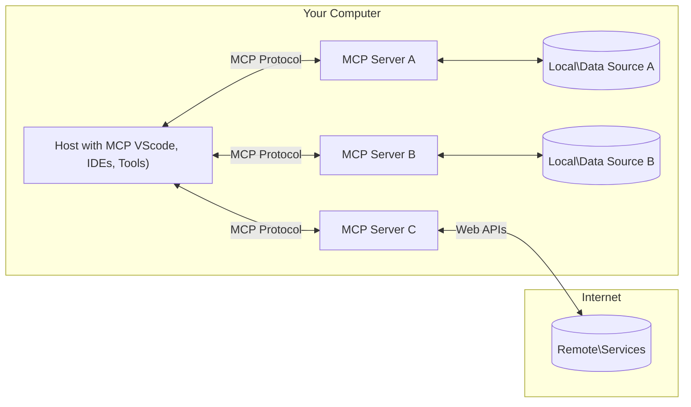

<!--
CO_OP_TRANSLATOR_METADATA:
{
  "original_hash": "b3b4a6ad10c3c0edbf7fa7cfa0ec496b",
  "translation_date": "2025-07-02T06:52:22+00:00",
  "source_file": "01-CoreConcepts/README.md",
  "language_code": "de"
}
-->
# 📖 MCP Kernkonzepte: Das Model Context Protocol für die KI-Integration meistern

Das [Model Context Protocol (MCP)](https://github.com/modelcontextprotocol) ist ein leistungsstarkes, standardisiertes Framework, das die Kommunikation zwischen Large Language Models (LLMs) und externen Tools, Anwendungen sowie Datenquellen optimiert. Dieser SEO-optimierte Leitfaden führt dich durch die Kernkonzepte von MCP und stellt sicher, dass du die Client-Server-Architektur, wesentliche Komponenten, Kommunikationsmechanismen und bewährte Implementierungspraktiken verstehst.

## Überblick

Diese Lektion behandelt die grundlegende Architektur und die Komponenten, die das Model Context Protocol (MCP) Ökosystem ausmachen. Du lernst die Client-Server-Architektur, die Schlüsselkomponenten und die Kommunikationsmechanismen kennen, die MCP-Interaktionen ermöglichen.

## 👩‍🎓 Wichtige Lernziele

Am Ende dieser Lektion wirst du:

- Die MCP Client-Server-Architektur verstehen.
- Die Rollen und Verantwortlichkeiten von Hosts, Clients und Servern benennen können.
- Die Kernfunktionen analysieren, die MCP zu einer flexiblen Integrationsschicht machen.
- Verstehen, wie Informationen innerhalb des MCP-Ökosystems fließen.
- Praktische Einblicke durch Codebeispiele in .NET, Java, Python und JavaScript gewinnen.

## 🔎 MCP Architektur: Ein tieferer Einblick

Das MCP-Ökosystem basiert auf einem Client-Server-Modell. Diese modulare Struktur ermöglicht es KI-Anwendungen, effizient mit Tools, Datenbanken, APIs und kontextuellen Ressourcen zu interagieren. Schauen wir uns diese Architektur anhand ihrer Kernkomponenten genauer an.

Im Kern folgt MCP einer Client-Server-Architektur, bei der eine Host-Anwendung Verbindungen zu mehreren Servern herstellen kann:



- **MCP Hosts**: Programme wie VSCode, Claude Desktop, IDEs oder KI-Tools, die über MCP auf Daten zugreifen möchten
- **MCP Clients**: Protokoll-Clients, die 1:1-Verbindungen zu Servern aufrechterhalten
- **MCP Server**: Leichtgewichtige Programme, die jeweils spezifische Funktionen über das standardisierte Model Context Protocol bereitstellen
- **Lokale Datenquellen**: Dateien, Datenbanken und Dienste auf deinem Computer, auf die MCP-Server sicher zugreifen können
- **Externe Dienste**: Über das Internet verfügbare Systeme, mit denen MCP-Server über APIs verbunden werden können.

Das MCP-Protokoll ist ein sich entwickelnder Standard. Die neuesten Updates findest du in der [Protokollspezifikation](https://modelcontextprotocol.io/specification/2025-06-18/).

### 1. Hosts

Im Model Context Protocol (MCP) spielen Hosts eine zentrale Rolle als primäre Schnittstelle, über die Nutzer mit dem Protokoll interagieren. Hosts sind Anwendungen oder Umgebungen, die Verbindungen zu MCP-Servern initiieren, um auf Daten, Tools und Prompts zuzugreifen. Beispiele für Hosts sind integrierte Entwicklungsumgebungen (IDEs) wie Visual Studio Code, KI-Tools wie Claude Desktop oder speziell entwickelte Agenten für bestimmte Aufgaben.

**Hosts** sind LLM-Anwendungen, die Verbindungen initiieren. Sie:

- Führen KI-Modelle aus oder interagieren mit ihnen, um Antworten zu generieren.
- Stellen Verbindungen zu MCP-Servern her.
- Verwalten den Gesprächsverlauf und die Benutzeroberfläche.
- Kontrollieren Berechtigungen und Sicherheitsbeschränkungen.
- Handhaben die Einwilligung der Nutzer für Datenaustausch und Tool-Ausführung.

### 2. Clients

Clients sind wichtige Komponenten, die die Interaktion zwischen Hosts und MCP-Servern ermöglichen. Sie fungieren als Vermittler, damit Hosts die Funktionen der MCP-Server nutzen können. Clients sorgen für eine reibungslose Kommunikation und einen effizienten Datenaustausch innerhalb der MCP-Architektur.

**Clients** sind Verbindungsstücke innerhalb der Host-Anwendung. Sie:

- Senden Anfragen mit Prompts oder Anweisungen an Server.
- Verhandeln Fähigkeiten mit den Servern.
- Verwalten Tool-Ausführungsanfragen von Modellen.
- Verarbeiten und zeigen Antworten für Nutzer an.

### 3. Server

Server sind verantwortlich für die Bearbeitung von Anfragen von MCP-Clients und die Bereitstellung entsprechender Antworten. Sie steuern verschiedene Operationen wie Datenabruf, Tool-Ausführung und Prompt-Erstellung. Server sorgen dafür, dass die Kommunikation zwischen Clients und Hosts effizient und zuverlässig abläuft und die Integrität des Interaktionsprozesses gewahrt bleibt.

**Server** sind Dienste, die Kontext und Funktionen bereitstellen. Sie:

- Registrieren verfügbare Features (Ressourcen, Prompts, Tools)
- Empfangen und führen Tool-Aufrufe vom Client aus
- Liefern kontextuelle Informationen zur Verbesserung der Modellantworten
- Geben Ergebnisse an den Client zurück
- Pflegen bei Bedarf den Zustand über Interaktionen hinweg

Server können von jedem entwickelt werden, um Modellfähigkeiten mit spezialisierten Funktionen zu erweitern.

### 4. Server-Features

Server im Model Context Protocol (MCP) bieten grundlegende Bausteine, die reiche Interaktionen zwischen Clients, Hosts und Sprachmodellen ermöglichen. Diese Features sind darauf ausgelegt, die Fähigkeiten von MCP durch strukturierte Kontexte, Tools und Prompts zu erweitern.

MCP-Server können folgende Features anbieten:

#### 📑 Ressourcen

Ressourcen im Model Context Protocol (MCP) umfassen verschiedene Arten von Kontext und Daten, die von Nutzern oder KI-Modellen genutzt werden können. Dazu gehören:

- **Kontextuelle Daten**: Informationen und Kontext, die Nutzer oder KI-Modelle für Entscheidungen und Aufgaben nutzen können.
- **Wissensdatenbanken und Dokumentenarchive**: Sammlungen strukturierter und unstrukturierter Daten wie Artikel, Handbücher und Forschungsarbeiten, die wertvolle Einblicke bieten.
- **Lokale Dateien und Datenbanken**: Lokal gespeicherte Daten auf Geräten oder in Datenbanken, die zur Verarbeitung und Analyse zugänglich sind.
- **APIs und Webservices**: Externe Schnittstellen und Dienste, die zusätzliche Daten und Funktionen bereitstellen und die Integration mit verschiedenen Online-Ressourcen und Tools ermöglichen.

Ein Beispiel für eine Ressource kann ein Datenbankschema oder eine Datei sein, auf die folgendermaßen zugegriffen wird:

```text
file://log.txt
database://schema
```

### 🤖 Prompts

Prompts im Model Context Protocol (MCP) umfassen verschiedene vordefinierte Vorlagen und Interaktionsmuster, die dazu dienen, Arbeitsabläufe zu vereinfachen und die Kommunikation zu verbessern. Dazu gehören:

- **Vorstrukturierte Nachrichten und Workflows**: Vorgefertigte Nachrichten und Abläufe, die Nutzer durch bestimmte Aufgaben und Interaktionen führen.
- **Vordefinierte Interaktionsmuster**: Standardisierte Abfolgen von Aktionen und Antworten, die eine konsistente und effiziente Kommunikation fördern.
- **Spezialisierte Gesprächsvorlagen**: Anpassbare Vorlagen für bestimmte Gesprächsarten, die relevante und kontextbezogene Interaktionen sicherstellen.

Eine Prompt-Vorlage könnte so aussehen:

```markdown
Generate a product slogan based on the following {{product}} with the following {{keywords}}
```

#### ⛏️ Tools

Tools im Model Context Protocol (MCP) sind Funktionen, die das KI-Modell ausführen kann, um spezifische Aufgaben zu erledigen. Diese Tools sollen die Fähigkeiten des KI-Modells erweitern, indem sie strukturierte und verlässliche Operationen bereitstellen. Wichtige Aspekte sind:

- **Funktionen, die das KI-Modell ausführen kann**: Tools sind ausführbare Funktionen, die das Modell aufrufen kann, um verschiedene Aufgaben zu erledigen.
- **Einzigartiger Name und Beschreibung**: Jedes Tool hat einen eindeutigen Namen und eine detaillierte Beschreibung, die Zweck und Funktion erklärt.
- **Parameter und Ausgaben**: Tools akzeptieren bestimmte Parameter und liefern strukturierte Ausgaben, um konsistente und vorhersagbare Ergebnisse zu gewährleisten.
- **Abgegrenzte Funktionen**: Tools führen abgegrenzte Funktionen wie Websuchen, Berechnungen oder Datenbankabfragen aus.

Ein Beispiel-Tool könnte so aussehen:

```typescript
server.tool(
  "GetProducts",
  {
    pageSize: z.string().optional(),
    pageCount: z.string().optional()
  }, () => {
    // return results from API
  }
)
```

## Client-Features

Im Model Context Protocol (MCP) bieten Clients verschiedene wichtige Funktionen für Server, die die Gesamtfunktionalität und Interaktion innerhalb des Protokolls verbessern. Eine der bemerkenswerten Funktionen ist Sampling.

### 👉 Sampling

- **Vom Server initiierte agentische Verhaltensweisen**: Clients ermöglichen es Servern, spezifische Aktionen oder Verhaltensweisen autonom zu starten, was die dynamischen Fähigkeiten des Systems erweitert.
- **Rekursive LLM-Interaktionen**: Dieses Feature erlaubt rekursive Interaktionen mit großen Sprachmodellen (LLMs), wodurch komplexere und iterative Aufgabenverarbeitung möglich wird.
- **Anforderung zusätzlicher Modellvervollständigungen**: Server können zusätzliche Vervollständigungen vom Modell anfordern, um sicherzustellen, dass die Antworten umfassend und kontextbezogen sind.

## Informationsfluss im MCP

Das Model Context Protocol (MCP) definiert einen strukturierten Informationsfluss zwischen Hosts, Clients, Servern und Modellen. Das Verständnis dieses Flusses hilft dabei, nachzuvollziehen, wie Nutzeranfragen verarbeitet werden und wie externe Tools und Daten in Modellantworten integriert werden.

- **Host initiiert Verbindung**  
  Die Host-Anwendung (z. B. eine IDE oder Chat-Oberfläche) stellt eine Verbindung zu einem MCP-Server her, typischerweise über STDIO, WebSocket oder einen anderen unterstützten Transport.

- **Fähigkeiten-Verhandlung**  
  Der Client (im Host eingebettet) und der Server tauschen Informationen über ihre unterstützten Funktionen, Tools, Ressourcen und Protokollversionen aus. So verstehen beide Seiten, welche Fähigkeiten für die Sitzung verfügbar sind.

- **Nutzeranfrage**  
  Der Nutzer interagiert mit dem Host (z. B. durch Eingabe eines Prompts oder Befehls). Der Host sammelt diese Eingabe und leitet sie an den Client zur Verarbeitung weiter.

- **Ressourcen- oder Tool-Nutzung**  
  - Der Client kann zusätzliche Kontextinformationen oder Ressourcen vom Server anfordern (z. B. Dateien, Datenbankeinträge oder Artikel aus Wissensdatenbanken), um das Verständnis des Modells zu erweitern.  
  - Wenn das Modell feststellt, dass ein Tool benötigt wird (z. B. zum Abrufen von Daten, zur Durchführung einer Berechnung oder zum Aufruf einer API), sendet der Client eine Tool-Ausführungsanfrage an den Server mit Angabe des Tool-Namens und der Parameter.

- **Server-Ausführung**  
  Der Server empfängt die Ressourcen- oder Tool-Anfrage, führt die erforderlichen Operationen aus (z. B. Funktionsaufruf, Datenbankabfrage oder Dateizugriff) und gibt die Ergebnisse in strukturierter Form an den Client zurück.

- **Antwortgenerierung**  
  Der Client integriert die Antworten des Servers (Ressourcendaten, Tool-Ausgaben usw.) in die laufende Modellinteraktion. Das Modell nutzt diese Informationen, um eine umfassende und kontextbezogene Antwort zu erzeugen.

- **Ergebnispräsentation**  
  Der Host erhält die finale Ausgabe vom Client und präsentiert sie dem Nutzer, oft inklusive des vom Modell generierten Texts sowie Ergebnissen aus Tool-Ausführungen oder Ressourcensuchen.

Dieser Ablauf ermöglicht es MCP, fortgeschrittene, interaktive und kontextbewusste KI-Anwendungen zu unterstützen, indem Modelle nahtlos mit externen Tools und Datenquellen verbunden werden.

## Protokolldetails

MCP (Model Context Protocol) baut auf [JSON-RPC 2.0](https://www.jsonrpc.org/) auf und bietet ein standardisiertes, sprachunabhängiges Nachrichtenformat für die Kommunikation zwischen Hosts, Clients und Servern. Diese Grundlage ermöglicht zuverlässige, strukturierte und erweiterbare Interaktionen über verschiedene Plattformen und Programmiersprachen hinweg.

### Wichtige Protokollfunktionen

MCP erweitert JSON-RPC 2.0 um zusätzliche Konventionen für Tool-Aufrufe, Ressourcen-Zugriffe und Prompt-Verwaltung. Es unterstützt mehrere Transportebenen (STDIO, WebSocket, SSE) und ermöglicht sichere, erweiterbare und sprachunabhängige Kommunikation zwischen den Komponenten.

#### 🧢 Basisprotokoll

- **JSON-RPC Nachrichtenformat**: Alle Anfragen und Antworten nutzen die JSON-RPC 2.0 Spezifikation, was eine konsistente Struktur für Methodenaufrufe, Parameter, Ergebnisse und Fehlerbehandlung gewährleistet.
- **Zustandsbehaftete Verbindungen**: MCP-Sitzungen erhalten den Zustand über mehrere Anfragen hinweg, was fortlaufende Gespräche, Kontextansammlungen und Ressourcenverwaltung unterstützt.
- **Fähigkeiten-Verhandlung**: Während des Verbindungsaufbaus tauschen Clients und Server Informationen über unterstützte Funktionen, Protokollversionen, verfügbare Tools und Ressourcen aus. So verstehen beide Seiten die Fähigkeiten des Gegenübers und können sich anpassen.

#### ➕ Zusätzliche Hilfsmittel

Hier einige weitere Utilities und Protokollerweiterungen, die MCP bietet, um die Entwicklererfahrung zu verbessern und erweiterte Szenarien zu ermöglichen:

- **Konfigurationsoptionen**: MCP erlaubt die dynamische Konfiguration von Sitzungsparametern wie Tool-Berechtigungen, Ressourcen-Zugriff und Modelleinstellungen, zugeschnitten auf jede Interaktion.
- **Fortschrittsverfolgung**: Lang andauernde Operationen können Fortschrittsupdates melden, was reaktionsfähige Benutzeroberflächen und eine bessere Nutzererfahrung bei komplexen Aufgaben ermöglicht.
- **Anfrageabbruch**: Clients können laufende Anfragen abbrechen, sodass Nutzer Operationen unterbrechen können, die nicht mehr benötigt werden oder zu lange dauern.
- **Fehlermeldung**: Standardisierte Fehlermeldungen und Codes helfen bei der Diagnose von Problemen, ermöglichen eine elegante Fehlerbehandlung und liefern umsetzbares Feedback für Nutzer und Entwickler.
- **Protokollierung**: Sowohl Clients als auch Server können strukturierte Logs ausgeben, um Protokollierung, Debugging und Überwachung der Protokollinteraktionen zu unterstützen.

Durch die Nutzung dieser Protokollfunktionen stellt MCP eine robuste, sichere und flexible Kommunikation zwischen Sprachmodellen und externen Tools oder Datenquellen sicher.

### 🔐 Sicherheitsaspekte

MCP-Implementierungen sollten sich an mehrere wichtige Sicherheitsprinzipien halten, um sichere und vertrauenswürdige Interaktionen zu gewährleisten:

- **Nutzerzustimmung und Kontrolle**: Nutzer müssen ausdrücklich zustimmen, bevor Daten abgerufen oder Operationen ausgeführt werden. Sie sollten klare Kontrolle darüber haben, welche Daten geteilt und welche Aktionen autorisiert werden, unterstützt durch intuitive Benutzeroberflächen zur Überprüfung und Genehmigung von Aktivitäten.

- **Datenschutz**: Nutzerdaten dürfen nur mit expliziter Zustimmung offengelegt werden und müssen durch angemessene Zugriffskontrollen geschützt sein. MCP-Implementierungen müssen unbefugte Datenübertragung verhindern und sicherstellen, dass die Privatsphäre während aller Interaktionen gewahrt bleibt.

- **Tool-Sicherheit**: Vor dem Aufruf eines Tools ist eine ausdrückliche Zustimmung des Nutzers erforderlich. Nutzer sollten die Funktionalität jedes Tools klar verstehen, und robuste Sicherheitsgrenzen müssen durchgesetzt werden, um unbeabsichtigte oder unsichere Tool-Ausführungen zu verhindern.

Durch die Einhaltung dieser Prinzipien gewährleistet MCP, dass Vertrauen, Datenschutz und Sicherheit der Nutzer bei allen Protokollinteraktionen erhalten bleiben.

## Codebeispiele: Schlüsselkomponenten

Nachfolgend findest du Codebeispiele in mehreren beliebten Programmiersprachen, die zeigen, wie man wichtige MCP-Server-Komponenten und Tools implementiert.

### .NET Beispiel: Einfachen MCP-Server mit Tools erstellen

Hier ein praktisches .NET-Codebeispiel, das zeigt, wie man einen einfachen MCP-Server mit benutzerdefinierten Tools implementiert. Dieses Beispiel veranschaulicht, wie Tools definiert und registriert, Anfragen verarbeitet und der Server über das Model Context Protocol verbunden wird.

```csharp
using System;
using System.Threading.Tasks;
using ModelContextProtocol.Server;
using ModelContextProtocol.Server.Transport;
using ModelContextProtocol.Server.Tools;

public class WeatherServer
{
    public static async Task Main(string[] args)
    {
        // Create an MCP server
        var server = new McpServer(
            name: "Weather MCP Server",
            version: "1.0.0"
        );
        
        // Register our custom weather tool
        server.AddTool<string, WeatherData>("weatherTool", 
            description: "Gets current weather for a location",
            execute: async (location) => {
                // Call weather API (simplified)
                var weatherData = await GetWeatherDataAsync(location);
                return weatherData;
            });
        
        // Connect the server using stdio transport
        var transport = new StdioServerTransport();
        await server.ConnectAsync(transport);
        
        Console.WriteLine("Weather MCP Server started");
        
        // Keep the server running until process is terminated
        await Task.Delay(-1);
    }
    
    private static async Task<WeatherData> GetWeatherDataAsync(string location)
    {
        // This would normally call a weather API
        // Simplified for demonstration
        await Task.Delay(100); // Simulate API call
        return new WeatherData { 
            Temperature = 72.5,
            Conditions = "Sunny",
            Location = location
        };
    }
}

public class WeatherData
{
    public double Temperature { get; set; }
    public string Conditions { get; set; }
    public string Location { get; set; }
}
```

### Java Beispiel: MCP-Server-Komponenten

Dieses Beispiel zeigt denselben MCP-Server und die Tool-Registrierung wie das .NET-Beispiel oben, jedoch in Java implementiert.

```java
import io.modelcontextprotocol.server.McpServer;
import io.modelcontextprotocol.server.McpToolDefinition;
import io.modelcontextprotocol.server.transport.StdioServerTransport;
import io.modelcontextprotocol.server.tool.ToolExecutionContext;
import io.modelcontextprotocol.server.tool.ToolResponse;

public class WeatherMcpServer {
    public static void main(String[] args) throws Exception {
        // Create an MCP server
        McpServer server = McpServer.builder()
            .name("Weather MCP Server")
            .version("1.0.0")
            .build();
            
        // Register a weather tool
        server.registerTool(McpToolDefinition.builder("weatherTool")
            .description("Gets current weather for a location")
            .parameter("location", String.class)
            .execute((ToolExecutionContext ctx) -> {
                String location = ctx.getParameter("location", String.class);
                
                // Get weather data (simplified)
                WeatherData data = getWeatherData(location);
                
                // Return formatted response
                return ToolResponse.content(
                    String.format("Temperature: %.1f°F, Conditions: %s, Location: %s", 
                    data.getTemperature(), 
                    data.getConditions(), 
                    data.getLocation())
                );
            })
            .build());
        
        // Connect the server using stdio transport
        try (StdioServerTransport transport = new StdioServerTransport()) {
            server.connect(transport);
            System.out.println("Weather MCP Server started");
            // Keep server running until process is terminated
            Thread.currentThread().join();
        }
    }
    
    private static WeatherData getWeatherData(String location) {
        // Implementation would call a weather API
        // Simplified for example purposes
        return new WeatherData(72.5, "Sunny", location);
    }
}

class WeatherData {
    private double temperature;
    private String conditions;
    private String location;
    
    public WeatherData(double temperature, String conditions, String location) {
        this.temperature = temperature;
        this.conditions = conditions;
        this.location = location;
    }
    
    public double getTemperature() {
        return temperature;
    }
    
    public String getConditions() {
        return conditions;
    }
    
    public String getLocation() {
        return location;
    }
}
```

### Python Beispiel: Einen MCP-Server bauen

In diesem Beispiel zeigen wir, wie man einen MCP-Server in Python erstellt. Außerdem werden zwei verschiedene Methoden zur Erstellung von Tools vorgestellt.

```python
#!/usr/bin/env python3
import asyncio
from mcp.server.fastmcp import FastMCP
from mcp.server.transports.stdio import serve_stdio

# Create a FastMCP server
mcp = FastMCP(
    name="Weather MCP Server",
    version="1.0.0"
)

@mcp.tool()
def get_weather(location: str) -> dict:
    """Gets current weather for a location."""
    # This would normally call a weather API
    # Simplified for demonstration
    return {
        "temperature": 72.5,
        "conditions": "Sunny",
        "location": location
    }

# Alternative approach using a class
class WeatherTools:
    @mcp.tool()
    def forecast(self, location: str, days: int = 1) -> dict:
        """Gets weather forecast for a location for the specified number of days."""
        # This would normally call a weather API forecast endpoint
        # Simplified for demonstration
        return {
            "location": location,
            "forecast": [
                {"day": i+1, "temperature": 70 + i, "conditions": "Partly Cloudy"}
                for i in range(days)
            ]
        }

# Instantiate the class to register its tools
weather_tools = WeatherTools()

# Start the server using stdio transport
if __name__ == "__main__":
    asyncio.run(serve_stdio(mcp))
```

### JavaScript Beispiel: MCP-Server erstellen

Dieses Beispiel zeigt die Erstellung eines MCP-Servers in JavaScript und wie zwei wetterbezogene Tools registriert werden.

```javascript
// Using the official Model Context Protocol SDK
import { McpServer } from "@modelcontextprotocol/sdk/server/mcp.js";
import { StdioServerTransport } from "@modelcontextprotocol/sdk/server/stdio.js";
import { z } from "zod"; // For parameter validation

// Create an MCP server
const server = new McpServer({
  name: "Weather MCP Server",
  version: "1.0.0"
});

// Define a weather tool
server.tool(
  "weatherTool",
  {
    location: z.string().describe("The location to get weather for")
  },
  async ({ location }) => {
    // This would normally call a weather API
    // Simplified for demonstration
    const weatherData = await getWeatherData(location);
    
    return {
      content: [
        { 
          type: "text", 
          text: `Temperature: ${weatherData.temperature}°F, Conditions: ${weatherData.conditions}, Location: ${weatherData.location}` 
        }
      ]
    };
  }
);

// Define a forecast tool
server.tool(
  "forecastTool",
  {
    location: z.string(),
    days: z.number().default(3).describe("Number of days for forecast")
  },
  async ({ location, days }) => {
    // This would normally call a weather API
    // Simplified for demonstration
    const forecast = await getForecastData(location, days);
    
    return {
      content: [
        { 
          type: "text", 
          text: `${days}-day forecast for ${location}: ${JSON.stringify(forecast)}` 
        }
      ]
    };
  }
);

// Helper functions
async function getWeatherData(location) {
  // Simulate API call
  return {
    temperature: 72.5,
    conditions: "Sunny",
    location: location
  };
}

async function getForecastData(location, days) {
  // Simulate API call
  return Array.from({ length: days }, (_, i) => ({
    day: i + 1,
    temperature: 70 + Math.floor(Math.random() * 10),
    conditions: i % 2 === 0 ? "Sunny" : "Partly Cloudy"
  }));
}

// Connect the server using stdio transport
const transport = new StdioServerTransport();
server.connect(transport).catch(console.error);

console.log("Weather MCP Server started");
```

Dieses JavaScript-Beispiel demonstriert, wie man einen MCP-Client erstellt, der sich mit einem Server verbindet, einen Prompt sendet und die Antwort inklusive etwaiger Tool-Aufrufe verarbeitet.

## Sicherheit und Autorisierung

MCP beinhaltet mehrere eingebaute Konzepte und Mechanismen zur Verwaltung von Sicherheit und Autorisierung im gesamten Protokoll:

1. **Tool-Berechtigungskontrolle**  
  Clients können festlegen, welche Tools ein Modell während einer Sitzung verwenden darf. So wird sichergestellt, dass nur ausdrücklich autorisierte Tools zugänglich sind, was das Risiko unbeabsichtigter oder unsicherer Operationen verringert. Berechtigungen können dynamisch basierend auf Nutzerpräferenzen, Organisationsrichtlinien oder dem Kontext der Interaktion konfiguriert werden.

2. **Authentifizierung**  
  Server können vor dem Zugriff auf Tools, Ressourcen oder sensible Operationen eine Authentifizierung verlangen. Dies kann API-Schlüssel, OAuth-Token oder andere Authentifizierungsschemata umfassen. Eine ordnungsgemäße Authentifizierung stellt sicher, dass nur vertrauenswürdige Clients und Nutzer serverseitige Funktionen aufrufen können.

3. **Validierung**  
  Die Parametervalidierung wird für alle Tool-Aufrufe durchgesetzt. Jedes Tool definiert die erwarteten Typen, Formate und Einschränkungen seiner Parameter, und der Server prüft eingehende Anfragen entsprechend. Dies verhindert, dass fehlerhafte oder bösartige Eingaben die Tool-Implementierungen erreichen, und trägt zur Integrität der Operationen bei.

4. **Rate Limiting**  
  Um Missbrauch zu verhindern und eine faire Nutzung der Serverressourcen zu gewährleisten, können MCP-Server Rate Limiting für Tool-Aufrufe und Ressourcen-Zugriffe implementieren. Limits können pro Nutzer, pro Sitzung oder global angewendet werden und schützen vor Denial-of-Service-Angriffen oder übermäßigem Ressourcenverbrauch.

Durch die Kombination dieser Mechanismen bietet MCP eine sichere Grundlage für die Integration von Sprachmodellen mit externen Tools und Datenquellen, während Nutzern und Entwicklern feingranulare Kontrolle über Zugriff und Nutzung gegeben wird.

## Protokollnachrichten

Die MCP-Kommunikation verwendet strukturierte JSON-Nachrichten, um klare und zuverlässige Interaktionen zwischen Clients, Servern und Modellen zu ermöglichen. Die wichtigsten Nachrichtentypen sind:

- **Client-Anfrage**  
  Vom Client an den Server gesendet, enthält diese Nachricht typischerweise:  
  - Den Prompt oder Befehl des Nutzers  
  - Gesprächshistorie als Kontext  
  - Tool

**Haftungsausschluss**:  
Dieses Dokument wurde mithilfe des KI-Übersetzungsdienstes [Co-op Translator](https://github.com/Azure/co-op-translator) übersetzt. Obwohl wir auf Genauigkeit achten, bitten wir zu beachten, dass automatisierte Übersetzungen Fehler oder Ungenauigkeiten enthalten können. Das Originaldokument in seiner ursprünglichen Sprache ist als maßgebliche Quelle zu betrachten. Für wichtige Informationen wird eine professionelle menschliche Übersetzung empfohlen. Wir übernehmen keine Haftung für Missverständnisse oder Fehlinterpretationen, die durch die Nutzung dieser Übersetzung entstehen.