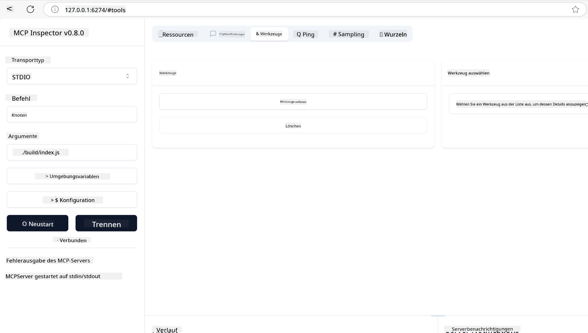
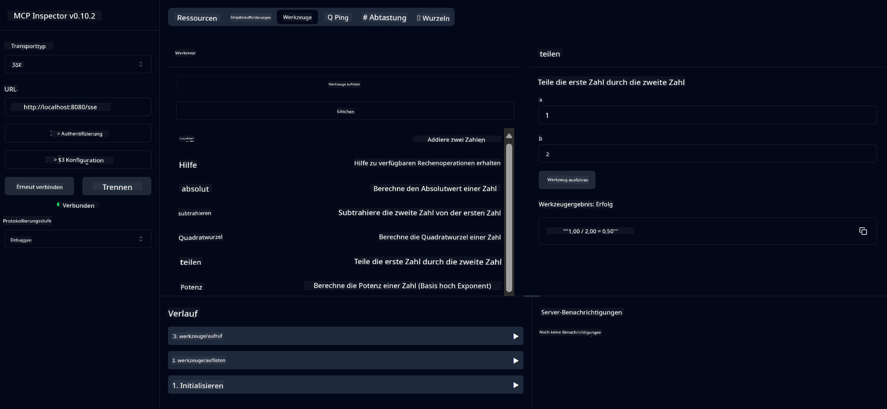
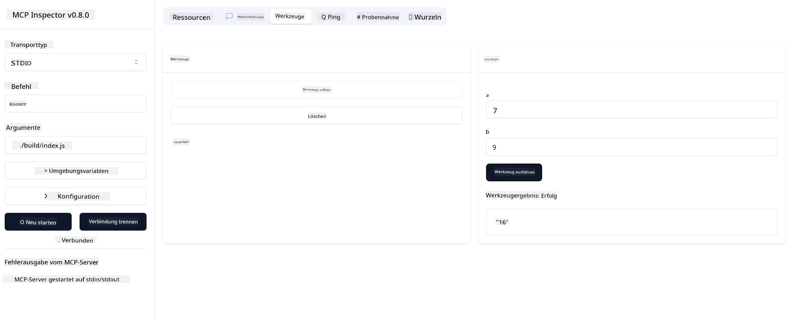

<!--
CO_OP_TRANSLATOR_METADATA:
{
  "original_hash": "ee93d6093964ea579dbdc20b4d643e9b",
  "translation_date": "2025-08-12T21:30:00+00:00",
  "source_file": "03-GettingStarted/01-first-server/README.md",
  "language_code": "de"
}
-->
# Einstieg in MCP

Willkommen zu Ihren ersten Schritten mit dem Model Context Protocol (MCP)! Egal, ob Sie neu bei MCP sind oder Ihr Wissen vertiefen möchten, dieser Leitfaden führt Sie durch die grundlegende Einrichtung und den Entwicklungsprozess. Sie werden entdecken, wie MCP eine nahtlose Integration zwischen KI-Modellen und Anwendungen ermöglicht, und lernen, wie Sie Ihre Umgebung schnell für die Entwicklung und das Testen von MCP-basierten Lösungen vorbereiten.

> Kurzfassung: Wenn Sie KI-Anwendungen entwickeln, wissen Sie, dass Sie Tools und andere Ressourcen zu Ihrem LLM (Large Language Model) hinzufügen können, um das LLM wissensreicher zu machen. Wenn Sie diese Tools und Ressourcen jedoch auf einem Server platzieren, können die App und die Serverfunktionen von jedem Client mit oder ohne LLM genutzt werden.

## Überblick

Diese Lektion bietet praktische Anleitungen zur Einrichtung von MCP-Umgebungen und zum Erstellen Ihrer ersten MCP-Anwendungen. Sie lernen, wie Sie die erforderlichen Tools und Frameworks einrichten, grundlegende MCP-Server erstellen, Host-Anwendungen entwickeln und Ihre Implementierungen testen.

Das Model Context Protocol (MCP) ist ein offenes Protokoll, das standardisiert, wie Anwendungen Kontext für LLMs bereitstellen. Stellen Sie sich MCP wie einen USB-C-Anschluss für KI-Anwendungen vor – es bietet eine standardisierte Möglichkeit, KI-Modelle mit verschiedenen Datenquellen und Tools zu verbinden.

## Lernziele

Am Ende dieser Lektion werden Sie in der Lage sein:

- Entwicklungsumgebungen für MCP in C#, Java, Python, TypeScript und Rust einzurichten
- Grundlegende MCP-Server mit benutzerdefinierten Funktionen (Ressourcen, Prompts und Tools) zu erstellen und bereitzustellen
- Host-Anwendungen zu entwickeln, die sich mit MCP-Servern verbinden
- MCP-Implementierungen zu testen und zu debuggen

## Einrichtung Ihrer MCP-Umgebung

Bevor Sie mit MCP arbeiten, ist es wichtig, Ihre Entwicklungsumgebung vorzubereiten und den grundlegenden Workflow zu verstehen. Dieser Abschnitt führt Sie durch die ersten Schritte, um einen reibungslosen Start mit MCP zu gewährleisten.

### Voraussetzungen

Bevor Sie mit der MCP-Entwicklung beginnen, stellen Sie sicher, dass Sie Folgendes haben:

- **Entwicklungsumgebung**: Für Ihre bevorzugte Sprache (C#, Java, Python, TypeScript oder Rust)
- **IDE/Editor**: Visual Studio, Visual Studio Code, IntelliJ, Eclipse, PyCharm oder einen modernen Code-Editor
- **Paketmanager**: NuGet, Maven/Gradle, pip, npm/yarn oder Cargo
- **API-Schlüssel**: Für alle KI-Dienste, die Sie in Ihren Host-Anwendungen verwenden möchten

## Grundstruktur eines MCP-Servers

Ein MCP-Server umfasst typischerweise:

- **Serverkonfiguration**: Einrichtung von Port, Authentifizierung und anderen Einstellungen
- **Ressourcen**: Daten und Kontext, die LLMs zur Verfügung gestellt werden
- **Tools**: Funktionen, die von Modellen aufgerufen werden können
- **Prompts**: Vorlagen zur Generierung oder Strukturierung von Text

Hier ist ein vereinfachtes Beispiel in TypeScript:

```typescript
import { McpServer, ResourceTemplate } from "@modelcontextprotocol/sdk/server/mcp.js";
import { StdioServerTransport } from "@modelcontextprotocol/sdk/server/stdio.js";
import { z } from "zod";

// Create an MCP server
const server = new McpServer({
  name: "Demo",
  version: "1.0.0"
});

// Add an addition tool
server.tool("add",
  { a: z.number(), b: z.number() },
  async ({ a, b }) => ({
    content: [{ type: "text", text: String(a + b) }]
  })
);

// Add a dynamic greeting resource
server.resource(
  "file",
  // The 'list' parameter controls how the resource lists available files. Setting it to undefined disables listing for this resource.
  new ResourceTemplate("file://{path}", { list: undefined }),
  async (uri, { path }) => ({
    contents: [{
      uri: uri.href,
      text: `File, ${path}!`
    }]
// Add a file resource that reads the file contents
server.resource(
  "file",
  new ResourceTemplate("file://{path}", { list: undefined }),
  async (uri, { path }) => {
    let text;
    try {
      text = await fs.readFile(path, "utf8");
    } catch (err) {
      text = `Error reading file: ${err.message}`;
    }
    return {
      contents: [{
        uri: uri.href,
        text
      }]
    };
  }
);

server.prompt(
  "review-code",
  { code: z.string() },
  ({ code }) => ({
    messages: [{
      role: "user",
      content: {
        type: "text",
        text: `Please review this code:\n\n${code}`
      }
    }]
  })
);

// Start receiving messages on stdin and sending messages on stdout
const transport = new StdioServerTransport();
await server.connect(transport);
```

Im obigen Code haben wir:

- Die erforderlichen Klassen aus dem MCP TypeScript SDK importiert.
- Eine neue MCP-Serverinstanz erstellt und konfiguriert.
- Ein benutzerdefiniertes Tool (`calculator`) mit einer Handler-Funktion registriert.
- Den Server gestartet, um eingehende MCP-Anfragen zu empfangen.

## Testen und Debuggen

Bevor Sie Ihren MCP-Server testen, ist es wichtig, die verfügbaren Tools und bewährten Verfahren für das Debuggen zu verstehen. Effektives Testen stellt sicher, dass sich Ihr Server wie erwartet verhält, und hilft Ihnen, Probleme schnell zu identifizieren und zu beheben. Der folgende Abschnitt beschreibt empfohlene Ansätze zur Validierung Ihrer MCP-Implementierung.

MCP bietet Tools, die Ihnen beim Testen und Debuggen Ihrer Server helfen:

- **Inspector-Tool**: Diese grafische Oberfläche ermöglicht es Ihnen, sich mit Ihrem Server zu verbinden und Tools, Prompts und Ressourcen zu testen.
- **curl**: Sie können sich auch mit einem Befehlszeilentool wie curl oder anderen Clients, die HTTP-Befehle ausführen können, mit Ihrem Server verbinden.

### Verwendung des MCP Inspectors

Der [MCP Inspector](https://github.com/modelcontextprotocol/inspector) ist ein visuelles Testtool, das Ihnen hilft:

1. **Serverfunktionen entdecken**: Verfügbare Ressourcen, Tools und Prompts automatisch erkennen
2. **Toolausführung testen**: Verschiedene Parameter ausprobieren und Antworten in Echtzeit sehen
3. **Server-Metadaten anzeigen**: Serverinformationen, Schemata und Konfigurationen untersuchen

```bash
# ex TypeScript, installing and running MCP Inspector
npx @modelcontextprotocol/inspector node build/index.js
```

Wenn Sie die obigen Befehle ausführen, startet der MCP Inspector eine lokale Weboberfläche in Ihrem Browser. Sie können ein Dashboard erwarten, das Ihre registrierten MCP-Server, deren verfügbare Tools, Ressourcen und Prompts anzeigt. Die Oberfläche ermöglicht es Ihnen, Tools interaktiv zu testen, Server-Metadaten zu inspizieren und Echtzeitantworten anzuzeigen, was die Validierung und das Debuggen Ihrer MCP-Serverimplementierungen erleichtert.

Hier ist ein Screenshot, wie es aussehen könnte:



## Häufige Einrichtungsprobleme und Lösungen

| Problem | Mögliche Lösung |
|---------|-----------------|
| Verbindung abgelehnt | Überprüfen Sie, ob der Server läuft und der Port korrekt ist |
| Fehler bei der Toolausführung | Überprüfen Sie die Parameterüberprüfung und Fehlerbehandlung |
| Authentifizierungsfehler | API-Schlüssel und Berechtigungen überprüfen |
| Schema-Validierungsfehler | Sicherstellen, dass die Parameter dem definierten Schema entsprechen |
| Server startet nicht | Portkonflikte oder fehlende Abhängigkeiten prüfen |
| CORS-Fehler | Richtige CORS-Header für Cross-Origin-Anfragen konfigurieren |
| Authentifizierungsprobleme | Token-Gültigkeit und Berechtigungen überprüfen |

## Lokale Entwicklung

Für die lokale Entwicklung und das Testen können Sie MCP-Server direkt auf Ihrem Rechner ausführen:

1. **Serverprozess starten**: Ihre MCP-Serveranwendung ausführen
2. **Netzwerk konfigurieren**: Sicherstellen, dass der Server auf dem erwarteten Port erreichbar ist
3. **Clients verbinden**: Lokale Verbindungs-URLs wie `http://localhost:3000` verwenden

```bash
# Example: Running a TypeScript MCP server locally
npm run start
# Server running at http://localhost:3000
```

## Erstellen Ihres ersten MCP-Servers

Wir haben die [Kernkonzepte](/01-CoreConcepts/README.md) in einer vorherigen Lektion behandelt, jetzt ist es an der Zeit, dieses Wissen in die Praxis umzusetzen.

### Was ein Server tun kann

Bevor wir mit dem Schreiben von Code beginnen, lassen Sie uns kurz daran erinnern, was ein Server tun kann:

Ein MCP-Server kann beispielsweise:

- Auf lokale Dateien und Datenbanken zugreifen
- Sich mit entfernten APIs verbinden
- Berechnungen durchführen
- Mit anderen Tools und Diensten integrieren
- Eine Benutzeroberfläche für Interaktionen bereitstellen

Super, jetzt, da wir wissen, was wir damit machen können, lassen Sie uns mit dem Programmieren beginnen.

## Übung: Einen Server erstellen

Um einen Server zu erstellen, müssen Sie folgende Schritte ausführen:

- Das MCP SDK installieren.
- Ein Projekt erstellen und die Projektstruktur einrichten.
- Den Servercode schreiben.
- Den Server testen.

### -1- Projekt erstellen

#### TypeScript

```sh
# Create project directory and initialize npm project
mkdir calculator-server
cd calculator-server
npm init -y
```

#### Python

```sh
# Create project dir
mkdir calculator-server
cd calculator-server
# Open the folder in Visual Studio Code - Skip this if you are using a different IDE
code .
```

#### .NET

```sh
dotnet new console -n McpCalculatorServer
cd McpCalculatorServer
```

#### Java

Für Java ein Spring Boot-Projekt erstellen:

```bash
curl https://start.spring.io/starter.zip \
  -d dependencies=web \
  -d javaVersion=21 \
  -d type=maven-project \
  -d groupId=com.example \
  -d artifactId=calculator-server \
  -d name=McpServer \
  -d packageName=com.microsoft.mcp.sample.server \
  -o calculator-server.zip
```

Zip-Datei extrahieren:

```bash
unzip calculator-server.zip -d calculator-server
cd calculator-server
# optional remove the unused test
rm -rf src/test/java
```

Die folgende vollständige Konfiguration zu Ihrer *pom.xml* hinzufügen:

```xml
<?xml version="1.0" encoding="UTF-8"?>
<project xmlns="http://maven.apache.org/POM/4.0.0"
    xmlns:xsi="http://www.w3.org/2001/XMLSchema-instance"
    xsi:schemaLocation="http://maven.apache.org/POM/4.0.0 http://maven.apache.org/xsd/maven-4.0.0.xsd">
    <modelVersion>4.0.0</modelVersion>
    
    <!-- Spring Boot parent for dependency management -->
    <parent>
        <groupId>org.springframework.boot</groupId>
        <artifactId>spring-boot-starter-parent</artifactId>
        <version>3.5.0</version>
        <relativePath />
    </parent>

    <!-- Project coordinates -->
    <groupId>com.example</groupId>
    <artifactId>calculator-server</artifactId>
    <version>0.0.1-SNAPSHOT</version>
    <name>Calculator Server</name>
    <description>Basic calculator MCP service for beginners</description>

    <!-- Properties -->
    <properties>
        <java.version>21</java.version>
        <maven.compiler.source>21</maven.compiler.source>
        <maven.compiler.target>21</maven.compiler.target>
    </properties>

    <!-- Spring AI BOM for version management -->
    <dependencyManagement>
        <dependencies>
            <dependency>
                <groupId>org.springframework.ai</groupId>
                <artifactId>spring-ai-bom</artifactId>
                <version>1.0.0-SNAPSHOT</version>
                <type>pom</type>
                <scope>import</scope>
            </dependency>
        </dependencies>
    </dependencyManagement>

    <!-- Dependencies -->
    <dependencies>
        <dependency>
            <groupId>org.springframework.ai</groupId>
            <artifactId>spring-ai-starter-mcp-server-webflux</artifactId>
        </dependency>
        <dependency>
            <groupId>org.springframework.boot</groupId>
            <artifactId>spring-boot-starter-actuator</artifactId>
        </dependency>
        <dependency>
         <groupId>org.springframework.boot</groupId>
         <artifactId>spring-boot-starter-test</artifactId>
         <scope>test</scope>
      </dependency>
    </dependencies>

    <!-- Build configuration -->
    <build>
        <plugins>
            <plugin>
                <groupId>org.springframework.boot</groupId>
                <artifactId>spring-boot-maven-plugin</artifactId>
            </plugin>
            <plugin>
                <groupId>org.apache.maven.plugins</groupId>
                <artifactId>maven-compiler-plugin</artifactId>
                <configuration>
                    <release>21</release>
                </configuration>
            </plugin>
        </plugins>
    </build>

    <!-- Repositories for Spring AI snapshots -->
    <repositories>
        <repository>
            <id>spring-milestones</id>
            <name>Spring Milestones</name>
            <url>https://repo.spring.io/milestone</url>
            <snapshots>
                <enabled>false</enabled>
            </snapshots>
        </repository>
        <repository>
            <id>spring-snapshots</id>
            <name>Spring Snapshots</name>
            <url>https://repo.spring.io/snapshot</url>
            <releases>
                <enabled>false</enabled>
            </releases>
        </repository>
    </repositories>
</project>
```

#### Rust

```sh
mkdir calculator-server
cd calculator-server
cargo init
```

### -2- Abhängigkeiten hinzufügen

Nachdem Sie Ihr Projekt erstellt haben, fügen Sie als Nächstes die Abhängigkeiten hinzu:

#### TypeScript

```sh
# If not already installed, install TypeScript globally
npm install typescript -g

# Install the MCP SDK and Zod for schema validation
npm install @modelcontextprotocol/sdk zod
npm install -D @types/node typescript
```

#### Python

```sh
# Create a virtual env and install dependencies
python -m venv venv
venv\Scripts\activate
pip install "mcp[cli]"
```

#### Java

```bash
cd calculator-server
./mvnw clean install -DskipTests
```

#### Rust

```sh
cargo add rmcp --features server,transport-io
cargo add serde
cargo add tokio --features rt-multi-thread
```

### -3- Projektdateien erstellen

#### TypeScript

Öffnen Sie die Datei *package.json* und ersetzen Sie den Inhalt durch Folgendes, um sicherzustellen, dass Sie den Server erstellen und ausführen können:

```json
{
  "name": "calculator-server",
  "version": "1.0.0",
  "main": "index.js",
  "type": "module",
  "scripts": {
    "start": "tsc && node ./build/index.js",
    "build": "tsc && node ./build/index.js"
  },
  "keywords": [],
  "author": "",
  "license": "ISC",
  "description": "A simple calculator server using Model Context Protocol",
  "dependencies": {
    "@modelcontextprotocol/sdk": "^1.16.0",
    "zod": "^3.25.76"
  },
  "devDependencies": {
    "@types/node": "^24.0.14",
    "typescript": "^5.8.3"
  }
}
```

Erstellen Sie eine *tsconfig.json* mit folgendem Inhalt:

```json
{
  "compilerOptions": {
    "target": "ES2022",
    "module": "Node16",
    "moduleResolution": "Node16",
    "outDir": "./build",
    "rootDir": "./src",
    "strict": true,
    "esModuleInterop": true,
    "skipLibCheck": true,
    "forceConsistentCasingInFileNames": true
  },
  "include": ["src/**/*"],
  "exclude": ["node_modules"]
}
```

Erstellen Sie ein Verzeichnis für Ihren Quellcode:

```sh
mkdir src
touch src/index.ts
```

#### Python

Erstellen Sie eine Datei *server.py*

```sh
touch server.py
```

#### .NET

Installieren Sie die erforderlichen NuGet-Pakete:

```sh
dotnet add package ModelContextProtocol --prerelease
dotnet add package Microsoft.Extensions.Hosting
```

#### Java

Für Java Spring Boot-Projekte wird die Projektstruktur automatisch erstellt.

#### Rust

Für Rust wird eine Datei *src/main.rs* standardmäßig erstellt, wenn Sie `cargo init` ausführen. Öffnen Sie die Datei und löschen Sie den Standardcode.

### -4- Servercode erstellen

#### TypeScript

Erstellen Sie eine Datei *index.ts* und fügen Sie den folgenden Code hinzu:

```typescript
import { McpServer, ResourceTemplate } from "@modelcontextprotocol/sdk/server/mcp.js";
import { StdioServerTransport } from "@modelcontextprotocol/sdk/server/stdio.js";
import { z } from "zod";
 
// Create an MCP server
const server = new McpServer({
  name: "Calculator MCP Server",
  version: "1.0.0"
});
```

Jetzt haben Sie einen Server, aber er macht noch nicht viel. Lassen Sie uns das ändern.

#### Python

```python
# server.py
from mcp.server.fastmcp import FastMCP

# Create an MCP server
mcp = FastMCP("Demo")
```

#### .NET

```csharp
using Microsoft.Extensions.DependencyInjection;
using Microsoft.Extensions.Hosting;
using Microsoft.Extensions.Logging;
using ModelContextProtocol.Server;
using System.ComponentModel;

var builder = Host.CreateApplicationBuilder(args);
builder.Logging.AddConsole(consoleLogOptions =>
{
    // Configure all logs to go to stderr
    consoleLogOptions.LogToStandardErrorThreshold = LogLevel.Trace;
});

builder.Services
    .AddMcpServer()
    .WithStdioServerTransport()
    .WithToolsFromAssembly();
await builder.Build().RunAsync();

// add features
```

#### Java

Für Java erstellen Sie die Kernserverkomponenten. Zuerst ändern Sie die Hauptanwendungsklasse:

*src/main/java/com/microsoft/mcp/sample/server/McpServerApplication.java*:

```java
package com.microsoft.mcp.sample.server;

import org.springframework.ai.tool.ToolCallbackProvider;
import org.springframework.ai.tool.method.MethodToolCallbackProvider;
import org.springframework.boot.SpringApplication;
import org.springframework.boot.autoconfigure.SpringBootApplication;
import org.springframework.context.annotation.Bean;
import com.microsoft.mcp.sample.server.service.CalculatorService;

@SpringBootApplication
public class McpServerApplication {

    public static void main(String[] args) {
        SpringApplication.run(McpServerApplication.class, args);
    }
    
    @Bean
    public ToolCallbackProvider calculatorTools(CalculatorService calculator) {
        return MethodToolCallbackProvider.builder().toolObjects(calculator).build();
    }
}
```

Erstellen Sie den Calculator-Service *src/main/java/com/microsoft/mcp/sample/server/service/CalculatorService.java*:

```java
package com.microsoft.mcp.sample.server.service;

import org.springframework.ai.tool.annotation.Tool;
import org.springframework.stereotype.Service;

/**
 * Service for basic calculator operations.
 * This service provides simple calculator functionality through MCP.
 */
@Service
public class CalculatorService {

    /**
     * Add two numbers
     * @param a The first number
     * @param b The second number
     * @return The sum of the two numbers
     */
    @Tool(description = "Add two numbers together")
    public String add(double a, double b) {
        double result = a + b;
        return formatResult(a, "+", b, result);
    }

    /**
     * Subtract one number from another
     * @param a The number to subtract from
     * @param b The number to subtract
     * @return The result of the subtraction
     */
    @Tool(description = "Subtract the second number from the first number")
    public String subtract(double a, double b) {
        double result = a - b;
        return formatResult(a, "-", b, result);
    }

    /**
     * Multiply two numbers
     * @param a The first number
     * @param b The second number
     * @return The product of the two numbers
     */
    @Tool(description = "Multiply two numbers together")
    public String multiply(double a, double b) {
        double result = a * b;
        return formatResult(a, "*", b, result);
    }

    /**
     * Divide one number by another
     * @param a The numerator
     * @param b The denominator
     * @return The result of the division
     */
    @Tool(description = "Divide the first number by the second number")
    public String divide(double a, double b) {
        if (b == 0) {
            return "Error: Cannot divide by zero";
        }
        double result = a / b;
        return formatResult(a, "/", b, result);
    }

    /**
     * Calculate the power of a number
     * @param base The base number
     * @param exponent The exponent
     * @return The result of raising the base to the exponent
     */
    @Tool(description = "Calculate the power of a number (base raised to an exponent)")
    public String power(double base, double exponent) {
        double result = Math.pow(base, exponent);
        return formatResult(base, "^", exponent, result);
    }

    /**
     * Calculate the square root of a number
     * @param number The number to find the square root of
     * @return The square root of the number
     */
    @Tool(description = "Calculate the square root of a number")
    public String squareRoot(double number) {
        if (number < 0) {
            return "Error: Cannot calculate square root of a negative number";
        }
        double result = Math.sqrt(number);
        return String.format("√%.2f = %.2f", number, result);
    }

    /**
     * Calculate the modulus (remainder) of division
     * @param a The dividend
     * @param b The divisor
     * @return The remainder of the division
     */
    @Tool(description = "Calculate the remainder when one number is divided by another")
    public String modulus(double a, double b) {
        if (b == 0) {
            return "Error: Cannot divide by zero";
        }
        double result = a % b;
        return formatResult(a, "%", b, result);
    }

    /**
     * Calculate the absolute value of a number
     * @param number The number to find the absolute value of
     * @return The absolute value of the number
     */
    @Tool(description = "Calculate the absolute value of a number")
    public String absolute(double number) {
        double result = Math.abs(number);
        return String.format("|%.2f| = %.2f", number, result);
    }

    /**
     * Get help about available calculator operations
     * @return Information about available operations
     */
    @Tool(description = "Get help about available calculator operations")
    public String help() {
        return "Basic Calculator MCP Service\n\n" +
               "Available operations:\n" +
               "1. add(a, b) - Adds two numbers\n" +
               "2. subtract(a, b) - Subtracts the second number from the first\n" +
               "3. multiply(a, b) - Multiplies two numbers\n" +
               "4. divide(a, b) - Divides the first number by the second\n" +
               "5. power(base, exponent) - Raises a number to a power\n" +
               "6. squareRoot(number) - Calculates the square root\n" + 
               "7. modulus(a, b) - Calculates the remainder of division\n" +
               "8. absolute(number) - Calculates the absolute value\n\n" +
               "Example usage: add(5, 3) will return 5 + 3 = 8";
    }

    /**
     * Format the result of a calculation
     */
    private String formatResult(double a, String operator, double b, double result) {
        return String.format("%.2f %s %.2f = %.2f", a, operator, b, result);
    }
}
```

**Optionale Komponenten für einen produktionsreifen Service:**

Erstellen Sie eine Startkonfiguration *src/main/java/com/microsoft/mcp/sample/server/config/StartupConfig.java*:

```java
package com.microsoft.mcp.sample.server.config;

import org.springframework.boot.CommandLineRunner;
import org.springframework.context.annotation.Bean;
import org.springframework.context.annotation.Configuration;

@Configuration
public class StartupConfig {
    
    @Bean
    public CommandLineRunner startupInfo() {
        return args -> {
            System.out.println("\n" + "=".repeat(60));
            System.out.println("Calculator MCP Server is starting...");
            System.out.println("SSE endpoint: http://localhost:8080/sse");
            System.out.println("Health check: http://localhost:8080/actuator/health");
            System.out.println("=".repeat(60) + "\n");
        };
    }
}
```

Erstellen Sie einen Health-Controller *src/main/java/com/microsoft/mcp/sample/server/controller/HealthController.java*:

```java
package com.microsoft.mcp.sample.server.controller;

import org.springframework.http.ResponseEntity;
import org.springframework.web.bind.annotation.GetMapping;
import org.springframework.web.bind.annotation.RestController;
import java.time.LocalDateTime;
import java.util.HashMap;
import java.util.Map;

@RestController
public class HealthController {
    
    @GetMapping("/health")
    public ResponseEntity<Map<String, Object>> healthCheck() {
        Map<String, Object> response = new HashMap<>();
        response.put("status", "UP");
        response.put("timestamp", LocalDateTime.now().toString());
        response.put("service", "Calculator MCP Server");
        return ResponseEntity.ok(response);
    }
}
```

Erstellen Sie einen Exception-Handler *src/main/java/com/microsoft/mcp/sample/server/exception/GlobalExceptionHandler.java*:

```java
package com.microsoft.mcp.sample.server.exception;

import org.springframework.http.HttpStatus;
import org.springframework.http.ResponseEntity;
import org.springframework.web.bind.annotation.ExceptionHandler;
import org.springframework.web.bind.annotation.RestControllerAdvice;

@RestControllerAdvice
public class GlobalExceptionHandler {

    @ExceptionHandler(IllegalArgumentException.class)
    public ResponseEntity<ErrorResponse> handleIllegalArgumentException(IllegalArgumentException ex) {
        ErrorResponse error = new ErrorResponse(
            "Invalid_Input", 
            "Invalid input parameter: " + ex.getMessage());
        return new ResponseEntity<>(error, HttpStatus.BAD_REQUEST);
    }

    public static class ErrorResponse {
        private String code;
        private String message;

        public ErrorResponse(String code, String message) {
            this.code = code;
            this.message = message;
        }

        // Getters
        public String getCode() { return code; }
        public String getMessage() { return message; }
    }
}
```

Erstellen Sie ein benutzerdefiniertes Banner *src/main/resources/banner.txt*:

```text
_____      _            _       _             
 / ____|    | |          | |     | |            
| |     __ _| | ___ _   _| | __ _| |_ ___  _ __ 
| |    / _` | |/ __| | | | |/ _` | __/ _ \| '__|
| |___| (_| | | (__| |_| | | (_| | || (_) | |   
 \_____\__,_|_|\___|\__,_|_|\__,_|\__\___/|_|   
                                                
Calculator MCP Server v1.0
Spring Boot MCP Application
```

#### Rust

Fügen Sie den folgenden Code oben in die Datei *src/main.rs* ein. Dies importiert die erforderlichen Bibliotheken und Module für Ihren MCP-Server.

```rust
use rmcp::{
    handler::server::{router::tool::ToolRouter, tool::Parameters},
    model::{ServerCapabilities, ServerInfo},
    schemars, tool, tool_handler, tool_router,
    transport::stdio,
    ServerHandler, ServiceExt,
};
use std::error::Error;
```

Der Calculator-Server wird ein einfacher sein, der zwei Zahlen addieren kann. Erstellen wir eine Struktur, um die Calculator-Anfrage darzustellen.

```rust
#[derive(Debug, serde::Deserialize, schemars::JsonSchema)]
pub struct CalculatorRequest {
    pub a: f64,
    pub b: f64,
}
```

Erstellen Sie als Nächstes eine Struktur, um den Calculator-Server darzustellen. Diese Struktur enthält den Tool-Router, der zum Registrieren von Tools verwendet wird.

```rust
#[derive(Debug, Clone)]
pub struct Calculator {
    tool_router: ToolRouter<Self>,
}
```

Nun können wir die `Calculator`-Struktur implementieren, um eine neue Instanz des Servers zu erstellen und den Server-Handler zu implementieren, um Serverinformationen bereitzustellen.

```rust
#[tool_router]
impl Calculator {
    pub fn new() -> Self {
        Self {
            tool_router: Self::tool_router(),
        }
    }
}

#[tool_handler]
impl ServerHandler for Calculator {
    fn get_info(&self) -> ServerInfo {
        ServerInfo {
            instructions: Some("A simple calculator tool".into()),
            capabilities: ServerCapabilities::builder().enable_tools().build(),
            ..Default::default()
        }
    }
}
```

Schließlich müssen wir die Hauptfunktion implementieren, um den Server zu starten. Diese Funktion erstellt eine Instanz der `Calculator`-Struktur und stellt sie über Standard-Ein-/Ausgabe bereit.

```rust
#[tokio::main]
async fn main() -> Result<(), Box<dyn Error>> {
    let service = Calculator::new().serve(stdio()).await?;
    service.waiting().await?;
    Ok(())
}
```

Der Server ist jetzt so eingerichtet, dass er grundlegende Informationen über sich selbst bereitstellt. Als Nächstes fügen wir ein Tool hinzu, um Additionen durchzuführen.

### -5- Ein Tool und eine Ressource hinzufügen

Fügen Sie ein Tool und eine Ressource hinzu, indem Sie den folgenden Code hinzufügen:

#### TypeScript

```typescript
server.tool(
  "add",
  { a: z.number(), b: z.number() },
  async ({ a, b }) => ({
    content: [{ type: "text", text: String(a + b) }]
  })
);

server.resource(
  "greeting",
  new ResourceTemplate("greeting://{name}", { list: undefined }),
  async (uri, { name }) => ({
    contents: [{
      uri: uri.href,
      text: `Hello, ${name}!`
    }]
  })
);
```

Ihr Tool nimmt die Parameter `a` und `b` und führt eine Funktion aus, die eine Antwort in der folgenden Form erzeugt:

```typescript
{
  contents: [{
    type: "text", content: "some content"
  }]
}
```

Ihre Ressource wird über einen String "greeting" aufgerufen, nimmt einen Parameter `name` und erzeugt eine ähnliche Antwort wie das Tool:

```typescript
{
  uri: "<href>",
  text: "a text"
}
```

#### Python

```python
# Add an addition tool
@mcp.tool()
def add(a: int, b: int) -> int:
    """Add two numbers"""
    return a + b


# Add a dynamic greeting resource
@mcp.resource("greeting://{name}")
def get_greeting(name: str) -> str:
    """Get a personalized greeting"""
    return f"Hello, {name}!"
```

Im obigen Code haben wir:

- Ein Tool `add` definiert, das die Parameter `a` und `p`, beide Ganzzahlen, annimmt.
- Eine Ressource namens `greeting` erstellt, die den Parameter `name` annimmt.

#### .NET

Fügen Sie dies Ihrer Program.cs-Datei hinzu:

```csharp
[McpServerToolType]
public static class CalculatorTool
{
    [McpServerTool, Description("Adds two numbers")]
    public static string Add(int a, int b) => $"Sum {a + b}";
}
```

#### Java

Die Tools wurden bereits im vorherigen Schritt erstellt.

#### Rust

Fügen Sie ein neues Tool innerhalb des Blocks `impl Calculator` hinzu:

```rust
#[tool(description = "Adds a and b")]
async fn add(
    &self,
    Parameters(CalculatorRequest { a, b }): Parameters<CalculatorRequest>,
) -> String {
    (a + b).to_string()
}
```

### -6- Finaler Code

Fügen Sie den letzten Code hinzu, den wir benötigen, damit der Server starten kann:

#### TypeScript

```typescript
// Start receiving messages on stdin and sending messages on stdout
const transport = new StdioServerTransport();
await server.connect(transport);
```

Hier ist der vollständige Code:

```typescript
// index.ts
import { McpServer, ResourceTemplate } from "@modelcontextprotocol/sdk/server/mcp.js";
import { StdioServerTransport } from "@modelcontextprotocol/sdk/server/stdio.js";
import { z } from "zod";

// Create an MCP server
const server = new McpServer({
  name: "Calculator MCP Server",
  version: "1.0.0"
});

// Add an addition tool
server.tool(
  "add",
  { a: z.number(), b: z.number() },
  async ({ a, b }) => ({
    content: [{ type: "text", text: String(a + b) }]
  })
);

// Add a dynamic greeting resource
server.resource(
  "greeting",
  new ResourceTemplate("greeting://{name}", { list: undefined }),
  async (uri, { name }) => ({
    contents: [{
      uri: uri.href,
      text: `Hello, ${name}!`
    }]
  })
);

// Start receiving messages on stdin and sending messages on stdout
const transport = new StdioServerTransport();
server.connect(transport);
```

#### Python

```python
# server.py
from mcp.server.fastmcp import FastMCP

# Create an MCP server
mcp = FastMCP("Demo")


# Add an addition tool
@mcp.tool()
def add(a: int, b: int) -> int:
    """Add two numbers"""
    return a + b


# Add a dynamic greeting resource
@mcp.resource("greeting://{name}")
def get_greeting(name: str) -> str:
    """Get a personalized greeting"""
    return f"Hello, {name}!"

# Main execution block - this is required to run the server
if __name__ == "__main__":
    mcp.run()
```

#### .NET

Erstellen Sie eine Program.cs-Datei mit folgendem Inhalt:

```csharp
using Microsoft.Extensions.DependencyInjection;
using Microsoft.Extensions.Hosting;
using Microsoft.Extensions.Logging;
using ModelContextProtocol.Server;
using System.ComponentModel;

var builder = Host.CreateApplicationBuilder(args);
builder.Logging.AddConsole(consoleLogOptions =>
{
    // Configure all logs to go to stderr
    consoleLogOptions.LogToStandardErrorThreshold = LogLevel.Trace;
});

builder.Services
    .AddMcpServer()
    .WithStdioServerTransport()
    .WithToolsFromAssembly();
await builder.Build().RunAsync();

[McpServerToolType]
public static class CalculatorTool
{
    [McpServerTool, Description("Adds two numbers")]
    public static string Add(int a, int b) => $"Sum {a + b}";
}
```

#### Java

Ihre vollständige Hauptanwendungsklasse sollte so aussehen:

```java
// McpServerApplication.java
package com.microsoft.mcp.sample.server;

import org.springframework.ai.tool.ToolCallbackProvider;
import org.springframework.ai.tool.method.MethodToolCallbackProvider;
import org.springframework.boot.SpringApplication;
import org.springframework.boot.autoconfigure.SpringBootApplication;
import org.springframework.context.annotation.Bean;
import com.microsoft.mcp.sample.server.service.CalculatorService;

@SpringBootApplication
public class McpServerApplication {

    public static void main(String[] args) {
        SpringApplication.run(McpServerApplication.class, args);
    }
    
    @Bean
    public ToolCallbackProvider calculatorTools(CalculatorService calculator) {
        return MethodToolCallbackProvider.builder().toolObjects(calculator).build();
    }
}
```

#### Rust

Der finale Code für den Rust-Server sollte so aussehen:

```rust
use rmcp::{
    ServerHandler, ServiceExt,
    handler::server::{router::tool::ToolRouter, tool::Parameters},
    model::{ServerCapabilities, ServerInfo},
    schemars, tool, tool_handler, tool_router,
    transport::stdio,
};
use std::error::Error;

#[derive(Debug, serde::Deserialize, schemars::JsonSchema)]
pub struct CalculatorRequest {
    pub a: f64,
    pub b: f64,
}

#[derive(Debug, Clone)]
pub struct Calculator {
    tool_router: ToolRouter<Self>,
}

#[tool_router]
impl Calculator {
    pub fn new() -> Self {
        Self {
            tool_router: Self::tool_router(),
        }
    }
    
    #[tool(description = "Adds a and b")]
    async fn add(
        &self,
        Parameters(CalculatorRequest { a, b }): Parameters<CalculatorRequest>,
    ) -> String {
        (a + b).to_string()
    }
}

#[tool_handler]
impl ServerHandler for Calculator {
    fn get_info(&self) -> ServerInfo {
        ServerInfo {
            instructions: Some("A simple calculator tool".into()),
            capabilities: ServerCapabilities::builder().enable_tools().build(),
            ..Default::default()
        }
    }
}

#[tokio::main]
async fn main() -> Result<(), Box<dyn Error>> {
    let service = Calculator::new().serve(stdio()).await?;
    service.waiting().await?;
    Ok(())
}
```

### -7- Server testen

Starten Sie den Server mit folgendem Befehl:

#### TypeScript

```sh
npm run build
```

#### Python

```sh
mcp run server.py
```

> Um den MCP Inspector zu verwenden, nutzen Sie `mcp dev server.py`, was den Inspector automatisch startet und das erforderliche Proxy-Session-Token bereitstellt. Wenn Sie `mcp run server.py` verwenden, müssen Sie den Inspector manuell starten und die Verbindung konfigurieren.

#### .NET

Stellen Sie sicher, dass Sie sich in Ihrem Projektverzeichnis befinden:

```sh
cd McpCalculatorServer
dotnet run
```

#### Java

```bash
./mvnw clean install -DskipTests
java -jar target/calculator-server-0.0.1-SNAPSHOT.jar
```

#### Rust

Führen Sie die folgenden Befehle aus, um den Server zu formatieren und auszuführen:

```sh
cargo fmt
cargo run
```

### -8- Mit dem Inspector ausführen

Der Inspector ist ein großartiges Tool, das Ihren Server starten und Ihnen ermöglichen kann, mit ihm zu interagieren, sodass Sie testen können, ob er funktioniert. Lassen Sie uns ihn starten:

> [!NOTE]
> Es könnte im Feld "Befehl" anders aussehen, da es den Befehl zum Ausführen eines Servers mit Ihrer spezifischen Laufzeit enthält.

#### TypeScript

```sh
npx @modelcontextprotocol/inspector node build/index.js
```

Oder fügen Sie es Ihrer *package.json* wie folgt hinzu: `"inspector": "npx @modelcontextprotocol/inspector node build/index.js"` und führen Sie dann `npm run inspector` aus.

Python verwendet ein Node.js-Tool namens Inspector. Es ist möglich, dieses Tool wie folgt aufzurufen:

```sh
mcp dev server.py
```

Es implementiert jedoch nicht alle verfügbaren Methoden des Tools, daher wird empfohlen, das Node.js-Tool direkt wie unten auszuführen:

```sh
npx @modelcontextprotocol/inspector mcp run server.py
```

Wenn Sie ein Tool oder eine IDE verwenden, die es Ihnen ermöglicht, Befehle und Argumente für das Ausführen von Skripten zu konfigurieren, stellen Sie sicher, dass Sie `python` im Feld `Befehl` und `server.py` als `Argumente` festlegen. Dadurch wird sichergestellt, dass das Skript korrekt ausgeführt wird.

#### .NET

Stellen Sie sicher, dass Sie sich in Ihrem Projektverzeichnis befinden:

```sh
cd McpCalculatorServer
npx @modelcontextprotocol/inspector dotnet run
```

#### Java

Stellen Sie sicher, dass Ihr Calculator-Server läuft. Führen Sie dann den Inspector aus:

```cmd
npx @modelcontextprotocol/inspector
```

In der Weboberfläche des Inspectors:

1. Wählen Sie "SSE" als Transporttyp
2. Setzen Sie die URL auf: `http://localhost:8080/sse`
3. Klicken Sie auf "Verbinden"


**Sie sind jetzt mit dem Server verbunden**  
**Der Abschnitt zum Testen des Java-Servers ist nun abgeschlossen**

Der nächste Abschnitt behandelt die Interaktion mit dem Server.

Sie sollten die folgende Benutzeroberfläche sehen:


1. Verbinden Sie sich mit dem Server, indem Sie die Schaltfläche "Verbinden" auswählen.  
   Sobald Sie mit dem Server verbunden sind, sollten Sie Folgendes sehen:

   

1. Wählen Sie "Tools" und "listTools". Sie sollten "Add" sehen. Wählen Sie "Add" aus und füllen Sie die Parameterwerte aus.

   Sie sollten die folgende Antwort sehen, d. h. ein Ergebnis des "Add"-Tools:

   

Glückwunsch, Sie haben erfolgreich Ihren ersten Server erstellt und ausgeführt!

#### Rust

Um den Rust-Server mit dem MCP Inspector CLI auszuführen, verwenden Sie den folgenden Befehl:

```sh
npx @modelcontextprotocol/inspector cargo run --cli --method tools/call --tool-name add --tool-arg a=1 b=2
```

### Offizielle SDKs

MCP stellt offizielle SDKs für mehrere Programmiersprachen bereit:

- [C# SDK](https://github.com/modelcontextprotocol/csharp-sdk) - In Zusammenarbeit mit Microsoft gepflegt
- [Java SDK](https://github.com/modelcontextprotocol/java-sdk) - In Zusammenarbeit mit Spring AI gepflegt
- [TypeScript SDK](https://github.com/modelcontextprotocol/typescript-sdk) - Die offizielle TypeScript-Implementierung
- [Python SDK](https://github.com/modelcontextprotocol/python-sdk) - Die offizielle Python-Implementierung
- [Kotlin SDK](https://github.com/modelcontextprotocol/kotlin-sdk) - Die offizielle Kotlin-Implementierung
- [Swift SDK](https://github.com/modelcontextprotocol/swift-sdk) - In Zusammenarbeit mit Loopwork AI gepflegt
- [Rust SDK](https://github.com/modelcontextprotocol/rust-sdk) - Die offizielle Rust-Implementierung

## Wichtige Erkenntnisse

- Das Einrichten einer MCP-Entwicklungsumgebung ist mit sprachspezifischen SDKs einfach.
- Der Aufbau von MCP-Servern umfasst das Erstellen und Registrieren von Tools mit klaren Schemas.
- Testen und Debuggen sind entscheidend für zuverlässige MCP-Implementierungen.

## Beispiele

- [Java Rechner](../samples/java/calculator/README.md)
- [.Net Rechner](../../../../03-GettingStarted/samples/csharp)
- [JavaScript Rechner](../samples/javascript/README.md)
- [TypeScript Rechner](../samples/typescript/README.md)
- [Python Rechner](../../../../03-GettingStarted/samples/python)
- [Rust Rechner](../../../../03-GettingStarted/samples/rust)

## Aufgabe

Erstellen Sie einen einfachen MCP-Server mit einem Tool Ihrer Wahl:

1. Implementieren Sie das Tool in Ihrer bevorzugten Programmiersprache (.NET, Java, Python, TypeScript oder Rust).
2. Definieren Sie Eingabeparameter und Rückgabewerte.
3. Führen Sie das Inspektor-Tool aus, um sicherzustellen, dass der Server wie vorgesehen funktioniert.
4. Testen Sie die Implementierung mit verschiedenen Eingaben.

## Lösung

[Lösung](./solution/README.md)

## Zusätzliche Ressourcen

- [Erstellen von Agents mit dem Model Context Protocol auf Azure](https://learn.microsoft.com/azure/developer/ai/intro-agents-mcp)
- [Remote MCP mit Azure Container Apps (Node.js/TypeScript/JavaScript)](https://learn.microsoft.com/samples/azure-samples/mcp-container-ts/mcp-container-ts/)
- [.NET OpenAI MCP Agent](https://learn.microsoft.com/samples/azure-samples/openai-mcp-agent-dotnet/openai-mcp-agent-dotnet/)

## Was kommt als Nächstes?

Weiter: [Erste Schritte mit MCP-Clients](../02-client/README.md)

**Haftungsausschluss**:  
Dieses Dokument wurde mit dem KI-Übersetzungsdienst [Co-op Translator](https://github.com/Azure/co-op-translator) übersetzt. Obwohl wir uns um Genauigkeit bemühen, beachten Sie bitte, dass automatisierte Übersetzungen Fehler oder Ungenauigkeiten enthalten können. Das Originaldokument in seiner ursprünglichen Sprache sollte als maßgebliche Quelle betrachtet werden. Für kritische Informationen wird eine professionelle menschliche Übersetzung empfohlen. Wir übernehmen keine Haftung für Missverständnisse oder Fehlinterpretationen, die sich aus der Nutzung dieser Übersetzung ergeben.