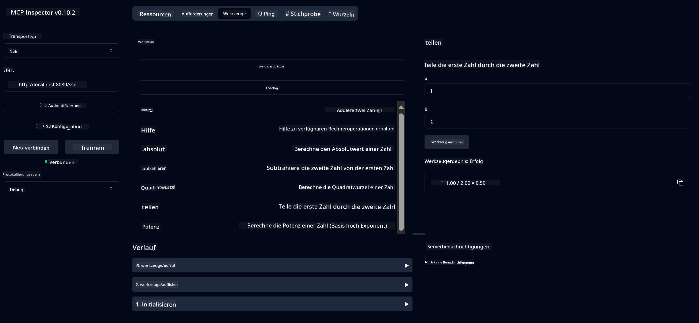

<!--
CO_OP_TRANSLATOR_METADATA:
{
  "original_hash": "ed9cab32cc67c12d8969b407aa47100a",
  "translation_date": "2025-07-13T17:51:48+00:00",
  "source_file": "03-GettingStarted/01-first-server/solution/java/README.md",
  "language_code": "de"
}
-->
# Basic Calculator MCP Service

Dieser Service bietet grundlegende Taschenrechnerfunktionen über das Model Context Protocol (MCP) mit Spring Boot und WebFlux-Transport. Er ist als einfaches Beispiel für Einsteiger gedacht, die MCP-Implementierungen kennenlernen möchten.

Weitere Informationen finden Sie in der [MCP Server Boot Starter](https://docs.spring.io/spring-ai/reference/api/mcp/mcp-server-boot-starter-docs.html)-Referenzdokumentation.


## Verwendung des Services

Der Service stellt über das MCP-Protokoll folgende API-Endpunkte bereit:

- `add(a, b)`: Zwei Zahlen addieren
- `subtract(a, b)`: Die zweite Zahl von der ersten subtrahieren
- `multiply(a, b)`: Zwei Zahlen multiplizieren
- `divide(a, b)`: Die erste Zahl durch die zweite teilen (mit Nullprüfung)
- `power(base, exponent)`: Potenz einer Zahl berechnen
- `squareRoot(number)`: Quadratwurzel berechnen (mit Prüfung auf negative Zahlen)
- `modulus(a, b)`: Rest bei der Division berechnen
- `absolute(number)`: Absoluten Wert berechnen

## Abhängigkeiten

Das Projekt benötigt folgende wichtige Abhängigkeiten:

```xml
<dependency>
    <groupId>org.springframework.ai</groupId>
    <artifactId>spring-ai-starter-mcp-server-webflux</artifactId>
</dependency>
```

## Projekt bauen

Das Projekt mit Maven bauen:
```bash
./mvnw clean install -DskipTests
```

## Server starten

### Mit Java

```bash
java -jar target/calculator-server-0.0.1-SNAPSHOT.jar
```

### Mit MCP Inspector

Der MCP Inspector ist ein hilfreiches Werkzeug zur Interaktion mit MCP-Services. So verwenden Sie ihn mit diesem Taschenrechner-Service:

1. **MCP Inspector installieren und starten** in einem neuen Terminalfenster:
   ```bash
   npx @modelcontextprotocol/inspector
   ```

2. **Auf die Web-Oberfläche zugreifen**, indem Sie auf die vom Programm angezeigte URL klicken (normalerweise http://localhost:6274)

3. **Verbindung konfigurieren**:
   - Transporttyp auf „SSE“ setzen
   - URL auf den SSE-Endpunkt Ihres laufenden Servers setzen: `http://localhost:8080/sse`
   - Auf „Connect“ klicken

4. **Werkzeuge verwenden**:
   - Auf „List Tools“ klicken, um verfügbare Taschenrechner-Operationen anzuzeigen
   - Ein Werkzeug auswählen und auf „Run Tool“ klicken, um eine Operation auszuführen



**Haftungsausschluss**:  
Dieses Dokument wurde mit dem KI-Übersetzungsdienst [Co-op Translator](https://github.com/Azure/co-op-translator) übersetzt. Obwohl wir uns um Genauigkeit bemühen, beachten Sie bitte, dass automatisierte Übersetzungen Fehler oder Ungenauigkeiten enthalten können. Das Originaldokument in seiner Ursprungssprache ist als maßgebliche Quelle zu betrachten. Für wichtige Informationen wird eine professionelle menschliche Übersetzung empfohlen. Wir übernehmen keine Haftung für Missverständnisse oder Fehlinterpretationen, die aus der Nutzung dieser Übersetzung entstehen.