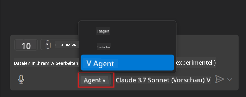
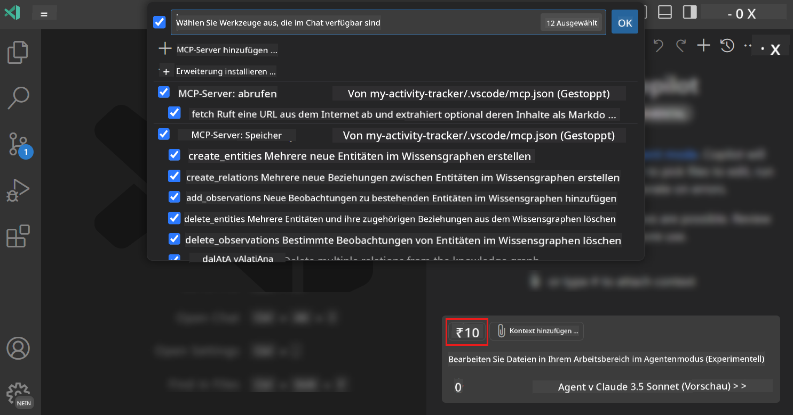
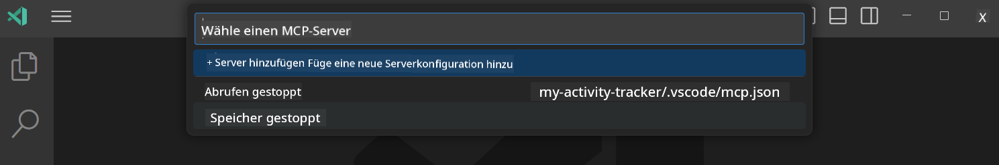
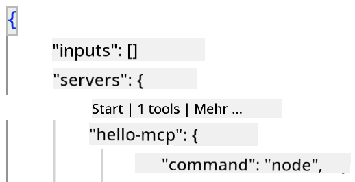
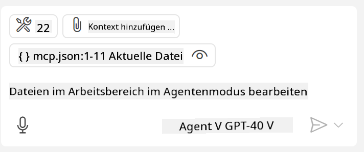
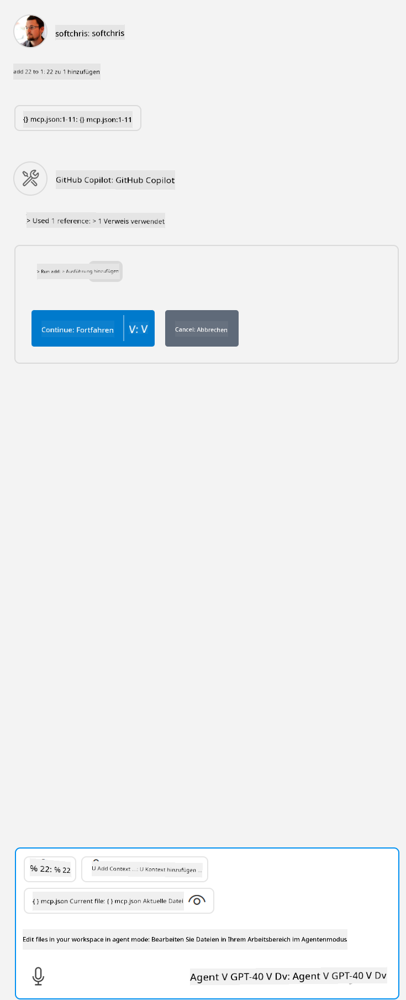

<!--
CO_OP_TRANSLATOR_METADATA:
{
  "original_hash": "d940b5e0af75e3a3a4d1c3179120d1d9",
  "translation_date": "2025-08-26T17:05:22+00:00",
  "source_file": "03-GettingStarted/04-vscode/README.md",
  "language_code": "de"
}
-->
# Verwenden eines Servers im GitHub Copilot Agent-Modus

Visual Studio Code und GitHub Copilot können als Client fungieren und einen MCP-Server nutzen. Warum sollte man das tun, fragst du dich vielleicht? Nun, das bedeutet, dass alle Funktionen, die der MCP-Server bietet, direkt in deiner IDE verfügbar sind. Stell dir vor, du fügst beispielsweise den MCP-Server von GitHub hinzu. Dadurch könntest du GitHub über Eingabeaufforderungen steuern, anstatt spezifische Befehle im Terminal einzugeben. Oder stell dir allgemein vor, wie alles, was deine Entwicklererfahrung verbessern könnte, durch natürliche Sprache gesteuert wird. Jetzt erkennst du den Vorteil, oder?

## Überblick

In dieser Lektion erfährst du, wie du Visual Studio Code und den Agent-Modus von GitHub Copilot als Client für deinen MCP-Server nutzen kannst.

## Lernziele

Am Ende dieser Lektion wirst du in der Lage sein:

- Einen MCP-Server über Visual Studio Code zu nutzen.
- Funktionen wie Tools über GitHub Copilot auszuführen.
- Visual Studio Code so zu konfigurieren, dass es deinen MCP-Server findet und verwaltet.

## Verwendung

Du kannst deinen MCP-Server auf zwei verschiedene Arten steuern:

- Benutzeroberfläche: Wie das funktioniert, wird später in diesem Kapitel gezeigt.
- Terminal: Es ist möglich, Dinge über das Terminal mit dem `code`-Befehl zu steuern:

  Um einen MCP-Server zu deinem Benutzerprofil hinzuzufügen, verwende die Option --add-mcp in der Befehlszeile und gib die JSON-Serverkonfiguration in der Form {\"name\":\"server-name\",\"command\":...} an.

  ```
  code --add-mcp "{\"name\":\"my-server\",\"command\": \"uvx\",\"args\": [\"mcp-server-fetch\"]}"
  ```

### Screenshots

  
  
  

Im nächsten Abschnitt sprechen wir mehr darüber, wie wir die visuelle Benutzeroberfläche nutzen.

## Ansatz

So gehen wir auf hoher Ebene vor:

- Eine Datei konfigurieren, um unseren MCP-Server zu finden.
- Den Server starten/verbinden, damit er seine Funktionen auflistet.
- Diese Funktionen über die GitHub Copilot Chat-Oberfläche nutzen.

Super, jetzt, da wir den Ablauf verstehen, probieren wir aus, wie man einen MCP-Server über Visual Studio Code verwendet – anhand einer Übung.

## Übung: Einen Server nutzen

In dieser Übung konfigurieren wir Visual Studio Code so, dass es deinen MCP-Server findet, damit er über die GitHub Copilot Chat-Oberfläche genutzt werden kann.

### -0- Vorbereitender Schritt: MCP-Server-Erkennung aktivieren

Möglicherweise musst du die Erkennung von MCP-Servern aktivieren.

1. Gehe zu `Datei -> Einstellungen -> Einstellungen` in Visual Studio Code.

1. Suche nach "MCP" und aktiviere `chat.mcp.discovery.enabled` in der Datei settings.json.

### -1- Konfigurationsdatei erstellen

Beginne damit, eine Konfigurationsdatei im Stammverzeichnis deines Projekts zu erstellen. Du benötigst eine Datei namens MCP.json, die in einem Ordner namens .vscode abgelegt wird. Sie sollte so aussehen:

```text
.vscode
|-- mcp.json
```

Als Nächstes sehen wir uns an, wie wir einen Servereintrag hinzufügen können.

### -2- Einen Server konfigurieren

Füge den folgenden Inhalt zu *mcp.json* hinzu:

```json
{
    "inputs": [],
    "servers": {
       "hello-mcp": {
           "command": "node",
           "args": [
               "build/index.js"
           ]
       }
    }
}
```

Das obige Beispiel zeigt, wie man einen Server startet, der in Node.js geschrieben ist. Für andere Laufzeiten gib den entsprechenden Befehl zum Starten des Servers mit `command` und `args` an.

### -3- Den Server starten

Nachdem du einen Eintrag hinzugefügt hast, starte den Server:

1. Suche deinen Eintrag in *mcp.json* und stelle sicher, dass du das "Play"-Symbol findest:

    

1. Klicke auf das "Play"-Symbol. Du solltest sehen, dass das Tools-Symbol in der GitHub Copilot Chat-Oberfläche die Anzahl der verfügbaren Tools erhöht. Wenn du auf dieses Tools-Symbol klickst, siehst du eine Liste der registrierten Tools. Du kannst jedes Tool aktivieren/deaktivieren, je nachdem, ob du möchtest, dass GitHub Copilot sie als Kontext verwendet:

  

1. Um ein Tool auszuführen, gib eine Eingabeaufforderung ein, die mit der Beschreibung eines deiner Tools übereinstimmt, z. B. eine Eingabeaufforderung wie "add 22 to 1":

  

  Du solltest eine Antwort mit 23 sehen.

## Aufgabe

Versuche, einen Servereintrag zu deiner *mcp.json*-Datei hinzuzufügen, und stelle sicher, dass du den Server starten/stoppen kannst. Stelle außerdem sicher, dass du über die GitHub Copilot Chat-Oberfläche mit den Tools auf deinem Server kommunizieren kannst.

## Lösung

[Lösung](./solution/README.md)

## Wichtige Erkenntnisse

Die wichtigsten Erkenntnisse aus diesem Kapitel sind:

- Visual Studio Code ist ein großartiger Client, mit dem du mehrere MCP-Server und deren Tools nutzen kannst.
- Die GitHub Copilot Chat-Oberfläche ist die Schnittstelle, über die du mit den Servern interagierst.
- Du kannst den Benutzer nach Eingaben wie API-Schlüsseln fragen, die beim Konfigurieren des Servereintrags in der *mcp.json*-Datei an den MCP-Server übergeben werden können.

## Beispiele

- [Java-Rechner](../samples/java/calculator/README.md)  
- [.Net-Rechner](../../../../03-GettingStarted/samples/csharp)  
- [JavaScript-Rechner](../samples/javascript/README.md)  
- [TypeScript-Rechner](../samples/typescript/README.md)  
- [Python-Rechner](../../../../03-GettingStarted/samples/python)  

## Zusätzliche Ressourcen

- [Visual Studio-Dokumentation](https://code.visualstudio.com/docs/copilot/chat/mcp-servers)

## Was kommt als Nächstes?

- Weiter: [Einen stdio-Server erstellen](../05-stdio-server/README.md)  

---

**Haftungsausschluss**:  
Dieses Dokument wurde mit dem KI-Übersetzungsdienst [Co-op Translator](https://github.com/Azure/co-op-translator) übersetzt. Obwohl wir uns um Genauigkeit bemühen, beachten Sie bitte, dass automatisierte Übersetzungen Fehler oder Ungenauigkeiten enthalten können. Das Originaldokument in seiner ursprünglichen Sprache sollte als maßgebliche Quelle betrachtet werden. Für kritische Informationen wird eine professionelle menschliche Übersetzung empfohlen. Wir übernehmen keine Haftung für Missverständnisse oder Fehlinterpretationen, die sich aus der Nutzung dieser Übersetzung ergeben.