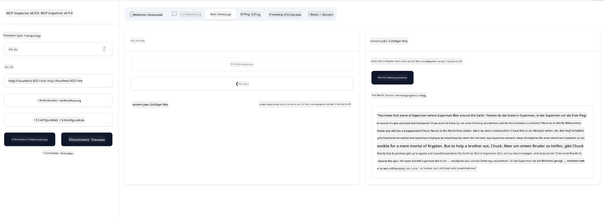

<!--
CO_OP_TRANSLATOR_METADATA:
{
  "original_hash": "0a8086dc4bf89448f83e7936db972c42",
  "translation_date": "2025-05-16T15:17:13+00:00",
  "source_file": "03-GettingStarted/05-sse-server/README.md",
  "language_code": "de"
}
-->
Jetzt, wo wir ein bisschen mehr über SSE wissen, bauen wir als Nächstes einen SSE-Server.

## Übung: Erstellen eines SSE-Servers

Um unseren Server zu erstellen, müssen wir zwei Dinge beachten:

- Wir müssen einen Webserver verwenden, um Endpunkte für die Verbindung und Nachrichten bereitzustellen.
- Baue unseren Server wie gewohnt mit Tools, Ressourcen und Eingabeaufforderungen auf, wie wir es bei stdio gemacht haben.

### -1- Erstellen einer Serverinstanz

Um unseren Server zu erstellen, verwenden wir dieselben Typen wie bei stdio. Für den Transport müssen wir jedoch SSE auswählen.

Fügen wir als Nächstes die benötigten Routen hinzu.

### -2- Routen hinzufügen

Fügen wir als Nächstes Routen hinzu, die die Verbindung und eingehenden Nachrichten verwalten:

Fügen wir nun dem Server weitere Funktionen hinzu.

### -3- Hinzufügen von Serverfunktionen

Jetzt, wo wir alles SSE-spezifische definiert haben, fügen wir dem Server Funktionen wie Tools, Eingabeaufforderungen und Ressourcen hinzu.

Dein vollständiger Code sollte so aussehen:

Super, wir haben einen Server, der SSE verwendet. Testen wir ihn als Nächstes.

## Übung: Debuggen eines SSE-Servers mit dem Inspector

Inspector ist ein großartiges Werkzeug, das wir in einer vorherigen Lektion [Creating your first server](/03-GettingStarted/01-first-server/README.md) kennengelernt haben. Schauen wir, ob wir den Inspector auch hier verwenden können:

### -1- Ausführen des Inspectors

Um den Inspector auszuführen, muss zuerst ein SSE-Server laufen, also machen wir das als Nächstes:

1. Server starten

1. Inspector starten

    > ![NOTE]
    > Führe diesen Befehl in einem separaten Terminalfenster aus, in dem der Server nicht läuft. Beachte außerdem, dass du den untenstehenden Befehl an die URL anpassen musst, unter der dein Server läuft.

    ```sh
    npx @modelcontextprotocol/inspector --cli http://localhost:8000/sse --method tools/list
    ```

    Das Ausführen des Inspectors sieht in allen Laufzeitumgebungen gleich aus. Beachte, dass wir statt eines Pfads zum Server und eines Befehls zum Starten des Servers die URL übergeben, unter der der Server läuft, und außerdem die Route `/sse` angeben.

### -2- Das Tool ausprobieren

Verbinde den Server, indem du in der Dropdown-Liste SSE auswählst und im URL-Feld die Adresse eingibst, unter der dein Server läuft, z. B. http:localhost:4321/sse. Klicke dann auf die Schaltfläche „Connect“. Wie zuvor kannst du Tools auflisten, ein Tool auswählen und Eingabewerte angeben. Du solltest ein Ergebnis wie unten sehen:



Super, du kannst mit dem Inspector arbeiten. Schauen wir uns nun an, wie wir mit Visual Studio Code arbeiten können.

## Aufgabe

Versuche, deinen Server mit mehr Funktionen auszubauen. Sieh dir [diese Seite](https://api.chucknorris.io/) an, um zum Beispiel ein Tool hinzuzufügen, das eine API aufruft. Du entscheidest, wie dein Server aussehen soll. Viel Spaß :)

## Lösung

[Lösung](./solution/README.md) Hier findest du eine mögliche Lösung mit funktionierendem Code.

## Wichtige Erkenntnisse

Die wichtigsten Erkenntnisse aus diesem Kapitel sind:

- SSE ist der zweite unterstützte Transport neben stdio.
- Um SSE zu unterstützen, musst du eingehende Verbindungen und Nachrichten mit einem Webframework verwalten.
- Du kannst sowohl Inspector als auch Visual Studio Code verwenden, um SSE-Server zu nutzen, genauso wie bei stdio-Servern. Beachte, dass es einige Unterschiede zwischen stdio und SSE gibt. Bei SSE musst du den Server separat starten und dann das Inspector-Tool ausführen. Beim Inspector-Tool musst du außerdem die URL angeben.

## Beispiele

- [Java Calculator](../samples/java/calculator/README.md)
- [.Net Calculator](../../../../03-GettingStarted/samples/csharp)
- [JavaScript Calculator](../samples/javascript/README.md)
- [TypeScript Calculator](../samples/typescript/README.md)
- [Python Calculator](../../../../03-GettingStarted/samples/python)

## Zusätzliche Ressourcen

- [SSE](https://developer.mozilla.org/en-US/docs/Web/API/Server-sent_events)

## Was kommt als Nächstes

- Nächstes Thema: [Getting Started with AI Toolkit for VSCode](/03-GettingStarted/06-aitk/README.md)

**Haftungsausschluss**:  
Dieses Dokument wurde mit dem KI-Übersetzungsdienst [Co-op Translator](https://github.com/Azure/co-op-translator) übersetzt. Obwohl wir uns um Genauigkeit bemühen, beachten Sie bitte, dass automatisierte Übersetzungen Fehler oder Ungenauigkeiten enthalten können. Das Originaldokument in seiner Ursprungssprache ist als maßgebliche Quelle zu betrachten. Für wichtige Informationen wird eine professionelle menschliche Übersetzung empfohlen. Wir übernehmen keine Haftung für Missverständnisse oder Fehlinterpretationen, die aus der Nutzung dieser Übersetzung entstehen.