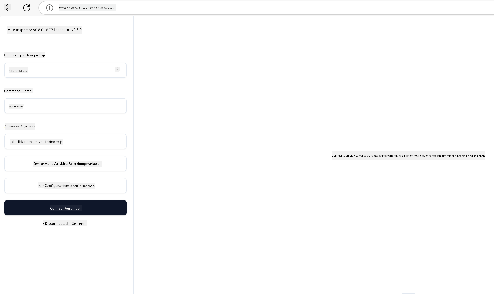

<!--
CO_OP_TRANSLATOR_METADATA:
{
  "original_hash": "4e34e34e84f013e73c7eaa6d09884756",
  "translation_date": "2025-07-13T21:56:37+00:00",
  "source_file": "03-GettingStarted/08-testing/README.md",
  "language_code": "de"
}
-->
## Testen und Debuggen

Bevor Sie mit dem Testen Ihres MCP-Servers beginnen, ist es wichtig, die verfügbaren Werkzeuge und bewährten Methoden zum Debuggen zu verstehen. Effektives Testen stellt sicher, dass Ihr Server wie erwartet funktioniert und hilft Ihnen, Probleme schnell zu erkennen und zu beheben. Der folgende Abschnitt beschreibt empfohlene Vorgehensweisen zur Validierung Ihrer MCP-Implementierung.

## Überblick

Diese Lektion behandelt, wie Sie den richtigen Testansatz und das effektivste Testwerkzeug auswählen.

## Lernziele

Am Ende dieser Lektion werden Sie in der Lage sein:

- Verschiedene Testansätze zu beschreiben.
- Unterschiedliche Werkzeuge zu nutzen, um Ihren Code effektiv zu testen.

## Testen von MCP-Servern

MCP stellt Werkzeuge bereit, die Ihnen beim Testen und Debuggen Ihrer Server helfen:

- **MCP Inspector**: Ein Kommandozeilenwerkzeug, das sowohl als CLI-Tool als auch als visuelles Tool verwendet werden kann.
- **Manuelles Testen**: Sie können ein Tool wie curl verwenden, um Webanfragen auszuführen, aber jedes Tool, das HTTP unterstützt, ist geeignet.
- **Unit Testing**: Es ist möglich, Ihr bevorzugtes Testframework zu verwenden, um die Funktionen von Server und Client zu testen.

### Verwendung des MCP Inspector

Wir haben die Nutzung dieses Tools in vorherigen Lektionen beschrieben, aber hier eine kurze Übersicht. Es ist ein in Node.js entwickeltes Tool, das Sie über den `npx`-Befehl ausführen können. Dieser lädt das Tool temporär herunter, installiert es und entfernt es nach der Ausführung Ihrer Anfrage wieder.

Der [MCP Inspector](https://github.com/modelcontextprotocol/inspector) hilft Ihnen dabei:

- **Serverfähigkeiten entdecken**: Automatische Erkennung verfügbarer Ressourcen, Werkzeuge und Prompts
- **Werkzeugausführung testen**: Verschiedene Parameter ausprobieren und Antworten in Echtzeit sehen
- **Server-Metadaten anzeigen**: Serverinformationen, Schemata und Konfigurationen einsehen

Ein typischer Aufruf des Tools sieht folgendermaßen aus:

```bash
npx @modelcontextprotocol/inspector node build/index.js
```

Der obige Befehl startet einen MCP und seine visuelle Oberfläche und öffnet eine lokale Weboberfläche in Ihrem Browser. Sie sehen ein Dashboard mit Ihren registrierten MCP-Servern, deren verfügbaren Werkzeugen, Ressourcen und Prompts. Die Oberfläche ermöglicht es Ihnen, die Werkzeugausführung interaktiv zu testen, Server-Metadaten zu inspizieren und Echtzeitantworten zu betrachten, was die Validierung und das Debuggen Ihrer MCP-Server-Implementierungen erleichtert.

So könnte das aussehen: 

Sie können das Tool auch im CLI-Modus ausführen, indem Sie das Attribut `--cli` hinzufügen. Hier ein Beispiel für die Ausführung im "CLI"-Modus, das alle Werkzeuge auf dem Server auflistet:

```sh
npx @modelcontextprotocol/inspector --cli node build/index.js --method tools/list
```

### Manuelles Testen

Neben dem Einsatz des Inspector-Tools zum Testen der Serverfähigkeiten gibt es einen ähnlichen Ansatz, bei dem ein Client verwendet wird, der HTTP unterstützt, wie zum Beispiel curl.

Mit curl können Sie MCP-Server direkt über HTTP-Anfragen testen:

```bash
# Example: Test server metadata
curl http://localhost:3000/v1/metadata

# Example: Execute a tool
curl -X POST http://localhost:3000/v1/tools/execute \
  -H "Content-Type: application/json" \
  -d '{"name": "calculator", "parameters": {"expression": "2+2"}}'
```

Wie Sie an dem obigen Beispiel mit curl sehen, verwenden Sie eine POST-Anfrage, um ein Werkzeug mit einer Nutzlast aufzurufen, die den Namen des Werkzeugs und dessen Parameter enthält. Wählen Sie den Ansatz, der für Sie am besten passt. CLI-Tools sind in der Regel schneller zu bedienen und lassen sich gut skripten, was in einer CI/CD-Umgebung nützlich sein kann.

### Unit Testing

Erstellen Sie Unit-Tests für Ihre Werkzeuge und Ressourcen, um sicherzustellen, dass sie wie erwartet funktionieren. Hier ein Beispiel für Testcode:

```python
import pytest

from mcp.server.fastmcp import FastMCP
from mcp.shared.memory import (
    create_connected_server_and_client_session as create_session,
)

# Mark the whole module for async tests
pytestmark = pytest.mark.anyio


async def test_list_tools_cursor_parameter():
    """Test that the cursor parameter is accepted for list_tools.

    Note: FastMCP doesn't currently implement pagination, so this test
    only verifies that the cursor parameter is accepted by the client.
    """

 server = FastMCP("test")

    # Create a couple of test tools
    @server.tool(name="test_tool_1")
    async def test_tool_1() -> str:
        """First test tool"""
        return "Result 1"

    @server.tool(name="test_tool_2")
    async def test_tool_2() -> str:
        """Second test tool"""
        return "Result 2"

    async with create_session(server._mcp_server) as client_session:
        # Test without cursor parameter (omitted)
        result1 = await client_session.list_tools()
        assert len(result1.tools) == 2

        # Test with cursor=None
        result2 = await client_session.list_tools(cursor=None)
        assert len(result2.tools) == 2

        # Test with cursor as string
        result3 = await client_session.list_tools(cursor="some_cursor_value")
        assert len(result3.tools) == 2

        # Test with empty string cursor
        result4 = await client_session.list_tools(cursor="")
        assert len(result4.tools) == 2
    
```

Der obige Code macht Folgendes:

- Nutzt das pytest-Framework, mit dem Sie Tests als Funktionen erstellen und assert-Anweisungen verwenden können.
- Erstellt einen MCP-Server mit zwei verschiedenen Werkzeugen.
- Verwendet `assert`, um zu überprüfen, ob bestimmte Bedingungen erfüllt sind.

Sehen Sie sich die [vollständige Datei hier](https://github.com/modelcontextprotocol/python-sdk/blob/main/tests/client/test_list_methods_cursor.py) an.

Anhand dieser Datei können Sie Ihren eigenen Server testen, um sicherzustellen, dass die Fähigkeiten wie vorgesehen erstellt werden.

Alle wichtigen SDKs haben ähnliche Testabschnitte, sodass Sie diese an Ihre gewählte Laufzeitumgebung anpassen können.

## Beispiele

- [Java Calculator](../samples/java/calculator/README.md)
- [.Net Calculator](../../../../03-GettingStarted/samples/csharp)
- [JavaScript Calculator](../samples/javascript/README.md)
- [TypeScript Calculator](../samples/typescript/README.md)
- [Python Calculator](../../../../03-GettingStarted/samples/python)

## Zusätzliche Ressourcen

- [Python SDK](https://github.com/modelcontextprotocol/python-sdk)

## Was kommt als Nächstes

- Weiter: [Deployment](../09-deployment/README.md)

**Haftungsausschluss**:  
Dieses Dokument wurde mit dem KI-Übersetzungsdienst [Co-op Translator](https://github.com/Azure/co-op-translator) übersetzt. Obwohl wir uns um Genauigkeit bemühen, beachten Sie bitte, dass automatisierte Übersetzungen Fehler oder Ungenauigkeiten enthalten können. Das Originaldokument in seiner Ursprungssprache ist als maßgebliche Quelle zu betrachten. Für wichtige Informationen wird eine professionelle menschliche Übersetzung empfohlen. Wir übernehmen keine Haftung für Missverständnisse oder Fehlinterpretationen, die aus der Nutzung dieser Übersetzung entstehen.