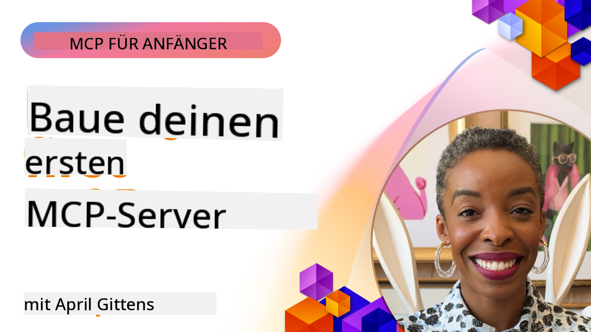

<!--
CO_OP_TRANSLATOR_METADATA:
{
  "original_hash": "1197b6dbde36773e04a5ae826557fdb9",
  "translation_date": "2025-08-26T17:05:01+00:00",
  "source_file": "03-GettingStarted/README.md",
  "language_code": "de"
}
-->
## Erste Schritte  

_(Klicken Sie auf das Bild oben, um das Video zu dieser Lektion anzusehen)_

Dieser Abschnitt besteht aus mehreren Lektionen:

- **1 Ihr erster Server**: In dieser ersten Lektion lernen Sie, wie Sie Ihren ersten Server erstellen und ihn mit dem Inspektor-Tool überprüfen können – eine wertvolle Methode, um Ihren Server zu testen und zu debuggen. [Zur Lektion](01-first-server/README.md)

- **2 Client**: In dieser Lektion lernen Sie, wie Sie einen Client schreiben, der sich mit Ihrem Server verbinden kann. [Zur Lektion](02-client/README.md)

- **3 Client mit LLM**: Eine noch bessere Möglichkeit, einen Client zu schreiben, besteht darin, ein LLM hinzuzufügen, damit es mit Ihrem Server „verhandeln“ kann, was zu tun ist. [Zur Lektion](03-llm-client/README.md)

- **4 Nutzung des GitHub Copilot Agent-Modus in Visual Studio Code**: Hier betrachten wir, wie Sie Ihren MCP-Server direkt in Visual Studio Code ausführen können. [Zur Lektion](04-vscode/README.md)

- **5 stdio Transport Server**: Der stdio-Transport ist der empfohlene Standard für die Kommunikation zwischen MCP-Server und -Client in der aktuellen Spezifikation und bietet eine sichere, auf Subprozessen basierende Kommunikation. [Zur Lektion](05-stdio-server/README.md)

- **6 HTTP-Streaming mit MCP (Streamable HTTP)**: Lernen Sie modernes HTTP-Streaming, Fortschrittsbenachrichtigungen und wie Sie skalierbare, Echtzeit-MCP-Server und -Clients mit Streamable HTTP implementieren können. [Zur Lektion](06-http-streaming/README.md)

- **7 Nutzung des AI-Toolkits für VSCode**: Konsumieren und testen Sie Ihre MCP-Clients und -Server. [Zur Lektion](07-aitk/README.md)

- **8 Testen**: Hier konzentrieren wir uns besonders darauf, wie wir unseren Server und Client auf verschiedene Arten testen können. [Zur Lektion](08-testing/README.md)

- **9 Bereitstellung**: Dieses Kapitel beleuchtet verschiedene Möglichkeiten, Ihre MCP-Lösungen bereitzustellen. [Zur Lektion](09-deployment/README.md)

Das Model Context Protocol (MCP) ist ein offenes Protokoll, das standardisiert, wie Anwendungen Kontext für LLMs bereitstellen. Denken Sie an MCP wie an einen USB-C-Anschluss für KI-Anwendungen – es bietet eine standardisierte Möglichkeit, KI-Modelle mit verschiedenen Datenquellen und Tools zu verbinden.

## Lernziele

Am Ende dieser Lektion werden Sie in der Lage sein:

- Entwicklungsumgebungen für MCP in C#, Java, Python, TypeScript und JavaScript einzurichten
- Grundlegende MCP-Server mit benutzerdefinierten Funktionen (Ressourcen, Prompts und Tools) zu erstellen und bereitzustellen
- Host-Anwendungen zu erstellen, die sich mit MCP-Servern verbinden
- MCP-Implementierungen zu testen und zu debuggen
- Häufige Einrichtungsprobleme und deren Lösungen zu verstehen
- Ihre MCP-Implementierungen mit beliebten LLM-Diensten zu verbinden

## Einrichtung Ihrer MCP-Umgebung

Bevor Sie mit MCP arbeiten, ist es wichtig, Ihre Entwicklungsumgebung vorzubereiten und den grundlegenden Workflow zu verstehen. Dieser Abschnitt führt Sie durch die ersten Schritte, um einen reibungslosen Start mit MCP zu gewährleisten.

### Voraussetzungen

Bevor Sie mit der MCP-Entwicklung beginnen, stellen Sie sicher, dass Sie Folgendes haben:

- **Entwicklungsumgebung**: Für Ihre gewählte Sprache (C#, Java, Python, TypeScript oder JavaScript)
- **IDE/Editor**: Visual Studio, Visual Studio Code, IntelliJ, Eclipse, PyCharm oder einen modernen Code-Editor
- **Paketmanager**: NuGet, Maven/Gradle, pip oder npm/yarn
- **API-Schlüssel**: Für alle KI-Dienste, die Sie in Ihren Host-Anwendungen verwenden möchten

### Offizielle SDKs

In den kommenden Kapiteln werden Sie Lösungen sehen, die mit Python, TypeScript, Java und .NET erstellt wurden. Hier sind alle offiziell unterstützten SDKs.

MCP bietet offizielle SDKs für mehrere Sprachen:
- [C# SDK](https://github.com/modelcontextprotocol/csharp-sdk) – In Zusammenarbeit mit Microsoft gepflegt
- [Java SDK](https://github.com/modelcontextprotocol/java-sdk) – In Zusammenarbeit mit Spring AI gepflegt
- [TypeScript SDK](https://github.com/modelcontextprotocol/typescript-sdk) – Die offizielle TypeScript-Implementierung
- [Python SDK](https://github.com/modelcontextprotocol/python-sdk) – Die offizielle Python-Implementierung
- [Kotlin SDK](https://github.com/modelcontextprotocol/kotlin-sdk) – Die offizielle Kotlin-Implementierung
- [Swift SDK](https://github.com/modelcontextprotocol/swift-sdk) – In Zusammenarbeit mit Loopwork AI gepflegt
- [Rust SDK](https://github.com/modelcontextprotocol/rust-sdk) – Die offizielle Rust-Implementierung

## Wichtige Erkenntnisse

- Die Einrichtung einer MCP-Entwicklungsumgebung ist mit sprachspezifischen SDKs unkompliziert
- Der Aufbau von MCP-Servern umfasst das Erstellen und Registrieren von Tools mit klaren Schemata
- MCP-Clients verbinden sich mit Servern und Modellen, um erweiterte Funktionen zu nutzen
- Testen und Debuggen sind entscheidend für zuverlässige MCP-Implementierungen
- Bereitstellungsoptionen reichen von lokaler Entwicklung bis hin zu cloudbasierten Lösungen

## Üben

Wir haben eine Reihe von Beispielen, die die Übungen in allen Kapiteln dieses Abschnitts ergänzen. Zusätzlich hat jedes Kapitel eigene Übungen und Aufgaben.

- [Java-Rechner](./samples/java/calculator/README.md)
- [.Net-Rechner](../../../03-GettingStarted/samples/csharp)
- [JavaScript-Rechner](./samples/javascript/README.md)
- [TypeScript-Rechner](./samples/typescript/README.md)
- [Python-Rechner](../../../03-GettingStarted/samples/python)

## Zusätzliche Ressourcen

- [Erstellen von Agents mit dem Model Context Protocol auf Azure](https://learn.microsoft.com/azure/developer/ai/intro-agents-mcp)
- [Remote-MCP mit Azure Container Apps (Node.js/TypeScript/JavaScript)](https://learn.microsoft.com/samples/azure-samples/mcp-container-ts/mcp-container-ts/)
- [.NET OpenAI MCP Agent](https://learn.microsoft.com/samples/azure-samples/openai-mcp-agent-dotnet/openai-mcp-agent-dotnet/)

## Was kommt als Nächstes?

Weiter: [Erstellen Ihres ersten MCP-Servers](01-first-server/README.md)

---

**Haftungsausschluss**:  
Dieses Dokument wurde mit dem KI-Übersetzungsdienst [Co-op Translator](https://github.com/Azure/co-op-translator) übersetzt. Obwohl wir uns um Genauigkeit bemühen, beachten Sie bitte, dass automatisierte Übersetzungen Fehler oder Ungenauigkeiten enthalten können. Das Originaldokument in seiner ursprünglichen Sprache sollte als maßgebliche Quelle betrachtet werden. Für kritische Informationen wird eine professionelle menschliche Übersetzung empfohlen. Wir übernehmen keine Haftung für Missverständnisse oder Fehlinterpretationen, die sich aus der Nutzung dieser Übersetzung ergeben.