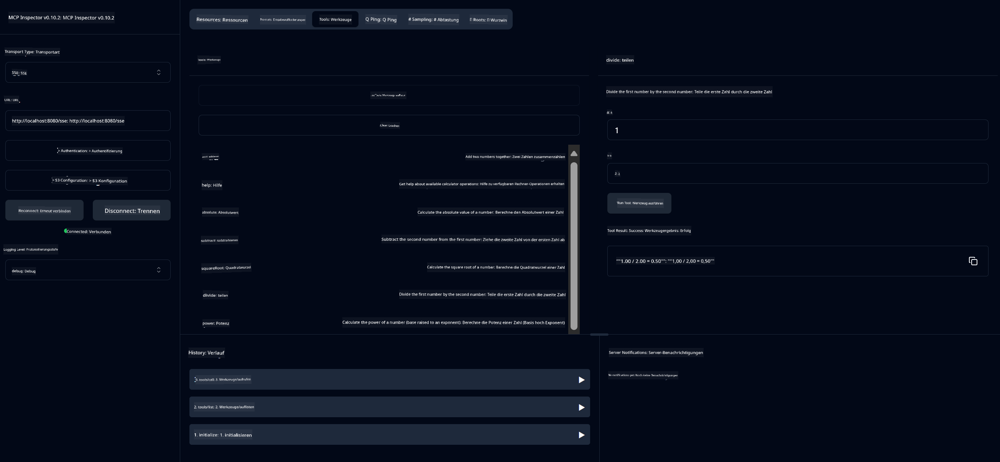

<!--
CO_OP_TRANSLATOR_METADATA:
{
  "original_hash": "13231e9951b68efd9df8c56bd5cdb27e",
  "translation_date": "2025-07-13T22:20:55+00:00",
  "source_file": "03-GettingStarted/samples/java/calculator/README.md",
  "language_code": "de"
}
-->
# Basic Calculator MCP Service

Dieser Service bietet grundlegende Taschenrechnerfunktionen über das Model Context Protocol (MCP) mit Spring Boot und WebFlux-Transport. Er ist als einfaches Beispiel für Einsteiger gedacht, die MCP-Implementierungen kennenlernen möchten.

Weitere Informationen finden Sie in der [MCP Server Boot Starter](https://docs.spring.io/spring-ai/reference/api/mcp/mcp-server-boot-starter-docs.html)-Referenzdokumentation.

## Überblick

Der Service zeigt:
- Unterstützung für SSE (Server-Sent Events)
- Automatische Tool-Registrierung mit der `@Tool`-Annotation von Spring AI
- Grundlegende Taschenrechnerfunktionen:
  - Addition, Subtraktion, Multiplikation, Division
  - Potenz- und Quadratwurzelberechnung
  - Modulo (Rest) und Absolutwert
  - Hilfefunktion zur Beschreibung der Operationen

## Funktionen

Dieser Taschenrechner-Service bietet folgende Möglichkeiten:

1. **Grundrechenarten**:
   - Addition von zwei Zahlen
   - Subtraktion einer Zahl von einer anderen
   - Multiplikation von zwei Zahlen
   - Division einer Zahl durch eine andere (mit Prüfung auf Division durch Null)

2. **Erweiterte Operationen**:
   - Potenzberechnung (Basis hoch Exponent)
   - Quadratwurzelberechnung (mit Prüfung auf negative Zahlen)
   - Modulo-Berechnung (Rest bei Division)
   - Berechnung des Absolutwerts

3. **Hilfesystem**:
   - Eingebaute Hilfefunktion, die alle verfügbaren Operationen erklärt

## Nutzung des Services

Der Service stellt folgende API-Endpunkte über das MCP-Protokoll bereit:

- `add(a, b)`: Addiert zwei Zahlen
- `subtract(a, b)`: Subtrahiert die zweite Zahl von der ersten
- `multiply(a, b)`: Multipliziert zwei Zahlen
- `divide(a, b)`: Dividiert die erste Zahl durch die zweite (mit Nullprüfung)
- `power(base, exponent)`: Berechnet die Potenz einer Zahl
- `squareRoot(number)`: Berechnet die Quadratwurzel (mit Prüfung auf negative Zahlen)
- `modulus(a, b)`: Berechnet den Rest bei der Division
- `absolute(number)`: Berechnet den Absolutwert
- `help()`: Gibt Informationen zu den verfügbaren Operationen

## Test-Client

Ein einfacher Test-Client ist im Paket `com.microsoft.mcp.sample.client` enthalten. Die Klasse `SampleCalculatorClient` zeigt die verfügbaren Operationen des Taschenrechner-Services.

## Nutzung des LangChain4j-Clients

Das Projekt enthält einen LangChain4j-Beispielclient in `com.microsoft.mcp.sample.client.LangChain4jClient`, der zeigt, wie man den Taschenrechner-Service mit LangChain4j und GitHub-Modellen integriert:

### Voraussetzungen

1. **GitHub-Token einrichten**:
   
   Um die AI-Modelle von GitHub (wie phi-4) zu nutzen, benötigen Sie ein persönliches Zugriffstoken von GitHub:

   a. Gehen Sie zu Ihren GitHub-Kontoeinstellungen: https://github.com/settings/tokens
   
   b. Klicken Sie auf „Generate new token“ → „Generate new token (classic)“
   
   c. Vergeben Sie einen aussagekräftigen Namen für Ihr Token
   
   d. Wählen Sie folgende Berechtigungen aus:
      - `repo` (Vollzugriff auf private Repositories)
      - `read:org` (Lesen von Organisations- und Teammitgliedschaften, Organisationsprojekte)
      - `gist` (Gists erstellen)
      - `user:email` (Zugriff auf Benutzer-E-Mail-Adressen (nur lesend))
   
   e. Klicken Sie auf „Generate token“ und kopieren Sie das neue Token
   
   f. Legen Sie es als Umgebungsvariable fest:
      
      Unter Windows:
      ```
      set GITHUB_TOKEN=your-github-token
      ```
      
      Unter macOS/Linux:
      ```bash
      export GITHUB_TOKEN=your-github-token
      ```

   g. Für eine dauerhafte Einrichtung fügen Sie es über die Systemeinstellungen zu Ihren Umgebungsvariablen hinzu

2. Fügen Sie die LangChain4j GitHub-Abhängigkeit zu Ihrem Projekt hinzu (bereits in pom.xml enthalten):
   ```xml
   <dependency>
       <groupId>dev.langchain4j</groupId>
       <artifactId>langchain4j-github</artifactId>
       <version>${langchain4j.version}</version>
   </dependency>
   ```

3. Stellen Sie sicher, dass der Taschenrechner-Server auf `localhost:8080` läuft

### Ausführen des LangChain4j-Clients

Dieses Beispiel zeigt:
- Verbindung zum Taschenrechner-MCP-Server über SSE-Transport
- Verwendung von LangChain4j zur Erstellung eines Chatbots, der Taschenrechnerfunktionen nutzt
- Integration mit GitHub AI-Modellen (aktuell das phi-4 Modell)

Der Client sendet folgende Beispielanfragen, um die Funktionalität zu demonstrieren:
1. Berechnung der Summe zweier Zahlen
2. Berechnung der Quadratwurzel einer Zahl
3. Abruf von Hilfsinformationen zu den verfügbaren Taschenrechneroperationen

Führen Sie das Beispiel aus und prüfen Sie die Konsolenausgabe, um zu sehen, wie das AI-Modell die Taschenrechner-Tools zur Beantwortung der Anfragen nutzt.

### GitHub-Modellkonfiguration

Der LangChain4j-Client ist so konfiguriert, dass er das GitHub-Modell phi-4 mit folgenden Einstellungen verwendet:

```java
ChatLanguageModel model = GitHubChatModel.builder()
    .apiKey(System.getenv("GITHUB_TOKEN"))
    .timeout(Duration.ofSeconds(60))
    .modelName("phi-4")
    .logRequests(true)
    .logResponses(true)
    .build();
```

Um andere GitHub-Modelle zu verwenden, ändern Sie einfach den Parameter `modelName` auf ein anderes unterstütztes Modell (z. B. "claude-3-haiku-20240307", "llama-3-70b-8192" usw.).

## Abhängigkeiten

Das Projekt benötigt folgende wichtige Abhängigkeiten:

```xml
<!-- For MCP Server -->
<dependency>
    <groupId>org.springframework.ai</groupId>
    <artifactId>spring-ai-starter-mcp-server-webflux</artifactId>
</dependency>

<!-- For LangChain4j integration -->
<dependency>
    <groupId>dev.langchain4j</groupId>
    <artifactId>langchain4j-mcp</artifactId>
    <version>${langchain4j.version}</version>
</dependency>

<!-- For GitHub models support -->
<dependency>
    <groupId>dev.langchain4j</groupId>
    <artifactId>langchain4j-github</artifactId>
    <version>${langchain4j.version}</version>
</dependency>
```

## Projekt bauen

Bauen Sie das Projekt mit Maven:
```bash
./mvnw clean install -DskipTests
```

## Server starten

### Mit Java

```bash
java -jar target/calculator-server-0.0.1-SNAPSHOT.jar
```

### Mit MCP Inspector

Der MCP Inspector ist ein hilfreiches Tool zur Interaktion mit MCP-Services. So verwenden Sie ihn mit diesem Taschenrechner-Service:

1. **Installieren und starten Sie MCP Inspector** in einem neuen Terminalfenster:
   ```bash
   npx @modelcontextprotocol/inspector
   ```

2. **Öffnen Sie die Weboberfläche**, indem Sie auf die vom Programm angezeigte URL klicken (normalerweise http://localhost:6274)

3. **Konfigurieren Sie die Verbindung**:
   - Stellen Sie den Transporttyp auf „SSE“
   - Geben Sie die URL zum SSE-Endpunkt Ihres laufenden Servers ein: `http://localhost:8080/sse`
   - Klicken Sie auf „Connect“

4. **Verwenden Sie die Tools**:
   - Klicken Sie auf „List Tools“, um die verfügbaren Taschenrechneroperationen anzuzeigen
   - Wählen Sie ein Tool aus und klicken Sie auf „Run Tool“, um eine Operation auszuführen



### Mit Docker

Das Projekt enthält eine Dockerfile für die containerisierte Bereitstellung:

1. **Bauen Sie das Docker-Image**:
   ```bash
   docker build -t calculator-mcp-service .
   ```

2. **Starten Sie den Docker-Container**:
   ```bash
   docker run -p 8080:8080 calculator-mcp-service
   ```

Dies bewirkt:
- Erstellung eines Multi-Stage-Docker-Images mit Maven 3.9.9 und Eclipse Temurin 24 JDK
- Erstellung eines optimierten Container-Images
- Freigabe des Dienstes auf Port 8080
- Start des MCP-Taschenrechner-Services im Container

Sie können den Service unter `http://localhost:8080` erreichen, sobald der Container läuft.

## Fehlerbehebung

### Häufige Probleme mit dem GitHub-Token

1. **Token-Berechtigungsprobleme**: Wenn Sie einen 403 Forbidden-Fehler erhalten, prüfen Sie, ob Ihr Token die korrekten Berechtigungen gemäß den Voraussetzungen hat.

2. **Token nicht gefunden**: Wenn die Fehlermeldung „No API key found“ erscheint, stellen Sie sicher, dass die Umgebungsvariable GITHUB_TOKEN korrekt gesetzt ist.

3. **Rate-Limiting**: Die GitHub-API hat Nutzungsbeschränkungen. Bei einem Rate-Limit-Fehler (Statuscode 429) warten Sie einige Minuten, bevor Sie es erneut versuchen.

4. **Token-Ablauf**: GitHub-Tokens können ablaufen. Wenn Sie nach einiger Zeit Authentifizierungsfehler erhalten, erstellen Sie ein neues Token und aktualisieren Sie Ihre Umgebungsvariable.

Bei weiteren Fragen konsultieren Sie die [LangChain4j-Dokumentation](https://github.com/langchain4j/langchain4j) oder die [GitHub API-Dokumentation](https://docs.github.com/en/rest).

**Haftungsausschluss**:  
Dieses Dokument wurde mit dem KI-Übersetzungsdienst [Co-op Translator](https://github.com/Azure/co-op-translator) übersetzt. Obwohl wir uns um Genauigkeit bemühen, beachten Sie bitte, dass automatisierte Übersetzungen Fehler oder Ungenauigkeiten enthalten können. Das Originaldokument in seiner Ursprungssprache ist als maßgebliche Quelle zu betrachten. Für wichtige Informationen wird eine professionelle menschliche Übersetzung empfohlen. Wir übernehmen keine Haftung für Missverständnisse oder Fehlinterpretationen, die aus der Nutzung dieser Übersetzung entstehen.