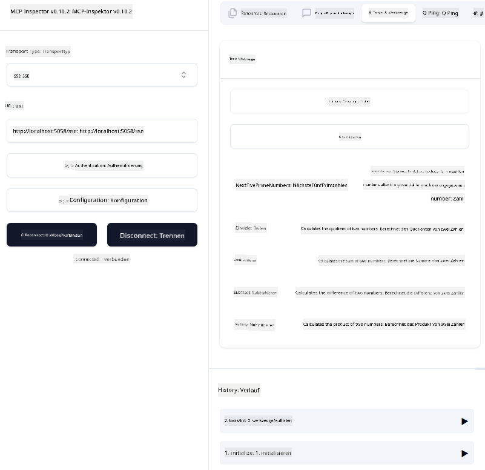
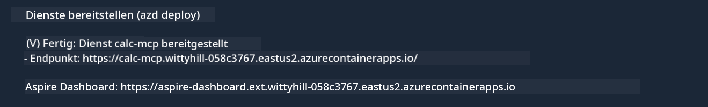

<!--
CO_OP_TRANSLATOR_METADATA:
{
  "original_hash": "5020a3e1a1c7f30c00f9e37f1fa208e3",
  "translation_date": "2025-05-16T15:40:45+00:00",
  "source_file": "04-PracticalImplementation/samples/csharp/README.md",
  "language_code": "de"
}
-->
# Beispiel

Das vorherige Beispiel zeigt, wie man ein lokales .NET-Projekt mit dem `sdio`-Typ verwendet und wie man den Server lokal in einem Container startet. Das ist in vielen Situationen eine gute Lösung. Es kann jedoch auch sinnvoll sein, den Server remote laufen zu lassen, zum Beispiel in einer Cloud-Umgebung. Hier kommt der `http`-Typ ins Spiel.

Wenn man sich die Lösung im Ordner `04-PracticalImplementation` ansieht, wirkt sie vielleicht viel komplexer als die vorherige. Tatsächlich ist dem aber nicht so. Schaut man sich das Projekt `src/mcpserver/mcpserver.csproj` genau an, sieht man, dass es größtenteils derselbe Code wie im vorherigen Beispiel ist. Der einzige Unterschied ist, dass wir eine andere Bibliothek `ModelContextProtocol.AspNetCore` verwenden, um die HTTP-Anfragen zu bearbeiten. Außerdem ändern wir die Methode `IsPrime`, indem wir sie privat machen, nur um zu zeigen, dass man private Methoden im Code haben kann. Der Rest des Codes ist unverändert.

Die anderen Projekte stammen von [.NET Aspire](https://learn.microsoft.com/dotnet/aspire/get-started/aspire-overview). Die Integration von .NET Aspire in die Lösung verbessert die Entwicklererfahrung beim Entwickeln und Testen und unterstützt die Beobachtbarkeit. Es ist nicht erforderlich, um den Server zu starten, aber es ist eine gute Praxis, es in der Lösung zu haben.

## Server lokal starten

1. Öffne in VS Code (mit der C# DevKit-Erweiterung) die Lösung `04-PracticalImplementation\samples\csharp\src\Calculator-chap4.sln`.
2. Drücke `F5`, um den Server zu starten. Es sollte ein Webbrowser mit dem .NET Aspire Dashboard geöffnet werden.

oder

1. Navigiere im Terminal zum Ordner `04-PracticalImplementation\samples\csharp\src`.
2. Führe den folgenden Befehl aus, um den Server zu starten:
   ```bash
    dotnet run --project .\AppHost
   ```

3. Notiere dir im Dashboard die `http`-URL. Sie sollte etwa so aussehen: `http://localhost:5058/`.

## Test `SSE` mit dem ModelContext Protocol Inspector.

Wenn du Node.js 22.7.5 oder höher hast, kannst du den ModelContext Protocol Inspector verwenden, um deinen Server zu testen.

Starte den Server und führe im Terminal den folgenden Befehl aus:

```bash
npx @modelcontextprotocol/inspector@latest
```



- Wähle `SSE` as the Transport type. SSE stand for Server-Sent Events. 
- In the Url field, enter the URL of the server noted earlier,and append `/sse` aus. Es sollte `http` sein (nicht `https`) something like `http://localhost:5058/sse`.
- select the Connect button.

A nice thing about the Inspector is that it provide a nice visibility on what is happening.

- Try listing the availables tools
- Try some of them, it should works just like before.


## Test `SSE` with Github Copilot Chat in VS Code

To use the `SSE` transport with Github Copilot Chat, change the configuration of the `mcp-calc`), der zuvor erstellte Server sollte so aussehen:

```json
"mcp-calc": {
    "type": "sse",
    "url": "http://localhost:5058/sse"
}
```

Führe einige Tests durch:
- Frage nach den 3 Primzahlen nach 6780. Beachte, wie Copilot die neuen Tools `NextFivePrimeNumbers` verwendet und nur die ersten 3 Primzahlen zurückgibt.
- Frage nach den 7 Primzahlen nach 111, um zu sehen, was passiert.

# Server auf Azure bereitstellen

Lass uns den Server auf Azure bereitstellen, damit mehr Leute ihn nutzen können.

Navigiere im Terminal zum Ordner `04-PracticalImplementation\samples\csharp\src` und führe den folgenden Befehl aus:

```bash
azd init
```

Dadurch werden lokal einige Dateien erstellt, um die Konfiguration der Azure-Ressourcen und deine Infrastruktur als Code (IaC) zu speichern.

Führe anschließend den folgenden Befehl aus, um den Server auf Azure bereitzustellen:

```bash
azd up
```

Nach Abschluss der Bereitstellung solltest du eine Nachricht wie diese sehen:



Öffne das Aspire Dashboard und notiere die `HTTP`-URL, um sie im MCP Inspector und im Github Copilot Chat zu verwenden.

## Wie geht es weiter?

Wir probieren verschiedene Transporttypen und Testwerkzeuge aus und stellen unseren MCP-Server auch auf Azure bereit. Aber was, wenn unser Server Zugriff auf private Ressourcen benötigt? Zum Beispiel auf eine Datenbank oder eine private API? Im nächsten Kapitel zeigen wir, wie wir die Sicherheit unseres Servers verbessern können.

**Haftungsausschluss**:  
Dieses Dokument wurde mithilfe des KI-Übersetzungsdienstes [Co-op Translator](https://github.com/Azure/co-op-translator) übersetzt. Obwohl wir auf Genauigkeit achten, beachten Sie bitte, dass automatisierte Übersetzungen Fehler oder Ungenauigkeiten enthalten können. Das Originaldokument in seiner Originalsprache gilt als maßgebliche Quelle. Für wichtige Informationen wird eine professionelle menschliche Übersetzung empfohlen. Wir übernehmen keine Haftung für Missverständnisse oder Fehlinterpretationen, die durch die Nutzung dieser Übersetzung entstehen.