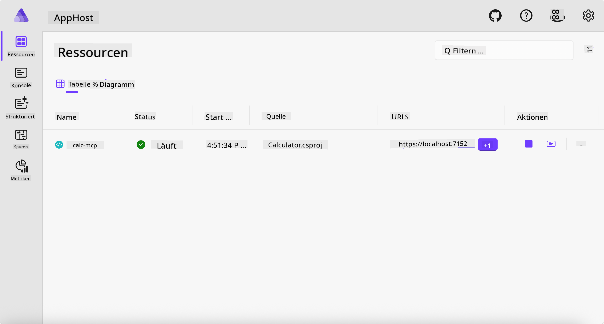
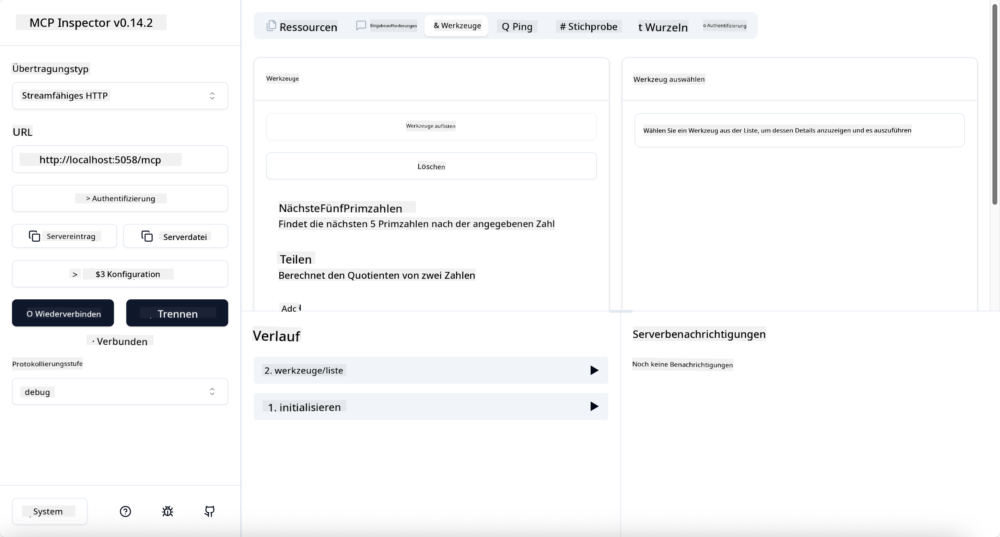

<!--
CO_OP_TRANSLATOR_METADATA:
{
  "original_hash": "0bc7bd48f55f1565f1d95ccb2c16f728",
  "translation_date": "2025-06-18T07:46:20+00:00",
  "source_file": "04-PracticalImplementation/samples/csharp/README.md",
  "language_code": "de"
}
-->
# Beispiel

Das vorherige Beispiel zeigt, wie man ein lokales .NET-Projekt mit dem `stdio`-Typ verwendet und wie man den Server lokal in einem Container startet. Das ist in vielen Situationen eine gute Lösung. Es kann jedoch nützlich sein, den Server remote laufen zu lassen, zum Beispiel in einer Cloud-Umgebung. Hier kommt der `http`-Typ ins Spiel.

Wenn man sich die Lösung im `04-PracticalImplementation`-Ordner anschaut, wirkt sie vielleicht viel komplexer als die vorherige. Tatsächlich ist sie das aber nicht. Wer genau hinsieht, erkennt im Projekt `src/Calculator`, dass es größtenteils derselbe Code wie im vorherigen Beispiel ist. Der einzige Unterschied ist, dass wir eine andere Bibliothek `ModelContextProtocol.AspNetCore` für die HTTP-Anfragen verwenden. Außerdem ändern wir die Methode `IsPrime` auf privat, nur um zu zeigen, dass man private Methoden im Code haben kann. Der Rest des Codes ist wie gehabt.

Die anderen Projekte stammen von [.NET Aspire](https://learn.microsoft.com/dotnet/aspire/get-started/aspire-overview). Die Einbindung von .NET Aspire in die Lösung verbessert die Entwicklererfahrung beim Entwickeln und Testen und unterstützt bei der Beobachtbarkeit. Es ist nicht erforderlich, um den Server zu betreiben, aber es ist eine gute Praxis, es in der Lösung zu haben.

## Server lokal starten

1. Navigiere in VS Code (mit der C# DevKit-Erweiterung) in das Verzeichnis `04-PracticalImplementation/samples/csharp`.
1. Führe folgenden Befehl aus, um den Server zu starten:

   ```bash
    dotnet watch run --project ./src/AppHost
   ```

1. Wenn sich im Webbrowser das .NET Aspire Dashboard öffnet, merke dir die `http`-URL. Sie sollte ungefähr so aussehen: `http://localhost:5058/`.

   

## Streamable HTTP mit dem MCP Inspector testen

Wenn du Node.js 22.7.5 oder höher installiert hast, kannst du den MCP Inspector verwenden, um deinen Server zu testen.

Starte den Server und führe im Terminal folgenden Befehl aus:

```bash
npx @modelcontextprotocol/inspector http://localhost:5058
```



- Wähle `Streamable HTTP` as the Transport type.
- In the Url field, enter the URL of the server noted earlier, and append `/mcp` aus. Es sollte `http` sein (nicht `https`) something like `http://localhost:5058/mcp`.
- select the Connect button.

A nice thing about the Inspector is that it provide a nice visibility on what is happening.

- Try listing the available tools
- Try some of them, it should works just like before.

## Test MCP Server with GitHub Copilot Chat in VS Code

To use the Streamable HTTP transport with GitHub Copilot Chat, change the configuration of the `calc-mcp`). Der zuvor erstellte Server sollte so aussehen:

```jsonc
// .vscode/mcp.json
{
  "servers": {
    "calc-mcp": {
      "type": "http",
      "url": "http://localhost:5058/mcp"
    }
  }
}
```

Führe einige Tests durch:

- Frage nach "3 Primzahlen nach 6780". Beachte, wie Copilot die neuen Tools `NextFivePrimeNumbers` verwendet und nur die ersten 3 Primzahlen zurückgibt.
- Frage nach "7 Primzahlen nach 111", um zu sehen, was passiert.
- Frage nach "John hat 24 Lutscher und möchte sie gleichmäßig auf seine 3 Kinder verteilen. Wie viele Lutscher bekommt jedes Kind?", um zu sehen, was passiert.

## Server zu Azure bereitstellen

Lass uns den Server zu Azure bereitstellen, damit mehr Leute ihn nutzen können.

Wechsle im Terminal in den Ordner `04-PracticalImplementation/samples/csharp` und führe folgenden Befehl aus:

```bash
azd up
```

Nach Abschluss der Bereitstellung solltest du eine Meldung wie diese sehen:


Nimm die URL und verwende sie im MCP Inspector und im GitHub Copilot Chat.

```jsonc
// .vscode/mcp.json
{
  "servers": {
    "calc-mcp": {
      "type": "http",
      "url": "https://calc-mcp.gentleriver-3977fbcf.australiaeast.azurecontainerapps.io/mcp"
    }
  }
}
```

## Wie geht es weiter?

Wir probieren verschiedene Transporttypen und Testwerkzeuge aus. Außerdem stellen wir deinen MCP-Server in Azure bereit. Aber was, wenn unser Server Zugriff auf private Ressourcen benötigt? Zum Beispiel eine Datenbank oder eine private API? Im nächsten Kapitel sehen wir, wie wir die Sicherheit unseres Servers verbessern können.

**Haftungsausschluss**:  
Dieses Dokument wurde mit dem KI-Übersetzungsdienst [Co-op Translator](https://github.com/Azure/co-op-translator) übersetzt. Obwohl wir auf Genauigkeit achten, kann es bei automatischen Übersetzungen zu Fehlern oder Ungenauigkeiten kommen. Das Originaldokument in seiner Ausgangssprache ist als maßgebliche Quelle zu betrachten. Für wichtige Informationen wird eine professionelle menschliche Übersetzung empfohlen. Wir übernehmen keine Haftung für Missverständnisse oder Fehlinterpretationen, die durch die Nutzung dieser Übersetzung entstehen.