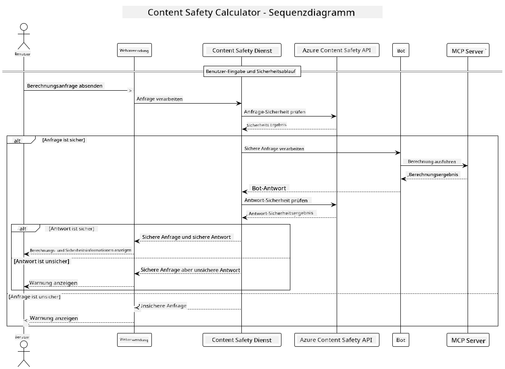

<!--
CO_OP_TRANSLATOR_METADATA:
{
  "original_hash": "e5ea5e7582f70008ea9bec3b3820f20a",
  "translation_date": "2025-05-16T15:38:18+00:00",
  "source_file": "04-PracticalImplementation/samples/java/containerapp/README.md",
  "language_code": "de"
}
-->
## Systemarchitektur

Dieses Projekt demonstriert eine Webanwendung, die eine Inhaltsprüfung auf Sicherheit durchführt, bevor Benutzereingaben über das Model Context Protocol (MCP) an einen Rechnerdienst weitergeleitet werden.



### Funktionsweise

1. **Benutzereingabe**: Der Benutzer gibt eine Berechnungsanfrage in der Weboberfläche ein  
2. **Inhaltsprüfung (Eingabe)**: Die Eingabe wird von der Azure Content Safety API analysiert  
3. **Sicherheitsentscheidung (Eingabe)**:  
   - Wenn der Inhalt sicher ist (Schweregrad < 2 in allen Kategorien), wird er an den Rechner weitergeleitet  
   - Wenn der Inhalt als potenziell schädlich eingestuft wird, wird der Vorgang abgebrochen und eine Warnung ausgegeben  
4. **Integration des Rechners**: Sicherer Inhalt wird von LangChain4j verarbeitet, das mit dem MCP-Rechnerserver kommuniziert  
5. **Inhaltsprüfung (Ausgabe)**: Die Antwort des Bots wird von der Azure Content Safety API analysiert  
6. **Sicherheitsentscheidung (Ausgabe)**:  
   - Wenn die Bot-Antwort sicher ist, wird sie dem Benutzer angezeigt  
   - Wenn die Bot-Antwort als potenziell schädlich eingestuft wird, wird sie durch eine Warnung ersetzt  
7. **Antwort**: Die Ergebnisse (sofern sicher) werden dem Benutzer zusammen mit beiden Sicherheitsanalysen angezeigt

## Verwendung des Model Context Protocol (MCP) mit Rechnerdiensten

Dieses Projekt zeigt, wie man das Model Context Protocol (MCP) verwendet, um Rechnerdienste von LangChain4j aufzurufen. Die Implementierung nutzt einen lokalen MCP-Server auf Port 8080, der Rechneroperationen bereitstellt.

### Einrichtung des Azure Content Safety Service

Bevor Sie die Inhaltsprüffunktionen nutzen, müssen Sie eine Azure Content Safety Service-Ressource erstellen:

1. Melden Sie sich im [Azure Portal](https://portal.azure.com) an  
2. Klicken Sie auf „Create a resource“ und suchen Sie nach „Content Safety“  
3. Wählen Sie „Content Safety“ aus und klicken Sie auf „Create“  
4. Geben Sie einen eindeutigen Namen für Ihre Ressource ein  
5. Wählen Sie Ihr Abonnement und die Ressourcengruppe aus (oder erstellen Sie eine neue)  
6. Wählen Sie eine unterstützte Region aus (Details unter [Region availability](https://azure.microsoft.com/en-us/global-infrastructure/services/?products=cognitive-services))  
7. Wählen Sie einen passenden Preistarif aus  
8. Klicken Sie auf „Create“, um die Ressource bereitzustellen  
9. Nach Abschluss der Bereitstellung klicken Sie auf „Go to resource“  
10. Wählen Sie im linken Menü unter „Resource Management“ den Punkt „Keys and Endpoint“ aus  
11. Kopieren Sie einen der Schlüssel sowie die Endpunkt-URL für die Verwendung im nächsten Schritt

### Konfiguration der Umgebungsvariablen

Setzen Sie die `GITHUB_TOKEN` Umgebungsvariable zur Authentifizierung der GitHub-Modelle:  
```sh
export GITHUB_TOKEN=<your_github_token>
```

Für die Inhaltsprüfung setzen Sie:  
```sh
export CONTENT_SAFETY_ENDPOINT=<your_content_safety_endpoint>
export CONTENT_SAFETY_KEY=<your_content_safety_key>
```

Diese Umgebungsvariablen werden von der Anwendung verwendet, um sich bei Azure Content Safety zu authentifizieren. Wenn diese Variablen nicht gesetzt sind, verwendet die Anwendung Platzhalterwerte zu Demonstrationszwecken, aber die Inhaltsprüffunktionen funktionieren dann nicht korrekt.

### Starten des Calculator MCP Servers

Bevor Sie den Client ausführen, müssen Sie den Calculator MCP Server im SSE-Modus auf localhost:8080 starten.

## Projektbeschreibung

Dieses Projekt zeigt die Integration des Model Context Protocol (MCP) mit LangChain4j zur Anbindung von Rechnerdiensten. Wichtige Merkmale sind:

- Verwendung von MCP zur Verbindung mit einem Rechnerdienst für grundlegende mathematische Operationen  
- Zweistufige Inhaltsprüfung sowohl bei Benutzereingaben als auch bei Bot-Antworten  
- Integration des GitHub gpt-4.1-nano Modells über LangChain4j  
- Nutzung von Server-Sent Events (SSE) als MCP-Transport

## Integration der Inhaltsprüfung

Das Projekt umfasst umfassende Inhaltsprüffunktionen, um sicherzustellen, dass sowohl Benutzereingaben als auch Systemantworten frei von schädlichen Inhalten sind:

1. **Eingabeprüfung**: Alle Benutzereingaben werden vor der Verarbeitung auf schädliche Inhalte wie Hassrede, Gewalt, Selbstverletzung und sexuelle Inhalte analysiert.  

2. **Ausgabeprüfung**: Selbst bei Verwendung potenziell unzensierter Modelle werden alle generierten Antworten vor der Anzeige durch dieselben Inhaltsfilter geprüft.

Dieser zweistufige Ansatz gewährleistet, dass das System unabhängig vom verwendeten KI-Modell sicher bleibt und Benutzer sowohl vor schädlichen Eingaben als auch vor potenziell problematischen KI-generierten Ausgaben geschützt werden.

## Web-Client

Die Anwendung beinhaltet eine benutzerfreundliche Weboberfläche, die es den Nutzern ermöglicht, mit dem Content Safety Calculator System zu interagieren:

### Funktionen der Weboberfläche

- Einfaches, intuitives Formular zur Eingabe von Berechnungsanfragen  
- Zweistufige Inhaltsprüfung (Eingabe und Ausgabe)  
- Echtzeit-Feedback zur Sicherheit von Eingabe und Antwort  
- Farblich gekennzeichnete Sicherheitsindikatoren zur einfachen Interpretation  
- Sauberes, responsives Design, das auf verschiedenen Geräten funktioniert  
- Beispielhafte sichere Eingaben zur Orientierung der Benutzer

### Verwendung des Web-Clients

1. Starten Sie die Anwendung:  
   ```sh
   mvn spring-boot:run
   ```

2. Öffnen Sie Ihren Browser und navigieren Sie zu `http://localhost:8087`

3. Geben Sie eine Berechnungsanfrage im bereitgestellten Textfeld ein (z. B. „Berechne die Summe von 24,5 und 17,3“)

4. Klicken Sie auf „Submit“, um Ihre Anfrage zu verarbeiten

5. Sehen Sie die Ergebnisse ein, die Folgendes umfassen:  
   - Inhaltsprüfung Ihrer Eingabe  
   - Das berechnete Ergebnis (sofern die Eingabe sicher war)  
   - Inhaltsprüfung der Bot-Antwort  
   - Sicherheitswarnungen, falls die Eingabe oder Ausgabe als problematisch eingestuft wurde

Der Web-Client übernimmt automatisch beide Inhaltsprüfprozesse und stellt sicher, dass alle Interaktionen sicher und angemessen sind, unabhängig davon, welches KI-Modell verwendet wird.

**Haftungsausschluss**:  
Dieses Dokument wurde mit dem KI-Übersetzungsdienst [Co-op Translator](https://github.com/Azure/co-op-translator) übersetzt. Obwohl wir auf Genauigkeit achten, beachten Sie bitte, dass automatisierte Übersetzungen Fehler oder Ungenauigkeiten enthalten können. Das Originaldokument in seiner Ursprungssprache gilt als maßgebliche Quelle. Für wichtige Informationen wird eine professionelle menschliche Übersetzung empfohlen. Wir übernehmen keine Haftung für Missverständnisse oder Fehlinterpretationen, die durch die Verwendung dieser Übersetzung entstehen.