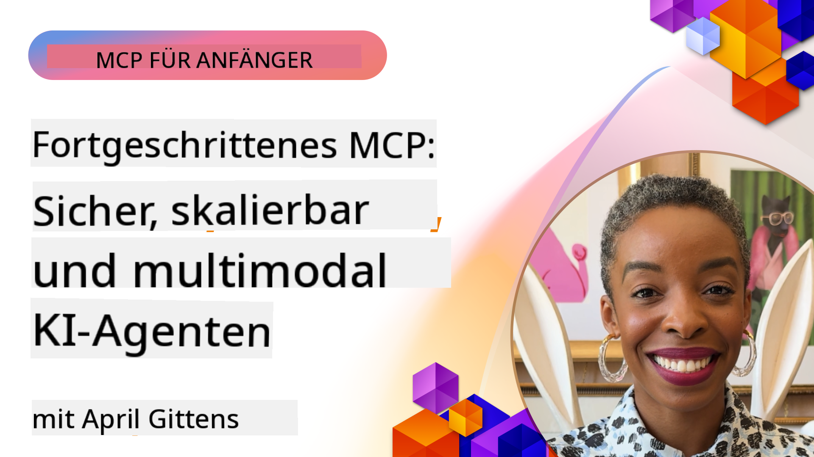

<!--
CO_OP_TRANSLATOR_METADATA:
{
  "original_hash": "d204bc94ea6027d06a703b21b711ca57",
  "translation_date": "2025-07-29T00:58:05+00:00",
  "source_file": "05-AdvancedTopics/README.md",
  "language_code": "de"
}
-->
# Fortgeschrittene Themen in MCP

_(Klicken Sie auf das Bild oben, um das Video zu dieser Lektion anzusehen)_

Dieses Kapitel behandelt eine Reihe fortgeschrittener Themen zur Implementierung des Model Context Protocol (MCP), darunter multimodale Integration, Skalierbarkeit, bewährte Sicherheitspraktiken und Unternehmensintegration. Diese Themen sind entscheidend für den Aufbau robuster und produktionsreifer MCP-Anwendungen, die den Anforderungen moderner KI-Systeme gerecht werden.

## Überblick

Diese Lektion untersucht fortgeschrittene Konzepte der MCP-Implementierung mit Schwerpunkt auf multimodaler Integration, Skalierbarkeit, Sicherheitspraktiken und Unternehmensintegration. Diese Themen sind unerlässlich, um produktionsreife MCP-Anwendungen zu entwickeln, die komplexe Anforderungen in Unternehmensumgebungen bewältigen können.

## Lernziele

Am Ende dieser Lektion werden Sie in der Lage sein:

- Multimodale Funktionen innerhalb von MCP-Frameworks zu implementieren
- Skalierbare MCP-Architekturen für Szenarien mit hoher Nachfrage zu entwerfen
- Sicherheitspraktiken anzuwenden, die mit den Sicherheitsprinzipien von MCP übereinstimmen
- MCP in Unternehmens-KI-Systeme und -Frameworks zu integrieren
- Leistung und Zuverlässigkeit in Produktionsumgebungen zu optimieren

## Lektionen und Beispielprojekte

| Link | Titel | Beschreibung |
|------|-------|-------------|
| [5.1 Integration mit Azure](./mcp-integration/README.md) | Integration mit Azure | Erfahren Sie, wie Sie Ihren MCP-Server in Azure integrieren |
| [5.2 Multimodales Beispiel](./mcp-multi-modality/README.md) | MCP-Multimodale Beispiele | Beispiele für Audio-, Bild- und multimodale Antworten |
| [5.3 MCP OAuth2 Beispiel](../../../05-AdvancedTopics/mcp-oauth2-demo) | MCP OAuth2 Demo | Minimalistische Spring-Boot-Anwendung, die OAuth2 mit MCP zeigt, sowohl als Autorisierungs- als auch als Ressourcenserver. Demonstriert die sichere Token-Ausgabe, geschützte Endpunkte, die Bereitstellung in Azure Container Apps und die Integration in API-Management. |
| [5.4 Root-Kontexte](./mcp-root-contexts/README.md) | Root-Kontexte | Erfahren Sie mehr über Root-Kontexte und deren Implementierung |
| [5.5 Routing](./mcp-routing/README.md) | Routing | Lernen Sie verschiedene Arten des Routings kennen |
| [5.6 Sampling](./mcp-sampling/README.md) | Sampling | Erfahren Sie, wie Sie mit Sampling arbeiten |
| [5.7 Skalierung](./mcp-scaling/README.md) | Skalierung | Erfahren Sie mehr über Skalierung |
| [5.8 Sicherheit](./mcp-security/README.md) | Sicherheit | Sichern Sie Ihren MCP-Server |
| [5.9 Websuche-Beispiel](./web-search-mcp/README.md) | Websuche MCP | Python-MCP-Server und -Client, die mit SerpAPI für Echtzeit-Web-, Nachrichten-, Produktsuche und Q&A integriert sind. Demonstriert Multi-Tool-Orchestrierung, externe API-Integration und robuste Fehlerbehandlung. |
| [5.10 Echtzeit-Streaming](./mcp-realtimestreaming/README.md) | Streaming | Echtzeit-Datenstreaming ist in der heutigen datengetriebenen Welt unverzichtbar, in der Unternehmen und Anwendungen sofortigen Zugriff auf Informationen benötigen, um rechtzeitig Entscheidungen zu treffen. |
| [5.11 Echtzeit-Websuche](./mcp-realtimesearch/README.md) | Websuche | Echtzeit-Websuche, wie MCP die Echtzeit-Websuche transformiert, indem es einen standardisierten Ansatz für das Kontextmanagement über KI-Modelle, Suchmaschinen und Anwendungen hinweg bietet. |
| [5.12 Entra ID-Authentifizierung für MCP-Server](./mcp-security-entra/README.md) | Entra ID-Authentifizierung | Microsoft Entra ID bietet eine robuste cloudbasierte Identitäts- und Zugriffsverwaltungslösung, die sicherstellt, dass nur autorisierte Benutzer und Anwendungen mit Ihrem MCP-Server interagieren können. |
| [5.13 Azure AI Foundry-Agentenintegration](./mcp-foundry-agent-integration/README.md) | Azure AI Foundry-Integration | Erfahren Sie, wie Sie MCP-Server mit Azure AI Foundry-Agenten integrieren, um leistungsstarke Tool-Orchestrierung und Unternehmens-KI-Funktionen mit standardisierten externen Datenquellenverbindungen zu ermöglichen. |
| [5.14 Kontext-Engineering](./mcp-contextengineering/README.md) | Kontext-Engineering | Die zukünftigen Möglichkeiten von Kontext-Engineering-Techniken für MCP-Server, einschließlich Kontextoptimierung, dynamisches Kontextmanagement und Strategien für effektives Prompt-Engineering innerhalb von MCP-Frameworks. |

## Zusätzliche Referenzen

Für die aktuellsten Informationen zu fortgeschrittenen MCP-Themen siehe:
- [MCP-Dokumentation](https://modelcontextprotocol.io/)
- [MCP-Spezifikation](https://spec.modelcontextprotocol.io/)
- [GitHub-Repository](https://github.com/modelcontextprotocol)

## Wichtige Erkenntnisse

- Multimodale MCP-Implementierungen erweitern die KI-Fähigkeiten über die Textverarbeitung hinaus
- Skalierbarkeit ist für Unternehmenseinsätze unerlässlich und kann durch horizontale und vertikale Skalierung erreicht werden
- Umfassende Sicherheitsmaßnahmen schützen Daten und gewährleisten eine ordnungsgemäße Zugriffskontrolle
- Die Integration in Unternehmensplattformen wie Azure OpenAI und Microsoft AI Foundry verbessert die MCP-Funktionalität
- Fortgeschrittene MCP-Implementierungen profitieren von optimierten Architekturen und sorgfältigem Ressourcenmanagement

## Übung

Entwerfen Sie eine MCP-Implementierung in Unternehmensqualität für einen spezifischen Anwendungsfall:

1. Identifizieren Sie die multimodalen Anforderungen für Ihren Anwendungsfall
2. Skizzieren Sie die Sicherheitskontrollen, die zum Schutz sensibler Daten erforderlich sind
3. Entwerfen Sie eine skalierbare Architektur, die unterschiedliche Lasten bewältigen kann
4. Planen Sie Integrationspunkte mit Unternehmens-KI-Systemen
5. Dokumentieren Sie potenzielle Leistungsengpässe und Strategien zu deren Minderung

## Zusätzliche Ressourcen

- [Azure OpenAI-Dokumentation](https://learn.microsoft.com/en-us/azure/ai-services/openai/)
- [Microsoft AI Foundry-Dokumentation](https://learn.microsoft.com/en-us/ai-services/)

---

## Was kommt als Nächstes

- [5.1 MCP-Integration](./mcp-integration/README.md)

**Haftungsausschluss**:  
Dieses Dokument wurde mit dem KI-Übersetzungsdienst [Co-op Translator](https://github.com/Azure/co-op-translator) übersetzt. Obwohl wir uns um Genauigkeit bemühen, beachten Sie bitte, dass automatisierte Übersetzungen Fehler oder Ungenauigkeiten enthalten können. Das Originaldokument in seiner ursprünglichen Sprache sollte als maßgebliche Quelle betrachtet werden. Für kritische Informationen wird eine professionelle menschliche Übersetzung empfohlen. Wir übernehmen keine Haftung für Missverständnisse oder Fehlinterpretationen, die sich aus der Nutzung dieser Übersetzung ergeben.