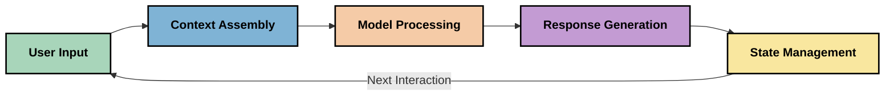
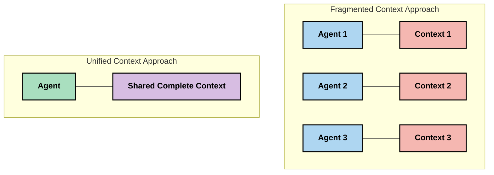
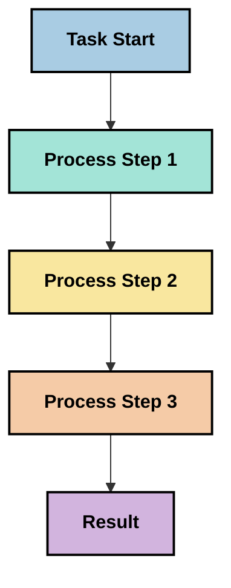
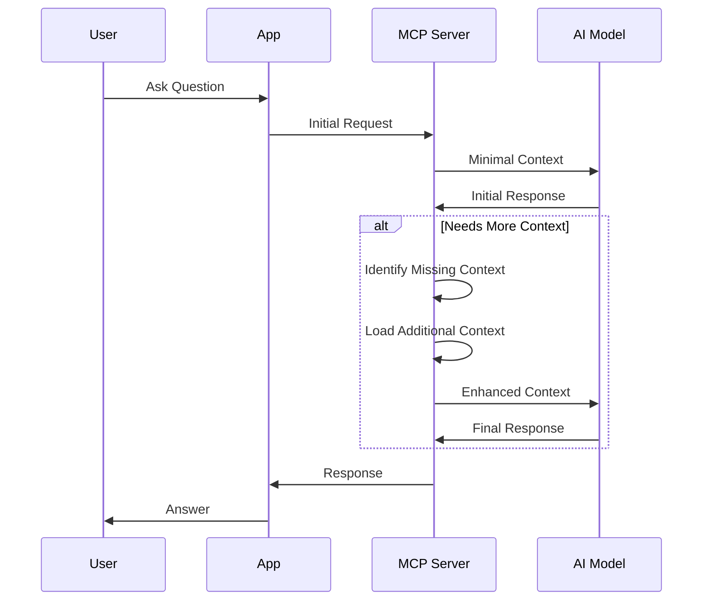
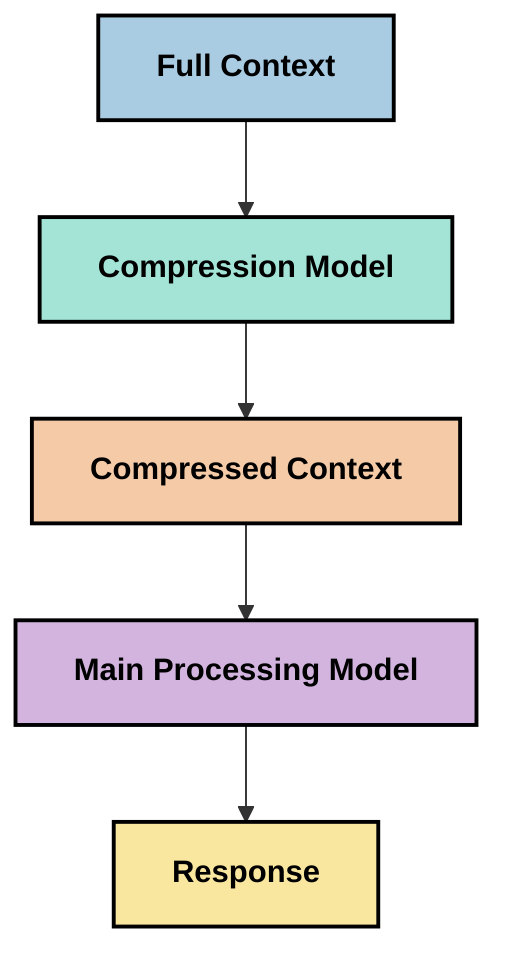
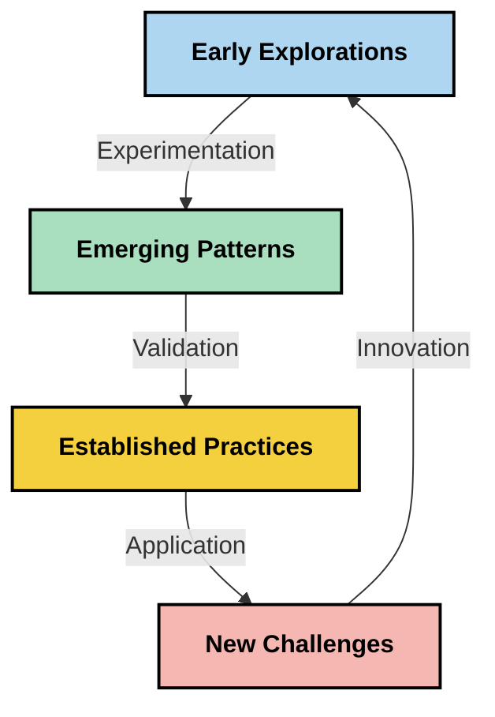

<!--
CO_OP_TRANSLATOR_METADATA:
{
  "original_hash": "fd169ca3071b81b5ee282e194bc823df",
  "translation_date": "2025-09-15T19:40:14+00:00",
  "source_file": "05-AdvancedTopics/mcp-contextengineering/README.md",
  "language_code": "de"
}
-->
# Kontext-Engineering: Ein aufstrebendes Konzept im MCP-Ökosystem

## Überblick

Kontext-Engineering ist ein aufstrebendes Konzept im Bereich der KI, das untersucht, wie Informationen strukturiert, bereitgestellt und während der Interaktionen zwischen Kunden und KI-Diensten aufrechterhalten werden. Mit der Weiterentwicklung des Model Context Protocol (MCP)-Ökosystems wird das Verständnis für effektives Kontextmanagement immer wichtiger. Dieses Modul führt in das Konzept des Kontext-Engineering ein und beleuchtet dessen potenzielle Anwendungen in MCP-Implementierungen.

## Lernziele

Am Ende dieses Moduls werden Sie in der Lage sein:

- Das aufstrebende Konzept des Kontext-Engineering und dessen potenzielle Rolle in MCP-Anwendungen zu verstehen
- Wichtige Herausforderungen im Kontextmanagement zu identifizieren, die durch das MCP-Protokolldesign adressiert werden
- Techniken zur Verbesserung der Modellleistung durch besseres Kontextmanagement zu erkunden
- Ansätze zur Messung und Bewertung der Kontext-Effektivität zu berücksichtigen
- Diese neuen Konzepte anzuwenden, um KI-Erfahrungen durch das MCP-Framework zu verbessern

## Einführung in das Kontext-Engineering

Kontext-Engineering ist ein aufstrebendes Konzept, das sich auf die gezielte Gestaltung und Verwaltung des Informationsflusses zwischen Nutzern, Anwendungen und KI-Modellen konzentriert. Im Gegensatz zu etablierten Bereichen wie dem Prompt-Engineering wird das Kontext-Engineering noch von Praktikern definiert, die daran arbeiten, die einzigartigen Herausforderungen zu lösen, KI-Modellen zur richtigen Zeit die richtigen Informationen bereitzustellen.

Mit der Weiterentwicklung großer Sprachmodelle (LLMs) ist die Bedeutung des Kontexts immer deutlicher geworden. Die Qualität, Relevanz und Struktur des bereitgestellten Kontexts wirken sich direkt auf die Modell-Ausgaben aus. Kontext-Engineering untersucht diese Beziehung und strebt die Entwicklung von Prinzipien für effektives Kontextmanagement an.

> "Im Jahr 2025 sind die Modelle extrem intelligent. Aber selbst der klügste Mensch wird seine Arbeit nicht effektiv erledigen können, ohne den Kontext dessen, was von ihm verlangt wird... 'Kontext-Engineering' ist die nächste Stufe des Prompt-Engineering. Es geht darum, dies automatisch in einem dynamischen System zu tun." — Walden Yan, Cognition AI

Kontext-Engineering könnte Folgendes umfassen:

1. **Kontextauswahl**: Bestimmen, welche Informationen für eine bestimmte Aufgabe relevant sind
2. **Kontextstrukturierung**: Organisieren von Informationen, um das Modellverständnis zu maximieren
3. **Kontextbereitstellung**: Optimieren, wie und wann Informationen an Modelle gesendet werden
4. **Kontextpflege**: Verwalten des Zustands und der Entwicklung des Kontexts im Laufe der Zeit
5. **Kontextevaluation**: Messen und Verbessern der Effektivität des Kontexts

Diese Schwerpunkte sind besonders relevant für das MCP-Ökosystem, das eine standardisierte Methode bietet, um Anwendungen Kontext für LLMs bereitzustellen.

## Die Perspektive der Kontextreise

Eine Möglichkeit, Kontext-Engineering zu visualisieren, besteht darin, die Reise der Informationen durch ein MCP-System nachzuverfolgen:



### Wichtige Phasen der Kontextreise:

1. **Benutzereingabe**: Rohinformationen vom Benutzer (Text, Bilder, Dokumente)
2. **Kontextzusammenstellung**: Kombinieren von Benutzereingaben mit Systemkontext, Gesprächsverlauf und anderen abgerufenen Informationen
3. **Modellverarbeitung**: Das KI-Modell verarbeitet den zusammengestellten Kontext
4. **Antwortgenerierung**: Das Modell erzeugt Ausgaben basierend auf dem bereitgestellten Kontext
5. **Zustandsmanagement**: Das System aktualisiert seinen internen Zustand basierend auf der Interaktion

Diese Perspektive verdeutlicht die dynamische Natur des Kontexts in KI-Systemen und wirft wichtige Fragen auf, wie Informationen in jeder Phase am besten verwaltet werden können.

## Aufkommende Prinzipien im Kontext-Engineering

Während sich das Feld des Kontext-Engineering entwickelt, zeichnen sich einige frühe Prinzipien ab, die von Praktikern formuliert werden. Diese Prinzipien können MCP-Implementierungsentscheidungen beeinflussen:

### Prinzip 1: Kontext vollständig teilen

Kontext sollte vollständig zwischen allen Komponenten eines Systems geteilt werden, anstatt fragmentiert über mehrere Agenten oder Prozesse verteilt zu sein. Wenn Kontext verteilt ist, können Entscheidungen, die in einem Teil des Systems getroffen werden, mit denen in anderen Teilen in Konflikt geraten.



In MCP-Anwendungen deutet dies darauf hin, Systeme so zu gestalten, dass der Kontext nahtlos durch die gesamte Pipeline fließt, anstatt fragmentiert zu sein.

### Prinzip 2: Handlungen beinhalten implizite Entscheidungen

Jede Handlung, die ein Modell ausführt, beinhaltet implizite Entscheidungen darüber, wie der Kontext interpretiert wird. Wenn mehrere Komponenten auf unterschiedlichen Kontexten agieren, können diese impliziten Entscheidungen in Konflikt geraten, was zu inkonsistenten Ergebnissen führt.

Dieses Prinzip hat wichtige Implikationen für MCP-Anwendungen:
- Bevorzugen Sie lineare Verarbeitung komplexer Aufgaben gegenüber paralleler Ausführung mit fragmentiertem Kontext
- Stellen Sie sicher, dass alle Entscheidungspunkte Zugriff auf dieselben Kontextinformationen haben
- Entwerfen Sie Systeme, bei denen spätere Schritte den vollständigen Kontext früherer Entscheidungen sehen können

### Prinzip 3: Kontexttiefe mit Fensterbegrenzungen ausbalancieren

Mit zunehmender Länge von Gesprächen und Prozessen laufen Kontextfenster schließlich über. Effektives Kontext-Engineering untersucht Ansätze, um diese Spannung zwischen umfassendem Kontext und technischen Einschränkungen zu bewältigen.

Mögliche Ansätze, die erforscht werden, umfassen:
- Kontextkompression, die wesentliche Informationen beibehält und gleichzeitig die Token-Nutzung reduziert
- Progressives Laden von Kontext basierend auf der Relevanz für aktuelle Bedürfnisse
- Zusammenfassung früherer Interaktionen unter Beibehaltung wichtiger Entscheidungen und Fakten

## Herausforderungen im Kontext und MCP-Protokolldesign

Das Model Context Protocol (MCP) wurde mit einem Bewusstsein für die einzigartigen Herausforderungen des Kontextmanagements entwickelt. Das Verständnis dieser Herausforderungen hilft, wichtige Aspekte des MCP-Protokolldesigns zu erklären:

### Herausforderung 1: Begrenzungen des Kontextfensters
Die meisten KI-Modelle haben feste Kontextfenstergrößen, die begrenzen, wie viele Informationen sie gleichzeitig verarbeiten können.

**MCP-Designantwort:** 
- Das Protokoll unterstützt strukturierten, ressourcenbasierten Kontext, der effizient referenziert werden kann
- Ressourcen können paginiert und progressiv geladen werden

### Herausforderung 2: Relevanzbestimmung
Es ist schwierig zu bestimmen, welche Informationen am relevantesten sind, um in den Kontext aufgenommen zu werden.

**MCP-Designantwort:**
- Flexible Werkzeuge ermöglichen die dynamische Abrufung von Informationen basierend auf Bedarf
- Strukturierte Prompts ermöglichen eine konsistente Kontextorganisation

### Herausforderung 3: Kontextpersistenz
Das Verwalten des Zustands über Interaktionen hinweg erfordert eine sorgfältige Nachverfolgung des Kontexts.

**MCP-Designantwort:**
- Standardisiertes Sitzungsmanagement
- Klar definierte Interaktionsmuster für die Kontextentwicklung

### Herausforderung 4: Multimodaler Kontext
Verschiedene Datentypen (Text, Bilder, strukturierte Daten) erfordern unterschiedliche Handhabung.

**MCP-Designantwort:**
- Das Protokolldesign berücksichtigt verschiedene Inhaltstypen
- Standardisierte Darstellung multimodaler Informationen

### Herausforderung 5: Sicherheit und Datenschutz
Kontext enthält oft sensible Informationen, die geschützt werden müssen.

**MCP-Designantwort:**
- Klare Abgrenzung der Verantwortlichkeiten zwischen Client und Server
- Lokale Verarbeitungsoptionen zur Minimierung der Datenexposition

Das Verständnis dieser Herausforderungen und wie MCP sie adressiert, bietet eine Grundlage für die Erforschung fortgeschrittener Techniken des Kontext-Engineering.

## Aufkommende Ansätze im Kontext-Engineering

Während sich das Feld des Kontext-Engineering entwickelt, zeichnen sich mehrere vielversprechende Ansätze ab. Diese repräsentieren aktuelle Überlegungen und keine etablierten Best Practices und werden sich wahrscheinlich weiterentwickeln, wenn wir mehr Erfahrung mit MCP-Implementierungen sammeln.

### 1. Lineare Verarbeitung in einem einzigen Thread

Im Gegensatz zu Multi-Agent-Architekturen, die den Kontext verteilen, stellen einige Praktiker fest, dass die lineare Verarbeitung in einem einzigen Thread konsistentere Ergebnisse liefert. Dies steht im Einklang mit dem Prinzip der Aufrechterhaltung eines einheitlichen Kontexts.



Obwohl dieser Ansatz weniger effizient erscheinen mag als parallele Verarbeitung, liefert er oft kohärentere und zuverlässigere Ergebnisse, da jeder Schritt auf einem vollständigen Verständnis früherer Entscheidungen aufbaut.

### 2. Kontext-Chunks und Priorisierung

Große Kontexte in handhabbare Stücke zerlegen und das Wichtigste priorisieren.

```python
# Conceptual Example: Context Chunking and Prioritization
def process_with_chunked_context(documents, query):
    # 1. Break documents into smaller chunks
    chunks = chunk_documents(documents)
    
    # 2. Calculate relevance scores for each chunk
    scored_chunks = [(chunk, calculate_relevance(chunk, query)) for chunk in chunks]
    
    # 3. Sort chunks by relevance score
    sorted_chunks = sorted(scored_chunks, key=lambda x: x[1], reverse=True)
    
    # 4. Use the most relevant chunks as context
    context = create_context_from_chunks([chunk for chunk, score in sorted_chunks[:5]])
    
    # 5. Process with the prioritized context
    return generate_response(context, query)
```

Das oben beschriebene Konzept zeigt, wie große Dokumente in handhabbare Stücke zerlegt und nur die relevantesten Teile für den Kontext ausgewählt werden können. Dieser Ansatz kann helfen, innerhalb der Begrenzungen des Kontextfensters zu arbeiten und dennoch große Wissensbasen zu nutzen.

### 3. Progressives Laden von Kontext

Kontext nach Bedarf progressiv laden, anstatt alles auf einmal.



Progressives Laden von Kontext beginnt mit minimalem Kontext und erweitert sich nur bei Bedarf. Dies kann die Token-Nutzung für einfache Abfragen erheblich reduzieren und gleichzeitig die Fähigkeit erhalten, komplexe Fragen zu bearbeiten.

### 4. Kontextkompression und -zusammenfassung

Kontextgröße reduzieren und gleichzeitig wesentliche Informationen bewahren.



Kontextkompression konzentriert sich auf:
- Entfernen redundanter Informationen
- Zusammenfassen langer Inhalte
- Extrahieren wichtiger Fakten und Details
- Bewahren kritischer Kontextelemente
- Optimieren der Token-Effizienz

Dieser Ansatz kann besonders wertvoll sein, um lange Gespräche innerhalb der Kontextfenster zu halten oder große Dokumente effizient zu verarbeiten. Einige Praktiker verwenden spezialisierte Modelle speziell für die Kontextkompression und Zusammenfassung von Gesprächsverläufen.

## Explorative Überlegungen zum Kontext-Engineering

Während wir das aufstrebende Feld des Kontext-Engineering erkunden, gibt es mehrere Überlegungen, die bei der Arbeit mit MCP-Implementierungen beachtet werden sollten. Diese sind keine vorschreibenden Best Practices, sondern vielmehr Bereiche der Erkundung, die in Ihrem spezifischen Anwendungsfall Verbesserungen bringen könnten.

### Berücksichtigen Sie Ihre Kontextziele

Bevor Sie komplexe Lösungen für das Kontextmanagement implementieren, formulieren Sie klar, was Sie erreichen möchten:
- Welche spezifischen Informationen benötigt das Modell, um erfolgreich zu sein?
- Welche Informationen sind wesentlich und welche ergänzend?
- Welche Leistungsbeschränkungen haben Sie (Latenz, Token-Limits, Kosten)?

### Erkunden Sie geschichtete Kontextansätze

Einige Praktiker erzielen Erfolge mit Kontext, der in konzeptionellen Schichten angeordnet ist:
- **Kernschicht**: Wesentliche Informationen, die das Modell immer benötigt
- **Situationsschicht**: Kontext, der spezifisch für die aktuelle Interaktion ist
- **Unterstützungsschicht**: Zusätzliche Informationen, die hilfreich sein könnten
- **Fallback-Schicht**: Informationen, die nur bei Bedarf abgerufen werden

### Untersuchen Sie Abrufstrategien

Die Effektivität Ihres Kontexts hängt oft davon ab, wie Sie Informationen abrufen:
- Semantische Suche und Einbettungen, um konzeptionell relevante Informationen zu finden
- Schlüsselwortbasierte Suche für spezifische Fakten
- Hybride Ansätze, die mehrere Abrufmethoden kombinieren
- Metadatenfilterung, um den Umfang basierend auf Kategorien, Daten oder Quellen einzugrenzen

### Experimentieren Sie mit Kontextkohärenz

Die Struktur und der Fluss Ihres Kontexts können das Modellverständnis beeinflussen:
- Gruppieren verwandter Informationen
- Konsistente Formatierung und Organisation verwenden
- Logische oder chronologische Reihenfolge beibehalten, wo angemessen
- Widersprüchliche Informationen vermeiden

### Abwägen der Vor- und Nachteile von Multi-Agent-Architekturen

Obwohl Multi-Agent-Architekturen in vielen KI-Frameworks beliebt sind, bringen sie erhebliche Herausforderungen für das Kontextmanagement mit sich:
- Kontextfragmentierung kann zu inkonsistenten Entscheidungen zwischen Agenten führen
- Parallele Verarbeitung kann Konflikte einführen, die schwer zu lösen sind
- Kommunikationsaufwand zwischen Agenten kann Leistungsgewinne ausgleichen
- Komplexes Zustandsmanagement ist erforderlich, um Kohärenz zu bewahren

In vielen Fällen kann ein Ansatz mit einem einzigen Agenten und umfassendem Kontextmanagement zuverlässigere Ergebnisse liefern als mehrere spezialisierte Agenten mit fragmentiertem Kontext.

### Entwicklung von Bewertungsmethoden

Um das Kontext-Engineering im Laufe der Zeit zu verbessern, sollten Sie überlegen, wie Sie den Erfolg messen:
- A/B-Tests verschiedener Kontextstrukturen
- Überwachung der Token-Nutzung und Antwortzeiten
- Verfolgung der Benutzerzufriedenheit und Erfolgsraten bei Aufgaben
- Analyse, wann und warum Kontextstrategien scheitern

Diese Überlegungen repräsentieren aktive Bereiche der Erkundung im Kontext-Engineering. Während das Feld reift, werden wahrscheinlich klarere Muster und Praktiken entstehen.

## Messung der Kontext-Effektivität: Ein sich entwickelnder Rahmen

Da Kontext-Engineering als Konzept entsteht, beginnen Praktiker zu untersuchen, wie dessen Effektivität gemessen werden könnte. Es gibt noch keinen etablierten Rahmen, aber verschiedene Metriken werden in Betracht gezogen, die zukünftige Arbeiten leiten könnten.

### Potenzielle Messdimensionen

#### 1. Effizienz der Eingabe

- **Kontext-zu-Antwort-Verhältnis**: Wie viel Kontext wird im Verhältnis zur Antwortgröße benötigt?
- **Token-Nutzung**: Welcher Prozentsatz der bereitgestellten Kontext-Tokens scheint die Antwort zu beeinflussen?
- **Kontextreduktion**: Wie effektiv können wir Rohinformationen komprimieren?

#### 2. Leistungsüberlegungen

- **Latenzeinfluss**: Wie wirkt sich das Kontextmanagement auf die Antwortzeit aus?
- **Token-Wirtschaftlichkeit**: Optimieren wir die Token-Nutzung effektiv?
- **Abrufpräzision**: Wie relevant sind die abgerufenen Informationen?
- **Ressourcennutzung**: Welche Rechenressourcen werden benötigt?

#### 3. Qualitätsüberlegungen

- **Antwortrelevanz**: Wie gut adressiert die Antwort die Anfrage?
- **Faktengenauigkeit**: Verbessert das Kontextmanagement die faktische Korrektheit?
- **Konsistenz**: Sind Antworten bei ähnlichen Anfragen konsistent?
- **Halluzinationsrate**: Reduziert besserer Kontext Modellhalluzinationen?

#### 4. Benutzererfahrungsüberlegungen

- **Nachfragequote**: Wie oft benötigen Benutzer Klarstellungen?
- **Aufgabenerfüllung**: Erreichen Benutzer erfolgreich ihre Ziele?
- **Zufriedenheitsindikatoren**: Wie bewerten Benutzer ihre Erfahrung?

### Explorative Ansätze zur Messung

Beim Experimentieren mit Kontext-Engineering in MCP-Implementierungen sollten Sie diese explorativen Ansätze berücksichtigen:

1. **Vergleich mit Basiswerten**: Etablieren Sie eine Basis mit einfachen Kontextansätzen, bevor Sie komplexere Methoden testen

2. **Schrittweise Änderungen**: Ändern Sie jeweils einen Aspekt des Kontextmanagements, um dessen Auswirkungen zu isolieren

3. **Benutzerzentrierte Bewertung**: Kombinieren Sie quantitative Metriken mit qualitativem Benutzerfeedback

4. **Fehleranalyse**: Untersuchen Sie Fälle, in denen Kontextstrategien scheitern, um potenzielle Verbesserungen zu verstehen

5. **Multidimensionale Bewertung**: Berücksichtigen Sie Kompromisse zwischen Effizienz, Qualität und Benutzererfahrung

Dieser experimentelle, facettenreiche Ansatz zur Messung steht im Einklang mit der aufstrebenden Natur des Kontext-Engineering.

## Abschließende Gedanken

Kontext-Engineering ist ein aufstrebender Bereich der Erkundung, der möglicherweise zentral für effektive MCP-Anwendungen wird. Durch eine sorgfältige Betrachtung des Informationsflusses in Ihrem System können Sie möglicherweise KI-Erfahrungen schaffen, die effizienter, genauer und wertvoller für Benutzer sind.

Die in diesem Modul skizzierten Techniken und Ansätze repräsentieren frühes Denken in diesem Bereich, keine etablierten Praktiken. Kontext-Engineering könnte sich zu einer klarer definierten Disziplin entwickeln, während sich die KI-Fähigkeiten weiterentwickeln und unser Verständnis vertieft. Für den Moment scheint Experimentieren in Kombination mit sorgfältiger Messung der produktivste Ansatz zu sein.

## Potenzielle zukünftige Richtungen

Das Feld des Kontext-Engineering befindet sich noch in den Anfängen, aber mehrere vielversprechende Richtungen zeichnen sich ab:

- Prinzipien des Kontext-Engineering könnten die Modellleistung, Effizienz, Benutzererfahrung und Zuverlässigkeit erheblich beeinflussen
- Ansätze mit einem einzigen Thread und umfassendem Kontextmanagement könnten Multi-Agent-Architekturen für viele Anwendungsfälle übertreffen
- Spezialisierte Modelle zur Kontextkompression könnten zu Standardkomponenten in KI-Pipelines werden
- Die Spannung zwischen Kontextvollständigkeit und Token-Begrenzungen wird wahrscheinlich Innovationen im Kontextmanagement vorantreiben
- Mit zunehmender Fähigkeit von Modellen zu effizienter, menschenähnlicher Kommunikation könnte echte Multi-Agent-Zusammenarbeit praktikabler werden
- MCP-Implementierungen könnten sich weiterentwickeln, um Kontextmanagementmuster zu standardisieren, die aus aktuellen Experimenten hervorgehen



## Ressourcen

### Offizielle MCP-Ressourcen
- [Model Context Protocol Website](https://modelcontextprotocol.io/)
- [Model Context Protocol Specification](https://github.com/modelcontextprotocol/modelcontextprotocol)
- [MCP Dokumentation](https://modelcontextprotocol.io/docs)
- [MCP C# SDK](https://github.com/modelcontextprotocol/csharp-sdk)
- [MCP Python SDK](https://github.com/modelcontextprotocol/python-sdk)
- [MCP TypeScript SDK](https://github.com/modelcontextprotocol/typescript-sdk)
- [MCP Inspector](https://github.com/modelcontextprotocol/inspector) - Visuelles Testwerkzeug für MCP-Server

### Artikel zur Kontextentwicklung
- [Don't Build Multi-Agents: Principles of Context Engineering](https://cognition.ai/blog/dont-build-multi-agents) - Walden Yans Einblicke in die Prinzipien der Kontextentwicklung
- [A Practical Guide to Building Agents](https://cdn.openai.com/business-guides-and-resources/a-practical-guide-to-building-agents.pdf) - OpenAIs Leitfaden für effektives Agentendesign
- [Building Effective Agents](https://www.anthropic.com/engineering/building-effective-agents) - Anthropics Ansatz zur Agentenentwicklung

### Verwandte Forschung
- [Dynamic Retrieval Augmentation for Large Language Models](https://arxiv.org/abs/2310.01487) - Forschung zu dynamischen Retrieval-Ansätzen
- [Lost in the Middle: How Language Models Use Long Contexts](https://arxiv.org/abs/2307.03172) - Wichtige Forschung zu Kontextverarbeitungsmustern
- [Hierarchical Text-Conditioned Image Generation with CLIP Latents](https://arxiv.org/abs/2204.06125) - DALL-E 2-Papier mit Einblicken in die Kontextstrukturierung
- [Exploring the Role of Context in Large Language Model Architectures](https://aclanthology.org/2023.findings-emnlp.124/) - Aktuelle Forschung zur Kontextverarbeitung
- [Multi-Agent Collaboration: A Survey](https://arxiv.org/abs/2304.03442) - Forschung zu Multi-Agenten-Systemen und deren Herausforderungen

### Zusätzliche Ressourcen
- [Techniken zur Optimierung des Kontextfensters](https://learn.microsoft.com/en-us/azure/ai-services/openai/concepts/context-window)
- [Fortgeschrittene RAG-Techniken](https://www.microsoft.com/en-us/research/blog/retrieval-augmented-generation-rag-and-frontier-models/)
- [Semantic Kernel Dokumentation](https://github.com/microsoft/semantic-kernel)
- [AI Toolkit für Kontextmanagement](https://github.com/microsoft/aitoolkit)

## Was kommt als Nächstes

- [5.15 MCP Custom Transport](../mcp-transport/README.md)

---

**Haftungsausschluss**:  
Dieses Dokument wurde mit dem KI-Übersetzungsdienst [Co-op Translator](https://github.com/Azure/co-op-translator) übersetzt. Obwohl wir uns um Genauigkeit bemühen, beachten Sie bitte, dass automatisierte Übersetzungen Fehler oder Ungenauigkeiten enthalten können. Das Originaldokument in seiner ursprünglichen Sprache sollte als maßgebliche Quelle betrachtet werden. Für kritische Informationen wird eine professionelle menschliche Übersetzung empfohlen. Wir übernehmen keine Haftung für Missverständnisse oder Fehlinterpretationen, die sich aus der Nutzung dieser Übersetzung ergeben.