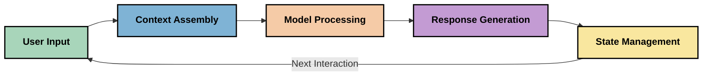
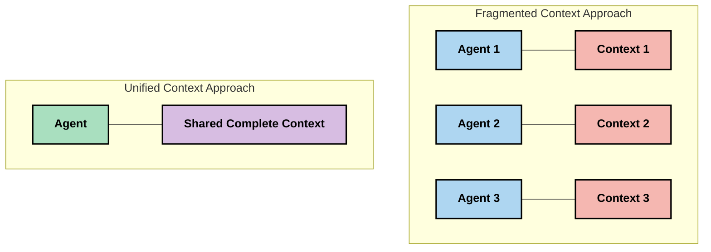
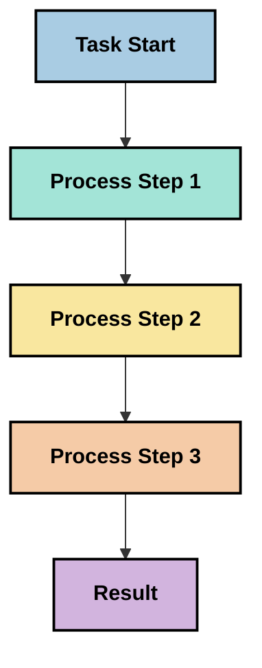
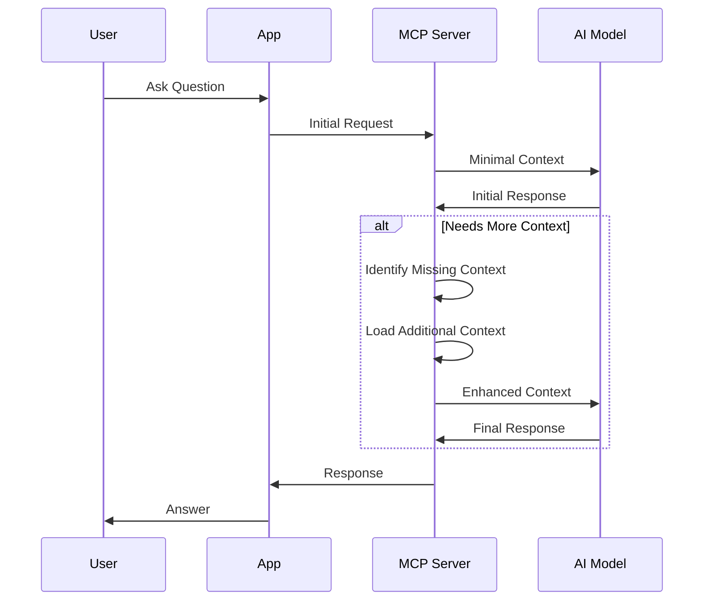
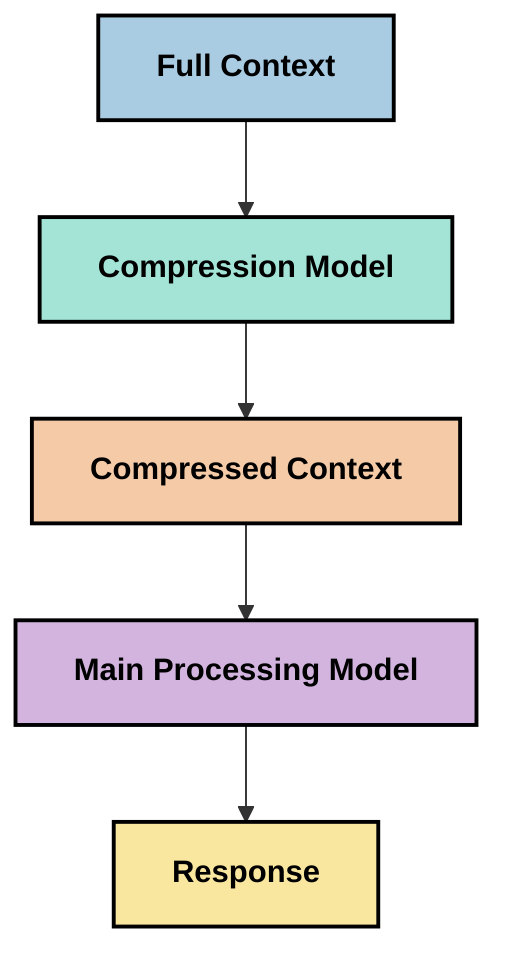
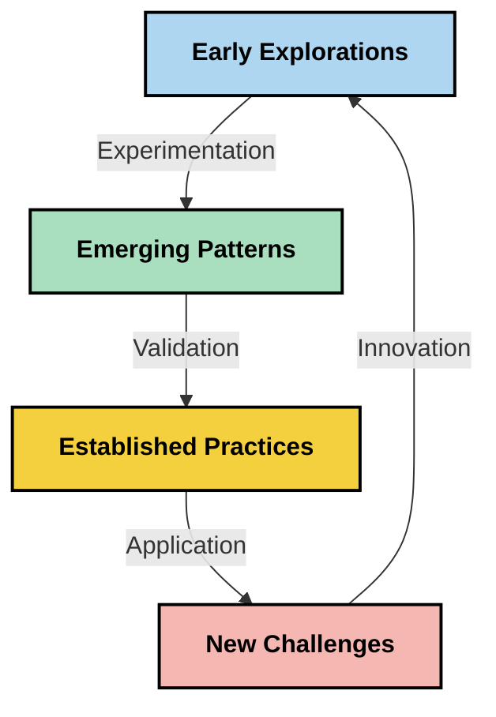

<!--
CO_OP_TRANSLATOR_METADATA:
{
  "original_hash": "5762e8e74dd99d8b7dbb31e69a82561e",
  "translation_date": "2025-07-16T23:01:08+00:00",
  "source_file": "05-AdvancedTopics/mcp-contextengineering/README.md",
  "language_code": "de"
}
-->
# Context Engineering: Ein aufkommendes Konzept im MCP-Ökosystem

## Überblick

Context Engineering ist ein aufkommendes Konzept im KI-Bereich, das untersucht, wie Informationen strukturiert, bereitgestellt und während der Interaktionen zwischen Clients und KI-Diensten verwaltet werden. Mit der Weiterentwicklung des Model Context Protocol (MCP)-Ökosystems wird das Verständnis für eine effektive Kontextverwaltung immer wichtiger. Dieses Modul führt in das Konzept des Context Engineering ein und beleuchtet dessen potenzielle Anwendungen in MCP-Implementierungen.

## Lernziele

Am Ende dieses Moduls werden Sie in der Lage sein:

- Das aufkommende Konzept des Context Engineering und seine mögliche Rolle in MCP-Anwendungen zu verstehen
- Zentrale Herausforderungen im Kontextmanagement zu erkennen, die das MCP-Protokolldesign adressiert
- Techniken zur Verbesserung der Modellleistung durch besseres Kontextmanagement zu erkunden
- Ansätze zur Messung und Bewertung der Kontextwirksamkeit zu betrachten
- Diese neuen Konzepte anzuwenden, um KI-Erfahrungen im MCP-Rahmen zu verbessern

## Einführung in Context Engineering

Context Engineering ist ein aufkommendes Konzept, das sich auf die bewusste Gestaltung und Verwaltung des Informationsflusses zwischen Nutzern, Anwendungen und KI-Modellen konzentriert. Im Gegensatz zu etablierten Bereichen wie Prompt Engineering wird Context Engineering noch von Praktikern definiert, während sie die einzigartigen Herausforderungen lösen, KI-Modellen zur richtigen Zeit die richtigen Informationen bereitzustellen.

Mit der Weiterentwicklung großer Sprachmodelle (LLMs) wird die Bedeutung von Kontext immer deutlicher. Die Qualität, Relevanz und Struktur des bereitgestellten Kontexts beeinflusst direkt die Modellausgaben. Context Engineering untersucht diese Beziehung und versucht, Prinzipien für ein effektives Kontextmanagement zu entwickeln.

> „Im Jahr 2025 sind die Modelle äußerst intelligent. Aber selbst der klügste Mensch kann seine Aufgabe ohne den Kontext dessen, was von ihm verlangt wird, nicht effektiv erfüllen... ‚Context Engineering‘ ist die nächste Stufe des Prompt Engineerings. Es geht darum, dies automatisch in einem dynamischen System zu tun.“ — Walden Yan, Cognition AI

Context Engineering kann folgende Bereiche umfassen:

1. **Kontextauswahl**: Bestimmen, welche Informationen für eine bestimmte Aufgabe relevant sind
2. **Kontextstrukturierung**: Organisieren von Informationen, um das Modellverständnis zu maximieren
3. **Kontextbereitstellung**: Optimieren, wie und wann Informationen an Modelle gesendet werden
4. **Kontextpflege**: Verwaltung des Zustands und der Entwicklung des Kontexts über die Zeit
5. **Kontextbewertung**: Messen und Verbessern der Wirksamkeit des Kontexts

Diese Schwerpunkte sind besonders relevant für das MCP-Ökosystem, das eine standardisierte Möglichkeit bietet, Anwendungen Kontext für LLMs bereitzustellen.

## Die Perspektive der Kontextreise

Eine Möglichkeit, Context Engineering zu visualisieren, ist die Nachverfolgung der Reise, die Informationen durch ein MCP-System nehmen:



### Wichtige Phasen der Kontextreise:

1. **Benutzereingabe**: Rohinformationen vom Nutzer (Text, Bilder, Dokumente)
2. **Kontextzusammenstellung**: Kombination der Benutzereingabe mit Systemkontext, Gesprächshistorie und anderen abgerufenen Informationen
3. **Modellverarbeitung**: Das KI-Modell verarbeitet den zusammengestellten Kontext
4. **Antwortgenerierung**: Das Modell erzeugt Ausgaben basierend auf dem bereitgestellten Kontext
5. **Zustandsverwaltung**: Das System aktualisiert seinen internen Zustand basierend auf der Interaktion

Diese Perspektive verdeutlicht die dynamische Natur von Kontext in KI-Systemen und wirft wichtige Fragen auf, wie Informationen in jeder Phase am besten verwaltet werden können.

## Aufkommende Prinzipien im Context Engineering

Während sich das Feld des Context Engineering formt, zeichnen sich erste Prinzipien ab, die von Praktikern entwickelt werden. Diese Prinzipien können bei der Gestaltung von MCP-Implementierungen hilfreich sein:

### Prinzip 1: Kontext vollständig teilen

Kontext sollte vollständig zwischen allen Komponenten eines Systems geteilt werden, anstatt fragmentiert über mehrere Agenten oder Prozesse verteilt zu sein. Wenn Kontext verteilt ist, können Entscheidungen in einem Teil des Systems im Widerspruch zu denen in einem anderen Teil stehen.



In MCP-Anwendungen bedeutet dies, Systeme so zu gestalten, dass Kontext nahtlos durch die gesamte Pipeline fließt, anstatt in separate Bereiche aufgeteilt zu sein.

### Prinzip 2: Erkennen, dass Aktionen implizite Entscheidungen tragen

Jede Aktion eines Modells beinhaltet implizite Entscheidungen darüber, wie der Kontext interpretiert wird. Wenn mehrere Komponenten auf unterschiedlichen Kontexten basieren, können diese impliziten Entscheidungen in Konflikt geraten und zu inkonsistenten Ergebnissen führen.

Dieses Prinzip hat wichtige Auswirkungen auf MCP-Anwendungen:
- Bevorzugen Sie lineare Verarbeitung komplexer Aufgaben gegenüber paralleler Ausführung mit fragmentiertem Kontext
- Stellen Sie sicher, dass alle Entscheidungspunkte Zugriff auf dieselben Kontextinformationen haben
- Gestalten Sie Systeme so, dass spätere Schritte den vollständigen Kontext früherer Entscheidungen sehen können

### Prinzip 3: Balance zwischen Kontexttiefe und Fensterbegrenzungen

Mit zunehmender Länge von Gesprächen und Prozessen überlaufen Kontextfenster irgendwann. Effektives Context Engineering untersucht Ansätze, um die Spannung zwischen umfassendem Kontext und technischen Beschränkungen zu managen.

Mögliche Ansätze sind:
- Kontextkompression, die wesentliche Informationen erhält und gleichzeitig den Tokenverbrauch reduziert
- Progressives Laden von Kontext basierend auf der Relevanz für aktuelle Bedürfnisse
- Zusammenfassung vorheriger Interaktionen unter Beibehaltung wichtiger Entscheidungen und Fakten

## Kontext-Herausforderungen und MCP-Protokolldesign

Das Model Context Protocol (MCP) wurde mit dem Bewusstsein für die einzigartigen Herausforderungen des Kontextmanagements entwickelt. Das Verständnis dieser Herausforderungen erklärt wichtige Aspekte des MCP-Protokolldesigns:

### Herausforderung 1: Begrenzungen des Kontextfensters  
Die meisten KI-Modelle haben feste Größen für Kontextfenster, was die Menge an Informationen begrenzt, die sie gleichzeitig verarbeiten können.

**MCP-Designantwort:**  
- Das Protokoll unterstützt strukturierten, ressourcenbasierten Kontext, der effizient referenziert werden kann  
- Ressourcen können paginiert und progressiv geladen werden

### Herausforderung 2: Bestimmung der Relevanz  
Es ist schwierig zu bestimmen, welche Informationen am relevantesten für den Kontext sind.

**MCP-Designantwort:**  
- Flexible Werkzeuge ermöglichen dynamisches Abrufen von Informationen je nach Bedarf  
- Strukturierte Prompts sorgen für konsistente Kontextorganisation

### Herausforderung 3: Kontextpersistenz  
Die Verwaltung des Zustands über Interaktionen hinweg erfordert sorgfältiges Tracking des Kontexts.

**MCP-Designantwort:**  
- Standardisiertes Sitzungsmanagement  
- Klar definierte Interaktionsmuster für die Kontextentwicklung

### Herausforderung 4: Multimodaler Kontext  
Verschiedene Datentypen (Text, Bilder, strukturierte Daten) erfordern unterschiedliche Handhabung.

**MCP-Designantwort:**  
- Protokolldesign berücksichtigt verschiedene Inhaltstypen  
- Standardisierte Darstellung multimodaler Informationen

### Herausforderung 5: Sicherheit und Datenschutz  
Kontext enthält oft sensible Informationen, die geschützt werden müssen.

**MCP-Designantwort:**  
- Klare Abgrenzung der Verantwortlichkeiten zwischen Client und Server  
- Lokale Verarbeitung zur Minimierung der Datenexposition

Das Verständnis dieser Herausforderungen und wie MCP sie adressiert, bildet die Grundlage für die Erforschung fortgeschrittener Context Engineering-Techniken.

## Aufkommende Ansätze im Context Engineering

Während sich das Feld des Context Engineering entwickelt, zeichnen sich mehrere vielversprechende Ansätze ab. Diese spiegeln den aktuellen Stand der Überlegungen wider und werden sich mit zunehmender Erfahrung in MCP-Implementierungen wahrscheinlich weiterentwickeln.

### 1. Einfädige lineare Verarbeitung

Im Gegensatz zu Multi-Agenten-Architekturen, die Kontext verteilen, stellen einige Praktiker fest, dass einfädige lineare Verarbeitung konsistentere Ergebnisse liefert. Dies entspricht dem Prinzip der Erhaltung eines einheitlichen Kontexts.



Obwohl dieser Ansatz weniger effizient als parallele Verarbeitung erscheinen mag, erzeugt er oft kohärentere und zuverlässigere Ergebnisse, da jeder Schritt auf einem vollständigen Verständnis vorheriger Entscheidungen aufbaut.

### 2. Kontextaufteilung und Priorisierung

Große Kontexte in handhabbare Teile zerlegen und das Wichtigste priorisieren.

```python
# Conceptual Example: Context Chunking and Prioritization
def process_with_chunked_context(documents, query):
    # 1. Break documents into smaller chunks
    chunks = chunk_documents(documents)
    
    # 2. Calculate relevance scores for each chunk
    scored_chunks = [(chunk, calculate_relevance(chunk, query)) for chunk in chunks]
    
    # 3. Sort chunks by relevance score
    sorted_chunks = sorted(scored_chunks, key=lambda x: x[1], reverse=True)
    
    # 4. Use the most relevant chunks as context
    context = create_context_from_chunks([chunk for chunk, score in sorted_chunks[:5]])
    
    # 5. Process with the prioritized context
    return generate_response(context, query)
```

Das obige Konzept zeigt, wie große Dokumente in handhabbare Abschnitte zerlegt und nur die relevantesten Teile für den Kontext ausgewählt werden können. Dieser Ansatz hilft, innerhalb der Grenzen des Kontextfensters zu arbeiten und gleichzeitig große Wissensbasen zu nutzen.

### 3. Progressives Kontextladen

Kontext nach Bedarf schrittweise laden, anstatt alles auf einmal.



Progressives Kontextladen beginnt mit minimalem Kontext und erweitert diesen nur bei Bedarf. Dies kann den Tokenverbrauch bei einfachen Anfragen erheblich reduzieren und gleichzeitig die Fähigkeit erhalten, komplexe Fragen zu bearbeiten.

### 4. Kontextkompression und -zusammenfassung

Kontextgröße reduzieren und dabei wesentliche Informationen bewahren.



Kontextkompression konzentriert sich auf:  
- Entfernen redundanter Informationen  
- Zusammenfassen umfangreicher Inhalte  
- Extrahieren wichtiger Fakten und Details  
- Bewahren kritischer Kontextelemente  
- Optimierung für Token-Effizienz

Dieser Ansatz ist besonders wertvoll, um lange Gespräche innerhalb von Kontextfenstern zu halten oder große Dokumente effizient zu verarbeiten. Einige Praktiker verwenden spezialisierte Modelle speziell für Kontextkompression und Zusammenfassung der Gesprächshistorie.

## Explorative Überlegungen zum Context Engineering

Beim Erkunden des aufkommenden Feldes des Context Engineering gibt es einige Überlegungen, die bei der Arbeit mit MCP-Implementierungen beachtet werden sollten. Diese sind keine verbindlichen Best Practices, sondern Bereiche zur Erkundung, die in Ihrem spezifischen Anwendungsfall Verbesserungen bringen können.

### Definieren Sie Ihre Kontextziele

Bevor Sie komplexe Kontextmanagementlösungen implementieren, formulieren Sie klar, was Sie erreichen wollen:  
- Welche spezifischen Informationen benötigt das Modell für den Erfolg?  
- Welche Informationen sind essenziell, welche ergänzend?  
- Welche Leistungsbeschränkungen (Latenz, Token-Limits, Kosten) bestehen?

### Erkunden Sie geschichtete Kontextansätze

Einige Praktiker haben Erfolg mit Kontext, der in konzeptionellen Schichten organisiert ist:  
- **Kernschicht**: Essenzielle Informationen, die das Modell immer benötigt  
- **Situationsschicht**: Kontext, der spezifisch für die aktuelle Interaktion ist  
- **Unterstützungsschicht**: Zusätzliche Informationen, die hilfreich sein können  
- **Fallback-Schicht**: Informationen, die nur bei Bedarf abgerufen werden

### Untersuchen Sie Abrufstrategien

Die Wirksamkeit Ihres Kontexts hängt oft davon ab, wie Sie Informationen abrufen:  
- Semantische Suche und Embeddings zur Auffindung konzeptuell relevanter Informationen  
- Stichwortbasierte Suche für spezifische Fakten  
- Hybride Ansätze, die mehrere Abrufmethoden kombinieren  
- Metadatenfilterung zur Eingrenzung nach Kategorien, Daten oder Quellen

### Experimentieren Sie mit Kontextkohärenz

Struktur und Fluss Ihres Kontexts können das Modellverständnis beeinflussen:  
- Zusammenfassung verwandter Informationen  
- Konsistente Formatierung und Organisation  
- Logische oder chronologische Reihenfolge, wo sinnvoll  
- Vermeidung widersprüchlicher Informationen

### Abwägen der Vor- und Nachteile von Multi-Agenten-Architekturen

Obwohl Multi-Agenten-Architekturen in vielen KI-Frameworks beliebt sind, bringen sie erhebliche Herausforderungen für das Kontextmanagement mit sich:  
- Kontextfragmentierung kann zu inkonsistenten Entscheidungen zwischen Agenten führen  
- Parallele Verarbeitung kann schwer zu lösende Konflikte verursachen  
- Kommunikationsaufwand zwischen Agenten kann Performancegewinne zunichtemachen  
- Komplexe Zustandsverwaltung ist nötig, um Kohärenz zu erhalten

In vielen Fällen kann ein Single-Agent-Ansatz mit umfassendem Kontextmanagement zuverlässigere Ergebnisse liefern als mehrere spezialisierte Agenten mit fragmentiertem Kontext.

### Entwickeln Sie Evaluationsmethoden

Um Context Engineering im Laufe der Zeit zu verbessern, überlegen Sie, wie Sie Erfolg messen:  
- A/B-Tests verschiedener Kontextstrukturen  
- Überwachung von Tokenverbrauch und Antwortzeiten  
- Verfolgung von Nutzerzufriedenheit und Aufgabenerfüllung  
- Analyse von Fällen, in denen Kontextstrategien versagen

Diese Überlegungen spiegeln aktive Forschungsbereiche im Context Engineering wider. Mit der Reifung des Feldes werden wahrscheinlich klarere Muster und Praktiken entstehen.

## Messung der Kontextwirksamkeit: Ein sich entwickelndes Rahmenwerk

Da Context Engineering als Konzept entsteht, beginnen Praktiker zu erforschen, wie dessen Wirksamkeit gemessen werden kann. Ein etabliertes Rahmenwerk existiert noch nicht, aber verschiedene Metriken werden diskutiert, die zukünftige Arbeiten leiten könnten.

### Mögliche Messdimensionen

#### 1. Überlegungen zur Eingabeeffizienz

- **Kontext-zu-Antwort-Verhältnis**: Wie viel Kontext wird im Verhältnis zur Antwortgröße benötigt?  
- **Token-Nutzung**: Welcher Anteil der bereitgestellten Kontext-Token beeinflusst die Antwort?  
- **Kontextreduktion**: Wie effektiv kann rohe Information komprimiert werden?

#### 2. Leistungsüberlegungen

- **Latenzeinfluss**: Wie wirkt sich das Kontextmanagement auf die Antwortzeit aus?  
- **Tokenökonomie**: Optimieren wir den Tokenverbrauch effektiv?  
- **Abrufpräzision**: Wie relevant sind die abgerufenen Informationen?  
- **Ressourcennutzung**: Welche Rechenressourcen werden benötigt?

#### 3. Qualitätsüberlegungen

- **Antwortrelevanz**: Wie gut beantwortet die Antwort die Anfrage?  
- **Faktengenauigkeit**: Verbessert das Kontextmanagement die faktische Korrektheit?  
- **Konsistenz**: Sind Antworten bei ähnlichen Anfragen konsistent?  
- **Halluzinationsrate**: Reduziert besserer Kontext Modellhalluzinationen?

#### 4. Nutzererfahrungsüberlegungen

- **Nachfragequote**: Wie oft benötigen Nutzer Nachfragen oder Klarstellungen?  
- **Aufgabenerfüllung**: Erreichen Nutzer erfolgreich ihre Ziele?  
- **Zufriedenheitsindikatoren**: Wie bewerten Nutzer ihre Erfahrung?

### Explorative Messansätze

Beim Experimentieren mit Context Engineering in MCP-Implementierungen sollten Sie folgende Ansätze in Betracht ziehen:

1. **Basislinienvergleiche**: Etablieren Sie eine Basislinie mit einfachen Kontextansätzen, bevor Sie komplexere Methoden testen  
2. **Inkrementelle Änderungen**: Ändern Sie jeweils nur einen Aspekt des Kontextmanagements, um dessen Wirkung isoliert zu betrachten  
3. **Nutzerzentrierte Evaluation**: Kombinieren Sie quantitative Metriken mit qualitativem Nutzerfeedback  
4. **Fehleranalyse**: Untersuchen Sie Fälle, in denen Kontextstrategien versagen, um Verbesserungen zu identifizieren  
5. **Mehrdimensionale Bewertung**: Berücksichtigen Sie Kompromisse zwischen Effizienz, Qualität und Nutzererfahrung

Dieser experimentelle, vielschichtige Messansatz entspricht dem aufkommenden Charakter des Context Engineering.

## Abschließende Gedanken

Context Engineering ist ein aufkommendes Forschungsfeld, das für effektive MCP-Anwendungen zentral sein könnte. Durch eine durchdachte Betrachtung des Informationsflusses in Ihrem System können Sie KI-Erfahrungen schaffen, die effizienter, genauer und wertvoller für Nutzer sind.

Die in diesem Modul vorgestellten Techniken und Ansätze spiegeln frühe Überlegungen wider, nicht etablierte Praktiken. Context Engineering könnte sich zu einer klar definierten Disziplin entwickeln, während KI-Fähigkeiten wachsen und unser Verständnis sich vertieft. Für den Moment scheint Experimentieren in Kombination mit sorgfältiger Messung der produktivste Weg zu sein.

## Mögliche zukünftige Entwicklungen

Das Feld des Context Engineering befindet sich noch in den Anfängen, aber mehrere vielversprechende Richtungen zeichnen sich ab:

- Prinzipien des Context Engineering könnten Modellleistung, Effizienz, Nutzererfahrung und Zuverlässigkeit maßgeblich beeinflussen  
- Einfädige Ansätze mit umfassendem Kontextmanagement könnten Multi-Agenten-Architekturen in vielen Anwendungsfällen übertreffen  
- Spezialisierte Modelle zur Kontextkompression könnten Standardkomponenten in KI-Pipelines werden  
- Die Spannung zwischen Kontextvollständigkeit und Tokenbegrenzungen wird Innovationen im Kontexthandling vorantreiben  
- Mit zunehmender Fähigkeit der Modelle zur effizienten, menschenähnlichen Kommunikation könnte echte Multi-Agenten-Zusammenarbeit praktikabler werden  
- MCP-Implementierungen könnten sich weiterentwickeln, um Kontextmanagementmuster zu standardisieren, die aus aktuellen Experimenten hervorgehen



## Ressourcen

### Offizielle MCP-Ressourcen
- [Model Context Protocol Website](https://modelcontextprotocol.io/)
- [Model Context Protocol Specification](https://github.com/modelcontextprotocol/modelcontextprotocol)
- [MCP Documentation](https://modelcontextprotocol.io/docs)
- [MCP C# SDK](https://github.com/modelcontextprotocol/csharp-sdk)
- [MCP Python SDK](https://github.com/modelcontextprotocol/python-sdk)
- [MCP TypeScript SDK](https://github.com/modelcontextprotocol/typescript-sdk)
- [MCP Inspector](https://github.com/modelcontextprotocol/inspector) - Visuelles Testwerkzeug für MCP-Server

### Artikel zur Kontext-Entwicklung
- [Don't Build Multi-Agents: Principles of Context Engineering](https://cognition.ai/blog/dont-build-multi-agents) - Walden Yans Einblicke in die Prinzipien der Kontext-Entwicklung
- [A Practical Guide to Building Agents](https://cdn.openai.com/business-guides-and-resources/a-practical-guide-to-building-agents.pdf) - OpenAIs Leitfaden für effektives Agentendesign
- [Building Effective Agents](https://www.anthropic.com/engineering/building-effective-agents) - Anthropics Ansatz zur Agentenentwicklung

### Verwandte Forschung
- [Dynamic Retrieval Augmentation for Large Language Models](https://arxiv.org/abs/2310.01487) - Forschung zu dynamischen Retrieval-Methoden
- [Lost in the Middle: How Language Models Use Long Contexts](https://arxiv.org/abs/2307.03172) - Wichtige Forschung zu Mustern der Kontextverarbeitung
- [Hierarchical Text-Conditioned Image Generation with CLIP Latents](https://arxiv.org/abs/2204.06125) - DALL-E 2-Paper mit Erkenntnissen zur Kontextstrukturierung
- [Exploring the Role of Context in Large Language Model Architectures](https://aclanthology.org/2023.findings-emnlp.124/) - Aktuelle Forschung zum Umgang mit Kontext
- [Multi-Agent Collaboration: A Survey](https://arxiv.org/abs/2304.03442) - Forschung zu Multi-Agenten-Systemen und deren Herausforderungen

### Zusätzliche Ressourcen
- [Context Window Optimization Techniques](https://learn.microsoft.com/en-us/azure/ai-services/openai/concepts/context-window)
- [Advanced RAG Techniques](https://www.microsoft.com/en-us/research/blog/retrieval-augmented-generation-rag-and-frontier-models/)
- [Semantic Kernel Documentation](https://github.com/microsoft/semantic-kernel)
- [AI Toolkit for Context Management](https://github.com/microsoft/aitoolkit)

## Was kommt als Nächstes
- [6. Community Contributions](../../06-CommunityContributions/README.md)

**Haftungsausschluss**:  
Dieses Dokument wurde mit dem KI-Übersetzungsdienst [Co-op Translator](https://github.com/Azure/co-op-translator) übersetzt. Obwohl wir uns um Genauigkeit bemühen, beachten Sie bitte, dass automatisierte Übersetzungen Fehler oder Ungenauigkeiten enthalten können. Das Originaldokument in seiner Ursprungssprache ist als maßgebliche Quelle zu betrachten. Für wichtige Informationen wird eine professionelle menschliche Übersetzung empfohlen. Wir übernehmen keine Haftung für Missverständnisse oder Fehlinterpretationen, die aus der Nutzung dieser Übersetzung entstehen.