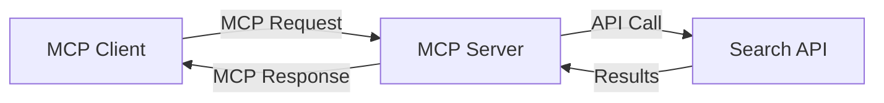
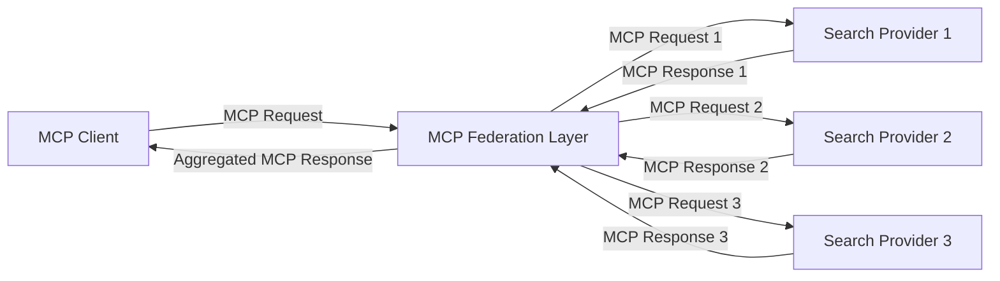
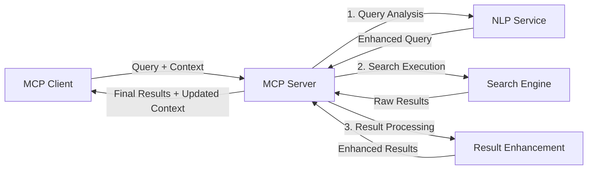

<!--
CO_OP_TRANSLATOR_METADATA:
{
  "original_hash": "eb12652eb7bd17f2193b835a344425c6",
  "translation_date": "2025-06-26T13:36:10+00:00",
  "source_file": "05-AdvancedTopics/mcp-realtimesearch/README.md",
  "language_code": "de"
}
-->
## Haftungsausschluss zu Code-Beispielen

> **Wichtiger Hinweis**: Die folgenden Code-Beispiele zeigen die Integration des Model Context Protocol (MCP) mit Web-Suchfunktionen. Obwohl sie den Mustern und Strukturen der offiziellen MCP SDKs folgen, wurden sie zu Lehrzwecken vereinfacht.
> 
> Diese Beispiele veranschaulichen:
> 
> 1. **Python-Implementierung**: Eine FastMCP-Server-Implementierung, die ein Web-Suchtool bereitstellt und sich mit einer externen Such-API verbindet. Dieses Beispiel zeigt das richtige Lebenszyklus-Management, Kontextbehandlung und die Tool-Implementierung gemäß den Mustern des [offiziellen MCP Python SDK](https://github.com/modelcontextprotocol/python-sdk). Der Server verwendet den empfohlenen Streamable HTTP Transport, der den älteren SSE-Transport für den Produktionseinsatz ersetzt hat.
> 
> 2. **JavaScript-Implementierung**: Eine TypeScript/JavaScript-Implementierung basierend auf dem FastMCP-Pattern aus dem [offiziellen MCP TypeScript SDK](https://github.com/modelcontextprotocol/typescript-sdk), um einen Suchserver mit korrekten Tool-Definitionen und Client-Verbindungen zu erstellen. Sie folgt den neuesten empfohlenen Mustern für Sitzungsmanagement und Kontextbewahrung.
> 
> Für den Produktionseinsatz wären zusätzliche Fehlerbehandlung, Authentifizierung und spezifische API-Integrationscodes erforderlich. Die dargestellten Such-API-Endpunkte (`https://api.search-service.example/search`) sind Platzhalter und müssten durch tatsächliche Suchdienst-Endpunkte ersetzt werden.
> 
> Für vollständige Implementierungsdetails und die aktuellsten Vorgehensweisen konsultieren Sie bitte die [offizielle MCP-Spezifikation](https://spec.modelcontextprotocol.io/) und die SDK-Dokumentation.

## Kernkonzepte

### Das Model Context Protocol (MCP) Framework

Grundlegend bietet das Model Context Protocol eine standardisierte Möglichkeit, wie KI-Modelle, Anwendungen und Dienste Kontext austauschen. Im Bereich der Echtzeit-Websuche ist dieses Framework essenziell, um kohärente Sucherlebnisse über mehrere Suchanfragen hinweg zu schaffen. Wichtige Komponenten sind:

1. **Client-Server-Architektur**: MCP schafft eine klare Trennung zwischen Suchclients (Anfragenden) und Suchservern (Anbietern), was flexible Bereitstellungsmodelle ermöglicht.

2. **JSON-RPC-Kommunikation**: Das Protokoll nutzt JSON-RPC für den Nachrichtenaustausch, wodurch es mit Web-Technologien kompatibel und plattformübergreifend einfach zu implementieren ist.

3. **Kontextmanagement**: MCP definiert strukturierte Methoden zur Pflege, Aktualisierung und Nutzung des Suchkontexts über mehrere Interaktionen hinweg.

4. **Tool-Definitionen**: Suchfunktionen werden als standardisierte Tools mit klar definierten Parametern und Rückgabewerten bereitgestellt.

5. **Streaming-Unterstützung**: Das Protokoll unterstützt Streaming-Ergebnisse, was für Echtzeitsuchen wichtig ist, da Ergebnisse schrittweise eintreffen können.

### Muster zur Integration der Websuche

Beim Einbinden von MCP in Websuche zeigen sich mehrere Muster:

#### 1. Direkte Integration von Suchanbietern

In diesem Muster kommuniziert der MCP-Server direkt mit einer oder mehreren Such-APIs, übersetzt MCP-Anfragen in API-spezifische Aufrufe und formatiert die Ergebnisse als MCP-Antworten.

#### 2. Föderierte Suche mit Kontextbewahrung

Dieses Muster verteilt Suchanfragen auf mehrere MCP-kompatible Suchanbieter, die sich jeweils auf unterschiedliche Inhaltsarten oder Suchfähigkeiten spezialisieren können, während ein einheitlicher Kontext erhalten bleibt.

#### 3. Kontextverbesserte Suchkette

Hier wird der Suchprozess in mehrere Stufen unterteilt, wobei der Kontext in jedem Schritt angereichert wird, was zu zunehmend relevanteren Ergebnissen führt.

### Komponenten des Suchkontexts

Im MCP-basierten Web-Suchkontext umfasst der Kontext typischerweise:

- **Suchanfragen-Verlauf**: Vorherige Suchanfragen innerhalb der Sitzung
- **Benutzereinstellungen**: Sprache, Region, Safe-Search-Einstellungen
- **Interaktionshistorie**: Welche Ergebnisse angeklickt wurden, Verweildauer auf Ergebnissen
- **Suchparameter**: Filter, Sortierreihenfolge und andere Suchmodifikatoren
- **Domänenwissen**: Fachspezifischer Kontext, der für die Suche relevant ist
- **Zeitlicher Kontext**: Zeitbasierte Relevanzfaktoren
- **Quellenpräferenzen**: Vertrauenswürdige oder bevorzugte Informationsquellen

## Anwendungsfälle und Einsatzgebiete

### Forschung und Informationsbeschaffung

MCP verbessert Forschungsabläufe durch:

- Erhalt des Forschungskontexts über Suchsitzungen hinweg
- Ermöglichung komplexerer und kontextbezogener Suchanfragen
- Unterstützung der föderierten Suche über mehrere Quellen
- Erleichterung der Wissensextraktion aus Suchergebnissen

### Echtzeit-Nachrichten- und Trendüberwachung

MCP-gestützte Suche bietet Vorteile für die Nachrichtenüberwachung:

- Nahezu Echtzeit-Erkennung aufkommender Nachrichten
- Kontextbezogene Filterung relevanter Informationen
- Verfolgung von Themen und Entitäten über mehrere Quellen hinweg
- Personalisierte Nachrichtenbenachrichtigungen basierend auf Benutzerkontext

### KI-unterstütztes Browsen und Forschen

MCP eröffnet neue Möglichkeiten für KI-unterstütztes Browsen:

- Kontextbezogene Suchvorschläge basierend auf aktueller Browseraktivität
- Nahtlose Integration von Websuche mit LLM-gestützten Assistenten
- Mehrstufige Suchverfeinerung mit erhaltenem Kontext
- Verbesserte Faktenprüfung und Informationsverifikation

## Zukunftstrends und Innovationen

### Weiterentwicklung von MCP in der Websuche

Für die Zukunft erwarten wir, dass MCP folgende Bereiche adressiert:

- **Multimodale Suche**: Integration von Text-, Bild-, Audio- und Videosuche mit erhaltenem Kontext
- **Dezentrale Suche**: Unterstützung verteilter und föderierter Suchökosysteme
- **Such-Privatsphäre**: Kontextbewusste, datenschutzfreundliche Suchmechanismen
- **Anfrageverständnis**: Tiefgehende semantische Analyse natürlicher Sprachsuchanfragen

### Potenzielle technologische Fortschritte

Neue Technologien, die die Zukunft von MCP-Suche prägen werden:

1. **Neuronale Sucharchitekturen**: Embedding-basierte Suchsysteme, optimiert für MCP
2. **Personalisierter Suchkontext**: Lernen individueller Suchmuster über die Zeit
3. **Integration von Wissensgraphen**: Kontextbezogene Suche unterstützt durch domänenspezifische Wissensgraphen
4. **Cross-Modaler Kontext**: Erhalt des Kontexts über verschiedene Suchmodalitäten hinweg

## Praktische Übungen

### Übung 1: Einrichtung einer einfachen MCP-Suchpipeline

In dieser Übung lernen Sie:

- Konfiguration einer grundlegenden MCP-Suchumgebung
- Implementierung von Kontext-Handlern für Websuche
- Test und Validierung der Kontextbewahrung über Suchiterationen hinweg

### Übung 2: Aufbau eines Forschungsassistenten mit MCP-Suche

Erstellen Sie eine vollständige Anwendung, die:

- Forschungsfragen in natürlicher Sprache verarbeitet
- Kontextbewusste Websuchen durchführt
- Informationen aus mehreren Quellen synthetisiert
- Organisierte Forschungsergebnisse präsentiert

### Übung 3: Implementierung einer mehrquelligen Suchföderation mit MCP

Fortgeschrittene Übung zu:

- Kontextbewusstem Dispatch von Suchanfragen an mehrere Suchmaschinen
- Ergebnis-Ranking und Aggregation
- Kontextbasierter Duplikaterkennung in Suchergebnissen
- Umgang mit quellen-spezifischen Metadaten

## Zusätzliche Ressourcen

- [Model Context Protocol Specification](https://spec.modelcontextprotocol.io/) – Offizielle MCP-Spezifikation und ausführliche Protokolldokumentation
- [Model Context Protocol Documentation](https://modelcontextprotocol.io/) – Detaillierte Tutorials und Implementierungsanleitungen
- [MCP Python SDK](https://github.com/modelcontextprotocol/python-sdk) – Offizielle Python-Implementierung des MCP-Protokolls
- [MCP TypeScript SDK](https://github.com/modelcontextprotocol/typescript-sdk) – Offizielle TypeScript-Implementierung des MCP-Protokolls
- [MCP Reference Servers](https://github.com/modelcontextprotocol/servers) – Referenzimplementierungen von MCP-Servern
- [Bing Web Search API Documentation](https://learn.microsoft.com/en-us/bing/search-apis/bing-web-search/overview) – Microsofts Web-Such-API
- [Google Custom Search JSON API](https://developers.google.com/custom-search/v1/overview) – Googles programmierbare Suchmaschine
- [SerpAPI Documentation](https://serpapi.com/search-api) – API für Suchergebnisseiten
- [Meilisearch Documentation](https://www.meilisearch.com/docs) – Open-Source-Suchmaschine
- [Elasticsearch Documentation](https://www.elastic.co/guide/index.html) – Verteilte Such- und Analyse-Engine
- [LangChain Documentation](https://python.langchain.com/docs/get_started/introduction) – Entwicklung von Anwendungen mit LLMs

## Lernziele

Nach Abschluss dieses Moduls werden Sie in der Lage sein:

- Die Grundlagen der Echtzeit-Websuche und ihre Herausforderungen zu verstehen
- Erklären, wie das Model Context Protocol (MCP) Echtzeit-Websuche verbessert
- MCP-basierte Suchlösungen mit gängigen Frameworks und APIs zu implementieren
- Skalierbare, leistungsfähige Sucharchitekturen mit MCP zu entwerfen und bereitzustellen
- MCP-Konzepte auf verschiedene Anwendungsfälle wie semantische Suche, Forschungsassistenz und KI-unterstütztes Browsen anzuwenden
- Neue Trends und Innovationen in MCP-basierten Suchtechnologien zu bewerten

### Vertrauens- und Sicherheitsaspekte

Beim Implementieren von MCP-basierten Websuchlösungen beachten Sie bitte folgende wichtige Prinzipien aus der MCP-Spezifikation:

1. **Einwilligung und Kontrolle der Nutzer**: Nutzer müssen ausdrücklich zustimmen und alle Datenzugriffe sowie Operationen verstehen. Das ist besonders wichtig bei Websuchimplementierungen, die auf externe Datenquellen zugreifen.

2. **Datenschutz**: Gewährleisten Sie einen angemessenen Umgang mit Suchanfragen und Ergebnissen, insbesondere wenn diese sensible Informationen enthalten könnten. Implementieren Sie geeignete Zugriffskontrollen zum Schutz der Nutzerdaten.

3. **Tool-Sicherheit**: Sorgen Sie für ordnungsgemäße Autorisierung und Validierung von Suchtools, da sie durch beliebige Codeausführung potenzielle Sicherheitsrisiken darstellen. Beschreibungen des Tool-Verhaltens sollten als nicht vertrauenswürdig gelten, sofern sie nicht von einem vertrauenswürdigen Server stammen.

4. **Klare Dokumentation**: Stellen Sie eine transparente Dokumentation zu Fähigkeiten, Einschränkungen und Sicherheitsaspekten Ihrer MCP-basierten Suche bereit, gemäß den Vorgaben der MCP-Spezifikation.

5. **Robuste Einwilligungsprozesse**: Entwickeln Sie robuste Zustimmungs- und Autorisierungsprozesse, die klar erklären, was jedes Tool tut, bevor dessen Nutzung erlaubt wird – insbesondere bei Tools, die mit externen Webressourcen interagieren.

Für vollständige Details zu Sicherheit und Vertrauenswürdigkeit von MCP konsultieren Sie bitte die [offizielle Dokumentation](https://modelcontextprotocol.io/specification/2025-03-26#security-and-trust-%26-safety).

## Was kommt als Nächstes

- [5.11 Entra ID-Authentifizierung für Model Context Protocol-Server](../mcp-security-entra/README.md)

**Haftungsausschluss**:  
Dieses Dokument wurde mit dem KI-Übersetzungsdienst [Co-op Translator](https://github.com/Azure/co-op-translator) übersetzt. Obwohl wir uns um Genauigkeit bemühen, beachten Sie bitte, dass automatisierte Übersetzungen Fehler oder Ungenauigkeiten enthalten können. Das Originaldokument in seiner Ursprungssprache ist als maßgebliche Quelle zu betrachten. Für wichtige Informationen wird eine professionelle menschliche Übersetzung empfohlen. Wir übernehmen keine Haftung für Missverständnisse oder Fehlinterpretationen, die aus der Verwendung dieser Übersetzung entstehen.