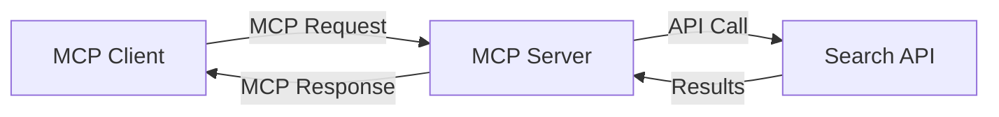
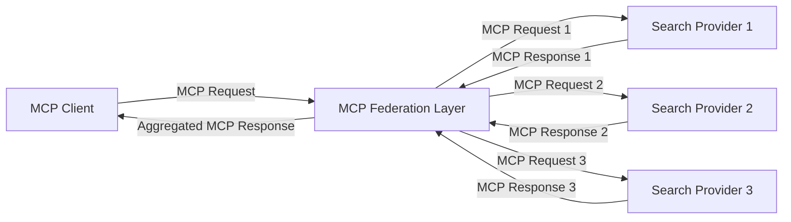
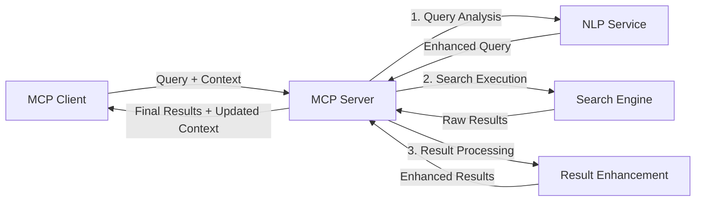

<!--
CO_OP_TRANSLATOR_METADATA:
{
  "original_hash": "333a03e51f90bdf3e6f1ba1694c73f36",
  "translation_date": "2025-07-16T22:16:23+00:00",
  "source_file": "05-AdvancedTopics/mcp-realtimesearch/README.md",
  "language_code": "de"
}
-->
## Haftungsausschluss zu Codebeispielen

> **Wichtiger Hinweis**: Die folgenden Codebeispiele zeigen die Integration des Model Context Protocol (MCP) mit Web-Suchfunktionen. Obwohl sie den Mustern und Strukturen der offiziellen MCP SDKs folgen, wurden sie zu Lehrzwecken vereinfacht.
> 
> Diese Beispiele veranschaulichen:
> 
> 1. **Python-Implementierung**: Eine FastMCP-Server-Implementierung, die ein Web-Suchtool bereitstellt und sich mit einer externen Such-API verbindet. Dieses Beispiel demonstriert korrektes Lifespan-Management, Kontextverwaltung und Tool-Implementierung nach den Mustern des [offiziellen MCP Python SDK](https://github.com/modelcontextprotocol/python-sdk). Der Server nutzt den empfohlenen Streamable HTTP-Transport, der den älteren SSE-Transport für produktive Einsätze abgelöst hat.
> 
> 2. **JavaScript-Implementierung**: Eine TypeScript/JavaScript-Implementierung, die das FastMCP-Muster aus dem [offiziellen MCP TypeScript SDK](https://github.com/modelcontextprotocol/typescript-sdk) verwendet, um einen Suchserver mit korrekten Tool-Definitionen und Client-Verbindungen zu erstellen. Sie folgt den neuesten empfohlenen Mustern für Sitzungsmanagement und Kontextbewahrung.
> 
> Für den produktiven Einsatz wären zusätzliche Fehlerbehandlung, Authentifizierung und spezifische API-Integrationscodes erforderlich. Die gezeigten Such-API-Endpunkte (`https://api.search-service.example/search`) sind Platzhalter und müssten durch tatsächliche Suchdienst-Endpunkte ersetzt werden.
> 
> Für vollständige Implementierungsdetails und die aktuellsten Vorgehensweisen konsultieren Sie bitte die [offizielle MCP-Spezifikation](https://spec.modelcontextprotocol.io/) und die SDK-Dokumentation.

## Kernkonzepte

### Das Model Context Protocol (MCP) Framework

Grundlegend bietet das Model Context Protocol eine standardisierte Möglichkeit für KI-Modelle, Anwendungen und Dienste, Kontext auszutauschen. Im Bereich der Echtzeit-Websuche ist dieses Framework essenziell, um kohärente, mehrstufige Sucherlebnisse zu schaffen. Wichtige Komponenten sind:

1. **Client-Server-Architektur**: MCP etabliert eine klare Trennung zwischen Suchclients (Anfragenden) und Suchservern (Anbietern), was flexible Bereitstellungsmodelle ermöglicht.

2. **JSON-RPC-Kommunikation**: Das Protokoll nutzt JSON-RPC für den Nachrichtenaustausch, was es kompatibel mit Webtechnologien macht und die Implementierung auf verschiedenen Plattformen erleichtert.

3. **Kontextmanagement**: MCP definiert strukturierte Methoden zur Pflege, Aktualisierung und Nutzung von Suchkontext über mehrere Interaktionen hinweg.

4. **Tool-Definitionen**: Suchfunktionen werden als standardisierte Tools mit klar definierten Parametern und Rückgabewerten bereitgestellt.

5. **Streaming-Unterstützung**: Das Protokoll unterstützt das Streaming von Ergebnissen, was für Echtzeitsuche wichtig ist, da Ergebnisse schrittweise eintreffen können.

### Integrationsmuster für Websuche

Bei der Integration von MCP mit Websuche zeichnen sich mehrere Muster ab:

#### 1. Direkte Integration von Suchanbietern

In diesem Muster kommuniziert der MCP-Server direkt mit einer oder mehreren Such-APIs, übersetzt MCP-Anfragen in API-spezifische Aufrufe und formatiert die Ergebnisse als MCP-Antworten.

#### 2. Föderierte Suche mit Kontextbewahrung

Dieses Muster verteilt Suchanfragen auf mehrere MCP-kompatible Suchanbieter, die sich jeweils auf unterschiedliche Inhalte oder Suchfähigkeiten spezialisieren können, während ein einheitlicher Kontext erhalten bleibt.

#### 3. Kontextverbesserte Suchkette

Hier wird der Suchprozess in mehrere Stufen unterteilt, wobei der Kontext in jedem Schritt angereichert wird, was zu zunehmend relevanteren Ergebnissen führt.

### Komponenten des Suchkontexts

Im MCP-basierten Websuche-Kontext umfasst der Kontext typischerweise:

- **Suchverlauf**: Frühere Suchanfragen innerhalb der Sitzung
- **Benutzereinstellungen**: Sprache, Region, Safe-Search-Einstellungen
- **Interaktionshistorie**: Welche Ergebnisse angeklickt wurden, Verweildauer auf Ergebnissen
- **Suchparameter**: Filter, Sortierreihenfolgen und andere Suchmodifikatoren
- **Fachliches Wissen**: Fachspezifischer Kontext, der für die Suche relevant ist
- **Zeitlicher Kontext**: Zeitbasierte Relevanzfaktoren
- **Quellenpräferenzen**: Vertrauenswürdige oder bevorzugte Informationsquellen

## Anwendungsfälle und Einsatzgebiete

### Forschung und Informationsbeschaffung

MCP verbessert Forschungsabläufe durch:

- Bewahrung des Forschungskontexts über Suchsitzungen hinweg
- Ermöglichung komplexerer und kontextuell relevanter Suchanfragen
- Unterstützung föderierter Mehrquellensuche
- Erleichterung der Wissensextraktion aus Suchergebnissen

### Echtzeit-Nachrichten- und Trendüberwachung

MCP-gestützte Suche bietet Vorteile für die Nachrichtenüberwachung:

- Nahezu Echtzeit-Erkennung aufkommender Nachrichten
- Kontextuelle Filterung relevanter Informationen
- Verfolgung von Themen und Entitäten über mehrere Quellen hinweg
- Personalisierte Nachrichtenbenachrichtigungen basierend auf Benutzerkontext

### KI-unterstütztes Browsen und Forschen

MCP eröffnet neue Möglichkeiten für KI-unterstütztes Browsen:

- Kontextbezogene Suchvorschläge basierend auf aktueller Browseraktivität
- Nahtlose Integration von Websuche mit LLM-gestützten Assistenten
- Mehrstufige Suchverfeinerung mit erhaltenem Kontext
- Verbesserte Faktenprüfung und Informationsverifikation

## Zukünftige Trends und Innovationen

### Weiterentwicklung von MCP in der Websuche

Mit Blick auf die Zukunft erwarten wir, dass MCP sich weiterentwickelt, um folgende Bereiche abzudecken:

- **Multimodale Suche**: Integration von Text-, Bild-, Audio- und Videosuche mit bewahrtem Kontext
- **Dezentrale Suche**: Unterstützung verteilter und föderierter Suchökosysteme
- **Suchprivatsphäre**: Kontextbewusste, datenschutzfreundliche Suchmechanismen  
- **Abfrageverständnis**: Tiefgehende semantische Analyse von Suchanfragen in natürlicher Sprache  

### Mögliche technologische Fortschritte

Neue Technologien, die die Zukunft der MCP-Suche prägen werden:

1. **Neuronale Sucharchitekturen**: Embedding-basierte Suchsysteme, optimiert für MCP  
2. **Personalisierter Suchkontext**: Lernen individueller Suchmuster von Nutzern über die Zeit  
3. **Integration von Wissensgraphen**: Kontextuelle Suche, verbessert durch domänenspezifische Wissensgraphen  
4. **Cross-Modale Kontexte**: Kontextbeibehaltung über verschiedene Suchmodalitäten hinweg  

## Praktische Übungen

### Übung 1: Einrichtung einer grundlegenden MCP-Suchpipeline

In dieser Übung lernst du, wie du:  
- Eine einfache MCP-Suchumgebung konfigurierst  
- Kontext-Handler für die Websuche implementierst  
- Die Kontextwahrung über mehrere Suchdurchläufe testest und validierst  

### Übung 2: Aufbau eines Forschungsassistenten mit MCP-Suche

Erstelle eine vollständige Anwendung, die:  
- Forschungsfragen in natürlicher Sprache verarbeitet  
- Kontextbewusste Websuchen durchführt  
- Informationen aus verschiedenen Quellen zusammenführt  
- Organisierte Forschungsergebnisse präsentiert  

### Übung 3: Implementierung einer Multi-Source-Suchföderation mit MCP

Fortgeschrittene Übung, die folgende Themen abdeckt:  
- Kontextbewusste Abfrageverteilung auf mehrere Suchmaschinen  
- Ergebnis-Ranking und Aggregation  
- Kontextuelle Duplikaterkennung bei Suchergebnissen  
- Umgang mit quellspezifischen Metadaten  

## Zusätzliche Ressourcen

- [Model Context Protocol Specification](https://spec.modelcontextprotocol.io/) – Offizielle MCP-Spezifikation und ausführliche Protokolldokumentation  
- [Model Context Protocol Documentation](https://modelcontextprotocol.io/) – Detaillierte Tutorials und Implementierungsanleitungen  
- [MCP Python SDK](https://github.com/modelcontextprotocol/python-sdk) – Offizielle Python-Implementierung des MCP-Protokolls  
- [MCP TypeScript SDK](https://github.com/modelcontextprotocol/typescript-sdk) – Offizielle TypeScript-Implementierung des MCP-Protokolls  
- [MCP Reference Servers](https://github.com/modelcontextprotocol/servers) – Referenzimplementierungen von MCP-Servern  
- [Bing Web Search API Documentation](https://learn.microsoft.com/en-us/bing/search-apis/bing-web-search/overview) – Microsofts Web-Such-API  
- [Google Custom Search JSON API](https://developers.google.com/custom-search/v1/overview) – Googles programmierbare Suchmaschine  
- [SerpAPI Documentation](https://serpapi.com/search-api) – API für Suchmaschinenergebnisseiten  
- [Meilisearch Documentation](https://www.meilisearch.com/docs) – Open-Source-Suchmaschine  
- [Elasticsearch Documentation](https://www.elastic.co/guide/index.html) – Verteilte Such- und Analyse-Engine  
- [LangChain Documentation](https://python.langchain.com/docs/get_started/introduction) – Entwicklung von Anwendungen mit LLMs  

## Lernziele

Nach Abschluss dieses Moduls wirst du in der Lage sein:  

- Die Grundlagen der Echtzeit-Websuche und deren Herausforderungen zu verstehen  
- Zu erklären, wie das Model Context Protocol (MCP) die Fähigkeiten der Echtzeit-Websuche verbessert  
- MCP-basierte Suchlösungen mit gängigen Frameworks und APIs zu implementieren  
- Skalierbare, leistungsstarke Sucharchitekturen mit MCP zu entwerfen und bereitzustellen  
- MCP-Konzepte auf verschiedene Anwendungsfälle wie semantische Suche, Forschungsassistenz und KI-unterstütztes Browsen anzuwenden  
- Neue Trends und zukünftige Innovationen in MCP-basierten Suchtechnologien zu bewerten  

### Vertrauens- und Sicherheitsaspekte

Beim Implementieren von MCP-basierten Websuchlösungen solltest du folgende wichtige Prinzipien aus der MCP-Spezifikation beachten:  

1. **Nutzerzustimmung und Kontrolle**: Nutzer müssen ausdrücklich zustimmen und alle Datenzugriffe sowie Operationen verstehen. Dies ist besonders wichtig bei Websuchimplementierungen, die auf externe Datenquellen zugreifen können.  

2. **Datenschutz**: Sorge für einen angemessenen Umgang mit Suchanfragen und Ergebnissen, insbesondere wenn diese sensible Informationen enthalten könnten. Implementiere geeignete Zugriffskontrollen zum Schutz der Nutzerdaten.  

3. **Werkzeugsicherheit**: Implementiere ordnungsgemäße Autorisierung und Validierung für Suchwerkzeuge, da diese potenzielle Sicherheitsrisiken durch beliebige Codeausführung darstellen. Beschreibungen des Werkzeugverhaltens sollten als nicht vertrauenswürdig gelten, sofern sie nicht von einem vertrauenswürdigen Server stammen.  

4. **Klare Dokumentation**: Stelle eine klare Dokumentation zu den Fähigkeiten, Einschränkungen und Sicherheitsaspekten deiner MCP-basierten Suchimplementierung bereit, gemäß den Richtlinien der MCP-Spezifikation.  

5. **Robuste Zustimmungsprozesse**: Entwickle robuste Zustimmungs- und Autorisierungsabläufe, die vor der Nutzung eines Werkzeugs klar erklären, was dieses tut – insbesondere bei Werkzeugen, die mit externen Webressourcen interagieren.  

Für vollständige Details zu Sicherheit und Vertrauensfragen im MCP siehe die [offizielle Dokumentation](https://modelcontextprotocol.io/specification/2025-03-26#security-and-trust-%26-safety).  

## Was kommt als Nächstes

- [5.12 Entra ID Authentication for Model Context Protocol Servers](../mcp-security-entra/README.md)

**Haftungsausschluss**:  
Dieses Dokument wurde mit dem KI-Übersetzungsdienst [Co-op Translator](https://github.com/Azure/co-op-translator) übersetzt. Obwohl wir uns um Genauigkeit bemühen, beachten Sie bitte, dass automatisierte Übersetzungen Fehler oder Ungenauigkeiten enthalten können. Das Originaldokument in seiner Ursprungssprache gilt als maßgebliche Quelle. Für wichtige Informationen wird eine professionelle menschliche Übersetzung empfohlen. Wir übernehmen keine Haftung für Missverständnisse oder Fehlinterpretationen, die aus der Nutzung dieser Übersetzung entstehen.