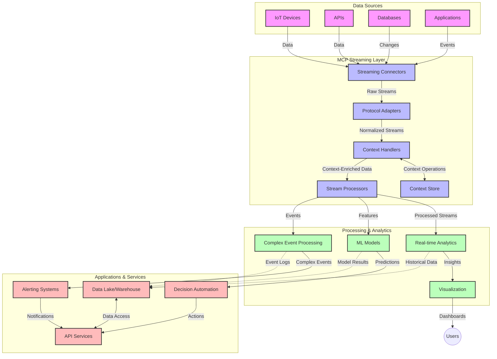

<!--
CO_OP_TRANSLATOR_METADATA:
{
  "original_hash": "68c518dbff8a3b127ed2aa934054c56c",
  "translation_date": "2025-06-11T16:54:47+00:00",
  "source_file": "05-AdvancedTopics/mcp-realtimestreaming/README.md",
  "language_code": "de"
}
-->
# Model Context Protocol für Echtzeit-Daten-Streaming

## Überblick

Echtzeit-Daten-Streaming ist in der heutigen datengetriebenen Welt unverzichtbar geworden, da Unternehmen und Anwendungen sofortigen Zugriff auf Informationen benötigen, um rechtzeitig Entscheidungen treffen zu können. Das Model Context Protocol (MCP) stellt einen bedeutenden Fortschritt bei der Optimierung dieser Echtzeit-Streaming-Prozesse dar, indem es die Effizienz der Datenverarbeitung steigert, die kontextuelle Integrität bewahrt und die Gesamtleistung des Systems verbessert.

Dieses Modul zeigt, wie MCP das Echtzeit-Daten-Streaming durch einen standardisierten Ansatz für das Kontextmanagement über KI-Modelle, Streaming-Plattformen und Anwendungen hinweg transformiert.

## Einführung in Echtzeit-Daten-Streaming

Echtzeit-Daten-Streaming ist ein technologisches Paradigma, das die kontinuierliche Übertragung, Verarbeitung und Analyse von Daten ermöglicht, sobald sie erzeugt werden, sodass Systeme unmittelbar auf neue Informationen reagieren können. Im Gegensatz zur traditionellen Batch-Verarbeitung, die mit statischen Datensätzen arbeitet, verarbeitet Streaming Daten in Bewegung und liefert Erkenntnisse und Aktionen mit minimaler Verzögerung.

### Grundlegende Konzepte des Echtzeit-Daten-Streamings:

- **Kontinuierlicher Datenfluss**: Daten werden als ein fortlaufender, unendlicher Strom von Ereignissen oder Datensätzen verarbeitet.
- **Niedrige Latenz bei der Verarbeitung**: Systeme sind darauf ausgelegt, die Zeit zwischen Datenerzeugung und -verarbeitung zu minimieren.
- **Skalierbarkeit**: Streaming-Architekturen müssen variable Datenmengen und -geschwindigkeiten bewältigen können.
- **Fehlertoleranz**: Systeme müssen ausfallsicher sein, um einen unterbrechungsfreien Datenfluss sicherzustellen.
- **Zustandsbehaftete Verarbeitung**: Das Beibehalten des Kontexts über Ereignisse hinweg ist für eine aussagekräftige Analyse entscheidend.

### Das Model Context Protocol und Echtzeit-Streaming

Das Model Context Protocol (MCP) adressiert mehrere zentrale Herausforderungen in Echtzeit-Streaming-Umgebungen:

1. **Kontextuelle Kontinuität**: MCP standardisiert, wie Kontext über verteilte Streaming-Komponenten hinweg erhalten bleibt, sodass KI-Modelle und Verarbeitungsknoten Zugriff auf relevante historische und umgebungsbezogene Kontextinformationen haben.

2. **Effizientes Zustandsmanagement**: Durch strukturierte Mechanismen zur Kontextübertragung reduziert MCP den Verwaltungsaufwand für Zustände in Streaming-Pipelines.

3. **Interoperabilität**: MCP schafft eine gemeinsame Sprache für den Kontextaustausch zwischen unterschiedlichen Streaming-Technologien und KI-Modellen und ermöglicht so flexiblere und erweiterbare Architekturen.

4. **Streaming-optimierter Kontext**: MCP-Implementierungen können priorisieren, welche Kontextinformationen für Echtzeit-Entscheidungen am relevantesten sind, um sowohl Leistung als auch Genauigkeit zu optimieren.

5. **Adaptive Verarbeitung**: Mit einem effektiven Kontextmanagement durch MCP können Streaming-Systeme ihre Verarbeitung dynamisch an sich ändernde Bedingungen und Muster in den Daten anpassen.

In modernen Anwendungen – von IoT-Sensornetzwerken bis hin zu Finanzhandelsplattformen – ermöglicht die Integration von MCP mit Streaming-Technologien eine intelligentere, kontextbewusste Verarbeitung, die in Echtzeit angemessen auf komplexe und sich entwickelnde Situationen reagieren kann.

## Lernziele

Am Ende dieser Lektion werden Sie in der Lage sein:

- Die Grundlagen des Echtzeit-Daten-Streamings und dessen Herausforderungen zu verstehen
- Erklären zu können, wie das Model Context Protocol (MCP) Echtzeit-Daten-Streaming verbessert
- MCP-basierte Streaming-Lösungen mit populären Frameworks wie Kafka und Pulsar zu implementieren
- Fehlertolerante, leistungsstarke Streaming-Architekturen mit MCP zu entwerfen und bereitzustellen
- MCP-Konzepte auf IoT, Finanzhandel und KI-gesteuerte Analyseanwendungen anzuwenden
- Neue Trends und zukünftige Innovationen in MCP-basierten Streaming-Technologien zu bewerten

### Definition und Bedeutung

Echtzeit-Daten-Streaming umfasst die kontinuierliche Erzeugung, Verarbeitung und Bereitstellung von Daten mit minimaler Latenz. Im Gegensatz zur Batch-Verarbeitung, bei der Daten gesammelt und in Gruppen verarbeitet werden, erfolgt die Verarbeitung von Streaming-Daten schrittweise, sobald sie eintreffen, was sofortige Erkenntnisse und Aktionen ermöglicht.

Wesentliche Merkmale von Echtzeit-Daten-Streaming sind:

- **Niedrige Latenz**: Verarbeitung und Analyse von Daten innerhalb von Millisekunden bis Sekunden
- **Kontinuierlicher Fluss**: Ununterbrochene Datenströme aus verschiedenen Quellen
- **Sofortige Verarbeitung**: Analyse der Daten bei deren Eintreffen statt in Stapeln
- **Ereignisgesteuerte Architektur**: Reaktion auf Ereignisse, sobald sie auftreten

### Herausforderungen im traditionellen Daten-Streaming

Traditionelle Ansätze beim Daten-Streaming stoßen auf mehrere Einschränkungen:

1. **Kontextverlust**: Schwierigkeit, Kontext über verteilte Systeme hinweg aufrechtzuerhalten
2. **Skalierungsprobleme**: Herausforderungen bei der Bewältigung hoher Datenmengen und -geschwindigkeiten
3. **Integrationskomplexität**: Probleme bei der Interoperabilität zwischen verschiedenen Systemen
4. **Latenzmanagement**: Balance zwischen Durchsatz und Verarbeitungszeit
5. **Datenkonsistenz**: Sicherstellung der Genauigkeit und Vollständigkeit der Daten im Stream

## Verständnis des Model Context Protocol (MCP)

### Was ist MCP?

Das Model Context Protocol (MCP) ist ein standardisiertes Kommunikationsprotokoll, das eine effiziente Interaktion zwischen KI-Modellen und Anwendungen ermöglicht. Im Kontext des Echtzeit-Daten-Streamings bietet MCP einen Rahmen für:

- Die Bewahrung des Kontexts entlang der gesamten Datenpipeline
- Die Standardisierung von Datenaustauschformaten
- Die Optimierung der Übertragung großer Datensätze
- Die Verbesserung der Kommunikation zwischen Modell-zu-Modell und Modell-zu-Anwendung

### Kernkomponenten und Architektur

Die MCP-Architektur für Echtzeit-Streaming besteht aus mehreren zentralen Komponenten:

1. **Context Handlers**: Verwalten und erhalten kontextuelle Informationen über die Streaming-Pipeline hinweg
2. **Stream Processors**: Verarbeiten eingehende Datenströme mit kontextbewussten Methoden
3. **Protocol Adapters**: Wandeln zwischen verschiedenen Streaming-Protokollen um und bewahren dabei den Kontext
4. **Context Store**: Speichert und ruft kontextuelle Informationen effizient ab
5. **Streaming Connectors**: Stellen Verbindungen zu verschiedenen Streaming-Plattformen her (Kafka, Pulsar, Kinesis usw.)



### Wie MCP die Echtzeit-Datenverarbeitung verbessert

MCP begegnet den Herausforderungen traditioneller Streaming-Systeme durch:

- **Kontextuelle Integrität**: Aufrechterhaltung der Beziehungen zwischen Datenpunkten über die gesamte Pipeline hinweg
- **Optimierte Übertragung**: Verringerung von Redundanzen im Datenaustausch durch intelligentes Kontextmanagement
- **Standardisierte Schnittstellen**: Bereitstellung konsistenter APIs für Streaming-Komponenten
- **Reduzierte Latenz**: Minimierung des Verarbeitungsaufwands durch effizientes Kontexthandling
- **Erhöhte Skalierbarkeit**: Unterstützung horizontaler Skalierung bei gleichzeitiger Kontextbewahrung

## Integration und Implementierung

Echtzeit-Daten-Streaming-Systeme erfordern sorgfältiges Architekturdesign und Implementierung, um sowohl Leistung als auch kontextuelle Integrität zu gewährleisten. Das Model Context Protocol bietet einen standardisierten Ansatz zur Integration von KI-Modellen und Streaming-Technologien und ermöglicht so anspruchsvollere, kontextbewusste Verarbeitungspipelines.

### Überblick über die MCP-Integration in Streaming-Architekturen

Die Implementierung von MCP in Echtzeit-Streaming-Umgebungen erfordert mehrere wichtige Überlegungen:

1. **Kontext-Serialisierung und Transport**: MCP stellt effiziente Mechanismen zur Kodierung kontextueller Informationen in Streaming-Datenpaketen bereit, sodass wesentlicher Kontext die Daten während der gesamten Verarbeitung begleitet. Dies umfasst standardisierte Serialisierungsformate, die für den Streaming-Transport optimiert sind.

2. **Zustandsbehaftete Stream-Verarbeitung**: MCP ermöglicht intelligentere zustandsbehaftete Verarbeitung, indem eine konsistente Kontextdarstellung über Verarbeitungsknoten hinweg aufrechterhalten wird. Dies ist besonders wertvoll in verteilten Streaming-Architekturen, in denen das Zustandsmanagement traditionell schwierig ist.

3. **Event-Time vs. Processing-Time**: MCP-Implementierungen müssen die gängige Herausforderung adressieren, zwischen dem Zeitpunkt des Ereignisses und dem Zeitpunkt der Verarbeitung zu unterscheiden. Das Protokoll kann temporalen Kontext integrieren, der die Event-Time-Semantik bewahrt.

4. **Backpressure-Management**: Durch die Standardisierung des Kontexthandlings hilft MCP, Backpressure in Streaming-Systemen zu steuern, indem Komponenten ihre Verarbeitungskapazitäten kommunizieren und den Datenfluss entsprechend anpassen können.

5. **Kontext-Windowing und Aggregation**: MCP erleichtert komplexere Fensteroperationen, indem es strukturierte Darstellungen zeitlicher und relationaler Kontexte bereitstellt, die bedeutungsvollere Aggregationen über Ereignisströme ermöglichen.

6. **Exactly-Once-Verarbeitung**: In Streaming-Systemen, die Exactly-Once-Semantik erfordern, kann MCP Verarbeitungsmetadaten einbinden, um den Verarbeitungsstatus über verteilte Komponenten hinweg zu verfolgen und zu überprüfen.

Die Implementierung von MCP über verschiedene Streaming-Technologien hinweg schafft einen einheitlichen Ansatz für das Kontextmanagement, reduziert den Bedarf an maßgeschneidertem Integrationscode und verbessert die Fähigkeit des Systems, bedeutungsvollen Kontext während des Datenflusses durch die Pipeline zu bewahren.

### MCP in verschiedenen Data-Streaming-Frameworks

MCP kann in populäre Streaming-Frameworks integriert werden, darunter:

#### Apache Kafka Integration

```python
from mcp_streaming import MCPKafkaConnector

# Initialize MCP Kafka connector
connector = MCPKafkaConnector(
    bootstrap_servers='localhost:9092',
    context_preservation=True
)

# Create a context-aware consumer
consumer = connector.create_consumer('input-topic')

# Process streaming data with context
for message in consumer:
    context = message.get_context()
    data = message.get_value()
    
    # Process with context awareness
    result = process_with_context(data, context)
    
    # Produce output with preserved context
    connector.produce('output-topic', result, context=context)
```

#### Apache Pulsar Implementierung

```python
from mcp_streaming import MCPPulsarClient

# Initialize MCP Pulsar client
client = MCPPulsarClient('pulsar://localhost:6650')

# Subscribe with context awareness
consumer = client.subscribe('input-topic', 'subscription-name', 
                           context_enabled=True)

# Process messages with context preservation
while True:
    message = consumer.receive()
    context = message.get_context()
    
    # Process with context
    result = process_with_context(message.data(), context)
    
    # Acknowledge the message
    consumer.acknowledge(message)
    
    # Send result with preserved context
    producer = client.create_producer('output-topic')
    producer.send(result, context=context)
```

### Best Practices für die Bereitstellung

Bei der Implementierung von MCP für Echtzeit-Streaming sollten Sie Folgendes beachten:

1. **Design für Fehlertoleranz**:
   - Implementieren Sie eine ordnungsgemäße Fehlerbehandlung
   - Verwenden Sie Dead-Letter-Queues für fehlgeschlagene Nachrichten
   - Entwerfen Sie idempotente Prozessoren

2. **Optimierung der Leistung**:
   - Konfigurieren Sie geeignete Puffergrößen
   - Nutzen Sie Batching, wo sinnvoll
   - Implementieren Sie Backpressure-Mechanismen

3. **Überwachung und Beobachtung**:
   - Verfolgen Sie Metriken zur Stream-Verarbeitung
   - Überwachen Sie die Kontextweitergabe
   - Richten Sie Alarme für Anomalien ein

4. **Sicherung Ihrer Streams**:
   - Verschlüsseln Sie sensible Daten
   - Verwenden Sie Authentifizierung und Autorisierung
   - Setzen Sie angemessene Zugriffskontrollen ein

### MCP in IoT und Edge Computing

MCP verbessert das IoT-Streaming durch:

- Erhalt des Geräte-Kontexts über die gesamte Verarbeitungspipeline hinweg
- Ermöglichen eines effizienten Edge-to-Cloud-Datenstreamings
- Unterstützung von Echtzeit-Analysen auf IoT-Datenströmen
- Erleichterung der Geräte-zu-Geräte-Kommunikation mit Kontext

Beispiel: Sensornetzwerke für Smart Cities  
```
Sensors → Edge Gateways → MCP Stream Processors → Real-time Analytics → Automated Responses
```

### Rolle bei Finanztransaktionen und Hochfrequenzhandel

MCP bietet erhebliche Vorteile für das Finanzdaten-Streaming:

- Ultra-niedrige Latenz bei Handelsentscheidungen
- Erhalt des Transaktionskontexts während der gesamten Verarbeitung
- Unterstützung komplexer Ereignisverarbeitung mit kontextuellem Bewusstsein
- Sicherstellung der Datenkonsistenz in verteilten Handelssystemen

### Verbesserung KI-gesteuerter Datenanalysen

MCP eröffnet neue Möglichkeiten für Streaming-Analysen:

- Echtzeit-Training und Inferenz von Modellen
- Kontinuierliches Lernen aus Streaming-Daten
- Kontextbewusste Merkmalsextraktion
- Multi-Modell-Inferenzpipelines mit erhaltenem Kontext

## Zukunftstrends und Innovationen

### Entwicklung von MCP in Echtzeit-Umgebungen

Für die Zukunft erwarten wir, dass MCP folgende Bereiche adressiert:

- **Integration von Quantencomputing**: Vorbereitung auf quantenbasierte Streaming-Systeme
- **Edge-native Verarbeitung**: Verlagerung kontextbewusster Verarbeitung auf Edge-Geräte
- **Autonomes Stream-Management**: Selbstoptimierende Streaming-Pipelines
- **Föderiertes Streaming**: Verteilte Verarbeitung bei gleichzeitiger Wahrung der Privatsphäre

### Potenzielle technologische Fortschritte

Aufkommende Technologien, die die Zukunft von MCP-Streaming prägen werden:

1. **KI-optimierte Streaming-Protokolle**: Speziell für KI-Workloads entwickelte Protokolle
2. **Neuromorphe Computerintegration**: Gehirninspirierte Rechnerarchitekturen für Stream-Verarbeitung
3. **Serverloses Streaming**: Ereignisgesteuertes, skalierbares Streaming ohne Infrastrukturmanagement
4. **Verteilte Kontextspeicher**: Global verteiltes, dennoch hochkonsistentes Kontextmanagement

## Praktische Übungen

### Übung 1: Einrichtung einer grundlegenden MCP-Streaming-Pipeline

In dieser Übung lernen Sie:

- Die Konfiguration einer grundlegenden MCP-Streaming-Umgebung
- Die Implementierung von Context Handlers für die Stream-Verarbeitung
- Das Testen und Validieren der Kontextbewahrung

### Übung 2: Erstellung eines Echtzeit-Analyse-Dashboards

Erstellen Sie eine vollständige Anwendung, die:

- Streaming-Daten mit MCP aufnimmt
- Den Stream unter Beibehaltung des Kontexts verarbeitet
- Ergebnisse in Echtzeit visualisiert

### Übung 3: Implementierung komplexer Ereignisverarbeitung mit MCP

Fortgeschrittene Übung, die umfasst:

- Mustererkennung in Streams
- Kontextuelle Korrelation über mehrere Streams hinweg
- Erzeugung komplexer Ereignisse mit erhaltenem Kontext

## Zusätzliche Ressourcen

- [Model Context Protocol Specification](https://github.com/microsoft/model-context-protocol) - Offizielle MCP-Spezifikation und Dokumentation
- [Apache Kafka Documentation](https://kafka.apache.org/documentation/) - Informationen zu Kafka für Stream-Verarbeitung
- [Apache Pulsar](https://pulsar.apache.org/) - Einheitliche Messaging- und Streaming-Plattform
- [Streaming Systems: The What, Where, When, and How of Large-Scale Data Processing](https://www.oreilly.com/library/view/streaming-systems/9781491983867/) - Umfassendes Buch zu Streaming-Architekturen
- [Microsoft Azure Event Hubs](https://learn.microsoft.com/en-us/azure/event-hubs/event-hubs-about) - Verwalteter Event-Streaming-Dienst
- [MLflow Documentation](https://mlflow.org/docs/latest/index.html) - Für ML-Modell-Tracking und -Bereitstellung
- [Real-Time Analytics with Apache Storm](https://storm.apache.org/releases/current/index.html) - Verarbeitungs-Framework für Echtzeitberechnungen
- [Flink ML](https://nightlies.apache.org/flink/flink-ml-docs-master/) - Machine-Learning-Bibliothek für Apache Flink
- [LangChain Documentation](https://python.langchain.com/docs/get_started/introduction) - Anwendungen mit LLMs entwickeln

## Lernergebnisse

Nach Abschluss dieses Moduls sind Sie in der Lage:

- Die Grundlagen des Echtzeit-Daten-Streamings und dessen Herausforderungen zu verstehen
- Zu erklären, wie das Model Context Protocol (MCP) Echtzeit-Daten-Streaming verbessert
- MCP-basierte Streaming-Lösungen mit populären Frameworks wie Kafka und Pulsar zu implementieren
- Fehlertolerante, leistungsstarke Streaming-Architekturen mit MCP zu entwerfen und bereitzustellen
- MCP-Konzepte auf IoT, Finanzhandel und KI-gesteuerte Analyseanwendungen anzuwenden
- Neue Trends und zukünftige Innovationen in MCP-basierten Streaming-Technologien zu bewerten

## Was kommt als Nächstes

- [6. Community Contributions](../../06-CommunityContributions/README.md)

**Haftungsausschluss**:  
Dieses Dokument wurde mit dem KI-Übersetzungsdienst [Co-op Translator](https://github.com/Azure/co-op-translator) übersetzt. Obwohl wir uns um Genauigkeit bemühen, beachten Sie bitte, dass automatisierte Übersetzungen Fehler oder Ungenauigkeiten enthalten können. Das Originaldokument in seiner Ursprungssprache ist als maßgebliche Quelle zu betrachten. Für wichtige Informationen wird eine professionelle menschliche Übersetzung empfohlen. Wir übernehmen keine Haftung für Missverständnisse oder Fehlinterpretationen, die durch die Nutzung dieser Übersetzung entstehen.