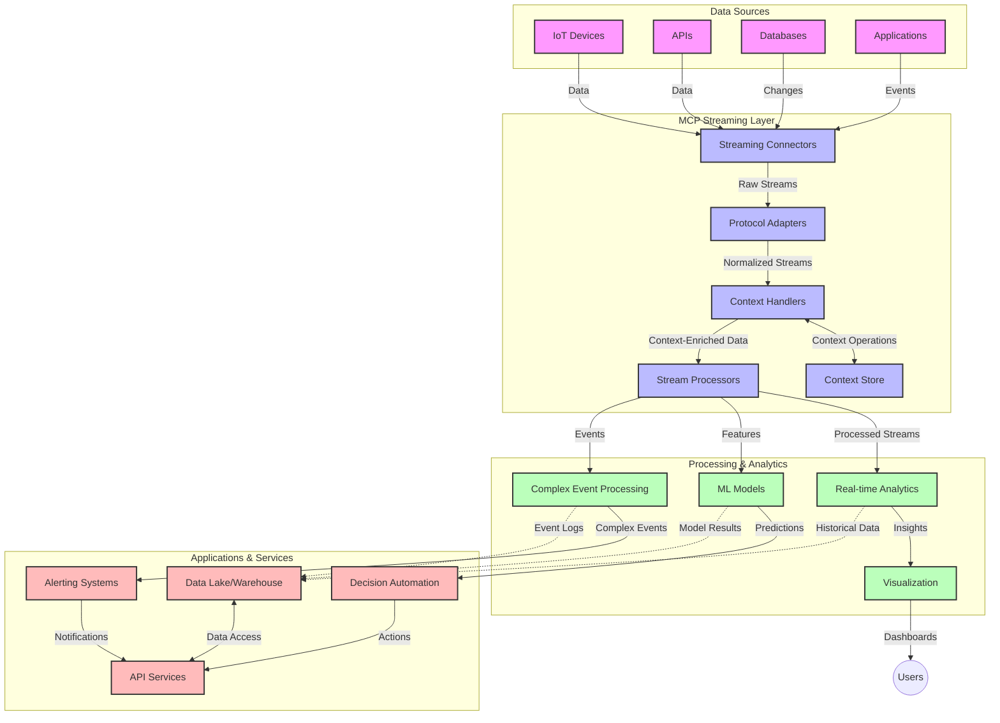

<!--
CO_OP_TRANSLATOR_METADATA:
{
  "original_hash": "195f7287638b77a549acadd96c8f981c",
  "translation_date": "2025-07-14T01:25:27+00:00",
  "source_file": "05-AdvancedTopics/mcp-realtimestreaming/README.md",
  "language_code": "de"
}
-->
# Model Context Protocol für Echtzeit-Daten-Streaming

## Überblick

Echtzeit-Daten-Streaming ist in der heutigen datengetriebenen Welt unverzichtbar geworden, da Unternehmen und Anwendungen sofortigen Zugriff auf Informationen benötigen, um zeitnahe Entscheidungen treffen zu können. Das Model Context Protocol (MCP) stellt einen bedeutenden Fortschritt bei der Optimierung dieser Echtzeit-Streaming-Prozesse dar, indem es die Effizienz der Datenverarbeitung verbessert, die kontextuelle Integrität wahrt und die Gesamtleistung des Systems steigert.

Dieses Modul zeigt, wie MCP das Echtzeit-Daten-Streaming durch einen standardisierten Ansatz für das Kontextmanagement über KI-Modelle, Streaming-Plattformen und Anwendungen hinweg revolutioniert.

## Einführung in Echtzeit-Daten-Streaming

Echtzeit-Daten-Streaming ist ein technologisches Paradigma, das die kontinuierliche Übertragung, Verarbeitung und Analyse von Daten ermöglicht, während diese erzeugt werden. So können Systeme unmittelbar auf neue Informationen reagieren. Im Gegensatz zur traditionellen Batch-Verarbeitung, die mit statischen Datensätzen arbeitet, verarbeitet Streaming Daten in Bewegung und liefert Erkenntnisse und Aktionen mit minimaler Verzögerung.

### Kernkonzepte des Echtzeit-Daten-Streamings:

- **Kontinuierlicher Datenfluss**: Daten werden als ununterbrochener, endloser Strom von Ereignissen oder Datensätzen verarbeitet.
- **Niedrige Latenz**: Systeme sind darauf ausgelegt, die Zeit zwischen Datenerzeugung und -verarbeitung zu minimieren.
- **Skalierbarkeit**: Streaming-Architekturen müssen variable Datenmengen und -geschwindigkeiten bewältigen.
- **Fehlertoleranz**: Systeme müssen ausfallsicher sein, um einen unterbrechungsfreien Datenfluss zu gewährleisten.
- **Zustandsbehaftete Verarbeitung**: Die Aufrechterhaltung des Kontexts über Ereignisse hinweg ist entscheidend für aussagekräftige Analysen.

### Das Model Context Protocol und Echtzeit-Streaming

Das Model Context Protocol (MCP) adressiert mehrere zentrale Herausforderungen in Echtzeit-Streaming-Umgebungen:

1. **Kontextuelle Kontinuität**: MCP standardisiert, wie Kontext über verteilte Streaming-Komponenten hinweg erhalten bleibt, sodass KI-Modelle und Verarbeitungsknoten Zugriff auf relevante historische und umgebungsbezogene Kontextinformationen haben.

2. **Effizientes Zustandsmanagement**: Durch strukturierte Mechanismen zur Kontextübertragung reduziert MCP den Verwaltungsaufwand für Zustände in Streaming-Pipelines.

3. **Interoperabilität**: MCP schafft eine gemeinsame Sprache für den Kontextaustausch zwischen verschiedenen Streaming-Technologien und KI-Modellen, was flexiblere und erweiterbare Architekturen ermöglicht.

4. **Streaming-optimierter Kontext**: MCP-Implementierungen können priorisieren, welche Kontextelemente für Echtzeit-Entscheidungen am relevantesten sind, und so Leistung und Genauigkeit optimieren.

5. **Adaptive Verarbeitung**: Mit effektivem Kontextmanagement durch MCP können Streaming-Systeme ihre Verarbeitung dynamisch an sich ändernde Bedingungen und Muster in den Daten anpassen.

In modernen Anwendungen, von IoT-Sensornetzwerken bis hin zu Finanzhandelsplattformen, ermöglicht die Integration von MCP mit Streaming-Technologien eine intelligentere, kontextbewusste Verarbeitung, die in Echtzeit angemessen auf komplexe, sich entwickelnde Situationen reagieren kann.

## Lernziele

Am Ende dieser Lektion werden Sie in der Lage sein:

- Die Grundlagen des Echtzeit-Daten-Streamings und dessen Herausforderungen zu verstehen
- Zu erklären, wie das Model Context Protocol (MCP) das Echtzeit-Daten-Streaming verbessert
- MCP-basierte Streaming-Lösungen mit populären Frameworks wie Kafka und Pulsar zu implementieren
- Fehlertolerante, leistungsstarke Streaming-Architekturen mit MCP zu entwerfen und bereitzustellen
- MCP-Konzepte auf IoT-, Finanzhandels- und KI-gestützte Analyseanwendungen anzuwenden
- Neue Trends und zukünftige Innovationen in MCP-basierten Streaming-Technologien zu bewerten

### Definition und Bedeutung

Echtzeit-Daten-Streaming umfasst die kontinuierliche Erzeugung, Verarbeitung und Bereitstellung von Daten mit minimaler Verzögerung. Im Gegensatz zur Batch-Verarbeitung, bei der Daten gesammelt und in Gruppen verarbeitet werden, erfolgt die Verarbeitung von Streaming-Daten schrittweise, sobald sie eintreffen, was sofortige Erkenntnisse und Aktionen ermöglicht.

Wesentliche Merkmale des Echtzeit-Daten-Streamings sind:

- **Niedrige Latenz**: Verarbeitung und Analyse von Daten innerhalb von Millisekunden bis Sekunden
- **Kontinuierlicher Fluss**: Ununterbrochene Datenströme aus verschiedenen Quellen
- **Sofortige Verarbeitung**: Analyse der Daten bei ihrem Eintreffen statt in Batches
- **Ereignisgesteuerte Architektur**: Reaktion auf Ereignisse in dem Moment, in dem sie auftreten

### Herausforderungen im traditionellen Daten-Streaming

Traditionelle Ansätze im Daten-Streaming stoßen auf mehrere Einschränkungen:

1. **Kontextverlust**: Schwierigkeit, Kontext über verteilte Systeme hinweg aufrechtzuerhalten
2. **Skalierungsprobleme**: Herausforderungen bei der Bewältigung großer Datenmengen und hoher Geschwindigkeit
3. **Integrationskomplexität**: Probleme bei der Interoperabilität zwischen verschiedenen Systemen
4. **Latenzmanagement**: Balance zwischen Durchsatz und Verarbeitungszeit
5. **Datenkonsistenz**: Sicherstellung von Genauigkeit und Vollständigkeit der Daten im Stream

## Verständnis des Model Context Protocol (MCP)

### Was ist MCP?

Das Model Context Protocol (MCP) ist ein standardisiertes Kommunikationsprotokoll, das eine effiziente Interaktion zwischen KI-Modellen und Anwendungen ermöglicht. Im Kontext des Echtzeit-Daten-Streamings bietet MCP einen Rahmen für:

- Die Bewahrung des Kontexts entlang der gesamten Datenpipeline
- Die Standardisierung von Datenaustauschformaten
- Die Optimierung der Übertragung großer Datensätze
- Die Verbesserung der Kommunikation zwischen Modellen und zwischen Modellen und Anwendungen

### Kernkomponenten und Architektur

Die MCP-Architektur für Echtzeit-Streaming besteht aus mehreren Schlüsselkomponenten:

1. **Context Handlers**: Verwalten und erhalten kontextuelle Informationen über die Streaming-Pipeline hinweg
2. **Stream Processors**: Verarbeiten eingehende Datenströme mit kontextbewussten Techniken
3. **Protocol Adapters**: Wandeln zwischen verschiedenen Streaming-Protokollen um und bewahren dabei den Kontext
4. **Context Store**: Speichert und ruft kontextuelle Informationen effizient ab
5. **Streaming Connectors**: Stellen Verbindungen zu verschiedenen Streaming-Plattformen her (Kafka, Pulsar, Kinesis usw.)



### Wie MCP die Echtzeit-Datenverarbeitung verbessert

MCP begegnet traditionellen Streaming-Herausforderungen durch:

- **Kontextuelle Integrität**: Erhaltung der Beziehungen zwischen Datenpunkten über die gesamte Pipeline hinweg
- **Optimierte Übertragung**: Reduzierung von Redundanzen im Datenaustausch durch intelligentes Kontextmanagement
- **Standardisierte Schnittstellen**: Bereitstellung konsistenter APIs für Streaming-Komponenten
- **Reduzierte Latenz**: Minimierung des Verarbeitungsaufwands durch effizientes Kontexthandling
- **Verbesserte Skalierbarkeit**: Unterstützung horizontaler Skalierung bei gleichzeitiger Kontextwahrung

## Integration und Implementierung

Echtzeit-Daten-Streaming-Systeme erfordern eine sorgfältige architektonische Gestaltung und Umsetzung, um sowohl Leistung als auch kontextuelle Integrität zu gewährleisten. Das Model Context Protocol bietet einen standardisierten Ansatz zur Integration von KI-Modellen und Streaming-Technologien, der komplexere, kontextbewusste Verarbeitungspipelines ermöglicht.

### Überblick zur MCP-Integration in Streaming-Architekturen

Die Implementierung von MCP in Echtzeit-Streaming-Umgebungen umfasst mehrere wichtige Aspekte:

1. **Kontext-Serialisierung und -Transport**: MCP stellt effiziente Mechanismen zur Kodierung kontextueller Informationen innerhalb von Streaming-Datenpaketen bereit, sodass der wesentliche Kontext die gesamte Verarbeitungspipeline begleitet. Dazu gehören standardisierte Serialisierungsformate, die für den Streaming-Transport optimiert sind.

2. **Zustandsbehaftete Stream-Verarbeitung**: MCP ermöglicht intelligentere zustandsbehaftete Verarbeitung, indem es eine konsistente Kontextdarstellung über Verarbeitungsknoten hinweg sicherstellt. Dies ist besonders wertvoll in verteilten Streaming-Architekturen, in denen Zustandsmanagement traditionell schwierig ist.

3. **Ereigniszeit vs. Verarbeitungszeit**: MCP-Implementierungen in Streaming-Systemen müssen die häufige Herausforderung adressieren, zwischen dem Zeitpunkt des Ereigniseintritts und dem Verarbeitungszeitpunkt zu unterscheiden. Das Protokoll kann temporalen Kontext integrieren, der die Semantik der Ereigniszeit bewahrt.

4. **Backpressure-Management**: Durch die Standardisierung des Kontext-Handling hilft MCP, Backpressure in Streaming-Systemen zu steuern, indem Komponenten ihre Verarbeitungskapazitäten kommunizieren und den Datenfluss entsprechend anpassen können.

5. **Kontextfensterung und Aggregation**: MCP erleichtert komplexere Fensteroperationen, indem es strukturierte Darstellungen von zeitlichen und relationalen Kontexten bereitstellt, was aussagekräftigere Aggregationen über Ereignisströme ermöglicht.

6. **Exactly-Once-Verarbeitung**: In Streaming-Systemen, die genau-einmal-Semantik erfordern, kann MCP Verarbeitungsmetadaten integrieren, um den Verarbeitungsstatus über verteilte Komponenten hinweg zu verfolgen und zu verifizieren.

Die Implementierung von MCP über verschiedene Streaming-Technologien hinweg schafft einen einheitlichen Ansatz für das Kontextmanagement, reduziert den Bedarf an maßgeschneidertem Integrationscode und verbessert die Fähigkeit des Systems, bedeutungsvollen Kontext während des Datenflusses durch die Pipeline zu erhalten.

### MCP in verschiedenen Data-Streaming-Frameworks

Diese Beispiele basieren auf der aktuellen MCP-Spezifikation, die sich auf ein JSON-RPC-basiertes Protokoll mit unterschiedlichen Transportmechanismen konzentriert. Der Code zeigt, wie benutzerdefinierte Transports implementiert werden können, die Streaming-Plattformen wie Kafka und Pulsar integrieren und gleichzeitig volle Kompatibilität mit dem MCP-Protokoll gewährleisten.

Die Beispiele sollen verdeutlichen, wie Streaming-Plattformen mit MCP verbunden werden können, um Echtzeit-Datenverarbeitung zu ermöglichen und dabei die kontextuelle Bewusstheit zu bewahren, die für MCP zentral ist. Dieser Ansatz stellt sicher, dass die Codebeispiele den aktuellen Stand der MCP-Spezifikation vom Juni 2025 genau widerspiegeln.

MCP kann mit populären Streaming-Frameworks integriert werden, darunter:

#### Apache Kafka Integration

```python
import asyncio
import json
from typing import Dict, Any, Optional
from confluent_kafka import Consumer, Producer, KafkaError
from mcp.client import Client, ClientCapabilities
from mcp.core.message import JsonRpcMessage
from mcp.core.transports import Transport

# Custom transport class to bridge MCP with Kafka
class KafkaMCPTransport(Transport):
    def __init__(self, bootstrap_servers: str, input_topic: str, output_topic: str):
        self.bootstrap_servers = bootstrap_servers
        self.input_topic = input_topic
        self.output_topic = output_topic
        self.producer = Producer({'bootstrap.servers': bootstrap_servers})
        self.consumer = Consumer({
            'bootstrap.servers': bootstrap_servers,
            'group.id': 'mcp-client-group',
            'auto.offset.reset': 'earliest'
        })
        self.message_queue = asyncio.Queue()
        self.running = False
        self.consumer_task = None
        
    async def connect(self):
        """Connect to Kafka and start consuming messages"""
        self.consumer.subscribe([self.input_topic])
        self.running = True
        self.consumer_task = asyncio.create_task(self._consume_messages())
        return self
        
    async def _consume_messages(self):
        """Background task to consume messages from Kafka and queue them for processing"""
        while self.running:
            try:
                msg = self.consumer.poll(1.0)
                if msg is None:
                    await asyncio.sleep(0.1)
                    continue
                
                if msg.error():
                    if msg.error().code() == KafkaError._PARTITION_EOF:
                        continue
                    print(f"Consumer error: {msg.error()}")
                    continue
                
                # Parse the message value as JSON-RPC
                try:
                    message_str = msg.value().decode('utf-8')
                    message_data = json.loads(message_str)
                    mcp_message = JsonRpcMessage.from_dict(message_data)
                    await self.message_queue.put(mcp_message)
                except Exception as e:
                    print(f"Error parsing message: {e}")
            except Exception as e:
                print(f"Error in consumer loop: {e}")
                await asyncio.sleep(1)
    
    async def read(self) -> Optional[JsonRpcMessage]:
        """Read the next message from the queue"""
        try:
            message = await self.message_queue.get()
            return message
        except Exception as e:
            print(f"Error reading message: {e}")
            return None
    
    async def write(self, message: JsonRpcMessage) -> None:
        """Write a message to the Kafka output topic"""
        try:
            message_json = json.dumps(message.to_dict())
            self.producer.produce(
                self.output_topic,
                message_json.encode('utf-8'),
                callback=self._delivery_report
            )
            self.producer.poll(0)  # Trigger callbacks
        except Exception as e:
            print(f"Error writing message: {e}")
    
    def _delivery_report(self, err, msg):
        """Kafka producer delivery callback"""
        if err is not None:
            print(f'Message delivery failed: {err}')
        else:
            print(f'Message delivered to {msg.topic()} [{msg.partition()}]')
    
    async def close(self) -> None:
        """Close the transport"""
        self.running = False
        if self.consumer_task:
            self.consumer_task.cancel()
            try:
                await self.consumer_task
            except asyncio.CancelledError:
                pass
        self.consumer.close()
        self.producer.flush()

# Example usage of the Kafka MCP transport
async def kafka_mcp_example():
    # Create MCP client with Kafka transport
    client = Client(
        {"name": "kafka-mcp-client", "version": "1.0.0"},
        ClientCapabilities({})
    )
    
    # Create and connect the Kafka transport
    transport = KafkaMCPTransport(
        bootstrap_servers="localhost:9092",
        input_topic="mcp-responses",
        output_topic="mcp-requests"
    )
    
    await client.connect(transport)
    
    try:
        # Initialize the MCP session
        await client.initialize()
        
        # Example of executing a tool via MCP
        response = await client.execute_tool(
            "process_data",
            {
                "data": "sample data",
                "metadata": {
                    "source": "sensor-1",
                    "timestamp": "2025-06-12T10:30:00Z"
                }
            }
        )
        
        print(f"Tool execution response: {response}")
        
        # Clean shutdown
        await client.shutdown()
    finally:
        await transport.close()

# Run the example
if __name__ == "__main__":
    asyncio.run(kafka_mcp_example())
```

#### Apache Pulsar Implementierung

```python
import asyncio
import json
import pulsar
from typing import Dict, Any, Optional
from mcp.core.message import JsonRpcMessage
from mcp.core.transports import Transport
from mcp.server import Server, ServerOptions
from mcp.server.tools import Tool, ToolExecutionContext, ToolMetadata

# Create a custom MCP transport that uses Pulsar
class PulsarMCPTransport(Transport):
    def __init__(self, service_url: str, request_topic: str, response_topic: str):
        self.service_url = service_url
        self.request_topic = request_topic
        self.response_topic = response_topic
        self.client = pulsar.Client(service_url)
        self.producer = self.client.create_producer(response_topic)
        self.consumer = self.client.subscribe(
            request_topic,
            "mcp-server-subscription",
            consumer_type=pulsar.ConsumerType.Shared
        )
        self.message_queue = asyncio.Queue()
        self.running = False
        self.consumer_task = None
    
    async def connect(self):
        """Connect to Pulsar and start consuming messages"""
        self.running = True
        self.consumer_task = asyncio.create_task(self._consume_messages())
        return self
    
    async def _consume_messages(self):
        """Background task to consume messages from Pulsar and queue them for processing"""
        while self.running:
            try:
                # Non-blocking receive with timeout
                msg = self.consumer.receive(timeout_millis=500)
                
                # Process the message
                try:
                    message_str = msg.data().decode('utf-8')
                    message_data = json.loads(message_str)
                    mcp_message = JsonRpcMessage.from_dict(message_data)
                    await self.message_queue.put(mcp_message)
                    
                    # Acknowledge the message
                    self.consumer.acknowledge(msg)
                except Exception as e:
                    print(f"Error processing message: {e}")
                    # Negative acknowledge if there was an error
                    self.consumer.negative_acknowledge(msg)
            except Exception as e:
                # Handle timeout or other exceptions
                await asyncio.sleep(0.1)
    
    async def read(self) -> Optional[JsonRpcMessage]:
        """Read the next message from the queue"""
        try:
            message = await self.message_queue.get()
            return message
        except Exception as e:
            print(f"Error reading message: {e}")
            return None
    
    async def write(self, message: JsonRpcMessage) -> None:
        """Write a message to the Pulsar output topic"""
        try:
            message_json = json.dumps(message.to_dict())
            self.producer.send(message_json.encode('utf-8'))
        except Exception as e:
            print(f"Error writing message: {e}")
    
    async def close(self) -> None:
        """Close the transport"""
        self.running = False
        if self.consumer_task:
            self.consumer_task.cancel()
            try:
                await self.consumer_task
            except asyncio.CancelledError:
                pass
        self.consumer.close()
        self.producer.close()
        self.client.close()

# Define a sample MCP tool that processes streaming data
@Tool(
    name="process_streaming_data",
    description="Process streaming data with context preservation",
    metadata=ToolMetadata(
        required_capabilities=["streaming"]
    )
)
async def process_streaming_data(
    ctx: ToolExecutionContext,
    data: str,
    source: str,
    priority: str = "medium"
) -> Dict[str, Any]:
    """
    Process streaming data while preserving context
    
    Args:
        ctx: Tool execution context
        data: The data to process
        source: The source of the data
        priority: Priority level (low, medium, high)
        
    Returns:
        Dict containing processed results and context information
    """
    # Example processing that leverages MCP context
    print(f"Processing data from {source} with priority {priority}")
    
    # Access conversation context from MCP
    conversation_id = ctx.conversation_id if hasattr(ctx, 'conversation_id') else "unknown"
    
    # Return results with enhanced context
    return {
        "processed_data": f"Processed: {data}",
        "context": {
            "conversation_id": conversation_id,
            "source": source,
            "priority": priority,
            "processing_timestamp": ctx.get_current_time_iso()
        }
    }

# Example MCP server implementation using Pulsar transport
async def run_mcp_server_with_pulsar():
    # Create MCP server
    server = Server(
        {"name": "pulsar-mcp-server", "version": "1.0.0"},
        ServerOptions(
            capabilities={"streaming": True}
        )
    )
    
    # Register our tool
    server.register_tool(process_streaming_data)
    
    # Create and connect Pulsar transport
    transport = PulsarMCPTransport(
        service_url="pulsar://localhost:6650",
        request_topic="mcp-requests",
        response_topic="mcp-responses"
    )
    
    try:
        # Start the server with the Pulsar transport
        await server.run(transport)
    finally:
        await transport.close()

# Run the server
if __name__ == "__main__":
    asyncio.run(run_mcp_server_with_pulsar())
```

### Best Practices für die Bereitstellung

Bei der Implementierung von MCP für Echtzeit-Streaming:

1. **Auf Fehlertoleranz auslegen**:
   - Fehlerbehandlung korrekt implementieren
   - Dead-Letter-Queues für fehlgeschlagene Nachrichten verwenden
   - Idempotente Prozessoren entwerfen

2. **Für Leistung optimieren**:
   - Geeignete Puffergrößen konfigurieren
   - Batching dort einsetzen, wo es sinnvoll ist
   - Backpressure-Mechanismen implementieren

3. **Überwachen und beobachten**:
   - Metriken der Stream-Verarbeitung verfolgen
   - Kontextweitergabe überwachen
   - Alarme für Anomalien einrichten

4. **Streams absichern**:
   - Verschlüsselung für sensible Daten implementieren
   - Authentifizierung und Autorisierung nutzen
   - Angemessene Zugriffskontrollen anwenden

### MCP in IoT und Edge Computing

MCP verbessert das IoT-Streaming durch:

- Erhalt des Geräte-Kontexts über die Verarbeitungspipeline hinweg
- Ermöglichung effizienter Edge-to-Cloud-Datenströme
- Unterstützung von Echtzeit-Analysen auf IoT-Datenströmen
- Erleichterung der Geräte-zu-Geräte-Kommunikation mit Kontext

Beispiel: Sensornetzwerke in Smart Cities  
```
Sensors → Edge Gateways → MCP Stream Processors → Real-time Analytics → Automated Responses
```

### Rolle bei Finanztransaktionen und Hochfrequenzhandel

MCP bietet erhebliche Vorteile für das Finanzdaten-Streaming:

- Ultra-niedrige Latenz bei Handelsentscheidungen
- Erhalt des Transaktionskontexts während der gesamten Verarbeitung
- Unterstützung komplexer Ereignisverarbeitung mit kontextuellem Bewusstsein
- Sicherstellung der Datenkonsistenz in verteilten Handelssystemen

### Verbesserung KI-gesteuerter Datenanalysen

MCP eröffnet neue Möglichkeiten für Streaming-Analysen:

- Echtzeit-Modelltraining und -Inference
- Kontinuierliches Lernen aus Streaming-Daten
- Kontextbewusste Merkmalsextraktion
- Multi-Modell-Inferenz-Pipelines mit erhaltenem Kontext

## Zukünftige Trends und Innovationen

### Entwicklung von MCP in Echtzeit-Umgebungen

Mit Blick auf die Zukunft erwarten wir, dass MCP sich weiterentwickelt, um folgende Aspekte zu adressieren:

- **Integration von Quantencomputing**: Vorbereitung auf quantenbasierte Streaming-Systeme
- **Edge-native Verarbeitung**: Verlagerung kontextbewusster Verarbeitung auf Edge-Geräte
- **Autonomes Stream-Management**: Selbstoptimierende Streaming-Pipelines
- **Föderiertes Streaming**: Verteilte Verarbeitung bei Wahrung der Privatsphäre

### Potenzielle technologische Fortschritte

Neue Technologien, die die Zukunft des MCP-Streamings prägen werden:

1. **KI-optimierte Streaming-Protokolle**: Speziell für KI-Workloads entwickelte Protokolle
2. **Neuromorphe Computing-Integration**: Gehirninspirierte Verarbeitung für Stream-Analysen
3. **Serverloses Streaming**: Ereignisgesteuertes, skalierbares Streaming ohne Infrastrukturverwaltung
4. **Verteilte Kontextspeicher**: Global verteiltes, aber hochkonsistentes Kontextmanagement

## Praktische Übungen

### Übung 1: Einrichtung einer einfachen MCP-Streaming-Pipeline

In dieser Übung lernen Sie:

- Eine grundlegende MCP-Streaming-Umgebung zu konfigurieren
- Context Handlers für die Stream-Verarbeitung zu implementieren
- Die Kontextbewahrung zu testen und zu validieren

### Übung 2: Aufbau eines Echtzeit-Analyse-Dashboards

Erstellen Sie eine vollständige Anwendung, die:

- Streaming-Daten mit MCP aufnimmt
- Den Stream unter Erhalt des Kontexts verarbeitet
- Ergebnisse in Echtzeit visualisiert

### Übung 3: Implementierung komplexer Ereignisverarbeitung mit MCP

Fortgeschrittene Übung zu:

- Mustererkennung in Streams
- Kontextuelle Korrelation über mehrere Streams hinweg
- Erzeugung komplexer Ereignisse mit erhaltenem Kontext

## Zusätzliche Ressourcen

- [Model Context Protocol Specification](https://github.com/modelcontextprotocol) – Offizielle MCP-Spezifikation und Dokumentation
- [Apache Kafka Documentation](https://kafka.apache.org/documentation/) – Informationen zu Kafka für Stream-Verarbeitung
- [Apache Pulsar](https://pulsar.apache.org/) – Einheitliche Messaging- und Streaming-Plattform
- [Streaming Systems: The What, Where, When, and How of Large-Scale Data Processing](https://www.oreilly.com/library/view/streaming-systems/9781491983867/) – Umfassendes Buch zu Streaming-Architekturen
- [Microsoft Azure Event Hubs](https://learn.microsoft.com/azure/event-hubs/event-hubs-about) – Verwalteter Event-Streaming-Dienst
- [MLflow Documentation](https://mlflow.org/docs/latest/index.html) – Für ML-Modell-Tracking und Deployment
- [Real-Time Analytics with Apache Storm](https://storm.apache.org/releases/current/index.html) – Verarbeitungs-Framework für Echtzeit-Berechnungen
- [Flink ML](https://nightlies.apache.org/flink/flink-ml-docs-master/) – Machine-Learning-Bibliothek für Apache Flink
- [LangChain Documentation](https://python.langchain.com/docs/get_started/introduction) – Entwicklung von Anwendungen mit LLMs

## Lernergebnisse

Nach Abschluss dieses Moduls werden Sie in der Lage sein:

- Die Grundlagen des Echtzeit-Daten-Streamings und dessen Herausforderungen zu verstehen
- Zu erklären, wie das Model Context Protocol (MCP) das Echtzeit-Daten-Streaming verbessert
- MCP-basierte Streaming-Lösungen mit populären Frameworks wie Kafka und Pulsar zu implementieren
- Fehlertolerante, leistungsstarke Streaming-Architekturen mit MCP zu entwerfen und bereitzustellen
- MCP-Konzepte auf IoT-, Finanzhandels- und KI-gestützte Analyseanwendungen anzuwenden
- Neue Trends und zukünftige Innovationen in MCP-basierten Streaming-Technologien zu bewerten

## Was kommt als Nächstes

- [5.11 Realtime Search](../mcp-realtimesearch/README.md)

**Haftungsausschluss**:  
Dieses Dokument wurde mit dem KI-Übersetzungsdienst [Co-op Translator](https://github.com/Azure/co-op-translator) übersetzt. Obwohl wir uns um Genauigkeit bemühen, beachten Sie bitte, dass automatisierte Übersetzungen Fehler oder Ungenauigkeiten enthalten können. Das Originaldokument in seiner Ursprungssprache gilt als maßgebliche Quelle. Für wichtige Informationen wird eine professionelle menschliche Übersetzung empfohlen. Wir übernehmen keine Haftung für Missverständnisse oder Fehlinterpretationen, die aus der Nutzung dieser Übersetzung entstehen.