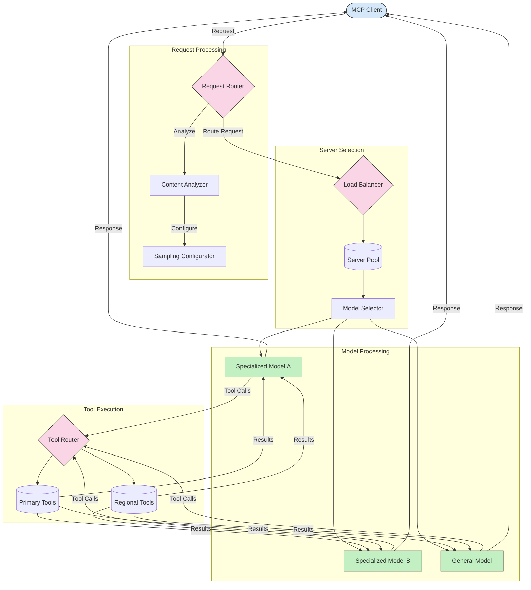

<!--
CO_OP_TRANSLATOR_METADATA:
{
  "original_hash": "2f1b473818b5a6cc9a9bbf777fffa6d4",
  "translation_date": "2025-07-14T21:44:03+00:00",
  "source_file": "05-AdvancedTopics/mcp-routing/README.md",
  "language_code": "de"
}
-->
## Sampling- und Routing-Architektur im MCP

Sampling ist ein entscheidender Bestandteil des Model Context Protocol (MCP), der eine effiziente Verarbeitung und Weiterleitung von Anfragen ermöglicht. Dabei werden eingehende Anfragen analysiert, um basierend auf verschiedenen Kriterien wie Inhaltstyp, Benutzerkontext und Systemauslastung das am besten geeignete Modell oder den passenden Dienst zu bestimmen.

Sampling und Routing können kombiniert werden, um eine robuste Architektur zu schaffen, die die Ressourcennutzung optimiert und eine hohe Verfügbarkeit sicherstellt. Der Sampling-Prozess dient zur Klassifizierung der Anfragen, während das Routing sie an die entsprechenden Modelle oder Dienste weiterleitet.

Das folgende Diagramm zeigt, wie Sampling und Routing in einer umfassenden MCP-Architektur zusammenwirken:

## Was kommt als Nächstes

- [5.6 Sampling](../mcp-sampling/README.md)

**Haftungsausschluss**:  
Dieses Dokument wurde mit dem KI-Übersetzungsdienst [Co-op Translator](https://github.com/Azure/co-op-translator) übersetzt. Obwohl wir uns um Genauigkeit bemühen, beachten Sie bitte, dass automatisierte Übersetzungen Fehler oder Ungenauigkeiten enthalten können. Das Originaldokument in seiner Ursprungssprache ist als maßgebliche Quelle zu betrachten. Für wichtige Informationen wird eine professionelle menschliche Übersetzung empfohlen. Wir übernehmen keine Haftung für Missverständnisse oder Fehlinterpretationen, die aus der Nutzung dieser Übersetzung entstehen.