<!--
CO_OP_TRANSLATOR_METADATA:
{
  "original_hash": "6e562d7e5a77c8982da4aa8f762ad1d8",
  "translation_date": "2025-07-14T02:47:37+00:00",
  "source_file": "05-AdvancedTopics/mcp-security-entra/README.md",
  "language_code": "de"
}
-->
# Absicherung von KI-Workflows: Entra ID-Authentifizierung für Model Context Protocol-Server

## Einführung  
Die Absicherung Ihres Model Context Protocol (MCP)-Servers ist genauso wichtig wie das Abschließen der Haustür. Ein offener MCP-Server setzt Ihre Werkzeuge und Daten unbefugtem Zugriff aus, was zu Sicherheitsverletzungen führen kann. Microsoft Entra ID bietet eine leistungsstarke cloudbasierte Lösung für Identitäts- und Zugriffsmanagement, die sicherstellt, dass nur autorisierte Benutzer und Anwendungen mit Ihrem MCP-Server interagieren können. In diesem Abschnitt erfahren Sie, wie Sie Ihre KI-Workflows mit Entra ID-Authentifizierung schützen.

## Lernziele  
Am Ende dieses Abschnitts können Sie:

- Die Bedeutung der Absicherung von MCP-Servern verstehen.  
- Die Grundlagen von Microsoft Entra ID und OAuth 2.0-Authentifizierung erklären.  
- Den Unterschied zwischen öffentlichen und vertraulichen Clients erkennen.  
- Entra ID-Authentifizierung sowohl in lokalen (öffentlichen Client) als auch in entfernten (vertraulichen Client) MCP-Server-Szenarien implementieren.  
- Sicherheitsbest Practices bei der Entwicklung von KI-Workflows anwenden.

## Sicherheit und MCP  

So wie Sie Ihre Haustür nicht unverschlossen lassen würden, sollten Sie Ihren MCP-Server nicht für jedermann zugänglich machen. Die Absicherung Ihrer KI-Workflows ist entscheidend, um robuste, vertrauenswürdige und sichere Anwendungen zu entwickeln. Dieses Kapitel zeigt Ihnen, wie Sie Microsoft Entra ID nutzen, um Ihre MCP-Server zu schützen und sicherzustellen, dass nur autorisierte Benutzer und Anwendungen auf Ihre Werkzeuge und Daten zugreifen können.

## Warum Sicherheit für MCP-Server wichtig ist  

Stellen Sie sich vor, Ihr MCP-Server verfügt über ein Tool, das E-Mails versenden oder auf eine Kundendatenbank zugreifen kann. Ein ungesicherter Server würde bedeuten, dass jeder dieses Tool nutzen könnte, was zu unbefugtem Datenzugriff, Spam oder anderen böswilligen Aktivitäten führen kann.

Durch die Implementierung von Authentifizierung stellen Sie sicher, dass jede Anfrage an Ihren Server überprüft wird und die Identität des Benutzers oder der Anwendung bestätigt wird. Dies ist der erste und wichtigste Schritt zur Absicherung Ihrer KI-Workflows.

## Einführung in Microsoft Entra ID  

[**Microsoft Entra ID**](https://adoption.microsoft.com/microsoft-security/entra/) ist ein cloudbasierter Dienst für Identitäts- und Zugriffsmanagement. Man kann es sich wie einen universellen Sicherheitsdienst für Ihre Anwendungen vorstellen. Es übernimmt den komplexen Prozess der Überprüfung von Benutzeridentitäten (Authentifizierung) und der Festlegung, was sie tun dürfen (Autorisierung).

Mit Entra ID können Sie:

- Sichere Anmeldungen für Benutzer ermöglichen.  
- APIs und Dienste schützen.  
- Zugriffsrichtlinien zentral verwalten.

Für MCP-Server bietet Entra ID eine robuste und weithin anerkannte Lösung, um zu steuern, wer auf die Funktionen Ihres Servers zugreifen darf.

---

## Das Prinzip verstehen: Wie Entra ID-Authentifizierung funktioniert  

Entra ID verwendet offene Standards wie **OAuth 2.0** für die Authentifizierung. Obwohl die Details komplex sein können, ist das Grundprinzip einfach und lässt sich gut mit einer Analogie erklären.

### Eine einfache Einführung in OAuth 2.0: Der Parkschlüssel  

Stellen Sie sich OAuth 2.0 wie einen Parkservice für Ihr Auto vor. Wenn Sie in ein Restaurant kommen, geben Sie dem Parkservice nicht Ihren Hauptschlüssel. Stattdessen übergeben Sie einen **Parkschlüssel**, der nur eingeschränkte Rechte hat – er kann das Auto starten und die Türen verriegeln, aber nicht den Kofferraum oder das Handschuhfach öffnen.

In dieser Analogie:

- **Sie** sind der **Benutzer**.  
- **Ihr Auto** ist der **MCP-Server** mit seinen wertvollen Werkzeugen und Daten.  
- Der **Parkservice** ist **Microsoft Entra ID**.  
- Der **Parkwächter** ist der **MCP-Client** (die Anwendung, die auf den Server zugreifen möchte).  
- Der **Parkschlüssel** ist das **Access Token**.

Das Access Token ist eine sichere Textzeichenfolge, die der MCP-Client von Entra ID erhält, nachdem Sie sich angemeldet haben. Der Client legt dieses Token bei jeder Anfrage an den MCP-Server vor. Der Server kann das Token überprüfen, um sicherzustellen, dass die Anfrage legitim ist und der Client die erforderlichen Berechtigungen besitzt – und das alles, ohne Ihre tatsächlichen Anmeldedaten (wie Ihr Passwort) verarbeiten zu müssen.

### Der Authentifizierungsablauf  

So funktioniert der Prozess in der Praxis:

```mermaid
sequenceDiagram
    actor User as 👤 User
    participant Client as 🖥️ MCP Client
    participant Entra as 🔐 Microsoft Entra ID
    participant Server as 🔧 MCP Server

    Client->>+User: Please sign in to continue.
    User->>+Entra: Enters credentials (username/password).
    Entra-->>Client: Here is your access token.
    User-->>-Client: (Returns to the application)

    Client->>+Server: I need to use a tool. Here is my access token.
    Server->>+Entra: Is this access token valid?
    Entra-->>-Server: Yes, it is.
    Server-->>-Client: Token is valid. Here is the result of the tool.
```



### Vorstellung der Microsoft Authentication Library (MSAL)  

Bevor wir in den Code eintauchen, ist es wichtig, eine zentrale Komponente vorzustellen, die in den Beispielen verwendet wird: die **Microsoft Authentication Library (MSAL)**.

MSAL ist eine von Microsoft entwickelte Bibliothek, die es Entwicklern erheblich erleichtert, die Authentifizierung zu handhaben. Anstatt selbst den komplexen Code für Sicherheitstoken, Anmeldungen und Sitzungsaktualisierungen zu schreiben, übernimmt MSAL diese Aufgaben.

Die Verwendung einer Bibliothek wie MSAL wird dringend empfohlen, weil:

- **Sie sicher ist:** Sie implementiert branchenübliche Protokolle und Sicherheitsbest Practices, wodurch das Risiko von Schwachstellen im Code reduziert wird.  
- **Sie die Entwicklung vereinfacht:** Sie abstrahiert die Komplexität von OAuth 2.0 und OpenID Connect, sodass Sie mit wenigen Zeilen Code eine robuste Authentifizierung in Ihre Anwendung integrieren können.  
- **Sie gepflegt wird:** Microsoft pflegt und aktualisiert MSAL aktiv, um neue Sicherheitsbedrohungen und Plattformänderungen zu berücksichtigen.

MSAL unterstützt viele Programmiersprachen und Frameworks, darunter .NET, JavaScript/TypeScript, Python, Java, Go sowie mobile Plattformen wie iOS und Android. So können Sie konsistente Authentifizierungsmuster über Ihren gesamten Technologie-Stack hinweg verwenden.

Mehr Informationen zu MSAL finden Sie in der offiziellen [MSAL-Übersichtsdokumentation](https://learn.microsoft.com/entra/identity-platform/msal-overview).

---

## Absicherung Ihres MCP-Servers mit Entra ID: Schritt-für-Schritt-Anleitung  

Nun gehen wir durch, wie Sie einen lokalen MCP-Server (der über `stdio` kommuniziert) mit Entra ID absichern. Dieses Beispiel verwendet einen **öffentlichen Client**, der für Anwendungen geeignet ist, die auf dem Rechner eines Benutzers laufen, wie Desktop-Apps oder lokale Entwicklungsserver.

### Szenario 1: Absicherung eines lokalen MCP-Servers (mit öffentlichem Client)  

In diesem Szenario betrachten wir einen MCP-Server, der lokal läuft, über `stdio` kommuniziert und Entra ID verwendet, um den Benutzer vor dem Zugriff auf seine Werkzeuge zu authentifizieren. Der Server verfügt über ein einzelnes Tool, das die Profilinformationen des Benutzers von der Microsoft Graph API abruft.

#### 1. Registrierung der Anwendung in Entra ID  

Bevor Sie Code schreiben, müssen Sie Ihre Anwendung in Microsoft Entra ID registrieren. Dadurch weiß Entra ID von Ihrer Anwendung und erteilt ihr die Berechtigung, den Authentifizierungsdienst zu nutzen.

1. Navigieren Sie zum **[Microsoft Entra-Portal](https://entra.microsoft.com/)**.  
2. Gehen Sie zu **App registrations** und klicken Sie auf **New registration**.  
3. Geben Sie Ihrer Anwendung einen Namen (z. B. „My Local MCP Server“).  
4. Wählen Sie bei **Supported account types** die Option **Accounts in this organizational directory only**.  
5. Für dieses Beispiel können Sie die **Redirect URI** leer lassen.  
6. Klicken Sie auf **Register**.

Nach der Registrierung notieren Sie sich die **Application (client) ID** und die **Directory (tenant) ID**. Diese benötigen Sie im Code.

#### 2. Der Code: Eine Übersicht  

Werfen wir einen Blick auf die wichtigsten Codeabschnitte, die die Authentifizierung handhaben. Der vollständige Code dieses Beispiels ist im Ordner [Entra ID - Local - WAM](https://github.com/Azure-Samples/mcp-auth-servers/tree/main/src/entra-id-local-wam) des [mcp-auth-servers GitHub-Repositories](https://github.com/Azure-Samples/mcp-auth-servers) verfügbar.

**`AuthenticationService.cs`**  

Diese Klasse ist für die Interaktion mit Entra ID zuständig.

- **`CreateAsync`**: Initialisiert die `PublicClientApplication` aus der MSAL (Microsoft Authentication Library). Sie wird mit Ihrer `clientId` und `tenantId` konfiguriert.  
- **`WithBroker`**: Aktiviert die Nutzung eines Brokers (wie den Windows Web Account Manager), der eine sicherere und nahtlosere Single-Sign-On-Erfahrung bietet.  
- **`AcquireTokenAsync`**: Die Kernmethode. Sie versucht zunächst, ein Token stillschweigend zu erhalten (d. h. der Benutzer muss sich nicht erneut anmelden, wenn bereits eine gültige Sitzung besteht). Falls kein stillschweigendes Token verfügbar ist, fordert sie den Benutzer zur interaktiven Anmeldung auf.

```csharp
// Simplified for clarity
public static async Task<AuthenticationService> CreateAsync(ILogger<AuthenticationService> logger)
{
    var msalClient = PublicClientApplicationBuilder
        .Create(_clientId) // Your Application (client) ID
        .WithAuthority(AadAuthorityAudience.AzureAdMyOrg)
        .WithTenantId(_tenantId) // Your Directory (tenant) ID
        .WithBroker(new BrokerOptions(BrokerOptions.OperatingSystems.Windows))
        .Build();

    // ... cache registration ...

    return new AuthenticationService(logger, msalClient);
}

public async Task<string> AcquireTokenAsync()
{
    try
    {
        // Try silent authentication first
        var accounts = await _msalClient.GetAccountsAsync();
        var account = accounts.FirstOrDefault();

        AuthenticationResult? result = null;

        if (account != null)
        {
            result = await _msalClient.AcquireTokenSilent(_scopes, account).ExecuteAsync();
        }
        else
        {
            // If no account, or silent fails, go interactive
            result = await _msalClient.AcquireTokenInteractive(_scopes).ExecuteAsync();
        }

        return result.AccessToken;
    }
    catch (Exception ex)
    {
        _logger.LogError(ex, "An error occurred while acquiring the token.");
        throw; // Optionally rethrow the exception for higher-level handling
    }
}
```

**`Program.cs`**  

Hier wird der MCP-Server eingerichtet und der Authentifizierungsdienst integriert.

- **`AddSingleton<AuthenticationService>`**: Registriert den `AuthenticationService` im Dependency Injection Container, sodass er von anderen Teilen der Anwendung (wie unserem Tool) genutzt werden kann.  
- **`GetUserDetailsFromGraph` Tool**: Dieses Tool benötigt eine Instanz von `AuthenticationService`. Bevor es etwas unternimmt, ruft es `authService.AcquireTokenAsync()` auf, um ein gültiges Access Token zu erhalten. Wenn die Authentifizierung erfolgreich ist, verwendet es das Token, um die Microsoft Graph API aufzurufen und die Benutzerdaten abzurufen.

```csharp
// Simplified for clarity
[McpServerTool(Name = "GetUserDetailsFromGraph")]
public static async Task<string> GetUserDetailsFromGraph(
    AuthenticationService authService)
{
    try
    {
        // This will trigger the authentication flow
        var accessToken = await authService.AcquireTokenAsync();

        // Use the token to create a GraphServiceClient
        var graphClient = new GraphServiceClient(
            new BaseBearerTokenAuthenticationProvider(new TokenProvider(authService)));

        var user = await graphClient.Me.GetAsync();

        return System.Text.Json.JsonSerializer.Serialize(user);
    }
    catch (Exception ex)
    {
        return $"Error: {ex.Message}";
    }
}
```

#### 3. Zusammenspiel der Komponenten  

1. Wenn der MCP-Client das Tool `GetUserDetailsFromGraph` verwenden möchte, ruft das Tool zuerst `AcquireTokenAsync` auf.  
2. `AcquireTokenAsync` veranlasst die MSAL-Bibliothek, nach einem gültigen Token zu suchen.  
3. Wird kein Token gefunden, fordert MSAL über den Broker den Benutzer zur Anmeldung mit seinem Entra ID-Konto auf.  
4. Nach der Anmeldung stellt Entra ID ein Access Token aus.  
5. Das Tool erhält das Token und nutzt es, um eine sichere Anfrage an die Microsoft Graph API zu senden.  
6. Die Benutzerdaten werden an den MCP-Client zurückgegeben.

Dieser Ablauf stellt sicher, dass nur authentifizierte Benutzer das Tool verwenden können und schützt so Ihren lokalen MCP-Server effektiv.

### Szenario 2: Absicherung eines entfernten MCP-Servers (mit vertraulichem Client)  

Wenn Ihr MCP-Server auf einem entfernten Rechner (z. B. einem Cloud-Server) läuft und über ein Protokoll wie HTTP Streaming kommuniziert, sind die Sicherheitsanforderungen anders. In diesem Fall sollten Sie einen **vertraulichen Client** und den **Authorization Code Flow** verwenden. Diese Methode ist sicherer, da die Geheimnisse der Anwendung niemals im Browser offengelegt werden.

Dieses Beispiel verwendet einen TypeScript-basierten MCP-Server, der Express.js zur Verarbeitung von HTTP-Anfragen nutzt.

#### 1. Registrierung der Anwendung in Entra ID  

Die Registrierung in Entra ID ähnelt der des öffentlichen Clients, mit einem wichtigen Unterschied: Sie müssen ein **Client Secret** erstellen.

1. Navigieren Sie zum **[Microsoft Entra-Portal](https://entra.microsoft.com/)**.  
2. Gehen Sie in Ihrer App-Registrierung zum Tab **Certificates & secrets**.  
3. Klicken Sie auf **New client secret**, geben Sie eine Beschreibung ein und klicken Sie auf **Add**.  
4. **Wichtig:** Kopieren Sie den Wert des Secrets sofort. Sie können ihn später nicht mehr einsehen.  
5. Sie müssen außerdem eine **Redirect URI** konfigurieren. Gehen Sie zum Tab **Authentication**, klicken Sie auf **Add a platform**, wählen Sie **Web** und geben Sie die Redirect URI Ihrer Anwendung ein (z. B. `http://localhost:3001/auth/callback`).

> **⚠️ Wichtiger Sicherheitshinweis:** Für produktive Anwendungen empfiehlt Microsoft dringend, **authentifizierungsfreie Methoden** wie **Managed Identity** oder **Workload Identity Federation** anstelle von Client Secrets zu verwenden. Client Secrets bergen Sicherheitsrisiken, da sie offengelegt oder kompromittiert werden können. Managed Identities bieten einen sichereren Ansatz, da keine Anmeldeinformationen im Code oder in der Konfiguration gespeichert werden müssen.  
>  
> Weitere Informationen zu Managed Identities und deren Implementierung finden Sie in der [Übersicht zu Managed Identities für Azure-Ressourcen](https://learn.microsoft.com/entra/identity/managed-identities-azure-resources/overview).

#### 2. Der Code: Eine Übersicht  

Dieses Beispiel verwendet einen sitzungsbasierten Ansatz. Wenn sich der Benutzer authentifiziert, speichert der Server das Access Token und das Refresh Token in einer Sitzung und gibt dem Benutzer ein Sitzungstoken. Dieses Sitzungstoken wird für nachfolgende Anfragen verwendet. Der vollständige Code ist im Ordner [Entra ID - Confidential client](https://github.com/Azure-Samples/mcp-auth-servers/tree/main/src/entra-id-cca-session) des [mcp-auth-servers GitHub-Repositories](https://github.com/Azure-Samples/mcp-auth-servers) verfügbar.

**`Server.ts`**  

Diese Datei richtet den Express-Server und die MCP-Transportebene ein.

- **`requireBearerAuth`**: Middleware, die die Endpunkte `/sse` und `/message` schützt. Sie prüft, ob im `Authorization`-Header der Anfrage ein gültiges Bearer-Token vorhanden ist.  
- **`EntraIdServerAuthProvider`**: Eine benutzerdefinierte Klasse, die das Interface `McpServerAuthorizationProvider` implementiert. Sie ist für die Handhabung des OAuth 2.0-Flows zuständig.  
- **`/auth/callback`**: Dieser Endpunkt verarbeitet die Weiterleitung von Entra ID, nachdem sich der Benutzer authentifiziert hat. Er tauscht den Autorisierungscode gegen ein Access Token und ein Refresh Token aus.

```typescript
// Simplified for clarity
const app = express();
const { server } = createServer();
const provider = new EntraIdServerAuthProvider();

// Protect the SSE endpoint
app.get("/sse", requireBearerAuth({
  provider,
  requiredScopes: ["User.Read"]
}), async (req, res) => {
  // ... connect to the transport ...
});

// Protect the message endpoint
app.post("/message", requireBearerAuth({
  provider,
  requiredScopes: ["User.Read"]
}), async (req, res) => {
  // ... handle the message ...
});

// Handle the OAuth 2.0 callback
app.get("/auth/callback", (req, res) => {
  provider.handleCallback(req.query.code, req.query.state)
    .then(result => {
      // ... handle success or failure ...
    });
});
```

**`Tools.ts`**  

Diese Datei definiert die Werkzeuge, die der MCP-Server bereitstellt. Das Tool `getUserDetails` ähnelt dem im vorherigen Beispiel, bezieht das Access Token jedoch aus der Sitzung.

```typescript
// Simplified for clarity
server.setRequestHandler(CallToolRequestSchema, async (request) => {
  const { name } = request.params;
  const context = request.params?.context as { token?: string } | undefined;
  const sessionToken = context?.token;

  if (name === ToolName.GET_USER_DETAILS) {
    if (!sessionToken) {
      throw new AuthenticationError("Authentication token is missing or invalid. Ensure the token is provided in the request context.");
    }

    // Get the Entra ID token from the session store
    const tokenData = tokenStore.getToken(sessionToken);
    const entraIdToken = tokenData.accessToken;

    const graphClient = Client.init({
      authProvider: (done) => {
        done(null, entraIdToken);
      }
    });

    const user = await graphClient.api('/me').get();

    // ... return user details ...
  }
});
```

**`auth/EntraIdServerAuthProvider.ts`**  

Diese Klasse übernimmt die Logik für:

- Die Weiterleitung des Benutzers zur Entra ID-Anmeldeseite.  
- Den Austausch des Autorisierungscodes gegen ein Access Token.  
- Das Speichern der Tokens im `tokenStore`.  
- Das Aktualisieren des Access Tokens, wenn es abläuft.

#### 3. Zusammenspiel der Komponenten  

1. Wenn ein Benutzer sich erstmals mit dem MCP-Server verbinden möchte, erkennt die Middleware `requireBearerAuth`, dass keine gültige Sitzung besteht, und leitet ihn zur Entra ID-Anmeldeseite weiter.  
2. Der Benutzer meldet sich mit seinem Entra ID-Konto an.  
3. Entra ID leitet den Benutzer mit einem Autorisierungscode zurück zum Endpunkt `/auth/callback`.
4. Der Server tauscht den Code gegen ein Access Token und ein Refresh Token aus, speichert diese und erstellt ein Session-Token, das an den Client gesendet wird.  
5. Der Client kann dieses Session-Token nun im `Authorization`-Header für alle zukünftigen Anfragen an den MCP-Server verwenden.  
6. Wenn das Tool `getUserDetails` aufgerufen wird, nutzt es das Session-Token, um das Entra ID Access Token abzurufen und damit die Microsoft Graph API aufzurufen.

Dieser Ablauf ist komplexer als der Public Client Flow, ist aber für internetzugängliche Endpunkte erforderlich. Da entfernte MCP-Server über das öffentliche Internet erreichbar sind, benötigen sie stärkere Sicherheitsmaßnahmen, um unbefugten Zugriff und potenzielle Angriffe zu verhindern.


## Sicherheits-Best Practices

- **Immer HTTPS verwenden**: Verschlüsseln Sie die Kommunikation zwischen Client und Server, um Tokens vor Abfangen zu schützen.  
- **Implementieren Sie rollenbasierte Zugriffskontrolle (RBAC)**: Prüfen Sie nicht nur, *ob* ein Benutzer authentifiziert ist, sondern auch, *was* er darf. Sie können Rollen in Entra ID definieren und diese im MCP-Server überprüfen.  
- **Überwachen und auditieren**: Protokollieren Sie alle Authentifizierungsereignisse, um verdächtige Aktivitäten zu erkennen und darauf reagieren zu können.  
- **Behandeln Sie Rate Limiting und Throttling**: Microsoft Graph und andere APIs setzen Rate Limits ein, um Missbrauch zu verhindern. Implementieren Sie in Ihrem MCP-Server exponentielles Backoff und Wiederholungslogik, um HTTP 429 (Too Many Requests) Antworten elegant zu handhaben. Ziehen Sie in Betracht, häufig abgefragte Daten zu cachen, um API-Aufrufe zu reduzieren.  
- **Sichere Token-Speicherung**: Speichern Sie Access Tokens und Refresh Tokens sicher. Für lokale Anwendungen nutzen Sie die sicheren Speichermethoden des Systems. Für Serveranwendungen empfiehlt sich verschlüsselter Speicher oder sichere Schlüsselverwaltungsdienste wie Azure Key Vault.  
- **Umgang mit Token-Ablauf**: Access Tokens haben eine begrenzte Lebensdauer. Implementieren Sie eine automatische Token-Aktualisierung mit Refresh Tokens, um eine nahtlose Benutzererfahrung ohne erneute Anmeldung zu gewährleisten.  
- **Erwägen Sie den Einsatz von Azure API Management**: Während die direkte Implementierung von Sicherheit im MCP-Server eine feingranulare Kontrolle ermöglicht, können API-Gateways wie Azure API Management viele Sicherheitsaspekte automatisch übernehmen, darunter Authentifizierung, Autorisierung, Rate Limiting und Monitoring. Sie bieten eine zentrale Sicherheitsschicht zwischen Ihren Clients und MCP-Servern. Weitere Details zur Nutzung von API-Gateways mit MCP finden Sie in unserem [Azure API Management Your Auth Gateway For MCP Servers](https://techcommunity.microsoft.com/blog/integrationsonazureblog/azure-api-management-your-auth-gateway-for-mcp-servers/4402690).


## Wichtige Erkenntnisse

- Die Absicherung Ihres MCP-Servers ist entscheidend zum Schutz Ihrer Daten und Tools.  
- Microsoft Entra ID bietet eine robuste und skalierbare Lösung für Authentifizierung und Autorisierung.  
- Verwenden Sie einen **public client** für lokale Anwendungen und einen **confidential client** für entfernte Server.  
- Der **Authorization Code Flow** ist die sicherste Option für Webanwendungen.


## Übung

1. Überlegen Sie, welchen MCP-Server Sie eventuell bauen würden. Wäre es ein lokaler oder ein entfernter Server?  
2. Basierend auf Ihrer Antwort: Würden Sie einen public oder confidential client verwenden?  
3. Welche Berechtigungen würde Ihr MCP-Server anfordern, um Aktionen gegen Microsoft Graph auszuführen?


## Praktische Übungen

### Übung 1: Registrierung einer Anwendung in Entra ID  
Navigieren Sie zum Microsoft Entra-Portal.  
Registrieren Sie eine neue Anwendung für Ihren MCP-Server.  
Notieren Sie die Application (client) ID und Directory (tenant) ID.

### Übung 2: Absicherung eines lokalen MCP-Servers (Public Client)  
- Folgen Sie dem Codebeispiel, um MSAL (Microsoft Authentication Library) für die Benutzer-Authentifizierung zu integrieren.  
- Testen Sie den Authentifizierungsablauf, indem Sie das MCP-Tool aufrufen, das Benutzerdetails von Microsoft Graph abruft.

### Übung 3: Absicherung eines entfernten MCP-Servers (Confidential Client)  
- Registrieren Sie einen confidential client in Entra ID und erstellen Sie ein Client Secret.  
- Konfigurieren Sie Ihren Express.js MCP-Server für den Authorization Code Flow.  
- Testen Sie die geschützten Endpunkte und bestätigen Sie den tokenbasierten Zugriff.

### Übung 4: Sicherheits-Best Practices anwenden  
- Aktivieren Sie HTTPS für Ihren lokalen oder entfernten Server.  
- Implementieren Sie rollenbasierte Zugriffskontrolle (RBAC) in Ihrer Serverlogik.  
- Fügen Sie Token-Ablaufbehandlung und sichere Token-Speicherung hinzu.

## Ressourcen

1. **MSAL Übersichtsdokumentation**  
   Erfahren Sie, wie die Microsoft Authentication Library (MSAL) plattformübergreifend eine sichere Token-Beschaffung ermöglicht:  
   [MSAL Overview on Microsoft Learn](https://learn.microsoft.com/en-gb/entra/msal/overview)

2. **Azure-Samples/mcp-auth-servers GitHub Repository**  
   Referenzimplementierungen von MCP-Servern, die Authentifizierungsabläufe demonstrieren:  
   [Azure-Samples/mcp-auth-servers on GitHub](https://github.com/Azure-Samples/mcp-auth-servers)

3. **Managed Identities für Azure-Ressourcen Übersicht**  
   Verstehen Sie, wie Sie Geheimnisse durch system- oder benutzerzugewiesene Managed Identities eliminieren können:  
   [Managed Identities Overview on Microsoft Learn](https://learn.microsoft.com/en-us/entra/identity/managed-identities-azure-resources/)

4. **Azure API Management: Your Auth Gateway for MCP Servers**  
   Eine ausführliche Einführung in die Nutzung von APIM als sichere OAuth2-Gateway-Lösung für MCP-Server:  
   [Azure API Management Your Auth Gateway For MCP Servers](https://techcommunity.microsoft.com/blog/integrationsonazureblog/azure-api-management-your-auth-gateway-for-mcp-servers/4402690)

5. **Microsoft Graph Berechtigungsreferenz**  
   Umfassende Liste der delegierten und Anwendungsberechtigungen für Microsoft Graph:  
   [Microsoft Graph Permissions Reference](https://learn.microsoft.com/zh-tw/graph/permissions-reference)


## Lernziele  
Nach Abschluss dieses Abschnitts können Sie:

- Erläutern, warum Authentifizierung für MCP-Server und AI-Workflows entscheidend ist.  
- Entra ID Authentifizierung für lokale und entfernte MCP-Server-Szenarien einrichten und konfigurieren.  
- Den passenden Client-Typ (public oder confidential) basierend auf der Serverbereitstellung auswählen.  
- Sichere Programmierpraktiken umsetzen, einschließlich Token-Speicherung und rollenbasierter Autorisierung.  
- Ihren MCP-Server und dessen Tools sicher vor unbefugtem Zugriff schützen.

## Wie geht es weiter

- [5.13 Model Context Protocol (MCP) Integration mit Azure AI Foundry](../mcp-foundry-agent-integration/README.md)

**Haftungsausschluss**:  
Dieses Dokument wurde mit dem KI-Übersetzungsdienst [Co-op Translator](https://github.com/Azure/co-op-translator) übersetzt. Obwohl wir uns um Genauigkeit bemühen, beachten Sie bitte, dass automatisierte Übersetzungen Fehler oder Ungenauigkeiten enthalten können. Das Originaldokument in seiner Ursprungssprache ist als maßgebliche Quelle zu betrachten. Für wichtige Informationen wird eine professionelle menschliche Übersetzung empfohlen. Wir übernehmen keine Haftung für Missverständnisse oder Fehlinterpretationen, die aus der Nutzung dieser Übersetzung entstehen.