<!--
CO_OP_TRANSLATOR_METADATA:
{
  "original_hash": "0abf26a6c4dbe905d5d49ccdc0ccfe92",
  "translation_date": "2025-06-26T16:15:03+00:00",
  "source_file": "05-AdvancedTopics/mcp-security-entra/README.md",
  "language_code": "de"
}
-->
# Absicherung von KI-Workflows: Entra ID-Authentifizierung für Model Context Protocol-Server

## Einführung  
Die Absicherung Ihres Model Context Protocol (MCP)-Servers ist genauso wichtig wie das Abschließen der Haustür. Ein offener MCP-Server setzt Ihre Tools und Daten unbefugtem Zugriff aus, was zu Sicherheitsverletzungen führen kann. Microsoft Entra ID bietet eine robuste, cloudbasierte Lösung für Identitäts- und Zugriffsmanagement, die sicherstellt, dass nur autorisierte Benutzer und Anwendungen mit Ihrem MCP-Server interagieren können. In diesem Abschnitt lernen Sie, wie Sie Ihre KI-Workflows mit Entra ID-Authentifizierung schützen.

## Lernziele  
Am Ende dieses Abschnitts können Sie:

- Die Bedeutung der Absicherung von MCP-Servern verstehen.  
- Die Grundlagen von Microsoft Entra ID und OAuth 2.0-Authentifizierung erklären.  
- Den Unterschied zwischen öffentlichen und vertraulichen Clients erkennen.  
- Entra ID-Authentifizierung sowohl für lokale (öffentliche Clients) als auch für entfernte (vertrauliche Clients) MCP-Server-Szenarien implementieren.  
- Sicherheits-Best-Practices bei der Entwicklung von KI-Workflows anwenden.

## Sicherheit und MCP  

So wie Sie die Haustür nicht offen lassen würden, sollten Sie Ihren MCP-Server nicht für jedermann zugänglich machen. Die Absicherung Ihrer KI-Workflows ist entscheidend, um robuste, vertrauenswürdige und sichere Anwendungen zu entwickeln. Dieses Kapitel zeigt Ihnen, wie Sie Microsoft Entra ID nutzen, um Ihre MCP-Server abzusichern und sicherzustellen, dass nur autorisierte Benutzer und Anwendungen auf Ihre Tools und Daten zugreifen können.

## Warum Sicherheit für MCP-Server wichtig ist  

Stellen Sie sich vor, Ihr MCP-Server verfügt über ein Tool, das E-Mails versenden oder auf eine Kundendatenbank zugreifen kann. Ein ungesicherter Server würde bedeuten, dass jeder dieses Tool nutzen könnte, was zu unbefugtem Datenzugriff, Spam oder anderen schädlichen Aktivitäten führen kann.

Durch die Implementierung von Authentifizierung stellen Sie sicher, dass jede Anfrage an Ihren Server überprüft wird und die Identität des Benutzers oder der Anwendung bestätigt wird. Dies ist der erste und wichtigste Schritt zur Absicherung Ihrer KI-Workflows.

## Einführung in Microsoft Entra ID  

[**Microsoft Entra ID**](https://adoption.microsoft.com/microsoft-security/entra/) ist ein cloudbasiertes Identitäts- und Zugriffsmanagementsystem. Man kann es sich vorstellen wie einen universellen Sicherheitsdienst für Ihre Anwendungen. Es übernimmt den komplexen Prozess der Benutzeridentitätsprüfung (Authentifizierung) und legt fest, was diese Benutzer tun dürfen (Autorisierung).

Mit Entra ID können Sie:

- Sichere Anmeldungen für Benutzer ermöglichen.  
- APIs und Dienste schützen.  
- Zugriffsrichtlinien zentral verwalten.

Für MCP-Server bietet Entra ID eine robuste und weithin anerkannte Lösung, um zu steuern, wer auf die Funktionen Ihres Servers zugreifen darf.

---

## Das Prinzip verstehen: Wie Entra ID-Authentifizierung funktioniert  

Entra ID verwendet offene Standards wie **OAuth 2.0** zur Authentifizierung. Obwohl die Details komplex sein können, ist das Grundprinzip einfach und lässt sich gut mit einer Analogie erklären.

### Eine einfache Einführung in OAuth 2.0: Der Parkschlüssel  

Stellen Sie sich OAuth 2.0 wie einen Parkservice für Ihr Auto vor. Wenn Sie in ein Restaurant kommen, geben Sie dem Parkservice nicht Ihren Hauptschlüssel. Stattdessen übergeben Sie einen **Parkschlüssel**, der eingeschränkte Rechte hat – er kann das Auto starten und abschließen, aber nicht den Kofferraum oder das Handschuhfach öffnen.

In dieser Analogie:

- **Sie** sind der **Benutzer**.  
- **Ihr Auto** ist der **MCP-Server** mit seinen wertvollen Tools und Daten.  
- Der **Parkservice** ist **Microsoft Entra ID**.  
- Der **Parkplatzwärter** ist der **MCP-Client** (die Anwendung, die auf den Server zugreifen möchte).  
- Der **Parkschlüssel** ist das **Access Token**.

Das Access Token ist eine sichere Textzeichenfolge, die der MCP-Client von Entra ID erhält, nachdem Sie sich angemeldet haben. Der Client legt dieses Token bei jeder Anfrage an den MCP-Server vor. Der Server kann das Token überprüfen, um sicherzustellen, dass die Anfrage legitim ist und der Client die erforderlichen Berechtigungen besitzt – und das alles, ohne Ihre tatsächlichen Anmeldedaten (z. B. Ihr Passwort) zu handhaben.

### Der Authentifizierungsablauf  

So funktioniert der Prozess in der Praxis:

```mermaid
sequenceDiagram
    actor User as 👤 User
    participant Client as 🖥️ MCP Client
    participant Entra as 🔐 Microsoft Entra ID
    participant Server as 🔧 MCP Server

    Client->>+User: Please sign in to continue.
    User->>+Entra: Enters credentials (username/password).
    Entra-->>Client: Here is your access token.
    User-->>-Client: (Returns to the application)

    Client->>+Server: I need to use a tool. Here is my access token.
    Server->>+Entra: Is this access token valid?
    Entra-->>-Server: Yes, it is.
    Server-->>-Client: Token is valid. Here is the result of the tool.
```



### Einführung in die Microsoft Authentication Library (MSAL)  

Bevor wir uns den Code anschauen, ist es wichtig, eine zentrale Komponente vorzustellen, die Sie in den Beispielen sehen werden: die **Microsoft Authentication Library (MSAL)**.

MSAL ist eine von Microsoft entwickelte Bibliothek, die Entwicklern die Handhabung der Authentifizierung deutlich erleichtert. Anstatt selbst den komplexen Code für Sicherheitstoken, Anmeldungen und Sitzungserneuerungen zu schreiben, übernimmt MSAL diese Aufgaben.

Die Nutzung von MSAL wird dringend empfohlen, weil:

- **Es sicher ist:** MSAL implementiert branchenübliche Protokolle und Sicherheitsstandards, was das Risiko von Schwachstellen im Code verringert.  
- **Es die Entwicklung vereinfacht:** Es abstrahiert die Komplexität von OAuth 2.0 und OpenID Connect, sodass Sie robuste Authentifizierung mit wenigen Codezeilen hinzufügen können.  
- **Es gepflegt wird:** Microsoft aktualisiert MSAL regelmäßig, um neue Sicherheitsbedrohungen und Plattformänderungen zu berücksichtigen.

MSAL unterstützt viele Sprachen und Frameworks, darunter .NET, JavaScript/TypeScript, Python, Java, Go sowie mobile Plattformen wie iOS und Android. So können Sie in Ihrem gesamten Technologie-Stack konsistente Authentifizierungsmuster verwenden.

Mehr zu MSAL erfahren Sie in der offiziellen [MSAL-Übersichtsdokumentation](https://learn.microsoft.com/entra/identity-platform/msal-overview).

---

## Absicherung Ihres MCP-Servers mit Entra ID: Schritt-für-Schritt-Anleitung  

Nun gehen wir durch, wie Sie einen lokalen MCP-Server absichern (einen, der über `stdio`) using Entra ID. This example uses a **public client**, which is suitable for applications running on a user's machine, like a desktop app or a local development server.

### Scenario 1: Securing a Local MCP Server (with a Public Client)

In this scenario, we'll look at an MCP server that runs locally, communicates over `stdio`, and uses Entra ID to authenticate the user before allowing access to its tools. The server will have a single tool that fetches the user's profile information from the Microsoft Graph API.

#### 1. Setting Up the Application in Entra ID

Before writing any code, you need to register your application in Microsoft Entra ID. This tells Entra ID about your application and grants it permission to use the authentication service.

1. Navigate to the **[Microsoft Entra portal](https://entra.microsoft.com/)**.
2. Go to **App registrations** and click **New registration**.
3. Give your application a name (e.g., "My Local MCP Server").
4. For **Supported account types**, select **Accounts in this organizational directory only**.
5. You can leave the **Redirect URI** blank for this example.
6. Click **Register**.

Once registered, take note of the **Application (client) ID** and **Directory (tenant) ID**. You'll need these in your code.

#### 2. The Code: A Breakdown

Let's look at the key parts of the code that handle authentication. The full code for this example is available in the [Entra ID - Local - WAM](https://github.com/Azure-Samples/mcp-auth-servers/tree/main/src/entra-id-local-wam) folder of the [mcp-auth-servers GitHub repository](https://github.com/Azure-Samples/mcp-auth-servers).

**`AuthenticationService.cs`**

This class is responsible for handling the interaction with Entra ID.

- **`CreateAsync`**: This method initializes the `PublicClientApplication` from the MSAL (Microsoft Authentication Library). It's configured with your application's `clientId` and `tenantId`.
- **`WithBroker`**: This enables the use of a broker (like the Windows Web Account Manager), which provides a more secure and seamless single sign-on experience.
- **`AcquireTokenAsync` kommuniziert). **Dies ist die zentrale Methode. Sie versucht zunächst, ein Token stillschweigend zu erhalten (der Benutzer muss sich nicht erneut anmelden, wenn bereits eine gültige Sitzung besteht). Falls dies nicht gelingt, fordert sie den Benutzer zur interaktiven Anmeldung auf.**

```csharp
// Simplified for clarity
public static async Task<AuthenticationService> CreateAsync(ILogger<AuthenticationService> logger)
{
    var msalClient = PublicClientApplicationBuilder
        .Create(_clientId) // Your Application (client) ID
        .WithAuthority(AadAuthorityAudience.AzureAdMyOrg)
        .WithTenantId(_tenantId) // Your Directory (tenant) ID
        .WithBroker(new BrokerOptions(BrokerOptions.OperatingSystems.Windows))
        .Build();

    // ... cache registration ...

    return new AuthenticationService(logger, msalClient);
}

public async Task<string> AcquireTokenAsync()
{
    try
    {
        // Try silent authentication first
        var accounts = await _msalClient.GetAccountsAsync();
        var account = accounts.FirstOrDefault();

        AuthenticationResult? result = null;

        if (account != null)
        {
            result = await _msalClient.AcquireTokenSilent(_scopes, account).ExecuteAsync();
        }
        else
        {
            // If no account, or silent fails, go interactive
            result = await _msalClient.AcquireTokenInteractive(_scopes).ExecuteAsync();
        }

        return result.AccessToken;
    }
    catch (Exception ex)
    {
        _logger.LogError(ex, "An error occurred while acquiring the token.");
        throw; // Optionally rethrow the exception for higher-level handling
    }
}
```

**`Program.cs`**

This is where the MCP server is set up and the authentication service is integrated.

- **`AddSingleton<AuthenticationService>`**: This registers the `AuthenticationService` with the dependency injection container, so it can be used by other parts of the application (like our tool).
- **`GetUserDetailsFromGraph` tool**: This tool requires an instance of `AuthenticationService`. Before it does anything, it calls `authService.AcquireTokenAsync()` ruft ein gültiges Access Token ab. Bei erfolgreicher Authentifizierung wird dieses Token verwendet, um die Microsoft Graph API aufzurufen und die Benutzerdaten abzurufen.**

```csharp
// Simplified for clarity
[McpServerTool(Name = "GetUserDetailsFromGraph")]
public static async Task<string> GetUserDetailsFromGraph(
    AuthenticationService authService)
{
    try
    {
        // This will trigger the authentication flow
        var accessToken = await authService.AcquireTokenAsync();

        // Use the token to create a GraphServiceClient
        var graphClient = new GraphServiceClient(
            new BaseBearerTokenAuthenticationProvider(new TokenProvider(authService)));

        var user = await graphClient.Me.GetAsync();

        return System.Text.Json.JsonSerializer.Serialize(user);
    }
    catch (Exception ex)
    {
        return $"Error: {ex.Message}";
    }
}
```

#### 3. Wie alles zusammenwirkt  

1. Wenn der MCP-Client versucht, das `GetUserDetailsFromGraph` tool, the tool first calls `AcquireTokenAsync`.
2. `AcquireTokenAsync` triggers the MSAL library to check for a valid token.
3. If no token is found, MSAL, through the broker, will prompt the user to sign in with their Entra ID account.
4. Once the user signs in, Entra ID issues an access token.
5. The tool receives the token and uses it to make a secure call to the Microsoft Graph API.
6. The user's details are returned to the MCP client.

This process ensures that only authenticated users can use the tool, effectively securing your local MCP server.

### Scenario 2: Securing a Remote MCP Server (with a Confidential Client)

When your MCP server is running on a remote machine (like a cloud server) and communicates over a protocol like HTTP Streaming, the security requirements are different. In this case, you should use a **confidential client** and the **Authorization Code Flow**. This is a more secure method because the application's secrets are never exposed to the browser.

This example uses a TypeScript-based MCP server that uses Express.js to handle HTTP requests.

#### 1. Setting Up the Application in Entra ID

The setup in Entra ID is similar to the public client, but with one key difference: you need to create a **client secret**.

1. Navigate to the **[Microsoft Entra portal](https://entra.microsoft.com/)**.
2. In your app registration, go to the **Certificates & secrets** tab.
3. Click **New client secret**, give it a description, and click **Add**.
4. **Important:** Copy the secret value immediately. You will not be able to see it again.
5. You also need to configure a **Redirect URI**. Go to the **Authentication** tab, click **Add a platform**, select **Web**, and enter the redirect URI for your application (e.g., `http://localhost:3001/auth/callback`).

> **⚠️ Important Security Note:** For production applications, Microsoft strongly recommends using **secretless authentication** methods such as **Managed Identity** or **Workload Identity Federation** instead of client secrets. Client secrets pose security risks as they can be exposed or compromised. Managed identities provide a more secure approach by eliminating the need to store credentials in your code or configuration.
>
> For more information about managed identities and how to implement them, see the [Managed identities for Azure resources overview](https://learn.microsoft.com/entra/identity/managed-identities-azure-resources/overview).

#### 2. The Code: A Breakdown

This example uses a session-based approach. When the user authenticates, the server stores the access token and refresh token in a session and gives the user a session token. This session token is then used for subsequent requests. The full code for this example is available in the [Entra ID - Confidential client](https://github.com/Azure-Samples/mcp-auth-servers/tree/main/src/entra-id-cca-session) folder of the [mcp-auth-servers GitHub repository](https://github.com/Azure-Samples/mcp-auth-servers).

**`Server.ts`**

This file sets up the Express server and the MCP transport layer.

- **`requireBearerAuth`**: This is middleware that protects the `/sse` and `/message` endpoints. It checks for a valid bearer token in the `Authorization` header of the request.
- **`EntraIdServerAuthProvider`**: This is a custom class that implements the `McpServerAuthorizationProvider` interface. It's responsible for handling the OAuth 2.0 flow.
- **`/auth/callback`-Endpunkt aufzurufen,  
   **handelt es sich um den Redirect-Endpunkt von Entra ID, nachdem der Benutzer sich authentifiziert hat. Dort wird der Autorisierungscode gegen ein Access Token und ein Refresh Token eingetauscht.**

```typescript
// Simplified for clarity
const app = express();
const { server } = createServer();
const provider = new EntraIdServerAuthProvider();

// Protect the SSE endpoint
app.get("/sse", requireBearerAuth({
  provider,
  requiredScopes: ["User.Read"]
}), async (req, res) => {
  // ... connect to the transport ...
});

// Protect the message endpoint
app.post("/message", requireBearerAuth({
  provider,
  requiredScopes: ["User.Read"]
}), async (req, res) => {
  // ... handle the message ...
});

// Handle the OAuth 2.0 callback
app.get("/auth/callback", (req, res) => {
  provider.handleCallback(req.query.code, req.query.state)
    .then(result => {
      // ... handle success or failure ...
    });
});
```

**Das `Tools.ts`**

This file defines the tools that the MCP server provides. The `getUserDetails`-Tool ist ähnlich wie im vorherigen Beispiel, bezieht das Access Token aber aus der Sitzung.**

```typescript
// Simplified for clarity
server.setRequestHandler(CallToolRequestSchema, async (request) => {
  const { name } = request.params;
  const context = request.params?.context as { token?: string } | undefined;
  const sessionToken = context?.token;

  if (name === ToolName.GET_USER_DETAILS) {
    if (!sessionToken) {
      throw new AuthenticationError("Authentication token is missing or invalid. Ensure the token is provided in the request context.");
    }

    // Get the Entra ID token from the session store
    const tokenData = tokenStore.getToken(sessionToken);
    const entraIdToken = tokenData.accessToken;

    const graphClient = Client.init({
      authProvider: (done) => {
        done(null, entraIdToken);
      }
    });

    const user = await graphClient.api('/me').get();

    // ... return user details ...
  }
});
```

**Wenn das `auth/EntraIdServerAuthProvider.ts`**

This class handles the logic for:

- Redirecting the user to the Entra ID sign-in page.
- Exchanging the authorization code for an access token.
- Storing the tokens in the `tokenStore`.
- Refreshing the access token when it expires.

#### 3. How It All Works Together

1. When a user first tries to connect to the MCP server, the `requireBearerAuth` middleware will see that they don't have a valid session and will redirect them to the Entra ID sign-in page.
2. The user signs in with their Entra ID account.
3. Entra ID redirects the user back to the `/auth/callback` endpoint with an authorization code.
4. The server exchanges the code for an access token and a refresh token, stores them, and creates a session token which is sent to the client.
5. The client can now use this session token in the `Authorization` header for all future requests to the MCP server.
6. When the `getUserDetails`-Tool aufgerufen wird, verwendet es das Sitzungstoken, um das Entra ID Access Token nachzuschlagen und ruft damit die Microsoft Graph API auf.**

Dieser Ablauf ist komplexer als der Flow für öffentliche Clients, ist aber für öffentlich erreichbare Endpunkte erforderlich. Da entfernte MCP-Server über das öffentliche Internet zugänglich sind, benötigen sie stärkere Sicherheitsmaßnahmen zum Schutz vor unbefugtem Zugriff und möglichen Angriffen.

## Sicherheits-Best-Practices  

- **Immer HTTPS verwenden:** Verschlüsseln Sie die Kommunikation zwischen Client und Server, um Tokens vor Abfangen zu schützen.  
- **Rollenbasierte Zugriffskontrolle (RBAC) implementieren:** Prüfen Sie nicht nur, ob ein Benutzer authentifiziert ist, sondern auch, welche Berechtigungen er hat. Rollen können in Entra ID definiert und im MCP-Server abgefragt werden.  
- **Überwachung und Protokollierung:** Loggen Sie alle Authentifizierungsereignisse, um verdächtige Aktivitäten zu erkennen und darauf reagieren zu können.  
- **Umgang mit Rate Limiting und Throttling:** Microsoft Graph und andere APIs setzen Begrenzungen ein, um Missbrauch zu verhindern. Implementieren Sie exponentielles Backoff und Wiederholungslogik, um HTTP 429 (Too Many Requests) elegant zu behandeln. Cachen Sie häufig abgefragte Daten, um API-Aufrufe zu reduzieren.  
- **Sichere Token-Speicherung:** Speichern Sie Access und Refresh Tokens sicher. Für lokale Anwendungen nutzen Sie die sicheren Speichermethoden des Systems, für Serveranwendungen verschlüsselte Speicher oder Dienste wie Azure Key Vault.  
- **Umgang mit Token-Ablauf:** Access Tokens haben eine begrenzte Lebensdauer. Implementieren Sie eine automatische Token-Aktualisierung mittels Refresh Tokens, um eine nahtlose Benutzererfahrung ohne erneute Anmeldung zu gewährleisten.  
- **Einsatz von Azure API Management erwägen:** Während die direkte Implementierung von Sicherheit im MCP-Server feinkörnige Kontrolle bietet, können API-Gateways wie Azure API Management viele Sicherheitsaspekte automatisch übernehmen, darunter Authentifizierung, Autorisierung, Rate Limiting und Monitoring. Sie bieten eine zentrale Sicherheitsschicht zwischen Clients und MCP-Servern. Mehr dazu finden Sie in unserem [Azure API Management Your Auth Gateway For MCP Servers](https://techcommunity.microsoft.com/blog/integrationsonazureblog/azure-api-management-your-auth-gateway-for-mcp-servers/4402690).

## Wichtige Erkenntnisse  

- Die Absicherung Ihres MCP-Servers ist entscheidend zum Schutz Ihrer Daten und Tools.  
- Microsoft Entra ID bietet eine robuste und skalierbare Lösung für Authentifizierung und Autorisierung.  
- Verwenden Sie einen **öffentlichen Client** für lokale Anwendungen und einen **vertraulichen Client** für entfernte Server.  
- Der **Authorization Code Flow** ist die sicherste Option für Webanwendungen.

## Übung  

1. Überlegen Sie, welchen MCP-Server Sie entwickeln möchten. Wäre es ein lokaler oder ein entfernter Server?  
2. Welchen Client-Typ würden Sie basierend darauf verwenden: öffentlich oder vertraulich?  
3. Welche Berechtigung würde Ihr MCP-Server für Aktionen gegen Microsoft Graph anfordern?

## Praktische Übungen  

### Übung 1: Registrierung einer Anwendung in Entra ID  
Navigieren Sie zum Microsoft Entra-Portal.  
Registrieren Sie eine neue Anwendung für Ihren MCP-Server.  
Notieren Sie sich die Application (Client) ID und Directory (Tenant) ID.

### Übung 2: Absicherung eines lokalen MCP-Servers (öffentlicher Client)  
- Folgen Sie dem Codebeispiel, um MSAL (Microsoft Authentication Library) für die Benutzer-Authentifizierung zu integrieren.  
- Testen Sie den Authentifizierungsablauf, indem Sie das MCP-Tool aufrufen, das Benutzerdaten aus Microsoft Graph abruft.

### Übung 3: Absicherung eines entfernten MCP-Servers (vertraulicher Client)  
- Registrieren Sie einen vertraulichen Client in Entra ID und erstellen Sie ein Client-Geheimnis.  
- Konfigurieren Sie Ihren Express.js MCP-Server für den Authorization Code Flow.  
- Testen Sie die geschützten Endpunkte und bestätigen Sie den tokenbasierten Zugriff.

### Übung 4: Sicherheits-Best-Practices anwenden  
- Aktivieren Sie HTTPS für Ihren lokalen oder entfernten Server.  
- Implementieren Sie rollenbasierte Zugriffskontrolle (RBAC) in Ihrer Server-Logik.  
- Fügen Sie Token-Ablaufbehandlung und sichere Token-Speicherung hinzu.

## Ressourcen  

1. **MSAL Übersichtsdokumentation**  
   Erfahren Sie, wie die Microsoft Authentication Library (MSAL) plattformübergreifend eine sichere Token-Erfassung ermöglicht:  
   [MSAL Overview on Microsoft Learn](https://learn.microsoft.com/en-gb/entra/msal/overview)

2. **Azure-Samples/mcp-auth-servers GitHub Repository**  
   Referenzimplementierungen von MCP-Servern, die Authentifizierungsabläufe demonstrieren:  
   [Azure-Samples/mcp-auth-servers on GitHub](https://github.com/Azure-Samples/mcp-auth-servers)

3. **Managed Identities für Azure-Ressourcen Übersicht**  
   Erfahren Sie, wie Sie Geheimnisse durch system- oder benutzerzugewiesene Managed Identities eliminieren können:  
   [Managed Identities Overview on Microsoft Learn](https://learn.microsoft.com/en-us/entra/identity/managed-identities-azure-resources/)

4. **Azure API Management: Ihr Auth-Gateway für MCP-Server**  
   Eine detaillierte Einführung in die Nutzung von APIM als sicheres OAuth2-Gateway für MCP-Server:  
   [Azure API Management Your Auth Gateway For MCP Servers](https://techcommunity.microsoft.com/blog/integrationsonazureblog/azure-api-management-your-auth-gateway-for-mcp-servers/4402690)

5. **Microsoft Graph Berechtigungsreferenz**  
   Umfassende Liste der delegierten und Anwendungsberechtigungen für Microsoft Graph:  
   [Microsoft Graph Permissions Reference](https://learn.microsoft.com/zh-tw/graph/permissions-reference)

## Lernergebnisse  
Nach Abschluss dieses Abschnitts sind Sie in der Lage:

- Zu erklären, warum Authentifizierung für MCP-Server und KI-Workflows entscheidend ist.  
- Entra ID-Authentifizierung für lokale und entfernte MCP-Server-Szenarien einzurichten und zu konfigurieren.  
- Den passenden Client-Typ (öffentlich oder vertraulich) basierend auf der Serverbereitstellung auszuwählen.  
- Sichere Programmierpraktiken umzusetzen, einschließlich Token-Speicherung und rollenbasierter Autorisierung.  
- Ihren MCP-Server und dessen Tools zuverlässig vor unbefugtem Zugriff zu schützen.

## Was kommt als Nächstes  

- [6. Community Contributions](../../06-CommunityContributions/README.md)

**Haftungsausschluss**:  
Dieses Dokument wurde mit dem KI-Übersetzungsdienst [Co-op Translator](https://github.com/Azure/co-op-translator) übersetzt. Obwohl wir um Genauigkeit bemüht sind, beachten Sie bitte, dass automatisierte Übersetzungen Fehler oder Ungenauigkeiten enthalten können. Das Originaldokument in seiner ursprünglichen Sprache gilt als maßgebliche Quelle. Für wichtige Informationen wird eine professionelle menschliche Übersetzung empfohlen. Wir übernehmen keine Haftung für Missverständnisse oder Fehlinterpretationen, die aus der Verwendung dieser Übersetzung entstehen.