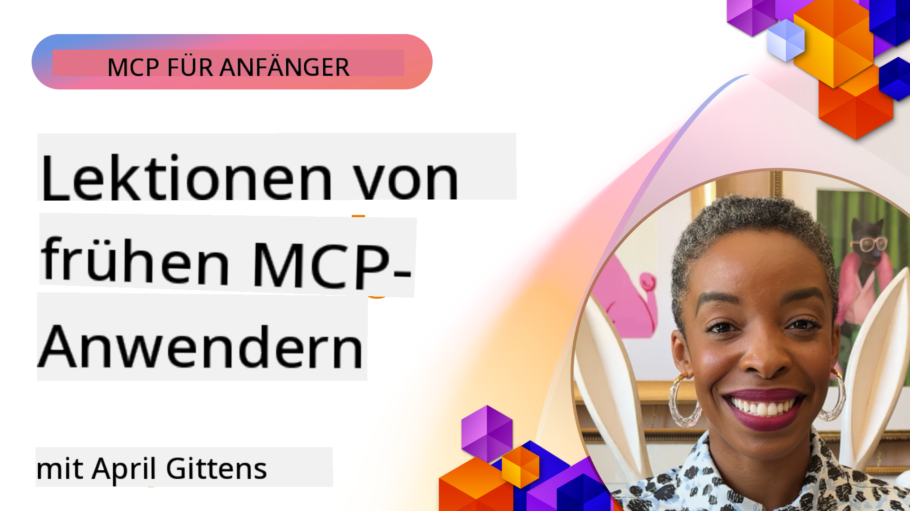

<!--
CO_OP_TRANSLATOR_METADATA:
{
  "original_hash": "41f16dac486d2086a53bc644a01cbe42",
  "translation_date": "2025-08-18T11:46:17+00:00",
  "source_file": "07-LessonsfromEarlyAdoption/README.md",
  "language_code": "de"
}
-->
# 🌟 Lektionen von frühen Anwendern

[](https://youtu.be/jds7dSmNptE)

_(Klicken Sie auf das Bild oben, um das Video zu dieser Lektion anzusehen)_

## 🎯 Was dieses Modul behandelt

Dieses Modul untersucht, wie echte Organisationen und Entwickler das Model Context Protocol (MCP) nutzen, um reale Herausforderungen zu lösen und Innovationen voranzutreiben. Durch detaillierte Fallstudien und praktische Projekte entdecken Sie, wie MCP sichere, skalierbare KI-Integrationen ermöglicht, die Sprachmodelle, Tools und Unternehmensdaten verbinden.

### 📚 MCP in Aktion erleben

Möchten Sie sehen, wie diese Prinzipien in produktionsreifen Tools angewendet werden? Schauen Sie sich unsere [**10 Microsoft MCP-Server, die die Entwicklerproduktivität revolutionieren**](microsoft-mcp-servers.md) an, die echte Microsoft MCP-Server vorstellen, die Sie heute nutzen können.

## Überblick

Diese Lektion zeigt, wie frühe Anwender das Model Context Protocol (MCP) genutzt haben, um reale Herausforderungen zu bewältigen und Innovationen in verschiedenen Branchen voranzutreiben. Durch detaillierte Fallstudien und praktische Projekte erfahren Sie, wie MCP standardisierte, sichere und skalierbare KI-Integrationen ermöglicht, die große Sprachmodelle, Tools und Unternehmensdaten in einem einheitlichen Rahmen verbinden. Sie erhalten praktische Erfahrungen im Entwerfen und Erstellen von MCP-basierten Lösungen, lernen bewährte Implementierungsmuster kennen und entdecken Best Practices für den Einsatz von MCP in Produktionsumgebungen. Die Lektion beleuchtet auch aufkommende Trends, zukünftige Entwicklungen und Open-Source-Ressourcen, um Ihnen zu helfen, an der Spitze der MCP-Technologie und ihres sich entwickelnden Ökosystems zu bleiben.

## Lernziele

- Analyse von realen MCP-Implementierungen in verschiedenen Branchen
- Entwerfen und Erstellen vollständiger MCP-basierter Anwendungen
- Untersuchung aufkommender Trends und zukünftiger Entwicklungen in der MCP-Technologie
- Anwendung von Best Practices in realen Entwicklungsszenarien

## Reale MCP-Implementierungen

### Fallstudie 1: Automatisierung des Kundensupports in Unternehmen

Ein multinationales Unternehmen implementierte eine MCP-basierte Lösung, um KI-Interaktionen in ihren Kundensupportsystemen zu standardisieren. Dies ermöglichte:

- Eine einheitliche Schnittstelle für mehrere LLM-Anbieter
- Konsistentes Prompt-Management über Abteilungen hinweg
- Robuste Sicherheits- und Compliance-Kontrollen
- Einfaches Wechseln zwischen verschiedenen KI-Modellen je nach Bedarf

**Technische Umsetzung:**

```python
# Python MCP server implementation for customer support
import logging
import asyncio
from modelcontextprotocol import create_server, ServerConfig
from modelcontextprotocol.server import MCPServer
from modelcontextprotocol.transports import create_http_transport
from modelcontextprotocol.resources import ResourceDefinition
from modelcontextprotocol.prompts import PromptDefinition
from modelcontextprotocol.tool import ToolDefinition

# Configure logging
logging.basicConfig(level=logging.INFO)

async def main():
    # Create server configuration
    config = ServerConfig(
        name="Enterprise Customer Support Server",
        version="1.0.0",
        description="MCP server for handling customer support inquiries"
    )
    
    # Initialize MCP server
    server = create_server(config)
    
    # Register knowledge base resources
    server.resources.register(
        ResourceDefinition(
            name="customer_kb",
            description="Customer knowledge base documentation"
        ),
        lambda params: get_customer_documentation(params)
    )
    
    # Register prompt templates
    server.prompts.register(
        PromptDefinition(
            name="support_template",
            description="Templates for customer support responses"
        ),
        lambda params: get_support_templates(params)
    )
    
    # Register support tools
    server.tools.register(
        ToolDefinition(
            name="ticketing",
            description="Create and update support tickets"
        ),
        handle_ticketing_operations
    )
    
    # Start server with HTTP transport
    transport = create_http_transport(port=8080)
    await server.run(transport)

if __name__ == "__main__":
    asyncio.run(main())
```

**Ergebnisse:** 30 % Reduzierung der Modellkosten, 45 % Verbesserung der Antwortkonsistenz und erhöhte Compliance in globalen Operationen.

### Fallstudie 2: Diagnostikassistent im Gesundheitswesen

Ein Gesundheitsdienstleister entwickelte eine MCP-Infrastruktur, um mehrere spezialisierte medizinische KI-Modelle zu integrieren und gleichzeitig sensible Patientendaten zu schützen:

- Nahtloses Wechseln zwischen allgemeinen und spezialisierten medizinischen Modellen
- Strenge Datenschutzkontrollen und Prüfpfade
- Integration mit bestehenden elektronischen Patientenakten (EHR)
- Konsistente Prompt-Entwicklung für medizinische Terminologie

**Technische Umsetzung:**

```csharp
// C# MCP host application implementation in healthcare application
using Microsoft.Extensions.DependencyInjection;
using ModelContextProtocol.SDK.Client;
using ModelContextProtocol.SDK.Security;
using ModelContextProtocol.SDK.Resources;

public class DiagnosticAssistant
{
    private readonly MCPHostClient _mcpClient;
    private readonly PatientContext _patientContext;
    
    public DiagnosticAssistant(PatientContext patientContext)
    {
        _patientContext = patientContext;
        
        // Configure MCP client with healthcare-specific settings
        var clientOptions = new ClientOptions
        {
            Name = "Healthcare Diagnostic Assistant",
            Version = "1.0.0",
            Security = new SecurityOptions
            {
                Encryption = EncryptionLevel.Medical,
                AuditEnabled = true
            }
        };
        
        _mcpClient = new MCPHostClientBuilder()
            .WithOptions(clientOptions)
            .WithTransport(new HttpTransport("https://healthcare-mcp.example.org"))
            .WithAuthentication(new HIPAACompliantAuthProvider())
            .Build();
    }
    
    public async Task<DiagnosticSuggestion> GetDiagnosticAssistance(
        string symptoms, string patientHistory)
    {
        // Create request with appropriate resources and tool access
        var resourceRequest = new ResourceRequest
        {
            Name = "patient_records",
            Parameters = new Dictionary<string, object>
            {
                ["patientId"] = _patientContext.PatientId,
                ["requestingProvider"] = _patientContext.ProviderId
            }
        };
        
        // Request diagnostic assistance using appropriate prompt
        var response = await _mcpClient.SendPromptRequestAsync(
            promptName: "diagnostic_assistance",
            parameters: new Dictionary<string, object>
            {
                ["symptoms"] = symptoms,
                patientHistory = patientHistory,
                relevantGuidelines = _patientContext.GetRelevantGuidelines()
            });
            
        return DiagnosticSuggestion.FromMCPResponse(response);
    }
}
```

**Ergebnisse:** Verbesserte diagnostische Vorschläge für Ärzte bei voller HIPAA-Compliance und deutliche Reduzierung von Kontextwechseln zwischen Systemen.

### Fallstudie 3: Risikoanalyse im Finanzdienstleistungssektor

Ein Finanzinstitut implementierte MCP, um ihre Risikoanalyseprozesse in verschiedenen Abteilungen zu standardisieren:

- Einheitliche Schnittstelle für Kreditrisiko-, Betrugserkennungs- und Investitionsrisikomodelle
- Strenge Zugriffskontrollen und Modellversionierung
- Sicherstellung der Nachvollziehbarkeit aller KI-Empfehlungen
- Konsistente Datenformate über diverse Systeme hinweg

**Technische Umsetzung:**

```java
// Java MCP server for financial risk assessment
import org.mcp.server.*;
import org.mcp.security.*;

public class FinancialRiskMCPServer {
    public static void main(String[] args) {
        // Create MCP server with financial compliance features
        MCPServer server = new MCPServerBuilder()
            .withModelProviders(
                new ModelProvider("risk-assessment-primary", new AzureOpenAIProvider()),
                new ModelProvider("risk-assessment-audit", new LocalLlamaProvider())
            )
            .withPromptTemplateDirectory("./compliance/templates")
            .withAccessControls(new SOCCompliantAccessControl())
            .withDataEncryption(EncryptionStandard.FINANCIAL_GRADE)
            .withVersionControl(true)
            .withAuditLogging(new DatabaseAuditLogger())
            .build();
            
        server.addRequestValidator(new FinancialDataValidator());
        server.addResponseFilter(new PII_RedactionFilter());
        
        server.start(9000);
        
        System.out.println("Financial Risk MCP Server running on port 9000");
    }
}
```

**Ergebnisse:** Verbesserte regulatorische Compliance, 40 % schnellere Modellbereitstellungszyklen und konsistentere Risikoanalysen in den Abteilungen.

### Fallstudie 4: Microsoft Playwright MCP Server für Browserautomatisierung

Microsoft entwickelte den [Playwright MCP Server](https://github.com/microsoft/playwright-mcp), um sichere, standardisierte Browserautomatisierung durch das Model Context Protocol zu ermöglichen. Dieser produktionsreife Server erlaubt es KI-Agenten und LLMs, in einer kontrollierten, prüfbaren und erweiterbaren Weise mit Webbrowsern zu interagieren – für Anwendungsfälle wie automatisierte Webtests, Datenextraktion und End-to-End-Workflows.

> **🎯 Produktionsreifes Tool**
> 
> Diese Fallstudie zeigt einen echten MCP-Server, den Sie heute nutzen können! Erfahren Sie mehr über den Playwright MCP Server und 9 weitere produktionsreife Microsoft MCP-Server in unserem [**Microsoft MCP Servers Guide**](microsoft-mcp-servers.md#8--playwright-mcp-server).

**Hauptmerkmale:**
- Bietet Browserautomatisierungsfunktionen (Navigation, Formularausfüllung, Screenshot-Erstellung usw.) als MCP-Tools
- Implementiert strenge Zugriffskontrollen und Sandboxing, um unbefugte Aktionen zu verhindern
- Liefert detaillierte Prüfprotokolle für alle Browserinteraktionen
- Unterstützt die Integration mit Azure OpenAI und anderen LLM-Anbietern für agentengesteuerte Automatisierung
- Ermöglicht GitHub Copilot die Nutzung von Webbrowser-Funktionen

**Technische Umsetzung:**

```typescript
// TypeScript: Registering Playwright browser automation tools in an MCP server
import { createServer, ToolDefinition } from 'modelcontextprotocol';
import { launch } from 'playwright';

const server = createServer({
  name: 'Playwright MCP Server',
  version: '1.0.0',
  description: 'MCP server for browser automation using Playwright'
});

// Register a tool for navigating to a URL and capturing a screenshot
server.tools.register(
  new ToolDefinition({
    name: 'navigate_and_screenshot',
    description: 'Navigate to a URL and capture a screenshot',
    parameters: {
      url: { type: 'string', description: 'The URL to visit' }
    }
  }),
  async ({ url }) => {
    const browser = await launch();
    const page = await browser.newPage();
    await page.goto(url);
    const screenshot = await page.screenshot();
    await browser.close();
    return { screenshot };
  }
);

// Start the MCP server
server.listen(8080);
```

**Ergebnisse:**

- Sichere, programmatische Browserautomatisierung für KI-Agenten und LLMs
- Reduzierter manueller Testaufwand und verbesserte Testabdeckung für Webanwendungen
- Bereitstellung eines wiederverwendbaren, erweiterbaren Frameworks für browserbasierte Tool-Integration in Unternehmensumgebungen
- Ermöglicht GitHub Copilot die Nutzung von Webbrowser-Funktionen

**Referenzen:**

- [Playwright MCP Server GitHub Repository](https://github.com/microsoft/playwright-mcp)
- [Microsoft KI- und Automatisierungslösungen](https://azure.microsoft.com/en-us/products/ai-services/)

### Fallstudie 5: Azure MCP – Unternehmensgerechtes Model Context Protocol als Service

Azure MCP ([https://aka.ms/azmcp](https://aka.ms/azmcp)) ist Microsofts verwaltete, unternehmensgerechte Implementierung des Model Context Protocol, die skalierbare, sichere und konforme MCP-Server-Funktionen als Cloud-Service bietet. Azure MCP ermöglicht es Organisationen, MCP-Server schnell bereitzustellen, zu verwalten und mit Azure KI-, Daten- und Sicherheitsdiensten zu integrieren, wodurch der operative Aufwand reduziert und die KI-Einführung beschleunigt wird.

> **🎯 Produktionsreifes Tool**
> 
> Dies ist ein echter MCP-Server, den Sie heute nutzen können! Erfahren Sie mehr über den Azure AI Foundry MCP Server in unserem [**Microsoft MCP Servers Guide**](microsoft-mcp-servers.md).

- Vollständig verwaltetes MCP-Server-Hosting mit integriertem Skalieren, Überwachen und Sicherheitsfunktionen
- Native Integration mit Azure OpenAI, Azure AI Search und anderen Azure-Diensten
- Unternehmensauthentifizierung und -autorisierung über Microsoft Entra ID
- Unterstützung für benutzerdefinierte Tools, Prompt-Vorlagen und Ressourcenkonnektoren
- Einhaltung von Unternehmenssicherheits- und regulatorischen Anforderungen

**Technische Umsetzung:**

```yaml
# Example: Azure MCP server deployment configuration (YAML)
apiVersion: mcp.microsoft.com/v1
kind: McpServer
metadata:
  name: enterprise-mcp-server
spec:
  modelProviders:
    - name: azure-openai
      type: AzureOpenAI
      endpoint: https://<your-openai-resource>.openai.azure.com/
      apiKeySecret: <your-azure-keyvault-secret>
  tools:
    - name: document_search
      type: AzureAISearch
      endpoint: https://<your-search-resource>.search.windows.net/
      apiKeySecret: <your-azure-keyvault-secret>
  authentication:
    type: EntraID
    tenantId: <your-tenant-id>
  monitoring:
    enabled: true
    logAnalyticsWorkspace: <your-log-analytics-id>
```

**Ergebnisse:**  
- Verkürzte Time-to-Value für Unternehmens-KI-Projekte durch Bereitstellung einer sofort einsatzbereiten, konformen MCP-Server-Plattform
- Vereinfachte Integration von LLMs, Tools und Unternehmensdatenquellen
- Verbesserte Sicherheit, Beobachtbarkeit und Betriebseffizienz für MCP-Workloads
- Verbesserte Codequalität durch Azure SDK Best Practices und aktuelle Authentifizierungsmuster

**Referenzen:**  
- [Azure MCP Dokumentation](https://aka.ms/azmcp)
- [Azure MCP Server GitHub Repository](https://github.com/Azure/azure-mcp)
- [Azure KI-Dienste](https://azure.microsoft.com/en-us/products/ai-services/)
- [Microsoft MCP Center](https://mcp.azure.com)

### Fallstudie 6: NLWeb

MCP (Model Context Protocol) ist ein aufkommendes Protokoll, das Chatbots und KI-Assistenten die Interaktion mit Tools ermöglicht. Jede NLWeb-Instanz ist auch ein MCP-Server, der eine Kernmethode unterstützt: ask, mit der eine Website in natürlicher Sprache befragt werden kann. Die zurückgegebene Antwort nutzt schema.org, ein weit verbreitetes Vokabular zur Beschreibung von Webdaten. Vereinfacht gesagt ist MCP für NLWeb das, was HTTP für HTML ist. NLWeb kombiniert Protokolle, Schema.org-Formate und Beispielcode, um Websites dabei zu helfen, diese Endpunkte schnell zu erstellen, was sowohl Menschen durch Konversationsschnittstellen als auch Maschinen durch natürliche Agent-zu-Agent-Interaktionen zugutekommt.

Es gibt zwei Hauptkomponenten von NLWeb:
- Ein Protokoll, das sehr einfach zu starten ist, um mit einer Website in natürlicher Sprache zu interagieren, und ein Format, das JSON und schema.org für die zurückgegebene Antwort nutzt. Weitere Details finden Sie in der Dokumentation zur REST-API.
- Eine einfache Implementierung von (1), die vorhandenes Markup nutzt, für Websites, die als Listen von Elementen (Produkte, Rezepte, Attraktionen, Bewertungen usw.) abstrahiert werden können. Zusammen mit einer Reihe von Benutzeroberflächen-Widgets können Websites leicht Konversationsschnittstellen für ihre Inhalte bereitstellen. Weitere Details finden Sie in der Dokumentation zum Lebenszyklus einer Chat-Anfrage.

**Referenzen:**  
- [Azure MCP Dokumentation](https://aka.ms/azmcp)  
- [NLWeb](https://github.com/microsoft/NlWeb)

### Fallstudie 7: Azure AI Foundry MCP Server – Integration von Unternehmens-KI-Agenten

Die Azure AI Foundry MCP-Server demonstrieren, wie MCP zur Orchestrierung und Verwaltung von KI-Agenten und Workflows in Unternehmensumgebungen genutzt werden kann. Durch die Integration von MCP mit Azure AI Foundry können Organisationen Agenteninteraktionen standardisieren, die Workflow-Verwaltung von Foundry nutzen und sichere, skalierbare Bereitstellungen sicherstellen.

> **🎯 Produktionsreifes Tool**
> 
> Dies ist ein echter MCP-Server, den Sie heute nutzen können! Erfahren Sie mehr über den Azure AI Foundry MCP Server in unserem [**Microsoft MCP Servers Guide**](microsoft-mcp-servers.md#9--azure-ai-foundry-mcp-server).

**Hauptmerkmale:**
- Umfassender Zugriff auf das Azure-KI-Ökosystem, einschließlich Modellkatalogen und Bereitstellungsmanagement
- Wissensindexierung mit Azure AI Search für RAG-Anwendungen
- Bewertungstools für die Leistung und Qualitätssicherung von KI-Modellen
- Integration mit dem Azure AI Foundry-Katalog und -Labs für modernste Forschungsmodelle
- Agentenmanagement und Bewertungsfunktionen für Produktionsszenarien

**Ergebnisse:**
- Schnelles Prototyping und robuste Überwachung von KI-Agenten-Workflows
- Nahtlose Integration mit Azure KI-Diensten für fortgeschrittene Szenarien
- Einheitliche Schnittstelle für den Aufbau, die Bereitstellung und Überwachung von Agentenpipelines
- Verbesserte Sicherheit, Compliance und Betriebseffizienz für Unternehmen
- Beschleunigte KI-Einführung bei gleichzeitiger Kontrolle über komplexe agentengesteuerte Prozesse

**Referenzen:**
- [Azure AI Foundry MCP Server GitHub Repository](https://github.com/azure-ai-foundry/mcp-foundry)
- [Integration von Azure KI-Agenten mit MCP (Microsoft Foundry Blog)](https://devblogs.microsoft.com/foundry/integrating-azure-ai-agents-mcp/)

### Fallstudie 8: Foundry MCP Playground – Experimentieren und Prototyping

Der Foundry MCP Playground bietet eine sofort einsatzbereite Umgebung zum Experimentieren mit MCP-Servern und Azure AI Foundry-Integrationen. Entwickler können schnell Prototypen erstellen, testen und KI-Modelle sowie Agenten-Workflows mithilfe von Ressourcen aus dem Azure AI Foundry-Katalog und -Labs evaluieren. Der Playground vereinfacht die Einrichtung, bietet Beispielprojekte und unterstützt die kollaborative Entwicklung, wodurch es einfach wird, Best Practices und neue Szenarien mit minimalem Aufwand zu erkunden. Besonders nützlich ist er für Teams, die Ideen validieren, Experimente teilen und das Lernen beschleunigen möchten, ohne komplexe Infrastruktur zu benötigen. Durch die Senkung der Einstiegshürden fördert der Playground Innovation und Community-Beiträge im MCP- und Azure AI Foundry-Ökosystem.

**Referenzen:**

- [Foundry MCP Playground GitHub Repository](https://github.com/azure-ai-foundry/foundry-mcp-playground)

### Fallstudie 9: Microsoft Learn Docs MCP Server – KI-gestützter Zugriff auf Dokumentationen

Der Microsoft Learn Docs MCP Server ist ein cloudbasierter Dienst, der KI-Assistenten Echtzeitzugriff auf offizielle Microsoft-Dokumentationen über das Model Context Protocol bietet. Dieser produktionsreife Server verbindet sich mit dem umfassenden Microsoft Learn-Ökosystem und ermöglicht semantische Suchen über alle offiziellen Microsoft-Quellen hinweg.
> **🎯 Produktionsbereites Tool**  
>  
> Dies ist ein echter MCP-Server, den Sie ab heute nutzen können! Erfahren Sie mehr über den Microsoft Learn Docs MCP-Server in unserem [**Microsoft MCP-Server-Leitfaden**](microsoft-mcp-servers.md#1--microsoft-learn-docs-mcp-server).
**Hauptmerkmale:**
- Echtzeit-Zugriff auf offizielle Microsoft-Dokumentation, Azure-Dokumente und Microsoft 365-Dokumentation
- Fortschrittliche semantische Suchfunktionen, die Kontext und Absicht verstehen
- Immer aktuelle Informationen, da Inhalte von Microsoft Learn veröffentlicht werden
- Umfassende Abdeckung von Microsoft Learn, Azure-Dokumentation und Microsoft 365-Quellen
- Liefert bis zu 10 hochwertige Inhaltsausschnitte mit Artikeltiteln und URLs

**Warum es wichtig ist:**
- Löst das Problem der "veralteten KI-Wissen" für Microsoft-Technologien
- Stellt sicher, dass KI-Assistenten Zugriff auf die neuesten .NET-, C#-, Azure- und Microsoft 365-Funktionen haben
- Liefert autoritative, erstklassige Informationen für präzise Codegenerierung
- Essenziell für Entwickler, die mit sich schnell entwickelnden Microsoft-Technologien arbeiten

**Ergebnisse:**
- Deutlich verbesserte Genauigkeit von KI-generiertem Code für Microsoft-Technologien
- Reduzierte Zeit für die Suche nach aktueller Dokumentation und Best Practices
- Verbesserte Entwicklerproduktivität durch kontextbewusste Dokumentationsabfrage
- Nahtlose Integration in Entwicklungsabläufe ohne Verlassen der IDE

**Referenzen:**
- [Microsoft Learn Docs MCP Server GitHub Repository](https://github.com/MicrosoftDocs/mcp)
- [Microsoft Learn Documentation](https://learn.microsoft.com/)

## Praxisprojekte

### Projekt 1: Aufbau eines Multi-Provider-MCP-Servers

**Ziel:** Erstellen Sie einen MCP-Server, der Anfragen basierend auf spezifischen Kriterien an mehrere KI-Modellanbieter weiterleiten kann.

**Anforderungen:**

- Unterstützung von mindestens drei verschiedenen Modellanbietern (z. B. OpenAI, Anthropic, lokale Modelle)
- Implementierung eines Routing-Mechanismus basierend auf Metadaten der Anfrage
- Erstellung eines Konfigurationssystems zur Verwaltung von Anbieter-Zugangsdaten
- Hinzufügen von Caching zur Optimierung von Leistung und Kosten
- Aufbau eines einfachen Dashboards zur Überwachung der Nutzung

**Implementierungsschritte:**

1. Grundlegende MCP-Server-Infrastruktur einrichten
2. Anbieter-Adapter für jeden KI-Modellservice implementieren
3. Routing-Logik basierend auf Anfrageattributen erstellen
4. Caching-Mechanismen für häufige Anfragen hinzufügen
5. Monitoring-Dashboard entwickeln
6. Tests mit verschiedenen Anfrage-Mustern durchführen

**Technologien:** Wählen Sie zwischen Python (.NET/Java/Python je nach Präferenz), Redis für Caching und einem einfachen Web-Framework für das Dashboard.

### Projekt 2: Enterprise Prompt Management System

**Ziel:** Entwicklung eines MCP-basierten Systems zur Verwaltung, Versionierung und Bereitstellung von Prompt-Vorlagen innerhalb einer Organisation.

**Anforderungen:**

- Erstellung eines zentralen Repositories für Prompt-Vorlagen
- Implementierung von Versionierungs- und Genehmigungs-Workflows
- Aufbau von Testfunktionen für Vorlagen mit Beispiel-Eingaben
- Entwicklung von rollenbasierten Zugriffskontrollen
- Erstellung einer API für die Abfrage und Bereitstellung von Vorlagen

**Implementierungsschritte:**

1. Datenbankschema für die Vorlagenspeicherung entwerfen
2. Kern-API für CRUD-Operationen der Vorlagen erstellen
3. Versionierungssystem implementieren
4. Genehmigungs-Workflow entwickeln
5. Testframework erstellen
6. Einfache Weboberfläche für die Verwaltung entwickeln
7. Integration mit einem MCP-Server

**Technologien:** Ihre Wahl eines Backend-Frameworks, SQL- oder NoSQL-Datenbank und eines Frontend-Frameworks für die Verwaltungsoberfläche.

### Projekt 3: MCP-basierte Plattform für Content-Erstellung

**Ziel:** Aufbau einer Plattform für Content-Erstellung, die MCP nutzt, um konsistente Ergebnisse für verschiedene Content-Typen zu liefern.

**Anforderungen:**

- Unterstützung mehrerer Content-Formate (Blogposts, Social Media, Marketingtexte)
- Implementierung einer vorlagenbasierten Erstellung mit Anpassungsoptionen
- Aufbau eines Systems zur Content-Überprüfung und Feedback
- Verfolgung von Leistungskennzahlen für Inhalte
- Unterstützung von Content-Versionierung und Iteration

**Implementierungsschritte:**

1. MCP-Client-Infrastruktur einrichten
2. Vorlagen für verschiedene Content-Typen erstellen
3. Content-Erstellungs-Pipeline aufbauen
4. Überprüfungssystem implementieren
5. System zur Verfolgung von Leistungskennzahlen entwickeln
6. Benutzeroberfläche für Vorlagenverwaltung und Content-Erstellung erstellen

**Technologien:** Ihre bevorzugte Programmiersprache, Web-Framework und Datenbanksystem.

## Zukünftige Entwicklungen der MCP-Technologie

### Aufkommende Trends

1. **Multi-Modale MCP**
   - Erweiterung von MCP zur Standardisierung von Interaktionen mit Bild-, Audio- und Videomodellen
   - Entwicklung von Fähigkeiten für cross-modale Schlussfolgerungen
   - Standardisierte Prompt-Formate für verschiedene Modalitäten

2. **Federierte MCP-Infrastruktur**
   - Verteilte MCP-Netzwerke, die Ressourcen zwischen Organisationen teilen können
   - Standardisierte Protokolle für sicheren Modell-Austausch
   - Datenschutzfreundliche Berechnungstechniken

3. **MCP-Marktplätze**
   - Ökosysteme für den Austausch und die Monetarisierung von MCP-Vorlagen und Plugins
   - Qualitätssicherung und Zertifizierungsprozesse
   - Integration mit Modell-Marktplätzen

4. **MCP für Edge Computing**
   - Anpassung von MCP-Standards für ressourcenbeschränkte Edge-Geräte
   - Optimierte Protokolle für Umgebungen mit geringer Bandbreite
   - Spezialisierte MCP-Implementierungen für IoT-Ökosysteme

5. **Regulatorische Rahmenbedingungen**
   - Entwicklung von MCP-Erweiterungen für die Einhaltung von Vorschriften
   - Standardisierte Prüfpfade und Erklärbarkeitsschnittstellen
   - Integration mit aufkommenden KI-Governance-Frameworks

### MCP-Lösungen von Microsoft

Microsoft und Azure haben mehrere Open-Source-Repositories entwickelt, um Entwicklern zu helfen, MCP in verschiedenen Szenarien zu implementieren:

#### Microsoft Organisation

1. [playwright-mcp](https://github.com/microsoft/playwright-mcp) - Ein Playwright MCP-Server für Browser-Automatisierung und Tests
2. [files-mcp-server](https://github.com/microsoft/files-mcp-server) - Eine OneDrive MCP-Server-Implementierung für lokale Tests und Community-Beiträge
3. [NLWeb](https://github.com/microsoft/NlWeb) - NLWeb ist eine Sammlung offener Protokolle und zugehöriger Open-Source-Tools. Der Hauptfokus liegt auf der Etablierung einer grundlegenden Schicht für das KI-Web

#### Azure-Samples Organisation

1. [mcp](https://github.com/Azure-Samples/mcp) - Links zu Beispielen, Tools und Ressourcen für den Aufbau und die Integration von MCP-Servern auf Azure mit mehreren Sprachen
2. [mcp-auth-servers](https://github.com/Azure-Samples/mcp-auth-servers) - Referenz-MCP-Server, die Authentifizierung mit der aktuellen Model Context Protocol-Spezifikation demonstrieren
3. [remote-mcp-functions](https://github.com/Azure-Samples/remote-mcp-functions) - Landing Page für Remote-MCP-Server-Implementierungen in Azure Functions mit Links zu sprachspezifischen Repos
4. [remote-mcp-functions-python](https://github.com/Azure-Samples/remote-mcp-functions-python) - Schnellstartvorlage für den Aufbau und die Bereitstellung benutzerdefinierter Remote-MCP-Server mit Azure Functions und Python
5. [remote-mcp-functions-dotnet](https://github.com/Azure-Samples/remote-mcp-functions-dotnet) - Schnellstartvorlage für den Aufbau und die Bereitstellung benutzerdefinierter Remote-MCP-Server mit Azure Functions und .NET/C#
6. [remote-mcp-functions-typescript](https://github.com/Azure-Samples/remote-mcp-functions-typescript) - Schnellstartvorlage für den Aufbau und die Bereitstellung benutzerdefinierter Remote-MCP-Server mit Azure Functions und TypeScript
7. [remote-mcp-apim-functions-python](https://github.com/Azure-Samples/remote-mcp-apim-functions-python) - Azure API Management als KI-Gateway zu Remote-MCP-Servern mit Python
8. [AI-Gateway](https://github.com/Azure-Samples/AI-Gateway) - APIM ❤️ KI-Experimente einschließlich MCP-Funktionen, Integration mit Azure OpenAI und AI Foundry

Diese Repositories bieten verschiedene Implementierungen, Vorlagen und Ressourcen für die Arbeit mit dem Model Context Protocol in verschiedenen Programmiersprachen und Azure-Diensten. Sie decken eine Reihe von Anwendungsfällen ab, von grundlegenden Server-Implementierungen bis hin zu Authentifizierung, Cloud-Bereitstellung und Unternehmensintegration.

#### MCP-Ressourcenverzeichnis

Das [MCP-Ressourcenverzeichnis](https://github.com/microsoft/mcp/tree/main/Resources) im offiziellen Microsoft MCP-Repository bietet eine kuratierte Sammlung von Beispielressourcen, Prompt-Vorlagen und Tool-Definitionen für die Verwendung mit Model Context Protocol-Servern. Dieses Verzeichnis soll Entwicklern helfen, schnell mit MCP zu starten, indem es wiederverwendbare Bausteine und Best-Practice-Beispiele bietet für:

- **Prompt-Vorlagen:** Fertige Prompt-Vorlagen für häufige KI-Aufgaben und Szenarien, die für eigene MCP-Server-Implementierungen angepasst werden können.
- **Tool-Definitionen:** Beispiel-Tool-Schemata und Metadaten zur Standardisierung der Tool-Integration und -Aufrufe über verschiedene MCP-Server hinweg.
- **Ressourcenbeispiele:** Beispielressourcen-Definitionen für die Verbindung zu Datenquellen, APIs und externen Diensten innerhalb des MCP-Frameworks.
- **Referenzimplementierungen:** Praktische Beispiele, die zeigen, wie Ressourcen, Prompts und Tools in realen MCP-Projekten strukturiert und organisiert werden können.

Diese Ressourcen beschleunigen die Entwicklung, fördern die Standardisierung und helfen, Best Practices beim Aufbau und der Bereitstellung von MCP-basierten Lösungen sicherzustellen.

#### MCP-Ressourcenverzeichnis

- [MCP Resources (Sample Prompts, Tools, and Resource Definitions)](https://github.com/microsoft/mcp/tree/main/Resources)

### Forschungsmöglichkeiten

- Effiziente Prompt-Optimierungstechniken innerhalb von MCP-Frameworks
- Sicherheitsmodelle für Multi-Tenant-MCP-Bereitstellungen
- Leistungs-Benchmarking über verschiedene MCP-Implementierungen hinweg
- Formale Verifikationsmethoden für MCP-Server

## Fazit

Das Model Context Protocol (MCP) prägt zunehmend die Zukunft der standardisierten, sicheren und interoperablen KI-Integration in verschiedenen Branchen. Durch die Fallstudien und Praxisprojekte in dieser Lektion haben Sie gesehen, wie frühe Anwender – einschließlich Microsoft und Azure – MCP nutzen, um reale Herausforderungen zu lösen, die KI-Adoption zu beschleunigen und Compliance, Sicherheit und Skalierbarkeit zu gewährleisten. Der modulare Ansatz von MCP ermöglicht es Organisationen, große Sprachmodelle, Tools und Unternehmensdaten in einem einheitlichen, überprüfbaren Rahmen zu verbinden. Während sich MCP weiterentwickelt, wird es entscheidend sein, mit der Community in Kontakt zu bleiben, Open-Source-Ressourcen zu erkunden und Best Practices anzuwenden, um robuste, zukunftssichere KI-Lösungen zu entwickeln.

## Zusätzliche Ressourcen

- [MCP Foundry GitHub Repository](https://github.com/azure-ai-foundry/mcp-foundry)
- [Foundry MCP Playground](https://github.com/azure-ai-foundry/foundry-mcp-playground)
- [Integrating Azure AI Agents with MCP (Microsoft Foundry Blog)](https://devblogs.microsoft.com/foundry/integrating-azure-ai-agents-mcp/)
- [MCP GitHub Repository (Microsoft)](https://github.com/microsoft/mcp)
- [MCP Resources Directory (Sample Prompts, Tools, and Resource Definitions)](https://github.com/microsoft/mcp/tree/main/Resources)
- [MCP Community & Documentation](https://modelcontextprotocol.io/introduction)
- [Azure MCP Documentation](https://aka.ms/azmcp)
- [Playwright MCP Server GitHub Repository](https://github.com/microsoft/playwright-mcp)
- [Files MCP Server (OneDrive)](https://github.com/microsoft/files-mcp-server)
- [Azure-Samples MCP](https://github.com/Azure-Samples/mcp)
- [MCP Auth Servers (Azure-Samples)](https://github.com/Azure-Samples/mcp-auth-servers)
- [Remote MCP Functions (Azure-Samples)](https://github.com/Azure-Samples/remote-mcp-functions)
- [Remote MCP Functions Python (Azure-Samples)](https://github.com/Azure-Samples/remote-mcp-functions-python)
- [Remote MCP Functions .NET (Azure-Samples)](https://github.com/Azure-Samples/remote-mcp-functions-dotnet)
- [Remote MCP Functions TypeScript (Azure-Samples)](https://github.com/Azure-Samples/remote-mcp-functions-typescript)
- [Remote MCP APIM Functions Python (Azure-Samples)](https://github.com/Azure-Samples/remote-mcp-apim-functions-python)
- [AI-Gateway (Azure-Samples)](https://github.com/Azure-Samples/AI-Gateway)
- [Microsoft AI and Automation Solutions](https://azure.microsoft.com/en-us/products/ai-services/)

## Übungen

1. Analysieren Sie eine der Fallstudien und schlagen Sie einen alternativen Implementierungsansatz vor.
2. Wählen Sie eine der Projektideen aus und erstellen Sie eine detaillierte technische Spezifikation.
3. Recherchieren Sie eine Branche, die in den Fallstudien nicht behandelt wurde, und skizzieren Sie, wie MCP ihre spezifischen Herausforderungen lösen könnte.
4. Erkunden Sie eine der zukünftigen Entwicklungen und erstellen Sie ein Konzept für eine neue MCP-Erweiterung, die diese unterstützt.

Weiter: [Microsoft MCP Server](../07-LessonsfromEarlyAdoption/microsoft-mcp-servers.md)

**Haftungsausschluss**:  
Dieses Dokument wurde mithilfe des KI-Übersetzungsdienstes [Co-op Translator](https://github.com/Azure/co-op-translator) übersetzt. Obwohl wir uns um Genauigkeit bemühen, weisen wir darauf hin, dass automatisierte Übersetzungen Fehler oder Ungenauigkeiten enthalten können. Das Originaldokument in seiner ursprünglichen Sprache sollte als maßgebliche Quelle betrachtet werden. Für kritische Informationen wird eine professionelle menschliche Übersetzung empfohlen. Wir übernehmen keine Haftung für Missverständnisse oder Fehlinterpretationen, die aus der Nutzung dieser Übersetzung entstehen.