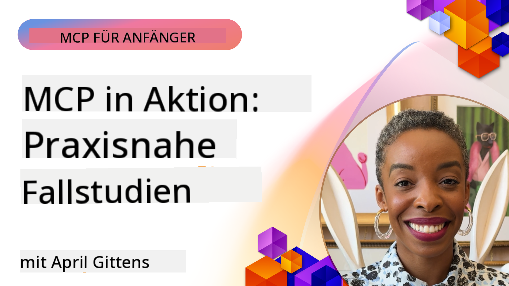

<!--
CO_OP_TRANSLATOR_METADATA:
{
  "original_hash": "1611dc5f6a2a35a789fc4c95fc5bfbe8",
  "translation_date": "2025-09-26T17:37:56+00:00",
  "source_file": "09-CaseStudy/README.md",
  "language_code": "de"
}
-->
# MCP in Aktion: Fallstudien aus der Praxis

_(Klicken Sie auf das Bild oben, um das Video zu dieser Lektion anzusehen)_

Das Model Context Protocol (MCP) revolutioniert die Art und Weise, wie KI-Anwendungen mit Daten, Tools und Diensten interagieren. In diesem Abschnitt werden Fallstudien aus der Praxis vorgestellt, die die Anwendung von MCP in verschiedenen Unternehmensszenarien veranschaulichen.

## Überblick

Dieser Abschnitt zeigt konkrete Beispiele für MCP-Implementierungen und hebt hervor, wie Organisationen dieses Protokoll nutzen, um komplexe geschäftliche Herausforderungen zu lösen. Durch die Analyse dieser Fallstudien erhalten Sie Einblicke in die Vielseitigkeit, Skalierbarkeit und praktischen Vorteile von MCP in realen Szenarien.

## Wichtige Lernziele

Durch die Untersuchung dieser Fallstudien werden Sie:

- Verstehen, wie MCP zur Lösung spezifischer Geschäftsprobleme eingesetzt werden kann
- Verschiedene Integrationsmuster und architektonische Ansätze kennenlernen
- Best Practices für die Implementierung von MCP in Unternehmensumgebungen erkennen
- Einblicke in die Herausforderungen und Lösungen bei realen Implementierungen gewinnen
- Möglichkeiten identifizieren, ähnliche Muster in Ihren eigenen Projekten anzuwenden

## Vorgestellte Fallstudien

### 1. [Azure AI Reiseagenten – Referenzimplementierung](./travelagentsample.md)

Diese Fallstudie untersucht Microsofts umfassende Referenzlösung, die zeigt, wie man eine Multi-Agenten-, KI-gestützte Reiseplanungsanwendung mit MCP, Azure OpenAI und Azure AI Search erstellt. Das Projekt zeigt:

- Multi-Agenten-Orchestrierung durch MCP
- Integration von Unternehmensdaten mit Azure AI Search
- Sichere, skalierbare Architektur mit Azure-Diensten
- Erweiterbare Tools mit wiederverwendbaren MCP-Komponenten
- Konversationserlebnis durch Azure OpenAI

Die Architektur- und Implementierungsdetails bieten wertvolle Einblicke in den Aufbau komplexer Multi-Agenten-Systeme mit MCP als Koordinierungsschicht.

### 2. [Aktualisierung von Azure DevOps-Elementen mit YouTube-Daten](./UpdateADOItemsFromYT.md)

Diese Fallstudie zeigt eine praktische Anwendung von MCP zur Automatisierung von Arbeitsabläufen. Sie demonstriert, wie MCP-Tools verwendet werden können, um:

- Daten von Online-Plattformen (YouTube) zu extrahieren
- Arbeitselemente in Azure DevOps-Systemen zu aktualisieren
- Wiederholbare Automatisierungsabläufe zu erstellen
- Daten über verschiedene Systeme hinweg zu integrieren

Dieses Beispiel zeigt, wie selbst relativ einfache MCP-Implementierungen erhebliche Effizienzgewinne erzielen können, indem sie Routineaufgaben automatisieren und die Datenkonsistenz über Systeme hinweg verbessern.

### 3. [Echtzeit-Dokumentenabruf mit MCP](./docs-mcp/README.md)

Diese Fallstudie führt Sie durch die Verbindung eines Python-Konsolenclients mit einem Model Context Protocol (MCP)-Server, um kontextbezogene Microsoft-Dokumentation in Echtzeit abzurufen und zu protokollieren. Sie lernen:

- Verbindung zu einem MCP-Server mit einem Python-Client und dem offiziellen MCP SDK
- Verwendung von Streaming-HTTP-Clients für effizienten Echtzeit-Datenabruf
- Aufruf von Dokumentationstools auf dem Server und direkte Protokollierung der Antworten in der Konsole
- Integration aktueller Microsoft-Dokumentation in Ihren Arbeitsablauf, ohne das Terminal zu verlassen

Das Kapitel enthält eine praktische Aufgabe, ein minimal funktionierendes Codebeispiel und Links zu zusätzlichen Ressourcen für vertiefendes Lernen. Sehen Sie sich die vollständige Anleitung und den Code im verlinkten Kapitel an, um zu verstehen, wie MCP den Zugriff auf Dokumentation und die Produktivität von Entwicklern in konsolenbasierten Umgebungen transformieren kann.

### 4. [Interaktive Studienplan-Generator-Web-App mit MCP](./docs-mcp/README.md)

Diese Fallstudie zeigt, wie man eine interaktive Webanwendung mit Chainlit und dem Model Context Protocol (MCP) erstellt, um personalisierte Studienpläne für jedes Thema zu generieren. Benutzer können ein Fachgebiet (z. B. "AI-900-Zertifizierung") und eine Studiendauer (z. B. 8 Wochen) angeben, und die App liefert eine wöchentliche Übersicht über empfohlene Inhalte. Chainlit ermöglicht eine konversationelle Chat-Oberfläche, die das Erlebnis ansprechend und adaptiv macht.

- Konversationelle Web-App mit Chainlit
- Benutzerdefinierte Eingaben für Thema und Dauer
- Wöchentliche Inhaltsvorschläge mit MCP
- Echtzeit-adaptive Antworten in einer Chat-Oberfläche

Das Projekt zeigt, wie konversationelle KI und MCP kombiniert werden können, um dynamische, benutzerorientierte Bildungstools in einer modernen Webumgebung zu erstellen.

### 5. [In-Editor-Dokumentation mit MCP-Server in VS Code](./docs-mcp/README.md)

Diese Fallstudie zeigt, wie Sie Microsoft Learn-Dokumente direkt in Ihre VS Code-Umgebung bringen können – kein Wechsel zwischen Browser-Tabs mehr! Sie erfahren, wie Sie:

- Dokumente sofort in VS Code durchsuchen und lesen können, entweder über das MCP-Panel oder die Befehlspalette
- Dokumentation referenzieren und Links direkt in Ihre README- oder Kurs-Markdown-Dateien einfügen
- GitHub Copilot und MCP zusammen für nahtlose, KI-gestützte Dokumentations- und Code-Arbeitsabläufe nutzen
- Ihre Dokumentation mit Echtzeit-Feedback und Microsoft-Quellen verbessern und validieren
- MCP mit GitHub-Arbeitsabläufen für kontinuierliche Dokumentationsvalidierung integrieren

Die Implementierung umfasst:

- Beispielkonfiguration `.vscode/mcp.json` für einfache Einrichtung
- Screenshot-basierte Anleitungen zur In-Editor-Erfahrung
- Tipps zur Kombination von Copilot und MCP für maximale Produktivität

Dieses Szenario ist ideal für Kursautoren, Dokumentationsschreiber und Entwickler, die sich auf ihre Arbeit im Editor konzentrieren möchten, während sie mit Dokumenten, Copilot und Validierungstools arbeiten – alles unterstützt durch MCP.

### 6. [APIM MCP-Server-Erstellung](./apimsample.md)

Diese Fallstudie bietet eine Schritt-für-Schritt-Anleitung zur Erstellung eines MCP-Servers mit Azure API Management (APIM). Sie behandelt:

- Einrichtung eines MCP-Servers in Azure API Management
- Bereitstellung von API-Operationen als MCP-Tools
- Konfiguration von Richtlinien für Ratenbegrenzung und Sicherheit
- Testen des MCP-Servers mit Visual Studio Code und GitHub Copilot

Dieses Beispiel zeigt, wie die Fähigkeiten von Azure genutzt werden können, um einen robusten MCP-Server zu erstellen, der in verschiedenen Anwendungen verwendet werden kann und die Integration von KI-Systemen mit Unternehmens-APIs verbessert.

### 7. [GitHub MCP Registry — Beschleunigung der agentischen Integration](https://github.com/mcp)

Diese Fallstudie untersucht, wie das GitHub MCP Registry, das im September 2025 eingeführt wurde, ein kritisches Problem im KI-Ökosystem löst: die fragmentierte Entdeckung und Bereitstellung von Model Context Protocol (MCP)-Servern.

#### Überblick
Das **MCP Registry** löst die wachsenden Herausforderungen durch verstreute MCP-Server in verschiedenen Repositories und Registries, die zuvor die Integration langsam und fehleranfällig machten. Diese Server ermöglichen es KI-Agenten, mit externen Systemen wie APIs, Datenbanken und Dokumentationsquellen zu interagieren.

#### Problemstellung
Entwickler, die agentische Arbeitsabläufe erstellen, standen vor mehreren Herausforderungen:
- **Schlechte Auffindbarkeit** von MCP-Servern auf verschiedenen Plattformen
- **Redundante Einrichtungsfragen**, verstreut über Foren und Dokumentationen
- **Sicherheitsrisiken** durch nicht verifizierte und unzuverlässige Quellen
- **Mangelnde Standardisierung** bei Serverqualität und Kompatibilität

#### Lösungsarchitektur
Das GitHub MCP Registry zentralisiert vertrauenswürdige MCP-Server mit folgenden Hauptmerkmalen:
- **Ein-Klick-Installation** für eine vereinfachte Einrichtung über VS Code
- **Signal-über-Rauschen-Sortierung** nach Sternen, Aktivität und Community-Validierung
- **Direkte Integration** mit GitHub Copilot und anderen MCP-kompatiblen Tools
- **Offenes Beitragsmodell**, das sowohl Community- als auch Unternehmenspartnern ermöglicht, beizutragen

#### Geschäftliche Auswirkungen
Das Registry hat messbare Verbesserungen gebracht:
- **Schnelleres Onboarding** für Entwickler, die Tools wie den Microsoft Learn MCP Server nutzen, der offizielle Dokumentation direkt in Agenten streamt
- **Verbesserte Produktivität** durch spezialisierte Server wie `github-mcp-server`, die natürliche Sprachsteuerung für GitHub-Automatisierung (PR-Erstellung, CI-Neustarts, Code-Scans) ermöglichen
- **Stärkeres Vertrauen im Ökosystem** durch kuratierte Listen und transparente Konfigurationsstandards

#### Strategischer Wert
Für Fachleute, die sich auf Agenten-Lebenszyklusmanagement und reproduzierbare Arbeitsabläufe spezialisieren, bietet das MCP Registry:
- **Modulare Agentenbereitstellung** mit standardisierten Komponenten
- **Registry-gestützte Evaluierungspipelines** für konsistente Tests und Validierung
- **Interoperabilität zwischen Tools**, die nahtlose Integration über verschiedene KI-Plattformen ermöglicht

Diese Fallstudie zeigt, dass das MCP Registry mehr als nur ein Verzeichnis ist – es ist eine grundlegende Plattform für skalierbare, reale Modellintegration und die Bereitstellung agentischer Systeme.

## Fazit

Diese sieben umfassenden Fallstudien zeigen die bemerkenswerte Vielseitigkeit und praktischen Anwendungen des Model Context Protocol in verschiedenen realen Szenarien. Von komplexen Multi-Agenten-Reiseplanungssystemen und Unternehmens-API-Management bis hin zu optimierten Dokumentationsarbeitsabläufen und dem revolutionären GitHub MCP Registry demonstrieren diese Beispiele, wie MCP eine standardisierte, skalierbare Möglichkeit bietet, KI-Systeme mit den Tools, Daten und Diensten zu verbinden, die sie benötigen, um außergewöhnlichen Mehrwert zu liefern.

Die Fallstudien decken mehrere Dimensionen der MCP-Implementierung ab:
- **Unternehmensintegration**: Azure API Management und Azure DevOps-Automatisierung
- **Multi-Agenten-Orchestrierung**: Reiseplanung mit koordinierten KI-Agenten
- **Entwicklerproduktivität**: VS Code-Integration und Echtzeit-Dokumentenzugriff
- **Ökosystementwicklung**: GitHubs MCP Registry als grundlegende Plattform
- **Bildungsanwendungen**: Interaktive Studienplan-Generatoren und konversationelle Schnittstellen

Durch das Studium dieser Implementierungen erhalten Sie wichtige Einblicke in:
- **Architektur-Muster** für verschiedene Skalierungen und Anwendungsfälle
- **Implementierungsstrategien**, die Funktionalität und Wartbarkeit ausbalancieren
- **Sicherheits- und Skalierbarkeitsüberlegungen** für Produktionsbereitstellungen
- **Best Practices** für die Entwicklung von MCP-Servern und die Integration von Clients
- **Ökosystem-Denken** für den Aufbau vernetzter KI-gestützter Lösungen

Diese Beispiele zeigen zusammen, dass MCP nicht nur ein theoretisches Framework ist, sondern ein ausgereiftes, produktionsbereites Protokoll, das praktische Lösungen für komplexe geschäftliche Herausforderungen ermöglicht. Egal, ob Sie einfache Automatisierungstools oder anspruchsvolle Multi-Agenten-Systeme entwickeln, die hier illustrierten Muster und Ansätze bieten eine solide Grundlage für Ihre eigenen MCP-Projekte.

## Zusätzliche Ressourcen

- [Azure AI Reiseagenten GitHub Repository](https://github.com/Azure-Samples/azure-ai-travel-agents)
- [Azure DevOps MCP Tool](https://github.com/microsoft/azure-devops-mcp)
- [Playwright MCP Tool](https://github.com/microsoft/playwright-mcp)
- [Microsoft Docs MCP Server](https://github.com/MicrosoftDocs/mcp)
- [GitHub MCP Registry — Beschleunigung der agentischen Integration](https://github.com/mcp)
- [MCP Community Beispiele](https://github.com/microsoft/mcp)

Weiter: Hands-on-Lab [Optimierung von KI-Arbeitsabläufen: Erstellung eines MCP-Servers mit AI Toolkit](../10-StreamliningAIWorkflowsBuildingAnMCPServerWithAIToolkit/README.md)

---

