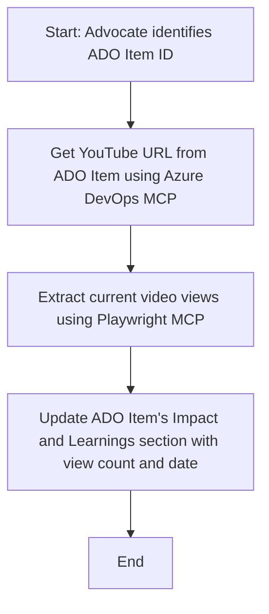

<!--
CO_OP_TRANSLATOR_METADATA:
{
  "original_hash": "14a2dfbea55ef735660a06bd6bdfe5f3",
  "translation_date": "2025-07-14T06:08:32+00:00",
  "source_file": "09-CaseStudy/UpdateADOItemsFromYT.md",
  "language_code": "de"
}
-->
# Fallstudie: Aktualisierung von Azure DevOps-Elementen mit YouTube-Daten mittels MCP

> **Disclaimer:** Es gibt bereits Online-Tools und Berichte, die den Prozess der Aktualisierung von Azure DevOps-Elementen mit Daten von Plattformen wie YouTube automatisieren können. Das folgende Szenario dient ausschließlich als Beispiel, um zu zeigen, wie MCP-Tools für Automatisierungs- und Integrationsaufgaben eingesetzt werden können.

## Überblick

Diese Fallstudie zeigt ein Beispiel dafür, wie das Model Context Protocol (MCP) und seine Tools genutzt werden können, um den Prozess der Aktualisierung von Azure DevOps (ADO) Arbeitselementen mit Informationen aus Online-Plattformen wie YouTube zu automatisieren. Das beschriebene Szenario ist nur eine von vielen Möglichkeiten, wie diese Tools flexibel für ähnliche Automatisierungsanforderungen eingesetzt werden können.

In diesem Beispiel verfolgt ein Advocate Online-Sessions mithilfe von ADO-Elementen, wobei jedes Element eine YouTube-Video-URL enthält. Durch den Einsatz der MCP-Tools kann der Advocate die ADO-Elemente automatisch und wiederholbar mit den neuesten Videostatistiken, wie etwa der Anzahl der Aufrufe, aktualisieren. Dieser Ansatz lässt sich auf weitere Anwendungsfälle übertragen, bei denen Informationen aus Online-Quellen in ADO oder andere Systeme integriert werden müssen.

## Szenario

Ein Advocate ist dafür verantwortlich, die Wirkung von Online-Sessions und Community-Engagements zu verfolgen. Jede Session wird als ADO-Arbeitselement im Projekt „DevRel“ erfasst, wobei das Arbeitselement ein Feld für die YouTube-Video-URL enthält. Um die Reichweite der Session genau zu berichten, muss der Advocate das ADO-Element mit der aktuellen Anzahl der Videoaufrufe und dem Datum der Datenerfassung aktualisieren.

## Verwendete Tools

- [Azure DevOps MCP](https://github.com/microsoft/azure-devops-mcp): Ermöglicht den programmatischen Zugriff auf und die Aktualisierung von ADO-Arbeitselementen über MCP.
- [Playwright MCP](https://github.com/microsoft/playwright-mcp): Automatisiert Browseraktionen, um Live-Daten von Webseiten wie YouTube-Video-Statistiken zu extrahieren.

## Schritt-für-Schritt Arbeitsablauf

1. **ADO-Element identifizieren**: Beginne mit der ADO-Arbeitselement-ID (z. B. 1234) im Projekt „DevRel“.
2. **YouTube-URL abrufen**: Nutze das Azure DevOps MCP-Tool, um die YouTube-URL aus dem Arbeitselement auszulesen.
3. **Videoaufrufe extrahieren**: Verwende das Playwright MCP-Tool, um die YouTube-URL aufzurufen und die aktuelle Anzahl der Aufrufe zu ermitteln.
4. **ADO-Element aktualisieren**: Schreibe die aktuelle Anzahl der Aufrufe und das Abrufdatum in den Abschnitt „Impact and Learnings“ des ADO-Arbeitselements mit dem Azure DevOps MCP-Tool.

## Beispiel Prompt

```bash
- Work with the ADO Item ID: 1234
- The project is '2025-Awesome'
- Get the YouTube URL for the ADO item
- Use Playwright to get the current views from the YouTube video
- Update the ADO item with the current video views and the updated date of the information
```

## Mermaid-Flussdiagramm



## Technische Umsetzung

- **MCP-Orchestrierung**: Der Workflow wird von einem MCP-Server gesteuert, der die Nutzung der Azure DevOps MCP- und Playwright MCP-Tools koordiniert.
- **Automatisierung**: Der Prozess kann manuell ausgelöst oder so geplant werden, dass er in regelmäßigen Abständen läuft, um die ADO-Elemente aktuell zu halten.
- **Erweiterbarkeit**: Das gleiche Muster lässt sich erweitern, um ADO-Elemente mit weiteren Online-Metriken (z. B. Likes, Kommentare) oder von anderen Plattformen zu aktualisieren.

## Ergebnisse und Auswirkungen

- **Effizienz**: Verringert den manuellen Aufwand für Advocates durch Automatisierung der Erfassung und Aktualisierung von Videostatistiken.
- **Genauigkeit**: Stellt sicher, dass ADO-Elemente stets die aktuellsten verfügbaren Daten aus Online-Quellen widerspiegeln.
- **Wiederholbarkeit**: Bietet einen wiederverwendbaren Workflow für ähnliche Szenarien mit anderen Datenquellen oder Metriken.

## Referenzen

- [Azure DevOps MCP](https://github.com/microsoft/azure-devops-mcp)
- [Playwright MCP](https://github.com/microsoft/playwright-mcp)
- [Model Context Protocol (MCP)](https://modelcontextprotocol.io/)

**Haftungsausschluss**:  
Dieses Dokument wurde mit dem KI-Übersetzungsdienst [Co-op Translator](https://github.com/Azure/co-op-translator) übersetzt. Obwohl wir uns um Genauigkeit bemühen, beachten Sie bitte, dass automatisierte Übersetzungen Fehler oder Ungenauigkeiten enthalten können. Das Originaldokument in seiner Ursprungssprache ist als maßgebliche Quelle zu betrachten. Für wichtige Informationen wird eine professionelle menschliche Übersetzung empfohlen. Wir übernehmen keine Haftung für Missverständnisse oder Fehlinterpretationen, die aus der Nutzung dieser Übersetzung entstehen.