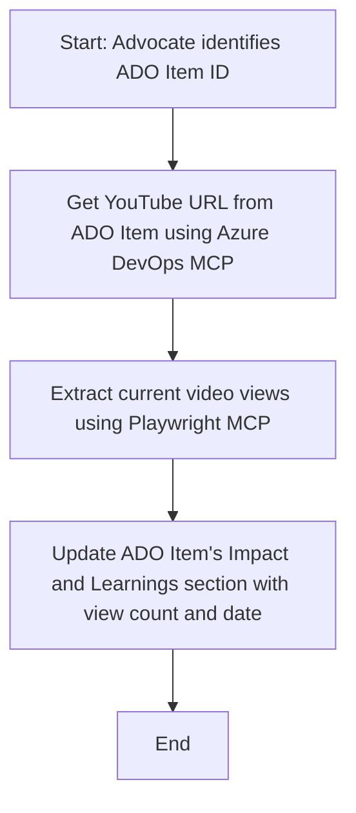

<!--
CO_OP_TRANSLATOR_METADATA:
{
  "original_hash": "14a2dfbea55ef735660a06bd6bdfe5f3",
  "translation_date": "2025-06-13T21:30:46+00:00",
  "source_file": "09-CaseStudy/UpdateADOItemsFromYT.md",
  "language_code": "de"
}
-->
# Fallstudie: Aktualisierung von Azure DevOps-Elementen mit YouTube-Daten mithilfe von MCP

> **Haftungsausschluss:** Es gibt bereits Online-Tools und Berichte, die den Prozess der Aktualisierung von Azure DevOps-Elementen mit Daten von Plattformen wie YouTube automatisieren können. Das folgende Szenario dient ausschließlich als Beispiel, um zu veranschaulichen, wie MCP-Tools für Automatisierungs- und Integrationsaufgaben eingesetzt werden können.

## Überblick

Diese Fallstudie zeigt ein Beispiel dafür, wie das Model Context Protocol (MCP) und seine Tools verwendet werden können, um den Prozess der Aktualisierung von Azure DevOps (ADO) Arbeitselementen mit Informationen aus Online-Plattformen wie YouTube zu automatisieren. Das beschriebene Szenario ist nur eine von vielen Möglichkeiten, wie diese Tools flexibel für ähnliche Automatisierungsanforderungen eingesetzt werden können.

In diesem Beispiel verfolgt ein Advocate Online-Sitzungen mithilfe von ADO-Elementen, wobei jedes Element eine YouTube-Video-URL enthält. Durch den Einsatz der MCP-Tools kann der Advocate die ADO-Elemente stets mit den neuesten Videostatistiken, wie z. B. der Anzahl der Aufrufe, auf dem aktuellen Stand halten – und das auf wiederholbare und automatisierte Weise. Dieser Ansatz lässt sich auf andere Anwendungsfälle übertragen, bei denen Informationen aus Online-Quellen in ADO oder andere Systeme integriert werden müssen.

## Szenario

Ein Advocate ist dafür verantwortlich, die Wirkung von Online-Sitzungen und Community-Aktivitäten zu verfolgen. Jede Sitzung wird als ADO-Arbeitselement im Projekt „DevRel“ erfasst, und das Arbeitselement enthält ein Feld für die YouTube-Video-URL. Um die Reichweite der Sitzung genau zu dokumentieren, muss der Advocate das ADO-Element mit der aktuellen Anzahl der Videoaufrufe und dem Datum der Datenabfrage aktualisieren.

## Verwendete Tools

- [Azure DevOps MCP](https://github.com/microsoft/azure-devops-mcp): Ermöglicht den programmgesteuerten Zugriff auf ADO-Arbeitselemente und deren Aktualisierung über MCP.
- [Playwright MCP](https://github.com/microsoft/playwright-mcp): Automatisiert Browseraktionen, um Live-Daten von Webseiten wie YouTube-Videostatistiken zu extrahieren.

## Schritt-für-Schritt-Ablauf

1. **ADO-Element identifizieren**: Beginne mit der ADO-Arbeitselement-ID (z. B. 1234) im Projekt „DevRel“.
2. **YouTube-URL abrufen**: Nutze das Azure DevOps MCP-Tool, um die YouTube-URL aus dem Arbeitselement auszulesen.
3. **Videoaufrufe extrahieren**: Verwende das Playwright MCP-Tool, um zur YouTube-URL zu navigieren und die aktuelle Anzahl der Aufrufe zu ermitteln.
4. **ADO-Element aktualisieren**: Schreibe die neuesten Aufrufzahlen und das Abrufdatum in den Abschnitt „Impact and Learnings“ des ADO-Arbeitselements mit dem Azure DevOps MCP-Tool.

## Beispielaufforderung

```bash
- Work with the ADO Item ID: 1234
- The project is '2025-Awesome'
- Get the YouTube URL for the ADO item
- Use Playwright to get the current views from the YouTube video
- Update the ADO item with the current video views and the updated date of the information
```

## Mermaid-Flussdiagramm



## Technische Umsetzung

- **MCP-Orchestrierung**: Der Ablauf wird von einem MCP-Server gesteuert, der die Nutzung der Azure DevOps MCP- und Playwright MCP-Tools koordiniert.
- **Automatisierung**: Der Prozess kann manuell ausgelöst oder zeitgesteuert ausgeführt werden, um die ADO-Elemente stets aktuell zu halten.
- **Erweiterbarkeit**: Das gleiche Muster lässt sich erweitern, um ADO-Elemente mit weiteren Online-Metriken (z. B. Likes, Kommentare) oder von anderen Plattformen zu aktualisieren.

## Ergebnisse und Auswirkungen

- **Effizienz**: Verringert den manuellen Aufwand für Advocates durch Automatisierung der Abfrage und Aktualisierung von Videostatistiken.
- **Genauigkeit**: Stellt sicher, dass ADO-Elemente stets die aktuellsten verfügbaren Daten aus Online-Quellen widerspiegeln.
- **Wiederholbarkeit**: Bietet einen wiederverwendbaren Workflow für ähnliche Szenarien mit anderen Datenquellen oder Metriken.

## Referenzen

- [Azure DevOps MCP](https://github.com/microsoft/azure-devops-mcp)
- [Playwright MCP](https://github.com/microsoft/playwright-mcp)
- [Model Context Protocol (MCP)](https://modelcontextprotocol.io/)

**Haftungsausschluss**:  
Dieses Dokument wurde mit dem KI-Übersetzungsdienst [Co-op Translator](https://github.com/Azure/co-op-translator) übersetzt. Obwohl wir auf Genauigkeit achten, beachten Sie bitte, dass automatisierte Übersetzungen Fehler oder Ungenauigkeiten enthalten können. Das Originaldokument in seiner Ursprungssprache ist als maßgebliche Quelle zu betrachten. Für wichtige Informationen wird eine professionelle menschliche Übersetzung empfohlen. Wir übernehmen keine Haftung für Missverständnisse oder Fehlinterpretationen, die aus der Verwendung dieser Übersetzung entstehen.