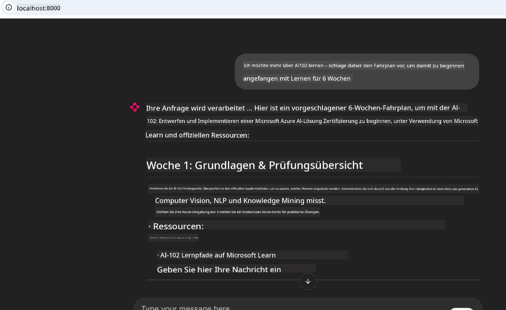
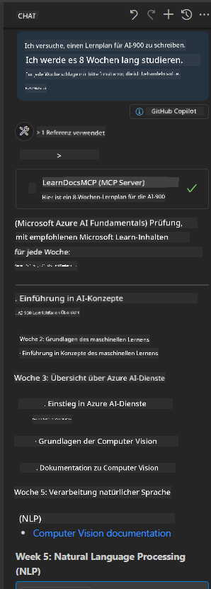

<!--
CO_OP_TRANSLATOR_METADATA:
{
  "original_hash": "4319d291c9d124ecafea52b3d04bfa0e",
  "translation_date": "2025-07-14T06:17:40+00:00",
  "source_file": "09-CaseStudy/docs-mcp/README.md",
  "language_code": "de"
}
-->
# Fallstudie: Verbindung zum Microsoft Learn Docs MCP-Server von einem Client aus

Haben Sie sich schon einmal dabei erwischt, wie Sie zwischen Dokumentationsseiten, Stack Overflow und unzähligen Suchmaschinen-Tabs hin- und herwechseln, während Sie versuchen, ein Problem in Ihrem Code zu lösen? Vielleicht nutzen Sie einen zweiten Monitor nur für die Dokumentation oder wechseln ständig per Alt-Tab zwischen Ihrer IDE und dem Browser. Wäre es nicht besser, wenn Sie die Dokumentation direkt in Ihren Workflow integrieren könnten – eingebettet in Ihre Apps, Ihre IDE oder sogar Ihre eigenen Tools? In dieser Fallstudie zeigen wir Ihnen, wie Sie genau das tun können, indem Sie direkt von Ihrer eigenen Client-Anwendung aus eine Verbindung zum Microsoft Learn Docs MCP-Server herstellen.

## Überblick

Moderne Entwicklung bedeutet mehr als nur Code zu schreiben – es geht darum, zur richtigen Zeit die richtigen Informationen zu finden. Dokumentation ist überall, aber selten dort, wo man sie am meisten braucht: direkt in den Tools und Workflows. Indem Sie die Dokumentationsabfrage direkt in Ihre Anwendungen integrieren, sparen Sie Zeit, reduzieren das ständige Wechseln des Kontexts und steigern Ihre Produktivität. In diesem Abschnitt zeigen wir Ihnen, wie Sie einen Client mit dem Microsoft Learn Docs MCP-Server verbinden, um kontextbezogene, aktuelle Dokumentation in Echtzeit zu erhalten – ohne Ihre App zu verlassen.

Wir führen Sie durch den Prozess, eine Verbindung herzustellen, eine Anfrage zu senden und Streaming-Antworten effizient zu verarbeiten. Dieser Ansatz optimiert nicht nur Ihren Workflow, sondern eröffnet auch die Möglichkeit, intelligentere und hilfreichere Entwickler-Tools zu bauen.

## Lernziele

Warum machen wir das? Weil die besten Entwicklererfahrungen diejenigen sind, die Reibungspunkte beseitigen. Stellen Sie sich eine Welt vor, in der Ihr Code-Editor, Chatbot oder Ihre Web-App Ihre Dokumentationsfragen sofort beantwortet – mit den neuesten Inhalten von Microsoft Learn. Am Ende dieses Kapitels werden Sie wissen, wie Sie:

- Die Grundlagen der MCP-Server-Client-Kommunikation für Dokumentation verstehen
- Eine Konsolen- oder Webanwendung implementieren, die sich mit dem Microsoft Learn Docs MCP-Server verbindet
- Streaming-HTTP-Clients für die Echtzeit-Dokumentationsabfrage nutzen
- Dokumentationsantworten in Ihrer Anwendung protokollieren und interpretieren

Sie werden sehen, wie diese Fähigkeiten Ihnen helfen, Tools zu entwickeln, die nicht nur reaktiv, sondern wirklich interaktiv und kontextbewusst sind.

## Szenario 1 – Echtzeit-Dokumentationsabfrage mit MCP

In diesem Szenario zeigen wir Ihnen, wie Sie einen Client mit dem Microsoft Learn Docs MCP-Server verbinden, um kontextbezogene, aktuelle Dokumentation in Echtzeit zu erhalten – ohne Ihre App zu verlassen.

Setzen wir das in die Praxis um. Ihre Aufgabe ist es, eine App zu schreiben, die sich mit dem Microsoft Learn Docs MCP-Server verbindet, das Tool `microsoft_docs_search` aufruft und die Streaming-Antwort in der Konsole protokolliert.

### Warum dieser Ansatz?
Weil er die Grundlage für fortgeschrittene Integrationen bildet – egal, ob Sie einen Chatbot, eine IDE-Erweiterung oder ein Web-Dashboard betreiben möchten.

Den Code und die Anleitungen für dieses Szenario finden Sie im Ordner [`solution`](./solution/README.md) dieser Fallstudie. Die Schritte führen Sie durch die Einrichtung der Verbindung:
- Verwenden Sie das offizielle MCP SDK und einen streamfähigen HTTP-Client für die Verbindung
- Rufen Sie das Tool `microsoft_docs_search` mit einem Abfrageparameter auf, um Dokumentation abzurufen
- Implementieren Sie eine ordnungsgemäße Protokollierung und Fehlerbehandlung
- Erstellen Sie eine interaktive Konsolenschnittstelle, die es Nutzern erlaubt, mehrere Suchanfragen einzugeben

Dieses Szenario zeigt, wie man:
- Eine Verbindung zum Docs MCP-Server herstellt
- Eine Abfrage sendet
- Die Ergebnisse parst und ausgibt

So könnte die Ausführung der Lösung aussehen:

```
Prompt> What is Azure Key Vault?
Answer> Azure Key Vault is a cloud service for securely storing and accessing secrets. ...
```

Nachfolgend finden Sie eine minimalistische Beispiel-Lösung. Der vollständige Code und weitere Details sind im Lösung-Ordner verfügbar.

<details>
<summary>Python</summary>

```python
import asyncio
from mcp.client.streamable_http import streamablehttp_client
from mcp import ClientSession

async def main():
    async with streamablehttp_client("https://learn.microsoft.com/api/mcp") as (read_stream, write_stream, _):
        async with ClientSession(read_stream, write_stream) as session:
            await session.initialize()
            result = await session.call_tool("microsoft_docs_search", {"query": "Azure Functions best practices"})
            print(result.content)

if __name__ == "__main__":
    asyncio.run(main())
```

- Für die vollständige Implementierung und Protokollierung siehe [`scenario1.py`](../../../../09-CaseStudy/docs-mcp/solution/python/scenario1.py).
- Für Installations- und Nutzungshinweise siehe die Datei [`README.md`](./solution/python/README.md) im selben Ordner.
</details>

## Szenario 2 – Interaktive Web-App zur Erstellung von Lernplänen mit MCP

In diesem Szenario lernen Sie, wie Sie Docs MCP in ein Webentwicklungsprojekt integrieren. Ziel ist es, Nutzern zu ermöglichen, Microsoft Learn-Dokumentation direkt über eine Weboberfläche zu durchsuchen, sodass die Dokumentation sofort innerhalb Ihrer App oder Website zugänglich ist.

Sie erfahren, wie Sie:
- Eine Web-App einrichten
- Eine Verbindung zum Docs MCP-Server herstellen
- Benutzereingaben verarbeiten und Ergebnisse anzeigen

So könnte die Ausführung der Lösung aussehen:

```
User> I want to learn about AI102 - so suggest the roadmap to get it started from learn for 6 weeks

Assistant> Here’s a detailed 6-week roadmap to start your preparation for the AI-102: Designing and Implementing a Microsoft Azure AI Solution certification, using official Microsoft resources and focusing on exam skills areas:

---
## Week 1: Introduction & Fundamentals
- **Understand the Exam**: Review the [AI-102 exam skills outline](https://learn.microsoft.com/en-us/credentials/certifications/exams/ai-102/).
- **Set up Azure**: Sign up for a free Azure account if you don't have one.
- **Learning Path**: [Introduction to Azure AI services](https://learn.microsoft.com/en-us/training/modules/intro-to-azure-ai/)
- **Focus**: Get familiar with Azure portal, AI capabilities, and necessary tools.

....more weeks of the roadmap...

Let me know if you want module-specific recommendations or need more customized weekly tasks!
```

Nachfolgend finden Sie eine minimalistische Beispiel-Lösung. Der vollständige Code und weitere Details sind im Lösung-Ordner verfügbar.



<details>
<summary>Python (Chainlit)</summary>

Chainlit ist ein Framework zum Erstellen von konversationellen KI-Web-Apps. Es erleichtert die Entwicklung interaktiver Chatbots und Assistenten, die MCP-Tools aufrufen und Ergebnisse in Echtzeit anzeigen können. Ideal für schnelles Prototyping und benutzerfreundliche Oberflächen.

```python
import chainlit as cl
import requests

MCP_URL = "https://learn.microsoft.com/api/mcp"

@cl.on_message
def handle_message(message):
    query = {"question": message}
    response = requests.post(MCP_URL, json=query)
    if response.ok:
        result = response.json()
        cl.Message(content=result.get("answer", "No answer found.")).send()
    else:
        cl.Message(content="Error: " + response.text).send()
```

- Für die vollständige Implementierung siehe [`scenario2.py`](../../../../09-CaseStudy/docs-mcp/solution/python/scenario2.py).
- Für Setup- und Ausführungsanweisungen siehe die Datei [`README.md`](./solution/python/README.md).
</details>

## Szenario 3: In-Editor-Dokumentation mit MCP-Server in VS Code

Wenn Sie Microsoft Learn Docs direkt in VS Code nutzen möchten (statt ständig zwischen Browser-Tabs zu wechseln), können Sie den MCP-Server in Ihrem Editor verwenden. Damit können Sie:
- Dokumentation in VS Code durchsuchen und lesen, ohne die Entwicklungsumgebung zu verlassen.
- Dokumentationsreferenzen einfügen und Links direkt in Ihre README- oder Kursdateien einfügen.
- GitHub Copilot und MCP zusammen für einen nahtlosen, KI-gestützten Dokumentationsworkflow nutzen.

**Sie lernen, wie Sie:**
- Eine gültige `.vscode/mcp.json`-Datei im Stammverzeichnis Ihres Arbeitsbereichs hinzufügen (siehe Beispiel unten).
- Das MCP-Panel öffnen oder die Befehlspalette in VS Code nutzen, um Dokumentation zu suchen und einzufügen.
- Dokumentation direkt in Ihren Markdown-Dateien referenzieren, während Sie arbeiten.
- Diesen Workflow mit GitHub Copilot kombinieren, um noch produktiver zu sein.

Hier ein Beispiel, wie Sie den MCP-Server in VS Code einrichten:

```json
{
  "servers": {
    "LearnDocsMCP": {
      "url": "https://learn.microsoft.com/api/mcp"
    }
  }
}
```

</details>

> Für eine ausführliche Schritt-für-Schritt-Anleitung mit Screenshots siehe [`README.md`](./solution/scenario3/README.md).



Dieser Ansatz ist ideal für alle, die technische Kurse erstellen, Dokumentation schreiben oder Code mit häufigen Referenzanforderungen entwickeln.

## Wichtige Erkenntnisse

Die direkte Integration von Dokumentation in Ihre Tools ist nicht nur praktisch – sie verändert die Produktivität grundlegend. Durch die Verbindung zum Microsoft Learn Docs MCP-Server von Ihrem Client aus können Sie:

- Das ständige Wechseln zwischen Code und Dokumentation vermeiden
- Aktuelle, kontextbezogene Dokumentation in Echtzeit abrufen
- Intelligente, interaktive Entwickler-Tools erstellen

Diese Fähigkeiten helfen Ihnen, Lösungen zu entwickeln, die nicht nur effizient, sondern auch angenehm zu nutzen sind.

## Zusätzliche Ressourcen

Um Ihr Wissen zu vertiefen, empfehlen wir diese offiziellen Ressourcen:

- [Microsoft Learn Docs MCP Server (GitHub)](https://github.com/MicrosoftDocs/mcp)
- [Erste Schritte mit Azure MCP Server (mcp-python)](https://learn.microsoft.com/en-us/azure/developer/azure-mcp-server/get-started#create-the-python-app)
- [Was ist der Azure MCP Server?](https://learn.microsoft.com/en-us/azure/developer/azure-mcp-server/)
- [Model Context Protocol (MCP) Einführung](https://modelcontextprotocol.io/introduction)
- [Plugins von einem MCP Server hinzufügen (Python)](https://learn.microsoft.com/en-us/semantic-kernel/concepts/plugins/adding-mcp-plugins)

**Haftungsausschluss**:  
Dieses Dokument wurde mit dem KI-Übersetzungsdienst [Co-op Translator](https://github.com/Azure/co-op-translator) übersetzt. Obwohl wir auf Genauigkeit achten, beachten Sie bitte, dass automatisierte Übersetzungen Fehler oder Ungenauigkeiten enthalten können. Das Originaldokument in seiner Ursprungssprache ist als maßgebliche Quelle zu betrachten. Für wichtige Informationen wird eine professionelle menschliche Übersetzung empfohlen. Wir übernehmen keine Haftung für Missverständnisse oder Fehlinterpretationen, die aus der Nutzung dieser Übersetzung entstehen.