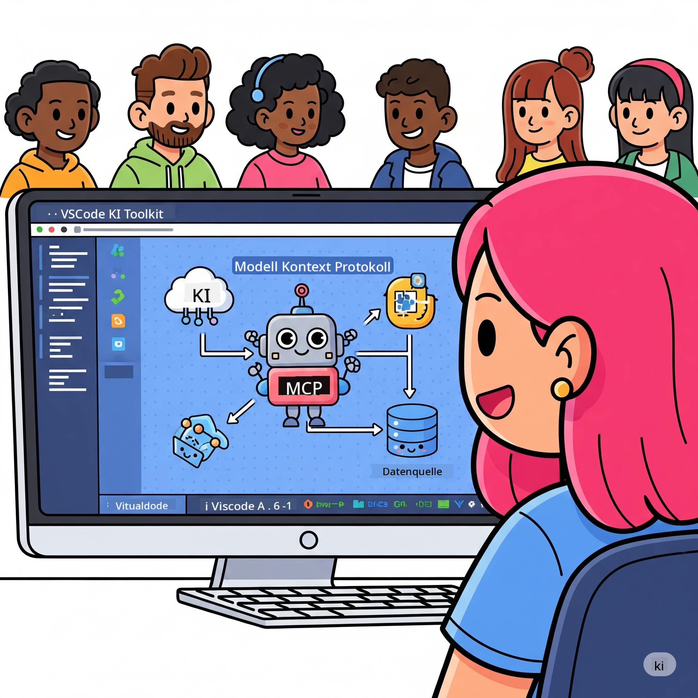
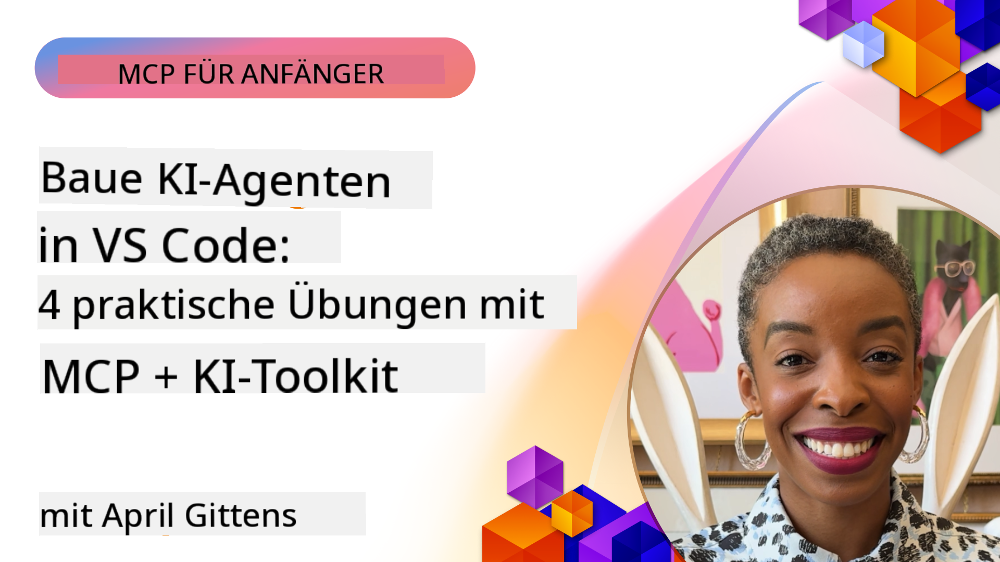

<!--
CO_OP_TRANSLATOR_METADATA:
{
  "original_hash": "1b000fd6e1b04c047578bfc5d07d54eb",
  "translation_date": "2025-07-29T01:03:38+00:00",
  "source_file": "10-StreamliningAIWorkflowsBuildingAnMCPServerWithAIToolkit/README.md",
  "language_code": "de"
}
-->
# Optimierung von KI-Workflows: Aufbau eines MCP-Servers mit AI Toolkit

## 🎯 Überblick

_(Klicken Sie auf das Bild oben, um das Video dieser Lektion anzusehen)_

Willkommen zum **Model Context Protocol (MCP) Workshop**! Dieser umfassende praktische Workshop kombiniert zwei bahnbrechende Technologien, um die Entwicklung von KI-Anwendungen zu revolutionieren:

- **🔗 Model Context Protocol (MCP)**: Ein offener Standard für nahtlose Integration von KI-Tools
- **🛠️ AI Toolkit für Visual Studio Code (AITK)**: Microsofts leistungsstarke Erweiterung für die KI-Entwicklung

### 🎓 Was Sie lernen werden

Am Ende dieses Workshops beherrschen Sie die Kunst, intelligente Anwendungen zu entwickeln, die KI-Modelle mit realen Tools und Diensten verbinden. Von automatisierten Tests bis hin zu benutzerdefinierten API-Integrationen erwerben Sie praktische Fähigkeiten, um komplexe geschäftliche Herausforderungen zu lösen.

## 🏗️ Technologiestack

### 🔌 Model Context Protocol (MCP)

MCP ist das **"USB-C für KI"** - ein universeller Standard, der KI-Modelle mit externen Tools und Datenquellen verbindet.

**✨ Hauptmerkmale:**

- 🔄 **Standardisierte Integration**: Universelle Schnittstelle für KI-Tool-Verbindungen
- 🏛️ **Flexible Architektur**: Lokale und entfernte Server über stdio/SSE-Transport
- 🧰 **Reiches Ökosystem**: Tools, Prompts und Ressourcen in einem Protokoll
- 🔒 **Unternehmensbereit**: Eingebaute Sicherheit und Zuverlässigkeit

**🎯 Warum MCP wichtig ist:**
Wie USB-C das Kabelchaos beseitigt hat, eliminiert MCP die Komplexität von KI-Integrationen. Ein Protokoll, unendliche Möglichkeiten.

### 🤖 AI Toolkit für Visual Studio Code (AITK)

Microsofts führende Erweiterung für die KI-Entwicklung, die VS Code in ein KI-Kraftpaket verwandelt.

**🚀 Kernfunktionen:**

- 📦 **Modellkatalog**: Zugriff auf Modelle von Azure AI, GitHub, Hugging Face, Ollama
- ⚡ **Lokale Inferenz**: ONNX-optimierte CPU/GPU/NPU-Ausführung
- 🏗️ **Agent Builder**: Visuelle Entwicklung von KI-Agenten mit MCP-Integration
- 🎭 **Multimodal**: Unterstützung für Text, Vision und strukturierte Ausgaben

**💡 Vorteile für die Entwicklung:**

- Modellbereitstellung ohne Konfiguration
- Visuelles Prompt-Engineering
- Echtzeit-Testumgebung
- Nahtlose Integration von MCP-Servern

## 📚 Lernreise

### [🚀 Modul 1: Grundlagen des AI Toolkits](./lab1/README.md)

**Dauer**: 15 Minuten

- 🛠️ Installation und Konfiguration des AI Toolkits für VS Code
- 🗂️ Erkundung des Modellkatalogs (100+ Modelle von GitHub, ONNX, OpenAI, Anthropic, Google)
- 🎮 Beherrschung des interaktiven Testbereichs für Echtzeit-Modelltests
- 🤖 Erstellung Ihres ersten KI-Agenten mit dem Agent Builder
- 📊 Bewertung der Modellleistung mit integrierten Metriken (F1, Relevanz, Ähnlichkeit, Kohärenz)
- ⚡ Lernen von Batch-Verarbeitung und multimodalen Unterstützungsmöglichkeiten

**🎯 Lernziel**: Erstellen eines funktionalen KI-Agenten mit umfassendem Verständnis der AITK-Funktionen

### [🌐 Modul 2: Grundlagen von MCP mit AI Toolkit](./lab2/README.md)

**Dauer**: 20 Minuten

- 🧠 Beherrschung der Architektur und Konzepte des Model Context Protocol (MCP)
- 🌐 Erkundung des MCP-Server-Ökosystems von Microsoft
- 🤖 Erstellung eines Browser-Automatisierungsagenten mit Playwright MCP-Server
- 🔧 Integration von MCP-Servern mit dem AI Toolkit Agent Builder
- 📊 Konfiguration und Test von MCP-Tools innerhalb Ihrer Agenten
- 🚀 Export und Bereitstellung von MCP-gestützten Agenten für den Produktionseinsatz

**🎯 Lernziel**: Bereitstellung eines KI-Agenten, der durch externe Tools über MCP erweitert wird

### [🔧 Modul 3: Fortgeschrittene MCP-Entwicklung mit AI Toolkit](./lab3/README.md)

**Dauer**: 20 Minuten

- 💻 Erstellung benutzerdefinierter MCP-Server mit AI Toolkit
- 🐍 Konfiguration und Nutzung des neuesten MCP Python SDK (v1.9.3)
- 🔍 Einrichtung und Nutzung des MCP Inspectors für Debugging
- 🛠️ Erstellung eines Wetter-MCP-Servers mit professionellen Debugging-Workflows
- 🧪 Debugging von MCP-Servern in sowohl Agent Builder als auch Inspector-Umgebungen

**🎯 Lernziel**: Entwicklung und Debugging benutzerdefinierter MCP-Server mit modernen Tools

### [🐙 Modul 4: Praktische MCP-Entwicklung - Benutzerdefinierter GitHub Clone Server](./lab4/README.md)

**Dauer**: 30 Minuten

- 🏗️ Erstellung eines realen GitHub Clone MCP-Servers für Entwicklungs-Workflows
- 🔄 Implementierung intelligenter Repository-Klonung mit Validierung und Fehlerbehandlung
- 📁 Erstellung intelligenter Verzeichnisverwaltung und VS Code-Integration
- 🤖 Nutzung des GitHub Copilot Agent Mode mit benutzerdefinierten MCP-Tools
- 🛡️ Anwendung produktionsreifer Zuverlässigkeit und plattformübergreifender Kompatibilität

**🎯 Lernziel**: Bereitstellung eines produktionsreifen MCP-Servers, der reale Entwicklungs-Workflows optimiert

## 💡 Anwendungen & Auswirkungen in der Praxis

### 🏢 Einsatzmöglichkeiten in Unternehmen

#### 🔄 DevOps-Automatisierung

Transformieren Sie Ihren Entwicklungs-Workflow mit intelligenter Automatisierung:

- **Intelligente Repository-Verwaltung**: KI-gestützte Code-Review- und Merge-Entscheidungen
- **Intelligente CI/CD**: Automatische Optimierung von Pipelines basierend auf Codeänderungen
- **Problemeinstufung**: Automatische Klassifizierung und Zuweisung von Fehlern

#### 🧪 Revolution der Qualitätssicherung

Verbessern Sie Tests mit KI-gestützter Automatisierung:

- **Intelligente Testgenerierung**: Automatische Erstellung umfassender Test-Suites
- **Visuelles Regressionstesten**: KI-gestützte Erkennung von UI-Änderungen
- **Leistungsüberwachung**: Proaktive Identifizierung und Lösung von Problemen

#### 📊 Intelligenz in Datenpipelines

Erstellen Sie intelligentere Datenverarbeitungs-Workflows:

- **Adaptive ETL-Prozesse**: Selbstoptimierende Datenumwandlungen
- **Anomalieerkennung**: Echtzeitüberwachung der Datenqualität
- **Intelligentes Routing**: Smarte Verwaltung des Datenflusses

#### 🎧 Verbesserung der Kundenerfahrung

Schaffen Sie außergewöhnliche Kundeninteraktionen:

- **Kontextbewusster Support**: KI-Agenten mit Zugriff auf Kundenhistorie
- **Proaktive Problemlösung**: Vorausschauender Kundenservice
- **Multi-Channel-Integration**: Einheitliches KI-Erlebnis über Plattformen hinweg

## 🛠️ Voraussetzungen & Einrichtung

### 💻 Systemanforderungen

| Komponente | Anforderung | Hinweise |
|------------|-------------|----------|
| **Betriebssystem** | Windows 10+, macOS 10.15+, Linux | Jedes moderne Betriebssystem |
| **Visual Studio Code** | Neueste stabile Version | Erforderlich für AITK |
| **Node.js** | v18.0+ und npm | Für die Entwicklung von MCP-Servern |
| **Python** | 3.10+ | Optional für Python-MCP-Server |
| **Speicher** | Mindestens 8GB RAM | 16GB empfohlen für lokale Modelle |

### 🔧 Entwicklungsumgebung

#### Empfohlene VS Code-Erweiterungen

- **AI Toolkit** (ms-windows-ai-studio.windows-ai-studio)
- **Python** (ms-python.python)
- **Python Debugger** (ms-python.debugpy)
- **GitHub Copilot** (GitHub.copilot) - Optional, aber hilfreich

#### Optionale Tools

- **uv**: Moderner Python-Paketmanager
- **MCP Inspector**: Visuelles Debugging-Tool für MCP-Server
- **Playwright**: Für Webautomatisierungsbeispiele

## 🎖️ Lernziele & Zertifizierungspfad

### 🏆 Kompetenz-Checkliste

Durch den Abschluss dieses Workshops erreichen Sie Meisterschaft in:

#### 🎯 Kernkompetenzen

- [ ] **MCP-Protokollbeherrschung**: Tiefes Verständnis von Architektur und Implementierungsmustern
- [ ] **AITK-Fähigkeiten**: Expertenniveau in der Nutzung des AI Toolkits für schnelle Entwicklung
- [ ] **Entwicklung benutzerdefinierter Server**: Erstellung, Bereitstellung und Wartung von produktionsreifen MCP-Servern
- [ ] **Exzellente Tool-Integration**: Nahtlose Verbindung von KI mit bestehenden Entwicklungs-Workflows
- [ ] **Problemlösungsanwendung**: Anwendung der erlernten Fähigkeiten auf reale geschäftliche Herausforderungen

#### 🔧 Technische Fähigkeiten

- [ ] Einrichtung und Konfiguration des AI Toolkits in VS Code
- [ ] Design und Implementierung benutzerdefinierter MCP-Server
- [ ] Integration von GitHub-Modellen mit MCP-Architektur
- [ ] Erstellung automatisierter Test-Workflows mit Playwright
- [ ] Bereitstellung von KI-Agenten für den Produktionseinsatz
- [ ] Debugging und Optimierung der MCP-Serverleistung

#### 🚀 Erweiterte Fähigkeiten

- [ ] Architektur von KI-Integrationen im Unternehmensmaßstab
- [ ] Implementierung von Sicherheitsbest-Practices für KI-Anwendungen
- [ ] Design skalierbarer MCP-Server-Architekturen
- [ ] Erstellung benutzerdefinierter Toolchains für spezifische Domänen
- [ ] Mentoring anderer in KI-nativer Entwicklung

## 📖 Zusätzliche Ressourcen

- [MCP-Spezifikation](https://modelcontextprotocol.io/docs)
- [AI Toolkit GitHub Repository](https://github.com/microsoft/vscode-ai-toolkit)
- [Sammlung von Beispiel-MCP-Servern](https://github.com/modelcontextprotocol/servers)
- [Best-Practices-Leitfaden](https://modelcontextprotocol.io/docs/best-practices)

---

**🚀 Bereit, Ihren KI-Entwicklungs-Workflow zu revolutionieren?**

Lassen Sie uns gemeinsam die Zukunft intelligenter Anwendungen mit MCP und AI Toolkit gestalten!

**Haftungsausschluss**:  
Dieses Dokument wurde mit dem KI-Übersetzungsdienst [Co-op Translator](https://github.com/Azure/co-op-translator) übersetzt. Obwohl wir uns um Genauigkeit bemühen, beachten Sie bitte, dass automatisierte Übersetzungen Fehler oder Ungenauigkeiten enthalten können. Das Originaldokument in seiner ursprünglichen Sprache sollte als maßgebliche Quelle betrachtet werden. Für kritische Informationen wird eine professionelle menschliche Übersetzung empfohlen. Wir übernehmen keine Haftung für Missverständnisse oder Fehlinterpretationen, die sich aus der Nutzung dieser Übersetzung ergeben.