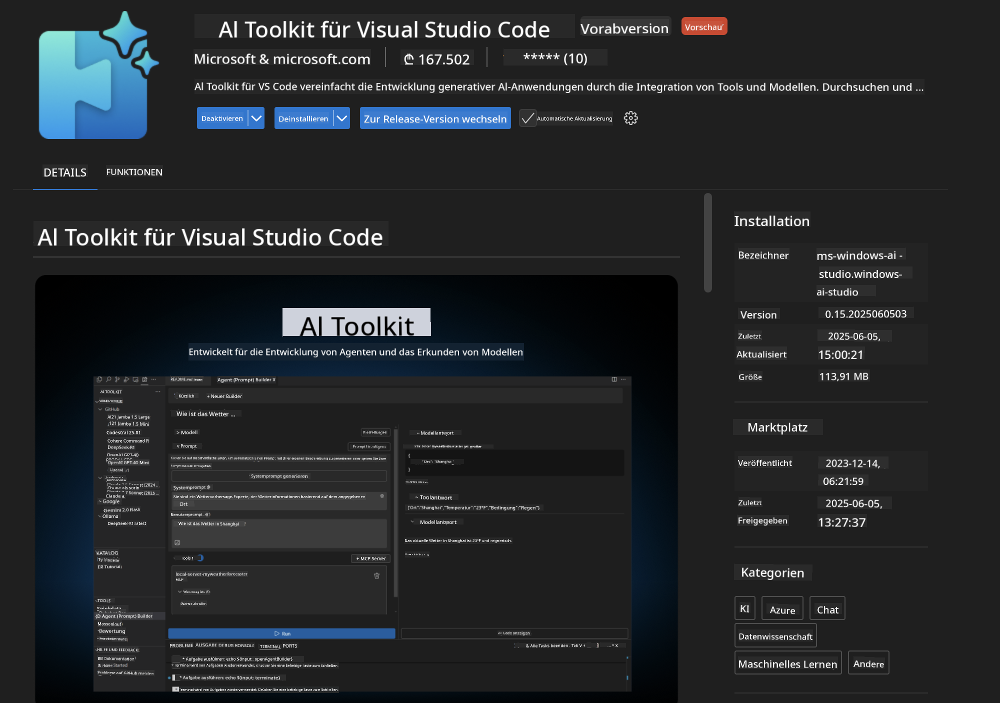
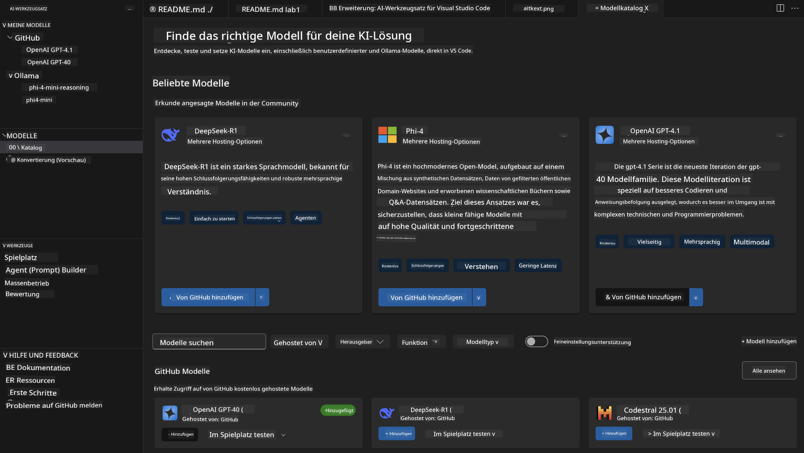
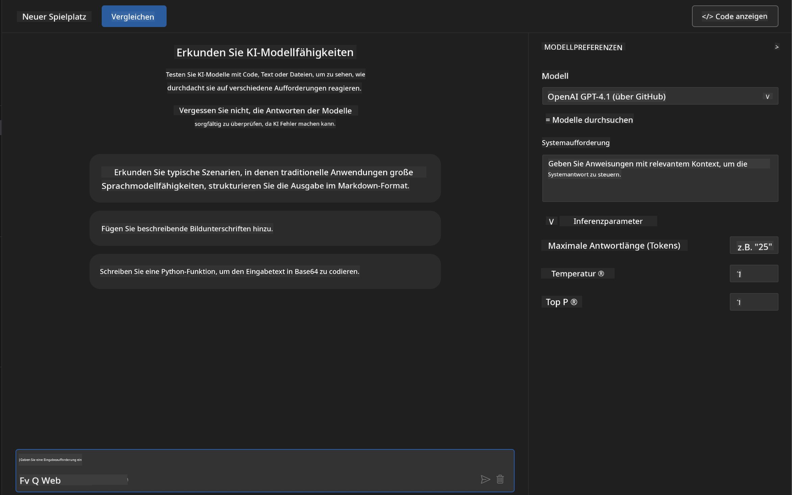
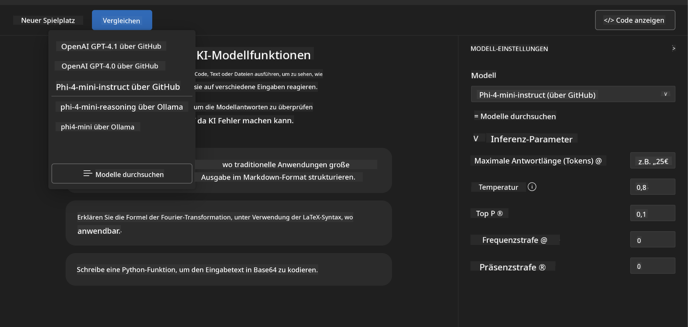
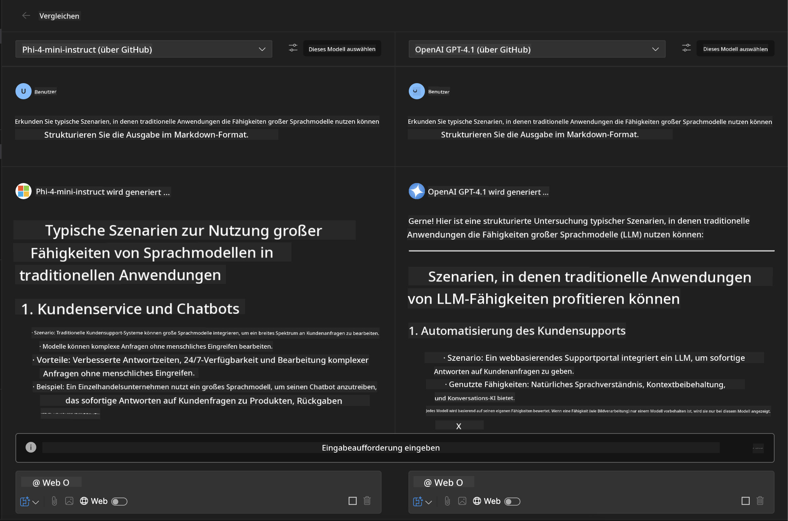
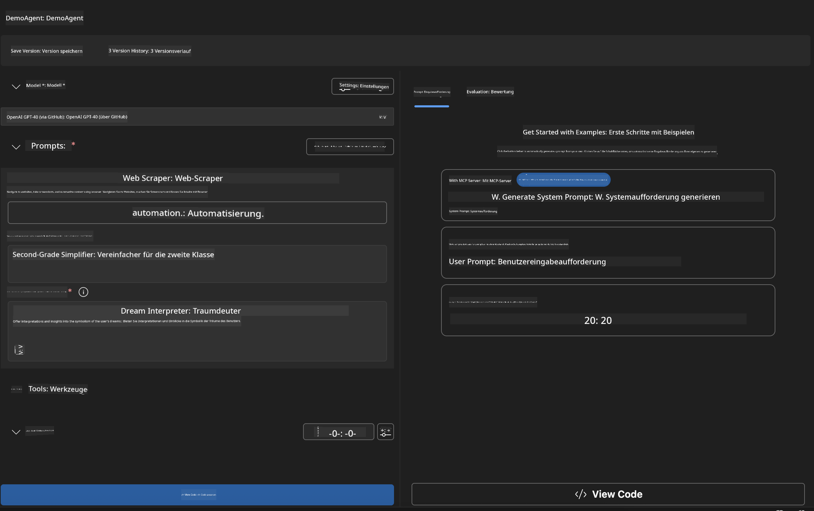
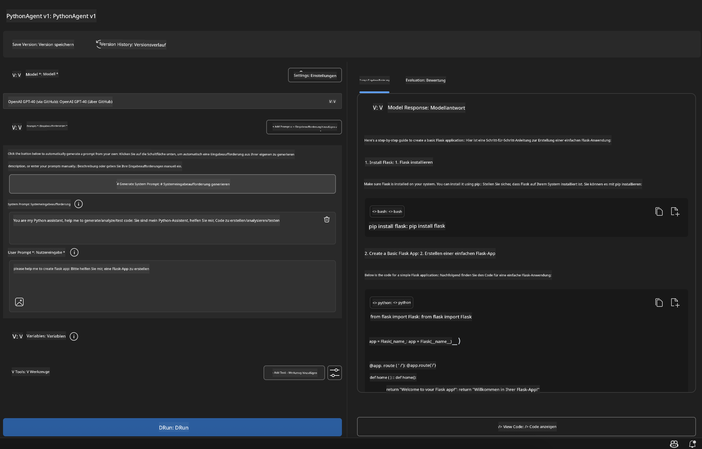

<!--
CO_OP_TRANSLATOR_METADATA:
{
  "original_hash": "2aa9dbc165e104764fa57e8a0d3f1c73",
  "translation_date": "2025-07-14T07:18:13+00:00",
  "source_file": "10-StreamliningAIWorkflowsBuildingAnMCPServerWithAIToolkit/lab1/README.md",
  "language_code": "de"
}
-->
# 🚀 Modul 1: Grundlagen des AI Toolkits

[]()
[]()
[]()

## 📋 Lernziele

Am Ende dieses Moduls wirst du in der Lage sein:
- ✅ AI Toolkit für Visual Studio Code zu installieren und zu konfigurieren
- ✅ Den Model Catalog zu durchsuchen und verschiedene Modellquellen zu verstehen
- ✅ Den Playground für Modelltests und Experimente zu nutzen
- ✅ Eigene KI-Agenten mit dem Agent Builder zu erstellen
- ✅ Modellleistungen verschiedener Anbieter zu vergleichen
- ✅ Best Practices für Prompt Engineering anzuwenden

## 🧠 Einführung in das AI Toolkit (AITK)

Das **AI Toolkit für Visual Studio Code** ist Microsofts Flaggschiff-Erweiterung, die VS Code in eine umfassende Entwicklungsumgebung für KI verwandelt. Es schlägt die Brücke zwischen KI-Forschung und praktischer Anwendungsentwicklung und macht generative KI für Entwickler aller Erfahrungsstufen zugänglich.

### 🌟 Wichtige Funktionen

| Funktion | Beschreibung | Anwendungsfall |
|---------|-------------|----------|
| **🗂️ Model Catalog** | Zugriff auf über 100 Modelle von GitHub, ONNX, OpenAI, Anthropic, Google | Modellentdeckung und -auswahl |
| **🔌 BYOM Support** | Integration eigener Modelle (lokal/remote) | Eigene Modellbereitstellung |
| **🎮 Interaktiver Playground** | Echtzeit-Testen von Modellen mit Chat-Oberfläche | Schnelles Prototyping und Testen |
| **📎 Multi-Modal Support** | Verarbeitung von Text, Bildern und Anhängen | Komplexe KI-Anwendungen |
| **⚡ Batch-Verarbeitung** | Gleichzeitiges Ausführen mehrerer Prompts | Effiziente Testabläufe |
| **📊 Modellevaluation** | Eingebaute Metriken (F1, Relevanz, Ähnlichkeit, Kohärenz) | Leistungsbewertung |

### 🎯 Warum das AI Toolkit wichtig ist

- **🚀 Schnellere Entwicklung**: Von der Idee zum Prototyp in Minuten
- **🔄 Einheitlicher Workflow**: Eine Oberfläche für mehrere KI-Anbieter
- **🧪 Einfaches Experimentieren**: Modelle ohne komplizierte Einrichtung vergleichen
- **📈 Produktionsreif**: Nahtloser Übergang vom Prototyp zur Bereitstellung

## 🛠️ Voraussetzungen & Einrichtung

### 📦 AI Toolkit Erweiterung installieren

**Schritt 1: Zugriff auf den Extensions Marketplace**
1. Öffne Visual Studio Code
2. Gehe zur Erweiterungsansicht (`Ctrl+Shift+X` oder `Cmd+Shift+X`)
3. Suche nach "AI Toolkit"

**Schritt 2: Wähle deine Version**
- **🟢 Release**: Empfohlen für den produktiven Einsatz
- **🔶 Pre-release**: Früher Zugang zu neuesten Funktionen

**Schritt 3: Installation und Aktivierung**



### ✅ Überprüfungsliste
- [ ] AI Toolkit-Symbol erscheint in der VS Code-Seitenleiste
- [ ] Erweiterung ist aktiviert und funktionsfähig
- [ ] Keine Installationsfehler im Ausgabefenster

## 🧪 Praxisübung 1: GitHub-Modelle erkunden

**🎯 Ziel**: Den Model Catalog meistern und dein erstes KI-Modell testen

### 📊 Schritt 1: Den Model Catalog durchsuchen

Der Model Catalog ist dein Zugang zur KI-Welt. Er bündelt Modelle verschiedener Anbieter und erleichtert das Entdecken und Vergleichen.

**🔍 Navigationsanleitung:**

Klicke in der AI Toolkit-Seitenleiste auf **MODELS - Catalog**



**💡 Profi-Tipp**: Achte auf Modelle mit spezifischen Fähigkeiten, die zu deinem Anwendungsfall passen (z. B. Codegenerierung, kreatives Schreiben, Analyse).

**⚠️ Hinweis**: Modelle, die auf GitHub gehostet werden (also GitHub-Modelle), sind kostenlos nutzbar, unterliegen jedoch Beschränkungen bei Anfragen und Token. Für den Zugriff auf Nicht-GitHub-Modelle (also externe Modelle, die über Azure AI oder andere Endpunkte bereitgestellt werden) benötigst du den entsprechenden API-Schlüssel oder eine Authentifizierung.

### 🚀 Schritt 2: Dein erstes Modell hinzufügen und konfigurieren

**Modellauswahl-Strategie:**
- **GPT-4.1**: Ideal für komplexes Denken und Analyse
- **Phi-4-mini**: Leichtgewichtig, schnelle Antworten für einfache Aufgaben

**🔧 Konfigurationsablauf:**
1. Wähle **OpenAI GPT-4.1** aus dem Katalog
2. Klicke auf **Add to My Models** – damit wird das Modell zur Nutzung registriert
3. Wähle **Try in Playground**, um die Testumgebung zu starten
4. Warte auf die Initialisierung des Modells (die Erstkonfiguration kann kurz dauern)



**⚙️ Modellparameter verstehen:**
- **Temperature**: Steuert die Kreativität (0 = deterministisch, 1 = kreativ)
- **Max Tokens**: Maximale Antwortlänge
- **Top-p**: Nucleus Sampling für mehr Vielfalt in den Antworten

### 🎯 Schritt 3: Den Playground optimal nutzen

Der Playground ist dein Labor für KI-Experimente. So holst du das Beste heraus:

**🎨 Best Practices für Prompt Engineering:**
1. **Sei präzise**: Klare, detaillierte Anweisungen führen zu besseren Ergebnissen
2. **Gib Kontext**: Füge relevante Hintergrundinformationen hinzu
3. **Nutze Beispiele**: Zeige dem Modell anhand von Beispielen, was du möchtest
4. **Iteriere**: Verfeinere Prompts basierend auf den ersten Ergebnissen

**🧪 Test-Szenarien:**
```markdown
# Example 1: Code Generation
"Write a Python function that calculates the factorial of a number using recursion. Include error handling and docstrings."

# Example 2: Creative Writing
"Write a professional email to a client explaining a project delay, maintaining a positive tone while being transparent about challenges."

# Example 3: Data Analysis
"Analyze this sales data and provide insights: [paste your data]. Focus on trends, anomalies, and actionable recommendations."
```


### 🏆 Herausforderungsübung: Modellleistungsvergleich

**🎯 Ziel**: Verschiedene Modelle mit identischen Prompts vergleichen, um ihre Stärken zu erkennen

**📋 Anleitung:**
1. Füge **Phi-4-mini** zu deinem Workspace hinzu
2. Verwende denselben Prompt für GPT-4.1 und Phi-4-mini



3. Vergleiche Antwortqualität, Geschwindigkeit und Genauigkeit
4. Dokumentiere deine Ergebnisse im Ergebnisbereich



**💡 Wichtige Erkenntnisse:**
- Wann sollte man LLM vs. SLM verwenden
- Kosten- und Leistungsabwägungen
- Spezialisierte Fähigkeiten verschiedener Modelle

## 🤖 Praxisübung 2: Eigene Agenten mit Agent Builder erstellen

**🎯 Ziel**: Spezialisierte KI-Agenten für bestimmte Aufgaben und Workflows erstellen

### 🏗️ Schritt 1: Agent Builder verstehen

Der Agent Builder ist das Herzstück des AI Toolkits. Hier kannst du maßgeschneiderte KI-Assistenten erstellen, die die Power großer Sprachmodelle mit individuellen Anweisungen, spezifischen Parametern und spezialisiertem Wissen kombinieren.

**🧠 Komponenten der Agent-Architektur:**
- **Core Model**: Das zugrundeliegende LLM (GPT-4, Groks, Phi, etc.)
- **System Prompt**: Definiert Persönlichkeit und Verhalten des Agenten
- **Parameter**: Feinabgestimmte Einstellungen für optimale Leistung
- **Tools Integration**: Anbindung an externe APIs und MCP-Dienste
- **Memory**: Gesprächskontext und Sitzungs-Persistenz



### ⚙️ Schritt 2: Agentenkonfiguration im Detail

**🎨 Effektive System Prompts erstellen:**
```markdown
# Template Structure:
## Role Definition
You are a [specific role] with expertise in [domain].

## Capabilities
- List specific abilities
- Define scope of knowledge
- Clarify limitations

## Behavior Guidelines
- Response style (formal, casual, technical)
- Output format preferences
- Error handling approach

## Examples
Provide 2-3 examples of ideal interactions
```

*Natürlich kannst du auch Generate System Prompt verwenden, um KI bei der Erstellung und Optimierung von Prompts zu unterstützen*

**🔧 Parameteroptimierung:**
| Parameter | Empfohlener Bereich | Anwendungsfall |
|-----------|--------------------|----------------|
| **Temperature** | 0,1-0,3 | Technische/faktische Antworten |
| **Temperature** | 0,7-0,9 | Kreative/Brainstorming-Aufgaben |
| **Max Tokens** | 500-1000 | Prägnante Antworten |
| **Max Tokens** | 2000-4000 | Ausführliche Erklärungen |

### 🐍 Schritt 3: Praxisübung – Python-Programmieragent

**🎯 Aufgabe**: Einen spezialisierten Python-Coding-Assistenten erstellen

**📋 Konfigurationsschritte:**

1. **Modellauswahl**: Wähle **Claude 3.5 Sonnet** (hervorragend für Code)

2. **System Prompt Design**:
```markdown
# Python Programming Expert Agent

## Role
You are a senior Python developer with 10+ years of experience. You excel at writing clean, efficient, and well-documented Python code.

## Capabilities
- Write production-ready Python code
- Debug complex issues
- Explain code concepts clearly
- Suggest best practices and optimizations
- Provide complete working examples

## Response Format
- Always include docstrings
- Add inline comments for complex logic
- Suggest testing approaches
- Mention relevant libraries when applicable

## Code Quality Standards
- Follow PEP 8 style guidelines
- Use type hints where appropriate
- Handle exceptions gracefully
- Write readable, maintainable code
```

3. **Parameter einstellen**:
   - Temperature: 0,2 (für konsistenten, verlässlichen Code)
   - Max Tokens: 2000 (ausführliche Erklärungen)
   - Top-p: 0,9 (ausgewogene Kreativität)



### 🧪 Schritt 4: Deinen Python-Agent testen

**Test-Szenarien:**
1. **Grundfunktion**: „Erstelle eine Funktion, die Primzahlen findet“
2. **Komplexer Algorithmus**: „Implementiere einen binären Suchbaum mit Einfüge-, Lösch- und Suchmethoden“
3. **Praxisproblem**: „Baue einen Web-Scraper, der Rate Limiting und Wiederholungen berücksichtigt“
4. **Debugging**: „Behebe diesen Code [fehlerhaften Code einfügen]“

**🏆 Erfolgskriterien:**
- ✅ Code läuft fehlerfrei
- ✅ Enthält passende Dokumentation
- ✅ Hält sich an Python-Best-Practices
- ✅ Liefert klare Erklärungen
- ✅ Macht Verbesserungsvorschläge

## 🎓 Modul 1 Zusammenfassung & nächste Schritte

### 📊 Wissenscheck

Teste dein Verständnis:
- [ ] Kannst du die Unterschiede der Modelle im Katalog erklären?
- [ ] Hast du erfolgreich einen eigenen Agenten erstellt und getestet?
- [ ] Verstehst du, wie man Parameter für verschiedene Anwendungsfälle optimiert?
- [ ] Kannst du effektive System Prompts entwerfen?

### 📚 Weiterführende Ressourcen

- **AI Toolkit Dokumentation**: [Offizielle Microsoft Docs](https://github.com/microsoft/vscode-ai-toolkit)
- **Prompt Engineering Guide**: [Best Practices](https://platform.openai.com/docs/guides/prompt-engineering)
- **Modelle im AI Toolkit**: [Models in Development](https://github.com/microsoft/vscode-ai-toolkit/blob/main/doc/models.md)

**🎉 Glückwunsch!** Du hast die Grundlagen des AI Toolkits gemeistert und bist bereit, fortgeschrittene KI-Anwendungen zu entwickeln!

### 🔜 Weiter zum nächsten Modul

Bereit für erweiterte Funktionen? Fahre fort mit **[Modul 2: MCP mit AI Toolkit Grundlagen](../lab2/README.md)**, wo du lernst:
- Wie du deine Agenten mit externen Tools über das Model Context Protocol (MCP) verbindest
- Browser-Automatisierungsagenten mit Playwright erstellst
- MCP-Server in deine AI Toolkit-Agenten integrierst
- Deine Agenten mit externen Daten und Fähigkeiten aufrüstest

**Haftungsausschluss**:  
Dieses Dokument wurde mit dem KI-Übersetzungsdienst [Co-op Translator](https://github.com/Azure/co-op-translator) übersetzt. Obwohl wir uns um Genauigkeit bemühen, beachten Sie bitte, dass automatisierte Übersetzungen Fehler oder Ungenauigkeiten enthalten können. Das Originaldokument in seiner Ursprungssprache gilt als maßgebliche Quelle. Für wichtige Informationen wird eine professionelle menschliche Übersetzung empfohlen. Wir übernehmen keine Haftung für Missverständnisse oder Fehlinterpretationen, die aus der Nutzung dieser Übersetzung entstehen.