<!--
CO_OP_TRANSLATOR_METADATA:
{
  "original_hash": "a22b7dd11cd7690f99f9195877cafdc3",
  "translation_date": "2025-07-14T07:40:00+00:00",
  "source_file": "10-StreamliningAIWorkflowsBuildingAnMCPServerWithAIToolkit/lab2/README.md",
  "language_code": "de"
}
-->
# 🌐 Modul 2: MCP mit AI Toolkit Grundlagen

[]()
[]()
[]()

## 📋 Lernziele

Am Ende dieses Moduls wirst du in der Lage sein:
- ✅ Die Architektur und Vorteile des Model Context Protocol (MCP) zu verstehen
- ✅ Das MCP-Server-Ökosystem von Microsoft zu erkunden
- ✅ MCP-Server mit dem AI Toolkit Agent Builder zu integrieren
- ✅ Einen funktionalen Browser-Automatisierungsagenten mit Playwright MCP zu erstellen
- ✅ MCP-Tools innerhalb deiner Agenten zu konfigurieren und zu testen
- ✅ MCP-basierte Agenten für den Produktionseinsatz zu exportieren und bereitzustellen

## 🎯 Aufbauend auf Modul 1

In Modul 1 haben wir die Grundlagen des AI Toolkits gemeistert und unseren ersten Python-Agenten erstellt. Jetzt werden wir deine Agenten **auf das nächste Level bringen**, indem wir sie über das revolutionäre **Model Context Protocol (MCP)** mit externen Tools und Diensten verbinden.

Stell dir das vor wie den Wechsel von einem einfachen Taschenrechner zu einem vollwertigen Computer – deine KI-Agenten erhalten die Fähigkeit:
- 🌐 Websites zu durchsuchen und mit ihnen zu interagieren
- 📁 Dateien zu öffnen und zu bearbeiten
- 🔧 Sich mit Unternehmenssystemen zu integrieren
- 📊 Echtzeitdaten von APIs zu verarbeiten

## 🧠 Das Model Context Protocol (MCP) verstehen

### 🔍 Was ist MCP?

Model Context Protocol (MCP) ist der **„USB-C für KI-Anwendungen“** – ein revolutionärer offener Standard, der Large Language Models (LLMs) mit externen Tools, Datenquellen und Diensten verbindet. So wie USB-C das Kabelchaos durch einen universellen Anschluss beseitigt hat, vereinfacht MCP die KI-Integration durch ein einheitliches Protokoll.

### 🎯 Das Problem, das MCP löst

**Vor MCP:**
- 🔧 Individuelle Integrationen für jedes Tool
- 🔄 Vendor-Lock-in durch proprietäre Lösungen  
- 🔒 Sicherheitslücken durch ad-hoc Verbindungen
- ⏱️ Monate Entwicklungszeit für einfache Integrationen

**Mit MCP:**
- ⚡ Plug-and-Play Tool-Integration
- 🔄 Anbieterunabhängige Architektur
- 🛡️ Eingebaute Sicherheitsstandards
- 🚀 Neue Funktionen in Minuten hinzufügen

### 🏗️ MCP Architektur im Detail

MCP folgt einer **Client-Server-Architektur**, die ein sicheres und skalierbares Ökosystem schafft:

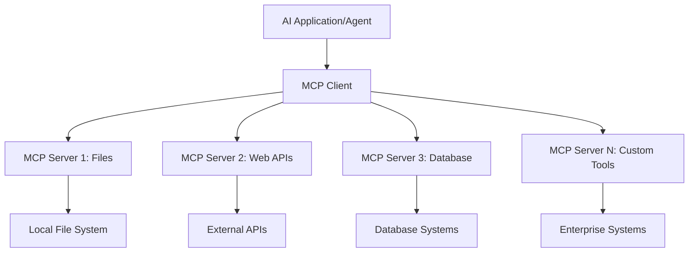

**🔧 Kernkomponenten:**

| Komponente | Rolle | Beispiele |
|------------|-------|-----------|
| **MCP Hosts** | Anwendungen, die MCP-Dienste nutzen | Claude Desktop, VS Code, AI Toolkit |
| **MCP Clients** | Protokoll-Handler (1:1 mit Servern) | In Host-Anwendungen integriert |
| **MCP Server** | Stellen Funktionen über Standardprotokoll bereit | Playwright, Files, Azure, GitHub |
| **Transportschicht** | Kommunikationsmethoden | stdio, HTTP, WebSockets |

## 🏢 Microsofts MCP Server-Ökosystem

Microsoft führt das MCP-Ökosystem mit einer umfassenden Suite an Enterprise-Servern, die reale Geschäftsanforderungen abdecken.

### 🌟 Ausgewählte Microsoft MCP Server

#### 1. ☁️ Azure MCP Server  
**🔗 Repository**: [azure/azure-mcp](https://github.com/azure/azure-mcp)  
**🎯 Zweck**: Umfassendes Azure-Ressourcenmanagement mit KI-Integration

**✨ Hauptfunktionen:**  
- Deklarative Infrastruktur-Bereitstellung  
- Echtzeit-Überwachung von Ressourcen  
- Empfehlungen zur Kostenoptimierung  
- Sicherheits-Compliance-Prüfung

**🚀 Anwendungsfälle:**  
- Infrastructure-as-Code mit KI-Unterstützung  
- Automatisches Skalieren von Ressourcen  
- Cloud-Kostenoptimierung  
- Automatisierung von DevOps-Workflows

#### 2. 📊 Microsoft Dataverse MCP  
**📚 Dokumentation**: [Microsoft Dataverse Integration](https://go.microsoft.com/fwlink/?linkid=2320176)  
**🎯 Zweck**: Natürliche Sprachschnittstelle für Geschäftsdaten

**✨ Hauptfunktionen:**  
- Datenbankabfragen in natürlicher Sprache  
- Verständnis des Geschäftskontexts  
- Benutzerdefinierte Prompt-Vorlagen  
- Unternehmensweite Datenverwaltung

**🚀 Anwendungsfälle:**  
- Business-Intelligence-Berichte  
- Analyse von Kundendaten  
- Einblicke in Vertriebspipelines  
- Compliance-Datenabfragen

#### 3. 🌐 Playwright MCP Server  
**🔗 Repository**: [microsoft/playwright-mcp](https://github.com/microsoft/playwright-mcp)  
**🎯 Zweck**: Browser-Automatisierung und Web-Interaktion

**✨ Hauptfunktionen:**  
- Browserübergreifende Automatisierung (Chrome, Firefox, Safari)  
- Intelligente Elementerkennung  
- Screenshot- und PDF-Erstellung  
- Netzwerkverkehrsüberwachung

**🚀 Anwendungsfälle:**  
- Automatisierte Testabläufe  
- Web-Scraping und Datenerfassung  
- UI/UX-Überwachung  
- Automatisierung von Wettbewerbsanalysen

#### 4. 📁 Files MCP Server  
**🔗 Repository**: [microsoft/files-mcp-server](https://github.com/microsoft/files-mcp-server)  
**🎯 Zweck**: Intelligente Dateisystemoperationen

**✨ Hauptfunktionen:**  
- Deklaratives Dateimanagement  
- Inhaltssynchronisation  
- Integration von Versionskontrolle  
- Metadatenextraktion

**🚀 Anwendungsfälle:**  
- Dokumentenverwaltung  
- Organisation von Code-Repositories  
- Workflows für Content-Publishing  
- Dateiverwaltung in Datenpipelines

#### 5. 📝 MarkItDown MCP Server  
**🔗 Repository**: [microsoft/markitdown](https://github.com/microsoft/markitdown)  
**🎯 Zweck**: Erweiterte Markdown-Verarbeitung und -Manipulation

**✨ Hauptfunktionen:**  
- Umfangreiche Markdown-Analyse  
- Formatkonvertierung (MD ↔ HTML ↔ PDF)  
- Inhaltsstruktur-Analyse  
- Template-Verarbeitung

**🚀 Anwendungsfälle:**  
- Technische Dokumentations-Workflows  
- Content-Management-Systeme  
- Berichtserstellung  
- Automatisierung von Wissensdatenbanken

#### 6. 📈 Clarity MCP Server  
**📦 Paket**: [@microsoft/clarity-mcp-server](https://www.npmjs.com/package/@microsoft/clarity-mcp-server)  
**🎯 Zweck**: Web-Analytics und Nutzerverhaltens-Insights

**✨ Hauptfunktionen:**  
- Heatmap-Datenanalyse  
- Aufzeichnung von Nutzersitzungen  
- Performance-Metriken  
- Analyse von Conversion-Funnels

**🚀 Anwendungsfälle:**  
- Website-Optimierung  
- Nutzererfahrungsforschung  
- A/B-Test-Analyse  
- Business-Intelligence-Dashboards

### 🌍 Community-Ökosystem

Neben Microsofts Servern umfasst das MCP-Ökosystem:  
- **🐙 GitHub MCP**: Repository-Verwaltung und Code-Analyse  
- **🗄️ Datenbank-MCPs**: PostgreSQL, MySQL, MongoDB-Integrationen  
- **☁️ Cloud-Provider-MCPs**: AWS, GCP, Digital Ocean Tools  
- **📧 Kommunikations-MCPs**: Slack, Teams, E-Mail-Integrationen

## 🛠️ Praktisches Labor: Einen Browser-Automatisierungsagenten bauen

**🎯 Projektziel**: Erstelle einen intelligenten Browser-Automatisierungsagenten mit dem Playwright MCP Server, der Websites navigiert, Informationen extrahiert und komplexe Web-Interaktionen durchführt.

### 🚀 Phase 1: Agentengrundlage einrichten

#### Schritt 1: Initialisiere deinen Agenten  
1. **Öffne den AI Toolkit Agent Builder**  
2. **Erstelle einen neuen Agenten** mit folgender Konfiguration:  
   - **Name**: `BrowserAgent`  
   - **Modell**: Wähle GPT-4o  

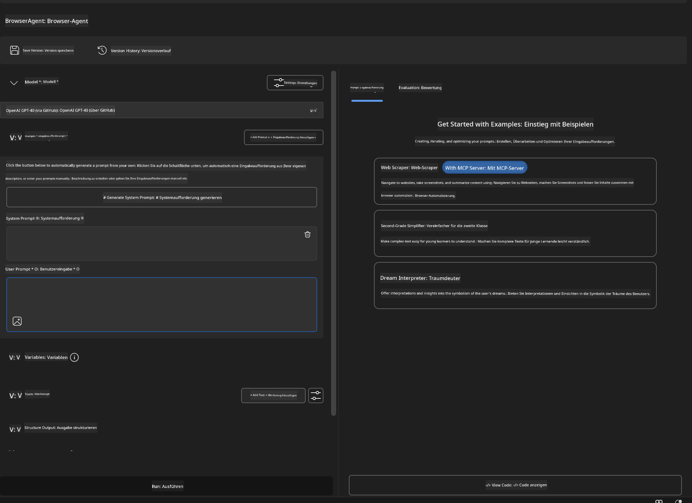

### 🔧 Phase 2: MCP-Integrationsworkflow

#### Schritt 3: MCP-Server-Integration hinzufügen  
1. **Wechsle zum Bereich „Tools“** im Agent Builder  
2. **Klicke auf „Add Tool“**, um das Integrationsmenü zu öffnen  
3. **Wähle „MCP Server“** aus den verfügbaren Optionen

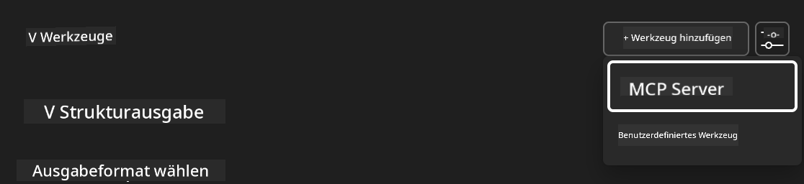

**🔍 Tool-Typen verstehen:**  
- **Eingebaute Tools**: Vorgefertigte AI Toolkit Funktionen  
- **MCP Server**: Externe Dienstintegrationen  
- **Custom APIs**: Eigene Service-Endpunkte  
- **Function Calling**: Direkter Modell-Funktionszugriff

#### Schritt 4: MCP-Server-Auswahl  
1. **Wähle die Option „MCP Server“** zum Fortfahren  
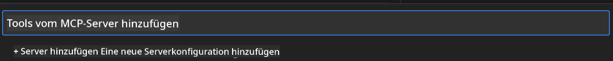

2. **Durchsuche den MCP-Katalog**, um verfügbare Integrationen zu entdecken  
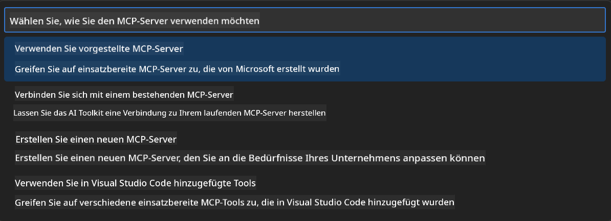

### 🎮 Phase 3: Playwright MCP Konfiguration

#### Schritt 5: Playwright auswählen und konfigurieren  
1. **Klicke auf „Use Featured MCP Servers“**, um auf Microsofts verifizierte Server zuzugreifen  
2. **Wähle „Playwright“** aus der Liste der vorgestellten Server  
3. **Akzeptiere die Standard-MCP-ID** oder passe sie für deine Umgebung an

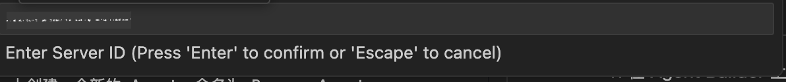

#### Schritt 6: Playwright-Funktionen aktivieren  
**🔑 Kritischer Schritt**: Wähle **ALLE** verfügbaren Playwright-Methoden für maximale Funktionalität aus

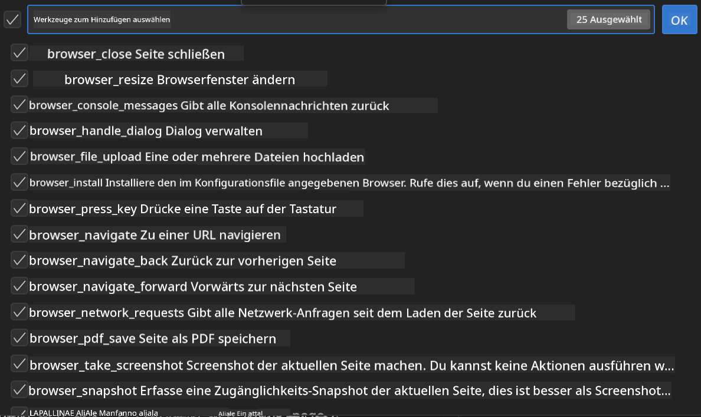

**🛠️ Wichtige Playwright-Tools:**  
- **Navigation**: `goto`, `goBack`, `goForward`, `reload`  
- **Interaktion**: `click`, `fill`, `press`, `hover`, `drag`  
- **Extraktion**: `textContent`, `innerHTML`, `getAttribute`  
- **Validierung**: `isVisible`, `isEnabled`, `waitForSelector`  
- **Erfassung**: `screenshot`, `pdf`, `video`  
- **Netzwerk**: `setExtraHTTPHeaders`, `route`, `waitForResponse`

#### Schritt 7: Integrationserfolg überprüfen  
**✅ Erfolgskriterien:**  
- Alle Tools sind in der Agent Builder-Oberfläche sichtbar  
- Keine Fehlermeldungen im Integrationsbereich  
- Playwright-Serverstatus zeigt „Connected“

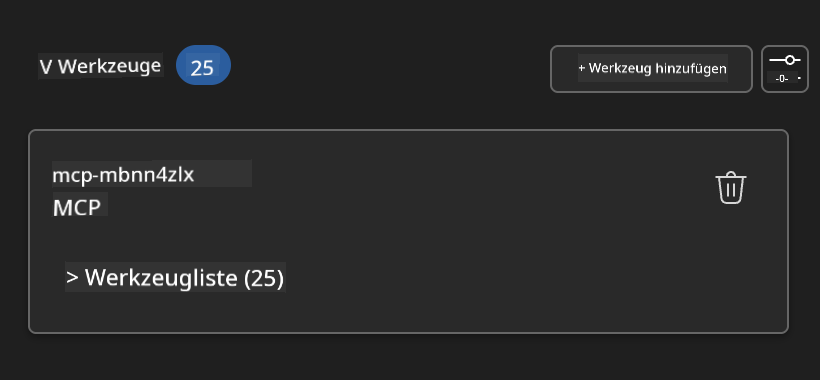

**🔧 Häufige Probleme und Lösungen:**  
- **Verbindung fehlgeschlagen**: Überprüfe Internetverbindung und Firewall-Einstellungen  
- **Fehlende Tools**: Stelle sicher, dass alle Funktionen bei der Einrichtung ausgewählt wurden  
- **Berechtigungsfehler**: Prüfe, ob VS Code die nötigen Systemrechte hat

### 🎯 Phase 4: Fortgeschrittenes Prompt-Engineering

#### Schritt 8: Intelligente System-Prompts entwerfen  
Erstelle ausgefeilte Prompts, die die volle Playwright-Funktionalität nutzen:

```markdown
# Web Automation Expert System Prompt

## Core Identity
You are an advanced web automation specialist with deep expertise in browser automation, web scraping, and user experience analysis. You have access to Playwright tools for comprehensive browser control.

## Capabilities & Approach
### Navigation Strategy
- Always start with screenshots to understand page layout
- Use semantic selectors (text content, labels) when possible
- Implement wait strategies for dynamic content
- Handle single-page applications (SPAs) effectively

### Error Handling
- Retry failed operations with exponential backoff
- Provide clear error descriptions and solutions
- Suggest alternative approaches when primary methods fail
- Always capture diagnostic screenshots on errors

### Data Extraction
- Extract structured data in JSON format when possible
- Provide confidence scores for extracted information
- Validate data completeness and accuracy
- Handle pagination and infinite scroll scenarios

### Reporting
- Include step-by-step execution logs
- Provide before/after screenshots for verification
- Suggest optimizations and alternative approaches
- Document any limitations or edge cases encountered

## Ethical Guidelines
- Respect robots.txt and rate limiting
- Avoid overloading target servers
- Only extract publicly available information
- Follow website terms of service
```

#### Schritt 9: Dynamische Benutzer-Prompts erstellen  
Gestalte Prompts, die verschiedene Funktionen demonstrieren:

**🌐 Beispiel Web-Analyse:**  
```markdown
Navigate to github.com/kinfey and provide a comprehensive analysis including:
1. Repository structure and organization
2. Recent activity and contribution patterns  
3. Documentation quality assessment
4. Technology stack identification
5. Community engagement metrics
6. Notable projects and their purposes

Include screenshots at key steps and provide actionable insights.
```

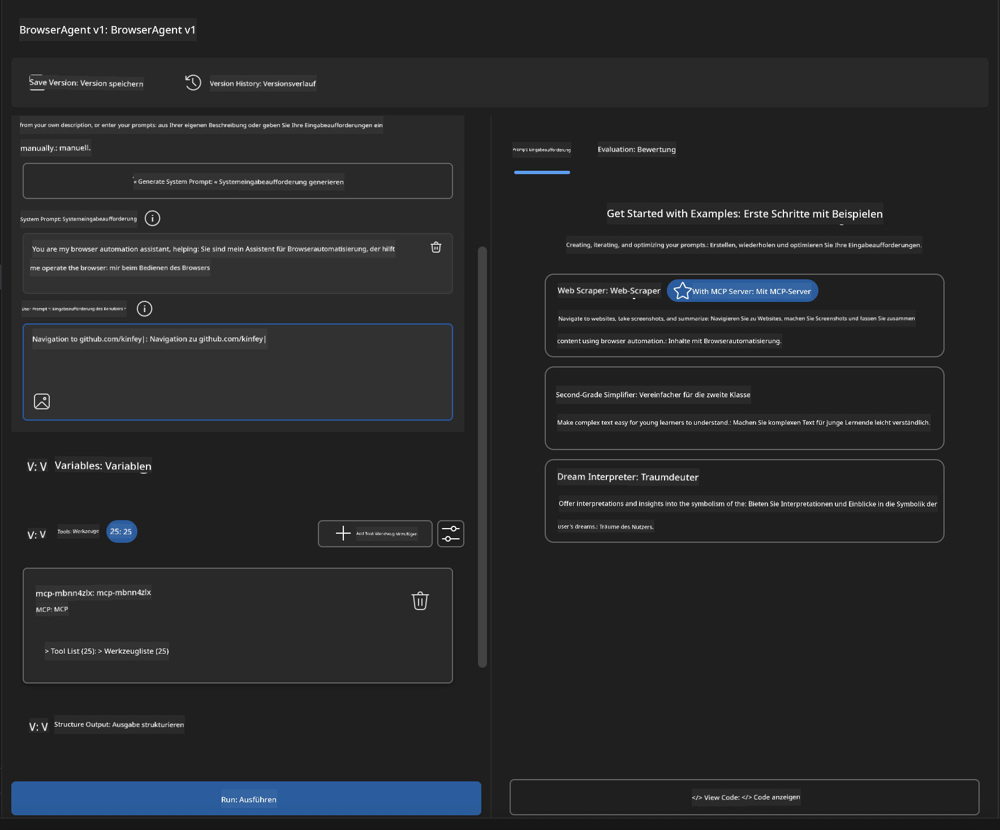

### 🚀 Phase 5: Ausführung und Test

#### Schritt 10: Starte deine erste Automatisierung  
1. **Klicke auf „Run“**, um die Automatisierungssequenz zu starten  
2. **Beobachte die Echtzeit-Ausführung**:  
   - Chrome-Browser öffnet sich automatisch  
   - Agent navigiert zur Zielwebsite  
   - Screenshots dokumentieren jeden wichtigen Schritt  
   - Analyseergebnisse werden in Echtzeit angezeigt

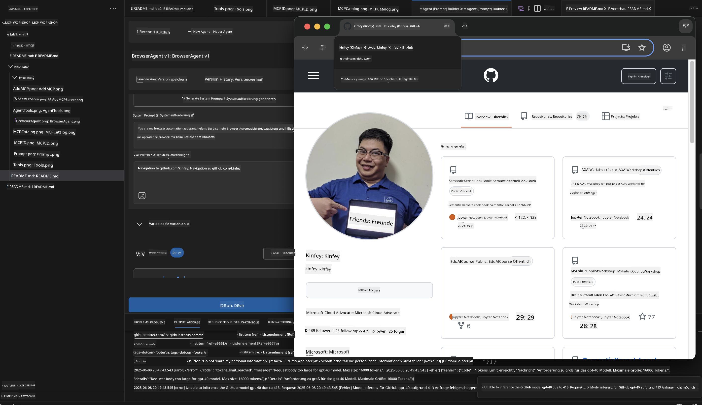

#### Schritt 11: Ergebnisse und Erkenntnisse analysieren  
Überprüfe die umfassende Analyse in der Agent Builder-Oberfläche:

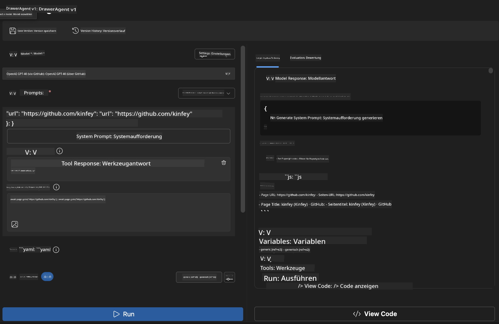

### 🌟 Phase 6: Erweiterte Funktionen und Deployment

#### Schritt 12: Export und Produktionseinsatz  
Der Agent Builder unterstützt verschiedene Bereitstellungsoptionen:

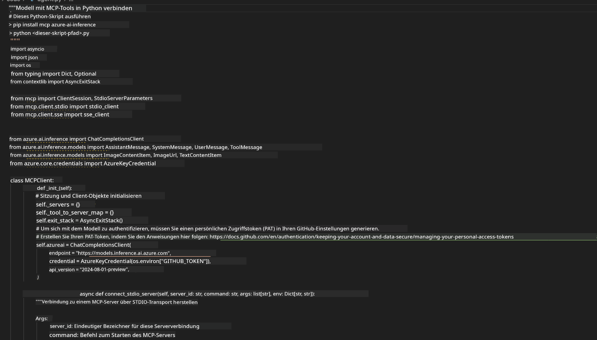

## 🎓 Modul 2 Zusammenfassung & Nächste Schritte

### 🏆 Erfolg freigeschaltet: MCP-Integrationsmeister

**✅ Erlernte Fähigkeiten:**  
- [ ] MCP-Architektur und Vorteile verstehen  
- [ ] Microsofts MCP-Server-Ökosystem navigieren  
- [ ] Playwright MCP mit AI Toolkit integrieren  
- [ ] Komplexe Browser-Automatisierungsagenten bauen  
- [ ] Fortgeschrittenes Prompt-Engineering für Web-Automatisierung

### 📚 Zusätzliche Ressourcen

- **🔗 MCP-Spezifikation**: [Offizielle Protokolldokumentation](https://modelcontextprotocol.io/)  
- **🛠️ Playwright API**: [Vollständige Methodenreferenz](https://playwright.dev/docs/api/class-playwright)  
- **🏢 Microsoft MCP Server**: [Enterprise-Integrationsleitfaden](https://github.com/microsoft/mcp-servers)  
- **🌍 Community-Beispiele**: [MCP Server Galerie](https://github.com/modelcontextprotocol/servers)

**🎉 Herzlichen Glückwunsch!** Du hast die MCP-Integration erfolgreich gemeistert und kannst jetzt produktionsreife KI-Agenten mit externen Tool-Fähigkeiten erstellen!

### 🔜 Weiter zum nächsten Modul

Bereit, deine MCP-Kenntnisse weiter auszubauen? Fahre fort mit **[Modul 3: Fortgeschrittene MCP-Entwicklung mit AI Toolkit](../lab3/README.md)**, wo du lernst:  
- Eigene benutzerdefinierte MCP-Server zu erstellen  
- Das neueste MCP Python SDK zu konfigurieren und zu nutzen  
- Den MCP Inspector für Debugging einzurichten  
- Fortgeschrittene MCP-Server-Entwicklungsworkflows zu meistern
- Erstelle einen Weather MCP Server von Grund auf neu

**Haftungsausschluss**:  
Dieses Dokument wurde mit dem KI-Übersetzungsdienst [Co-op Translator](https://github.com/Azure/co-op-translator) übersetzt. Obwohl wir uns um Genauigkeit bemühen, beachten Sie bitte, dass automatisierte Übersetzungen Fehler oder Ungenauigkeiten enthalten können. Das Originaldokument in seiner Ursprungssprache ist als maßgebliche Quelle zu betrachten. Für wichtige Informationen wird eine professionelle menschliche Übersetzung empfohlen. Wir übernehmen keine Haftung für Missverständnisse oder Fehlinterpretationen, die aus der Nutzung dieser Übersetzung entstehen.