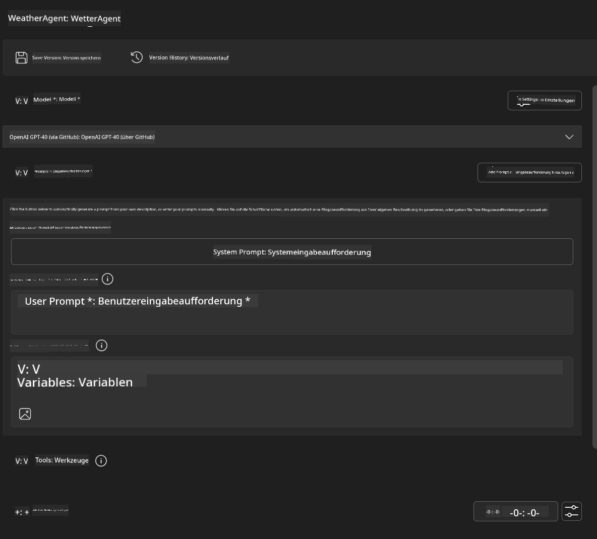
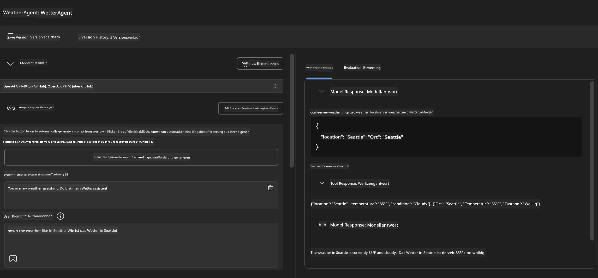
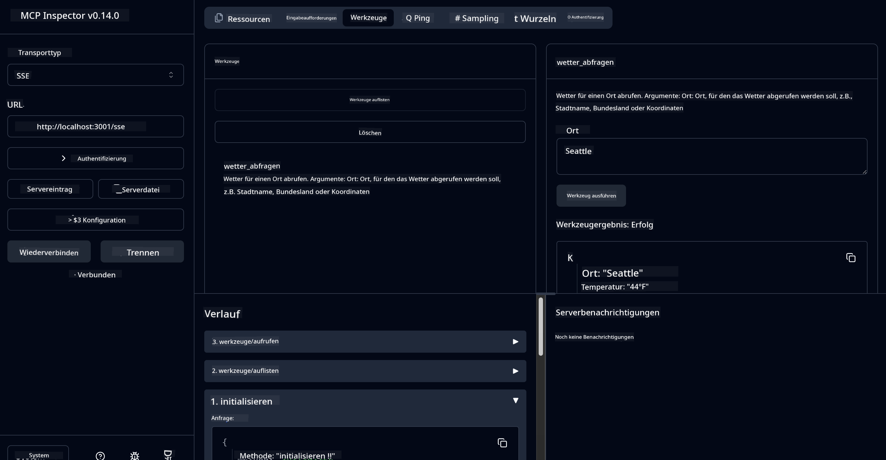

<!--
CO_OP_TRANSLATOR_METADATA:
{
  "original_hash": "dd8da3f75addcef453fe11f02a270217",
  "translation_date": "2025-06-10T06:02:34+00:00",
  "source_file": "10-StreamliningAIWorkflowsBuildingAnMCPServerWithAIToolkit/lab3/README.md",
  "language_code": "de"
}
-->
# 🔧 Modul 3: Fortgeschrittene MCP-Entwicklung mit AI Toolkit


## 🎯 Lernziele

Am Ende dieses Labs wirst du in der Lage sein:

- ✅ Eigene MCP-Server mit dem AI Toolkit zu erstellen
- ✅ Das neueste MCP Python SDK (v1.9.3) zu konfigurieren und zu nutzen
- ✅ Den MCP Inspector für das Debugging einzurichten und zu verwenden
- ✅ MCP-Server sowohl in Agent Builder als auch im Inspector zu debuggen
- ✅ Fortgeschrittene Workflows für die MCP-Serverentwicklung zu verstehen

## 📋 Voraussetzungen

- Abschluss von Lab 2 (MCP Grundlagen)
- VS Code mit installiertem AI Toolkit Extension
- Python 3.10+ Umgebung
- Node.js und npm für die Einrichtung des Inspectors

## 🏗️ Was du bauen wirst

In diesem Lab erstellst du einen **Weather MCP Server**, der zeigt:

- Umsetzung eines eigenen MCP-Servers
- Integration mit AI Toolkit Agent Builder
- Professionelle Debugging-Workflows
- Moderne Nutzungsmuster des MCP SDK

---

## 🔧 Überblick über die Kernkomponenten

### 🐍 MCP Python SDK  
Das Model Context Protocol Python SDK bildet die Basis für die Entwicklung eigener MCP-Server. Du verwendest Version 1.9.3 mit erweiterten Debugging-Funktionen.

### 🔍 MCP Inspector  
Ein leistungsstarkes Debugging-Tool, das bietet:  
- Echtzeit-Serverüberwachung  
- Visualisierung der Tool-Ausführung  
- Inspektion von Netzwerk-Anfragen und -Antworten  
- Interaktive Testumgebung  

---

## 📖 Schritt-für-Schritt Umsetzung

### Schritt 1: Erstelle einen WeatherAgent im Agent Builder

1. **Starte den Agent Builder** in VS Code über die AI Toolkit Erweiterung  
2. **Erstelle einen neuen Agenten** mit folgender Konfiguration:  
   - Agent Name: `WeatherAgent`



### Schritt 2: Initialisiere das MCP Server Projekt

1. **Gehe zu Tools** → **Add Tool** im Agent Builder  
2. **Wähle "MCP Server"** aus den verfügbaren Optionen  
3. **Wähle "Create A new MCP Server"**  
4. **Wähle die `python-weather` Vorlage aus**  
5. **Gib deinem Server einen Namen:** `weather_mcp`


### Schritt 3: Öffne und untersuche das Projekt

1. **Öffne das generierte Projekt** in VS Code  
2. **Überprüfe die Projektstruktur:**  
   ```
   weather_mcp/
   ├── src/
   │   ├── __init__.py
   │   └── server.py
   ├── inspector/
   │   ├── package.json
   │   └── package-lock.json
   ├── .vscode/
   │   ├── launch.json
   │   └── tasks.json
   ├── pyproject.toml
   └── README.md
   ```

### Schritt 4: Upgrade auf das neueste MCP SDK

> **🔍 Warum upgraden?** Wir möchten das aktuellste MCP SDK (v1.9.3) und den Inspector Dienst (0.14.0) nutzen, um erweiterte Funktionen und bessere Debugging-Möglichkeiten zu erhalten.

#### 4a. Aktualisiere die Python-Abhängigkeiten

**Bearbeite `pyproject.toml`:** update [./code/weather_mcp/pyproject.toml](../../../../10-StreamliningAIWorkflowsBuildingAnMCPServerWithAIToolkit/lab3/code/weather_mcp/pyproject.toml)


#### 4b. Update Inspector Configuration

**Edit `inspector/package.json`:** update [./code/weather_mcp/inspector/package.json](../../../../10-StreamliningAIWorkflowsBuildingAnMCPServerWithAIToolkit/lab3/code/weather_mcp/inspector/package.json)

#### 4c. Update Inspector Dependencies

**Edit `inspector/package-lock.json`:** update [./code/weather_mcp/inspector/package-lock.json](../../../../10-StreamliningAIWorkflowsBuildingAnMCPServerWithAIToolkit/lab3/code/weather_mcp/inspector/package-lock.json)

> **📝 Note:** This file contains extensive dependency definitions. Below is the essential structure - the full content ensures proper dependency resolution.


> **⚡ Full Package Lock:** The complete package-lock.json contains ~3000 lines of dependency definitions. The above shows the key structure - use the provided file for complete dependency resolution.

### Step 5: Configure VS Code Debugging

*Note: Please copy the file in the specified path to replace the corresponding local file*

#### 5a. Update Launch Configuration

**Edit `.vscode/launch.json`:**

```json
{
  "version": "0.2.0",
  "configurations": [
    {
      "name": "Attach to Local MCP",
      "type": "debugpy",
      "request": "attach",
      "connect": {
        "host": "localhost",
        "port": 5678
      },
      "presentation": {
        "hidden": true
      },
      "internalConsoleOptions": "neverOpen",
      "postDebugTask": "Terminate All Tasks"
    },
    {
      "name": "Launch Inspector (Edge)",
      "type": "msedge",
      "request": "launch",
      "url": "http://localhost:6274?timeout=60000&serverUrl=http://localhost:3001/sse#tools",
      "cascadeTerminateToConfigurations": [
        "Attach to Local MCP"
      ],
      "presentation": {
        "hidden": true
      },
      "internalConsoleOptions": "neverOpen"
    },
    {
      "name": "Launch Inspector (Chrome)",
      "type": "chrome",
      "request": "launch",
      "url": "http://localhost:6274?timeout=60000&serverUrl=http://localhost:3001/sse#tools",
      "cascadeTerminateToConfigurations": [
        "Attach to Local MCP"
      ],
      "presentation": {
        "hidden": true
      },
      "internalConsoleOptions": "neverOpen"
    }
  ],
  "compounds": [
    {
      "name": "Debug in Agent Builder",
      "configurations": [
        "Attach to Local MCP"
      ],
      "preLaunchTask": "Open Agent Builder",
    },
    {
      "name": "Debug in Inspector (Edge)",
      "configurations": [
        "Launch Inspector (Edge)",
        "Attach to Local MCP"
      ],
      "preLaunchTask": "Start MCP Inspector",
      "stopAll": true
    },
    {
      "name": "Debug in Inspector (Chrome)",
      "configurations": [
        "Launch Inspector (Chrome)",
        "Attach to Local MCP"
      ],
      "preLaunchTask": "Start MCP Inspector",
      "stopAll": true
    }
  ]
}
```

**Bearbeite `.vscode/tasks.json`:**

```
{
  "version": "2.0.0",
  "tasks": [
    {
      "label": "Start MCP Server",
      "type": "shell",
      "command": "python -m debugpy --listen 127.0.0.1:5678 src/__init__.py sse",
      "isBackground": true,
      "options": {
        "cwd": "${workspaceFolder}",
        "env": {
          "PORT": "3001"
        }
      },
      "problemMatcher": {
        "pattern": [
          {
            "regexp": "^.*$",
            "file": 0,
            "location": 1,
            "message": 2
          }
        ],
        "background": {
          "activeOnStart": true,
          "beginsPattern": ".*",
          "endsPattern": "Application startup complete|running"
        }
      }
    },
    {
      "label": "Start MCP Inspector",
      "type": "shell",
      "command": "npm run dev:inspector",
      "isBackground": true,
      "options": {
        "cwd": "${workspaceFolder}/inspector",
        "env": {
          "CLIENT_PORT": "6274",
          "SERVER_PORT": "6277",
        }
      },
      "problemMatcher": {
        "pattern": [
          {
            "regexp": "^.*$",
            "file": 0,
            "location": 1,
            "message": 2
          }
        ],
        "background": {
          "activeOnStart": true,
          "beginsPattern": "Starting MCP inspector",
          "endsPattern": "Proxy server listening on port"
        }
      },
      "dependsOn": [
        "Start MCP Server"
      ]
    },
    {
      "label": "Open Agent Builder",
      "type": "shell",
      "command": "echo ${input:openAgentBuilder}",
      "presentation": {
        "reveal": "never"
      },
      "dependsOn": [
        "Start MCP Server"
      ],
    },
    {
      "label": "Terminate All Tasks",
      "command": "echo ${input:terminate}",
      "type": "shell",
      "problemMatcher": []
    }
  ],
  "inputs": [
    {
      "id": "openAgentBuilder",
      "type": "command",
      "command": "ai-mlstudio.agentBuilder",
      "args": {
        "initialMCPs": [ "local-server-weather_mcp" ],
        "triggeredFrom": "vsc-tasks"
      }
    },
    {
      "id": "terminate",
      "type": "command",
      "command": "workbench.action.tasks.terminate",
      "args": "terminateAll"
    }
  ]
}
```

---

## 🚀 Ausführen und Testen deines MCP Servers

### Schritt 6: Installiere Abhängigkeiten

Nach den Konfigurationsänderungen führe folgende Befehle aus:

**Installiere Python-Abhängigkeiten:**  
```bash
uv sync
```

**Installiere Inspector-Abhängigkeiten:**  
```bash
cd inspector
npm install
```

### Schritt 7: Debuggen mit Agent Builder

1. **Drücke F5** oder nutze die Konfiguration **"Debug in Agent Builder"**  
2. **Wähle die zusammengesetzte Konfiguration** im Debug-Panel  
3. **Warte, bis der Server startet** und Agent Builder sich öffnet  
4. **Teste deinen Weather MCP Server** mit natürlichsprachlichen Anfragen

Eingabeaufforderung wie folgt:

SYSTEM_PROMPT

```
You are my weather assistant
```

USER_PROMPT

```
How's the weather like in Seattle
```



### Schritt 8: Debuggen mit MCP Inspector

1. **Nutze die Konfiguration "Debug in Inspector"** (Edge oder Chrome)  
2. **Öffne die Inspector-Oberfläche** unter `http://localhost:6274`  
3. **Erkunde die interaktive Testumgebung:**  
   - Verfügbare Tools ansehen  
   - Tool-Ausführung testen  
   - Netzwerk-Anfragen überwachen  
   - Serverantworten debuggen  



---

## 🎯 Wichtige Lernergebnisse

Durch den Abschluss dieses Labs hast du:

- [x] **Einen eigenen MCP-Server** mit AI Toolkit Vorlagen erstellt  
- [x] **Auf das neueste MCP SDK** (v1.9.3) für erweiterte Funktionen aktualisiert  
- [x] **Professionelle Debugging-Workflows** für Agent Builder und Inspector eingerichtet  
- [x] **Den MCP Inspector** für interaktives Server-Testing konfiguriert  
- [x] **VS Code Debugging-Konfigurationen** für die MCP-Entwicklung gemeistert  

## 🔧 Erforschte erweiterte Funktionen

| Feature                  | Beschreibung                  | Anwendungsfall              |
|--------------------------|------------------------------|----------------------------|
| **MCP Python SDK v1.9.3** | Neueste Protokollimplementierung | Moderne Serverentwicklung    |
| **MCP Inspector 0.14.0**  | Interaktives Debugging-Tool   | Echtzeit-Servertests         |
| **VS Code Debugging**     | Integrierte Entwicklungsumgebung | Professioneller Debugging-Workflow |
| **Agent Builder Integration** | Direkte AI Toolkit Anbindung | End-to-End Agent Testing     |

## 📚 Zusätzliche Ressourcen

- [MCP Python SDK Dokumentation](https://modelcontextprotocol.io/docs/sdk/python)  
- [AI Toolkit Erweiterungsanleitung](https://code.visualstudio.com/docs/ai/ai-toolkit)  
- [VS Code Debugging Dokumentation](https://code.visualstudio.com/docs/editor/debugging)  
- [Model Context Protocol Spezifikation](https://modelcontextprotocol.io/docs/concepts/architecture)  

---

**🎉 Herzlichen Glückwunsch!** Du hast Lab 3 erfolgreich abgeschlossen und kannst jetzt eigene MCP-Server erstellen, debuggen und mit professionellen Workflows bereitstellen.

### 🔜 Weiter zum nächsten Modul

Bereit, deine MCP-Kenntnisse in einem realen Entwicklungsworkflow anzuwenden? Fahre fort zu **[Modul 4: Praktische MCP-Entwicklung – Custom GitHub Clone Server](../lab4/README.md)**, wo du:  
- Einen produktionsreifen MCP-Server baust, der GitHub Repository-Operationen automatisiert  
- GitHub Repository Klon-Funktionalität über MCP implementierst  
- Eigene MCP-Server mit VS Code und GitHub Copilot Agent Mode integrierst  
- Eigene MCP-Server in Produktionsumgebungen testest und bereitstellst  
- Praktische Workflow-Automatisierung für Entwickler lernst

**Haftungsausschluss**:  
Dieses Dokument wurde mit dem KI-Übersetzungsdienst [Co-op Translator](https://github.com/Azure/co-op-translator) übersetzt. Obwohl wir uns um Genauigkeit bemühen, beachten Sie bitte, dass automatisierte Übersetzungen Fehler oder Ungenauigkeiten enthalten können. Das Originaldokument in seiner Ursprungssprache gilt als maßgebliche Quelle. Für wichtige Informationen wird eine professionelle menschliche Übersetzung empfohlen. Wir übernehmen keine Haftung für Missverständnisse oder Fehlinterpretationen, die aus der Nutzung dieser Übersetzung entstehen.