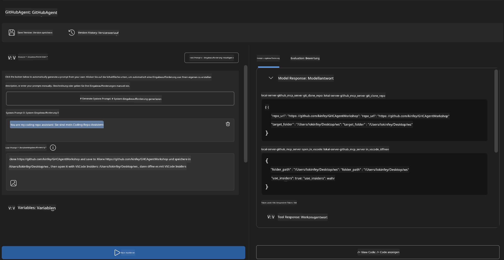
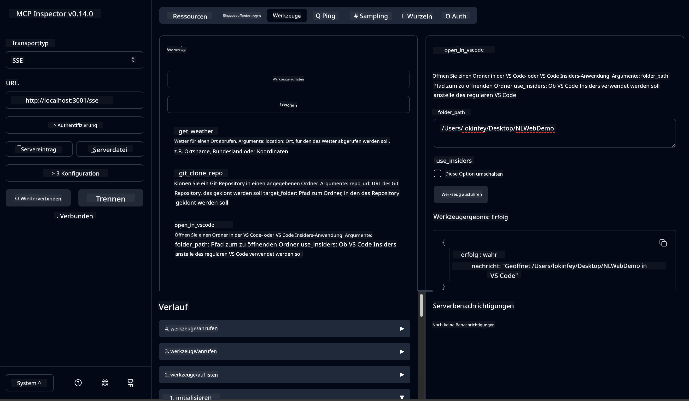

<!--
CO_OP_TRANSLATOR_METADATA:
{
  "original_hash": "f83bc722dc758efffd68667d6a1db470",
  "translation_date": "2025-07-14T08:35:24+00:00",
  "source_file": "10-StreamliningAIWorkflowsBuildingAnMCPServerWithAIToolkit/lab4/README.md",
  "language_code": "de"
}
-->
# 🐙 Modul 4: Praktische MCP-Entwicklung – Eigener GitHub-Klon-Server


> **⚡ Schnellstart:** Baue in nur 30 Minuten einen produktionsreifen MCP-Server, der das Klonen von GitHub-Repositories und die VS Code-Integration automatisiert!

## 🎯 Lernziele

Am Ende dieses Labs wirst du in der Lage sein:

- ✅ Einen eigenen MCP-Server für reale Entwicklungs-Workflows zu erstellen  
- ✅ Die Funktion zum Klonen von GitHub-Repositories über MCP zu implementieren  
- ✅ Eigene MCP-Server mit VS Code und Agent Builder zu integrieren  
- ✅ GitHub Copilot Agent Mode mit eigenen MCP-Tools zu nutzen  
- ✅ Eigene MCP-Server in produktiven Umgebungen zu testen und bereitzustellen  

## 📋 Voraussetzungen

- Abschluss der Labs 1-3 (MCP-Grundlagen und fortgeschrittene Entwicklung)  
- GitHub Copilot Abonnement ([kostenlose Anmeldung verfügbar](https://github.com/github-copilot/signup))  
- VS Code mit AI Toolkit und GitHub Copilot Erweiterungen  
- Git CLI installiert und konfiguriert  

## 🏗️ Projektübersicht

### **Reale Entwicklungs-Herausforderung**  
Als Entwickler nutzen wir häufig GitHub, um Repositories zu klonen und in VS Code oder VS Code Insiders zu öffnen. Dieser manuelle Prozess umfasst:  
1. Terminal/Command Prompt öffnen  
2. Zum gewünschten Verzeichnis navigieren  
3. `git clone` Befehl ausführen  
4. VS Code im geklonten Verzeichnis öffnen  

**Unsere MCP-Lösung fasst das in einen einzigen intelligenten Befehl zusammen!**

### **Was du bauen wirst**  
Einen **GitHub Clone MCP Server** (`git_mcp_server`), der folgende Funktionen bietet:

| Funktion | Beschreibung | Vorteil |
|---------|-------------|---------|
| 🔄 **Intelligentes Repository-Klonen** | Klonen von GitHub-Repos mit Validierung | Automatische Fehlerprüfung |
| 📁 **Intelligente Verzeichnisverwaltung** | Verzeichnisse sicher prüfen und anlegen | Verhindert Überschreiben |
| 🚀 **Plattformübergreifende VS Code Integration** | Projekte in VS Code/Insiders öffnen | Nahtloser Workflow-Übergang |
| 🛡️ **Robuste Fehlerbehandlung** | Umgang mit Netzwerk-, Berechtigungs- und Pfadproblemen | Produktionsreife Zuverlässigkeit |

---

## 📖 Schritt-für-Schritt Umsetzung

### Schritt 1: GitHub Agent im Agent Builder erstellen

1. **Agent Builder starten** über die AI Toolkit Erweiterung  
2. **Neuen Agenten erstellen** mit folgender Konfiguration:  
   ```
   Agent Name: GitHubAgent
   ```

3. **Eigenen MCP-Server initialisieren:**  
   - Gehe zu **Tools** → **Add Tool** → **MCP Server**  
   - Wähle **"Create A new MCP Server"**  
   - Wähle die **Python-Vorlage** für maximale Flexibilität  
   - **Servername:** `git_mcp_server`  

### Schritt 2: GitHub Copilot Agent Mode konfigurieren

1. **GitHub Copilot in VS Code öffnen** (Strg/Cmd + Shift + P → "GitHub Copilot: Open")  
2. **Agent Model auswählen** im Copilot Interface  
3. **Claude 3.7 Modell wählen** für verbesserte Reasoning-Fähigkeiten  
4. **MCP-Integration aktivieren** für Tool-Zugriff  

> **💡 Profi-Tipp:** Claude 3.7 bietet ein besseres Verständnis von Entwicklungs-Workflows und Fehlerbehandlungsmustern.

### Schritt 3: Kernfunktionalität des MCP-Servers implementieren

**Nutze folgenden detaillierten Prompt mit GitHub Copilot Agent Mode:**  

```
Create two MCP tools with the following comprehensive requirements:

🔧 TOOL A: clone_repository
Requirements:
- Clone any GitHub repository to a specified local folder
- Return the absolute path of the successfully cloned project
- Implement comprehensive validation:
  ✓ Check if target directory already exists (return error if exists)
  ✓ Validate GitHub URL format (https://github.com/user/repo)
  ✓ Verify git command availability (prompt installation if missing)
  ✓ Handle network connectivity issues
  ✓ Provide clear error messages for all failure scenarios

🚀 TOOL B: open_in_vscode
Requirements:
- Open specified folder in VS Code or VS Code Insiders
- Cross-platform compatibility (Windows/Linux/macOS)
- Use direct application launch (not terminal commands)
- Auto-detect available VS Code installations
- Handle cases where VS Code is not installed
- Provide user-friendly error messages

Additional Requirements:
- Follow MCP 1.9.3 best practices
- Include proper type hints and documentation
- Implement logging for debugging purposes
- Add input validation for all parameters
- Include comprehensive error handling
```

### Schritt 4: Deinen MCP-Server testen

#### 4a. Test im Agent Builder

1. **Debug-Konfiguration im Agent Builder starten**  
2. **Agenten mit folgendem System-Prompt konfigurieren:**  

```
SYSTEM_PROMPT:
You are my intelligent coding repository assistant. You help developers efficiently clone GitHub repositories and set up their development environment. Always provide clear feedback about operations and handle errors gracefully.
```

3. **Mit realistischen Nutzerszenarien testen:**  

```
USER_PROMPT EXAMPLES:

Scenario : Basic Clone and Open
"Clone {Your GitHub Repo link such as https://github.com/kinfey/GHCAgentWorkshop
 } and save to {The global path you specify}, then open it with VS Code Insiders"
```



**Erwartete Ergebnisse:**  
- ✅ Erfolgreiches Klonen mit Pfadbestätigung  
- ✅ Automatischer Start von VS Code  
- ✅ Klare Fehlermeldungen bei ungültigen Szenarien  
- ✅ Korrekte Behandlung von Randfällen  

#### 4b. Test im MCP Inspector



---

**🎉 Herzlichen Glückwunsch!** Du hast erfolgreich einen praktischen, produktionsreifen MCP-Server erstellt, der reale Entwicklungs-Workflows automatisiert. Dein eigener GitHub-Klon-Server zeigt die Stärke von MCP zur Automatisierung und Steigerung der Entwicklerproduktivität.

### 🏆 Errungenschaften freigeschaltet:  
- ✅ **MCP Developer** – Eigener MCP-Server erstellt  
- ✅ **Workflow Automator** – Entwicklungsprozesse optimiert  
- ✅ **Integration Expert** – Mehrere Entwicklungstools verbunden  
- ✅ **Produktionsreif** – Bereit für den produktiven Einsatz  

---

## 🎓 Workshop-Abschluss: Deine Reise mit dem Model Context Protocol

**Liebe Workshop-Teilnehmerin, lieber Workshop-Teilnehmer,**

herzlichen Glückwunsch zum Abschluss aller vier Module des Model Context Protocol Workshops! Du hast einen weiten Weg zurückgelegt – vom Verständnis der AI Toolkit Grundlagen bis hin zum Bau produktionsreifer MCP-Server, die reale Entwicklungs-Herausforderungen lösen.

### 🚀 Rückblick auf deinen Lernpfad:

**[Modul 1](../lab1/README.md):** Du hast die Grundlagen des AI Toolkits, Modelltests und die Erstellung deines ersten AI-Agenten kennengelernt.

**[Modul 2](../lab2/README.md):** Du hast die MCP-Architektur verstanden, Playwright MCP integriert und deinen ersten Browser-Automatisierungsagenten gebaut.

**[Modul 3](../lab3/README.md):** Du bist in die Entwicklung eigener MCP-Server eingestiegen, hast den Weather MCP Server gebaut und Debugging-Tools gemeistert.

**[Modul 4](../lab4/README.md):** Jetzt hast du alles angewandt, um ein praktisches Automatisierungstool für GitHub-Repository-Workflows zu erstellen.

### 🌟 Was du gemeistert hast:

- ✅ **AI Toolkit Ökosystem:** Modelle, Agenten und Integrationsmuster  
- ✅ **MCP-Architektur:** Client-Server-Design, Transportprotokolle und Sicherheit  
- ✅ **Entwicklertools:** Vom Playground über Inspector bis zur produktiven Bereitstellung  
- ✅ **Eigene Entwicklung:** Bau, Test und Deployment eigener MCP-Server  
- ✅ **Praktische Anwendungen:** Lösung realer Workflow-Herausforderungen mit KI  

### 🔮 Deine nächsten Schritte:

1. **Baue deinen eigenen MCP-Server:** Nutze dein Wissen, um deine individuellen Workflows zu automatisieren  
2. **Werde Teil der MCP-Community:** Teile deine Projekte und lerne von anderen  
3. **Erkunde erweiterte Integrationen:** Verbinde MCP-Server mit Unternehmenssystemen  
4. **Engagiere dich im Open Source:** Hilf mit, MCP-Tools und Dokumentation zu verbessern  

Denke daran, dieser Workshop ist erst der Anfang. Das Model Context Protocol Ökosystem entwickelt sich schnell weiter, und du bist jetzt bestens gerüstet, um an der Spitze KI-gestützter Entwicklungstools zu stehen.

**Vielen Dank für deine Teilnahme und dein Engagement beim Lernen!**

Wir hoffen, dieser Workshop hat Ideen geweckt, die deine Art, mit KI-Tools in der Entwicklung zu arbeiten, nachhaltig verändern werden.

**Viel Erfolg beim Coden!**

---

**Haftungsausschluss**:  
Dieses Dokument wurde mit dem KI-Übersetzungsdienst [Co-op Translator](https://github.com/Azure/co-op-translator) übersetzt. Obwohl wir uns um Genauigkeit bemühen, beachten Sie bitte, dass automatisierte Übersetzungen Fehler oder Ungenauigkeiten enthalten können. Das Originaldokument in seiner Ursprungssprache gilt als maßgebliche Quelle. Für wichtige Informationen wird eine professionelle menschliche Übersetzung empfohlen. Wir übernehmen keine Haftung für Missverständnisse oder Fehlinterpretationen, die aus der Nutzung dieser Übersetzung entstehen.