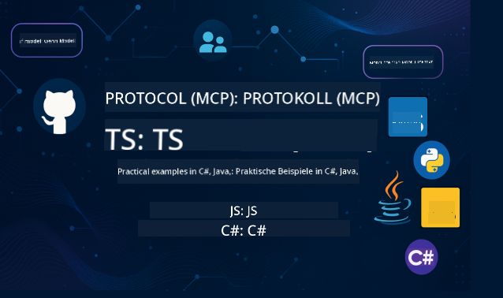

<!--
CO_OP_TRANSLATOR_METADATA:
{
  "original_hash": "ef91fb1b07a52b94c0d4827a8b39216d",
  "translation_date": "2025-07-02T05:56:07+00:00",
  "source_file": "README.md",
  "language_code": "de"
}
-->
 

Folge diesen Schritten, um mit diesen Ressourcen zu starten:
1. **Forke das Repository**: Klicke auf 
2. **Klon das Repository**:   `git clone https://github.com/microsoft/mcp-for-beginners.git`
3. [**Tritt dem Azure AI Foundry Discord bei und triff Experten sowie andere Entwickler**](https://discord.com/invite/ByRwuEEgH4)

### 🌐 Mehrsprachige Unterstützung

#### Unterstützt über GitHub Action (Automatisiert & immer aktuell)

# 🚀 Model Context Protocol (MCP) Lehrplan für Einsteiger

## **Lerne MCP mit praktischen Codebeispielen in C#, Java, JavaScript, Python und TypeScript**

## 🧠 Überblick über den Model Context Protocol Lehrplan

Das **Model Context Protocol (MCP)** ist ein modernes Framework, das entwickelt wurde, um die Interaktionen zwischen KI-Modellen und Client-Anwendungen zu standardisieren. Dieser Open-Source-Lehrplan bietet einen strukturierten Lernpfad mit praxisnahen Codebeispielen und realen Anwendungsfällen in beliebten Programmiersprachen wie C#, Java, JavaScript, TypeScript und Python.

Egal, ob du KI-Entwickler, Systemarchitekt oder Softwareingenieur bist – dieser Leitfaden ist deine umfassende Ressource, um die Grundlagen und Implementierungsstrategien von MCP zu meistern.

## 🔗 Offizielle MCP-Ressourcen

- 📘 [MCP Dokumentation](https://modelcontextprotocol.io/) – Ausführliche Tutorials und Benutzerhandbücher  
- 📜 [MCP Spezifikation](https://spec.modelcontextprotocol.io/) – Protokollarchitektur und technische Referenzen  
- 🧑‍💻 [MCP GitHub Repository](https://github.com/modelcontextprotocol) – Open-Source-SDKs, Tools und Codebeispiele  

## Sei dabei bei den MCP Dev Days am 29. und 30. Juli 2025

Mach dich bereit für zwei Tage voller tiefgehender technischer Einblicke, Community-Austausch und praxisnaher Lernmöglichkeiten bei den MCP Dev Days, einem virtuellen Event rund um das Model Context Protocol (MCP) – dem aufstrebenden Standard, der KI-Modelle mit den Tools verbindet, auf die sie angewiesen sind.

➡️ [Zur Anmeldung für MCP Dev Days](https://developer.microsoft.com/en-us/reactor/series/S-1563/)

Du kannst die MCP Dev Days verfolgen, indem du dich auf unserer Eventseite registrierst: https://aka.ms/mcpdevdays. Dort hast du Zugang zu einem Livestream auf YouTube oder Twitch. Alle Inhalte werden aufgezeichnet und anschließend auf dem Microsoft Developer YouTube-Kanal verfügbar sein. Der Quellcode der Demos wird ebenfalls auf GitHub bereitgestellt.

### Veranstaltungsdetails
- Termine: 29. Juli (Tag 1) & 30. Juli (Tag 2)
- Zeit: Täglich um 9:00 Uhr PST
- Ort: Online – Teilnahme von überall möglich!

#### Tag 1: MCP Produktivität, DevTools & Community

Dreht sich darum, Entwickler zu befähigen, MCP in ihren Entwicklungsprozess einzubinden und die großartige MCP-Community zu feiern. Wir werden von Community-Mitgliedern und Partnern wie Arcade, Block, Okta und Neon begleitet, die mit Microsoft zusammenarbeiten, um ein offenes, erweiterbares MCP-Ökosystem zu gestalten.  
Echte Demos aus VS Code, Visual Studio, GitHub Copilot und beliebten Community-Tools  
Praktische, kontextbasierte Entwicklungsabläufe  
Von der Community geleitete Sessions und Einblicke  
Egal, ob du gerade erst mit MCP startest oder schon damit arbeitest – Tag 1 liefert Inspiration und umsetzbare Erkenntnisse.

#### Tag 2: MCP-Server mit Zuversicht bauen

Richtet sich an MCP-Entwickler. Wir tauchen tief in Implementierungsstrategien und Best Practices ein, um MCP-Server zu erstellen und MCP in deine KI-Workflows zu integrieren.

### Themen umfassen:

- MCP-Server bauen und in Agenten-Erfahrungen integrieren  
- Prompt-gesteuerte Entwicklung  
- Sicherheitsbest Practices  
- Verwendung von Bausteinen wie Functions, ACA und API Management  
- Registry-Ausrichtung und Tools (1P + 3P)

Wenn du Entwickler, Tool-Entwickler oder KI-Produktstratege bist, ist dieser Tag vollgepackt mit den Insights, die du brauchst, um skalierbare, sichere und zukunftsfähige MCP-Lösungen zu bauen.

## 🧭 MCP Lehrplan Überblick

### Grundlagen des Model Context Protocol  

  
<strong> Lektionen 1-3: Grundlagen des Model Context Protocol</strong>

- **00. Einführung in MCP**  
  Überblick über das Model Context Protocol und seine Bedeutung in KI-Pipelines. [Mehr lesen](./00-Introduction/README.md)
- **01. Erklärung der Kernkonzepte**  
  Tiefgehende Erkundung der zentralen MCP-Konzepte. [Mehr lesen](./01-CoreConcepts/README.md)
- **02. Sicherheit in MCP**  
  Sicherheitsbedrohungen und Best Practices. [Mehr lesen](./02-Security/README.md)
- **03. Erste Schritte mit MCP**  
  Einrichtung der Umgebung, grundlegende Server/Clients, Integration. [Mehr lesen](./03-GettingStarted/README.md)

### Bau und Deployment deines ersten MCP-Servers und Clients sowie praktische Übungen und Szenarien  

  
<strong> Lektion 3: Bau und Deployment deines ersten MCP-Servers und Clients</strong>

- **3.1. Erster Server** – [Anleitung](./03-GettingStarted/01-first-server/README.md)
- **3.2. Erster Client** – [Anleitung](./03-GettingStarted/02-client/README.md)
- **3.3. Client mit LLM** – [Anleitung](./03-GettingStarted/03-llm-client/README.md)
- **3.4. Nutzung eines Servers mit Visual Studio Code** – [Anleitung](./03-GettingStarted/04-vscode/README.md)
- **3.5. Erstellung eines Servers mit SSE** – [Anleitung](./03-GettingStarted/05-sse-server/README.md)
- **3.6. HTTP Streaming** – [Anleitung](./03-GettingStarted/06-http-streaming/README.md)
- **3.7. Nutzung des AI Toolkits** – [Anleitung](./03-GettingStarted/07-aitk/README.md)
- **3.8. Testen deines Servers** – [Anleitung](./03-GettingStarted/08-testing/README.md)
- **3.9. Deployment deines Servers** – [Anleitung](./03-GettingStarted/09-deployment/README.md)

### Praktische Implementierungen und Fortgeschrittenes im Model Context Protocol  

  
<strong> Lektionen 4-5: Praktisch & Fortgeschritten</strong>

- **04. Praktische Implementierung**  
  SDKs, Debugging, Testing, wiederverwendbare Prompt-Vorlagen. [Mehr lesen](./04-PracticalImplementation/README.md)
- **05. Fortgeschrittene Themen in MCP**  
  Multimodale KI, Skalierung, Einsatz in Unternehmen. [Mehr lesen](./05-AdvancedTopics/README.md)
- **5.1. MCP Integration mit Azure** – [Anleitung](./05-AdvancedTopics/mcp-integration/README.md)
- **5.2. Multimodalität** – [Anleitung](./05-AdvancedTopics/mcp-multi-modality/README.md)
- **5.3. MCP OAuth2 Demo** – [Anleitung](./05-AdvancedTopics/mcp-oauth2-demo/README.md)
- **5.4. Root Contexts** – [Anleitung](./05-AdvancedTopics/mcp-root-contexts/README.md)
- **5.5. Routing** – [Anleitung](./05-AdvancedTopics/mcp-routing/README.md)
- **5.6. Sampling** – [Anleitung](./05-AdvancedTopics/mcp-sampling/README.md)
- **5.7. Skalierung** – [Anleitung](./05-AdvancedTopics/mcp-scaling/README.md)
- **5.8. Sicherheit** – [Anleitung](./05-AdvancedTopics/mcp-security/README.md)
- **5.9. Web Search MCP** – [Anleitung](./05-AdvancedTopics/web-search-mcp/README.md)
- **5.10. Echtzeit-Streaming** – [Anleitung](./05-AdvancedTopics/mcp-realtimestreaming/README.md)
- **5.11. Echtzeit-Websuche** – [Anleitung](./05-AdvancedTopics/mcp-realtimesearch/README.md)
- **5.12. Entra ID Authentifizierung für Model Context Protocol Server** – [Guide](./05-AdvancedTopics/mcp-security-entra/README.md)

### Best Practices für das Model Context Protocol  

  
<strong> Lektionen 6-9: Community, Best Practices & Labs</strong>

- **06. Beiträge aus der Community** – [Guide](./06-CommunityContributions/README.md)
- **07. Erkenntnisse aus der frühen Nutzung** – [Guide](./07-LessonsFromEarlyAdoption/README.md)
- **08. Best Practices für MCP** – [Guide](./08-BestPractices/README.md)
- **09. MCP Fallstudien** – [Guide](./09-CaseStudy/README.md)

### Model Context Protocol Hands-on-Lab mit AI Toolkit für VScode  

  
<strong>Lektion 10: Hands-on-Lab zum Aufbau eines MCP Servers mit AI Toolkit für VScode 

    
- **10. Effiziente AI-Workflows: Aufbau eines MCP Servers mit AI Toolkit** – [Hands On Lab](./10-StreamliningAIWorkflowsBuildingAnMCPServerWithAIToolkit/README.md)

## Model Context Protocol Beispielprojekte: Aufbau eines MCP Taschenrechner-Projekts in Java, C#, JavaScript, TypeScript und Python

### 🧮 MCP Taschenrechner Beispielprojekte in Java, C#, JavaScript, TypeScript und Python  

  
<strong>Code-Implementierungen nach Sprache erkunden</strong>

  - [C# MCP Server Beispiel](./03-GettingStarted/samples/csharp/README.md)
  - [Java MCP Taschenrechner](./03-GettingStarted/samples/java/calculator/README.md)
  - [JavaScript MCP Demo](./03-GettingStarted/samples/javascript/README.md)
  - [Python MCP Server](../../03-GettingStarted/samples/python/mcp_calculator_server.py)
  - [TypeScript MCP Beispiel](./03-GettingStarted/samples/typescript/README.md)

### 💡 MCP Fortgeschrittene Beispiel-Lösung: Taschenrechner-Projekte in C#, Java, JavaScript, TypeScript und Python  

  
<strong>Fortgeschrittene Beispiele erkunden</strong>

  - [Fortgeschrittenes C# Beispiel](./04-PracticalImplementation/samples/csharp/README.md)
  - [Java Container App Beispiel](./04-PracticalImplementation/samples/java/containerapp/README.md)
  - [JavaScript Fortgeschrittenes Beispiel](./04-PracticalImplementation/samples/javascript/README.md)
  - [Python Komplexe Implementierung](../../04-PracticalImplementation/samples/python/mcp_sample.py)
  - [TypeScript Container Beispiel](./04-PracticalImplementation/samples/typescript/README.md)

## 🎯 Voraussetzungen für das Lernen von MCP

Um das Beste aus diesem Curriculum herauszuholen, solltest du folgende Kenntnisse mitbringen:

- Grundkenntnisse in C#, Java oder Python  
- Verständnis des Client-Server-Modells und von APIs  
- (Optional) Vertrautheit mit Konzepten des maschinellen Lernens  

## 📚 Studienleitfaden

Ein umfassender [Studienleitfaden](./study_guide.md) steht zur Verfügung, um dir die Navigation in diesem Repository zu erleichtern. Der Leitfaden beinhaltet:

- Eine visuelle Curriculum-Übersicht mit allen behandelten Themen  
- Detaillierte Aufschlüsselung der einzelnen Repository-Bereiche  
- Hinweise zur Nutzung der Beispielprojekte  
- Empfohlene Lernpfade für unterschiedliche Erfahrungsstufen  
- Zusätzliche Ressourcen zur Ergänzung deiner Lernreise  

## 🛠️ Wie du dieses Curriculum effektiv nutzt

Jede Lektion in diesem Leitfaden enthält:

1. Klare Erklärungen der MCP-Konzepte  
2. Live-Code-Beispiele in mehreren Programmiersprachen  
3. Übungen zum Aufbau echter MCP-Anwendungen  
4. Zusätzliche Ressourcen für Fortgeschrittene  

## 🌟 Dank an die Community

Danke an Microsoft Valued Professional [Shivam Goyal](https://www.linkedin.com/in/shivam2003/) für die Bereitstellung wichtiger Codebeispiele.

## 📜 Lizenzinformationen

Dieser Inhalt steht unter der **MIT License**. Für die Bedingungen siehe die [LICENSE](../../LICENSE).

## 🤝 Richtlinien für Beiträge

Dieses Projekt freut sich über Beiträge und Vorschläge. Die meisten Beiträge erfordern, dass du einer Contributor License Agreement (CLA) zustimmst, in dem du erklärst, dass du die Rechte besitzt und tatsächlich gewährst, dass wir deine Beiträge nutzen dürfen. Details findest du unter <https://cla.opensource.microsoft.com>.

Wenn du eine Pull-Anfrage einreichst, bestimmt ein CLA-Bot automatisch, ob du eine CLA bereitstellen musst, und versieht die PR entsprechend (z. B. Statusprüfung, Kommentar). Folge einfach den Anweisungen des Bots. Dies musst du nur einmal für alle Repositories mit unserer CLA tun.

Dieses Projekt hat den [Microsoft Open Source Code of Conduct](https://opensource.microsoft.com/codeofconduct/) übernommen.  
Weitere Informationen findest du in den [Code of Conduct FAQ](https://opensource.microsoft.com/codeofconduct/faq/) oder kontaktiere [opencode@microsoft.com](mailto:opencode@microsoft.com) bei Fragen oder Anmerkungen.

## 🎒 Weitere Kurse  
Unser Team bietet weitere Kurse an! Schau dir an:

- [AI Agents For Beginners](https://github.com/microsoft/ai-agents-for-beginners?WT.mc_id=academic-105485-koreyst)  
- [Generative AI for Beginners using .NET](https://github.com/microsoft/Generative-AI-for-beginners-dotnet?WT.mc_id=academic-105485-koreyst)  
- [Generative AI for Beginners using JavaScript](https://github.com/microsoft/generative-ai-with-javascript?WT.mc_id=academic-105485-koreyst)  
- [Generative AI for Beginners](https://github.com/microsoft/generative-ai-for-beginners?WT.mc_id=academic-105485-koreyst)  
- [ML for Beginners](https://aka.ms/ml-beginners?WT.mc_id=academic-105485-koreyst)  
- [Data Science for Beginners](https://aka.ms/datascience-beginners?WT.mc_id=academic-105485-koreyst)  
- [AI for Beginners](https://aka.ms/ai-beginners?WT.mc_id=academic-105485-koreyst)  
- [Cybersecurity for Beginners](https://github.com/microsoft/Security-101??WT.mc_id=academic-96948-sayoung)
- [Webentwicklung für Einsteiger](https://aka.ms/webdev-beginners?WT.mc_id=academic-105485-koreyst)
- [IoT für Einsteiger](https://aka.ms/iot-beginners?WT.mc_id=academic-105485-koreyst)
- [XR-Entwicklung für Einsteiger](https://github.com/microsoft/xr-development-for-beginners?WT.mc_id=academic-105485-koreyst)
- [GitHub Copilot für KI-Paarprogrammierung meistern](https://aka.ms/GitHubCopilotAI?WT.mc_id=academic-105485-koreyst)
- [GitHub Copilot für C#/.NET-Entwickler meistern](https://github.com/microsoft/mastering-github-copilot-for-dotnet-csharp-developers?WT.mc_id=academic-105485-koreyst)
- [Wähle dein eigenes Copilot-Abenteuer](https://github.com/microsoft/CopilotAdventures?WT.mc_id=academic-105485-koreyst)

## ™️ Markenzeichen-Hinweis

Dieses Projekt kann Marken oder Logos von Projekten, Produkten oder Dienstleistungen enthalten. Die autorisierte Nutzung von Microsoft
Markenzeichen oder Logos unterliegt den
[Microsoft Markenzeichen- und Markenrichtlinien](https://www.microsoft.com/legal/intellectualproperty/trademarks/usage/general) und muss diesen entsprechen.
Die Verwendung von Microsoft-Markenzeichen oder Logos in veränderten Versionen dieses Projekts darf keine Verwirrung stiften oder eine Microsoft-Unterstützung suggerieren.
Jegliche Nutzung von Marken oder Logos Dritter unterliegt den jeweiligen Richtlinien dieser Dritten.

**Haftungsausschluss**:  
Dieses Dokument wurde mit dem KI-Übersetzungsdienst [Co-op Translator](https://github.com/Azure/co-op-translator) übersetzt. Obwohl wir uns um Genauigkeit bemühen, beachten Sie bitte, dass automatisierte Übersetzungen Fehler oder Ungenauigkeiten enthalten können. Das Originaldokument in seiner Ausgangssprache ist als maßgebliche Quelle zu betrachten. Für wichtige Informationen wird eine professionelle menschliche Übersetzung empfohlen. Wir übernehmen keine Haftung für Missverständnisse oder Fehlinterpretationen, die aus der Verwendung dieser Übersetzung entstehen.