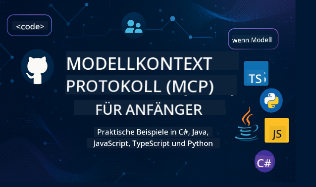

<!--
CO_OP_TRANSLATOR_METADATA:
{
  "original_hash": "2a21391378c12ecfef50f866329dfde0",
  "translation_date": "2025-05-17T05:06:08+00:00",
  "source_file": "README.md",
  "language_code": "de"
}
-->

Folgen Sie diesen Schritten, um diese Ressource zu nutzen:
1. **Repository forken**: Klicken Sie auf 
2. **Repository klonen**: `git clone https://github.com/microsoft/mcp-for-beginners.git`
3. [**Treten Sie dem Microsoft Azure AI Foundry Discord bei und treffen Sie Experten und andere Entwickler**](https://discord.com/invite/ByRwuEEgH4)

### 🌐 Mehrsprachige Unterstützung

#### Unterstützt durch GitHub Action (Automatisiert & immer aktuell)
[Französisch](../fr/README.md) | [Spanisch](../es/README.md) | [Deutsch](./README.md) | [Russisch](../ru/README.md) | [Arabisch](../ar/README.md) | [Persisch (Farsi)](../fa/README.md) | [Urdu](../ur/README.md) | [Chinesisch (Vereinfacht)](../zh/README.md) | [Chinesisch (Traditionell, Macau)](../mo/README.md) | [Chinesisch (Traditionell, Hongkong)](../hk/README.md) | [Chinesisch (Traditionell, Taiwan)](../tw/README.md) | [Japanisch](../ja/README.md) | [Koreanisch](../ko/README.md) | [Hindi](../hi/README.md) | [Bengalisch](../bn/README.md) | [Marathi](../mr/README.md) | [Nepali](../ne/README.md) | [Punjabi (Gurmukhi)](../pa/README.md) | [Portugiesisch (Portugal)](../pt/README.md) | [Portugiesisch (Brasilien)](../br/README.md) | [Italienisch](../it/README.md) | [Polnisch](../pl/README.md) | [Türkisch](../tr/README.md) | [Griechisch](../el/README.md) | [Thailändisch](../th/README.md) | [Schwedisch](../sv/README.md) | [Dänisch](../da/README.md) | [Norwegisch](../no/README.md) | [Finnisch](../fi/README.md) | [Niederländisch](../nl/README.md) | [Hebräisch](../he/README.md) | [Vietnamesisch](../vi/README.md) | [Indonesisch](../id/README.md) | [Malaiisch](../ms/README.md) | [Tagalog (Filipino)](../tl/README.md) | [Swahili](../sw/README.md) | [Ungarisch](../hu/README.md) | [Tschechisch](../cs/README.md) | [Slowakisch](../sk/README.md) | [Rumänisch](../ro/README.md) | [Bulgarisch](../bg/README.md) | [Serbisch (Kyrillisch)](../sr/README.md) | [Kroatisch](../hr/README.md) | [Slowenisch](../sl/README.md)
# 🚀 Ultimativer Leitfaden zum Model Context Protocol (MCP) Curriculum für Anfänger

## **Lerne MCP mit praktischen Code-Beispielen in C#, Java, JavaScript, Python und TypeScript**

## 🧠 Überblick über das Model Context Protocol Curriculum

Das **Model Context Protocol (MCP)** ist ein hochmodernes Framework, das entwickelt wurde, um Interaktionen zwischen KI-Modellen und Client-Anwendungen zu standardisieren. Dieses Open-Source-Curriculum bietet einen strukturierten Lernpfad, komplett mit praktischen Programmierbeispielen und realen Anwendungsfällen, in beliebten Programmiersprachen wie C#, Java, JavaScript, TypeScript und Python.

Egal, ob du ein KI-Entwickler, Systemarchitekt oder Software-Ingenieur bist, dieser Leitfaden ist deine umfassende Ressource, um die Grundlagen von MCP und Implementierungsstrategien zu meistern.

## 🔗 Offizielle MCP-Ressourcen

- 📘 [MCP-Dokumentation](https://modelcontextprotocol.io/) – Detaillierte Tutorials und Benutzerhandbücher  
- 📜 [MCP-Spezifikation](https://spec.modelcontextprotocol.io/) – Protokollarchitektur und technische Referenzen  
- 🧑‍💻 [MCP GitHub Repository](https://github.com/modelcontextprotocol) – Open-Source-SDKs, Tools und Code-Beispiele  

## 🧭 Vollständige MCP Curriculum Struktur

### 📌 [Einführung in MCP](./00-Introduction/README.md)

- Was ist das Model Context Protocol?
- Warum Standardisierung in KI-Pipelines wichtig ist
- Praktische Anwendungsfälle und Vorteile von MCP

### 🧩 [Kernkonzepte erklärt](./01-CoreConcepts/README.md)

- Verständnis der Client-Server-Architektur in MCP
- Wichtige Protokollkomponenten: Anfragen, Antworten und Schemata
- MCP-Nachrichten- und Datenaustauschmuster

### 🔐 [Sicherheit in MCP](./02-Security/readme.md)

- Erkennen von Sicherheitsbedrohungen in MCP-basierten Systemen
- Techniken und bewährte Praktiken zur Sicherung von Implementierungen

### 🚀 [Erste Schritte mit MCP](./03-GettingStarted/README.md)

- Einrichten der Umgebung und Konfiguration
- Erstellen von grundlegenden MCP-Servern und -Clients
- Integration von MCP in bestehende Anwendungen

#### 🧮 MCP-Rechner-Beispielprojekte:

  
<strong>Erkunde Code-Implementierungen nach Sprache</strong>

  - [C# MCP-Server-Beispiel](./03-GettingStarted/samples/csharp/README.md)
  - [Java MCP-Rechner](./03-GettingStarted/samples/java/calculator/README.md)
  - [JavaScript MCP-Demo](./03-GettingStarted/samples/javascript/README.md)
  - [Python MCP-Server](../../03-GettingStarted/samples/python/mcp_calculator_server.py)
  - [TypeScript MCP-Beispiel](./03-GettingStarted/samples/typescript/README.md)

### 🛠️ [Praktische Umsetzung](./04-PracticalImplementation/README.md)

- Verwendung von SDKs in verschiedenen Sprachen
- Debugging, Testen und Validierung
- Erstellung wiederverwendbarer Prompt-Vorlagen und Workflows

#### 💡 MCP-Erweiterte Rechner-Projekte:

  
<strong>Erkunde erweiterte Beispiele</strong>

  - [Erweitertes C# Beispiel](./04-PracticalImplementation/samples/csharp/README.md)
  - [Java Container-App-Beispiel](./04-PracticalImplementation/samples/java/containerapp/README.md)
  - [JavaScript Erweitertes Beispiel](./04-PracticalImplementation/samples/javascript/README.md)
  - [Python Komplexe Implementierung](../../04-PracticalImplementation/samples/python/mcp_sample.py)
  - [TypeScript Container-Beispiel](./04-PracticalImplementation/samples/typescript/README.md)

### 🎓 [Fortgeschrittene Themen in MCP](./05-AdvancedTopics/README.md)

- Multimodale KI-Workflows und Erweiterbarkeit
- Sichere Skalierungsstrategien
- MCP in Unternehmensökosystemen

### 🌍 [Beiträge der Gemeinschaft](./06-CommunityContributions/README.md)

- Wie man Code und Dokumente beiträgt
- Zusammenarbeit über GitHub
- Gemeinschaftsgetriebene Verbesserungen und Feedback

### 📈 [Erkenntnisse aus der frühen Einführung](./07-CaseStudies/README.md)

- Reale Implementierungen und was funktioniert hat
- Aufbau und Bereitstellung von MCP-basierten Lösungen
- Trends und zukünftige Roadmap

### 📏 [Best Practices für MCP](./08-BestPractices/README.md)

- Leistungsoptimierung und -optimierung
- Entwurf fehlertoleranter MCP-Systeme
- Test- und Resilienzstrategien

### 📊 [MCP-Fallstudien](./09-CaseStudy/Readme.md)

- Tiefgehende Einblicke in MCP-Lösungsarchitekturen
- Bereitstellungspläne und Integrationstipps
- Kommentierte Diagramme und Projekt-Durchgänge

## 🎯 Voraussetzungen für das Lernen von MCP

Um das Beste aus diesem Curriculum herauszuholen, solltest du haben:

- Grundkenntnisse in C#, Java oder Python
- Verständnis des Client-Server-Modells und von APIs
- (Optional) Vertrautheit mit maschinellen Lernkonzepten

## 🛠️ Wie man dieses Curriculum effektiv nutzt

Jede Lektion in diesem Leitfaden enthält:

1. Klare Erklärungen der MCP-Konzepte  
2. Live-Code-Beispiele in mehreren Sprachen  
3. Übungen zum Aufbau realer MCP-Anwendungen  
4. Zusätzliche Ressourcen für fortgeschrittene Lernende  

## 📜 Lizenzinformationen

Dieser Inhalt ist unter der **MIT-Lizenz** lizenziert. Für Bedingungen siehe die [LICENSE](../../LICENSE).

## 🤝 Richtlinien für Beiträge

Dieses Projekt begrüßt Beiträge und Vorschläge. Die meisten Beiträge erfordern, dass du einer
Contributor License Agreement (CLA) zustimmst, die erklärt, dass du das Recht hast, und tatsächlich, uns die
Rechte zur Nutzung deines Beitrags gewährst. Für Details besuche <https://cla.opensource.microsoft.com>.

Wenn du eine Pull-Anfrage einreichst, wird ein CLA-Bot automatisch bestimmen, ob du eine CLA bereitstellen musst
und die PR entsprechend dekorieren (z. B. Statusprüfung, Kommentar). Folge einfach den Anweisungen
des Bots. Du musst dies nur einmal für alle Repos tun, die unsere CLA verwenden.

Dieses Projekt hat den [Microsoft Open Source Code of Conduct](https://opensource.microsoft.com/codeofconduct/) übernommen.
Für weitere Informationen siehe die [Code of Conduct FAQ](https://opensource.microsoft.com/codeofconduct/faq/) oder
kontaktiere [opencode@microsoft.com](mailto:opencode@microsoft.com) bei weiteren Fragen oder Kommentaren.

## ™️ Markenhinweis

Dieses Projekt kann Marken oder Logos für Projekte, Produkte oder Dienstleistungen enthalten. Die autorisierte Verwendung von Microsoft
Marken oder Logos unterliegt und muss den
[Microsoft's Trademark & Brand Guidelines](https://www.microsoft.com/legal/intellectualproperty/trademarks/usage/general) folgen.
Die Verwendung von Microsoft-Marken oder -Logos in modifizierten Versionen dieses Projekts darf keine Verwirrung stiften oder eine Microsoft-Sponsoring implizieren.
Jegliche Verwendung von Marken oder Logos Dritter unterliegt den Richtlinien dieser Dritten.

**Haftungsausschluss**:  
Dieses Dokument wurde mit dem KI-Übersetzungsdienst [Co-op Translator](https://github.com/Azure/co-op-translator) übersetzt. Obwohl wir uns um Genauigkeit bemühen, beachten Sie bitte, dass automatisierte Übersetzungen Fehler oder Ungenauigkeiten enthalten können. Das Originaldokument in seiner ursprünglichen Sprache sollte als maßgebliche Quelle betrachtet werden. Für kritische Informationen wird eine professionelle menschliche Übersetzung empfohlen. Wir übernehmen keine Haftung für Missverständnisse oder Fehlinterpretationen, die sich aus der Nutzung dieser Übersetzung ergeben.