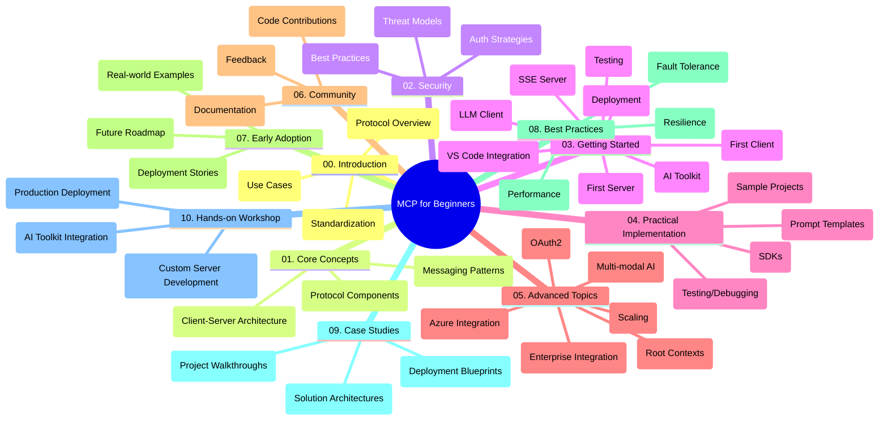

<!--
CO_OP_TRANSLATOR_METADATA:
{
  "original_hash": "a607d4febc94caee9a12b77795f7fc9a",
  "translation_date": "2025-06-11T16:35:46+00:00",
  "source_file": "study_guide.md",
  "language_code": "de"
}
-->
# Model Context Protocol (MCP) für Einsteiger – Lernleitfaden

Dieser Lernleitfaden bietet einen Überblick über die Struktur und den Inhalt des Repositories für den Kurs "Model Context Protocol (MCP) für Einsteiger". Nutze diesen Leitfaden, um dich effizient im Repository zurechtzufinden und die verfügbaren Ressourcen optimal zu nutzen.

## Überblick über das Repository

Das Model Context Protocol (MCP) ist ein standardisiertes Framework für die Interaktion zwischen KI-Modellen und Client-Anwendungen. Dieses Repository stellt einen umfassenden Lehrplan mit praxisnahen Codebeispielen in C#, Java, JavaScript, Python und TypeScript bereit, der sich an KI-Entwickler, Systemarchitekten und Softwareingenieure richtet.

## Visuelle Kursübersicht

## Struktur des Repositories

Das Repository ist in zehn Hauptabschnitte unterteilt, die jeweils unterschiedliche Aspekte des MCP behandeln:

1. **Introduction (00-Introduction/)**
   - Überblick über das Model Context Protocol
   - Warum Standardisierung in KI-Pipelines wichtig ist
   - Praktische Anwendungsfälle und Vorteile

2. **Core Concepts (01-CoreConcepts/)**
   - Client-Server-Architektur
   - Wichtige Protokollkomponenten
   - Nachrichtenmuster im MCP

3. **Security (02-Security/)**
   - Sicherheitsbedrohungen in MCP-basierten Systemen
   - Best Practices für sichere Implementierungen
   - Strategien für Authentifizierung und Autorisierung

4. **Getting Started (03-GettingStarted/)**
   - Einrichtung und Konfiguration der Umgebung
   - Erstellen einfacher MCP-Server und Clients
   - Integration in bestehende Anwendungen
   - Unterabschnitte für ersten Server, ersten Client, LLM-Client, VS Code-Integration, SSE-Server, AI Toolkit, Testing und Deployment

5. **Practical Implementation (04-PracticalImplementation/)**
   - Nutzung von SDKs in verschiedenen Programmiersprachen
   - Debugging-, Test- und Validierungsmethoden
   - Erstellung wiederverwendbarer Prompt-Vorlagen und Workflows
   - Beispielprojekte mit Implementierungsbeispielen

6. **Advanced Topics (05-AdvancedTopics/)**
   - Multimodale KI-Workflows und Erweiterbarkeit
   - Sichere Skalierungsstrategien
   - MCP in Unternehmensökosystemen
   - Spezialthemen wie Azure-Integration, Multimodalität, OAuth2, Root-Kontexte, Routing, Sampling, Skalierung, Sicherheit, Websuche-Integration und Streaming

7. **Community Contributions (06-CommunityContributions/)**
   - Wie man Code und Dokumentation beiträgt
   - Zusammenarbeit über GitHub
   - Community-getriebene Verbesserungen und Feedback

8. **Lessons from Early Adoption (07-LessonsfromEarlyAdoption/)**
   - Praxisnahe Implementierungen und Erfolgsgeschichten
   - Aufbau und Bereitstellung MCP-basierter Lösungen
   - Trends und zukünftige Roadmap

9. **Best Practices (08-BestPractices/)**
   - Performance-Optimierung und Feintuning
   - Entwicklung fehlertoleranter MCP-Systeme
   - Test- und Resilienzstrategien

10. **Case Studies (09-CaseStudy/)**
    - Tiefgehende Analysen von MCP-Lösungsarchitekturen
    - Bereitstellungspläne und Integrationstipps
    - Annotierte Diagramme und Projektbeispiele

11. **Hands-on Workshop (10-StreamliningAIWorkflowsBuildingAnMCPServerWithAIToolkit/)**
    - Umfassender Praxis-Workshop, der MCP mit Microsofts AI Toolkit für VS Code kombiniert
    - Entwicklung intelligenter Anwendungen, die KI-Modelle mit realen Werkzeugen verbinden
    - Praktische Module zu Grundlagen, individueller Serverentwicklung und Produktionsbereitstellung

## Beispielprojekte

Das Repository enthält mehrere Beispielprojekte, die die MCP-Implementierung in verschiedenen Programmiersprachen demonstrieren:

### Einfache MCP Rechner-Beispiele
- C# MCP Server Beispiel
- Java MCP Rechner
- JavaScript MCP Demo
- Python MCP Server
- TypeScript MCP Beispiel

### Erweiterte MCP Rechner-Projekte
- Fortgeschrittenes C# Beispiel
- Java Container App Beispiel
- JavaScript Fortgeschrittenes Beispiel
- Python Komplexe Implementierung
- TypeScript Container Beispiel

## Zusätzliche Ressourcen

Das Repository beinhaltet unterstützende Ressourcen:

- **Images-Ordner**: Enthält Diagramme und Illustrationen, die im Kurs verwendet werden
- **Translations**: Mehrsprachige Unterstützung mit automatisierten Übersetzungen der Dokumentation
- **Offizielle MCP-Ressourcen**:
  - [MCP Documentation](https://modelcontextprotocol.io/)
  - [MCP Specification](https://spec.modelcontextprotocol.io/)
  - [MCP GitHub Repository](https://github.com/modelcontextprotocol)

## Nutzung des Repositories

1. **Sequenzielles Lernen**: Folge den Kapiteln in der Reihenfolge (00 bis 10) für ein strukturiertes Lernerlebnis.
2. **Sprachspezifischer Fokus**: Wenn du dich für eine bestimmte Programmiersprache interessierst, schaue in die jeweiligen Beispielverzeichnisse für Implementierungen in deiner bevorzugten Sprache.
3. **Praktische Umsetzung**: Beginne mit dem Abschnitt "Getting Started", um deine Umgebung einzurichten und deinen ersten MCP-Server und -Client zu erstellen.
4. **Vertiefte Erkundung**: Sobald du mit den Grundlagen vertraut bist, kannst du dich in die fortgeschrittenen Themen vertiefen, um dein Wissen zu erweitern.
5. **Community-Engagement**: Trete dem [Azure AI Foundry Discord](https://discord.com/invite/ByRwuEEgH4) bei, um dich mit Experten und anderen Entwicklern auszutauschen.

## Beiträge

Dieses Repository freut sich über Beiträge aus der Community. Sieh dir den Abschnitt Community Contributions an, um zu erfahren, wie du dich einbringen kannst.

---

*Dieser Lernleitfaden wurde am 11. Juni 2025 erstellt und bietet einen Überblick über den Stand des Repositories zu diesem Zeitpunkt. Der Inhalt des Repositories kann seitdem aktualisiert worden sein.*

**Haftungsausschluss**:  
Dieses Dokument wurde mithilfe des KI-Übersetzungsdienstes [Co-op Translator](https://github.com/Azure/co-op-translator) übersetzt. Obwohl wir uns um Genauigkeit bemühen, beachten Sie bitte, dass automatisierte Übersetzungen Fehler oder Ungenauigkeiten enthalten können. Das Originaldokument in seiner Ursprungssprache ist als maßgebliche Quelle zu betrachten. Für wichtige Informationen wird eine professionelle menschliche Übersetzung empfohlen. Wir übernehmen keine Haftung für Missverständnisse oder Fehlinterpretationen, die durch die Nutzung dieser Übersetzung entstehen.