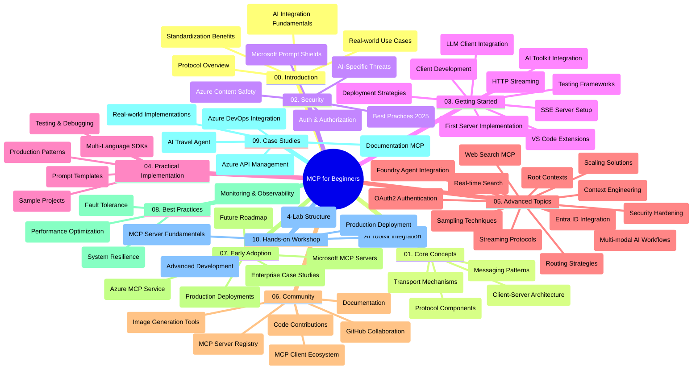

<!--
CO_OP_TRANSLATOR_METADATA:
{
  "original_hash": "e2c6ed897fa98fa08e0146101776c7ff",
  "translation_date": "2025-07-18T09:09:51+00:00",
  "source_file": "study_guide.md",
  "language_code": "de"
}
-->
# Model Context Protocol (MCP) für Einsteiger – Lernleitfaden

Dieser Lernleitfaden bietet einen Überblick über die Struktur und den Inhalt des Repositories für den Lehrplan „Model Context Protocol (MCP) für Einsteiger“. Nutze diesen Leitfaden, um dich effizient im Repository zurechtzufinden und die verfügbaren Ressourcen optimal zu nutzen.

## Überblick über das Repository

Das Model Context Protocol (MCP) ist ein standardisiertes Framework für die Interaktion zwischen KI-Modellen und Client-Anwendungen. Ursprünglich von Anthropic entwickelt, wird MCP heute von der breiteren MCP-Community über die offizielle GitHub-Organisation gepflegt. Dieses Repository bietet einen umfassenden Lehrplan mit praxisnahen Codebeispielen in C#, Java, JavaScript, Python und TypeScript, der sich an KI-Entwickler, Systemarchitekten und Softwareingenieure richtet.

## Visuelle Lehrplanübersicht

## Repository-Struktur

Das Repository ist in zehn Hauptabschnitte gegliedert, die jeweils unterschiedliche Aspekte von MCP behandeln:

1. **Einführung (00-Introduction/)**
   - Überblick über das Model Context Protocol
   - Warum Standardisierung in KI-Pipelines wichtig ist
   - Praktische Anwendungsfälle und Vorteile

2. **Kernkonzepte (01-CoreConcepts/)**
   - Client-Server-Architektur
   - Wichtige Protokollkomponenten
   - Messaging-Muster im MCP

3. **Sicherheit (02-Security/)**
   - Sicherheitsbedrohungen in MCP-basierten Systemen
   - Best Practices zur Absicherung von Implementierungen
   - Authentifizierungs- und Autorisierungsstrategien
   - **Umfassende Sicherheitsdokumentation**:
     - MCP Security Best Practices 2025
     - Azure Content Safety Implementierungsleitfaden
     - MCP Sicherheitskontrollen und Techniken
     - MCP Best Practices Schnellreferenz
   - **Wichtige Sicherheitsthemen**:
     - Prompt Injection und Tool-Poisoning-Angriffe
     - Session Hijacking und Confused Deputy-Probleme
     - Token-Passthrough-Schwachstellen
     - Übermäßige Berechtigungen und Zugriffskontrolle
     - Lieferkettensicherheit für KI-Komponenten
     - Integration von Microsoft Prompt Shields

4. **Erste Schritte (03-GettingStarted/)**
   - Einrichtung und Konfiguration der Umgebung
   - Erstellung einfacher MCP-Server und -Clients
   - Integration in bestehende Anwendungen
   - Enthält Abschnitte zu:
     - Erste Serverimplementierung
     - Client-Entwicklung
     - LLM-Client-Integration
     - VS Code Integration
     - Server-Sent Events (SSE) Server
     - HTTP-Streaming
     - AI Toolkit Integration
     - Teststrategien
     - Deployment-Richtlinien

5. **Praktische Umsetzung (04-PracticalImplementation/)**
   - Nutzung von SDKs in verschiedenen Programmiersprachen
   - Debugging-, Test- und Validierungstechniken
   - Erstellung wiederverwendbarer Prompt-Vorlagen und Workflows
   - Beispielprojekte mit Implementierungsbeispielen

6. **Fortgeschrittene Themen (05-AdvancedTopics/)**
   - Techniken des Context Engineerings
   - Foundry-Agent-Integration
   - Multimodale KI-Workflows
   - OAuth2-Authentifizierungsdemos
   - Echtzeitsuche
   - Echtzeit-Streaming
   - Implementierung von Root Contexts
   - Routing-Strategien
   - Sampling-Techniken
   - Skalierungsansätze
   - Sicherheitsaspekte
   - Entra ID Sicherheitsintegration
   - Web-Suchintegration

7. **Community-Beiträge (06-CommunityContributions/)**
   - Wie man Code und Dokumentation beiträgt
   - Zusammenarbeit über GitHub
   - Community-getriebene Verbesserungen und Feedback
   - Nutzung verschiedener MCP-Clients (Claude Desktop, Cline, VSCode)
   - Arbeit mit beliebten MCP-Servern inklusive Bildgenerierung

8. **Erfahrungen aus der frühen Nutzung (07-LessonsfromEarlyAdoption/)**
   - Praxisnahe Implementierungen und Erfolgsgeschichten
   - Aufbau und Deployment von MCP-basierten Lösungen
   - Trends und zukünftige Roadmap
   - **Microsoft MCP Servers Guide**: Umfassender Leitfaden zu 10 produktionsreifen Microsoft MCP-Servern, darunter:
     - Microsoft Learn Docs MCP Server
     - Azure MCP Server (15+ spezialisierte Connectoren)
     - GitHub MCP Server
     - Azure DevOps MCP Server
     - MarkItDown MCP Server
     - SQL Server MCP Server
     - Playwright MCP Server
     - Dev Box MCP Server
     - Azure AI Foundry MCP Server
     - Microsoft 365 Agents Toolkit MCP Server

9. **Best Practices (08-BestPractices/)**
   - Performance-Tuning und Optimierung
   - Entwurf fehlertoleranter MCP-Systeme
   - Test- und Resilienzstrategien

10. **Fallstudien (09-CaseStudy/)**
    - Beispiel zur Integration von Azure API Management
    - Beispielimplementierung eines Reisebüros
    - Azure DevOps Integration mit YouTube-Updates
    - Dokumentationsbeispiele für MCP-Implementierungen
    - Implementierungsbeispiele mit ausführlicher Dokumentation

11. **Praktischer Workshop (10-StreamliningAIWorkflowsBuildingAnMCPServerWithAIToolkit/)**
    - Umfassender praktischer Workshop zur Kombination von MCP mit AI Toolkit
    - Entwicklung intelligenter Anwendungen, die KI-Modelle mit realen Tools verbinden
    - Praxisorientierte Module zu Grundlagen, individueller Serverentwicklung und Produktions-Deployment-Strategien
    - **Lab-Struktur**:
      - Lab 1: MCP Server Grundlagen
      - Lab 2: Fortgeschrittene MCP Server Entwicklung
      - Lab 3: AI Toolkit Integration
      - Lab 4: Produktions-Deployment und Skalierung
    - Lab-basiertes Lernen mit Schritt-für-Schritt-Anleitungen

## Zusätzliche Ressourcen

Das Repository enthält unterstützende Ressourcen:

- **Images-Ordner**: Enthält Diagramme und Illustrationen, die im Lehrplan verwendet werden
- **Übersetzungen**: Mehrsprachige Unterstützung mit automatisierten Übersetzungen der Dokumentation
- **Offizielle MCP-Ressourcen**:
  - [MCP Documentation](https://modelcontextprotocol.io/)
  - [MCP Specification](https://spec.modelcontextprotocol.io/)
  - [MCP GitHub Repository](https://github.com/modelcontextprotocol)

## Wie man dieses Repository nutzt

1. **Sequenzielles Lernen**: Folge den Kapiteln in der Reihenfolge (00 bis 10) für ein strukturiertes Lernerlebnis.
2. **Sprachspezifischer Fokus**: Wenn du dich für eine bestimmte Programmiersprache interessierst, erkunde die Sample-Verzeichnisse für Implementierungen in deiner bevorzugten Sprache.
3. **Praktische Umsetzung**: Beginne mit dem Abschnitt „Erste Schritte“, um deine Umgebung einzurichten und deinen ersten MCP-Server und -Client zu erstellen.
4. **Fortgeschrittene Erkundung**: Sobald du mit den Grundlagen vertraut bist, tauche in die fortgeschrittenen Themen ein, um dein Wissen zu vertiefen.
5. **Community-Engagement**: Tritt der MCP-Community über GitHub-Diskussionen und Discord-Kanäle bei, um dich mit Experten und anderen Entwicklern auszutauschen.

## MCP-Clients und Tools

Der Lehrplan behandelt verschiedene MCP-Clients und Tools:

1. **Offizielle Clients**:
   - Visual Studio Code
   - MCP in Visual Studio Code
   - Claude Desktop
   - Claude in VSCode
   - Claude API

2. **Community-Clients**:
   - Cline (terminalbasiert)
   - Cursor (Code-Editor)
   - ChatMCP
   - Windsurf

3. **MCP-Verwaltungstools**:
   - MCP CLI
   - MCP Manager
   - MCP Linker
   - MCP Router

## Beliebte MCP-Server

Das Repository stellt verschiedene MCP-Server vor, darunter:

1. **Offizielle Microsoft MCP-Server**:
   - Microsoft Learn Docs MCP Server
   - Azure MCP Server (15+ spezialisierte Connectoren)
   - GitHub MCP Server
   - Azure DevOps MCP Server
   - MarkItDown MCP Server
   - SQL Server MCP Server
   - Playwright MCP Server
   - Dev Box MCP Server
   - Azure AI Foundry MCP Server
   - Microsoft 365 Agents Toolkit MCP Server

2. **Offizielle Referenzserver**:
   - Filesystem
   - Fetch
   - Memory
   - Sequential Thinking

3. **Bildgenerierung**:
   - Azure OpenAI DALL-E 3
   - Stable Diffusion WebUI
   - Replicate

4. **Entwicklungstools**:
   - Git MCP
   - Terminal Control
   - Code Assistant

5. **Spezialisierte Server**:
   - Salesforce
   - Microsoft Teams
   - Jira & Confluence

## Beiträge leisten

Dieses Repository freut sich über Beiträge aus der Community. Siehe den Abschnitt Community-Beiträge für Hinweise, wie du effektiv zum MCP-Ökosystem beitragen kannst.

## Änderungsprotokoll

| Datum         | Änderungen                                                                                              |
|---------------|-------------------------------------------------------------------------------------------------------|
| 18. Juli 2025 | - Aktualisierte Repository-Struktur mit Microsoft MCP Servers Guide - Umfassende Liste von 10 produktionsreifen Microsoft MCP-Servern hinzugefügt - Beliebte MCP-Server-Sektion mit offiziellen Microsoft MCP-Servern erweitert - Fallstudien-Sektion mit tatsächlichen Datei-Beispielen aktualisiert - Details zur Lab-Struktur für den praktischen Workshop ergänzt |
| 16. Juli 2025 | - Repository-Struktur an aktuellen Inhalt angepasst - MCP Clients und Tools Abschnitt hinzugefügt - Beliebte MCP-Server Sektion ergänzt - Visuelle Lehrplanübersicht mit allen aktuellen Themen aktualisiert - Fortgeschrittene Themen mit allen spezialisierten Bereichen erweitert - Fallstudien mit tatsächlichen Beispielen aktualisiert - Herkunft von MCP als von Anthropic erstellt klargestellt |
| 11. Juni 2025 | - Erste Erstellung des Lernleitfadens - Visuelle Lehrplanübersicht hinzugefügt - Repository-Struktur skizziert - Beispielprojekte und zusätzliche Ressourcen aufgenommen |

---

*Dieser Lernleitfaden wurde am 18. Juli 2025 aktualisiert und bietet einen Überblick über das Repository zu diesem Zeitpunkt. Der Inhalt des Repositories kann nach diesem Datum aktualisiert werden.*

**Haftungsausschluss**:  
Dieses Dokument wurde mit dem KI-Übersetzungsdienst [Co-op Translator](https://github.com/Azure/co-op-translator) übersetzt. Obwohl wir uns um Genauigkeit bemühen, beachten Sie bitte, dass automatisierte Übersetzungen Fehler oder Ungenauigkeiten enthalten können. Das Originaldokument in seiner Ursprungssprache ist als maßgebliche Quelle zu betrachten. Für wichtige Informationen wird eine professionelle menschliche Übersetzung empfohlen. Wir übernehmen keine Haftung für Missverständnisse oder Fehlinterpretationen, die aus der Nutzung dieser Übersetzung entstehen.