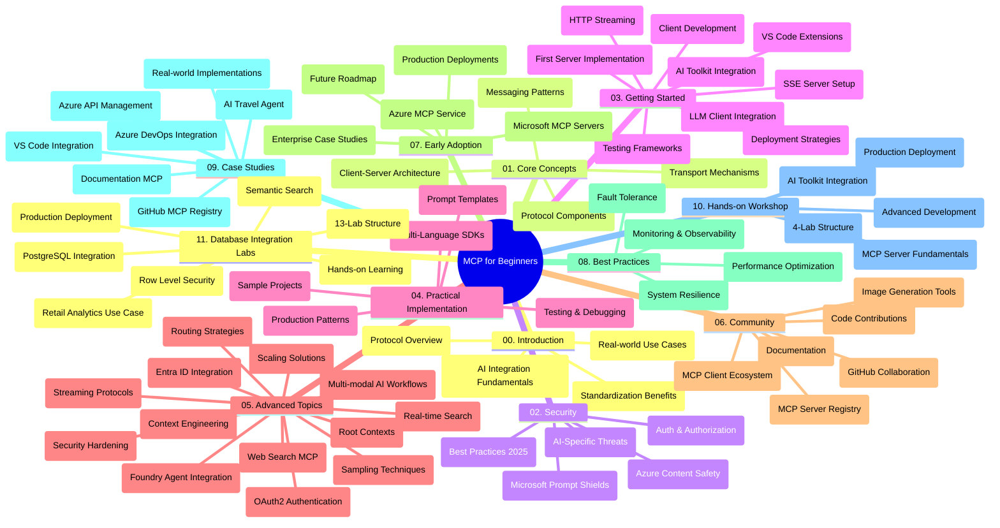

<!--
CO_OP_TRANSLATOR_METADATA:
{
  "original_hash": "aa1ce97bc694b08faf3018bab6d275b9",
  "translation_date": "2025-09-30T13:26:51+00:00",
  "source_file": "study_guide.md",
  "language_code": "de"
}
-->
# Model Context Protocol (MCP) für Anfänger - Lernleitfaden

Dieser Lernleitfaden bietet einen Überblick über die Struktur und Inhalte des Repositorys für das Curriculum "Model Context Protocol (MCP) für Anfänger". Nutzen Sie diesen Leitfaden, um das Repository effizient zu navigieren und die verfügbaren Ressourcen optimal zu nutzen.

## Überblick über das Repository

Das Model Context Protocol (MCP) ist ein standardisiertes Framework für die Interaktion zwischen KI-Modellen und Client-Anwendungen. Ursprünglich von Anthropic entwickelt, wird MCP nun von der breiteren MCP-Community über die offizielle GitHub-Organisation gepflegt. Dieses Repository bietet ein umfassendes Curriculum mit praktischen Codebeispielen in C#, Java, JavaScript, Python und TypeScript, das sich an KI-Entwickler, Systemarchitekten und Softwareingenieure richtet.

## Visuelle Curriculum-Karte

## Struktur des Repositorys

Das Repository ist in elf Hauptabschnitte unterteilt, die jeweils verschiedene Aspekte von MCP behandeln:

1. **Einführung (00-Introduction/)**
   - Überblick über das Model Context Protocol
   - Warum Standardisierung in KI-Pipelines wichtig ist
   - Praktische Anwendungsfälle und Vorteile

2. **Kernkonzepte (01-CoreConcepts/)**
   - Client-Server-Architektur
   - Wichtige Protokollkomponenten
   - Messaging-Muster in MCP

3. **Sicherheit (02-Security/)**
   - Sicherheitsbedrohungen in MCP-basierten Systemen
   - Best Practices zur Sicherung von Implementierungen
   - Strategien für Authentifizierung und Autorisierung
   - **Umfassende Sicherheitsdokumentation**:
     - MCP Sicherheits-Best Practices 2025
     - Azure Content Safety Implementierungsleitfaden
     - MCP Sicherheitskontrollen und Techniken
     - MCP Best Practices Schnellreferenz
   - **Wichtige Sicherheitsthemen**:
     - Prompt Injection und Tool Poisoning Angriffe
     - Session Hijacking und Confused Deputy Probleme
     - Token-Passthrough-Schwachstellen
     - Übermäßige Berechtigungen und Zugriffskontrolle
     - Lieferkettensicherheit für KI-Komponenten
     - Integration von Microsoft Prompt Shields

4. **Erste Schritte (03-GettingStarted/)**
   - Einrichtung und Konfiguration der Umgebung
   - Erstellung grundlegender MCP-Server und -Clients
   - Integration in bestehende Anwendungen
   - Enthält Abschnitte zu:
     - Erste Server-Implementierung
     - Client-Entwicklung
     - LLM-Client-Integration
     - VS Code-Integration
     - Server-Sent Events (SSE) Server
     - HTTP-Streaming
     - AI Toolkit-Integration
     - Teststrategien
     - Bereitstellungsrichtlinien

5. **Praktische Implementierung (04-PracticalImplementation/)**
   - Verwendung von SDKs in verschiedenen Programmiersprachen
   - Debugging-, Test- und Validierungstechniken
   - Erstellung wiederverwendbarer Prompt-Vorlagen und Workflows
   - Beispielprojekte mit Implementierungsbeispielen

6. **Fortgeschrittene Themen (05-AdvancedTopics/)**
   - Techniken des Kontext-Engineerings
   - Integration von Foundry-Agenten
   - Multi-modale KI-Workflows
   - OAuth2-Authentifizierungsdemos
   - Echtzeit-Suchfunktionen
   - Echtzeit-Streaming
   - Implementierung von Root-Kontexten
   - Routing-Strategien
   - Sampling-Techniken
   - Skalierungsansätze
   - Sicherheitsüberlegungen
   - Integration von Entra ID-Sicherheit
   - Web-Suchintegration

7. **Community-Beiträge (06-CommunityContributions/)**
   - Wie man Code und Dokumentation beiträgt
   - Zusammenarbeit über GitHub
   - Community-getriebene Verbesserungen und Feedback
   - Verwendung verschiedener MCP-Clients (Claude Desktop, Cline, VSCode)
   - Arbeiten mit beliebten MCP-Servern, einschließlich Bildgenerierung

8. **Lektionen aus der frühen Einführung (07-LessonsfromEarlyAdoption/)**
   - Implementierungen und Erfolgsgeschichten aus der Praxis
   - Aufbau und Bereitstellung von MCP-basierten Lösungen
   - Trends und zukünftige Roadmap
   - **Microsoft MCP Servers Guide**: Umfassender Leitfaden zu 10 produktionsbereiten Microsoft MCP-Servern, einschließlich:
     - Microsoft Learn Docs MCP Server
     - Azure MCP Server (15+ spezialisierte Konnektoren)
     - GitHub MCP Server
     - Azure DevOps MCP Server
     - MarkItDown MCP Server
     - SQL Server MCP Server
     - Playwright MCP Server
     - Dev Box MCP Server
     - Azure AI Foundry MCP Server
     - Microsoft 365 Agents Toolkit MCP Server

9. **Best Practices (08-BestPractices/)**
   - Leistungsoptimierung und Tuning
   - Gestaltung fehlertoleranter MCP-Systeme
   - Test- und Resilienzstrategien

10. **Fallstudien (09-CaseStudy/)**
    - **Sieben umfassende Fallstudien**, die die Vielseitigkeit von MCP in verschiedenen Szenarien demonstrieren:
    - **Azure AI Travel Agents**: Multi-Agenten-Orchestrierung mit Azure OpenAI und AI Search
    - **Azure DevOps Integration**: Automatisierung von Workflow-Prozessen mit YouTube-Datenaktualisierungen
    - **Echtzeit-Dokumentationsabruf**: Python-Konsolenclient mit HTTP-Streaming
    - **Interaktiver Studienplan-Generator**: Chainlit-Web-App mit konversationeller KI
    - **In-Editor-Dokumentation**: VS Code-Integration mit GitHub Copilot-Workflows
    - **Azure API Management**: Unternehmens-API-Integration mit MCP-Server-Erstellung
    - **GitHub MCP Registry**: Ökosystementwicklung und agentische Integrationsplattform
    - Implementierungsbeispiele, die Unternehmensintegration, Entwicklerproduktivität und Ökosystementwicklung umfassen

11. **Praktischer Workshop (10-StreamliningAIWorkflowsBuildingAnMCPServerWithAIToolkit/)**
    - Umfassender praktischer Workshop, der MCP mit AI Toolkit kombiniert
    - Aufbau intelligenter Anwendungen, die KI-Modelle mit realen Tools verbinden
    - Praktische Module, die Grundlagen, benutzerdefinierte Serverentwicklung und Produktionsbereitstellungsstrategien abdecken
    - **Lab-Struktur**:
      - Lab 1: Grundlagen des MCP-Servers
      - Lab 2: Fortgeschrittene MCP-Server-Entwicklung
      - Lab 3: AI Toolkit-Integration
      - Lab 4: Produktionsbereitstellung und Skalierung
    - Lab-basiertes Lernansatz mit Schritt-für-Schritt-Anleitungen

12. **MCP Server-Datenbank-Integrations-Labs (11-MCPServerHandsOnLabs/)**
    - **Umfassender 13-Lab-Lernpfad** für den Aufbau produktionsbereiter MCP-Server mit PostgreSQL-Integration
    - **Implementierung von Einzelhandelsanalysen aus der Praxis** anhand des Zava Retail-Anwendungsfalls
    - **Muster auf Unternehmensniveau**, einschließlich Row Level Security (RLS), semantischer Suche und Multi-Tenant-Datenzugriff
    - **Komplette Lab-Struktur**:
      - **Labs 00-03: Grundlagen** - Einführung, Architektur, Sicherheit, Einrichtung der Umgebung
      - **Labs 04-06: Aufbau des MCP-Servers** - Datenbankdesign, MCP-Server-Implementierung, Tool-Entwicklung
      - **Labs 07-09: Erweiterte Funktionen** - Semantische Suche, Testen & Debugging, VS Code-Integration
      - **Labs 10-12: Produktion & Best Practices** - Bereitstellung, Überwachung, Optimierung
    - **Abgedeckte Technologien**: FastMCP-Framework, PostgreSQL, Azure OpenAI, Azure Container Apps, Application Insights
    - **Lernziele**: Produktionsbereite MCP-Server, Datenbank-Integrationsmuster, KI-gestützte Analysen, Unternehmenssicherheit

## Zusätzliche Ressourcen

Das Repository enthält unterstützende Ressourcen:

- **Bilder-Ordner**: Enthält Diagramme und Illustrationen, die im gesamten Curriculum verwendet werden
- **Übersetzungen**: Mehrsprachige Unterstützung mit automatisierten Übersetzungen der Dokumentation
- **Offizielle MCP-Ressourcen**:
  - [MCP Dokumentation](https://modelcontextprotocol.io/)
  - [MCP Spezifikation](https://spec.modelcontextprotocol.io/)
  - [MCP GitHub Repository](https://github.com/modelcontextprotocol)

## Verwendung des Repositorys

1. **Sequenzielles Lernen**: Folgen Sie den Kapiteln in der Reihenfolge (00 bis 11) für ein strukturiertes Lernerlebnis.
2. **Sprachspezifischer Fokus**: Wenn Sie an einer bestimmten Programmiersprache interessiert sind, erkunden Sie die Sample-Verzeichnisse für Implementierungen in Ihrer bevorzugten Sprache.
3. **Praktische Implementierung**: Beginnen Sie mit dem Abschnitt "Erste Schritte", um Ihre Umgebung einzurichten und Ihren ersten MCP-Server und -Client zu erstellen.
4. **Fortgeschrittene Erkundung**: Sobald Sie mit den Grundlagen vertraut sind, tauchen Sie in die fortgeschrittenen Themen ein, um Ihr Wissen zu erweitern.
5. **Community-Engagement**: Treten Sie der MCP-Community über GitHub-Diskussionen und Discord-Kanäle bei, um sich mit Experten und anderen Entwicklern zu vernetzen.

## MCP-Clients und Tools

Das Curriculum behandelt verschiedene MCP-Clients und Tools:

1. **Offizielle Clients**:
   - Visual Studio Code 
   - MCP in Visual Studio Code
   - Claude Desktop
   - Claude in VSCode 
   - Claude API

2. **Community-Clients**:
   - Cline (terminalbasiert)
   - Cursor (Code-Editor)
   - ChatMCP
   - Windsurf

3. **MCP-Management-Tools**:
   - MCP CLI
   - MCP Manager
   - MCP Linker
   - MCP Router

## Beliebte MCP-Server

Das Repository stellt verschiedene MCP-Server vor, darunter:

1. **Offizielle Microsoft MCP-Server**:
   - Microsoft Learn Docs MCP Server
   - Azure MCP Server (15+ spezialisierte Konnektoren)
   - GitHub MCP Server
   - Azure DevOps MCP Server
   - MarkItDown MCP Server
   - SQL Server MCP Server
   - Playwright MCP Server
   - Dev Box MCP Server
   - Azure AI Foundry MCP Server
   - Microsoft 365 Agents Toolkit MCP Server

2. **Offizielle Referenz-Server**:
   - Filesystem
   - Fetch
   - Memory
   - Sequential Thinking

3. **Bildgenerierung**:
   - Azure OpenAI DALL-E 3
   - Stable Diffusion WebUI
   - Replicate

4. **Entwicklertools**:
   - Git MCP
   - Terminal Control
   - Code Assistant

5. **Spezialisierte Server**:
   - Salesforce
   - Microsoft Teams
   - Jira & Confluence

## Beiträge leisten

Dieses Repository begrüßt Beiträge aus der Community. Siehe den Abschnitt Community-Beiträge für Anleitungen, wie Sie effektiv zum MCP-Ökosystem beitragen können.

## Änderungsprotokoll

| Datum | Änderungen |
|------|---------||
| 29. September 2025 | - Abschnitt 11-MCPServerHandsOnLabs hinzugefügt mit umfassendem 13-Lab-Datenbank-Integrations-Lernpfad - Visuelle Curriculum-Karte aktualisiert, um Datenbank-Integrations-Labs einzuschließen - Repository-Struktur erweitert, um elf Hauptabschnitte widerzuspiegeln - Detaillierte Beschreibung der PostgreSQL-Integration, des Einzelhandelsanalyse-Anwendungsfalls und der Unternehmensmuster hinzugefügt - Navigationshinweise aktualisiert, um die Abschnitte 00-11 einzuschließen |
| 26. September 2025 | - GitHub MCP Registry Fallstudie zum Abschnitt 09-CaseStudy hinzugefügt - Fallstudien aktualisiert, um sieben umfassende Fallstudien widerzuspiegeln - Fallstudienbeschreibungen mit spezifischen Implementierungsdetails erweitert - Visuelle Curriculum-Karte aktualisiert, um GitHub MCP Registry einzuschließen - Struktur des Lernleitfadens überarbeitet, um den Fokus auf Ökosystementwicklung widerzuspiegeln |
| 18. Juli 2025 | - Repository-Struktur aktualisiert, um Microsoft MCP Servers Guide einzuschließen - Umfassende Liste von 10 produktionsbereiten Microsoft MCP-Servern hinzugefügt - Abschnitt Beliebte MCP-Server mit offiziellen Microsoft MCP-Servern erweitert - Abschnitt Fallstudien mit tatsächlichen Datei-Beispielen aktualisiert - Lab-Strukturdetails für praktischen Workshop hinzugefügt |
| 16. Juli 2025 | - Repository-Struktur aktualisiert, um aktuellen Inhalt widerzuspiegeln - Abschnitt MCP-Clients und Tools hinzugefügt - Abschnitt Beliebte MCP-Server hinzugefügt - Visuelle Curriculum-Karte mit allen aktuellen Themen aktualisiert - Abschnitt Fortgeschrittene Themen mit allen spezialisierten Bereichen erweitert - Abschnitt Fallstudien aktualisiert, um tatsächliche Beispiele widerzuspiegeln - Ursprung von MCP als von Anthropic erstellt klargestellt |
| 11. Juni 2025 | - Ersterstellung des Lernleitfadens - Visuelle Curriculum-Karte hinzugefügt - Repository-Struktur skizziert - Beispielprojekte und zusätzliche Ressourcen eingeschlossen |

---

*Dieser Lernleitfaden wurde am 29. September 2025 aktualisiert und bietet einen Überblick über das Repository zu diesem Datum. Der Inhalt des Repositorys kann nach diesem Datum aktualisiert werden.*

---

**Haftungsausschluss**:  
Dieses Dokument wurde mit dem KI-Übersetzungsdienst [Co-op Translator](https://github.com/Azure/co-op-translator) übersetzt. Obwohl wir uns um Genauigkeit bemühen, beachten Sie bitte, dass automatisierte Übersetzungen Fehler oder Ungenauigkeiten enthalten können. Das Originaldokument in seiner ursprünglichen Sprache sollte als maßgebliche Quelle betrachtet werden. Für kritische Informationen wird eine professionelle menschliche Übersetzung empfohlen. Wir übernehmen keine Haftung für Missverständnisse oder Fehlinterpretationen, die sich aus der Nutzung dieser Übersetzung ergeben.