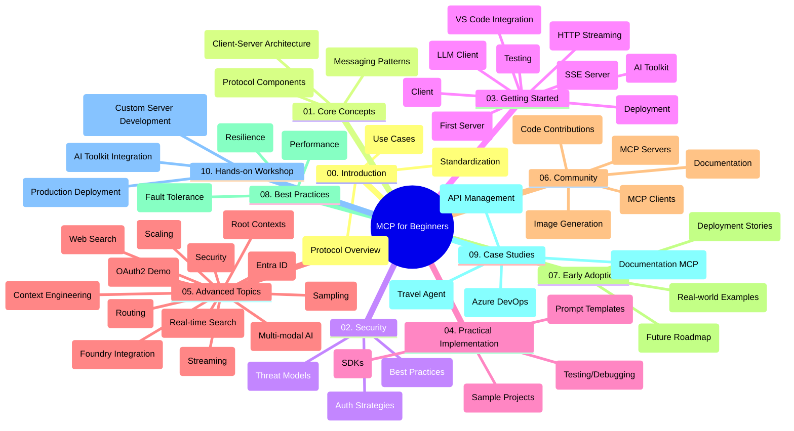

<!--
CO_OP_TRANSLATOR_METADATA:
{
  "original_hash": "77bfab7090f987a5b9fe078f50dbda13",
  "translation_date": "2025-07-16T22:10:46+00:00",
  "source_file": "study_guide.md",
  "language_code": "de"
}
-->
# Model Context Protocol (MCP) für Einsteiger – Lernleitfaden

Dieser Lernleitfaden bietet einen Überblick über die Struktur und den Inhalt des Repositories für den Lehrplan „Model Context Protocol (MCP) für Einsteiger“. Nutze diesen Leitfaden, um dich effizient im Repository zurechtzufinden und die verfügbaren Ressourcen optimal zu nutzen.

## Überblick über das Repository

Das Model Context Protocol (MCP) ist ein standardisiertes Framework für die Interaktion zwischen KI-Modellen und Client-Anwendungen. Ursprünglich von Anthropic entwickelt, wird MCP heute von der breiteren MCP-Community über die offizielle GitHub-Organisation gepflegt. Dieses Repository bietet einen umfassenden Lehrplan mit praxisnahen Codebeispielen in C#, Java, JavaScript, Python und TypeScript, der sich an KI-Entwickler, Systemarchitekten und Softwareingenieure richtet.

## Visuelle Lernübersicht

## Repository-Struktur

Das Repository ist in zehn Hauptabschnitte gegliedert, die jeweils unterschiedliche Aspekte von MCP behandeln:

1. **Einführung (00-Introduction/)**
   - Überblick über das Model Context Protocol
   - Warum Standardisierung in KI-Pipelines wichtig ist
   - Praktische Anwendungsfälle und Vorteile

2. **Kernkonzepte (01-CoreConcepts/)**
   - Client-Server-Architektur
   - Wichtige Protokollkomponenten
   - Messaging-Muster im MCP

3. **Sicherheit (02-Security/)**
   - Sicherheitsbedrohungen in MCP-basierten Systemen
   - Best Practices zur Absicherung von Implementierungen
   - Strategien für Authentifizierung und Autorisierung

4. **Erste Schritte (03-GettingStarted/)**
   - Einrichtung und Konfiguration der Umgebung
   - Erstellung einfacher MCP-Server und -Clients
   - Integration in bestehende Anwendungen
   - Enthält Abschnitte zu:
     - Erste Server-Implementierung
     - Client-Entwicklung
     - LLM-Client-Integration
     - VS Code Integration
     - Server-Sent Events (SSE) Server
     - HTTP-Streaming
     - AI Toolkit Integration
     - Teststrategien
     - Deployment-Richtlinien

5. **Praktische Umsetzung (04-PracticalImplementation/)**
   - Nutzung von SDKs in verschiedenen Programmiersprachen
   - Debugging-, Test- und Validierungstechniken
   - Erstellung wiederverwendbarer Prompt-Vorlagen und Workflows
   - Beispielprojekte mit Implementierungsbeispielen

6. **Fortgeschrittene Themen (05-AdvancedTopics/)**
   - Techniken des Context Engineering
   - Integration von Foundry Agents
   - Multimodale KI-Workflows
   - OAuth2-Authentifizierungsdemos
   - Echtzeit-Suchfunktionen
   - Echtzeit-Streaming
   - Implementierung von Root Contexts
   - Routing-Strategien
   - Sampling-Techniken
   - Skalierungsansätze
   - Sicherheitsaspekte
   - Entra ID Sicherheitsintegration
   - Web-Suchintegration

7. **Community-Beiträge (06-CommunityContributions/)**
   - Wie man Code und Dokumentation beiträgt
   - Zusammenarbeit über GitHub
   - Community-getriebene Verbesserungen und Feedback
   - Nutzung verschiedener MCP-Clients (Claude Desktop, Cline, VSCode)
   - Arbeiten mit populären MCP-Servern inklusive Bildgenerierung

8. **Erfahrungen aus der frühen Nutzung (07-LessonsfromEarlyAdoption/)**
   - Praxisnahe Implementierungen und Erfolgsgeschichten
   - Aufbau und Deployment von MCP-basierten Lösungen
   - Trends und zukünftige Roadmap

9. **Best Practices (08-BestPractices/)**
   - Performance-Optimierung und Feinabstimmung
   - Entwurf fehlertoleranter MCP-Systeme
   - Test- und Resilienzstrategien

10. **Fallstudien (09-CaseStudy/)**
    - Fallstudie: Azure API Management Integration
    - Fallstudie: Reisebüro-Implementierung
    - Fallstudie: Azure DevOps Integration mit YouTube
    - Implementierungsbeispiele mit ausführlicher Dokumentation

11. **Praktischer Workshop (10-StreamliningAIWorkflowsBuildingAnMCPServerWithAIToolkit/)**
    - Umfassender praktischer Workshop zur Kombination von MCP mit AI Toolkit
    - Entwicklung intelligenter Anwendungen, die KI-Modelle mit realen Werkzeugen verbinden
    - Praxisorientierte Module zu Grundlagen, individueller Serverentwicklung und Produktions-Deployment
    - Lab-basierter Lernansatz mit Schritt-für-Schritt-Anleitungen

## Zusätzliche Ressourcen

Das Repository enthält unterstützende Materialien:

- **Images-Ordner**: Enthält Diagramme und Illustrationen, die im Lehrplan verwendet werden
- **Übersetzungen**: Mehrsprachige Unterstützung mit automatisierten Übersetzungen der Dokumentation
- **Offizielle MCP-Ressourcen**:
  - [MCP Documentation](https://modelcontextprotocol.io/)
  - [MCP Specification](https://spec.modelcontextprotocol.io/)
  - [MCP GitHub Repository](https://github.com/modelcontextprotocol)

## Wie man dieses Repository nutzt

1. **Sequenzielles Lernen**: Folge den Kapiteln in der Reihenfolge (00 bis 10) für ein strukturiertes Lernerlebnis.
2. **Sprachspezifischer Fokus**: Wenn du dich für eine bestimmte Programmiersprache interessierst, erkunde die Sample-Verzeichnisse für Implementierungen in deiner bevorzugten Sprache.
3. **Praktische Umsetzung**: Beginne mit dem Abschnitt „Erste Schritte“, um deine Umgebung einzurichten und deinen ersten MCP-Server und -Client zu erstellen.
4. **Fortgeschrittene Vertiefung**: Sobald du die Grundlagen beherrschst, tauche in die fortgeschrittenen Themen ein, um dein Wissen zu erweitern.
5. **Community-Engagement**: Tritt der MCP-Community über GitHub-Diskussionen und Discord-Kanäle bei, um dich mit Experten und anderen Entwicklern auszutauschen.

## MCP-Clients und Tools

Der Lehrplan behandelt verschiedene MCP-Clients und Tools:

1. **Offizielle Clients**:
   - Claude Desktop
   - Claude in VSCode
   - Claude API

2. **Community-Clients**:
   - Cline (terminalbasiert)
   - Cursor (Code-Editor)
   - ChatMCP
   - Windsurf

3. **MCP-Verwaltungstools**:
   - MCP CLI
   - MCP Manager
   - MCP Linker
   - MCP Router

## Beliebte MCP-Server

Das Repository stellt verschiedene MCP-Server vor, darunter:

1. **Offizielle Referenzserver**:
   - Filesystem
   - Fetch
   - Memory
   - Sequential Thinking

2. **Bildgenerierung**:
   - Azure OpenAI DALL-E 3
   - Stable Diffusion WebUI
   - Replicate

3. **Entwicklungstools**:
   - Git MCP
   - Terminal Control
   - Code Assistant

4. **Spezialisierte Server**:
   - Salesforce
   - Microsoft Teams
   - Jira & Confluence

## Beiträge leisten

Dieses Repository freut sich über Beiträge aus der Community. Siehe den Abschnitt Community-Beiträge für Hinweise, wie du effektiv zum MCP-Ökosystem beitragen kannst.

## Änderungsprotokoll

| Datum         | Änderungen                                                                                              |
|---------------|-------------------------------------------------------------------------------------------------------|
| 16. Juli 2025 | - Aktualisierte Repository-Struktur zur Abbildung des aktuellen Inhalts - Abschnitt MCP Clients und Tools hinzugefügt - Abschnitt Beliebte MCP-Server hinzugefügt - Visuelle Lernübersicht mit allen aktuellen Themen erweitert - Fortgeschrittene Themen um alle Spezialbereiche ergänzt - Fallstudien mit aktuellen Beispielen aktualisiert - Herkunft von MCP als von Anthropic erstellt klargestellt |
| 11. Juni 2025 | - Erste Erstellung des Lernleitfadens - Visuelle Lernübersicht hinzugefügt - Repository-Struktur skizziert - Beispielprojekte und zusätzliche Ressourcen aufgenommen |

---

*Dieser Lernleitfaden wurde am 16. Juli 2025 aktualisiert und bietet einen Überblick über das Repository zu diesem Zeitpunkt. Der Inhalt des Repositories kann nach diesem Datum aktualisiert werden.*

**Haftungsausschluss**:  
Dieses Dokument wurde mit dem KI-Übersetzungsdienst [Co-op Translator](https://github.com/Azure/co-op-translator) übersetzt. Obwohl wir uns um Genauigkeit bemühen, beachten Sie bitte, dass automatisierte Übersetzungen Fehler oder Ungenauigkeiten enthalten können. Das Originaldokument in seiner Ursprungssprache gilt als maßgebliche Quelle. Für wichtige Informationen wird eine professionelle menschliche Übersetzung empfohlen. Wir übernehmen keine Haftung für Missverständnisse oder Fehlinterpretationen, die aus der Nutzung dieser Übersetzung entstehen.