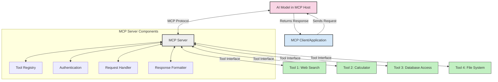
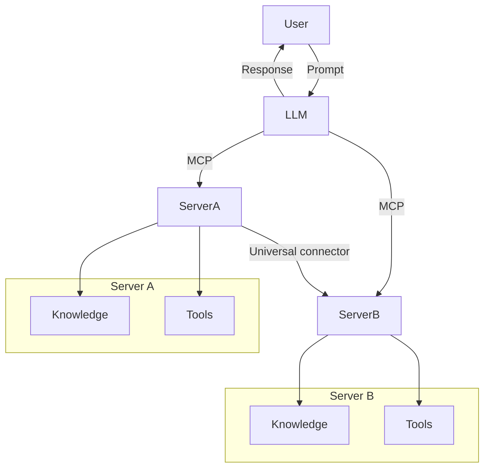

<!--
CO_OP_TRANSLATOR_METADATA:
{
  "original_hash": "cf84f987e1b771d2201408e110dfd2db",
  "translation_date": "2025-05-20T17:06:12+00:00",
  "source_file": "00-Introduction/README.md",
  "language_code": "el"
}
-->
# Εισαγωγή στο Model Context Protocol (MCP): Γιατί Είναι Σημαντικό για Κλιμακούμενες Εφαρμογές Τεχνητής Νοημοσύνης

Οι εφαρμογές γεννητικής τεχνητής νοημοσύνης είναι ένα μεγάλο βήμα μπροστά, καθώς συχνά επιτρέπουν στον χρήστη να αλληλεπιδρά με την εφαρμογή χρησιμοποιώντας φυσική γλώσσα. Ωστόσο, όσο περισσότερο χρόνο και πόρους επενδύονται σε τέτοιες εφαρμογές, θέλετε να βεβαιωθείτε ότι μπορείτε να ενσωματώσετε λειτουργίες και πόρους με τέτοιο τρόπο ώστε να είναι εύκολη η επέκταση, ότι η εφαρμογή σας μπορεί να υποστηρίξει περισσότερα από ένα μοντέλα και τις ιδιαιτερότητές τους. Με λίγα λόγια, η κατασκευή εφαρμογών γεννητικής τεχνητής νοημοσύνης είναι εύκολη στην αρχή, αλλά καθώς μεγαλώνουν και γίνονται πιο σύνθετες, χρειάζεται να ορίσετε μια αρχιτεκτονική και πιθανότατα να βασιστείτε σε ένα πρότυπο για να διασφαλίσετε ότι οι εφαρμογές σας κατασκευάζονται με συνεπή τρόπο. Εδώ έρχεται το MCP για να οργανώσει τα πράγματα και να παρέχει ένα πρότυπο.

---

## **🔍 Τι Είναι το Model Context Protocol (MCP);**

Το **Model Context Protocol (MCP)** είναι μια **ανοικτή, τυποποιημένη διεπαφή** που επιτρέπει στα Μεγάλα Γλωσσικά Μοντέλα (LLMs) να αλληλεπιδρούν απρόσκοπτα με εξωτερικά εργαλεία, APIs και πηγές δεδομένων. Παρέχει μια συνεπή αρχιτεκτονική για την ενίσχυση της λειτουργικότητας των μοντέλων AI πέρα από τα δεδομένα εκπαίδευσής τους, επιτρέποντας πιο έξυπνα, κλιμακούμενα και ευέλικτα συστήματα τεχνητής νοημοσύνης.

---

## **🎯 Γιατί Η Τυποποίηση στην Τεχνητή Νοημοσύνη Είναι Σημαντική**

Καθώς οι εφαρμογές γεννητικής τεχνητής νοημοσύνης γίνονται πιο πολύπλοκες, είναι απαραίτητο να υιοθετηθούν πρότυπα που εξασφαλίζουν **κλιμακωσιμότητα, επεκτασιμότητα** και **διαχειρισιμότητα**. Το MCP ανταποκρίνεται σε αυτές τις ανάγκες μέσω:

- Ενοποίησης των ενσωματώσεων μοντέλου-εργαλείου  
- Μείωσης ευπαθών, ειδικών λύσεων μιας χρήσης  
- Επιτρέποντας σε πολλαπλά μοντέλα να συνυπάρχουν σε ένα οικοσύστημα  

---

## **📚 Μαθησιακοί Στόχοι**

Με το τέλος αυτού του άρθρου, θα μπορείτε να:

- Ορίσετε το **Model Context Protocol (MCP)** και τις περιπτώσεις χρήσης του  
- Κατανοήσετε πώς το MCP τυποποιεί την επικοινωνία μοντέλου-εργαλείου  
- Αναγνωρίσετε τα βασικά συστατικά της αρχιτεκτονικής MCP  
- Εξερευνήσετε πραγματικές εφαρμογές του MCP σε επιχειρησιακό και αναπτυξιακό πλαίσιο  

---

## **💡 Γιατί το Model Context Protocol (MCP) Αλλάζει τα Δεδομένα**

### **🔗 Το MCP Λύνει τη Διασπορά στις Αλληλεπιδράσεις AI**

Πριν το MCP, η ενσωμάτωση μοντέλων με εργαλεία απαιτούσε:

- Ειδικό κώδικα για κάθε ζεύγος εργαλείου-μοντέλου  
- Μη τυποποιημένα APIs για κάθε προμηθευτή  
- Συχνές διακοπές λόγω ενημερώσεων  
- Κακή κλιμακωσιμότητα με περισσότερα εργαλεία  

### **✅ Οφέλη από την Τυποποίηση MCP**

| **Όφελος**              | **Περιγραφή**                                                                 |
|-------------------------|-------------------------------------------------------------------------------|
| Διαλειτουργικότητα      | Τα LLMs λειτουργούν απρόσκοπτα με εργαλεία από διαφορετικούς προμηθευτές     |
| Συνέπεια                | Ομοιόμορφη συμπεριφορά σε πλατφόρμες και εργαλεία                            |
| Επαναχρησιμοποίηση      | Εργαλεία που κατασκευάζονται μία φορά μπορούν να χρησιμοποιηθούν ξανά         |
| Επιτάχυνση Ανάπτυξης    | Μείωση χρόνου ανάπτυξης με τυποποιημένες, plug-and-play διεπαφές              |

---

## **🧱 Επισκόπηση Υψηλού Επιπέδου της Αρχιτεκτονικής MCP**

Το MCP ακολουθεί ένα **μοντέλο πελάτη-διακομιστή**, όπου:

- Οι **MCP Hosts** τρέχουν τα μοντέλα AI  
- Οι **MCP Clients** ξεκινούν αιτήματα  
- Οι **MCP Servers** παρέχουν context, εργαλεία και δυνατότητες  

### **Κύρια Συστατικά:**

- **Resources** – Στατικά ή δυναμικά δεδομένα για τα μοντέλα  
- **Prompts** – Προκαθορισμένα workflows για καθοδηγούμενη δημιουργία  
- **Tools** – Εκτελέσιμες λειτουργίες όπως αναζήτηση, υπολογισμοί  
- **Sampling** – Συμπεριφορά πράκτορα μέσω αναδρομικών αλληλεπιδράσεων  

---

## Πώς Λειτουργούν οι MCP Servers

Οι MCP servers λειτουργούν ως εξής:

- **Ροή Αιτήματος**:  
    1. Ο MCP Client στέλνει ένα αίτημα στο AI Model που τρέχει σε έναν MCP Host.  
    2. Το AI Model αναγνωρίζει πότε χρειάζεται εξωτερικά εργαλεία ή δεδομένα.  
    3. Το μοντέλο επικοινωνεί με τον MCP Server χρησιμοποιώντας το τυποποιημένο πρωτόκολλο.

- **Λειτουργικότητα MCP Server**:  
    - Κατάλογος Εργαλείων: Διατηρεί κατάλογο διαθέσιμων εργαλείων και δυνατοτήτων.  
    - Αυθεντικοποίηση: Επαληθεύει δικαιώματα πρόσβασης στα εργαλεία.  
    - Διαχειριστής Αιτημάτων: Επεξεργάζεται εισερχόμενα αιτήματα εργαλείων από το μοντέλο.  
    - Μορφοποιητής Απαντήσεων: Διαμορφώνει τα αποτελέσματα των εργαλείων σε μορφή κατανοητή από το μοντέλο.

- **Εκτέλεση Εργαλείων**:  
    - Ο διακομιστής δρομολογεί τα αιτήματα στα κατάλληλα εξωτερικά εργαλεία  
    - Τα εργαλεία εκτελούν τις εξειδικευμένες λειτουργίες τους (αναζήτηση, υπολογισμοί, ερωτήματα βάσης δεδομένων κ.ά.)  
    - Τα αποτελέσματα επιστρέφουν στο μοντέλο με συνεπή μορφή.

- **Ολοκλήρωση Απάντησης**:  
    - Το AI μοντέλο ενσωματώνει τα αποτελέσματα των εργαλείων στην απάντησή του.  
    - Η τελική απάντηση αποστέλλεται πίσω στην εφαρμογή πελάτη.

## 👨‍💻 Πώς να Δημιουργήσετε έναν MCP Server (Με Παραδείγματα)

Οι MCP servers σας επιτρέπουν να επεκτείνετε τις δυνατότητες των LLM παρέχοντας δεδομένα και λειτουργικότητα.

Έτοιμοι να το δοκιμάσετε; Εδώ είναι παραδείγματα για τη δημιουργία ενός απλού MCP server σε διάφορες γλώσσες:

- **Παράδειγμα Python**: https://github.com/modelcontextprotocol/python-sdk

- **Παράδειγμα TypeScript**: https://github.com/modelcontextprotocol/typescript-sdk

- **Παράδειγμα Java**: https://github.com/modelcontextprotocol/java-sdk

- **Παράδειγμα C#/.NET**: https://github.com/modelcontextprotocol/csharp-sdk

## 🌍 Πραγματικές Περιπτώσεις Χρήσης του MCP

Το MCP επιτρέπει ένα ευρύ φάσμα εφαρμογών επεκτείνοντας τις δυνατότητες της AI:

| **Εφαρμογή**                | **Περιγραφή**                                                                |
|-----------------------------|------------------------------------------------------------------------------|
| Ενοποίηση Επιχειρησιακών Δεδομένων | Σύνδεση LLMs με βάσεις δεδομένων, CRM ή εσωτερικά εργαλεία               |
| Agentic AI Συστήματα        | Ενεργοποίηση αυτόνομων πρακτόρων με πρόσβαση σε εργαλεία και ροές αποφάσεων  |
| Πολυμορφικές Εφαρμογές      | Συνδυασμός κειμένου, εικόνας και ήχου μέσα σε μια ενιαία AI εφαρμογή          |
| Ενσωμάτωση Πραγματικού Χρόνου | Εισαγωγή ζωντανών δεδομένων στις αλληλεπιδράσεις AI για πιο ακριβή αποτελέσματα |

### 🧠 MCP = Παγκόσμιο Πρότυπο για Αλληλεπιδράσεις AI

Το Model Context Protocol (MCP) λειτουργεί ως παγκόσμιο πρότυπο για τις αλληλεπιδράσεις AI, όπως το USB-C τυποποίησε τις φυσικές συνδέσεις συσκευών. Στον κόσμο της AI, το MCP παρέχει μια συνεπή διεπαφή, επιτρέποντας στα μοντέλα (πελάτες) να ενσωματώνονται απρόσκοπτα με εξωτερικά εργαλεία και παρόχους δεδομένων (διακομιστές). Αυτό εξαλείφει την ανάγκη για διαφορετικά, ειδικά πρωτόκολλα για κάθε API ή πηγή δεδομένων.

Στο πλαίσιο του MCP, ένα εργαλείο συμβατό με MCP (αναφερόμενο ως MCP server) ακολουθεί ένα ενιαίο πρότυπο. Αυτοί οι διακομιστές μπορούν να καταγράφουν τα εργαλεία ή τις ενέργειες που προσφέρουν και να τις εκτελούν όταν τους ζητηθεί από έναν AI πράκτορα. Οι πλατφόρμες AI πρακτόρων που υποστηρίζουν το MCP μπορούν να ανακαλύπτουν τα διαθέσιμα εργαλεία από τους διακομιστές και να τα καλούν μέσω αυτού του τυποποιημένου πρωτοκόλλου.

### 💡 Διευκολύνει την πρόσβαση στη γνώση

Πέρα από την προσφορά εργαλείων, το MCP διευκολύνει και την πρόσβαση στη γνώση. Επιτρέπει στις εφαρμογές να παρέχουν context στα μεγάλα γλωσσικά μοντέλα (LLMs) συνδέοντάς τα με διάφορες πηγές δεδομένων. Για παράδειγμα, ένας MCP server μπορεί να αντιπροσωπεύει το αποθετήριο εγγράφων μιας εταιρείας, επιτρέποντας στους πράκτορες να ανακτούν σχετικές πληροφορίες κατ’ απαίτηση. Ένας άλλος διακομιστής μπορεί να χειρίζεται συγκεκριμένες ενέργειες όπως αποστολή email ή ενημέρωση αρχείων. Από την οπτική του πράκτορα, αυτά είναι απλώς εργαλεία που μπορεί να χρησιμοποιήσει—μερικά επιστρέφουν δεδομένα (πλαίσιο γνώσης), ενώ άλλα εκτελούν ενέργειες. Το MCP διαχειρίζεται και τα δύο αποτελεσματικά.

Ένας πράκτορας που συνδέεται σε έναν MCP server μαθαίνει αυτόματα τις διαθέσιμες δυνατότητες και τα προσβάσιμα δεδομένα μέσω ενός τυποποιημένου φορμάτ. Αυτή η τυποποίηση επιτρέπει τη δυναμική διαθεσιμότητα εργαλείων. Για παράδειγμα, προσθέτοντας έναν νέο MCP server στο σύστημα του πράκτορα, οι λειτουργίες του γίνονται αμέσως διαθέσιμες χωρίς να απαιτείται περαιτέρω προσαρμογή των οδηγιών του πράκτορα.

Αυτή η απλοποιημένη ενσωμάτωση ευθυγραμμίζεται με τη ροή που απεικονίζεται στο διάγραμμα mermaid, όπου οι διακομιστές παρέχουν τόσο εργαλεία όσο και γνώση, εξασφαλίζοντας απρόσκοπτη συνεργασία μεταξύ συστημάτων.

### 👉 Παράδειγμα: Κλιμακούμενη Λύση Πράκτορα

## 🔐 Πρακτικά Οφέλη του MCP

Ακολουθούν τα πρακτικά οφέλη από τη χρήση του MCP:

- **Ενημερωμένα Δεδομένα**: Τα μοντέλα μπορούν να έχουν πρόσβαση σε ενημερωμένες πληροφορίες πέρα από τα δεδομένα εκπαίδευσής τους  
- **Επέκταση Δυνατοτήτων**: Τα μοντέλα μπορούν να αξιοποιήσουν εξειδικευμένα εργαλεία για εργασίες για τις οποίες δεν εκπαιδεύτηκαν  
- **Μείωση Παραισθήσεων**: Οι εξωτερικές πηγές δεδομένων παρέχουν πραγματική βάση  
- **Απόρρητο**: Ευαίσθητα δεδομένα μπορούν να παραμείνουν σε ασφαλή περιβάλλοντα αντί να ενσωματώνονται στα prompts  

## 📌 Βασικά Συμπεράσματα

Τα βασικά σημεία για τη χρήση του MCP είναι:

- Το **MCP** τυποποιεί τον τρόπο που τα μοντέλα AI αλληλεπιδρούν με εργαλεία και δεδομένα  
- Προωθεί την **επεκτασιμότητα, τη συνέπεια και τη διαλειτουργικότητα**  
- Το MCP βοηθά στη **μείωση χρόνου ανάπτυξης, βελτίωση αξιοπιστίας και επέκταση δυνατοτήτων μοντέλων**  
- Η αρχιτεκτονική πελάτη-διακομιστή **επιτρέπει ευέλικτες, επεκτάσιμες εφαρμογές AI**  

## 🧠 Άσκηση

Σκεφτείτε μια εφαρμογή AI που σας ενδιαφέρει να δημιουργήσετε.

- Ποια **εξωτερικά εργαλεία ή δεδομένα** θα μπορούσαν να ενισχύσουν τις δυνατότητές της;  
- Πώς θα μπορούσε το MCP να κάνει την ενσωμάτωση **πιο απλή και αξιόπιστη**;  

## Πρόσθετοι Πόροι

- [MCP GitHub Repository](https://github.com/modelcontextprotocol)

## Τι Ακολουθεί

Επόμενο: [Κεφάλαιο 1: Βασικές Έννοιες](/01-CoreConcepts/README.md)

**Αποποίηση ευθυνών**:  
Αυτό το έγγραφο έχει μεταφραστεί χρησιμοποιώντας την υπηρεσία αυτόματης μετάφρασης AI [Co-op Translator](https://github.com/Azure/co-op-translator). Παρόλο που επιδιώκουμε την ακρίβεια, παρακαλούμε να έχετε υπόψη ότι οι αυτόματες μεταφράσεις μπορεί να περιέχουν λάθη ή ανακρίβειες. Το πρωτότυπο έγγραφο στη μητρική του γλώσσα πρέπει να θεωρείται η επίσημη πηγή. Για κρίσιμες πληροφορίες, συνιστάται επαγγελματική ανθρώπινη μετάφραση. Δεν φέρουμε ευθύνη για τυχόν παρεξηγήσεις ή λανθασμένες ερμηνείες που προκύπτουν από τη χρήση αυτής της μετάφρασης.