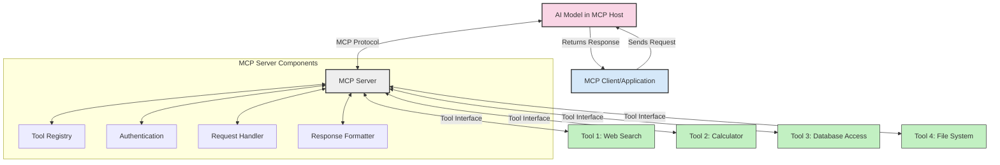
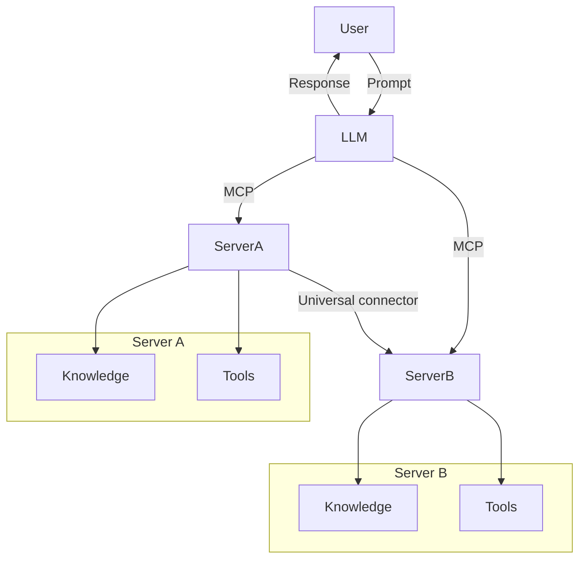
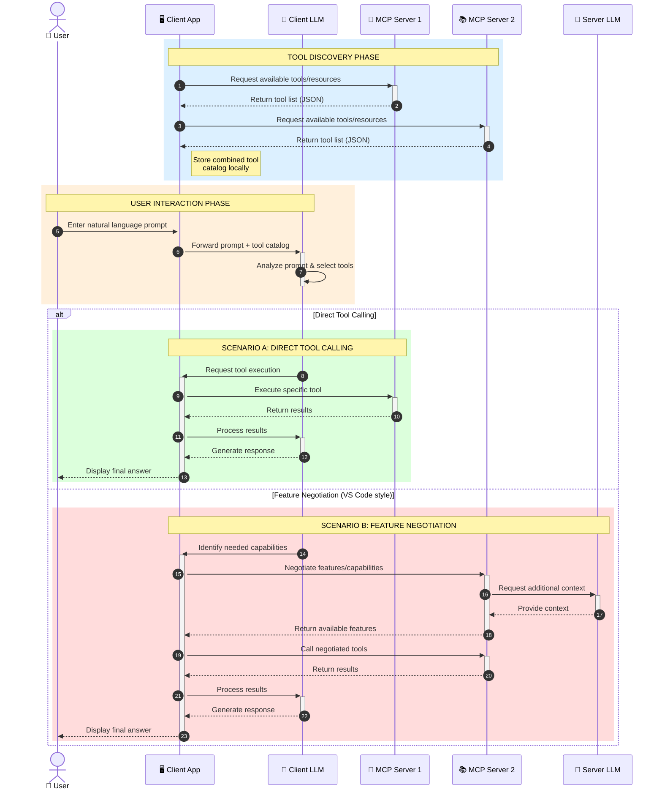

<!--
CO_OP_TRANSLATOR_METADATA:
{
  "original_hash": "25a94c681cf43612ff394d8cf78a74de",
  "translation_date": "2025-05-27T16:04:22+00:00",
  "source_file": "00-Introduction/README.md",
  "language_code": "el"
}
-->
# Εισαγωγή στο Model Context Protocol (MCP): Γιατί Είναι Σημαντικό για Επεκτάσιμες Εφαρμογές AI

Οι εφαρμογές γεννητικής τεχνητής νοημοσύνης (Generative AI) αποτελούν μια σημαντική πρόοδο, καθώς συχνά επιτρέπουν στον χρήστη να αλληλεπιδρά με την εφαρμογή χρησιμοποιώντας φυσική γλώσσα. Ωστόσο, καθώς επενδύεται περισσότερος χρόνος και πόροι σε αυτές τις εφαρμογές, θέλετε να βεβαιωθείτε ότι μπορείτε να ενσωματώσετε λειτουργίες και πόρους με τρόπο που να διευκολύνει την επέκταση, να υποστηρίζει τη χρήση περισσότερων από ένα μοντέλων και να διαχειρίζεται τις ιδιαιτερότητες των μοντέλων. Με λίγα λόγια, η κατασκευή εφαρμογών γεννητικής AI είναι εύκολη στην αρχή, αλλά καθώς μεγαλώνουν και γίνονται πιο σύνθετες, πρέπει να αρχίσετε να ορίζετε μια αρχιτεκτονική και πιθανόν να βασιστείτε σε ένα πρότυπο για να διασφαλίσετε ότι οι εφαρμογές σας είναι χτισμένες με συνεπή τρόπο. Εδώ έρχεται το MCP για να οργανώσει τα πράγματα και να παρέχει ένα πρότυπο.

---

## **🔍 Τι Είναι το Model Context Protocol (MCP);**

Το **Model Context Protocol (MCP)** είναι μια **ανοικτή, τυποποιημένη διεπαφή** που επιτρέπει στα Μεγάλα Γλωσσικά Μοντέλα (LLMs) να αλληλεπιδρούν απρόσκοπτα με εξωτερικά εργαλεία, APIs και πηγές δεδομένων. Παρέχει μια συνεπή αρχιτεκτονική για την ενίσχυση της λειτουργικότητας των μοντέλων AI πέρα από τα δεδομένα εκπαίδευσής τους, επιτρέποντας πιο έξυπνα, επεκτάσιμα και ανταποκρινόμενα συστήματα AI.

---

## **🎯 Γιατί Η Τυποποίηση στην AI Είναι Σημαντική**

Καθώς οι εφαρμογές γεννητικής AI γίνονται πιο σύνθετες, είναι απαραίτητο να υιοθετηθούν πρότυπα που διασφαλίζουν **επεκτασιμότητα, επεκτασιμότητα** και **διαχειρισιμότητα**. Το MCP αντιμετωπίζει αυτές τις ανάγκες μέσω:

- Ενοποίησης ενσωματώσεων μοντέλου-εργαλείων  
- Μείωσης ευπαθών, μοναδικών λύσεων  
- Δυνατότητας συνύπαρξης πολλαπλών μοντέλων σε ένα οικοσύστημα  

---

## **📚 Μαθησιακοί Στόχοι**

Στο τέλος αυτού του άρθρου, θα μπορείτε να:

- Ορίσετε το **Model Context Protocol (MCP)** και τις χρήσεις του  
- Κατανοήσετε πώς το MCP τυποποιεί την επικοινωνία μοντέλου-εργαλείου  
- Αναγνωρίσετε τα βασικά στοιχεία της αρχιτεκτονικής MCP  
- Εξερευνήσετε πραγματικές εφαρμογές του MCP σε επιχειρηματικά και αναπτυξιακά περιβάλλοντα  

---

## **💡 Γιατί το Model Context Protocol (MCP) Αλλάζει τα Δεδομένα**

### **🔗 Το MCP Λύνει το Πρόβλημα της Κατακερματισμένης Αλληλεπίδρασης στην AI**

Πριν το MCP, η ενσωμάτωση μοντέλων με εργαλεία απαιτούσε:

- Ειδικό κώδικα για κάθε ζεύγος εργαλείου-μοντέλου  
- Μη τυποποιημένα APIs για κάθε προμηθευτή  
- Συχνά διακοπές λόγω ενημερώσεων  
- Κακή επεκτασιμότητα με περισσότερα εργαλεία  

### **✅ Οφέλη της Τυποποίησης MCP**

| **Όφελος**               | **Περιγραφή**                                                                 |
|--------------------------|-------------------------------------------------------------------------------|
| Διαλειτουργικότητα       | Τα LLM συνεργάζονται απρόσκοπτα με εργαλεία από διαφορετικούς προμηθευτές     |
| Συνέπεια                 | Ομοιόμορφη συμπεριφορά σε πλατφόρμες και εργαλεία                             |
| Επαναχρησιμοποίηση       | Τα εργαλεία που δημιουργούνται μια φορά μπορούν να χρησιμοποιηθούν παντού      |
| Επιτάχυνση Ανάπτυξης     | Μείωση χρόνου ανάπτυξης με τη χρήση τυποποιημένων, plug-and-play διεπαφών     |

---

## **🧱 Επισκόπηση Υψηλού Επιπέδου Αρχιτεκτονικής MCP**

Το MCP ακολουθεί ένα **μοντέλο πελάτη-διακομιστή**, όπου:

- Οι **MCP Hosts** τρέχουν τα μοντέλα AI  
- Οι **MCP Clients** ξεκινούν αιτήματα  
- Οι **MCP Servers** παρέχουν context, εργαλεία και δυνατότητες  

### **Κύρια Στοιχεία:**

- **Resources** – Στατικά ή δυναμικά δεδομένα για τα μοντέλα  
- **Prompts** – Προκαθορισμένες ροές εργασίας για καθοδηγούμενη παραγωγή  
- **Tools** – Εκτελέσιμες λειτουργίες όπως αναζήτηση, υπολογισμοί  
- **Sampling** – Συμπεριφορά πράκτορα μέσω αναδρομικών αλληλεπιδράσεων  

---

## Πώς Λειτουργούν οι MCP Servers

Οι MCP servers λειτουργούν ως εξής:

- **Ροή Αιτημάτων**:  
    1. Ο MCP Client στέλνει αίτημα στο AI Model που τρέχει σε MCP Host.  
    2. Το AI Model αναγνωρίζει πότε χρειάζεται εξωτερικά εργαλεία ή δεδομένα.  
    3. Το μοντέλο επικοινωνεί με τον MCP Server χρησιμοποιώντας το τυποποιημένο πρωτόκολλο.  

- **Λειτουργίες MCP Server**:  
    - Κατάλογος Εργαλείων: Διατηρεί κατάλογο διαθέσιμων εργαλείων και δυνατοτήτων τους.  
    - Πιστοποίηση: Επαληθεύει τα δικαιώματα πρόσβασης στα εργαλεία.  
    - Διαχειριστής Αιτημάτων: Επεξεργάζεται εισερχόμενα αιτήματα εργαλείων από το μοντέλο.  
    - Μορφοποιητής Απαντήσεων: Διαμορφώνει τα αποτελέσματα των εργαλείων σε μορφή κατανοητή από το μοντέλο.  

- **Εκτέλεση Εργαλείων**:  
    - Ο server δρομολογεί τα αιτήματα στα κατάλληλα εξωτερικά εργαλεία  
    - Τα εργαλεία εκτελούν τις ειδικές λειτουργίες τους (αναζήτηση, υπολογισμοί, ερωτήματα βάσης δεδομένων κ.ά.)  
    - Τα αποτελέσματα επιστρέφουν στο μοντέλο σε συνεπή μορφή  

- **Ολοκλήρωση Απάντησης**:  
    - Το AI μοντέλο ενσωματώνει τα αποτελέσματα των εργαλείων στην απάντησή του.  
    - Η τελική απάντηση αποστέλλεται πίσω στην εφαρμογή πελάτη.  

## 👨‍💻 Πώς να Δημιουργήσετε έναν MCP Server (Με Παραδείγματα)

Οι MCP servers σας επιτρέπουν να επεκτείνετε τις δυνατότητες των LLM παρέχοντας δεδομένα και λειτουργικότητα.

Έτοιμοι να δοκιμάσετε; Εδώ είναι παραδείγματα δημιουργίας απλού MCP server σε διάφορες γλώσσες:

- **Παράδειγμα Python**: https://github.com/modelcontextprotocol/python-sdk

- **Παράδειγμα TypeScript**: https://github.com/modelcontextprotocol/typescript-sdk

- **Παράδειγμα Java**: https://github.com/modelcontextprotocol/java-sdk

- **Παράδειγμα C#/.NET**: https://github.com/modelcontextprotocol/csharp-sdk

## 🌍 Πραγματικές Περιπτώσεις Χρήσης του MCP

Το MCP επιτρέπει μια ευρεία γκάμα εφαρμογών επεκτείνοντας τις δυνατότητες της AI:

| **Εφαρμογή**              | **Περιγραφή**                                                                  |
|----------------------------|--------------------------------------------------------------------------------|
| Ενσωμάτωση Επιχειρησιακών Δεδομένων | Σύνδεση LLM με βάσεις δεδομένων, CRM ή εσωτερικά εργαλεία                |
| Agentic AI Systems         | Ενεργοποίηση αυτόνομων πρακτόρων με πρόσβαση σε εργαλεία και ροές αποφάσεων    |
| Πολυμορφικές Εφαρμογές     | Συνδυασμός εργαλείων κειμένου, εικόνας και ήχου σε μια ενιαία AI εφαρμογή      |
| Ενσωμάτωση Δεδομένων σε Πραγματικό Χρόνο | Εισαγωγή ζωντανών δεδομένων στις αλληλεπιδράσεις AI για πιο ακριβή αποτελέσματα |

### 🧠 MCP = Παγκόσμιο Πρότυπο για Αλληλεπιδράσεις AI

Το Model Context Protocol (MCP) λειτουργεί ως παγκόσμιο πρότυπο για τις αλληλεπιδράσεις AI, όπως το USB-C τυποποίησε τις φυσικές συνδέσεις συσκευών. Στον κόσμο της AI, το MCP παρέχει μια συνεπή διεπαφή, επιτρέποντας στα μοντέλα (πελάτες) να ενσωματώνονται απρόσκοπτα με εξωτερικά εργαλεία και παρόχους δεδομένων (servers). Αυτό καταργεί την ανάγκη για ποικίλα, ειδικά πρωτόκολλα για κάθε API ή πηγή δεδομένων.

Στο πλαίσιο του MCP, ένα εργαλείο συμβατό με MCP (αναφερόμενο ως MCP server) ακολουθεί ένα ενιαίο πρότυπο. Αυτοί οι servers μπορούν να καταγράφουν τα εργαλεία ή τις ενέργειες που προσφέρουν και να τις εκτελούν όταν ζητηθεί από έναν AI πράκτορα. Οι πλατφόρμες πρακτόρων AI που υποστηρίζουν MCP είναι ικανές να ανακαλύπτουν διαθέσιμα εργαλεία από τους servers και να τα καλούν μέσω αυτού του τυποποιημένου πρωτοκόλλου.

### 💡 Διευκόλυνση Πρόσβασης στη Γνώση

Πέρα από την παροχή εργαλείων, το MCP διευκολύνει επίσης την πρόσβαση στη γνώση. Επιτρέπει στις εφαρμογές να παρέχουν context στα μεγάλα γλωσσικά μοντέλα (LLMs) συνδέοντάς τα με διάφορες πηγές δεδομένων. Για παράδειγμα, ένας MCP server μπορεί να αντιπροσωπεύει το αποθετήριο εγγράφων μιας εταιρείας, επιτρέποντας στους πράκτορες να ανακτούν σχετικές πληροφορίες κατά ζήτηση. Ένας άλλος server μπορεί να διαχειρίζεται συγκεκριμένες ενέργειες όπως αποστολή email ή ενημέρωση αρχείων. Από την πλευρά του πράκτορα, αυτά είναι απλώς εργαλεία που μπορεί να χρησιμοποιήσει — κάποια επιστρέφουν δεδομένα (context γνώσης), ενώ άλλα εκτελούν ενέργειες. Το MCP διαχειρίζεται αποτελεσματικά και τα δύο.

Ένας πράκτορας που συνδέεται με έναν MCP server μαθαίνει αυτόματα τις διαθέσιμες δυνατότητες και τα προσβάσιμα δεδομένα του server μέσω ενός τυποποιημένου φορμάτ. Αυτή η τυποποίηση επιτρέπει δυναμική διαθεσιμότητα εργαλείων. Για παράδειγμα, προσθέτοντας έναν νέο MCP server στο σύστημα ενός πράκτορα, οι λειτουργίες του γίνονται άμεσα διαθέσιμες χωρίς επιπλέον προσαρμογές στις οδηγίες του πράκτορα.

Αυτή η απλοποιημένη ενσωμάτωση ευθυγραμμίζεται με τη ροή που απεικονίζεται στο διάγραμμα mermaid, όπου οι servers παρέχουν τόσο εργαλεία όσο και γνώση, εξασφαλίζοντας απρόσκοπτη συνεργασία μεταξύ συστημάτων.

### 👉 Παράδειγμα: Επεκτάσιμη Λύση Πράκτορα

### 🔄 Προχωρημένα Σενάρια MCP με Ενσωμάτωση LLM στην Πλευρά Πελάτη

Πέρα από την βασική αρχιτεκτονική MCP, υπάρχουν προχωρημένα σενάρια όπου τόσο ο πελάτης όσο και ο server περιέχουν LLMs, επιτρέποντας πιο σύνθετες αλληλεπιδράσεις:

## 🔐 Πρακτικά Οφέλη του MCP

Τα πρακτικά οφέλη από τη χρήση του MCP είναι:

- **Ενημερότητα**: Τα μοντέλα έχουν πρόσβαση σε ενημερωμένες πληροφορίες πέρα από τα δεδομένα εκπαίδευσης  
- **Επέκταση Δυνατοτήτων**: Τα μοντέλα μπορούν να αξιοποιήσουν εξειδικευμένα εργαλεία για εργασίες για τις οποίες δεν εκπαιδεύτηκαν  
- **Μείωση Παραισθήσεων**: Οι εξωτερικές πηγές δεδομένων παρέχουν αληθινή βάση  
- **Απόρρητο**: Ευαίσθητα δεδομένα μπορούν να παραμείνουν σε ασφαλή περιβάλλοντα αντί να ενσωματώνονται σε prompts  

## 📌 Κύρια Συμπεράσματα

Τα βασικά σημεία για τη χρήση του MCP είναι:

- Το **MCP** τυποποιεί τον τρόπο που τα μοντέλα AI αλληλεπιδρούν με εργαλεία και δεδομένα  
- Προωθεί την **επεκτασιμότητα, συνέπεια και διαλειτουργικότητα**  
- Το MCP βοηθά στη **μείωση χρόνου ανάπτυξης, βελτίωση αξιοπιστίας και επέκταση δυνατοτήτων μοντέλων**  
- Η αρχιτεκτονική πελάτη-διακομιστή **επιτρέπει ευέλικτες, επεκτάσιμες εφαρμογές AI**  

## 🧠 Άσκηση

Σκεφτείτε μια εφαρμογή AI που σας ενδιαφέρει να δημιουργήσετε.

- Ποια **εξωτερικά εργαλεία ή δεδομένα** θα μπορούσαν να ενισχύσουν τις δυνατότητές της;  
- Πώς θα μπορούσε το MCP να κάνει την ενσωμάτωση **απλούστερη και πιο αξιόπιστη**;  

## Πρόσθετοι Πόροι

- [MCP GitHub Repository](https://github.com/modelcontextprotocol)

## Τι Ακολουθεί

Επόμενο: [Κεφάλαιο 1: Βασικές Έννοιες](/01-CoreConcepts/README.md)

**Αποποίηση ευθυνών**:  
Αυτό το έγγραφο έχει μεταφραστεί χρησιμοποιώντας την υπηρεσία αυτόματης μετάφρασης AI [Co-op Translator](https://github.com/Azure/co-op-translator). Παρόλο που προσπαθούμε για ακρίβεια, παρακαλούμε να γνωρίζετε ότι οι αυτοματοποιημένες μεταφράσεις ενδέχεται να περιέχουν σφάλματα ή ανακρίβειες. Το πρωτότυπο έγγραφο στη μητρική του γλώσσα πρέπει να θεωρείται η αυθεντική πηγή. Για κρίσιμες πληροφορίες, συνιστάται επαγγελματική μετάφραση από ανθρώπους. Δεν φέρουμε ευθύνη για τυχόν παρεξηγήσεις ή λανθασμένες ερμηνείες που προκύπτουν από τη χρήση αυτής της μετάφρασης.