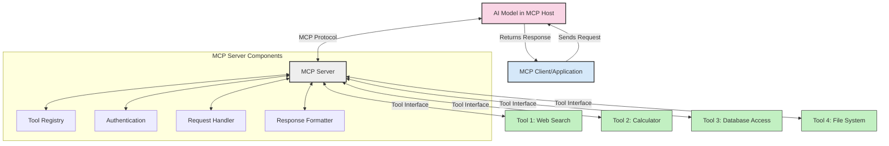
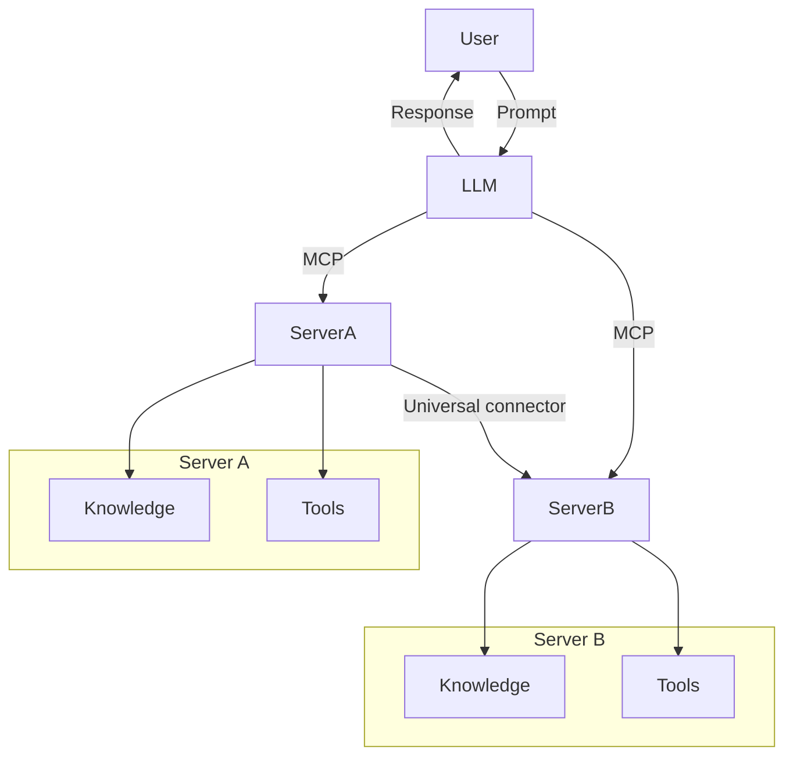

<!--
CO_OP_TRANSLATOR_METADATA:
{
  "original_hash": "02301140adbd807ecf0f17720fa307bc",
  "translation_date": "2025-05-17T06:00:40+00:00",
  "source_file": "00-Introduction/README.md",
  "language_code": "el"
}
-->
# Εισαγωγή στο Πρωτόκολλο Συμφραζομένων Μοντέλου (MCP): Γιατί Είναι Σημαντικό για Κλιμακούμενες Εφαρμογές Τεχνητής Νοημοσύνης

Οι εφαρμογές δημιουργικής τεχνητής νοημοσύνης αποτελούν σημαντική πρόοδο, καθώς συχνά επιτρέπουν στον χρήστη να αλληλεπιδρά με την εφαρμογή χρησιμοποιώντας φυσική γλώσσα. Ωστόσο, καθώς επενδύονται περισσότεροι πόροι σε τέτοιες εφαρμογές, θέλετε να βεβαιωθείτε ότι μπορείτε εύκολα να ενσωματώσετε λειτουργίες και πόρους με τέτοιο τρόπο ώστε να είναι εύκολο να επεκταθεί, να μπορεί η εφαρμογή σας να υποστηρίξει περισσότερα από ένα μοντέλα και τις λεπτομέρειές τους. Εν συντομία, το να ξεκινήσεις να φτιάχνεις εφαρμογές Gen AI είναι εύκολο, αλλά καθώς μεγαλώνει και γίνεται πιο περίπλοκο, χρειάζεται να ορίσεις μια αρχιτεκτονική και πιθανότατα θα χρειαστεί να βασιστείς σε ένα πρότυπο για να βεβαιωθείς ότι οι εφαρμογές σου χτίζονται με συνεπή τρόπο. Εδώ έρχεται το MCP για να οργανώσει τα πράγματα, παρέχοντας ένα πρότυπο.

---

## **🔍 Τι Είναι το Πρωτόκολλο Συμφραζομένων Μοντέλου (MCP);**

Το **Πρωτόκολλο Συμφραζομένων Μοντέλου (MCP)** είναι μια **ανοιχτή, τυποποιημένη διεπαφή** που επιτρέπει στα Μεγάλα Μοντέλα Γλώσσας (LLMs) να αλληλεπιδρούν ομαλά με εξωτερικά εργαλεία, APIs και πηγές δεδομένων. Παρέχει μια συνεπή αρχιτεκτονική για την ενίσχυση της λειτουργικότητας των μοντέλων τεχνητής νοημοσύνης πέρα από τα δεδομένα εκπαίδευσής τους, επιτρέποντας εξυπνότερα, κλιμακούμενα και πιο ευέλικτα συστήματα τεχνητής νοημοσύνης.

---

## **🎯 Γιατί η Τυποποίηση στην Τεχνητή Νοημοσύνη Έχει Σημασία**

Καθώς οι εφαρμογές δημιουργικής τεχνητής νοημοσύνης γίνονται πιο περίπλοκες, είναι ουσιώδες να υιοθετήσουμε πρότυπα που εξασφαλίζουν **κλιμακωσιμότητα, επεκτασιμότητα** και **συντηρησιμότητα**. Το MCP αντιμετωπίζει αυτές τις ανάγκες με:

- Ενοποίηση των ενσωματώσεων μοντέλου-εργαλείου
- Μείωση εύθραυστων, μοναδικών προσαρμοσμένων λύσεων
- Επιτρέποντας σε πολλαπλά μοντέλα να συνυπάρχουν μέσα σε ένα οικοσύστημα

---

## **📚 Στόχοι Μάθησης**

Μέχρι το τέλος αυτού του άρθρου, θα μπορείτε να:

- Ορίσετε το **Πρωτόκολλο Συμφραζομένων Μοντέλου (MCP)** και τις περιπτώσεις χρήσης του
- Κατανοήσετε πώς το MCP τυποποιεί την επικοινωνία μοντέλου-εργαλείου
- Αναγνωρίσετε τα βασικά συστατικά της αρχιτεκτονικής του MCP
- Εξερευνήσετε πραγματικές εφαρμογές του MCP σε επιχειρηματικά και αναπτυξιακά περιβάλλοντα

---

## **💡 Γιατί το Πρωτόκολλο Συμφραζομένων Μοντέλου (MCP) Είναι Πρωτοποριακό**

### **🔗 Το MCP Λύνει τον Κατακερματισμό στις Αλληλεπιδράσεις της Τεχνητής Νοημοσύνης**

Πριν από το MCP, η ενσωμάτωση μοντέλων με εργαλεία απαιτούσε:

- Προσαρμοσμένο κώδικα για κάθε ζεύγος εργαλείου-μοντέλου
- Μη τυποποιημένα APIs για κάθε προμηθευτή
- Συχνές διακοπές λόγω ενημερώσεων
- Κακή κλιμακωσιμότητα με περισσότερα εργαλεία

### **✅ Οφέλη από την Τυποποίηση του MCP**

| **Όφελος**               | **Περιγραφή**                                                               |
|--------------------------|----------------------------------------------------------------------------|
| Διαλειτουργικότητα       | Τα LLMs λειτουργούν ομαλά με εργαλεία από διαφορετικούς προμηθευτές         |
| Συνοχή                   | Ομοιόμορφη συμπεριφορά σε πλατφόρμες και εργαλεία                           |
| Επαναχρησιμοποίηση       | Εργαλεία που δημιουργούνται μια φορά μπορούν να χρησιμοποιηθούν σε έργα και συστήματα |
| Επιταχυμένη Ανάπτυξη     | Μειώνει το χρόνο ανάπτυξης χρησιμοποιώντας τυποποιημένες, plug-and-play διεπαφές |

---

## **🧱 Επισκόπηση Αρχιτεκτονικής MCP Υψηλού Επιπέδου**

Το MCP ακολουθεί ένα **μοντέλο πελάτη-διακομιστή**, όπου:

- **Οι MCP Hosts** τρέχουν τα μοντέλα τεχνητής νοημοσύνης
- **Οι MCP Clients** ξεκινούν αιτήματα
- **Οι MCP Servers** παρέχουν συμφραζόμενα, εργαλεία και δυνατότητες

### **Βασικά Συστατικά:**

- **Πόροι** – Στατικά ή δυναμικά δεδομένα για μοντέλα  
- **Προτροπές** – Προκαθορισμένες ροές εργασίας για καθοδηγούμενη δημιουργία  
- **Εργαλεία** – Εκτελέσιμες λειτουργίες όπως αναζήτηση, υπολογισμοί  
- **Δειγματοληψία** – Συμπεριφορά μέσω επαναληπτικών αλληλεπιδράσεων

---

## Πώς Λειτουργούν οι Διακομιστές MCP

Οι διακομιστές MCP λειτουργούν με τον εξής τρόπο:

- **Ροή Αιτήματος**: 
    1. Ο MCP Client στέλνει ένα αίτημα στο Μοντέλο Τεχνητής Νοημοσύνης που τρέχει σε έναν MCP Host.
    2. Το Μοντέλο Τεχνητής Νοημοσύνης αναγνωρίζει πότε χρειάζεται εξωτερικά εργαλεία ή δεδομένα.
    3. Το μοντέλο επικοινωνεί με τον MCP Server χρησιμοποιώντας το τυποποιημένο πρωτόκολλο.

- **Λειτουργικότητα Διακομιστή MCP**:
    - Κατάλογος Εργαλείων: Διατηρεί έναν κατάλογο διαθέσιμων εργαλείων και των δυνατοτήτων τους.
    - Πιστοποίηση: Επαληθεύει δικαιώματα πρόσβασης σε εργαλεία.
    - Διαχειριστής Αιτημάτων: Επεξεργάζεται εισερχόμενα αιτήματα εργαλείων από το μοντέλο.
    - Διαμορφωτής Απαντήσεων: Δομεί τα αποτελέσματα των εργαλείων σε μορφή που μπορεί να κατανοήσει το μοντέλο.

- **Εκτέλεση Εργαλείων**: 
    - Ο διακομιστής κατευθύνει αιτήματα στα κατάλληλα εξωτερικά εργαλεία
    - Τα εργαλεία εκτελούν τις εξειδικευμένες λειτουργίες τους (αναζήτηση, υπολογισμός, ερωτήματα βάσης δεδομένων κ.λπ.)
    - Τα αποτελέσματα επιστρέφονται στο μοντέλο σε συνεπή μορφή.

- **Ολοκλήρωση Απάντησης**: 
    - Το μοντέλο τεχνητής νοημοσύνης ενσωματώνει τα αποτελέσματα των εργαλείων στην απάντησή του.
    - Η τελική απάντηση αποστέλλεται πίσω στην εφαρμογή πελάτη.

## 👨‍💻 Πώς να Δημιουργήσετε Έναν Διακομιστή MCP (Με Παραδείγματα)

Οι διακομιστές MCP σας επιτρέπουν να επεκτείνετε τις δυνατότητες των LLM παρέχοντας δεδομένα και λειτουργικότητα.

Έτοιμοι να το δοκιμάσετε; Ακολουθούν παραδείγματα δημιουργίας ενός απλού διακομιστή MCP σε διαφορετικές γλώσσες:

- **Παράδειγμα Python**: https://github.com/modelcontextprotocol/python-sdk

- **Παράδειγμα TypeScript**: https://github.com/modelcontextprotocol/typescript-sdk

- **Παράδειγμα Java**: https://github.com/modelcontextprotocol/java-sdk

- **Παράδειγμα C#/.NET**: https://github.com/modelcontextprotocol/csharp-sdk

## 🌍 Πραγματικές Περιπτώσεις Χρήσης για το MCP

Το MCP επιτρέπει ένα ευρύ φάσμα εφαρμογών επεκτείνοντας τις δυνατότητες της τεχνητής νοημοσύνης:

| **Εφαρμογή**                  | **Περιγραφή**                                                                  |
|------------------------------|--------------------------------------------------------------------------------|
| Ενσωμάτωση Δεδομένων Επιχειρήσεων  | Συνδέστε LLMs με βάσεις δεδομένων, CRM ή εσωτερικά εργαλεία                 |
| Συστήματα Τεχνητής Νοημοσύνης Πρακτόρων | Επιτρέψτε αυτόνομους πράκτορες με πρόσβαση σε εργαλεία και ροές εργασίας λήψης αποφάσεων |
| Πολυτροπικές Εφαρμογές        | Συνδυάστε εργαλεία κειμένου, εικόνας και ήχου μέσα σε μια ενιαία εφαρμογή τεχνητής νοημοσύνης |
| Ενσωμάτωση Δεδομένων σε Πραγματικό Χρόνο | Εισάγετε ζωντανά δεδομένα στις αλληλεπιδράσεις της τεχνητής νοημοσύνης για πιο ακριβή, τρέχοντα αποτελέσματα |

### 🧠 MCP = Καθολικό Πρότυπο για Αλληλεπιδράσεις Τεχνητής Νοημοσύνης

Το Πρωτόκολλο Συμφραζομένων Μοντέλου (MCP) λειτουργεί ως καθολικό πρότυπο για τις αλληλεπιδράσεις τεχνητής νοημοσύνης, όπως ακριβώς το USB-C τυποποίησε τις φυσικές συνδέσεις για συσκευές. Στον κόσμο της τεχνητής νοημοσύνης, το MCP παρέχει μια συνεπή διεπαφή, επιτρέποντας στα μοντέλα (πελάτες) να ενσωματώνονται ομαλά με εξωτερικά εργαλεία και παρόχους δεδομένων (διακομιστές). Αυτό εξαλείφει την ανάγκη για διάφορα, προσαρμοσμένα πρωτόκολλα για κάθε API ή πηγή δεδομένων.

Στο πλαίσιο του MCP, ένα εργαλείο συμβατό με MCP (αναφέρεται ως διακομιστής MCP) ακολουθεί ένα ενιαίο πρότυπο. Αυτοί οι διακομιστές μπορούν να καταχωρίσουν τα εργαλεία ή τις ενέργειες που προσφέρουν και να εκτελέσουν αυτές τις ενέργειες όταν ζητηθεί από έναν πράκτορα τεχνητής νοημοσύνης. Οι πλατφόρμες πρακτόρων τεχνητής νοημοσύνης που υποστηρίζουν το MCP είναι ικανές να ανακαλύπτουν διαθέσιμα εργαλεία από τους διακομιστές και να τα καλούν μέσω αυτού του τυποποιημένου πρωτοκόλλου.

### 💡 Διευκολύνει την πρόσβαση στη γνώση

Πέρα από την προσφορά εργαλείων, το MCP διευκολύνει επίσης την πρόσβαση στη γνώση. Επιτρέπει στις εφαρμογές να παρέχουν συμφραζόμενα σε μεγάλα μοντέλα γλώσσας (LLMs) συνδέοντάς τα με διάφορες πηγές δεδομένων. Για παράδειγμα, ένας διακομιστής MCP μπορεί να αντιπροσωπεύει ένα αποθετήριο εγγράφων μιας εταιρείας, επιτρέποντας στους πράκτορες να ανακτούν σχετικές πληροφορίες κατά παραγγελία. Ένας άλλος διακομιστής θα μπορούσε να χειριστεί συγκεκριμένες ενέργειες όπως η αποστολή email ή η ενημέρωση αρχείων. Από την οπτική γωνία του πράκτορα, αυτά είναι απλά εργαλεία που μπορεί να χρησιμοποιήσει—ορισμένα εργαλεία επιστρέφουν δεδομένα (συμφραζόμενα γνώσης), ενώ άλλα εκτελούν ενέργειες. Το MCP διαχειρίζεται αποτελεσματικά και τα δύο.

Ένας πράκτορας που συνδέεται με έναν διακομιστή MCP μαθαίνει αυτόματα τις διαθέσιμες δυνατότητες και τα προσβάσιμα δεδομένα του διακομιστή μέσω ενός τυποποιημένου μορφότυπου. Αυτή η τυποποίηση επιτρέπει τη δυναμική διαθεσιμότητα εργαλείων. Για παράδειγμα, η προσθήκη ενός νέου διακομιστή MCP στο σύστημα ενός πράκτορα καθιστά τις λειτουργίες του άμεσα χρησιμοποιήσιμες χωρίς να απαιτείται περαιτέρω προσαρμογή των οδηγιών του πράκτορα.

Αυτή η ομαλή ενσωμάτωση ευθυγραμμίζεται με τη ροή που απεικονίζεται στο διάγραμμα mermaid, όπου οι διακομιστές παρέχουν τόσο εργαλεία όσο και γνώση, εξασφαλίζοντας ομαλή συνεργασία μεταξύ συστημάτων.

### 👉 Παράδειγμα: Κλιμακούμενη Λύση Πρακτόρων

## 🔐 Πρακτικά Οφέλη του MCP

Ακολουθούν μερικά πρακτικά οφέλη από τη χρήση του MCP:

- **Φρεσκάδα**: Τα μοντέλα μπορούν να έχουν πρόσβαση σε ενημερωμένες πληροφορίες πέρα από τα δεδομένα εκπαίδευσής τους
- **Επέκταση Δυνατοτήτων**: Τα μοντέλα μπορούν να αξιοποιήσουν εξειδικευμένα εργαλεία για εργασίες για τις οποίες δεν έχουν εκπαιδευτεί
- **Μείωση Ψευδών Εμφανίσεων**: Οι εξωτερικές πηγές δεδομένων παρέχουν πραγματική βάση
- **Απόρρητο**: Τα ευαίσθητα δεδομένα μπορούν να παραμείνουν σε ασφαλή περιβάλλοντα αντί να ενσωματώνονται σε προτροπές

## 📌 Βασικά Σημεία

Τα ακόλουθα είναι βασικά σημεία για τη χρήση του MCP:

- Το **MCP** τυποποιεί τον τρόπο με τον οποίο τα μοντέλα τεχνητής νοημοσύνης αλληλεπιδρούν με εργαλεία και δεδομένα
- Προάγει την **επεκτασιμότητα, τη συνοχή και τη διαλειτουργικότητα**
- Το MCP βοηθά στη **μείωση του χρόνου ανάπτυξης, τη βελτίωση της αξιοπιστίας και την επέκταση των δυνατοτήτων των μοντέλων**
- Η αρχιτεκτονική πελάτη-διακομιστή **επιτρέπει ευέλικτες, επεκτάσιμες εφαρμογές τεχνητής νοημοσύνης**

## 🧠 Άσκηση

Σκεφτείτε μια εφαρμογή τεχνητής νοημοσύνης που σας ενδιαφέρει να δημιουργήσετε.

- Ποια **εξωτερικά εργαλεία ή δεδομένα** θα μπορούσαν να ενισχύσουν τις δυνατότητές της;
- Πώς θα μπορούσε το MCP να κάνει την ενσωμάτωση **απλούστερη και πιο αξιόπιστη;**

## Επιπρόσθετοι Πόροι

- [Αποθετήριο MCP στο GitHub](https://github.com/modelcontextprotocol)

## Τι ακολουθεί

Επόμενο: [Κεφάλαιο 1: Βασικές Έννοιες](/01-CoreConcepts/README.md)

**Αποποίηση ευθυνών**:  
Αυτό το έγγραφο έχει μεταφραστεί χρησιμοποιώντας την υπηρεσία μετάφρασης AI [Co-op Translator](https://github.com/Azure/co-op-translator). Ενώ προσπαθούμε για ακρίβεια, παρακαλώ λάβετε υπόψη ότι οι αυτοματοποιημένες μεταφράσεις μπορεί να περιέχουν λάθη ή ανακρίβειες. Το αρχικό έγγραφο στη γλώσσα του θα πρέπει να θεωρείται η αυθεντική πηγή. Για κρίσιμες πληροφορίες, συνιστάται επαγγελματική ανθρώπινη μετάφραση. Δεν φέρουμε ευθύνη για οποιεσδήποτε παρανοήσεις ή εσφαλμένες ερμηνείες που προκύπτουν από τη χρήση αυτής της μετάφρασης.