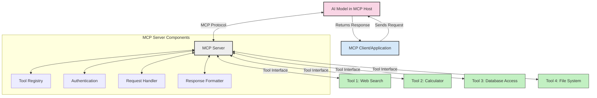
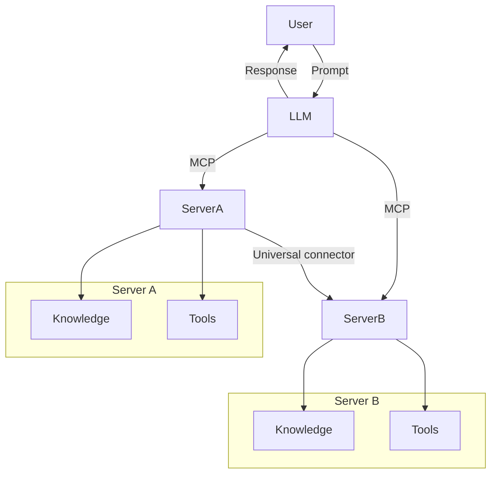

<!--
CO_OP_TRANSLATOR_METADATA:
{
  "original_hash": "1d88dee994dcbb3fa52c271d0c0817b5",
  "translation_date": "2025-05-20T21:30:14+00:00",
  "source_file": "00-Introduction/README.md",
  "language_code": "el"
}
-->
# Εισαγωγή στο Model Context Protocol (MCP): Γιατί Είναι Σημαντικό για Κλιμακούμενες Εφαρμογές Τεχνητής Νοημοσύνης

Οι εφαρμογές γεννητικής ΤΝ αποτελούν ένα σημαντικό βήμα μπροστά, καθώς συχνά επιτρέπουν στον χρήστη να αλληλεπιδρά με την εφαρμογή χρησιμοποιώντας φυσικές γλωσσικές εντολές. Ωστόσο, καθώς επενδύονται περισσότερο χρόνος και πόροι σε τέτοιες εφαρμογές, θέλετε να βεβαιωθείτε ότι μπορείτε να ενσωματώσετε λειτουργίες και πόρους με τρόπο που να είναι εύκολα επεκτάσιμος, να υποστηρίζει περισσότερα από ένα μοντέλα και να διαχειρίζεται τις διάφορες ιδιαιτερότητες των μοντέλων. Με λίγα λόγια, η δημιουργία εφαρμογών γεννητικής ΤΝ είναι εύκολη στην αρχή, αλλά καθώς μεγαλώνουν και γίνονται πιο πολύπλοκες, πρέπει να ξεκινήσετε να ορίζετε μια αρχιτεκτονική και πιθανώς να βασιστείτε σε ένα πρότυπο για να εξασφαλίσετε ότι οι εφαρμογές σας χτίζονται με συνεπή τρόπο. Εδώ μπαίνει το MCP για να οργανώσει τα πράγματα και να παρέχει ένα πρότυπο.

---

## **🔍 Τι Είναι το Model Context Protocol (MCP);**

Το **Model Context Protocol (MCP)** είναι μια **ανοιχτή, τυποποιημένη διεπαφή** που επιτρέπει στα Μεγάλα Γλωσσικά Μοντέλα (LLMs) να αλληλεπιδρούν απρόσκοπτα με εξωτερικά εργαλεία, APIs και πηγές δεδομένων. Παρέχει μια συνεπή αρχιτεκτονική για να ενισχύσει τη λειτουργικότητα των μοντέλων ΤΝ πέρα από τα δεδομένα εκπαίδευσής τους, επιτρέποντας πιο έξυπνα, κλιμακούμενα και πιο ευέλικτα συστήματα ΤΝ.

---

## **🎯 Γιατί η Τυποποίηση στην ΤΝ Είναι Σημαντική**

Καθώς οι εφαρμογές γεννητικής ΤΝ γίνονται πιο πολύπλοκες, είναι απαραίτητο να υιοθετηθούν πρότυπα που διασφαλίζουν **κλιμακωσιμότητα, επεκτασιμότητα** και **ευκολία συντήρησης**. Το MCP καλύπτει αυτές τις ανάγκες:

- Ενοποιώντας τις ενσωματώσεις μοντέλων-εργαλείων  
- Μειώνοντας τις εύθραυστες, μοναδικές λύσεις  
- Επιτρέποντας την ύπαρξη πολλαπλών μοντέλων σε ένα οικοσύστημα

---

## **📚 Μαθησιακοί Στόχοι**

Στο τέλος αυτού του άρθρου, θα μπορείτε να:

- Ορίσετε το **Model Context Protocol (MCP)** και τις περιπτώσεις χρήσης του  
- Κατανοήσετε πώς το MCP τυποποιεί την επικοινωνία μοντέλου-εργαλείου  
- Αναγνωρίσετε τα βασικά στοιχεία της αρχιτεκτονικής MCP  
- Εξερευνήσετε πραγματικές εφαρμογές του MCP σε επιχειρησιακά και αναπτυξιακά περιβάλλοντα  

---

## **💡 Γιατί το Model Context Protocol (MCP) Αλλάζει τα Δεδομένα**

### **🔗 Το MCP Λύνει τη Διάσπαση στις Αλληλεπιδράσεις ΤΝ**

Πριν από το MCP, η ενσωμάτωση μοντέλων με εργαλεία απαιτούσε:

- Προσαρμοσμένο κώδικα για κάθε ζεύγος εργαλείου-μοντέλου  
- Μη τυποποιημένα APIs για κάθε προμηθευτή  
- Συχνές διακοπές λόγω ενημερώσεων  
- Κακή κλιμακωσιμότητα με περισσότερα εργαλεία  

### **✅ Οφέλη της Τυποποίησης με το MCP**

| **Όφελος**               | **Περιγραφή**                                                                  |
|--------------------------|--------------------------------------------------------------------------------|
| Διαλειτουργικότητα       | Τα LLM συνεργάζονται απρόσκοπτα με εργαλεία από διαφορετικούς προμηθευτές     |
| Συνέπεια                 | Ομοιόμορφη συμπεριφορά σε πλατφόρμες και εργαλεία                             |
| Επαναχρησιμοποίηση       | Τα εργαλεία που κατασκευάζονται μία φορά μπορούν να χρησιμοποιηθούν παντού    |
| Επιτάχυνση Ανάπτυξης     | Μείωση χρόνου ανάπτυξης με χρήση τυποποιημένων, plug-and-play διεπαφών       |

---

## **🧱 Επισκόπηση Αρχιτεκτονικής MCP σε Υψηλό Επίπεδο**

Το MCP ακολουθεί ένα **μοντέλο πελάτη-διακομιστή**, όπου:

- Οι **MCP Hosts** τρέχουν τα μοντέλα ΤΝ  
- Οι **MCP Clients** ξεκινούν αιτήματα  
- Οι **MCP Servers** παρέχουν context, εργαλεία και δυνατότητες  

### **Κύρια Στοιχεία:**

- **Resources** – Στατικά ή δυναμικά δεδομένα για τα μοντέλα  
- **Prompts** – Προκαθορισμένες ροές εργασίας για καθοδηγούμενη δημιουργία  
- **Tools** – Εκτελέσιμες λειτουργίες όπως αναζήτηση, υπολογισμοί  
- **Sampling** – Συμπεριφορά πράκτορα μέσω αναδρομικών αλληλεπιδράσεων  

---

## Πώς Λειτουργούν οι MCP Servers

Οι MCP servers λειτουργούν ως εξής:

- **Ροή Αιτήματος**:  
    1. Ο MCP Client στέλνει ένα αίτημα στο μοντέλο ΤΝ που τρέχει σε MCP Host.  
    2. Το μοντέλο αναγνωρίζει πότε χρειάζεται εξωτερικά εργαλεία ή δεδομένα.  
    3. Το μοντέλο επικοινωνεί με τον MCP Server χρησιμοποιώντας το τυποποιημένο πρωτόκολλο.  

- **Λειτουργίες MCP Server**:  
    - Κατάλογος Εργαλείων: Διατηρεί κατάλογο διαθέσιμων εργαλείων και των δυνατοτήτων τους.  
    - Αυθεντικοποίηση: Επαληθεύει δικαιώματα πρόσβασης στα εργαλεία.  
    - Διαχείριση Αιτημάτων: Επεξεργάζεται εισερχόμενα αιτήματα εργαλείων από το μοντέλο.  
    - Μορφοποίηση Απαντήσεων: Δομεί τα αποτελέσματα εργαλείων σε μορφή που κατανοεί το μοντέλο.  

- **Εκτέλεση Εργαλείων**:  
    - Ο server δρομολογεί αιτήματα στα κατάλληλα εξωτερικά εργαλεία  
    - Τα εργαλεία εκτελούν τις ειδικές λειτουργίες τους (αναζήτηση, υπολογισμοί, ερωτήματα βάσεων δεδομένων κ.λπ.)  
    - Τα αποτελέσματα επιστρέφονται στο μοντέλο σε συνεπή μορφή.  

- **Ολοκλήρωση Απάντησης**:  
    - Το μοντέλο ενσωματώνει τα αποτελέσματα των εργαλείων στην απάντησή του.  
    - Η τελική απάντηση αποστέλλεται πίσω στην εφαρμογή πελάτη.  

## 👨‍💻 Πώς να Δημιουργήσετε έναν MCP Server (Με Παραδείγματα)

Οι MCP servers σας επιτρέπουν να επεκτείνετε τις δυνατότητες των LLM παρέχοντας δεδομένα και λειτουργικότητα.

Έτοιμοι να το δοκιμάσετε; Ακολουθούν παραδείγματα για τη δημιουργία ενός απλού MCP server σε διάφορες γλώσσες:

- **Παράδειγμα Python**: https://github.com/modelcontextprotocol/python-sdk

- **Παράδειγμα TypeScript**: https://github.com/modelcontextprotocol/typescript-sdk

- **Παράδειγμα Java**: https://github.com/modelcontextprotocol/java-sdk

- **Παράδειγμα C#/.NET**: https://github.com/modelcontextprotocol/csharp-sdk

## 🌍 Πραγματικές Περιπτώσεις Χρήσης για MCP

Το MCP επιτρέπει μια ευρεία γκάμα εφαρμογών επεκτείνοντας τις δυνατότητες της ΤΝ:

| **Εφαρμογή**                | **Περιγραφή**                                                                  |
|-----------------------------|--------------------------------------------------------------------------------|
| Ενσωμάτωση Επιχειρησιακών Δεδομένων | Συνδέει LLMs με βάσεις δεδομένων, CRM ή εσωτερικά εργαλεία                   |
| Agentic AI Συστήματα         | Ενεργοποιεί αυτόνομους πράκτορες με πρόσβαση σε εργαλεία και ροές λήψης αποφάσεων |
| Πολυμορφικές Εφαρμογές       | Συνδυάζει εργαλεία κειμένου, εικόνας και ήχου σε μία ενιαία εφαρμογή ΤΝ       |
| Ενσωμάτωση Δεδομένων σε Πραγματικό Χρόνο | Εισάγει ζωντανά δεδομένα στις αλληλεπιδράσεις ΤΝ για πιο ακριβή και ενημερωμένα αποτελέσματα |

### 🧠 MCP = Παγκόσμιο Πρότυπο για Αλληλεπιδράσεις ΤΝ

Το Model Context Protocol (MCP) λειτουργεί ως παγκόσμιο πρότυπο για τις αλληλεπιδράσεις ΤΝ, όπως το USB-C τυποποίησε τις φυσικές συνδέσεις για συσκευές. Στον κόσμο της ΤΝ, το MCP παρέχει μια συνεπή διεπαφή, επιτρέποντας στα μοντέλα (πελάτες) να ενσωματώνονται απρόσκοπτα με εξωτερικά εργαλεία και παρόχους δεδομένων (διακομιστές). Αυτό εξαλείφει την ανάγκη για ποικίλα, προσαρμοσμένα πρωτόκολλα για κάθε API ή πηγή δεδομένων.

Υπό το MCP, ένα εργαλείο συμβατό με MCP (αναφερόμενο ως MCP server) ακολουθεί ένα ενιαίο πρότυπο. Αυτοί οι servers μπορούν να καταγράφουν τα εργαλεία ή τις ενέργειες που προσφέρουν και να τις εκτελούν όταν ζητηθεί από έναν πράκτορα ΤΝ. Οι πλατφόρμες πράκτορα ΤΝ που υποστηρίζουν MCP μπορούν να ανακαλύπτουν τα διαθέσιμα εργαλεία από τους servers και να τα καλούν μέσω αυτού του τυποποιημένου πρωτοκόλλου.

### 💡 Διευκολύνει την πρόσβαση στη γνώση

Πέρα από την παροχή εργαλείων, το MCP διευκολύνει και την πρόσβαση στη γνώση. Επιτρέπει στις εφαρμογές να παρέχουν context στα μεγάλα γλωσσικά μοντέλα (LLMs) συνδέοντάς τα με διάφορες πηγές δεδομένων. Για παράδειγμα, ένας MCP server μπορεί να αναπαριστά ένα εταιρικό αποθετήριο εγγράφων, επιτρέποντας στους πράκτορες να ανακτούν σχετικές πληροφορίες κατόπιν ζήτησης. Ένας άλλος server μπορεί να χειρίζεται συγκεκριμένες ενέργειες, όπως την αποστολή email ή την ενημέρωση αρχείων. Από την οπτική του πράκτορα, αυτά είναι απλώς εργαλεία που μπορεί να χρησιμοποιήσει—μερικά επιστρέφουν δεδομένα (context γνώσης), ενώ άλλα εκτελούν ενέργειες. Το MCP διαχειρίζεται αποτελεσματικά και τα δύο.

Ένας πράκτορας που συνδέεται με έναν MCP server μαθαίνει αυτόματα τις διαθέσιμες δυνατότητες και τα προσβάσιμα δεδομένα του server μέσω ενός τυποποιημένου format. Αυτή η τυποποίηση επιτρέπει τη δυναμική διαθεσιμότητα εργαλείων. Για παράδειγμα, η προσθήκη ενός νέου MCP server στο σύστημα ενός πράκτορα κάνει τις λειτουργίες του άμεσα διαθέσιμες χωρίς να απαιτείται περαιτέρω προσαρμογή των οδηγιών του πράκτορα.

Αυτή η απλοποιημένη ενσωμάτωση ευθυγραμμίζεται με τη ροή που απεικονίζεται στο διάγραμμα mermaid, όπου οι servers παρέχουν τόσο εργαλεία όσο και γνώση, εξασφαλίζοντας απρόσκοπτη συνεργασία μεταξύ συστημάτων.

### 👉 Παράδειγμα: Κλιμακούμενη Λύση Πράκτορα

## 🔐 Πρακτικά Οφέλη του MCP

Ακολουθούν τα πρακτικά οφέλη από τη χρήση του MCP:

- **Ενημερωμένα Δεδομένα**: Τα μοντέλα μπορούν να έχουν πρόσβαση σε επικαιροποιημένες πληροφορίες πέρα από τα δεδομένα εκπαίδευσής τους  
- **Επέκταση Δυνατοτήτων**: Τα μοντέλα μπορούν να αξιοποιούν εξειδικευμένα εργαλεία για εργασίες για τις οποίες δεν έχουν εκπαιδευτεί  
- **Μείωση Παραισθήσεων**: Οι εξωτερικές πηγές δεδομένων παρέχουν πραγματική βάση  
- **Απόρρητο**: Ευαίσθητα δεδομένα μπορούν να παραμένουν σε ασφαλή περιβάλλοντα αντί να ενσωματώνονται στα prompts  

## 📌 Κύρια Συμπεράσματα

Τα βασικά σημεία για τη χρήση του MCP είναι:

- Το **MCP** τυποποιεί τον τρόπο που τα μοντέλα ΤΝ αλληλεπιδρούν με εργαλεία και δεδομένα  
- Προωθεί την **επεκτασιμότητα, συνέπεια και διαλειτουργικότητα**  
- Το MCP βοηθά στη **μείωση χρόνου ανάπτυξης, βελτίωση αξιοπιστίας και επέκταση δυνατοτήτων μοντέλων**  
- Η αρχιτεκτονική πελάτη-διακομιστή **επιτρέπει ευέλικτες, επεκτάσιμες εφαρμογές ΤΝ**  

## 🧠 Άσκηση

Σκεφτείτε μια εφαρμογή ΤΝ που σας ενδιαφέρει να δημιουργήσετε.

- Ποια **εξωτερικά εργαλεία ή δεδομένα** θα μπορούσαν να ενισχύσουν τις δυνατότητές της;  
- Πώς θα μπορούσε το MCP να κάνει την ενσωμάτωση **πιο απλή και αξιόπιστη**;  

## Πρόσθετοι Πόροι

- [MCP GitHub Repository](https://github.com/modelcontextprotocol)

## Τι ακολουθεί

Επόμενο: [Κεφάλαιο 1: Βασικές Έννοιες](/01-CoreConcepts/README.md)

**Αποποίηση ευθυνών**:  
Αυτό το έγγραφο έχει μεταφραστεί χρησιμοποιώντας την υπηρεσία αυτόματης μετάφρασης AI [Co-op Translator](https://github.com/Azure/co-op-translator). Παρόλο που προσπαθούμε για ακρίβεια, παρακαλούμε να γνωρίζετε ότι οι αυτόματες μεταφράσεις ενδέχεται να περιέχουν λάθη ή ανακρίβειες. Το πρωτότυπο έγγραφο στη μητρική του γλώσσα πρέπει να θεωρείται η επίσημη πηγή. Για κρίσιμες πληροφορίες, συνιστάται η επαγγελματική ανθρώπινη μετάφραση. Δεν φέρουμε καμία ευθύνη για παρεξηγήσεις ή λανθασμένες ερμηνείες που προκύπτουν από τη χρήση αυτής της μετάφρασης.