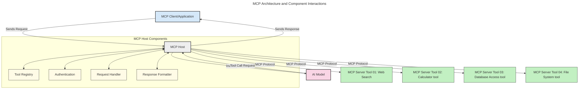
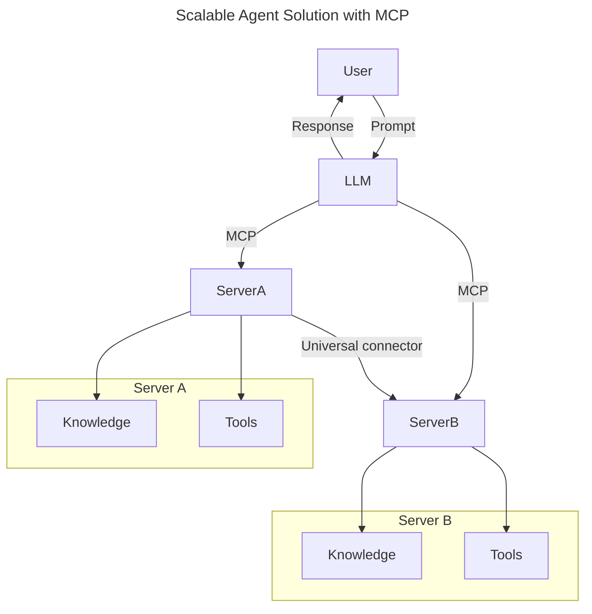
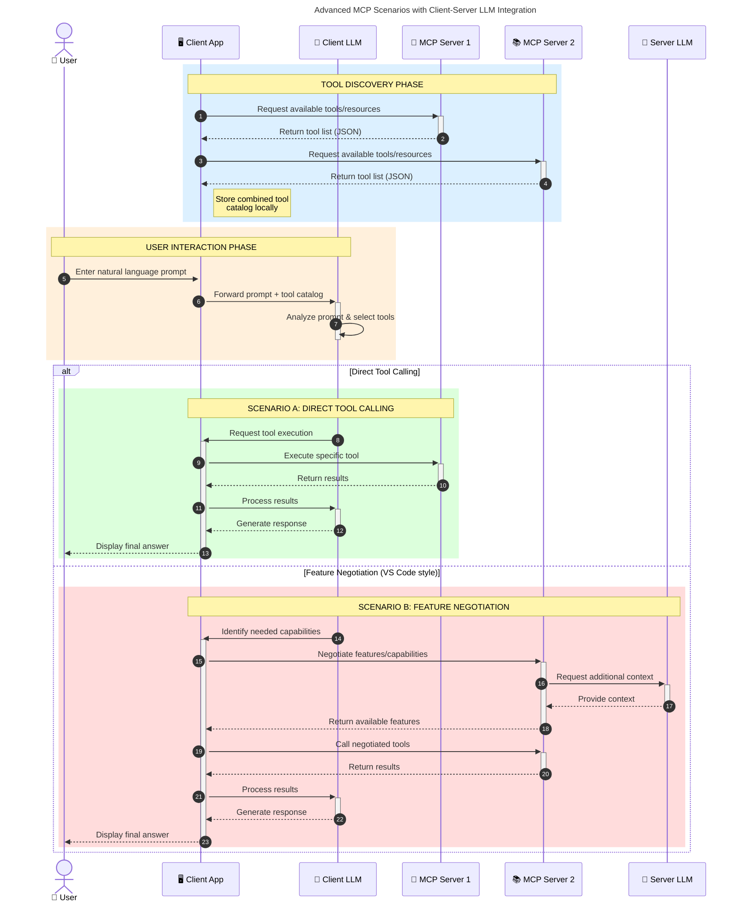

<!--
CO_OP_TRANSLATOR_METADATA:
{
  "original_hash": "0df1ee78a6dd8300f3a040ca5b411c2e",
  "translation_date": "2025-08-18T14:04:32+00:00",
  "source_file": "00-Introduction/README.md",
  "language_code": "el"
}
-->
# Εισαγωγή στο Πρωτόκολλο Πλαισίου Μοντέλου (MCP): Γιατί Είναι Σημαντικό για Επεκτάσιμες Εφαρμογές AI

_(Κάντε κλικ στην παραπάνω εικόνα για να παρακολουθήσετε το βίντεο αυτού του μαθήματος)_

Οι εφαρμογές Γενετικής Τεχνητής Νοημοσύνης (Generative AI) αποτελούν ένα μεγάλο βήμα προς τα εμπρός, καθώς συχνά επιτρέπουν στον χρήστη να αλληλεπιδρά με την εφαρμογή μέσω φυσικών γλωσσικών εντολών. Ωστόσο, καθώς επενδύονται περισσότερος χρόνος και πόροι σε τέτοιες εφαρμογές, είναι σημαντικό να διασφαλίσετε ότι μπορείτε εύκολα να ενσωματώσετε λειτουργίες και πόρους με τρόπο που να επιτρέπει την επέκταση, να υποστηρίζει περισσότερα από ένα μοντέλα και να διαχειρίζεται διάφορες ιδιαιτερότητες των μοντέλων. Με λίγα λόγια, η δημιουργία εφαρμογών Gen AI είναι εύκολη στην αρχή, αλλά καθώς μεγαλώνουν και γίνονται πιο περίπλοκες, χρειάζεται να ορίσετε μια αρχιτεκτονική και πιθανότατα να βασιστείτε σε ένα πρότυπο για να διασφαλίσετε ότι οι εφαρμογές σας χτίζονται με συνεπή τρόπο. Εδώ έρχεται το MCP για να οργανώσει τα πράγματα και να παρέχει ένα πρότυπο.

---

## **🔍 Τι Είναι το Πρωτόκολλο Πλαισίου Μοντέλου (MCP);**

Το **Πρωτόκολλο Πλαισίου Μοντέλου (MCP)** είναι μια **ανοιχτή, τυποποιημένη διεπαφή** που επιτρέπει στα Μεγάλα Γλωσσικά Μοντέλα (LLMs) να αλληλεπιδρούν απρόσκοπτα με εξωτερικά εργαλεία, APIs και πηγές δεδομένων. Παρέχει μια συνεπή αρχιτεκτονική για την ενίσχυση της λειτουργικότητας των μοντέλων AI πέρα από τα δεδομένα εκπαίδευσής τους, επιτρέποντας πιο έξυπνα, επεκτάσιμα και ευέλικτα συστήματα AI.

---

## **🎯 Γιατί Είναι Σημαντική η Τυποποίηση στην AI**

Καθώς οι εφαρμογές γενετικής AI γίνονται πιο περίπλοκες, είναι απαραίτητο να υιοθετηθούν πρότυπα που διασφαλίζουν **επεκτασιμότητα, ευελιξία, συντηρησιμότητα** και **αποφυγή εξάρτησης από συγκεκριμένους προμηθευτές**. Το MCP καλύπτει αυτές τις ανάγκες μέσω:

- Ενοποίησης των ενσωματώσεων μοντέλων-εργαλείων
- Μείωσης εύθραυστων, προσαρμοσμένων λύσεων
- Δυνατότητας συνύπαρξης πολλαπλών μοντέλων από διαφορετικούς προμηθευτές σε ένα οικοσύστημα

**Σημείωση:** Παρόλο που το MCP παρουσιάζεται ως ανοιχτό πρότυπο, δεν υπάρχουν σχέδια για την τυποποίησή του μέσω υπαρχόντων οργανισμών τυποποίησης όπως IEEE, IETF, W3C, ISO ή άλλων.

---

## **📚 Στόχοι Μάθησης**

Μέχρι το τέλος αυτού του άρθρου, θα μπορείτε να:

- Ορίσετε το **Πρωτόκολλο Πλαισίου Μοντέλου (MCP)** και τις περιπτώσεις χρήσης του
- Κατανοήσετε πώς το MCP τυποποιεί την επικοινωνία μοντέλου-εργαλείου
- Αναγνωρίσετε τα βασικά στοιχεία της αρχιτεκτονικής MCP
- Εξερευνήσετε πραγματικές εφαρμογές του MCP σε επιχειρηματικά και αναπτυξιακά περιβάλλοντα

---

## **💡 Γιατί το Πρωτόκολλο Πλαισίου Μοντέλου (MCP) Είναι Επαναστατικό**

### **🔗 Το MCP Λύνει τον Κατακερματισμό στις Αλληλεπιδράσεις AI**

Πριν από το MCP, η ενσωμάτωση μοντέλων με εργαλεία απαιτούσε:

- Προσαρμοσμένο κώδικα για κάθε ζεύγος εργαλείου-μοντέλου
- Μη τυποποιημένα APIs για κάθε προμηθευτή
- Συχνές διακοπές λόγω ενημερώσεων
- Κακή επεκτασιμότητα με περισσότερα εργαλεία

### **✅ Οφέλη της Τυποποίησης MCP**

| **Όφελος**              | **Περιγραφή**                                                                |
|--------------------------|-------------------------------------------------------------------------------|
| Διαλειτουργικότητα       | Τα LLMs λειτουργούν απρόσκοπτα με εργαλεία από διαφορετικούς προμηθευτές      |
| Συνέπεια                | Ομοιόμορφη συμπεριφορά σε πλατφόρμες και εργαλεία                             |
| Επαναχρησιμοποίηση       | Εργαλεία που δημιουργούνται μία φορά μπορούν να χρησιμοποιηθούν σε διάφορα έργα |
| Επιτάχυνση Ανάπτυξης     | Μείωση χρόνου ανάπτυξης μέσω τυποποιημένων, έτοιμων προς χρήση διεπαφών      |

---

## **🧱 Επισκόπηση Υψηλού Επιπέδου Αρχιτεκτονικής MCP**

Το MCP ακολουθεί ένα **μοντέλο πελάτη-διακομιστή**, όπου:

- Οι **MCP Hosts** εκτελούν τα μοντέλα AI
- Οι **MCP Clients** ξεκινούν αιτήματα
- Οι **MCP Servers** παρέχουν πλαίσιο, εργαλεία και δυνατότητες

### **Βασικά Στοιχεία:**

- **Πόροι** – Στατικά ή δυναμικά δεδομένα για τα μοντέλα  
- **Εντολές** – Προκαθορισμένες ροές εργασίας για καθοδηγούμενη δημιουργία  
- **Εργαλεία** – Εκτελέσιμες λειτουργίες όπως αναζήτηση, υπολογισμοί  
- **Δειγματοληψία** – Συμπεριφορά πρακτόρων μέσω αναδρομικών αλληλεπιδράσεων

---

## Πώς Λειτουργούν οι MCP Servers

Οι MCP servers λειτουργούν ως εξής:

- **Ροή Αιτήματος**:
    1. Ένα αίτημα ξεκινά από έναν τελικό χρήστη ή λογισμικό που ενεργεί για λογαριασμό του.
    2. Ο **MCP Client** στέλνει το αίτημα στον **MCP Host**, ο οποίος διαχειρίζεται τον χρόνο εκτέλεσης του μοντέλου AI.
    3. Το **Μοντέλο AI** λαμβάνει την εντολή του χρήστη και μπορεί να ζητήσει πρόσβαση σε εξωτερικά εργαλεία ή δεδομένα μέσω μίας ή περισσότερων κλήσεων εργαλείων.
    4. Ο **MCP Host**, και όχι το μοντέλο απευθείας, επικοινωνεί με τον κατάλληλο **MCP Server** χρησιμοποιώντας το τυποποιημένο πρωτόκολλο.
- **Λειτουργικότητα MCP Host**:
    - **Κατάλογος Εργαλείων**: Διατηρεί έναν κατάλογο διαθέσιμων εργαλείων και των δυνατοτήτων τους.
    - **Πιστοποίηση**: Επαληθεύει δικαιώματα πρόσβασης στα εργαλεία.
    - **Διαχειριστής Αιτημάτων**: Επεξεργάζεται εισερχόμενα αιτήματα εργαλείων από το μοντέλο.
    - **Μορφοποιητής Απαντήσεων**: Διαρθρώνει τις εξόδους εργαλείων σε μορφή που κατανοεί το μοντέλο.
- **Εκτέλεση MCP Server**:
    - Ο **MCP Host** δρομολογεί κλήσεις εργαλείων σε έναν ή περισσότερους **MCP Servers**, καθένας από τους οποίους εκθέτει εξειδικευμένες λειτουργίες (π.χ. αναζήτηση, υπολογισμοί, ερωτήματα βάσεων δεδομένων).
    - Οι **MCP Servers** εκτελούν τις αντίστοιχες λειτουργίες τους και επιστρέφουν αποτελέσματα στον **MCP Host** σε συνεπή μορφή.
    - Ο **MCP Host** μορφοποιεί και μεταβιβάζει αυτά τα αποτελέσματα στο **Μοντέλο AI**.
- **Ολοκλήρωση Απάντησης**:
    - Το **Μοντέλο AI** ενσωματώνει τις εξόδους εργαλείων σε μια τελική απάντηση.
    - Ο **MCP Host** στέλνει αυτή την απάντηση πίσω στον **MCP Client**, ο οποίος την παραδίδει στον τελικό χρήστη ή το καλούν λογισμικό.

## 👨‍💻 Πώς να Δημιουργήσετε έναν MCP Server (Με Παραδείγματα)

Οι MCP servers σας επιτρέπουν να επεκτείνετε τις δυνατότητες των LLM παρέχοντας δεδομένα και λειτουργικότητα.

Έτοιμοι να το δοκιμάσετε; Εδώ είναι SDKs για διαφορετικές γλώσσες/στοίβες με παραδείγματα δημιουργίας απλών MCP servers:

- **Python SDK**: https://github.com/modelcontextprotocol/python-sdk

- **TypeScript SDK**: https://github.com/modelcontextprotocol/typescript-sdk

- **Java SDK**: https://github.com/modelcontextprotocol/java-sdk

- **C#/.NET SDK**: https://github.com/modelcontextprotocol/csharp-sdk

---

## 🌍 Πραγματικές Περιπτώσεις Χρήσης του MCP

Το MCP επιτρέπει ένα ευρύ φάσμα εφαρμογών επεκτείνοντας τις δυνατότητες της AI:

| **Εφαρμογή**               | **Περιγραφή**                                                                |
|----------------------------|-------------------------------------------------------------------------------|
| Ενσωμάτωση Δεδομένων Επιχειρήσεων | Σύνδεση LLMs με βάσεις δεδομένων, CRM ή εσωτερικά εργαλεία                 |
| Πρακτορικά Συστήματα AI     | Ενεργοποίηση αυτόνομων πρακτόρων με πρόσβαση σε εργαλεία και ροές εργασίας    |
| Πολυτροπικές Εφαρμογές      | Συνδυασμός εργαλείων κειμένου, εικόνας και ήχου σε μία ενιαία εφαρμογή AI     |
| Ενσωμάτωση Ζωντανών Δεδομένων | Εισαγωγή ζωντανών δεδομένων στις αλληλεπιδράσεις AI για πιο ακριβή αποτελέσματα |

---

### 🧠 MCP = Καθολικό Πρότυπο για Αλληλεπιδράσεις AI

Το Πρωτόκολλο Πλαισίου Μοντέλου (MCP) λειτουργεί ως καθολικό πρότυπο για αλληλεπιδράσεις AI, όπως το USB-C τυποποίησε τις φυσικές συνδέσεις για συσκευές. Στον κόσμο της AI, το MCP παρέχει μια συνεπή διεπαφή, επιτρέποντας στα μοντέλα (clients) να ενσωματώνονται απρόσκοπτα με εξωτερικά εργαλεία και παρόχους δεδομένων (servers). Αυτό εξαλείφει την ανάγκη για διαφορετικά, προσαρμοσμένα πρωτόκολλα για κάθε API ή πηγή δεδομένων.

---

### 💡 Διευκολύνει την Πρόσβαση στη Γνώση

Πέρα από την παροχή εργαλείων, το MCP διευκολύνει την πρόσβαση στη γνώση. Επιτρέπει στις εφαρμογές να παρέχουν πλαίσιο στα μεγάλα γλωσσικά μοντέλα (LLMs) συνδέοντάς τα με διάφορες πηγές δεδομένων. Για παράδειγμα, ένας MCP server μπορεί να αντιπροσωπεύει το αποθετήριο εγγράφων μιας εταιρείας, επιτρέποντας στους πράκτορες να ανακτούν σχετικές πληροφορίες κατά παραγγελία. Άλλος server μπορεί να χειρίζεται συγκεκριμένες ενέργειες, όπως αποστολή email ή ενημέρωση αρχείων. Από την οπτική του πράκτορα, αυτά είναι απλώς εργαλεία που μπορεί να χρησιμοποιήσει—κάποια εργαλεία επιστρέφουν δεδομένα (πλαίσιο γνώσης), ενώ άλλα εκτελούν ενέργειες. Το MCP διαχειρίζεται αποτελεσματικά και τα δύο.

---

### 👉 Παράδειγμα: Επεκτάσιμη Λύση Πρακτόρων

---

### 🔄 Προχωρημένα Σενάρια MCP με Ενσωμάτωση LLM στην Πλευρά του Πελάτη

Πέρα από τη βασική αρχιτεκτονική MCP, υπάρχουν προχωρημένα σενάρια όπου τόσο ο πελάτης όσο και ο διακομιστής περιέχουν LLMs, επιτρέποντας πιο εξελιγμένες αλληλεπιδράσεις. Στο παρακάτω διάγραμμα, η **Εφαρμογή Πελάτη** θα μπορούσε να είναι ένα IDE με διαθέσιμα MCP εργαλεία για χρήση από το LLM:

---

## 🔐 Πρακτικά Οφέλη του MCP

Εδώ είναι τα πρακτικά οφέλη της χρήσης του MCP:

- **Επικαιρότητα**: Τα μοντέλα μπορούν να έχουν πρόσβαση σε ενημερωμένες πληροφορίες πέρα από τα δεδομένα εκπαίδευσής τους
- **Επέκταση Δυνατοτήτων**: Τα μοντέλα μπορούν να αξιοποιούν εξειδικευμένα εργαλεία για εργασίες που δεν έχουν εκπαιδευτεί
- **Μείωση Παραισθήσεων**: Εξωτερικές πηγές δεδομένων παρέχουν πραγματική βάση
- **Απόρρητο**: Ευαίσθητα δεδομένα μπορούν να παραμένουν σε ασφαλή περιβάλλοντα αντί να ενσωματώνονται σε εντολές

---

## 📌 Βασικά Σημεία

Τα παρακάτω είναι βασικά σημεία για τη χρήση του MCP:

- Το **MCP** τυποποιεί τον τρόπο με τον οποίο τα μοντέλα AI αλληλεπιδρούν με εργαλεία και δεδομένα
- Προάγει την **επεκτασιμότητα, συνέπεια και διαλειτουργικότητα**
- Το MCP βοηθά στη **μείωση του χρόνου ανάπτυξης, τη βελτίωση της αξιοπιστίας και την επέκταση των δυνατοτήτων των μοντέλων**
- Η αρχιτεκτονική πελάτη-διακομιστή επιτρέπει **ευέλικτες, επεκτάσιμες εφαρμογές AI**

---

## 🧠 Άσκηση

Σκεφτείτε μια εφαρμογή AI που σας ενδιαφέρει να δημιουργήσετε.

- Ποια **εξωτερικά εργαλεία ή δεδομένα** θα μπορούσαν να ενισχύσουν τις δυνατότητές της;
- Πώς θα μπορούσε το MCP να κάνει την ενσωμάτωση **απλούστερη και πιο αξιόπιστη**;

---

## Πρόσθετοι Πόροι

- [Αποθετήριο MCP στο GitHub](https://github.com/modelcontextprotocol)

---

## Τι Ακολουθεί

Επόμενο: [Κεφάλαιο 1: Βασικές Έννοιες](../01-CoreConcepts/README.md)

**Αποποίηση Ευθύνης**:  
Αυτό το έγγραφο έχει μεταφραστεί χρησιμοποιώντας την υπηρεσία αυτόματης μετάφρασης [Co-op Translator](https://github.com/Azure/co-op-translator). Παρόλο που καταβάλλουμε προσπάθειες για ακρίβεια, παρακαλούμε να έχετε υπόψη ότι οι αυτόματες μεταφράσεις ενδέχεται να περιέχουν σφάλματα ή ανακρίβειες. Το πρωτότυπο έγγραφο στη μητρική του γλώσσα θα πρέπει να θεωρείται η αυθεντική πηγή. Για κρίσιμες πληροφορίες, συνιστάται επαγγελματική ανθρώπινη μετάφραση. Δεν φέρουμε ευθύνη για τυχόν παρεξηγήσεις ή εσφαλμένες ερμηνείες που προκύπτουν από τη χρήση αυτής της μετάφρασης.