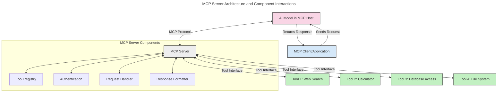
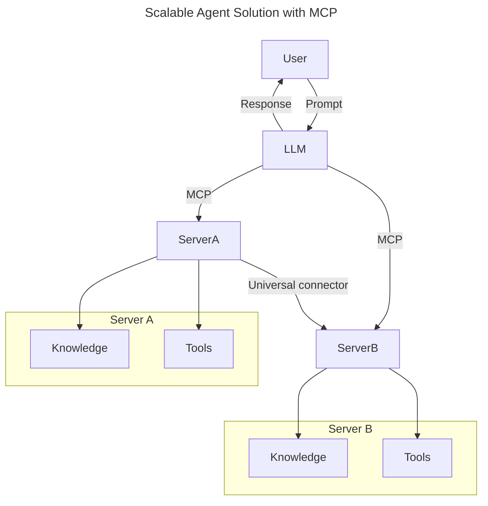
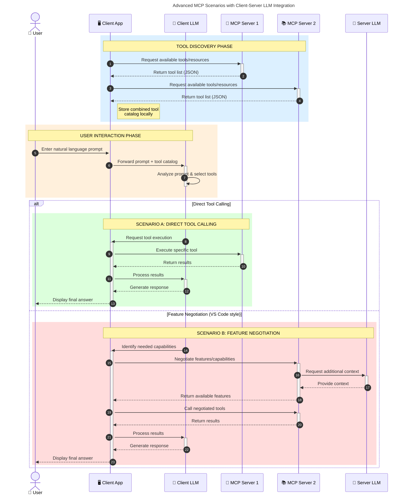

<!--
CO_OP_TRANSLATOR_METADATA:
{
  "original_hash": "105c2ddbb77bc38f7e9df009e1b06e45",
  "translation_date": "2025-07-04T17:20:19+00:00",
  "source_file": "00-Introduction/README.md",
  "language_code": "el"
}
-->
# Εισαγωγή στο Model Context Protocol (MCP): Γιατί Είναι Σημαντικό για Επεκτάσιμες Εφαρμογές Τεχνητής Νοημοσύνης

Οι εφαρμογές γεννητικής Τεχνητής Νοημοσύνης αποτελούν ένα σημαντικό βήμα προόδου, καθώς συχνά επιτρέπουν στον χρήστη να αλληλεπιδρά με την εφαρμογή χρησιμοποιώντας φυσική γλώσσα. Ωστόσο, καθώς επενδύεται περισσότερος χρόνος και πόροι σε τέτοιες εφαρμογές, θέλετε να βεβαιωθείτε ότι μπορείτε να ενσωματώσετε λειτουργίες και πόρους με τρόπο που να είναι εύκολη η επέκταση, να υποστηρίζεται η χρήση περισσότερων του ενός μοντέλων και να διαχειρίζονται οι διάφορες ιδιαιτερότητες των μοντέλων. Με λίγα λόγια, η δημιουργία εφαρμογών γεννητικής ΤΝ είναι εύκολη στην αρχή, αλλά καθώς μεγαλώνουν και γίνονται πιο πολύπλοκες, χρειάζεται να ορίσετε μια αρχιτεκτονική και πιθανότατα να βασιστείτε σε ένα πρότυπο για να διασφαλίσετε ότι οι εφαρμογές σας χτίζονται με συνεπή τρόπο. Εδώ έρχεται το MCP για να οργανώσει τα πράγματα και να προσφέρει ένα πρότυπο.

---

## **🔍 Τι Είναι το Model Context Protocol (MCP);**

Το **Model Context Protocol (MCP)** είναι μια **ανοικτή, τυποποιημένη διεπαφή** που επιτρέπει στα Μεγάλα Γλωσσικά Μοντέλα (LLMs) να αλληλεπιδρούν απρόσκοπτα με εξωτερικά εργαλεία, APIs και πηγές δεδομένων. Παρέχει μια συνεπή αρχιτεκτονική για την ενίσχυση της λειτουργικότητας των μοντέλων ΤΝ πέρα από τα δεδομένα εκπαίδευσής τους, επιτρέποντας πιο έξυπνα, επεκτάσιμα και ανταποκρινόμενα συστήματα ΤΝ.

---

## **🎯 Γιατί Η Τυποποίηση στην ΤΝ Είναι Σημαντική**

Καθώς οι εφαρμογές γεννητικής ΤΝ γίνονται πιο πολύπλοκες, είναι απαραίτητο να υιοθετηθούν πρότυπα που διασφαλίζουν **επεκτασιμότητα, επεκτασιμότητα** και **διαχειρισιμότητα**. Το MCP καλύπτει αυτές τις ανάγκες μέσω:

- Ενοποίησης των ενσωματώσεων μοντέλου-εργαλείου  
- Μείωσης εύθραυστων, μοναδικών λύσεων  
- Δυνατότητας συνύπαρξης πολλαπλών μοντέλων σε ένα οικοσύστημα  

---

## **📚 Μαθησιακοί Στόχοι**

Στο τέλος αυτού του άρθρου, θα μπορείτε να:

- Ορίσετε το **Model Context Protocol (MCP)** και τις περιπτώσεις χρήσης του  
- Κατανοήσετε πώς το MCP τυποποιεί την επικοινωνία μοντέλου-εργαλείου  
- Αναγνωρίσετε τα βασικά στοιχεία της αρχιτεκτονικής MCP  
- Εξερευνήσετε πραγματικές εφαρμογές του MCP σε επιχειρηματικά και αναπτυξιακά περιβάλλοντα  

---

## **💡 Γιατί το Model Context Protocol (MCP) Αλλάζει τα Δεδομένα**

### **🔗 Το MCP Λύνει το Πρόβλημα της Κατακερματισμένης Αλληλεπίδρασης στην ΤΝ**

Πριν το MCP, η ενσωμάτωση μοντέλων με εργαλεία απαιτούσε:

- Εξατομικευμένο κώδικα για κάθε ζεύγος εργαλείου-μοντέλου  
- Μη τυποποιημένα APIs για κάθε προμηθευτή  
- Συχνές διακοπές λόγω ενημερώσεων  
- Κακή επεκτασιμότητα με περισσότερα εργαλεία  

### **✅ Οφέλη της Τυποποίησης MCP**

| **Όφελος**               | **Περιγραφή**                                                                 |
|--------------------------|-------------------------------------------------------------------------------|
| Διαλειτουργικότητα       | Τα LLMs συνεργάζονται απρόσκοπτα με εργαλεία από διαφορετικούς προμηθευτές    |
| Συνοχή                   | Ομοιόμορφη συμπεριφορά σε πλατφόρμες και εργαλεία                            |
| Επαναχρησιμοποίηση       | Τα εργαλεία που δημιουργούνται μια φορά μπορούν να χρησιμοποιηθούν σε πολλά έργα και συστήματα |
| Επιτάχυνση Ανάπτυξης     | Μείωση χρόνου ανάπτυξης με τη χρήση τυποποιημένων, plug-and-play διεπαφών     |

---

## **🧱 Επισκόπηση Υψηλού Επιπέδου Αρχιτεκτονικής MCP**

Το MCP ακολουθεί ένα **μοντέλο πελάτη-διακομιστή**, όπου:

- Οι **MCP Hosts** τρέχουν τα μοντέλα ΤΝ  
- Οι **MCP Clients** ξεκινούν αιτήματα  
- Οι **MCP Servers** παρέχουν context, εργαλεία και δυνατότητες  

### **Κύρια Στοιχεία:**

- **Πόροι** – Στατικά ή δυναμικά δεδομένα για τα μοντέλα  
- **Προτροπές** – Προκαθορισμένες ροές εργασίας για καθοδηγούμενη δημιουργία  
- **Εργαλεία** – Εκτελέσιμες λειτουργίες όπως αναζήτηση, υπολογισμοί  
- **Δειγματοληψία** – Συμπεριφορά πράκτορα μέσω αναδρομικών αλληλεπιδράσεων  

---

## Πώς Λειτουργούν οι MCP Servers

Οι MCP servers λειτουργούν ως εξής:

- **Ροή Αιτήματος**:  
    1. Ο MCP Client στέλνει ένα αίτημα στο AI Model που τρέχει σε MCP Host.  
    2. Το AI Model αναγνωρίζει πότε χρειάζεται εξωτερικά εργαλεία ή δεδομένα.  
    3. Το μοντέλο επικοινωνεί με τον MCP Server χρησιμοποιώντας το τυποποιημένο πρωτόκολλο.  

- **Λειτουργικότητα MCP Server**:  
    - Κατάλογος Εργαλείων: Διατηρεί κατάλογο διαθέσιμων εργαλείων και δυνατοτήτων τους.  
    - Πιστοποίηση: Επαληθεύει τα δικαιώματα πρόσβασης στα εργαλεία.  
    - Διαχειριστής Αιτημάτων: Επεξεργάζεται εισερχόμενα αιτήματα εργαλείων από το μοντέλο.  
    - Μορφοποιητής Απαντήσεων: Διαμορφώνει τα αποτελέσματα των εργαλείων σε μορφή που κατανοεί το μοντέλο.  

- **Εκτέλεση Εργαλείων**:  
    - Ο διακομιστής δρομολογεί τα αιτήματα στα κατάλληλα εξωτερικά εργαλεία  
    - Τα εργαλεία εκτελούν τις εξειδικευμένες λειτουργίες τους (αναζήτηση, υπολογισμοί, ερωτήματα βάσης δεδομένων κ.ά.)  
    - Τα αποτελέσματα επιστρέφονται στο μοντέλο σε συνεπή μορφή.  

- **Ολοκλήρωση Απάντησης**:  
    - Το AI μοντέλο ενσωματώνει τα αποτελέσματα των εργαλείων στην απάντησή του.  
    - Η τελική απάντηση αποστέλλεται πίσω στην εφαρμογή πελάτη.  

## 👨‍💻 Πώς να Δημιουργήσετε έναν MCP Server (Με Παραδείγματα)

Οι MCP servers σας επιτρέπουν να επεκτείνετε τις δυνατότητες των LLM παρέχοντας δεδομένα και λειτουργικότητα.

Έτοιμοι να το δοκιμάσετε; Εδώ είναι παραδείγματα δημιουργίας ενός απλού MCP server σε διάφορες γλώσσες:

- **Παράδειγμα Python**: https://github.com/modelcontextprotocol/python-sdk

- **Παράδειγμα TypeScript**: https://github.com/modelcontextprotocol/typescript-sdk

- **Παράδειγμα Java**: https://github.com/modelcontextprotocol/java-sdk

- **Παράδειγμα C#/.NET**: https://github.com/modelcontextprotocol/csharp-sdk

## 🌍 Πραγματικές Περιπτώσεις Χρήσης του MCP

Το MCP επιτρέπει ένα ευρύ φάσμα εφαρμογών επεκτείνοντας τις δυνατότητες της ΤΝ:

| **Εφαρμογή**               | **Περιγραφή**                                                                 |
|----------------------------|-------------------------------------------------------------------------------|
| Ενσωμάτωση Επιχειρησιακών Δεδομένων | Σύνδεση LLMs με βάσεις δεδομένων, CRM ή εσωτερικά εργαλεία                   |
| Πρακτορικά Συστήματα ΤΝ     | Ενεργοποίηση αυτόνομων πρακτόρων με πρόσβαση σε εργαλεία και ροές λήψης αποφάσεων |
| Πολυμορφικές Εφαρμογές      | Συνδυασμός κειμένου, εικόνας και ήχου σε μια ενιαία εφαρμογή ΤΝ               |
| Ενσωμάτωση Δεδομένων σε Πραγματικό Χρόνο | Εισαγωγή ζωντανών δεδομένων στις αλληλεπιδράσεις ΤΝ για πιο ακριβή και ενημερωμένα αποτελέσματα |

### 🧠 MCP = Καθολικό Πρότυπο για Αλληλεπιδράσεις ΤΝ

Το Model Context Protocol (MCP) λειτουργεί ως καθολικό πρότυπο για τις αλληλεπιδράσεις ΤΝ, όπως το USB-C τυποποίησε τις φυσικές συνδέσεις για συσκευές. Στον κόσμο της ΤΝ, το MCP παρέχει μια συνεπή διεπαφή, επιτρέποντας στα μοντέλα (πελάτες) να ενσωματώνονται απρόσκοπτα με εξωτερικά εργαλεία και παρόχους δεδομένων (διακομιστές). Αυτό εξαλείφει την ανάγκη για ποικίλα, εξατομικευμένα πρωτόκολλα για κάθε API ή πηγή δεδομένων.

Στο πλαίσιο του MCP, ένα εργαλείο συμβατό με MCP (αναφερόμενο ως MCP server) ακολουθεί ένα ενιαίο πρότυπο. Αυτοί οι διακομιστές μπορούν να καταγράφουν τα εργαλεία ή τις ενέργειες που προσφέρουν και να τις εκτελούν όταν ζητηθούν από έναν πράκτορα ΤΝ. Οι πλατφόρμες πρακτόρων ΤΝ που υποστηρίζουν MCP μπορούν να ανακαλύπτουν διαθέσιμα εργαλεία από τους διακομιστές και να τα καλούν μέσω αυτού του τυποποιημένου πρωτοκόλλου.

### 💡 Διευκολύνει την πρόσβαση στη γνώση

Πέρα από την παροχή εργαλείων, το MCP διευκολύνει και την πρόσβαση στη γνώση. Επιτρέπει στις εφαρμογές να παρέχουν context στα μεγάλα γλωσσικά μοντέλα (LLMs) συνδέοντάς τα με διάφορες πηγές δεδομένων. Για παράδειγμα, ένας MCP server μπορεί να αντιπροσωπεύει το αποθετήριο εγγράφων μιας εταιρείας, επιτρέποντας στους πράκτορες να ανακτούν σχετικές πληροφορίες κατόπιν ζήτησης. Ένας άλλος διακομιστής μπορεί να χειρίζεται συγκεκριμένες ενέργειες όπως αποστολή email ή ενημέρωση αρχείων. Από την οπτική του πράκτορα, αυτά είναι απλώς εργαλεία που μπορεί να χρησιμοποιήσει — κάποια επιστρέφουν δεδομένα (context γνώσης), ενώ άλλα εκτελούν ενέργειες. Το MCP διαχειρίζεται αποτελεσματικά και τα δύο.

Ένας πράκτορας που συνδέεται με έναν MCP server μαθαίνει αυτόματα τις διαθέσιμες δυνατότητες και τα προσβάσιμα δεδομένα του διακομιστή μέσω ενός τυποποιημένου φορμάτ. Αυτή η τυποποίηση επιτρέπει δυναμική διαθεσιμότητα εργαλείων. Για παράδειγμα, η προσθήκη ενός νέου MCP server στο σύστημα ενός πράκτορα καθιστά τις λειτουργίες του άμεσα διαθέσιμες χωρίς να απαιτείται περαιτέρω προσαρμογή των οδηγιών του πράκτορα.

Αυτή η απλοποιημένη ενσωμάτωση ευθυγραμμίζεται με τη ροή που απεικονίζεται στο διάγραμμα mermaid, όπου οι διακομιστές παρέχουν τόσο εργαλεία όσο και γνώση, εξασφαλίζοντας απρόσκοπτη συνεργασία μεταξύ συστημάτων.

### 👉 Παράδειγμα: Επεκτάσιμη Λύση Πράκτορα

### 🔄 Προχωρημένα Σενάρια MCP με Ενσωμάτωση LLM στην Πλευρά του Πελάτη

Πέρα από την βασική αρχιτεκτονική MCP, υπάρχουν προχωρημένα σενάρια όπου τόσο ο πελάτης όσο και ο διακομιστής περιέχουν LLMs, επιτρέποντας πιο σύνθετες αλληλεπιδράσεις:

## 🔐 Πρακτικά Οφέλη του MCP

Ακολουθούν τα πρακτικά οφέλη από τη χρήση του MCP:

- **Ενημερότητα**: Τα μοντέλα μπορούν να έχουν πρόσβαση σε ενημερωμένες πληροφορίες πέρα από τα δεδομένα εκπαίδευσής τους  
- **Επέκταση Δυνατοτήτων**: Τα μοντέλα μπορούν να αξιοποιούν εξειδικευμένα εργαλεία για εργασίες για τις οποίες δεν έχουν εκπαιδευτεί  
- **Μείωση Παραισθήσεων**: Εξωτερικές πηγές δεδομένων παρέχουν πραγματική βάση  
- **Απόρρητο**: Ευαίσθητα δεδομένα μπορούν να παραμένουν σε ασφαλή περιβάλλοντα αντί να ενσωματώνονται στις προτροπές  

## 📌 Βασικά Συμπεράσματα

Τα βασικά σημεία για τη χρήση του MCP είναι:

- Το **MCP** τυποποιεί τον τρόπο με τον οποίο τα μοντέλα ΤΝ αλληλεπιδρούν με εργαλεία και δεδομένα  
- Προωθεί την **επεκτασιμότητα, τη συνοχή και τη διαλειτουργικότητα**  
- Το MCP βοηθά στη **μείωση του χρόνου ανάπτυξης, στη βελτίωση της αξιοπιστίας και στην επέκταση των δυνατοτήτων των μοντέλων**  
- Η αρχιτεκτονική πελάτη-διακομιστή **επιτρέπει ευέλικτες, επεκτάσιμες εφαρμογές ΤΝ**  

## 🧠 Άσκηση

Σκεφτείτε μια εφαρμογή ΤΝ που σας ενδιαφέρει να δημιουργήσετε.

- Ποια **εξωτερικά εργαλεία ή δεδομένα** θα μπορούσαν να ενισχύσουν τις δυνατότητές της;  
- Πώς θα μπορούσε το MCP να κάνει την ενσωμάτωση **απλούστερη και πιο αξιόπιστη**;  

## Πρόσθετοι Πόροι

- [MCP GitHub Repository](https://github.com/modelcontextprotocol)

## Τι ακολουθεί

Επόμενο: [Κεφάλαιο 1: Βασικές Έννοιες](../01-CoreConcepts/README.md)

**Αποποίηση ευθυνών**:  
Αυτό το έγγραφο έχει μεταφραστεί χρησιμοποιώντας την υπηρεσία αυτόματης μετάφρασης AI [Co-op Translator](https://github.com/Azure/co-op-translator). Παρόλο που επιδιώκουμε την ακρίβεια, παρακαλούμε να γνωρίζετε ότι οι αυτόματες μεταφράσεις ενδέχεται να περιέχουν λάθη ή ανακρίβειες. Το πρωτότυπο έγγραφο στη γλώσσα του θεωρείται η αυθεντική πηγή. Για κρίσιμες πληροφορίες, συνιστάται επαγγελματική ανθρώπινη μετάφραση. Δεν φέρουμε ευθύνη για τυχόν παρεξηγήσεις ή λανθασμένες ερμηνείες που προκύπτουν από τη χρήση αυτής της μετάφρασης.