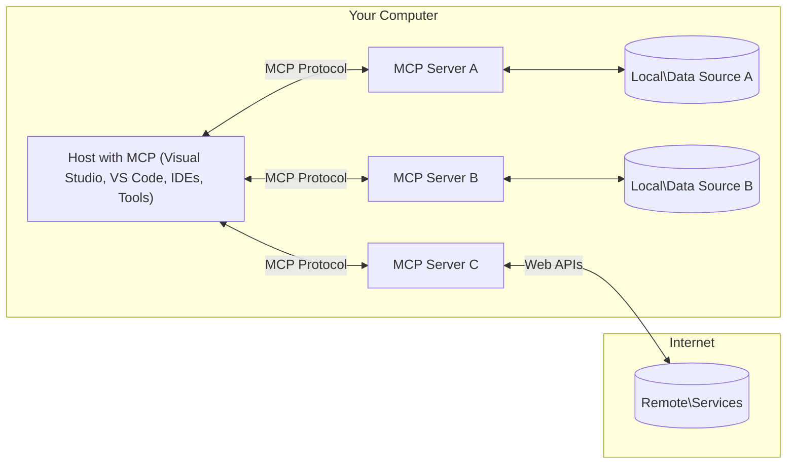

<!--
CO_OP_TRANSLATOR_METADATA:
{
  "original_hash": "904b59de1de9264801242d90a42cdd9d",
  "translation_date": "2025-09-05T11:02:19+00:00",
  "source_file": "01-CoreConcepts/README.md",
  "language_code": "el"
}
-->
# MCP Βασικές Έννοιες: Κατανόηση του Πρωτοκόλλου Πλαισίου Μοντέλου για Ενσωμάτωση AI

[](https://youtu.be/earDzWGtE84)

_(Κάντε κλικ στην εικόνα παραπάνω για να παρακολουθήσετε το βίντεο αυτού του μαθήματος)_

Το [Model Context Protocol (MCP)](https://github.com/modelcontextprotocol) είναι ένα ισχυρό, τυποποιημένο πλαίσιο που βελτιστοποιεί την επικοινωνία μεταξύ Μεγάλων Γλωσσικών Μοντέλων (LLMs) και εξωτερικών εργαλείων, εφαρμογών και πηγών δεδομένων. 
Αυτός ο οδηγός θα σας καθοδηγήσει στις βασικές έννοιες του MCP. Θα μάθετε για την αρχιτεκτονική πελάτη-διακομιστή, τα βασικά στοιχεία, τους μηχανισμούς επικοινωνίας και τις βέλτιστες πρακτικές υλοποίησης.

- **Ρητή Συγκατάθεση Χρήστη**: Όλες οι προσβάσεις δεδομένων και οι λειτουργίες απαιτούν ρητή έγκριση από τον χρήστη πριν την εκτέλεση. Οι χρήστες πρέπει να κατανοούν ξεκάθαρα ποια δεδομένα θα προσπελαστούν και ποιες ενέργειες θα πραγματοποιηθούν, με λεπτομερή έλεγχο των δικαιωμάτων και των εξουσιοδοτήσεων.

- **Προστασία Ιδιωτικότητας Δεδομένων**: Τα δεδομένα του χρήστη εκτίθενται μόνο με ρητή συγκατάθεση και πρέπει να προστατεύονται από ισχυρούς ελέγχους πρόσβασης καθ' όλη τη διάρκεια της αλληλεπίδρασης. Οι υλοποιήσεις πρέπει να αποτρέπουν μη εξουσιοδοτημένη μετάδοση δεδομένων και να διατηρούν αυστηρά όρια ιδιωτικότητας.

- **Ασφάλεια Εκτέλεσης Εργαλείων**: Κάθε κλήση εργαλείου απαιτεί ρητή συγκατάθεση του χρήστη με σαφή κατανόηση της λειτουργικότητας, των παραμέτρων και της πιθανής επίδρασης του εργαλείου. Ισχυρά όρια ασφαλείας πρέπει να αποτρέπουν ακούσια, μη ασφαλή ή κακόβουλη εκτέλεση εργαλείων.

- **Ασφάλεια Επίπεδου Μεταφοράς**: Όλα τα κανάλια επικοινωνίας πρέπει να χρησιμοποιούν κατάλληλους μηχανισμούς κρυπτογράφησης και αυθεντικοποίησης. Οι απομακρυσμένες συνδέσεις πρέπει να υλοποιούν ασφαλή πρωτόκολλα μεταφοράς και σωστή διαχείριση διαπιστευτηρίων.

#### Οδηγίες Υλοποίησης:

- **Διαχείριση Δικαιωμάτων**: Υλοποιήστε συστήματα λεπτομερούς διαχείρισης δικαιωμάτων που επιτρέπουν στους χρήστες να ελέγχουν ποιοι διακομιστές, εργαλεία και πόροι είναι προσβάσιμοι
- **Αυθεντικοποίηση & Εξουσιοδότηση**: Χρησιμοποιήστε ασφαλείς μεθόδους αυθεντικοποίησης (OAuth, API keys) με σωστή διαχείριση και λήξη των tokens  
- **Επικύρωση Εισόδου**: Επικυρώστε όλες τις παραμέτρους και τις εισόδους δεδομένων σύμφωνα με καθορισμένα σχήματα για την αποτροπή επιθέσεων εισαγωγής
- **Καταγραφή Ελέγχου**: Διατηρήστε ολοκληρωμένα αρχεία καταγραφής όλων των λειτουργιών για παρακολούθηση ασφάλειας και συμμόρφωση

## Επισκόπηση

Αυτό το μάθημα εξερευνά τη θεμελιώδη αρχιτεκτονική και τα στοιχεία που αποτελούν το οικοσύστημα του Model Context Protocol (MCP). Θα μάθετε για την αρχιτεκτονική πελάτη-διακομιστή, τα βασικά στοιχεία και τους μηχανισμούς επικοινωνίας που υποστηρίζουν τις αλληλεπιδράσεις MCP.

## Βασικοί Στόχοι Μάθησης

Μέχρι το τέλος αυτού του μαθήματος, θα:

- Κατανοήσετε την αρχιτεκτονική πελάτη-διακομιστή του MCP.
- Αναγνωρίσετε τους ρόλους και τις ευθύνες των Hosts, Clients και Servers.
- Αναλύσετε τα βασικά χαρακτηριστικά που κάνουν το MCP ένα ευέλικτο επίπεδο ενσωμάτωσης.
- Μάθετε πώς ρέει η πληροφορία μέσα στο οικοσύστημα MCP.
- Αποκτήσετε πρακτικές γνώσεις μέσω παραδειγμάτων κώδικα σε .NET, Java, Python και JavaScript.

## Αρχιτεκτονική MCP: Μια Βαθύτερη Ματιά

Το οικοσύστημα MCP βασίζεται σε ένα μοντέλο πελάτη-διακομιστή. Αυτή η αρθρωτή δομή επιτρέπει στις εφαρμογές AI να αλληλεπιδρούν αποτελεσματικά με εργαλεία, βάσεις δεδομένων, APIs και πηγές πλαισίου. Ας αναλύσουμε αυτήν την αρχιτεκτονική στα βασικά της στοιχεία.

Στον πυρήνα του, το MCP ακολουθεί μια αρχιτεκτονική πελάτη-διακομιστή όπου μια εφαρμογή host μπορεί να συνδεθεί με πολλούς διακομιστές:



- **MCP Hosts**: Προγράμματα όπως το VSCode, το Claude Desktop, IDEs ή εργαλεία AI που θέλουν να έχουν πρόσβαση σε δεδομένα μέσω MCP
- **MCP Clients**: Πελάτες πρωτοκόλλου που διατηρούν συνδέσεις 1:1 με διακομιστές
- **MCP Servers**: Ελαφριά προγράμματα που εκθέτουν συγκεκριμένες δυνατότητες μέσω του τυποποιημένου Model Context Protocol
- **Τοπικές Πηγές Δεδομένων**: Αρχεία, βάσεις δεδομένων και υπηρεσίες του υπολογιστή σας που μπορούν να προσπελαστούν με ασφάλεια από MCP servers
- **Απομακρυσμένες Υπηρεσίες**: Εξωτερικά συστήματα διαθέσιμα μέσω διαδικτύου που μπορούν να συνδεθούν με MCP servers μέσω APIs.

Το Πρωτόκολλο MCP είναι ένα εξελισσόμενο πρότυπο που χρησιμοποιεί χρονολογική έκδοση (μορφή YYYY-MM-DD). Η τρέχουσα έκδοση του πρωτοκόλλου είναι **2025-06-18**. Μπορείτε να δείτε τις τελευταίες ενημερώσεις στις [προδιαγραφές πρωτοκόλλου](https://modelcontextprotocol.io/specification/2025-06-18/)

### 1. Hosts

Στο Model Context Protocol (MCP), οι **Hosts** είναι εφαρμογές AI που λειτουργούν ως η κύρια διεπαφή μέσω της οποίας οι χρήστες αλληλεπιδρούν με το πρωτόκολλο. Οι Hosts συντονίζουν και διαχειρίζονται συνδέσεις με πολλούς MCP servers δημιουργώντας ειδικούς MCP clients για κάθε σύνδεση διακομιστή. Παραδείγματα Hosts περιλαμβάνουν:

- **Εφαρμογές AI**: Claude Desktop, Visual Studio Code, Claude Code
- **Περιβάλλοντα Ανάπτυξης**: IDEs και επεξεργαστές κώδικα με ενσωμάτωση MCP  
- **Προσαρμοσμένες Εφαρμογές**: Ειδικά εργαλεία και πράκτορες AI

Οι **Hosts** είναι εφαρμογές που συντονίζουν τις αλληλεπιδράσεις μοντέλων AI. Αυτές:

- **Οργανώνουν Μοντέλα AI**: Εκτελούν ή αλληλεπιδρούν με LLMs για τη δημιουργία απαντήσεων και τον συντονισμό ροών εργασίας AI
- **Διαχειρίζονται Συνδέσεις Πελατών**: Δημιουργούν και διατηρούν έναν MCP client ανά σύνδεση MCP server
- **Ελέγχουν τη Διεπαφή Χρήστη**: Διαχειρίζονται τη ροή συνομιλίας, τις αλληλεπιδράσεις χρήστη και την παρουσίαση απαντήσεων  
- **Επιβάλλουν Ασφάλεια**: Ελέγχουν δικαιώματα, περιορισμούς ασφαλείας και αυθεντικοποίηση
- **Διαχειρίζονται τη Συγκατάθεση Χρήστη**: Ελέγχουν την έγκριση του χρήστη για την κοινή χρήση δεδομένων και την εκτέλεση εργαλείων

### 2. Clients

Οι **Clients** είναι βασικά στοιχεία που διατηρούν αποκλειστικές συνδέσεις ένας προς έναν μεταξύ Hosts και MCP servers. Κάθε MCP client δημιουργείται από τον Host για να συνδεθεί με έναν συγκεκριμένο MCP server, εξασφαλίζοντας οργανωμένα και ασφαλή κανάλια επικοινωνίας. Πολλαπλοί clients επιτρέπουν στους Hosts να συνδέονται με πολλούς servers ταυτόχρονα.

Οι **Clients** είναι συνδετικά στοιχεία μέσα στην εφαρμογή host. Αυτοί:

- **Επικοινωνία Πρωτοκόλλου**: Στέλνουν αιτήματα JSON-RPC 2.0 σε servers με προτροπές και οδηγίες
- **Διαπραγμάτευση Δυνατοτήτων**: Διαπραγματεύονται υποστηριζόμενες δυνατότητες και εκδόσεις πρωτοκόλλου με servers κατά την αρχικοποίηση
- **Εκτέλεση Εργαλείων**: Διαχειρίζονται αιτήματα εκτέλεσης εργαλείων από μοντέλα και επεξεργάζονται απαντήσεις
- **Ενημερώσεις σε Πραγματικό Χρόνο**: Διαχειρίζονται ειδοποιήσεις και ενημερώσεις σε πραγματικό χρόνο από servers
- **Επεξεργασία Απαντήσεων**: Επεξεργάζονται και μορφοποιούν τις απαντήσεις των servers για προβολή στους χρήστες

### 3. Servers

Οι **Servers** είναι προγράμματα που παρέχουν πλαίσιο, εργαλεία και δυνατότητες στους MCP clients. Μπορούν να εκτελούνται τοπικά (στον ίδιο υπολογιστή με τον Host) ή απομακρυσμένα (σε εξωτερικές πλατφόρμες) και είναι υπεύθυνοι για τη διαχείριση αιτημάτων πελατών και την παροχή δομημένων απαντήσεων. Οι Servers εκθέτουν συγκεκριμένη λειτουργικότητα μέσω του τυποποιημένου Model Context Protocol.

Οι **Servers** είναι υπηρεσίες που παρέχουν πλαίσιο και δυνατότητες. Αυτοί:

- **Εγγραφή Δυνατοτήτων**: Εγγράφουν και εκθέτουν διαθέσιμα πρωτόγονα στοιχεία (πόρους, προτροπές, εργαλεία) στους clients
- **Επεξεργασία Αιτημάτων**: Λαμβάνουν και εκτελούν κλήσεις εργαλείων, αιτήματα πόρων και αιτήματα προτροπών από clients
- **Παροχή Πλαισίου**: Παρέχουν πληροφορίες και δεδομένα για τη βελτίωση των απαντήσεων του μοντέλου
- **Διαχείριση Κατάστασης**: Διατηρούν την κατάσταση της συνεδρίας και διαχειρίζονται αλληλεπιδράσεις με κατάσταση όταν χρειάζεται
- **Ειδοποιήσεις σε Πραγματικό Χρόνο**: Στέλνουν ειδοποιήσεις για αλλαγές δυνατοτήτων και ενημερώσεις στους συνδεδεμένους clients

Οι Servers μπορούν να αναπτυχθούν από οποιονδήποτε για να επεκτείνουν τις δυνατότητες του μοντέλου με εξειδικευμένη λειτουργικότητα και υποστηρίζουν τόσο τοπικά όσο και απομακρυσμένα σενάρια ανάπτυξης.

### 4. Πρωτόγονα Στοιχεία Διακομιστή

Οι Servers στο Model Context Protocol (MCP) παρέχουν τρία βασικά **πρωτόγονα στοιχεία** που καθορίζουν τα θεμελιώδη δομικά στοιχεία για πλούσιες αλληλεπιδράσεις μεταξύ clients, hosts και γλωσσικών μοντέλων. Αυτά τα πρωτόγονα στοιχεία καθορίζουν τους τύπους πληροφοριών πλαισίου και ενεργειών που είναι διαθέσιμα μέσω του πρωτοκόλλου.

Οι MCP servers μπορούν να εκθέσουν οποιονδήποτε συνδυασμό από τα παρακάτω τρία βασικά πρωτόγονα στοιχεία:

#### Πόροι 

Οι **Πόροι** είναι πηγές δεδομένων που παρέχουν πληροφορίες πλαισίου στις εφαρμογές AI. Αντιπροσωπεύουν στατικό ή δυναμικό περιεχόμενο που μπορεί να βελτιώσει την κατανόηση και τη λήψη αποφάσεων του μοντέλου:

- **Δεδομένα Πλαισίου**: Δομημένες πληροφορίες και πλαίσιο για κατανάλωση από το μοντέλο AI
- **Βάσεις Γνώσης**: Αποθετήρια εγγράφων, άρθρα, εγχειρίδια και ερευνητικές εργασίες
- **Τοπικές Πηγές Δεδομένων**: Αρχεία, βάσεις δεδομένων και πληροφορίες τοπικού συστήματος  
- **Εξωτερικά Δεδομένα**: Απαντήσεις API, υπηρεσίες ιστού και δεδομένα απομακρυσμένων συστημάτων
- **Δυναμικό Περιεχόμενο**: Δεδομένα σε πραγματικό χρόνο που ενημερώνονται βάσει εξωτερικών συνθηκών

Οι πόροι αναγνωρίζονται από URIs και υποστηρίζουν ανακάλυψη μέσω `resources/list` και ανάκτηση μέσω `resources/read` μεθόδων:

```text
file://documents/project-spec.md
database://production/users/schema
api://weather/current
```

#### Προτροπές

Οι **Προτροπές** είναι επαναχρησιμοποιούμενα πρότυπα που βοηθούν στη δομή των αλληλεπιδράσεων με γλωσσικά μοντέλα. Παρέχουν τυποποιημένα μοτίβα αλληλεπίδρασης και πρότυπα ροής εργασίας:

- **Αλληλεπιδράσεις με Πρότυπα**: Προ-δομημένα μηνύματα και εκκινητές συνομιλιών
- **Πρότυπα Ροής Εργασίας**: Τυποποιημένες ακολουθίες για κοινές εργασίες και αλληλεπιδράσεις
- **Παραδείγματα Few-shot**: Πρότυπα βασισμένα σε παραδείγματα για οδηγίες μοντέλου
- **Προτροπές Συστήματος**: Βασικές προτροπές που καθορίζουν τη συμπεριφορά και το πλαίσιο του μοντέλου
- **Δυναμικά Πρότυπα**: Προτροπές με παραμέτρους που προσαρμόζονται σε συγκεκριμένα πλαίσια

Οι προτροπές υποστηρίζουν αντικατάσταση μεταβλητών και μπορούν να ανακαλυφθούν μέσω `prompts/list` και να ανακτηθούν με `prompts/get`:

```markdown
Generate a {{task_type}} for {{product}} targeting {{audience}} with the following requirements: {{requirements}}
```

#### Εργαλεία

Τα **Εργαλεία** είναι εκτελέσιμες λειτουργίες που μπορούν να καλέσουν τα μοντέλα AI για να εκτελέσουν συγκεκριμένες ενέργειες. Αντιπροσωπεύουν τα "ρήματα" του οικοσυστήματος MCP, επιτρέποντας στα μοντέλα να αλληλεπιδρούν με εξωτερικά συστήματα:

- **Εκτελέσιμες Λειτουργίες**: Διακριτές λειτουργίες που μπορούν να καλέσουν τα μοντέλα με συγκεκριμένες παραμέτρους
- **Ενσωμάτωση Εξωτερικών Συστημάτων**: Κλήσεις API, ερωτήματα βάσεων δεδομένων, λειτουργίες αρχείων, υπολογισμοί
- **Μοναδική Ταυτότητα**: Κάθε εργαλείο έχει ένα ξεχωριστό όνομα, περιγραφή και σχήμα παραμέτρων
- **Δομημένο I/O**: Τα εργαλεία δέχονται επικυρωμένες παραμέτρους και επιστρέφουν δομημένες, τυποποιημένες απαντήσεις
- **Δυνατότητες Ενεργειών**: Επιτρέπουν στα μοντέλα να εκτελούν πραγματικές ενέργειες και να ανακτούν ζωντανά δεδομένα

Τα εργαλεία ορίζονται με JSON Schema για επικύρωση παραμέτρων και ανακαλύπτονται μέσω `tools/list` και εκτελούνται μέσω `tools/call`:

```typescript
server.tool(
  "search_products", 
  {
    query: z.string().describe("Search query for products"),
    category: z.string().optional().describe("Product category filter"),
    max_results: z.number().default(10).describe("Maximum results to return")
  }, 
  async (params) => {
    // Execute search and return structured results
    return await productService.search(params);
  }
);
```

## Πρωτόγονα Στοιχεία Πελάτη

Στο Model Context Protocol (MCP), οι **clients** μπορούν να εκθέτουν πρωτόγονα στοιχεία που επιτρέπουν στους servers να ζητούν πρόσθετες δυνατότητες από την εφαρμογή host. Αυτά τα πρωτόγονα στοιχεία πελάτη επιτρέπουν πλουσιότερες, πιο διαδραστικές υλοποιήσεις server που μπορούν να έχουν πρόσβαση στις δυνατότητες του μοντέλου AI και στις αλληλεπιδράσεις χρήστη.

### Δειγματοληψία

Η **Δειγματοληψία** επιτρέπει στους servers να ζητούν ολοκληρώσεις γλωσσικού μοντέλου από την εφαρμογή AI του client. Αυτό το πρωτόγονο στοιχείο επιτρέπει στους servers να έχουν πρόσβαση στις δυνατότητες LLM χωρίς να ενσωματώνουν τις δικές τους εξαρτήσεις μοντέλου:

- **Πρόσβαση Ανε
- **Πρωτόκολλο JSON-RPC 2.0**: Όλη η επικοινωνία χρησιμοποιεί τυποποιημένη μορφή μηνυμάτων JSON-RPC 2.0 για κλήσεις μεθόδων, απαντήσεις και ειδοποιήσεις.
- **Διαχείριση Κύκλου Ζωής**: Διαχειρίζεται την αρχικοποίηση σύνδεσης, τη διαπραγμάτευση δυνατοτήτων και τον τερματισμό συνεδρίας μεταξύ πελατών και διακομιστών.
- **Βασικές Λειτουργίες Διακομιστή**: Επιτρέπει στους διακομιστές να παρέχουν βασική λειτουργικότητα μέσω εργαλείων, πόρων και προτροπών.
- **Βασικές Λειτουργίες Πελάτη**: Επιτρέπει στους διακομιστές να ζητούν δειγματοληψία από LLMs, να λαμβάνουν εισαγωγή από χρήστες και να στέλνουν μηνύματα καταγραφής.
- **Ειδοποιήσεις σε Πραγματικό Χρόνο**: Υποστηρίζει ασύγχρονες ειδοποιήσεις για δυναμικές ενημερώσεις χωρίς συνεχή ερώτηση.

#### Βασικά Χαρακτηριστικά:

- **Διαπραγμάτευση Έκδοσης Πρωτοκόλλου**: Χρησιμοποιεί χρονολογική έκδοση (YYYY-MM-DD) για να εξασφαλίσει συμβατότητα.
- **Ανακάλυψη Δυνατοτήτων**: Οι πελάτες και οι διακομιστές ανταλλάσσουν πληροφορίες για τις υποστηριζόμενες δυνατότητες κατά την αρχικοποίηση.
- **Κατάστατες Συνεδρίες**: Διατηρεί την κατάσταση σύνδεσης σε πολλαπλές αλληλεπιδράσεις για συνέχιση του πλαισίου.

### Επίπεδο Μεταφοράς

Το **Επίπεδο Μεταφοράς** διαχειρίζεται τα κανάλια επικοινωνίας, τη διαμόρφωση μηνυμάτων και την αυθεντικοποίηση μεταξύ των συμμετεχόντων MCP:

#### Υποστηριζόμενοι Μηχανισμοί Μεταφοράς:

1. **Μεταφορά STDIO**:
   - Χρησιμοποιεί ροές εισόδου/εξόδου για άμεση επικοινωνία μεταξύ διεργασιών.
   - Ιδανικό για τοπικές διεργασίες στον ίδιο υπολογιστή χωρίς επιβάρυνση δικτύου.
   - Χρησιμοποιείται συχνά για τοπικές υλοποιήσεις διακομιστών MCP.

2. **Μεταφορά HTTP με Ροή**:
   - Χρησιμοποιεί HTTP POST για μηνύματα από πελάτη προς διακομιστή.
   - Προαιρετικά Server-Sent Events (SSE) για ροή από διακομιστή προς πελάτη.
   - Επιτρέπει επικοινωνία με απομακρυσμένους διακομιστές μέσω δικτύων.
   - Υποστηρίζει τυπική αυθεντικοποίηση HTTP (bearer tokens, API keys, προσαρμοσμένες κεφαλίδες).
   - Το MCP συνιστά OAuth για ασφαλή αυθεντικοποίηση με βάση τα tokens.

#### Αφαίρεση Μεταφοράς:

Το επίπεδο μεταφοράς αφαιρεί τις λεπτομέρειες επικοινωνίας από το επίπεδο δεδομένων, επιτρέποντας την ίδια μορφή μηνυμάτων JSON-RPC 2.0 σε όλους τους μηχανισμούς μεταφοράς. Αυτή η αφαίρεση επιτρέπει στις εφαρμογές να εναλλάσσονται μεταξύ τοπικών και απομακρυσμένων διακομιστών χωρίς προβλήματα.

### Σκέψεις Ασφαλείας

Οι υλοποιήσεις MCP πρέπει να τηρούν αρκετές κρίσιμες αρχές ασφαλείας για να εξασφαλίσουν ασφαλείς, αξιόπιστες και προστατευμένες αλληλεπιδράσεις σε όλες τις λειτουργίες του πρωτοκόλλου:

- **Συναίνεση και Έλεγχος Χρήστη**: Οι χρήστες πρέπει να παρέχουν ρητή συναίνεση πριν από την πρόσβαση σε δεδομένα ή την εκτέλεση λειτουργιών. Πρέπει να έχουν σαφή έλεγχο για το ποια δεδομένα μοιράζονται και ποιες ενέργειες επιτρέπονται, υποστηριζόμενοι από διαισθητικές διεπαφές για την ανασκόπηση και έγκριση δραστηριοτήτων.

- **Ιδιωτικότητα Δεδομένων**: Τα δεδομένα των χρηστών πρέπει να εκτίθενται μόνο με ρητή συναίνεση και να προστατεύονται από κατάλληλους ελέγχους πρόσβασης. Οι υλοποιήσεις MCP πρέπει να διασφαλίζουν ότι δεν πραγματοποιείται μη εξουσιοδοτημένη μετάδοση δεδομένων και ότι η ιδιωτικότητα διατηρείται σε όλες τις αλληλεπιδράσεις.

- **Ασφάλεια Εργαλείων**: Πριν από την εκτέλεση οποιουδήποτε εργαλείου, απαιτείται ρητή συναίνεση χρήστη. Οι χρήστες πρέπει να έχουν σαφή κατανόηση της λειτουργικότητας κάθε εργαλείου, και πρέπει να επιβάλλονται ισχυρά όρια ασφαλείας για την αποτροπή μη προγραμματισμένης ή μη ασφαλούς εκτέλεσης εργαλείων.

Ακολουθώντας αυτές τις αρχές ασφαλείας, το MCP εξασφαλίζει ότι η εμπιστοσύνη, η ιδιωτικότητα και η ασφάλεια των χρηστών διατηρούνται σε όλες τις αλληλεπιδράσεις του πρωτοκόλλου, ενώ επιτρέπει ισχυρές ενσωματώσεις AI.

## Παραδείγματα Κώδικα: Βασικά Στοιχεία

Παρακάτω παρατίθενται παραδείγματα κώδικα σε διάφορες δημοφιλείς γλώσσες προγραμματισμού που δείχνουν πώς να υλοποιήσετε βασικά στοιχεία και εργαλεία διακομιστή MCP.

### Παράδειγμα .NET: Δημιουργία Απλού Διακομιστή MCP με Εργαλεία

Ακολουθεί ένα πρακτικό παράδειγμα κώδικα .NET που δείχνει πώς να υλοποιήσετε έναν απλό διακομιστή MCP με προσαρμοσμένα εργαλεία. Το παράδειγμα δείχνει πώς να ορίσετε και να καταχωρίσετε εργαλεία, να διαχειριστείτε αιτήματα και να συνδέσετε τον διακομιστή χρησιμοποιώντας το Model Context Protocol.

```csharp
using System;
using System.Threading.Tasks;
using ModelContextProtocol.Server;
using ModelContextProtocol.Server.Transport;
using ModelContextProtocol.Server.Tools;

public class WeatherServer
{
    public static async Task Main(string[] args)
    {
        // Create an MCP server
        var server = new McpServer(
            name: "Weather MCP Server",
            version: "1.0.0"
        );
        
        // Register our custom weather tool
        server.AddTool<string, WeatherData>("weatherTool", 
            description: "Gets current weather for a location",
            execute: async (location) => {
                // Call weather API (simplified)
                var weatherData = await GetWeatherDataAsync(location);
                return weatherData;
            });
        
        // Connect the server using stdio transport
        var transport = new StdioServerTransport();
        await server.ConnectAsync(transport);
        
        Console.WriteLine("Weather MCP Server started");
        
        // Keep the server running until process is terminated
        await Task.Delay(-1);
    }
    
    private static async Task<WeatherData> GetWeatherDataAsync(string location)
    {
        // This would normally call a weather API
        // Simplified for demonstration
        await Task.Delay(100); // Simulate API call
        return new WeatherData { 
            Temperature = 72.5,
            Conditions = "Sunny",
            Location = location
        };
    }
}

public class WeatherData
{
    public double Temperature { get; set; }
    public string Conditions { get; set; }
    public string Location { get; set; }
}
```

### Παράδειγμα Java: Στοιχεία Διακομιστή MCP

Αυτό το παράδειγμα δείχνει την ίδια υλοποίηση διακομιστή MCP και καταχώριση εργαλείων όπως το παραπάνω παράδειγμα .NET, αλλά υλοποιημένο σε Java.

```java
import io.modelcontextprotocol.server.McpServer;
import io.modelcontextprotocol.server.McpToolDefinition;
import io.modelcontextprotocol.server.transport.StdioServerTransport;
import io.modelcontextprotocol.server.tool.ToolExecutionContext;
import io.modelcontextprotocol.server.tool.ToolResponse;

public class WeatherMcpServer {
    public static void main(String[] args) throws Exception {
        // Create an MCP server
        McpServer server = McpServer.builder()
            .name("Weather MCP Server")
            .version("1.0.0")
            .build();
            
        // Register a weather tool
        server.registerTool(McpToolDefinition.builder("weatherTool")
            .description("Gets current weather for a location")
            .parameter("location", String.class)
            .execute((ToolExecutionContext ctx) -> {
                String location = ctx.getParameter("location", String.class);
                
                // Get weather data (simplified)
                WeatherData data = getWeatherData(location);
                
                // Return formatted response
                return ToolResponse.content(
                    String.format("Temperature: %.1f°F, Conditions: %s, Location: %s", 
                    data.getTemperature(), 
                    data.getConditions(), 
                    data.getLocation())
                );
            })
            .build());
        
        // Connect the server using stdio transport
        try (StdioServerTransport transport = new StdioServerTransport()) {
            server.connect(transport);
            System.out.println("Weather MCP Server started");
            // Keep server running until process is terminated
            Thread.currentThread().join();
        }
    }
    
    private static WeatherData getWeatherData(String location) {
        // Implementation would call a weather API
        // Simplified for example purposes
        return new WeatherData(72.5, "Sunny", location);
    }
}

class WeatherData {
    private double temperature;
    private String conditions;
    private String location;
    
    public WeatherData(double temperature, String conditions, String location) {
        this.temperature = temperature;
        this.conditions = conditions;
        this.location = location;
    }
    
    public double getTemperature() {
        return temperature;
    }
    
    public String getConditions() {
        return conditions;
    }
    
    public String getLocation() {
        return location;
    }
}
```

### Παράδειγμα Python: Δημιουργία Διακομιστή MCP

Αυτό το παράδειγμα χρησιμοποιεί το fastmcp, οπότε βεβαιωθείτε ότι το έχετε εγκαταστήσει πρώτα:

```python
pip install fastmcp
```
Δείγμα Κώδικα:

```python
#!/usr/bin/env python3
import asyncio
from fastmcp import FastMCP
from fastmcp.transports.stdio import serve_stdio

# Create a FastMCP server
mcp = FastMCP(
    name="Weather MCP Server",
    version="1.0.0"
)

@mcp.tool()
def get_weather(location: str) -> dict:
    """Gets current weather for a location."""
    return {
        "temperature": 72.5,
        "conditions": "Sunny",
        "location": location
    }

# Alternative approach using a class
class WeatherTools:
    @mcp.tool()
    def forecast(self, location: str, days: int = 1) -> dict:
        """Gets weather forecast for a location for the specified number of days."""
        return {
            "location": location,
            "forecast": [
                {"day": i+1, "temperature": 70 + i, "conditions": "Partly Cloudy"}
                for i in range(days)
            ]
        }

# Register class tools
weather_tools = WeatherTools()

# Start the server
if __name__ == "__main__":
    asyncio.run(serve_stdio(mcp))
```

### Παράδειγμα JavaScript: Δημιουργία Διακομιστή MCP

Αυτό το παράδειγμα δείχνει τη δημιουργία διακομιστή MCP σε JavaScript και πώς να καταχωρίσετε δύο εργαλεία που σχετίζονται με τον καιρό.

```javascript
// Using the official Model Context Protocol SDK
import { McpServer } from "@modelcontextprotocol/sdk/server/mcp.js";
import { StdioServerTransport } from "@modelcontextprotocol/sdk/server/stdio.js";
import { z } from "zod"; // For parameter validation

// Create an MCP server
const server = new McpServer({
  name: "Weather MCP Server",
  version: "1.0.0"
});

// Define a weather tool
server.tool(
  "weatherTool",
  {
    location: z.string().describe("The location to get weather for")
  },
  async ({ location }) => {
    // This would normally call a weather API
    // Simplified for demonstration
    const weatherData = await getWeatherData(location);
    
    return {
      content: [
        { 
          type: "text", 
          text: `Temperature: ${weatherData.temperature}°F, Conditions: ${weatherData.conditions}, Location: ${weatherData.location}` 
        }
      ]
    };
  }
);

// Define a forecast tool
server.tool(
  "forecastTool",
  {
    location: z.string(),
    days: z.number().default(3).describe("Number of days for forecast")
  },
  async ({ location, days }) => {
    // This would normally call a weather API
    // Simplified for demonstration
    const forecast = await getForecastData(location, days);
    
    return {
      content: [
        { 
          type: "text", 
          text: `${days}-day forecast for ${location}: ${JSON.stringify(forecast)}` 
        }
      ]
    };
  }
);

// Helper functions
async function getWeatherData(location) {
  // Simulate API call
  return {
    temperature: 72.5,
    conditions: "Sunny",
    location: location
  };
}

async function getForecastData(location, days) {
  // Simulate API call
  return Array.from({ length: days }, (_, i) => ({
    day: i + 1,
    temperature: 70 + Math.floor(Math.random() * 10),
    conditions: i % 2 === 0 ? "Sunny" : "Partly Cloudy"
  }));
}

// Connect the server using stdio transport
const transport = new StdioServerTransport();
server.connect(transport).catch(console.error);

console.log("Weather MCP Server started");
```

Αυτό το παράδειγμα JavaScript δείχνει πώς να δημιουργήσετε έναν πελάτη MCP που συνδέεται με έναν διακομιστή, στέλνει μια προτροπή και επεξεργάζεται την απάντηση, συμπεριλαμβανομένων τυχόν κλήσεων εργαλείων που πραγματοποιήθηκαν.

## Ασφάλεια και Εξουσιοδότηση

Το MCP περιλαμβάνει αρκετές ενσωματωμένες έννοιες και μηχανισμούς για τη διαχείριση της ασφάλειας και της εξουσιοδότησης σε όλο το πρωτόκολλο:

1. **Έλεγχος Δικαιωμάτων Εργαλείων**:  
   Οι πελάτες μπορούν να καθορίσουν ποια εργαλεία επιτρέπεται να χρησιμοποιεί ένα μοντέλο κατά τη διάρκεια μιας συνεδρίας. Αυτό εξασφαλίζει ότι μόνο τα εργαλεία που έχουν εξουσιοδοτηθεί ρητά είναι προσβάσιμα, μειώνοντας τον κίνδυνο μη προγραμματισμένων ή μη ασφαλών λειτουργιών. Τα δικαιώματα μπορούν να διαμορφωθούν δυναμικά βάσει προτιμήσεων χρηστών, πολιτικών οργανισμών ή του πλαισίου της αλληλεπίδρασης.

2. **Αυθεντικοποίηση**:  
   Οι διακομιστές μπορούν να απαιτούν αυθεντικοποίηση πριν από την παροχή πρόσβασης σε εργαλεία, πόρους ή ευαίσθητες λειτουργίες. Αυτό μπορεί να περιλαμβάνει API keys, OAuth tokens ή άλλα σχήματα αυθεντικοποίησης. Η σωστή αυθεντικοποίηση εξασφαλίζει ότι μόνο αξιόπιστοι πελάτες και χρήστες μπορούν να ενεργοποιήσουν δυνατότητες του διακομιστή.

3. **Επικύρωση**:  
   Η επικύρωση παραμέτρων επιβάλλεται για όλες τις κλήσεις εργαλείων. Κάθε εργαλείο ορίζει τους αναμενόμενους τύπους, μορφές και περιορισμούς για τις παραμέτρους του, και ο διακομιστής επικυρώνει τα εισερχόμενα αιτήματα αναλόγως. Αυτό αποτρέπει την αποστολή κακόβουλων ή εσφαλμένων δεδομένων στις υλοποιήσεις εργαλείων και βοηθά στη διατήρηση της ακεραιότητας των λειτουργιών.

4. **Περιορισμός Ρυθμού**:  
   Για την αποτροπή κατάχρησης και τη διασφάλιση δίκαιης χρήσης των πόρων του διακομιστή, οι διακομιστές MCP μπορούν να εφαρμόσουν περιορισμό ρυθμού για κλήσεις εργαλείων και πρόσβαση σε πόρους. Οι περιορισμοί ρυθμού μπορούν να εφαρμοστούν ανά χρήστη, ανά συνεδρία ή συνολικά, και βοηθούν στην προστασία από επιθέσεις άρνησης υπηρεσίας ή υπερβολική κατανάλωση πόρων.

Συνδυάζοντας αυτούς τους μηχανισμούς, το MCP παρέχει μια ασφαλή βάση για την ενσωμάτωση μοντέλων γλώσσας με εξωτερικά εργαλεία και πηγές δεδομένων, ενώ δίνει στους χρήστες και τους προγραμματιστές λεπτομερή έλεγχο πρόσβασης και χρήσης.

## Μηνύματα Πρωτοκόλλου & Ροή Επικοινωνίας

Η επικοινωνία MCP χρησιμοποιεί δομημένα μηνύματα **JSON-RPC 2.0** για να διευκολύνει σαφείς και αξιόπιστες αλληλεπιδράσεις μεταξύ hosts, πελατών και διακομιστών. Το πρωτόκολλο ορίζει συγκεκριμένα μοτίβα μηνυμάτων για διαφορετικούς τύπους λειτουργιών:

### Βασικοί Τύποι Μηνυμάτων:

#### **Μηνύματα Αρχικοποίησης**
- **Αίτημα `initialize`**: Εγκαθιδρύει σύνδεση και διαπραγματεύεται έκδοση πρωτοκόλλου και δυνατότητες.
- **Απάντηση `initialize`**: Επιβεβαιώνει τις υποστηριζόμενες δυνατότητες και πληροφορίες διακομιστή.  
- **`notifications/initialized`**: Σηματοδοτεί ότι η αρχικοποίηση ολοκληρώθηκε και η συνεδρία είναι έτοιμη.

#### **Μηνύματα Ανακάλυψης**
- **Αίτημα `tools/list`**: Ανακαλύπτει διαθέσιμα εργαλεία από τον διακομιστή.
- **Αίτημα `resources/list`**: Λίστα διαθέσιμων πόρων (πηγές δεδομένων).
- **Αίτημα `prompts/list`**: Ανακτά διαθέσιμα πρότυπα προτροπών.

#### **Μηνύματα Εκτέλεσης**  
- **Αίτημα `tools/call`**: Εκτελεί ένα συγκεκριμένο εργαλείο με τις παρεχόμενες παραμέτρους.
- **Αίτημα `resources/read`**: Ανακτά περιεχόμενο από έναν συγκεκριμένο πόρο.
- **Αίτημα `prompts/get`**: Λαμβάνει ένα πρότυπο προτροπής με προαιρετικές παραμέτρους.

#### **Μηνύματα Πελάτη**
- **Αίτημα `sampling/complete`**: Ο διακομιστής ζητά ολοκλήρωση LLM από τον πελάτη.
- **`elicitation/request`**: Ο διακομιστής ζητά εισαγωγή χρήστη μέσω της διεπαφής του πελάτη.
- **Μηνύματα Καταγραφής**: Ο διακομιστής στέλνει δομημένα μηνύματα καταγραφής στον πελάτη.

#### **Μηνύματα Ειδοποιήσεων**
- **`notifications/tools/list_changed`**: Ο διακομιστής ειδοποιεί τον πελάτη για αλλαγές στα εργαλεία.
- **`notifications/resources/list_changed`**: Ο διακομιστής ειδοποιεί τον πελάτη για αλλαγές στους πόρους.  
- **`notifications/prompts/list_changed`**: Ο διακομιστής ειδοποιεί τον πελάτη για αλλαγές στις προτροπές.

### Δομή Μηνυμάτων:

Όλα τα μηνύματα MCP ακολουθούν τη μορφή JSON-RPC 2.0 με:
- **Μηνύματα Αιτήματος**: Περιλαμβάνουν `id`, `method` και προαιρετικά `params`.
- **Μηνύματα Απάντησης**: Περιλαμβάνουν `id` και είτε `result` είτε `error`.  
- **Μηνύματα Ειδοποίησης**: Περιλαμβάνουν `method` και προαιρετικά `params` (δεν περιλαμβάνουν `id` ή αναμενόμενη απάντηση).

Αυτή η δομημένη επικοινωνία εξασφαλίζει αξιόπιστες, ανιχνεύσιμες και επεκτάσιμες αλληλεπιδράσεις που υποστηρίζουν προηγμένα σενάρια όπως δυναμικές ενημερώσεις σε πραγματικό χρόνο, αλυσίδες εργαλείων και ισχυρή διαχείριση σφαλμάτων.

## Βασικά Σημεία

- **Αρχιτεκτονική**: Το MCP χρησιμοποιεί αρχιτεκτονική πελάτη-διακομιστή όπου οι hosts διαχειρίζονται πολλαπλές συνδέσεις πελατών με διακομιστές.
- **Συμμετέχοντες**: Το οικοσύστημα περιλαμβάνει hosts (εφαρμογές AI), πελάτες (συνδέσεις πρωτοκόλλου) και διακομιστές (παρόχους δυνατοτήτων).
- **Μηχανισμοί Μεταφοράς**: Η επικοινωνία υποστηρίζει STDIO (τοπική) και HTTP με Ροή με προαιρετικό SSE (απομακρυσμένη).
- **Βασικές Λειτουργίες**: Οι διακομιστές εκθέτουν εργαλεία (εκτελέσιμες λειτουργίες), πόρους (πηγές δεδομένων) και προτροπές (πρότυπα).
- **Λειτουργίες Πελάτη**: Οι διακομιστές μπορούν να ζητούν δειγματοληψία (ολοκληρώσεις LLM), εισαγωγή (εισαγωγή χρήστη) και καταγραφή από πελάτες.
- **Βάση Πρωτοκόλλου**: Χτισμένο στο JSON-RPC 2.0 με χρονολογική έκδοση (τρέχουσα: 2025-06-18).
- **Δυνατότητες σε Πραγματικό Χρόνο**: Υποστηρίζει ειδοποιήσεις για δυναμικές ενημερώσεις και συγχρονισμό σε πραγματικό χρόνο.
- **Προτεραιότητα στην Ασφάλεια**: Ρητή συναίνεση χρήστη, προστασία ιδιωτικότητας δεδομένων και ασφαλής μεταφορά είναι βασικές απαιτήσεις.

## Άσκηση

Σχεδιάστε ένα απλό εργαλείο MCP που θα ήταν χρήσιμο στον τομέα σας. Ορίστε:
1. Πώς θα ονομάζεται το εργαλείο.
2. Τι παραμέτρους θα δέχεται.
3. Τι έξοδο θα επιστρέφει.
4. Πώς ένα μοντέλο μπορεί να χρησιμοποιήσει αυτό το εργαλείο για να λύσει προβλήματα χρηστών.

---

## Τι ακολουθεί

Επόμενο: [Κεφάλαιο 2: Ασφάλεια](../02-Security/README.md)

---

**Αποποίηση Ευθύνης**:  
Αυτό το έγγραφο έχει μεταφραστεί χρησιμοποιώντας την υπηρεσία αυτόματης μετάφρασης [Co-op Translator](https://github.com/Azure/co-op-translator). Παρόλο που καταβάλλουμε προσπάθειες για ακρίβεια, παρακαλούμε να έχετε υπόψη ότι οι αυτόματες μεταφράσεις ενδέχεται να περιέχουν λάθη ή ανακρίβειες. Το πρωτότυπο έγγραφο στη μητρική του γλώσσα θα πρέπει να θεωρείται η αυθεντική πηγή. Για κρίσιμες πληροφορίες, συνιστάται επαγγελματική ανθρώπινη μετάφραση. Δεν φέρουμε ευθύνη για τυχόν παρεξηγήσεις ή εσφαλμένες ερμηνείες που προκύπτουν από τη χρήση αυτής της μετάφρασης.