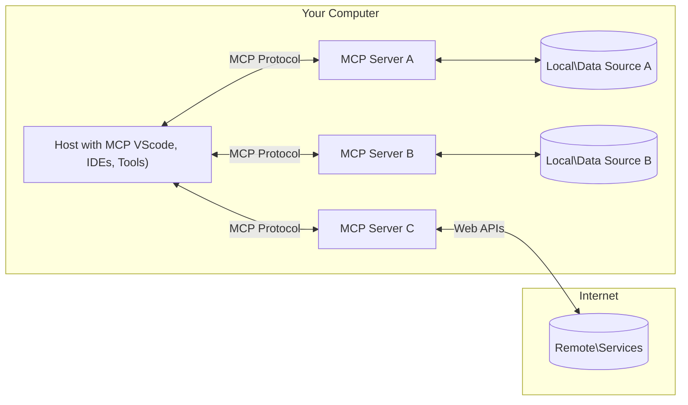

<!--
CO_OP_TRANSLATOR_METADATA:
{
  "original_hash": "355b12a5970c5c9e6db0bee970c751ba",
  "translation_date": "2025-07-04T17:21:26+00:00",
  "source_file": "01-CoreConcepts/README.md",
  "language_code": "el"
}
-->
# 📖 Βασικές Έννοιες MCP: Κατακτώντας το Model Context Protocol για Ενσωμάτωση AI

Το [Model Context Protocol (MCP)](https://github.com/modelcontextprotocol) είναι ένα ισχυρό, τυποποιημένο πλαίσιο που βελτιστοποιεί την επικοινωνία μεταξύ Μεγάλων Γλωσσικών Μοντέλων (LLMs) και εξωτερικών εργαλείων, εφαρμογών και πηγών δεδομένων. Αυτός ο οδηγός βελτιστοποιημένος για SEO θα σας καθοδηγήσει μέσα από τις βασικές έννοιες του MCP, εξασφαλίζοντας ότι κατανοείτε την αρχιτεκτονική πελάτη-διακομιστή, τα απαραίτητα συστατικά, τους μηχανισμούς επικοινωνίας και τις βέλτιστες πρακτικές υλοποίησης.

## Επισκόπηση

Αυτό το μάθημα εξερευνά την θεμελιώδη αρχιτεκτονική και τα συστατικά που απαρτίζουν το οικοσύστημα του Model Context Protocol (MCP). Θα μάθετε για την αρχιτεκτονική πελάτη-διακομιστή, τα βασικά συστατικά και τους μηχανισμούς επικοινωνίας που τροφοδοτούν τις αλληλεπιδράσεις MCP.

## 👩‍🎓 Κύριοι Στόχοι Μάθησης

Στο τέλος αυτού του μαθήματος, θα μπορείτε να:

- Κατανοείτε την αρχιτεκτονική πελάτη-διακομιστή του MCP.
- Αναγνωρίζετε τους ρόλους και τις ευθύνες των Hosts, Clients και Servers.
- Αναλύετε τα βασικά χαρακτηριστικά που καθιστούν το MCP ευέλικτο επίπεδο ενσωμάτωσης.
- Μαθαίνετε πώς ρέει η πληροφορία μέσα στο οικοσύστημα MCP.
- Αποκτάτε πρακτικές γνώσεις μέσω παραδειγμάτων κώδικα σε .NET, Java, Python και JavaScript.

## 🔎 Αρχιτεκτονική MCP: Μια Βαθύτερη Ματιά

Το οικοσύστημα MCP βασίζεται σε ένα μοντέλο πελάτη-διακομιστή. Αυτή η αρθρωτή δομή επιτρέπει στις εφαρμογές AI να αλληλεπιδρούν αποτελεσματικά με εργαλεία, βάσεις δεδομένων, APIs και πηγές συμφραζομένων. Ας αναλύσουμε αυτή την αρχιτεκτονική στα βασικά της συστατικά.

Στον πυρήνα του, το MCP ακολουθεί μια αρχιτεκτονική πελάτη-διακομιστή όπου μια εφαρμογή host μπορεί να συνδεθεί με πολλαπλούς servers:



- **MCP Hosts**: Προγράμματα όπως το VSCode, Claude Desktop, IDEs ή εργαλεία AI που θέλουν να έχουν πρόσβαση σε δεδομένα μέσω MCP
- **MCP Clients**: Πρωτοκολλικοί πελάτες που διατηρούν 1:1 συνδέσεις με servers
- **MCP Servers**: Ελαφριά προγράμματα που εκθέτουν συγκεκριμένες δυνατότητες μέσω του τυποποιημένου Model Context Protocol
- **Τοπικές Πηγές Δεδομένων**: Αρχεία, βάσεις δεδομένων και υπηρεσίες του υπολογιστή σας που οι MCP servers μπορούν να προσπελάσουν με ασφάλεια
- **Απομακρυσμένες Υπηρεσίες**: Εξωτερικά συστήματα διαθέσιμα μέσω διαδικτύου που οι MCP servers μπορούν να συνδεθούν μέσω APIs.

Το Πρωτόκολλο MCP είναι ένα εξελισσόμενο πρότυπο, μπορείτε να δείτε τις τελευταίες ενημερώσεις στη [προδιαγραφή πρωτοκόλλου](https://modelcontextprotocol.io/specification/2025-06-18/)

### 1. Hosts

Στο Model Context Protocol (MCP), οι Hosts παίζουν κρίσιμο ρόλο ως η κύρια διεπαφή μέσω της οποίας οι χρήστες αλληλεπιδρούν με το πρωτόκολλο. Οι Hosts είναι εφαρμογές ή περιβάλλοντα που ξεκινούν συνδέσεις με MCP servers για να έχουν πρόσβαση σε δεδομένα, εργαλεία και prompts. Παραδείγματα Hosts είναι ολοκληρωμένα περιβάλλοντα ανάπτυξης (IDEs) όπως το Visual Studio Code, εργαλεία AI όπως το Claude Desktop ή προσαρμοσμένοι πράκτορες σχεδιασμένοι για συγκεκριμένες εργασίες.

**Οι Hosts** είναι εφαρμογές LLM που ξεκινούν συνδέσεις. Αυτοί:

- Εκτελούν ή αλληλεπιδρούν με μοντέλα AI για να παράγουν απαντήσεις.
- Ξεκινούν συνδέσεις με MCP servers.
- Διαχειρίζονται τη ροή της συνομιλίας και το περιβάλλον χρήστη.
- Ελέγχουν τα δικαιώματα και τους περιορισμούς ασφαλείας.
- Διαχειρίζονται τη συγκατάθεση του χρήστη για κοινή χρήση δεδομένων και εκτέλεση εργαλείων.

### 2. Clients

Οι Clients είναι βασικά συστατικά που διευκολύνουν την αλληλεπίδραση μεταξύ Hosts και MCP servers. Λειτουργούν ως μεσολαβητές, επιτρέποντας στους Hosts να έχουν πρόσβαση και να χρησιμοποιούν τις λειτουργίες που παρέχουν οι MCP servers. Παίζουν κρίσιμο ρόλο στην ομαλή επικοινωνία και την αποδοτική ανταλλαγή δεδομένων μέσα στην αρχιτεκτονική MCP.

**Οι Clients** είναι συνδετήρες μέσα στην εφαρμογή host. Αυτοί:

- Στέλνουν αιτήματα στους servers με prompts/οδηγίες.
- Διαπραγματεύονται τις δυνατότητες με τους servers.
- Διαχειρίζονται αιτήματα εκτέλεσης εργαλείων από τα μοντέλα.
- Επεξεργάζονται και εμφανίζουν απαντήσεις στους χρήστες.

### 3. Servers

Οι Servers είναι υπεύθυνοι για τη διαχείριση αιτημάτων από MCP clients και την παροχή κατάλληλων απαντήσεων. Διαχειρίζονται διάφορες λειτουργίες όπως ανάκτηση δεδομένων, εκτέλεση εργαλείων και δημιουργία prompts. Οι Servers εξασφαλίζουν ότι η επικοινωνία μεταξύ clients και Hosts είναι αποδοτική και αξιόπιστη, διατηρώντας την ακεραιότητα της διαδικασίας αλληλεπίδρασης.

**Οι Servers** είναι υπηρεσίες που παρέχουν συμφραζόμενα και δυνατότητες. Αυτοί:

- Καταχωρούν διαθέσιμες λειτουργίες (πόροι, prompts, εργαλεία)
- Λαμβάνουν και εκτελούν κλήσεις εργαλείων από τον client
- Παρέχουν συμφραζόμενες πληροφορίες για να βελτιώσουν τις απαντήσεις του μοντέλου
- Επιστρέφουν αποτελέσματα πίσω στον client
- Διατηρούν κατάσταση κατά τη διάρκεια αλληλεπιδράσεων όταν χρειάζεται

Οι Servers μπορούν να αναπτυχθούν από οποιονδήποτε για να επεκτείνουν τις δυνατότητες του μοντέλου με εξειδικευμένη λειτουργικότητα.

### 4. Δυνατότητες Server

Οι Servers στο Model Context Protocol (MCP) παρέχουν θεμελιώδη δομικά στοιχεία που επιτρέπουν πλούσιες αλληλεπιδράσεις μεταξύ clients, hosts και γλωσσικών μοντέλων. Αυτές οι δυνατότητες έχουν σχεδιαστεί για να ενισχύσουν τις λειτουργίες του MCP προσφέροντας δομημένο πλαίσιο, εργαλεία και prompts.

Οι MCP servers μπορούν να προσφέρουν οποιαδήποτε από τις παρακάτω δυνατότητες:

#### 📑 Πόροι

Οι πόροι στο Model Context Protocol (MCP) περιλαμβάνουν διάφορους τύπους συμφραζομένων και δεδομένων που μπορούν να χρησιμοποιηθούν από χρήστες ή μοντέλα AI. Αυτοί περιλαμβάνουν:

- **Συμφραζόμενα Δεδομένα**: Πληροφορίες και πλαίσιο που οι χρήστες ή τα μοντέλα AI μπορούν να αξιοποιήσουν για λήψη αποφάσεων και εκτέλεση εργασιών.
- **Βάσεις Γνώσης και Αποθετήρια Εγγράφων**: Συλλογές δομημένων και αδόμητων δεδομένων, όπως άρθρα, εγχειρίδια και ερευνητικά έγγραφα, που παρέχουν πολύτιμες γνώσεις και πληροφορίες.
- **Τοπικά Αρχεία και Βάσεις Δεδομένων**: Δεδομένα αποθηκευμένα τοπικά σε συσκευές ή μέσα σε βάσεις δεδομένων, προσβάσιμα για επεξεργασία και ανάλυση.
- **APIs και Web Υπηρεσίες**: Εξωτερικά interfaces και υπηρεσίες που προσφέρουν επιπλέον δεδομένα και λειτουργίες, επιτρέποντας ενσωμάτωση με διάφορους διαδικτυακούς πόρους και εργαλεία.

Ένα παράδειγμα πόρου μπορεί να είναι ένα σχήμα βάσης δεδομένων ή ένα αρχείο που μπορεί να προσπελαστεί ως εξής:

```text
file://log.txt
database://schema
```

### 🤖 Prompts

Τα prompts στο Model Context Protocol (MCP) περιλαμβάνουν διάφορα προκαθορισμένα πρότυπα και μοτίβα αλληλεπίδρασης σχεδιασμένα να απλοποιούν τις ροές εργασίας των χρηστών και να βελτιώνουν την επικοινωνία. Αυτά περιλαμβάνουν:

- **Προτυπωμένα Μηνύματα και Ροές Εργασίας**: Προκαθορισμένα μηνύματα και διαδικασίες που καθοδηγούν τους χρήστες σε συγκεκριμένες εργασίες και αλληλεπιδράσεις.
- **Προκαθορισμένα Μοτίβα Αλληλεπίδρασης**: Τυποποιημένες ακολουθίες ενεργειών και απαντήσεων που διευκολύνουν συνεπή και αποδοτική επικοινωνία.
- **Εξειδικευμένα Πρότυπα Συνομιλίας**: Προσαρμόσιμα πρότυπα σχεδιασμένα για συγκεκριμένους τύπους συνομιλιών, εξασφαλίζοντας σχετικές και συμφραζόμενες αλληλεπιδράσεις.

Ένα πρότυπο prompt μπορεί να μοιάζει ως εξής:

```markdown
Generate a product slogan based on the following {{product}} with the following {{keywords}}
```

#### ⛏️ Εργαλεία

Τα εργαλεία στο Model Context Protocol (MCP) είναι λειτουργίες που το μοντέλο AI μπορεί να εκτελέσει για να πραγματοποιήσει συγκεκριμένες εργασίες. Αυτά τα εργαλεία έχουν σχεδιαστεί για να ενισχύσουν τις δυνατότητες του μοντέλου AI παρέχοντας δομημένες και αξιόπιστες λειτουργίες. Βασικά χαρακτηριστικά περιλαμβάνουν:

- **Λειτουργίες που το μοντέλο AI μπορεί να εκτελέσει**: Τα εργαλεία είναι εκτελέσιμες λειτουργίες που το μοντέλο AI μπορεί να καλέσει για να εκτελέσει διάφορες εργασίες.
- **Μοναδικό Όνομα και Περιγραφή**: Κάθε εργαλείο έχει ένα διακριτό όνομα και λεπτομερή περιγραφή που εξηγεί τον σκοπό και τη λειτουργικότητά του.
- **Παράμετροι και Αποτελέσματα**: Τα εργαλεία δέχονται συγκεκριμένες παραμέτρους και επιστρέφουν δομημένα αποτελέσματα, εξασφαλίζοντας συνεπή και προβλέψιμα αποτελέσματα.
- **Διακριτές Λειτουργίες**: Τα εργαλεία εκτελούν διακριτές λειτουργίες όπως αναζητήσεις στο διαδίκτυο, υπολογισμούς και ερωτήματα σε βάσεις δεδομένων.

Ένα παράδειγμα εργαλείου μπορεί να μοιάζει ως εξής:

```typescript
server.tool(
  "GetProducts",
  {
    pageSize: z.string().optional(),
    pageCount: z.string().optional()
  }, () => {
    // return results from API
  }
)
```

## Δυνατότητες Client

Στο Model Context Protocol (MCP), οι clients προσφέρουν αρκετές βασικές λειτουργίες στους servers, ενισχύοντας τη συνολική λειτουργικότητα και αλληλεπίδραση μέσα στο πρωτόκολλο. Μία από τις αξιοσημείωτες λειτουργίες είναι το Sampling.

### 👉 Sampling

- **Πράξεις με Πρωτοβουλία του Server**: Οι clients επιτρέπουν στους servers να ξεκινούν συγκεκριμένες ενέργειες ή συμπεριφορές αυτόνομα, ενισχύοντας τις δυναμικές δυνατότητες του συστήματος.
- **Αναδρομικές Αλληλεπιδράσεις LLM**: Αυτή η λειτουργία επιτρέπει αναδρομικές αλληλεπιδράσεις με μεγάλα γλωσσικά μοντέλα (LLMs), επιτρέποντας πιο σύνθετη και επαναληπτική επεξεργασία εργασιών.
- **Αίτηση για Επιπλέον Ολοκληρώσεις Μοντέλου**: Οι servers μπορούν να ζητούν επιπλέον ολοκληρώσεις από το μοντέλο, εξασφαλίζοντας ότι οι απαντήσεις είναι πλήρεις και συμφραζόμενες.

## Ροή Πληροφορίας στο MCP

Το Model Context Protocol (MCP) ορίζει μια δομημένη ροή πληροφορίας μεταξύ hosts, clients, servers και μοντέλων. Η κατανόηση αυτής της ροής βοηθά να ξεκαθαρίσει πώς επεξεργάζονται τα αιτήματα των χρηστών και πώς ενσωματώνονται εξωτερικά εργαλεία και δεδομένα στις απαντήσεις του μοντέλου.

- **Ο Host Ξεκινά τη Σύνδεση**  
  Η εφαρμογή host (όπως ένα IDE ή διεπαφή συνομιλίας) δημιουργεί σύνδεση με έναν MCP server, συνήθως μέσω STDIO, WebSocket ή άλλου υποστηριζόμενου μέσου μεταφοράς.

- **Διαπραγμάτευση Δυνατοτήτων**  
  Ο client (ενσωματωμένος στον host) και ο server ανταλλάσσουν πληροφορίες για τις υποστηριζόμενες λειτουργίες, εργαλεία, πόρους και εκδόσεις πρωτοκόλλου. Αυτό εξασφαλίζει ότι και οι δύο πλευρές κατανοούν ποιες δυνατότητες είναι διαθέσιμες για τη συνεδρία.

- **Αίτημα Χρήστη**  
  Ο χρήστης αλληλεπιδρά με τον host (π.χ. εισάγει ένα prompt ή εντολή). Ο host συλλέγει αυτή την είσοδο και την προωθεί στον client για επεξεργασία.

- **Χρήση Πόρου ή Εργαλείου**  
  - Ο client μπορεί να ζητήσει επιπλέον συμφραζόμενα ή πόρους από τον server (όπως αρχεία, εγγραφές βάσης δεδομένων ή άρθρα βάσης γνώσης) για να εμπλουτίσει την κατανόηση του μοντέλου.
  - Αν το μοντέλο κρίνει ότι χρειάζεται ένα εργαλείο (π.χ. για ανάκτηση δεδομένων, εκτέλεση υπολογισμού ή κλήση API), ο client στέλνει αίτημα εκτέλεσης εργαλείου στον server, προσδιορίζοντας το όνομα και τις παραμέτρους του εργαλείου.

- **Εκτέλεση από τον Server**  
  Ο server λαμβάνει το αίτημα για πόρο ή εργαλείο, εκτελεί τις απαραίτητες ενέργειες (όπως εκτέλεση λειτουργίας, ερώτημα σε βάση δεδομένων ή ανάκτηση αρχείου) και επιστρέφει τα αποτελέσματα στον client σε δομημένη μορφή.

- **Δημιουργία Απάντησης**  
  Ο client ενσωματώνει τις απαντήσεις του server (δεδομένα πόρων, αποτελέσματα εργαλείων κ.λπ.) στην τρέχουσα αλληλεπίδραση με το μοντέλο. Το μοντέλο χρησιμοποιεί αυτές τις πληροφορίες για να παράγει μια ολοκληρωμένη και συμφραζόμενη απάντηση.

- **Παρουσίαση Αποτελέσματος**  
  Ο host λαμβάνει το τελικό αποτέλεσμα από τον client και το παρουσιάζει στον χρήστη, συχνά περιλαμβάνοντας τόσο το κείμενο που δημιούργησε το μοντέλο όσο και τυχόν αποτελέσματα από εκτέλεση εργαλείων ή αναζητήσεις πόρων.

Αυτή η ροή επιτρέπει στο MCP να υποστηρίζει προηγμένες, διαδραστικές και συμφραζόμενες εφαρμογές AI, συνδέοντας απρόσκοπτα τα μοντέλα με εξωτερικά εργαλεία και πηγές δεδομένων.

## Λεπτομέρειες Πρωτοκόλλου

Το MCP (Model Context Protocol) βασίζεται στο [JSON-RPC 2.0](https://www.jsonrpc.org/), παρέχοντας ένα τυποποιημένο, γλωσσικά ανεξάρτητο φορμά μηνυμάτων για επικοινωνία μεταξύ hosts, clients και servers. Αυτή η βάση επιτρέπει αξιόπιστες, δομημένες και επεκτάσιμες αλληλεπιδράσεις σε διάφορες πλατφόρμες και γλώσσες προγραμματισμού.

### Κύρια Χαρακτηριστικά Πρωτοκόλλου

Το MCP επεκτείνει το JSON-RPC 2.0 με επιπλέον συμβάσεις για κλήση εργαλείων, πρόσβαση σε πόρους και διαχείριση prompts. Υποστηρίζει πολλαπλά επίπεδα μεταφοράς (STDIO, WebSocket, SSE) και επιτρέπει ασφαλή, επεκτάσιμη και γλωσσικά ανεξάρτητη επικοινωνία μεταξύ των συστατικών.

#### 🧢 Βασικό Πρωτόκολλο

- **Μορφή Μηνυμάτων JSON-RPC**: Όλα τα αιτήματα και οι απαντήσεις χρησιμοποιούν την προδιαγραφή JSON-RPC 2.0, εξασφαλίζοντας συνεπή δομή για κλήσεις μεθόδων, παραμέτρους, αποτελέσματα και δια
Το MCP περιλαμβάνει αρκετές ενσωματωμένες έννοιες και μηχανισμούς για τη διαχείριση της ασφάλειας και της εξουσιοδότησης σε όλο το πρωτόκολλο:

1. **Έλεγχος Δικαιωμάτων Εργαλείων**:  
  Οι πελάτες μπορούν να καθορίσουν ποια εργαλεία επιτρέπεται να χρησιμοποιεί ένα μοντέλο κατά τη διάρκεια μιας συνεδρίας. Αυτό διασφαλίζει ότι μόνο τα ρητά εξουσιοδοτημένα εργαλεία είναι προσβάσιμα, μειώνοντας τον κίνδυνο ανεπιθύμητων ή μη ασφαλών λειτουργιών. Τα δικαιώματα μπορούν να ρυθμιστούν δυναμικά με βάση τις προτιμήσεις του χρήστη, τις πολιτικές του οργανισμού ή το πλαίσιο της αλληλεπίδρασης.

2. **Πιστοποίηση**:  
  Οι διακομιστές μπορούν να απαιτούν πιστοποίηση πριν χορηγήσουν πρόσβαση σε εργαλεία, πόρους ή ευαίσθητες λειτουργίες. Αυτό μπορεί να περιλαμβάνει API keys, OAuth tokens ή άλλα σχήματα πιστοποίησης. Η σωστή πιστοποίηση διασφαλίζει ότι μόνο αξιόπιστοι πελάτες και χρήστες μπορούν να ενεργοποιήσουν δυνατότητες στην πλευρά του διακομιστή.

3. **Επικύρωση**:  
  Η επικύρωση παραμέτρων εφαρμόζεται σε όλες τις κλήσεις εργαλείων. Κάθε εργαλείο ορίζει τους αναμενόμενους τύπους, μορφές και περιορισμούς για τις παραμέτρους του, και ο διακομιστής επικυρώνει ανάλογα τα εισερχόμενα αιτήματα. Αυτό αποτρέπει την αποστολή κακοσχηματισμένων ή κακόβουλων δεδομένων στις υλοποιήσεις των εργαλείων και βοηθά στη διατήρηση της ακεραιότητας των λειτουργιών.

4. **Περιορισμός Ροής (Rate Limiting)**:  
  Για την αποφυγή κατάχρησης και τη διασφάλιση δίκαιης χρήσης των πόρων του διακομιστή, οι MCP διακομιστές μπορούν να εφαρμόσουν περιορισμούς στη συχνότητα κλήσεων εργαλείων και πρόσβασης σε πόρους. Οι περιορισμοί μπορούν να ισχύουν ανά χρήστη, ανά συνεδρία ή παγκοσμίως, και βοηθούν στην προστασία από επιθέσεις άρνησης υπηρεσίας ή υπερβολική κατανάλωση πόρων.

Συνδυάζοντας αυτούς τους μηχανισμούς, το MCP παρέχει μια ασφαλή βάση για την ενσωμάτωση γλωσσικών μοντέλων με εξωτερικά εργαλεία και πηγές δεδομένων, ενώ δίνει στους χρήστες και τους προγραμματιστές λεπτομερή έλεγχο στην πρόσβαση και τη χρήση.

## Μηνύματα Πρωτοκόλλου

Η επικοινωνία MCP χρησιμοποιεί δομημένα μηνύματα JSON για να διευκολύνει σαφείς και αξιόπιστες αλληλεπιδράσεις μεταξύ πελατών, διακομιστών και μοντέλων. Οι βασικοί τύποι μηνυμάτων περιλαμβάνουν:

- **Αίτημα Πελάτη**  
  Αποστέλλεται από τον πελάτη προς τον διακομιστή και συνήθως περιλαμβάνει:
  - Την εντολή ή το prompt του χρήστη
  - Το ιστορικό συνομιλίας για το πλαίσιο
  - Τη ρύθμιση και τα δικαιώματα των εργαλείων
  - Οποιαδήποτε επιπλέον μεταδεδομένα ή πληροφορίες συνεδρίας

- **Απάντηση Μοντέλου**  
  Επιστρέφεται από το μοντέλο (μέσω του πελάτη) και περιέχει:
  - Παραγόμενο κείμενο ή ολοκλήρωση βάσει του prompt και του πλαισίου
  - Προαιρετικές οδηγίες κλήσης εργαλείου αν το μοντέλο κρίνει ότι πρέπει να ενεργοποιηθεί κάποιο εργαλείο
  - Αναφορές σε πόρους ή επιπλέον πλαίσιο αν χρειάζεται

- **Αίτημα Εργαλείου**  
  Αποστέλλεται από τον πελάτη προς τον διακομιστή όταν πρέπει να εκτελεστεί ένα εργαλείο. Το μήνυμα περιλαμβάνει:
  - Το όνομα του εργαλείου που θα κληθεί
  - Τις παραμέτρους που απαιτεί το εργαλείο (επικυρωμένες σύμφωνα με το σχήμα του εργαλείου)
  - Πληροφορίες πλαισίου ή αναγνωριστικά για την παρακολούθηση του αιτήματος

- **Απάντηση Εργαλείου**  
  Επιστρέφεται από τον διακομιστή μετά την εκτέλεση του εργαλείου. Το μήνυμα παρέχει:
  - Τα αποτελέσματα της εκτέλεσης του εργαλείου (δομημένα δεδομένα ή περιεχόμενο)
  - Οποιαδήποτε σφάλματα ή πληροφορίες κατάστασης αν η κλήση του εργαλείου απέτυχε
  - Προαιρετικά, επιπλέον μεταδεδομένα ή αρχεία καταγραφής σχετικά με την εκτέλεση

Αυτά τα δομημένα μηνύματα διασφαλίζουν ότι κάθε βήμα στη ροή εργασίας MCP είναι σαφές, ιχνηλάσιμο και επεκτάσιμο, υποστηρίζοντας προηγμένα σενάρια όπως πολυγλωσσικές συνομιλίες, αλυσιδωτές κλήσεις εργαλείων και αξιόπιστη διαχείριση σφαλμάτων.

## Βασικά Συμπεράσματα

- Το MCP χρησιμοποιεί αρχιτεκτονική πελάτη-διακομιστή για να συνδέει μοντέλα με εξωτερικές δυνατότητες
- Το οικοσύστημα αποτελείται από πελάτες, hosts, διακομιστές, εργαλεία και πηγές δεδομένων
- Η επικοινωνία μπορεί να γίνει μέσω STDIO, SSE ή WebSockets
- Τα εργαλεία είναι οι βασικές μονάδες λειτουργικότητας που εκτίθενται στα μοντέλα
- Τα δομημένα πρωτόκολλα επικοινωνίας εξασφαλίζουν συνεπείς αλληλεπιδράσεις

## Άσκηση

Σχεδίασε ένα απλό εργαλείο MCP που θα ήταν χρήσιμο στον τομέα σου. Ορίστε:
1. Πώς θα ονομαζόταν το εργαλείο
2. Ποιες παραμέτρους θα δεχόταν
3. Τι είδους έξοδο θα επέστρεφε
4. Πώς ένα μοντέλο θα μπορούσε να χρησιμοποιήσει αυτό το εργαλείο για να λύσει προβλήματα χρηστών


---

## Τι ακολουθεί

Επόμενο: [Κεφάλαιο 2: Ασφάλεια](../02-Security/README.md)

**Αποποίηση ευθυνών**:  
Αυτό το έγγραφο έχει μεταφραστεί χρησιμοποιώντας την υπηρεσία αυτόματης μετάφρασης AI [Co-op Translator](https://github.com/Azure/co-op-translator). Παρόλο που επιδιώκουμε την ακρίβεια, παρακαλούμε να έχετε υπόψη ότι οι αυτόματες μεταφράσεις ενδέχεται να περιέχουν λάθη ή ανακρίβειες. Το πρωτότυπο έγγραφο στη γλώσσα του θεωρείται η αυθεντική πηγή. Για κρίσιμες πληροφορίες, συνιστάται επαγγελματική ανθρώπινη μετάφραση. Δεν φέρουμε ευθύνη για τυχόν παρεξηγήσεις ή λανθασμένες ερμηνείες που προκύπτουν από τη χρήση αυτής της μετάφρασης.