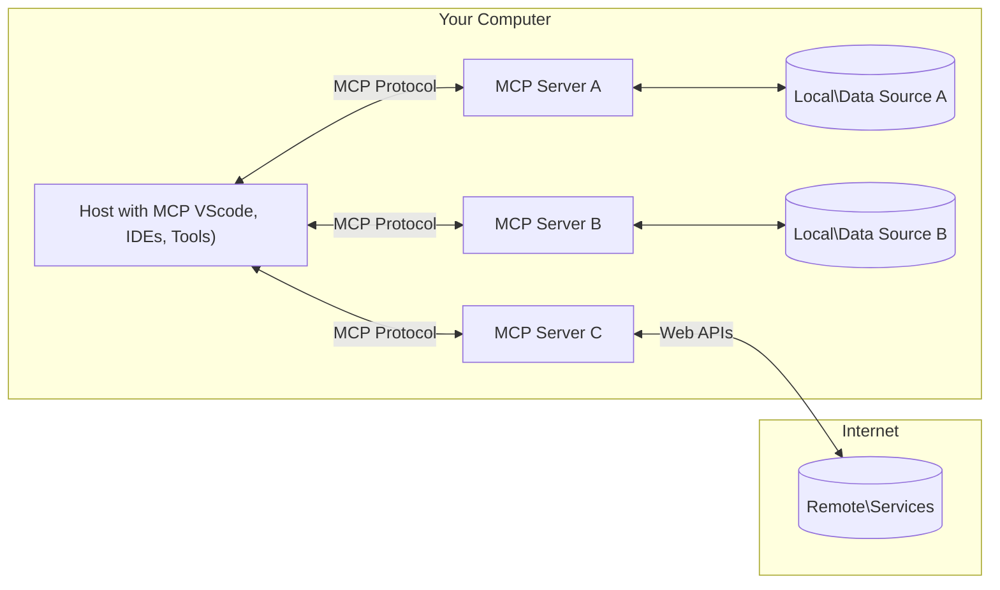

<!--
CO_OP_TRANSLATOR_METADATA:
{
  "original_hash": "b3b4a6ad10c3c0edbf7fa7cfa0ec496b",
  "translation_date": "2025-07-02T07:14:50+00:00",
  "source_file": "01-CoreConcepts/README.md",
  "language_code": "el"
}
-->
# 📖 Βασικές Έννοιες MCP: Κατακτώντας το Model Context Protocol για Ενσωμάτωση AI

Το [Model Context Protocol (MCP)](https://github.com/modelcontextprotocol) είναι ένα ισχυρό, τυποποιημένο πλαίσιο που βελτιστοποιεί την επικοινωνία μεταξύ Μεγάλων Γλωσσικών Μοντέλων (LLMs) και εξωτερικών εργαλείων, εφαρμογών και πηγών δεδομένων. Αυτός ο οδηγός βελτιστοποιημένος για SEO θα σας καθοδηγήσει μέσα από τις βασικές έννοιες του MCP, εξασφαλίζοντας ότι κατανοείτε την αρχιτεκτονική πελάτη-διακομιστή, τα ουσιώδη στοιχεία, τους μηχανισμούς επικοινωνίας και τις βέλτιστες πρακτικές υλοποίησης.

## Επισκόπηση

Το μάθημα αυτό εξερευνά τη θεμελιώδη αρχιτεκτονική και τα στοιχεία που απαρτίζουν το οικοσύστημα του Model Context Protocol (MCP). Θα μάθετε για την αρχιτεκτονική πελάτη-διακομιστή, τα βασικά στοιχεία και τους μηχανισμούς επικοινωνίας που τροφοδοτούν τις αλληλεπιδράσεις MCP.

## 👩‍🎓 Κύριοι Στόχοι Μάθησης

Στο τέλος αυτού του μαθήματος, θα μπορείτε να:

- Κατανοήσετε την αρχιτεκτονική πελάτη-διακομιστή του MCP.
- Αναγνωρίζετε ρόλους και ευθύνες των Hosts, Clients και Servers.
- Αναλύετε τα βασικά χαρακτηριστικά που κάνουν το MCP ευέλικτο επίπεδο ενσωμάτωσης.
- Μαθαίνετε πώς ρέει η πληροφορία μέσα στο οικοσύστημα MCP.
- Αποκτάτε πρακτικές γνώσεις μέσω παραδειγμάτων κώδικα σε .NET, Java, Python και JavaScript.

## 🔎 Αρχιτεκτονική MCP: Μια Βαθύτερη Ματιά

Το οικοσύστημα MCP βασίζεται σε μοντέλο πελάτη-διακομιστή. Αυτή η αρθρωτή δομή επιτρέπει στις εφαρμογές AI να αλληλεπιδρούν αποδοτικά με εργαλεία, βάσεις δεδομένων, APIs και πηγές περιεχομένου. Ας αναλύσουμε αυτή την αρχιτεκτονική στα βασικά της στοιχεία.

Στον πυρήνα του, το MCP ακολουθεί αρχιτεκτονική πελάτη-διακομιστή όπου μια εφαρμογή host μπορεί να συνδεθεί με πολλαπλούς διακομιστές:



- **MCP Hosts**: Προγράμματα όπως το VSCode, Claude Desktop, IDEs ή εργαλεία AI που θέλουν να έχουν πρόσβαση σε δεδομένα μέσω MCP
- **MCP Clients**: Πρωτοκολλικοί πελάτες που διατηρούν 1:1 συνδέσεις με διακομιστές
- **MCP Servers**: Ελαφριά προγράμματα που εκθέτουν συγκεκριμένες δυνατότητες μέσω του τυποποιημένου Model Context Protocol
- **Τοπικές Πηγές Δεδομένων**: Τα αρχεία, οι βάσεις δεδομένων και οι υπηρεσίες του υπολογιστή σας που οι MCP servers μπορούν να προσπελάσουν με ασφάλεια
- **Απομακρυσμένες Υπηρεσίες**: Εξωτερικά συστήματα διαθέσιμα μέσω internet που οι MCP servers μπορούν να συνδεθούν μέσω APIs.

Το Πρωτόκολλο MCP είναι ένα εξελισσόμενο πρότυπο, μπορείτε να δείτε τις πιο πρόσφατες ενημερώσεις στη [προδιαγραφή πρωτοκόλλου](https://modelcontextprotocol.io/specification/2025-06-18/)

### 1. Hosts

Στο Model Context Protocol (MCP), οι Hosts παίζουν κρίσιμο ρόλο ως η κύρια διεπαφή μέσω της οποίας οι χρήστες αλληλεπιδρούν με το πρωτόκολλο. Οι Hosts είναι εφαρμογές ή περιβάλλοντα που ξεκινούν συνδέσεις με MCP servers για να έχουν πρόσβαση σε δεδομένα, εργαλεία και προτροπές. Παραδείγματα Hosts περιλαμβάνουν ενσωματωμένα περιβάλλοντα ανάπτυξης (IDEs) όπως το Visual Studio Code, εργαλεία AI όπως το Claude Desktop ή ειδικά κατασκευασμένους πράκτορες για συγκεκριμένες εργασίες.

**Οι Hosts** είναι εφαρμογές LLM που ξεκινούν συνδέσεις. Αυτοί:

- Εκτελούν ή αλληλεπιδρούν με μοντέλα AI για να παράγουν απαντήσεις.
- Ξεκινούν συνδέσεις με MCP servers.
- Διαχειρίζονται τη ροή της συνομιλίας και το περιβάλλον χρήστη.
- Ελέγχουν τα δικαιώματα και τους περιορισμούς ασφαλείας.
- Διαχειρίζονται τη συγκατάθεση του χρήστη για κοινή χρήση δεδομένων και εκτέλεση εργαλείων.

### 2. Clients

Οι Clients είναι βασικά στοιχεία που διευκολύνουν την αλληλεπίδραση μεταξύ Hosts και MCP servers. Λειτουργούν ως μεσολαβητές, επιτρέποντας στους Hosts να έχουν πρόσβαση και να χρησιμοποιούν τις λειτουργίες που παρέχουν οι MCP servers. Παίζουν κρίσιμο ρόλο στην εξασφάλιση ομαλής επικοινωνίας και αποδοτικής ανταλλαγής δεδομένων μέσα στην αρχιτεκτονική MCP.

**Οι Clients** είναι συνδετήρες μέσα στην εφαρμογή host. Αυτοί:

- Στέλνουν αιτήματα στους διακομιστές με προτροπές/οδηγίες.
- Διαπραγματεύονται τις δυνατότητες με τους διακομιστές.
- Διαχειρίζονται αιτήματα εκτέλεσης εργαλείων από τα μοντέλα.
- Επεξεργάζονται και εμφανίζουν τις απαντήσεις στους χρήστες.

### 3. Servers

Οι Servers είναι υπεύθυνοι για τη διαχείριση των αιτημάτων από MCP clients και την παροχή κατάλληλων απαντήσεων. Διαχειρίζονται διάφορες λειτουργίες όπως ανάκτηση δεδομένων, εκτέλεση εργαλείων και δημιουργία προτροπών. Οι Servers διασφαλίζουν ότι η επικοινωνία μεταξύ clients και Hosts είναι αποδοτική και αξιόπιστη, διατηρώντας την ακεραιότητα της διαδικασίας αλληλεπίδρασης.

**Οι Servers** είναι υπηρεσίες που παρέχουν πλαίσιο και δυνατότητες. Αυτοί:

- Καταχωρούν διαθέσιμες λειτουργίες (πόροι, προτροπές, εργαλεία)
- Λαμβάνουν και εκτελούν κλήσεις εργαλείων από τον client
- Παρέχουν περιβάλλον πληροφοριών για να ενισχύσουν τις απαντήσεις του μοντέλου
- Επιστρέφουν τα αποτελέσματα πίσω στον client
- Διατηρούν κατάσταση ανάμεσα σε αλληλεπιδράσεις όταν απαιτείται

Οι Servers μπορούν να αναπτυχθούν από οποιονδήποτε για να επεκτείνουν τις δυνατότητες του μοντέλου με εξειδικευμένες λειτουργίες.

### 4. Δυνατότητες Server

Οι Servers στο Model Context Protocol (MCP) παρέχουν βασικά δομικά στοιχεία που επιτρέπουν πλούσιες αλληλεπιδράσεις μεταξύ clients, hosts και γλωσσικών μοντέλων. Αυτές οι δυνατότητες έχουν σχεδιαστεί για να ενισχύουν τις δυνατότητες του MCP προσφέροντας δομημένο πλαίσιο, εργαλεία και προτροπές.

Οι MCP servers μπορούν να προσφέρουν οποιαδήποτε από τις ακόλουθες δυνατότητες:

#### 📑 Πόροι

Οι Πόροι στο Model Context Protocol (MCP) περιλαμβάνουν διάφορους τύπους πλαισίου και δεδομένων που μπορούν να αξιοποιηθούν από χρήστες ή μοντέλα AI. Αυτοί περιλαμβάνουν:

- **Πλαίσιο και Δεδομένα**: Πληροφορίες και περιεχόμενο που οι χρήστες ή τα μοντέλα AI μπορούν να χρησιμοποιήσουν για λήψη αποφάσεων και εκτέλεση εργασιών.
- **Βάσεις Γνώσης και Αποθετήρια Εγγράφων**: Συλλογές δομημένων και αδόμητων δεδομένων, όπως άρθρα, εγχειρίδια και ερευνητικές εργασίες, που παρέχουν πολύτιμες γνώσεις και πληροφορίες.
- **Τοπικά Αρχεία και Βάσεις Δεδομένων**: Δεδομένα αποθηκευμένα τοπικά σε συσκευές ή μέσα σε βάσεις δεδομένων, προσβάσιμα για επεξεργασία και ανάλυση.
- **APIs και Διαδικτυακές Υπηρεσίες**: Εξωτερικά interfaces και υπηρεσίες που προσφέρουν επιπλέον δεδομένα και λειτουργίες, επιτρέποντας ενσωμάτωση με διάφορους διαδικτυακούς πόρους και εργαλεία.

Ένα παράδειγμα πόρου μπορεί να είναι ένα σχήμα βάσης δεδομένων ή ένα αρχείο που μπορεί να προσπελαστεί ως εξής:

```text
file://log.txt
database://schema
```

### 🤖 Προτροπές

Οι Προτροπές στο Model Context Protocol (MCP) περιλαμβάνουν διάφορα προκαθορισμένα πρότυπα και μοτίβα αλληλεπίδρασης σχεδιασμένα να απλοποιούν τις ροές εργασίας των χρηστών και να βελτιώνουν την επικοινωνία. Αυτά περιλαμβάνουν:

- **Προτυποποιημένα Μηνύματα και Ροές Εργασίας**: Προκαθορισμένα μηνύματα και διαδικασίες που καθοδηγούν τους χρήστες σε συγκεκριμένες εργασίες και αλληλεπιδράσεις.
- **Προκαθορισμένα Μοτίβα Αλληλεπίδρασης**: Τυποποιημένες ακολουθίες ενεργειών και απαντήσεων που διευκολύνουν συνεπή και αποδοτική επικοινωνία.
- **Εξειδικευμένα Πρότυπα Συνομιλίας**: Προσαρμόσιμα πρότυπα σχεδιασμένα για συγκεκριμένους τύπους συνομιλιών, εξασφαλίζοντας σχετικές και συμφραζόμενες αλληλεπιδράσεις.

Ένα πρότυπο προτροπής μπορεί να μοιάζει ως εξής:

```markdown
Generate a product slogan based on the following {{product}} with the following {{keywords}}
```

#### ⛏️ Εργαλεία

Τα Εργαλεία στο Model Context Protocol (MCP) είναι λειτουργίες που το μοντέλο AI μπορεί να εκτελέσει για να πραγματοποιήσει συγκεκριμένες εργασίες. Αυτά τα εργαλεία έχουν σχεδιαστεί για να ενισχύουν τις δυνατότητες του μοντέλου παρέχοντας δομημένες και αξιόπιστες λειτουργίες. Βασικά χαρακτηριστικά περιλαμβάνουν:

- **Λειτουργίες για εκτέλεση από το μοντέλο AI**: Τα εργαλεία είναι εκτελέσιμες λειτουργίες που το μοντέλο AI μπορεί να καλέσει για να εκτελέσει διάφορες εργασίες.
- **Μοναδικό Όνομα και Περιγραφή**: Κάθε εργαλείο έχει ένα διακριτό όνομα και λεπτομερή περιγραφή που εξηγεί τον σκοπό και τη λειτουργικότητά του.
- **Παράμετροι και Αποτελέσματα**: Τα εργαλεία δέχονται συγκεκριμένες παραμέτρους και επιστρέφουν δομημένα αποτελέσματα, εξασφαλίζοντας συνεπή και προβλέψιμα αποτελέσματα.
- **Διακριτές Λειτουργίες**: Τα εργαλεία εκτελούν διακριτές λειτουργίες όπως αναζητήσεις στο διαδίκτυο, υπολογισμούς και ερωτήματα σε βάσεις δεδομένων.

Ένα παράδειγμα εργαλείου μπορεί να μοιάζει ως εξής:

```typescript
server.tool(
  "GetProducts",
  {
    pageSize: z.string().optional(),
    pageCount: z.string().optional()
  }, () => {
    // return results from API
  }
)
```

## Δυνατότητες Client

Στο Model Context Protocol (MCP), οι clients προσφέρουν αρκετές βασικές λειτουργίες προς τους servers, ενισχύοντας τη συνολική λειτουργικότητα και αλληλεπίδραση εντός του πρωτοκόλλου. Μία από τις σημαντικές λειτουργίες είναι το Sampling.

### 👉 Sampling

- **Πράξεις που Ξεκινούν οι Servers με Αυτονομία**: Οι clients επιτρέπουν στους servers να ξεκινούν συγκεκριμένες ενέργειες ή συμπεριφορές αυτόνομα, ενισχύοντας τις δυναμικές δυνατότητες του συστήματος.
- **Αναδρομικές Αλληλεπιδράσεις με LLMs**: Αυτή η λειτουργία επιτρέπει αναδρομικές αλληλεπιδράσεις με μεγάλα γλωσσικά μοντέλα (LLMs), επιτρέποντας πιο σύνθετη και επαναληπτική επεξεργασία εργασιών.
- **Αίτηση για Πρόσθετες Ολοκληρώσεις Μοντέλου**: Οι servers μπορούν να ζητούν επιπλέον ολοκληρώσεις από το μοντέλο, διασφαλίζοντας ότι οι απαντήσεις είναι πλήρεις και συμφραζόμενα σχετικές.

## Ροή Πληροφορίας στο MCP

Το Model Context Protocol (MCP) ορίζει μια δομημένη ροή πληροφορίας μεταξύ hosts, clients, servers και μοντέλων. Η κατανόηση αυτής της ροής βοηθά να διευκρινιστεί πώς επεξεργάζονται τα αιτήματα των χρηστών και πώς ενσωματώνονται εξωτερικά εργαλεία και δεδομένα στις απαντήσεις των μοντέλων.

- **Το Host Ξεκινά τη Σύνδεση**  
  Η εφαρμογή host (όπως ένα IDE ή διεπαφή συνομιλίας) δημιουργεί σύνδεση με MCP server, συνήθως μέσω STDIO, WebSocket ή άλλου υποστηριζόμενου μέσου μεταφοράς.

- **Διαπραγμάτευση Δυνατοτήτων**  
  Ο client (ενσωματωμένος στο host) και ο server ανταλλάσσουν πληροφορίες σχετικά με τις υποστηριζόμενες λειτουργίες, εργαλεία, πόρους και εκδόσεις πρωτοκόλλου. Αυτό εξασφαλίζει ότι και οι δύο πλευρές κατανοούν τις διαθέσιμες δυνατότητες για τη συνεδρία.

- **Αίτημα Χρήστη**  
  Ο χρήστης αλληλεπιδρά με το host (π.χ. εισάγει προτροπή ή εντολή). Το host συλλέγει αυτή την είσοδο και τη μεταβιβάζει στον client για επεξεργασία.

- **Χρήση Πόρου ή Εργαλείου**  
  - Ο client μπορεί να ζητήσει επιπλέον πλαίσιο ή πόρους από τον server (όπως αρχεία, εγγραφές βάσης δεδομένων ή άρθρα βάσης γνώσης) για να εμπλουτίσει την κατανόηση του μοντέλου.
  - Αν το μοντέλο κρίνει ότι απαιτείται εργαλείο (π.χ. για ανάκτηση δεδομένων, υπολογισμό ή κλήση API), ο client στέλνει αίτημα εκτέλεσης εργαλείου στον server, καθορίζοντας το όνομα του εργαλείου και τις παραμέτρους.

- **Εκτέλεση από τον Server**  
  Ο server λαμβάνει το αίτημα για πόρο ή εργαλείο, εκτελεί τις απαραίτητες ενέργειες (όπως εκτέλεση λειτουργίας, ερώτημα σε βάση δεδομένων ή ανάκτηση αρχείου) και επιστρέφει τα αποτελέσματα στον client σε δομημένη μορφή.

- **Δημιουργία Απάντησης**  
  Ο client ενσωματώνει τις απαντήσεις του server (δεδομένα πόρων, αποτελέσματα εργαλείων κ.λπ.) στην τρέχουσα αλληλεπίδραση με το μοντέλο. Το μοντέλο χρησιμοποιεί αυτές τις πληροφορίες για να παράγει μια ολοκληρωμένη και συμφραζόμενα σχετική απάντηση.

- **Παρουσίαση Αποτελέσματος**  
  Το host λαμβάνει το τελικό αποτέλεσμα από τον client και το παρουσιάζει στον χρήστη, συχνά περιλαμβάνοντας τόσο το κείμενο που δημιούργησε το μοντέλο όσο και οποιαδήποτε αποτελέσματα από εκτέλεση εργαλείων ή αναζητήσεις πόρων.

Αυτή η ροή επιτρέπει στο MCP να υποστηρίζει προηγμένες, διαδραστικές και συμφραζόμενες εφαρμογές AI, συνδέοντας αβίαστα τα μοντέλα με εξωτερικά εργαλεία και πηγές δεδομένων.

## Λεπτομέρειες Πρωτοκόλλου

Το MCP (Model Context Protocol) βασίζεται στο [JSON-RPC 2.0](https://www.jsonrpc.org/), παρέχοντας ένα τυποποιημένο, ανεξάρτητο γλώσσας φορμά μηνυμάτων για την επικοινωνία μεταξύ hosts, clients και servers. Αυτή η βάση επιτρέπει αξιόπιστες, δομημένες και επεκτάσιμες αλληλεπιδράσεις σε διάφορες πλατφόρμες και γλώσσες προγραμματισμού.

### Κύρια Χαρακτηριστικά Πρωτοκόλλου

Το MCP επεκτείνει το JSON-RPC 2.0 με επιπλέον συμβάσεις για κλήσεις εργαλείων, πρόσβαση σε πόρους και διαχείριση προτροπών. Υποστηρίζει πολλαπλά στρώματα μεταφοράς (STDIO, WebSocket, SSE) και επιτρέπει ασφαλή, επεκτάσιμη και ανεξάρτητη γλώσσας επικοινωνία μεταξύ των στοιχείων.

#### 🧢 Βασικό Πρωτόκολλο

- **Μορφή Μηνυμάτων JSON-RPC**: Όλα τα αιτήματα και οι απαντήσεις χρησιμοποιούν

**Αποποίηση Ευθυνών**:  
Αυτό το έγγραφο έχει μεταφραστεί χρησιμοποιώντας την υπηρεσία μετάφρασης AI [Co-op Translator](https://github.com/Azure/co-op-translator). Παρόλο που επιδιώκουμε την ακρίβεια, παρακαλούμε να έχετε υπόψη ότι οι αυτοματοποιημένες μεταφράσεις ενδέχεται να περιέχουν λάθη ή ανακρίβειες. Το πρωτότυπο έγγραφο στη μητρική του γλώσσα πρέπει να θεωρείται η αυθεντική πηγή. Για κρίσιμες πληροφορίες, συνιστάται επαγγελματική ανθρώπινη μετάφραση. Δεν φέρουμε ευθύνη για τυχόν παρεξηγήσεις ή λανθασμένες ερμηνείες που προκύπτουν από τη χρήση αυτής της μετάφρασης.