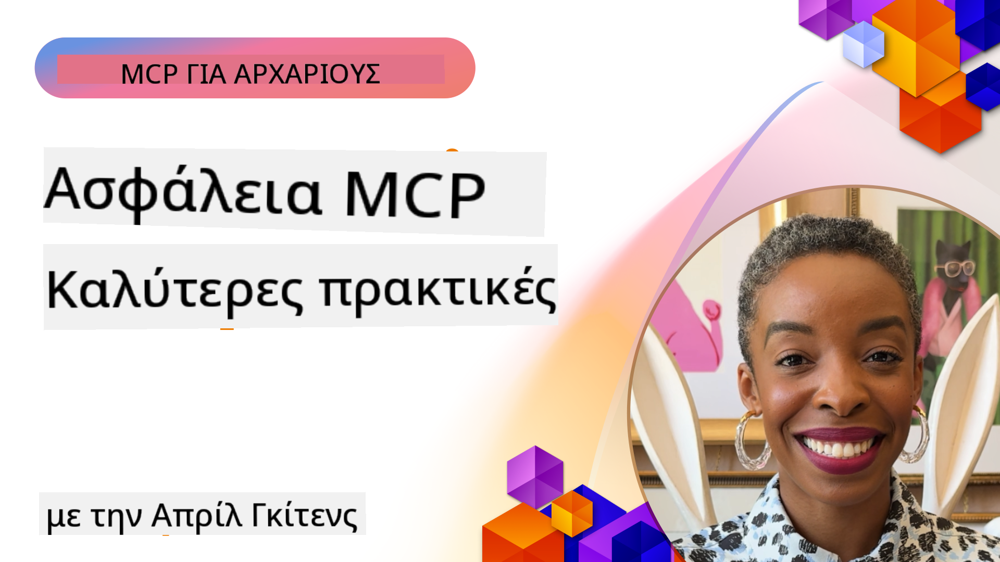

<!--
CO_OP_TRANSLATOR_METADATA:
{
  "original_hash": "1c767a35642f753127dc08545c25a290",
  "translation_date": "2025-08-18T13:48:33+00:00",
  "source_file": "02-Security/README.md",
  "language_code": "el"
}
-->
# MCP Ασφάλεια: Ολοκληρωμένη Προστασία για Συστήματα Τεχνητής Νοημοσύνης

_(Κάντε κλικ στην παραπάνω εικόνα για να παρακολουθήσετε το βίντεο αυτού του μαθήματος)_

Η ασφάλεια είναι θεμελιώδης για τον σχεδιασμό συστημάτων Τεχνητής Νοημοσύνης, γι' αυτό την τοποθετούμε ως τη δεύτερη ενότητα. Αυτό ευθυγραμμίζεται με την αρχή της Microsoft **Secure by Design** από την [Πρωτοβουλία Ασφαλούς Μέλλοντος](https://www.microsoft.com/security/blog/2025/04/17/microsofts-secure-by-design-journey-one-year-of-success/).

Το Model Context Protocol (MCP) προσφέρει ισχυρές νέες δυνατότητες για εφαρμογές που βασίζονται στην Τεχνητή Νοημοσύνη, ενώ παράλληλα εισάγει μοναδικές προκλήσεις ασφάλειας που υπερβαίνουν τους παραδοσιακούς κινδύνους λογισμικού. Τα συστήματα MCP αντιμετωπίζουν τόσο καθιερωμένες ανησυχίες ασφάλειας (ασφαλής κωδικοποίηση, ελάχιστα προνόμια, ασφάλεια εφοδιαστικής αλυσίδας) όσο και νέες απειλές που σχετίζονται με την Τεχνητή Νοημοσύνη, όπως injection εντολών, δηλητηρίαση εργαλείων, υποκλοπή συνεδριών, επιθέσεις confused deputy, ευπάθειες token passthrough και δυναμική τροποποίηση δυνατοτήτων.

Αυτό το μάθημα εξετάζει τους πιο κρίσιμους κινδύνους ασφάλειας στις υλοποιήσεις MCP—καλύπτοντας την αυθεντικοποίηση, την εξουσιοδότηση, τα υπερβολικά προνόμια, το έμμεσο injection εντολών, την ασφάλεια συνεδριών, τα προβλήματα confused deputy, τη διαχείριση token και τις ευπάθειες εφοδιαστικής αλυσίδας. Θα μάθετε πρακτικούς ελέγχους και βέλτιστες πρακτικές για την αντιμετώπιση αυτών των κινδύνων, αξιοποιώντας λύσεις της Microsoft όπως τα Prompt Shields, το Azure Content Safety και το GitHub Advanced Security για την ενίσχυση της ανάπτυξης MCP.

## Στόχοι Μάθησης

Μέχρι το τέλος αυτού του μαθήματος, θα μπορείτε να:

- **Αναγνωρίζετε Απειλές Ειδικές για MCP**: Εντοπίζετε μοναδικούς κινδύνους ασφάλειας στα συστήματα MCP, όπως injection εντολών, δηλητηρίαση εργαλείων, υπερβολικά προνόμια, υποκλοπή συνεδριών, προβλήματα confused deputy, ευπάθειες token passthrough και κινδύνους εφοδιαστικής αλυσίδας
- **Εφαρμόζετε Ελέγχους Ασφάλειας**: Υλοποιείτε αποτελεσματικά μέτρα, όπως ισχυρή αυθεντικοποίηση, πρόσβαση με ελάχιστα προνόμια, ασφαλή διαχείριση token, ελέγχους ασφάλειας συνεδριών και επαλήθευση εφοδιαστικής αλυσίδας
- **Αξιοποιείτε Λύσεις Ασφάλειας της Microsoft**: Κατανοείτε και εφαρμόζετε τα Microsoft Prompt Shields, Azure Content Safety και GitHub Advanced Security για την προστασία φορτίων MCP
- **Επικυρώνετε την Ασφάλεια Εργαλείων**: Αναγνωρίζετε τη σημασία της επικύρωσης μεταδεδομένων εργαλείων, της παρακολούθησης δυναμικών αλλαγών και της άμυνας κατά των έμμεσων επιθέσεων injection εντολών
- **Ενσωματώνετε Βέλτιστες Πρακτικές**: Συνδυάζετε καθιερωμένες αρχές ασφάλειας (ασφαλής κωδικοποίηση, σκλήρυνση διακομιστών, μηδενική εμπιστοσύνη) με ελέγχους ειδικούς για MCP για ολοκληρωμένη προστασία

# Αρχιτεκτονική & Έλεγχοι Ασφάλειας MCP

Οι σύγχρονες υλοποιήσεις MCP απαιτούν πολυεπίπεδες προσεγγίσεις ασφάλειας που αντιμετωπίζουν τόσο τις παραδοσιακές απειλές λογισμικού όσο και τις απειλές που σχετίζονται με την Τεχνητή Νοημοσύνη. Η ταχέως εξελισσόμενη προδιαγραφή MCP συνεχίζει να βελτιώνει τους ελέγχους ασφάλειας, επιτρέποντας καλύτερη ενσωμάτωση με αρχιτεκτονικές ασφάλειας επιχειρήσεων και καθιερωμένες βέλτιστες πρακτικές.

Έρευνα από την [Έκθεση Ψηφιακής Άμυνας της Microsoft](https://aka.ms/mddr) δείχνει ότι **το 98% των αναφερόμενων παραβιάσεων θα μπορούσαν να είχαν αποφευχθεί με ισχυρή υγιεινή ασφάλειας**. Η πιο αποτελεσματική στρατηγική προστασίας συνδυάζει θεμελιώδεις πρακτικές ασφάλειας με ελέγχους ειδικούς για MCP—οι αποδεδειγμένες βασικές πρακτικές ασφάλειας παραμένουν οι πιο σημαντικές για τη μείωση του συνολικού κινδύνου ασφάλειας.

## Τρέχον Τοπίο Ασφάλειας

> **Σημείωση:** Αυτές οι πληροφορίες αντικατοπτρίζουν τα πρότυπα ασφάλειας MCP από **18 Αυγούστου 2025**. Το πρωτόκολλο MCP συνεχίζει να εξελίσσεται γρήγορα, και μελλοντικές υλοποιήσεις μπορεί να εισάγουν νέα μοτίβα αυθεντικοποίησης και βελτιωμένους ελέγχους. Ανατρέχετε πάντα στην τρέχουσα [Προδιαγραφή MCP](https://spec.modelcontextprotocol.io/), [αποθετήριο MCP στο GitHub](https://github.com/modelcontextprotocol) και [τεκμηρίωση βέλτιστων πρακτικών ασφάλειας](https://modelcontextprotocol.io/specification/2025-06-18/basic/security_best_practices) για τις πιο πρόσφατες οδηγίες.

### Εξέλιξη της Αυθεντικοποίησης MCP

Η προδιαγραφή MCP έχει εξελιχθεί σημαντικά στην προσέγγισή της για την αυθεντικοποίηση και την εξουσιοδότηση:

- **Αρχική Προσέγγιση**: Οι πρώτες προδιαγραφές απαιτούσαν από τους προγραμματιστές να υλοποιούν προσαρμοσμένους διακομιστές αυθεντικοποίησης, με τους διακομιστές MCP να λειτουργούν ως OAuth 2.0 Authorization Servers που διαχειρίζονται την αυθεντικοποίηση χρηστών απευθείας
- **Τρέχον Πρότυπο (2025-06-18)**: Η ενημερωμένη προδιαγραφή επιτρέπει στους διακομιστές MCP να αναθέτουν την αυθεντικοποίηση σε εξωτερικούς παρόχους ταυτότητας (όπως το Microsoft Entra ID), βελτιώνοντας τη στάση ασφάλειας και μειώνοντας την πολυπλοκότητα υλοποίησης
- **Ασφάλεια Στρώματος Μεταφοράς**: Ενισχυμένη υποστήριξη για ασφαλείς μηχανισμούς μεταφοράς με κατάλληλα μοτίβα αυθεντικοποίησης για τοπικές (STDIO) και απομακρυσμένες (Streamable HTTP) συνδέσεις

## Ασφάλεια Αυθεντικοποίησης & Εξουσιοδότησης

### Τρέχουσες Προκλήσεις Ασφάλειας

Οι σύγχρονες υλοποιήσεις MCP αντιμετωπίζουν αρκετές προκλήσεις αυθεντικοποίησης και εξουσιοδότησης:

### Κίνδυνοι & Διαδρομές Απειλών

- **Εσφαλμένη Λογική Εξουσιοδότησης**: Ελαττωματική υλοποίηση εξουσιοδότησης στους διακομιστές MCP μπορεί να εκθέσει ευαίσθητα δεδομένα και να εφαρμόσει λανθασμένα ελέγχους πρόσβασης
- **Συμβιβασμός Token OAuth**: Κλοπή token τοπικού διακομιστή MCP επιτρέπει σε επιτιθέμενους να υποδυθούν διακομιστές και να αποκτήσουν πρόσβαση σε downstream υπηρεσίες
- **Ευπάθειες Token Passthrough**: Εσφαλμένος χειρισμός token δημιουργεί παρακάμψεις ελέγχων ασφάλειας και κενά λογοδοσίας
- **Υπερβολικά Προνόμια**: Υπερβολικά προνομιούχοι διακομιστές MCP παραβιάζουν τις αρχές ελάχιστων προνομίων και επεκτείνουν τις επιφάνειες επίθεσης

#### Token Passthrough: Ένα Κρίσιμο Αντιπαράδειγμα

**Το token passthrough απαγορεύεται ρητά** στην τρέχουσα προδιαγραφή εξουσιοδότησης MCP λόγω σοβαρών συνεπειών ασφάλειας:

##### Παράκαμψη Ελέγχων Ασφάλειας
- Οι διακομιστές MCP και τα downstream APIs υλοποιούν κρίσιμους ελέγχους ασφάλειας (περιορισμός ρυθμού, επικύρωση αιτημάτων, παρακολούθηση κίνησης) που εξαρτώνται από την κατάλληλη επικύρωση token
- Η άμεση χρήση token από πελάτες προς API παρακάμπτει αυτές τις βασικές προστασίες, υπονομεύοντας την αρχιτεκτονική ασφάλειας

##### Προκλήσεις Λογοδοσίας & Ελέγχου  
- Οι διακομιστές MCP δεν μπορούν να διακρίνουν μεταξύ πελατών που χρησιμοποιούν upstream-issued tokens, διακόπτοντας τα ίχνη ελέγχου
- Τα αρχεία καταγραφής διακομιστών downstream πόρων εμφανίζουν παραπλανητικές προελεύσεις αιτημάτων αντί για τους πραγματικούς ενδιάμεσους διακομιστές MCP
- Η διερεύνηση περιστατικών και ο έλεγχος συμμόρφωσης γίνονται σημαντικά πιο δύσκολα

##### Κίνδυνοι Εξαγωγής Δεδομένων
- Μη επικυρωμένες αξιώσεις token επιτρέπουν σε κακόβουλους παράγοντες με κλεμμένα token να χρησιμοποιούν διακομιστές MCP ως διαμεσολαβητές για εξαγωγή δεδομένων
- Παραβιάσεις ορίων εμπιστοσύνης επιτρέπουν μη εξουσιοδοτημένα μοτίβα πρόσβασης που παρακάμπτουν τους προβλεπόμενους ελέγχους ασφάλειας

##### Διαδρομές Επίθεσης Πολλαπλών Υπηρεσιών
- Συμβιβασμένα token που γίνονται αποδεκτά από πολλαπλές υπηρεσίες επιτρέπουν πλευρική κίνηση σε συνδεδεμένα συστήματα
- Οι υποθέσεις εμπιστοσύνης μεταξύ υπηρεσιών μπορεί να παραβιαστούν όταν οι προελεύσεις token δεν μπορούν να επαληθευτούν

### Έλεγχοι Ασφάλειας & Μέτρα Αντιμετώπισης

**Κρίσιμες Απαιτήσεις Ασφάλειας:**

> **ΥΠΟΧΡΕΩΤΙΚΟ**: Οι διακομιστές MCP **ΔΕΝ ΠΡΕΠΕΙ** να αποδέχονται οποιαδήποτε token που δεν εκδόθηκαν ρητά για τον διακομιστή MCP

#### Έλεγχοι Αυθεντικοποίησης & Εξουσιοδότησης

- **Αυστηρή Ανασκόπηση Εξουσιοδότησης**: Διεξάγετε ολοκληρωμένους ελέγχους της λογικής εξουσιοδότησης διακομιστών MCP για να διασφαλίσετε ότι μόνο οι προβλεπόμενοι χρήστες και πελάτες μπορούν να έχουν πρόσβαση σε ευαίσθητους πόρους
  - **Οδηγός Υλοποίησης**: [Azure API Management ως Πύλη Αυθεντικοποίησης για Διακομιστές MCP](https://techcommunity.microsoft.com/blog/integrationsonazureblog/azure-api-management-your-auth-gateway-for-mcp-servers/4402690)
  - **Ενσωμάτωση Ταυτότητας**: [Χρήση Microsoft Entra ID για Αυθεντικοποίηση Διακομιστών MCP](https://den.dev/blog/mcp-server-auth-entra-id-session/)

- **Ασφαλής Διαχείριση Token**: Υλοποιήστε [τις βέλτιστες πρακτικές επικύρωσης και κύκλου ζωής token της Microsoft](https://learn.microsoft.com/en-us/entra/identity-platform/access-tokens)
  - Επικυρώστε ότι οι αξιώσεις κοινού token ταιριάζουν με την ταυτότητα του διακομιστή MCP
  - Υλοποιήστε κατάλληλες πολιτικές περιστροφής και λήξης token
  - Αποτρέψτε επιθέσεις αναπαραγωγής token και μη εξουσιοδοτημένη χρήση

- **Προστατευμένη Αποθήκευση Token**: Ασφαλής αποθήκευση token με κρυπτογράφηση τόσο σε κατάσταση ηρεμίας όσο και κατά τη μεταφορά
  - **Βέλτιστες Πρακτικές**: [Κατευθυντήριες Γραμμές Ασφαλούς Αποθήκευσης και Κρυπτογράφησης Token](https://youtu.be/uRdX37EcCwg?si=6fSChs1G4glwXRy2)

#### Υλοποίηση Ελέγχων Πρόσβασης

- **Αρχή Ελάχιστων Προνόμων**: Παρέχετε στους διακομιστές MCP μόνο τα ελάχιστα προνόμια που απαιτούνται για την προβλεπόμενη λειτουργικότητα
  - Τακτικές αναθεωρήσεις και ενημερώσεις προνομίων για την αποτροπή συσσώρευσης προνομίων
  - **Τεκμηρίωση Microsoft**: [Ασφαλής Πρόσβαση με Ελάχιστα Προνόμια](https://learn.microsoft.com/entra/identity-platform/secure-least-privileged-access)

- **Έλεγχος Πρόσβασης Βασισμένος σε Ρόλους (RBAC)**: Υλοποιήστε λεπτομερείς αναθέσεις ρόλων
  - Περιορίστε τους ρόλους αυστηρά σε συγκεκριμένους πόρους και ενέργειες
  - Αποφύγετε ευρείες ή περιττές άδειες που επεκτείνουν τις επιφάνειες επίθεσης

- **Συνεχής Παρακολούθηση Αδειών**: Υλοποιήστε συνεχή έλεγχο και παρακολούθηση πρόσβασης
  - Παρακολουθήστε μοτίβα χρήσης αδειών για ανωμαλίες
  - Αντιμετωπίστε άμεσα υπερβολικά ή αχρησιμοποίητα προνόμια
- **Ασφαλής Δημιουργία Συνεδριών**: Χρησιμοποιήστε κρυπτογραφικά ασφαλή, μη-ντετερμινιστικά αναγνωριστικά συνεδριών που δημιουργούνται με ασφαλείς γεννήτριες τυχαίων αριθμών  
- **Δέσμευση σε Χρήστη**: Δεσμεύστε τα αναγνωριστικά συνεδριών σε πληροφορίες συγκεκριμένες για τον χρήστη χρησιμοποιώντας μορφές όπως `<user_id>:<session_id>` για να αποτρέψετε κατάχρηση συνεδριών μεταξύ χρηστών  
- **Διαχείριση Κύκλου Ζωής Συνεδριών**: Εφαρμόστε σωστή λήξη, ανανέωση και ακύρωση για να περιορίσετε τα παράθυρα ευπάθειας  
- **Ασφάλεια Μεταφοράς**: Υποχρεωτική χρήση HTTPS για όλη την επικοινωνία ώστε να αποτραπεί η υποκλοπή αναγνωριστικών συνεδριών  

### Πρόβλημα "Σύγχυση Αντιπροσώπου"

Το **πρόβλημα της σύγχυσης αντιπροσώπου** προκύπτει όταν οι διακομιστές MCP λειτουργούν ως διαμεσολαβητές αυθεντικοποίησης μεταξύ πελατών και τρίτων υπηρεσιών, δημιουργώντας ευκαιρίες για παράκαμψη εξουσιοδότησης μέσω εκμετάλλευσης στατικών αναγνωριστικών πελατών.

#### **Μηχανισμοί Επίθεσης & Κίνδυνοι**

- **Παράκαμψη Συναίνεσης μέσω Cookies**: Η προηγούμενη αυθεντικοποίηση χρήστη δημιουργεί cookies συναίνεσης που οι επιτιθέμενοι εκμεταλλεύονται μέσω κακόβουλων αιτημάτων εξουσιοδότησης με κατασκευασμένα URI ανακατεύθυνσης  
- **Κλοπή Κωδικών Εξουσιοδότησης**: Τα υπάρχοντα cookies συναίνεσης μπορεί να οδηγήσουν τους διακομιστές εξουσιοδότησης να παραλείψουν οθόνες συναίνεσης, ανακατευθύνοντας κωδικούς σε τελικά σημεία που ελέγχονται από επιτιθέμενους  
- **Μη Εξουσιοδοτημένη Πρόσβαση σε API**: Οι κλεμμένοι κωδικοί εξουσιοδότησης επιτρέπουν την ανταλλαγή διακριτικών και την πλαστοπροσωπία χρηστών χωρίς ρητή έγκριση  

#### **Στρατηγικές Μετριασμού**

**Υποχρεωτικοί Έλεγχοι:**
- **Απαίτηση Ρητής Συναίνεσης**: Οι διακομιστές MCP που χρησιμοποιούν στατικά αναγνωριστικά πελατών **ΠΡΕΠΕΙ** να λαμβάνουν τη συναίνεση του χρήστη για κάθε δυναμικά εγγεγραμμένο πελάτη  
- **Εφαρμογή Ασφαλείας OAuth 2.1**: Ακολουθήστε τις τρέχουσες βέλτιστες πρακτικές ασφαλείας του OAuth, συμπεριλαμβανομένου του PKCE (Proof Key for Code Exchange) για όλα τα αιτήματα εξουσιοδότησης  
- **Αυστηρή Επικύρωση Πελατών**: Εφαρμόστε αυστηρή επικύρωση των URI ανακατεύθυνσης και των αναγνωριστικών πελατών για να αποτρέψετε την εκμετάλλευση  

### Ευπάθειες Διαβίβασης Διακριτικών  

Η **διαβίβαση διακριτικών** αποτελεί ένα σαφές αντιπαράδειγμα όπου οι διακομιστές MCP αποδέχονται διακριτικά πελατών χωρίς σωστή επικύρωση και τα προωθούν σε downstream APIs, παραβιάζοντας τις προδιαγραφές εξουσιοδότησης MCP.

#### **Επιπτώσεις στην Ασφάλεια**

- **Παράκαμψη Ελέγχων**: Η άμεση χρήση διακριτικών πελάτη προς API παρακάμπτει κρίσιμους ελέγχους όπως περιορισμό ρυθμού, επικύρωση και παρακολούθηση  
- **Διαφθορά Ιχνών Ελέγχου**: Τα διακριτικά που εκδίδονται upstream καθιστούν αδύνατη την ταυτοποίηση πελατών, διακόπτοντας τις δυνατότητες διερεύνησης περιστατικών  
- **Εξαγωγή Δεδομένων μέσω Proxy**: Τα μη επικυρωμένα διακριτικά επιτρέπουν σε κακόβουλους παράγοντες να χρησιμοποιούν διακομιστές ως proxy για μη εξουσιοδοτημένη πρόσβαση σε δεδομένα  
- **Παραβίαση Ορίων Εμπιστοσύνης**: Οι υποθέσεις εμπιστοσύνης των downstream υπηρεσιών μπορεί να παραβιαστούν όταν δεν μπορούν να επαληθευτούν οι προελεύσεις των διακριτικών  
- **Επέκταση Επίθεσης σε Πολλαπλές Υπηρεσίες**: Τα παραβιασμένα διακριτικά που γίνονται αποδεκτά σε πολλές υπηρεσίες επιτρέπουν πλευρική κίνηση  

#### **Απαιτούμενοι Έλεγχοι Ασφαλείας**

**Μη Διαπραγματεύσιμες Απαιτήσεις:**
- **Επικύρωση Διακριτικών**: Οι διακομιστές MCP **ΔΕΝ ΠΡΕΠΕΙ** να αποδέχονται διακριτικά που δεν έχουν εκδοθεί ρητά για τον διακομιστή MCP  
- **Επαλήθευση Ακροατηρίου**: Επικυρώστε πάντα ότι οι ισχυρισμοί ακροατηρίου των διακριτικών ταιριάζουν με την ταυτότητα του διακομιστή MCP  
- **Σωστός Κύκλος Ζωής Διακριτικών**: Εφαρμόστε διακριτικά πρόσβασης μικρής διάρκειας με ασφαλείς πρακτικές ανανέωσης  

### **Λύσεις Ασφαλείας της Microsoft**
- [Microsoft Prompt Shields Documentation](https://learn.microsoft.com/azure/ai-services/content-safety/concepts/jailbreak-detection)
- [Azure Content Safety Service](https://learn.microsoft.com/azure/ai-services/content-safety/)
- [Microsoft Entra ID Security](https://learn.microsoft.com/entra/identity-platform/secure-least-privileged-access)
- [Azure Token Management Best Practices](https://learn.microsoft.com/entra/identity-platform/access-tokens)
- [GitHub Advanced Security](https://github.com/security/advanced-security)

### **Οδηγοί Υλοποίησης & Εκπαιδευτικά Μαθήματα**
- [Azure API Management ως MCP Authentication Gateway](https://techcommunity.microsoft.com/blog/integrationsonazureblog/azure-api-management-your-auth-gateway-for-mcp-servers/4402690)
- [Microsoft Entra ID Authentication με MCP Servers](https://den.dev/blog/mcp-server-auth-entra-id-session/)
- [Ασφαλής Αποθήκευση και Κρυπτογράφηση Token (Βίντεο)](https://youtu.be/uRdX37EcCwg?si=6fSChs1G4glwXRy2)

### **DevOps & Ασφάλεια Εφοδιαστικής Αλυσίδας**
- [Azure DevOps Security](https://azure.microsoft.com/products/devops)
- [Azure Repos Security](https://azure.microsoft.com/products/devops/repos/)
- [Microsoft Supply Chain Security Journey](https://devblogs.microsoft.com/engineering-at-microsoft/the-journey-to-secure-the-software-supply-chain-at-microsoft/)

## **Πρόσθετη Τεκμηρίωση Ασφαλείας**

Για ολοκληρωμένες οδηγίες ασφαλείας, ανατρέξτε στα εξειδικευμένα έγγραφα αυτής της ενότητας:

- **[MCP Security Best Practices 2025](./mcp-security-best-practices-2025.md)** - Πλήρεις βέλτιστες πρακτικές ασφαλείας για υλοποιήσεις MCP
- **[Azure Content Safety Implementation](./azure-content-safety-implementation.md)** - Πρακτικά παραδείγματα υλοποίησης για την ενσωμάτωση του Azure Content Safety  
- **[MCP Security Controls 2025](./mcp-security-controls-2025.md)** - Νεότεροι έλεγχοι ασφαλείας και τεχνικές για MCP deployments
- **[MCP Best Practices Quick Reference](./mcp-best-practices.md)** - Οδηγός γρήγορης αναφοράς για βασικές πρακτικές ασφαλείας MCP

---

## Τι Ακολουθεί

Επόμενο: [Κεφάλαιο 3: Ξεκινώντας](../03-GettingStarted/README.md)

**Αποποίηση Ευθύνης**:  
Αυτό το έγγραφο έχει μεταφραστεί χρησιμοποιώντας την υπηρεσία αυτόματης μετάφρασης [Co-op Translator](https://github.com/Azure/co-op-translator). Παρόλο που καταβάλλουμε προσπάθειες για ακρίβεια, παρακαλούμε να έχετε υπόψη ότι οι αυτόματες μεταφράσεις ενδέχεται να περιέχουν σφάλματα ή ανακρίβειες. Το πρωτότυπο έγγραφο στη μητρική του γλώσσα θα πρέπει να θεωρείται η αυθεντική πηγή. Για κρίσιμες πληροφορίες, συνιστάται επαγγελματική ανθρώπινη μετάφραση. Δεν φέρουμε ευθύνη για τυχόν παρεξηγήσεις ή εσφαλμένες ερμηνείες που προκύπτουν από τη χρήση αυτής της μετάφρασης.