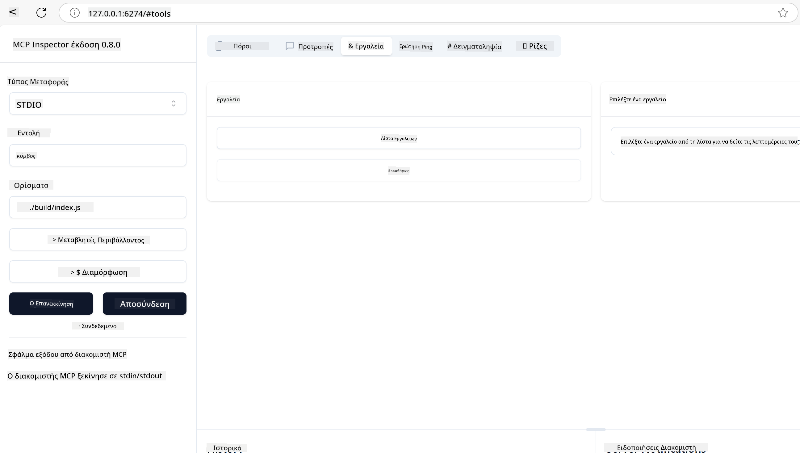
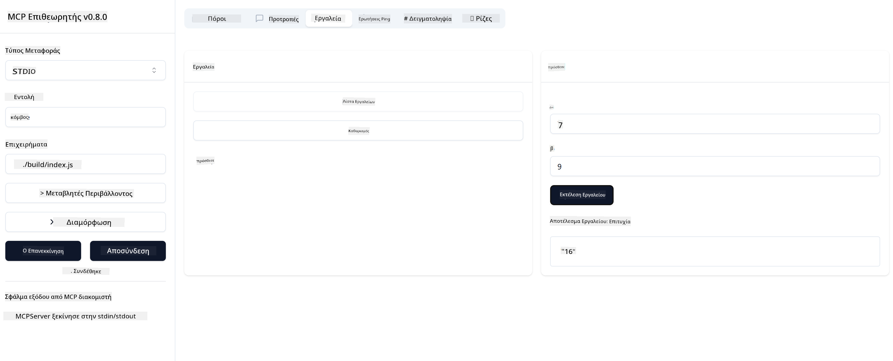

<!--
CO_OP_TRANSLATOR_METADATA:
{
  "original_hash": "5331ffd328a54b90f76706c52b673e27",
  "translation_date": "2025-05-17T08:36:15+00:00",
  "source_file": "03-GettingStarted/01-first-server/README.md",
  "language_code": "el"
}
-->
# Ξεκινώντας με το MCP

Καλώς ήρθατε στα πρώτα σας βήματα με το Model Context Protocol (MCP)! Είτε είστε νέοι στο MCP είτε θέλετε να εμβαθύνετε την κατανόησή σας, αυτός ο οδηγός θα σας καθοδηγήσει στη βασική ρύθμιση και διαδικασία ανάπτυξης. Θα ανακαλύψετε πώς το MCP επιτρέπει την απρόσκοπτη ενσωμάτωση μεταξύ μοντέλων AI και εφαρμογών, και θα μάθετε πώς να προετοιμάσετε γρήγορα το περιβάλλον σας για την κατασκευή και δοκιμή λύσεων με MCP.

> TLDR; Αν κατασκευάζετε εφαρμογές AI, γνωρίζετε ότι μπορείτε να προσθέσετε εργαλεία και άλλους πόρους στο LLM (μεγάλο γλωσσικό μοντέλο), για να το κάνετε πιο γνωστικό. Ωστόσο, αν τοποθετήσετε αυτά τα εργαλεία και τους πόρους σε έναν διακομιστή, η εφαρμογή και οι δυνατότητες του διακομιστή μπορούν να χρησιμοποιηθούν από οποιονδήποτε πελάτη με/χωρίς LLM.

## Επισκόπηση

Αυτό το μάθημα παρέχει πρακτικές οδηγίες για τη ρύθμιση περιβαλλόντων MCP και την κατασκευή των πρώτων σας εφαρμογών MCP. Θα μάθετε πώς να ρυθμίζετε τα απαραίτητα εργαλεία και πλαίσια, να κατασκευάζετε βασικούς διακομιστές MCP, να δημιουργείτε εφαρμογές υποδοχής και να δοκιμάζετε τις υλοποιήσεις σας.

Το Model Context Protocol (MCP) είναι ένα ανοικτό πρωτόκολλο που τυποποιεί τον τρόπο με τον οποίο οι εφαρμογές παρέχουν πλαίσιο στα LLMs. Σκεφτείτε το MCP σαν μια θύρα USB-C για εφαρμογές AI - παρέχει έναν τυποποιημένο τρόπο σύνδεσης των μοντέλων AI με διάφορες πηγές δεδομένων και εργαλεία.

## Στόχοι Μάθησης

Μέχρι το τέλος αυτού του μαθήματος, θα μπορείτε να:

- Ρυθμίσετε περιβάλλοντα ανάπτυξης για MCP σε C#, Java, Python, TypeScript και JavaScript
- Κατασκευάσετε και αναπτύξετε βασικούς διακομιστές MCP με προσαρμοσμένα χαρακτηριστικά (πόροι, προτροπές και εργαλεία)
- Δημιουργήσετε εφαρμογές υποδοχής που συνδέονται με διακομιστές MCP
- Δοκιμάσετε και εντοπίσετε σφάλματα στις υλοποιήσεις MCP

## Ρύθμιση του Περιβάλλοντός σας για MCP

Πριν ξεκινήσετε να εργάζεστε με το MCP, είναι σημαντικό να προετοιμάσετε το περιβάλλον ανάπτυξής σας και να κατανοήσετε τη βασική ροή εργασίας. Αυτή η ενότητα θα σας καθοδηγήσει στα αρχικά βήματα ρύθμισης για να εξασφαλίσετε μια ομαλή εκκίνηση με το MCP.

### Προαπαιτούμενα

Πριν προχωρήσετε στην ανάπτυξη με το MCP, βεβαιωθείτε ότι έχετε:

- **Περιβάλλον Ανάπτυξης**: Για την επιλεγμένη γλώσσα σας (C#, Java, Python, TypeScript ή JavaScript)
- **IDE/Επεξεργαστή**: Visual Studio, Visual Studio Code, IntelliJ, Eclipse, PyCharm, ή οποιονδήποτε σύγχρονο επεξεργαστή κώδικα
- **Διαχειριστές Πακέτων**: NuGet, Maven/Gradle, pip, ή npm/yarn
- **Κλειδιά API**: Για οποιεσδήποτε υπηρεσίες AI σκοπεύετε να χρησιμοποιήσετε στις εφαρμογές υποδοχής σας

## Βασική Δομή Διακομιστή MCP

Ένας διακομιστής MCP συνήθως περιλαμβάνει:

- **Διαμόρφωση Διακομιστή**: Ρύθμιση θύρας, πιστοποίηση και άλλες ρυθμίσεις
- **Πόροι**: Δεδομένα και πλαίσιο διαθέσιμο στα LLMs
- **Εργαλεία**: Λειτουργικότητα που μπορούν να καλέσουν τα μοντέλα
- **Προτροπές**: Πρότυπα για τη δημιουργία ή τη δομή κειμένου

Εδώ είναι ένα απλοποιημένο παράδειγμα σε TypeScript:

```typescript
import { Server, Tool, Resource } from "@modelcontextprotocol/typescript-server-sdk";

// Create a new MCP server
const server = new Server({
  port: 3000,
  name: "Example MCP Server",
  version: "1.0.0"
});

// Register a tool
server.registerTool({
  name: "calculator",
  description: "Performs basic calculations",
  parameters: {
    expression: {
      type: "string",
      description: "The math expression to evaluate"
    }
  },
  handler: async (params) => {
    const result = eval(params.expression);
    return { result };
  }
});

// Start the server
server.start();
```

Στον προηγούμενο κώδικα:

- Εισάγουμε τις απαραίτητες κλάσεις από το MCP TypeScript SDK.
- Δημιουργούμε και διαμορφώνουμε μια νέα παρουσία διακομιστή MCP.
- Καταχωρούμε ένα προσαρμοσμένο εργαλείο (`calculator`) με μια συνάρτηση χειριστή.
- Ξεκινάμε τον διακομιστή για να ακούει εισερχόμενα αιτήματα MCP.

## Δοκιμή και Εντοπισμός Σφαλμάτων

Πριν ξεκινήσετε τη δοκιμή του διακομιστή MCP σας, είναι σημαντικό να κατανοήσετε τα διαθέσιμα εργαλεία και τις καλύτερες πρακτικές για τον εντοπισμό σφαλμάτων. Η αποτελεσματική δοκιμή εξασφαλίζει ότι ο διακομιστής σας λειτουργεί όπως αναμένεται και σας βοηθά να εντοπίσετε και να επιλύσετε γρήγορα προβλήματα. Η επόμενη ενότητα περιγράφει τις συνιστώμενες προσεγγίσεις για την επικύρωση της υλοποίησης του MCP σας.

Το MCP παρέχει εργαλεία για να σας βοηθήσει να δοκιμάσετε και να εντοπίσετε σφάλματα στους διακομιστές σας:

- **Εργαλείο Επιθεώρησης**, αυτή η γραφική διεπαφή σας επιτρέπει να συνδεθείτε με τον διακομιστή σας και να δοκιμάσετε τα εργαλεία, τις προτροπές και τους πόρους σας.
- **curl**, μπορείτε επίσης να συνδεθείτε με τον διακομιστή σας χρησιμοποιώντας ένα εργαλείο γραμμής εντολών όπως το curl ή άλλους πελάτες που μπορούν να δημιουργήσουν και να εκτελέσουν εντολές HTTP.

### Χρήση του MCP Inspector

Το [MCP Inspector](https://github.com/modelcontextprotocol/inspector) είναι ένα οπτικό εργαλείο δοκιμών που σας βοηθά να:

1. **Ανακαλύψετε τις Δυνατότητες του Διακομιστή**: Αυτόματη ανίχνευση διαθέσιμων πόρων, εργαλείων και προτροπών
2. **Δοκιμή Εκτέλεσης Εργαλείων**: Δοκιμάστε διαφορετικές παραμέτρους και δείτε τις απαντήσεις σε πραγματικό χρόνο
3. **Προβολή Μεταδεδομένων Διακομιστή**: Εξετάστε πληροφορίες διακομιστή, σχήματα και διαμορφώσεις

```bash
# ex TypeScript, installing and running MCP Inspector
npx @modelcontextprotocol/inspector node build/index.js
```

Όταν εκτελείτε τις παραπάνω εντολές, το MCP Inspector θα εκκινήσει μια τοπική διεπαφή ιστού στο πρόγραμμα περιήγησής σας. Μπορείτε να περιμένετε να δείτε έναν πίνακα ελέγχου που εμφανίζει τους καταχωρημένους διακομιστές MCP σας, τα διαθέσιμα εργαλεία, πόρους και προτροπές. Η διεπαφή σας επιτρέπει να δοκιμάσετε διαδραστικά την εκτέλεση εργαλείων, να επιθεωρήσετε τα μεταδεδομένα του διακομιστή και να δείτε απαντήσεις σε πραγματικό χρόνο, καθιστώντας ευκολότερη την επικύρωση και τον εντοπισμό σφαλμάτων στις υλοποιήσεις διακομιστή MCP.

Ακολουθεί ένα στιγμιότυπο του τι μπορεί να φαίνεται:



## Συνήθη Προβλήματα Ρύθμισης και Λύσεις

| Πρόβλημα | Πιθανή Λύση |
|-------|-------------------|
| Άρνηση σύνδεσης | Ελέγξτε αν ο διακομιστής λειτουργεί και αν η θύρα είναι σωστή |
| Σφάλματα εκτέλεσης εργαλείων | Ελέγξτε την επικύρωση παραμέτρων και την αντιμετώπιση σφαλμάτων |
| Αποτυχίες πιστοποίησης | Επαληθεύστε τα κλειδιά API και τα δικαιώματα |
| Σφάλματα επικύρωσης σχήματος | Βεβαιωθείτε ότι οι παράμετροι ταιριάζουν με το καθορισμένο σχήμα |
| Ο διακομιστής δεν ξεκινά | Ελέγξτε για συγκρούσεις θυρών ή ελλείποντα εξαρτήματα |
| Σφάλματα CORS | Διαμορφώστε κατάλληλες κεφαλίδες CORS για αιτήματα διαφορετικής προέλευσης |
| Ζητήματα πιστοποίησης | Επαληθεύστε την εγκυρότητα και τα δικαιώματα των διακριτικών |

## Τοπική Ανάπτυξη

Για τοπική ανάπτυξη και δοκιμή, μπορείτε να εκτελέσετε διακομιστές MCP απευθείας στον υπολογιστή σας:

1. **Ξεκινήστε τη διαδικασία του διακομιστή**: Εκτελέστε την εφαρμογή διακομιστή MCP σας
2. **Διαμορφώστε τη δικτύωση**: Βεβαιωθείτε ότι ο διακομιστής είναι προσβάσιμος στην αναμενόμενη θύρα
3. **Συνδέστε πελάτες**: Χρησιμοποιήστε τοπικές διευθύνσεις σύνδεσης όπως `http://localhost:3000`

```bash
# Example: Running a TypeScript MCP server locally
npm run start
# Server running at http://localhost:3000
```

## Κατασκευή του πρώτου σας Διακομιστή MCP

Έχουμε καλύψει [Βασικές έννοιες](/01-CoreConcepts/README.md) σε ένα προηγούμενο μάθημα, τώρα είναι ώρα να εφαρμόσουμε αυτή τη γνώση.

### Τι μπορεί να κάνει ένας διακομιστής

Πριν ξεκινήσουμε να γράφουμε κώδικα, ας θυμηθούμε τι μπορεί να κάνει ένας διακομιστής:

Ένας διακομιστής MCP μπορεί για παράδειγμα:

- Να έχει πρόσβαση σε τοπικά αρχεία και βάσεις δεδομένων
- Να συνδέεται με απομακρυσμένα APIs
- Να εκτελεί υπολογισμούς
- Να ενσωματώνεται με άλλα εργαλεία και υπηρεσίες
- Να παρέχει διεπαφή χρήστη για αλληλεπίδραση

Ωραία, τώρα που ξέρουμε τι μπορούμε να κάνουμε με αυτό, ας αρχίσουμε να γράφουμε κώδικα.

## Άσκηση: Δημιουργία διακομιστή

Για να δημιουργήσετε έναν διακομιστή, πρέπει να ακολουθήσετε αυτά τα βήματα:

- Εγκαταστήστε το MCP SDK.
- Δημιουργήστε ένα έργο και ρυθμίστε τη δομή του έργου.
- Γράψτε τον κώδικα του διακομιστή.
- Δοκιμάστε τον διακομιστή.

### -1- Εγκαταστήστε το SDK

Αυτό διαφέρει λίγο ανάλογα με το επιλεγμένο περιβάλλον εκτέλεσης, οπότε επιλέξτε ένα από τα παρακάτω περιβάλλοντα εκτέλεσης:

Η Γενετική AI μπορεί να δημιουργήσει κείμενο, εικόνες και ακόμη και κώδικα. Έχετε εκπαιδευτεί σε δεδομένα μέχρι τον Οκτώβριο του 2023.

### -2- Δημιουργήστε έργο

Τώρα που έχετε εγκαταστήσει το SDK σας, ας δημιουργήσουμε το επόμενο έργο:

### -3- Δημιουργήστε αρχεία έργου

### -4- Δημιουργήστε κώδικα διακομιστή

### -5- Προσθέστε ένα εργαλείο και έναν πόρο

Προσθέστε ένα εργαλείο και έναν πόρο προσθέτοντας τον ακόλουθο κώδικα:

### -6 Τελικός κώδικας

Ας προσθέσουμε τον τελευταίο κώδικα που χρειαζόμαστε ώστε ο διακομιστής να ξεκινήσει:

### -7- Δοκιμάστε τον διακομιστή

Ξεκινήστε τον διακομιστή με την ακόλουθη εντολή:

### -8- Εκτελέστε χρησιμοποιώντας τον επιθεωρητή

Ο επιθεωρητής είναι ένα εξαιρετικό εργαλείο που μπορεί να εκκινήσει τον διακομιστή σας και σας επιτρέπει να αλληλεπιδράσετε μαζί του, ώστε να μπορείτε να δοκιμάσετε ότι λειτουργεί. Ας το ξεκινήσουμε:

> [!NOTE]
> μπορεί να φαίνεται διαφορετικό στο πεδίο "εντολή" καθώς περιέχει την εντολή για την εκτέλεση ενός διακομιστή με το συγκεκριμένο περιβάλλον εκτέλεσης σας

Θα πρέπει να δείτε την ακόλουθη διεπαφή χρήστη:


1. Συνδεθείτε με τον διακομιστή επιλέγοντας το κουμπί Σύνδεση 
  Αφού συνδεθείτε με τον διακομιστή, θα πρέπει τώρα να δείτε τα εξής:

  

1. Επιλέξτε "Εργαλεία" και "listTools", θα πρέπει να δείτε το "Add" να εμφανίζεται, επιλέξτε το "Add" και συμπληρώστε τις τιμές παραμέτρων.

  Θα πρέπει να δείτε την ακόλουθη απάντηση, δηλαδή ένα αποτέλεσμα από το εργαλείο "add":

  

Συγχαρητήρια, καταφέρατε να δημιουργήσετε και να εκτελέσετε τον πρώτο σας διακομιστή!

### Επίσημα SDKs

Το MCP παρέχει επίσημα SDKs για πολλές γλώσσες:
- [C# SDK](https://github.com/modelcontextprotocol/csharp-sdk) - Συντηρείται σε συνεργασία με τη Microsoft
- [Java SDK](https://github.com/modelcontextprotocol/java-sdk) - Συντηρείται σε συνεργασία με το Spring AI
- [TypeScript SDK](https://github.com/modelcontextprotocol/typescript-sdk) - Η επίσημη υλοποίηση TypeScript
- [Python SDK](https://github.com/modelcontextprotocol/python-sdk) - Η επίσημη υλοποίηση Python
- [Kotlin SDK](https://github.com/modelcontextprotocol/kotlin-sdk) - Η επίσημη υλοποίηση Kotlin
- [Swift SDK](https://github.com/modelcontextprotocol/swift-sdk) - Συντηρείται σε συνεργασία με το Loopwork AI
- [Rust SDK](https://github.com/modelcontextprotocol/rust-sdk) - Η επίσημη υλοποίηση Rust

## Βασικά Σημεία

- Η ρύθμιση ενός περιβάλλοντος ανάπτυξης MCP είναι απλή με τα SDKs που είναι ειδικά για κάθε γλώσσα
- Η κατασκευή διακομιστών MCP περιλαμβάνει τη δημιουργία και καταχώρηση εργαλείων με σαφή σχήματα
- Η δοκιμή και ο εντοπισμός σφαλμάτων είναι απαραίτητα για αξιόπιστες υλοποιήσεις MCP

## Δείγματα

- [Java Calculator](../samples/java/calculator/README.md)
- [.Net Calculator](../../../../03-GettingStarted/samples/csharp)
- [JavaScript Calculator](../samples/javascript/README.md)
- [TypeScript Calculator](../samples/typescript/README.md)
- [Python Calculator](../../../../03-GettingStarted/samples/python)

## Ανάθεση

Δημιουργήστε έναν απλό διακομιστή MCP με ένα εργαλείο της επιλογής σας:
1. Υλοποιήστε το εργαλείο στην προτιμώμενη γλώσσα σας (.NET, Java, Python ή JavaScript).
2. Ορίστε παραμέτρους εισόδου και τιμές επιστροφής.
3. Εκτελέστε το εργαλείο επιθεώρησης για να βεβαιωθείτε ότι ο διακομιστής λειτουργεί όπως αναμένεται.
4. Δοκιμάστε την υλοποίηση με διάφορες εισόδους.

## Λύση

[Λύση](./solution/README.md)

## Πρόσθετοι Πόροι

- [Αποθετήριο MCP στο GitHub](https://github.com/microsoft/mcp-for-beginners)

## Τι ακολουθεί

Επόμενο: [Ξεκινώντας με MCP Clients](/03-GettingStarted/02-client/README.md)

**Αποποίηση ευθυνών**:  
Αυτό το έγγραφο έχει μεταφραστεί χρησιμοποιώντας την υπηρεσία αυτόματης μετάφρασης [Co-op Translator](https://github.com/Azure/co-op-translator). Παρόλο που επιδιώκουμε την ακρίβεια, παρακαλούμε να γνωρίζετε ότι οι αυτοματοποιημένες μεταφράσεις μπορεί να περιέχουν σφάλματα ή ανακρίβειες. Το αρχικό έγγραφο στη μητρική του γλώσσα πρέπει να θεωρείται η αυθεντική πηγή. Για κρίσιμες πληροφορίες, συνιστάται επαγγελματική ανθρώπινη μετάφραση. Δεν φέρουμε ευθύνη για τυχόν παρανοήσεις ή παρερμηνείες που προκύπτουν από τη χρήση αυτής της μετάφρασης.